# 📘 23 Design Patterns — Hướng Dẫn Đầy Đủ & Chi Tiết

> **Tác giả tham khảo**: Gang of Four (GoF) — Erich Gamma, Richard Helm, Ralph Johnson, John Vlissides  
> **Ngôn ngữ minh họa**: Python 3.x  
> **Mục tiêu**: Hiểu sâu, áp dụng đúng 23 Design Pattern kinh điển

---

## 📑 Mục Lục

| # | Nhóm | Pattern |
|---|------|---------|
| **Creational** | Khởi tạo đối tượng | |
| 1 | 🏭 Creational | [Singleton](#1-singleton) |
| 2 | 🏭 Creational | [Factory Method](#2-factory-method) |
| 3 | 🏭 Creational | [Abstract Factory](#3-abstract-factory) |
| 4 | 🏭 Creational | [Builder](#4-builder) |
| 5 | 🏭 Creational | [Prototype](#5-prototype) |
| **Structural** | Cấu trúc lớp/đối tượng | |
| 6 | 🏗️ Structural | [Adapter](#6-adapter) |
| 7 | 🏗️ Structural | [Bridge](#7-bridge) |
| 8 | 🏗️ Structural | [Composite](#8-composite) |
| 9 | 🏗️ Structural | [Decorator](#9-decorator) |
| 10 | 🏗️ Structural | [Facade](#10-facade) |
| 11 | 🏗️ Structural | [Flyweight](#11-flyweight) |
| 12 | 🏗️ Structural | [Proxy](#12-proxy) |
| **Behavioral** | Hành vi và giao tiếp | |
| 13 | 🎭 Behavioral | [Chain of Responsibility](#13-chain-of-responsibility) |
| 14 | 🎭 Behavioral | [Command](#14-command) |
| 15 | 🎭 Behavioral | [Iterator](#15-iterator) |
| 16 | 🎭 Behavioral | [Mediator](#16-mediator) |
| 17 | 🎭 Behavioral | [Memento](#17-memento) |
| 18 | 🎭 Behavioral | [Observer](#18-observer) |
| 19 | 🎭 Behavioral | [State](#19-state) |
| 20 | 🎭 Behavioral | [Strategy](#20-strategy) |
| 21 | 🎭 Behavioral | [Template Method](#21-template-method) |
| 22 | 🎭 Behavioral | [Visitor](#22-visitor) |
| 23 | 🎭 Behavioral | [Interpreter](#23-interpreter) |

---

## Tong Quan 3 Nhom Pattern

```
Design Patterns
├── Creational (5)     - Giai quyet VAN DE KHOI TAO doi tuong
│   ├── Singleton          - 1 instance duy nhat
│   ├── Factory Method     - De subclass quyet dinh tao object nao
│   ├── Abstract Factory   - Tao ho cac object lien quan
│   ├── Builder            - Xay dung object phuc tap tung buoc
│   └── Prototype          - Clone object hien co
│
├── Structural (7)     - Giai quyet VAN DE CAU TRUC lop/object
│   ├── Adapter            - Chuyen doi interface khong tuong thich
│   ├── Bridge             - Tach abstraction khoi implementation
│   ├── Composite          - Cau truc cay phan-toan the
│   ├── Decorator          - Them hanh vi vao object dong
│   ├── Facade             - Interface don gian cho he thong phuc tap
│   ├── Flyweight          - Chia se du lieu de tiet kiem memory
│   └── Proxy              - Object dai dien/thay the
│
└── Behavioral (11)    - Giai quyet VAN DE GIAO TIEP giua objects
    ├── Chain of Resp.     - Chuoi xu ly request
    ├── Command            - Dong goi request thanh object
    ├── Iterator           - Duyet collection tuan tu
    ├── Mediator           - Trung gian quan ly giao tiep
    ├── Memento            - Luu/khoi phuc trang thai
    ├── Observer           - Thong bao khi state thay doi
    ├── State              - Thay doi hanh vi theo trang thai
    ├── Strategy           - Hoan doi thuat toan linh hoat
    ├── Template Method    - Khung thuat toan voi buoc tuy chinh
    ├── Visitor            - Them thao tac vao object khong sua class
    └── Interpreter        - Ngon ngu/grammar don gian
```

---

# CREATIONAL PATTERNS

---

## 1. Singleton

### Dinh Nghia
> **Singleton** dam bao mot class chi co **dung mot instance** duy nhat va cung cap mot diem truy cap toan cuc den instance do.

### Van De Giai Quyet
- Can dam bao chi co **1 instance** cua class (database connection, logger, config manager)
- Can **diem truy cap toan cuc** ma khong dung bien global tho

### Khi Nao Ap Dung
- Database connection pool
- Logger / Configuration manager
- Thread pool, Cache manager
- Hardware interface (printer spooler)

### Uu Diem
- Dam bao chi 1 instance, tiet kiem tai nguyen
- Cung cap diem truy cap toan cuc co kiem soat
- Instance duoc khoi tao lazy (khi can)

### Nhuoc Diem
- Vi pham **Single Responsibility Principle** (quan ly ca vong doi)
- Kho unit test (global state)
- Van de trong moi truong **multithreading** neu khong can than
- Anti-pattern trong nhieu truong hop (khuyen khich dung DI thay the)

### Class Diagram
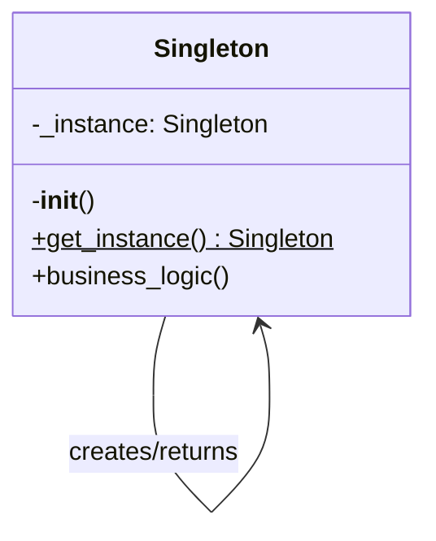
```mermaid
classDiagram
    class Singleton {
        -_instance: Singleton
        -__init__()
        +get_instance()$ Singleton
        +business_logic()
    }
    Singleton --> Singleton : creates/returns
```

### Code Python
```python
import threading

class Singleton:
    """Thread-safe Singleton implementation."""
    _instance = None
    _lock = threading.Lock()

    def __new__(cls):
        # Double-checked locking
        if cls._instance is None:
            with cls._lock:
                if cls._instance is None:
                    cls._instance = super().__new__(cls)
                    cls._instance._initialized = False
        return cls._instance

    def __init__(self):
        # Chi init 1 lan
        if not self._initialized:
            self.data = {}
            self._initialized = True
            print("Singleton instance created!")

    def set(self, key, value):
        self.data[key] = value

    def get(self, key):
        return self.data.get(key)


class Logger(Singleton):
    """Logger dung Singleton - chi 1 instance trong toan app."""

    def log(self, message: str):
        print(f"[LOG] {message}")


if __name__ == "__main__":
    s1 = Singleton()
    s2 = Singleton()

    s1.set("name", "Alice")
    print(s2.get("name"))   # Alice - cung object!
    print(s1 is s2)          # True

    logger1 = Logger()
    logger2 = Logger()
    logger1.log("App started")
    print(logger1 is logger2)  # True
```

### Sequence Diagram
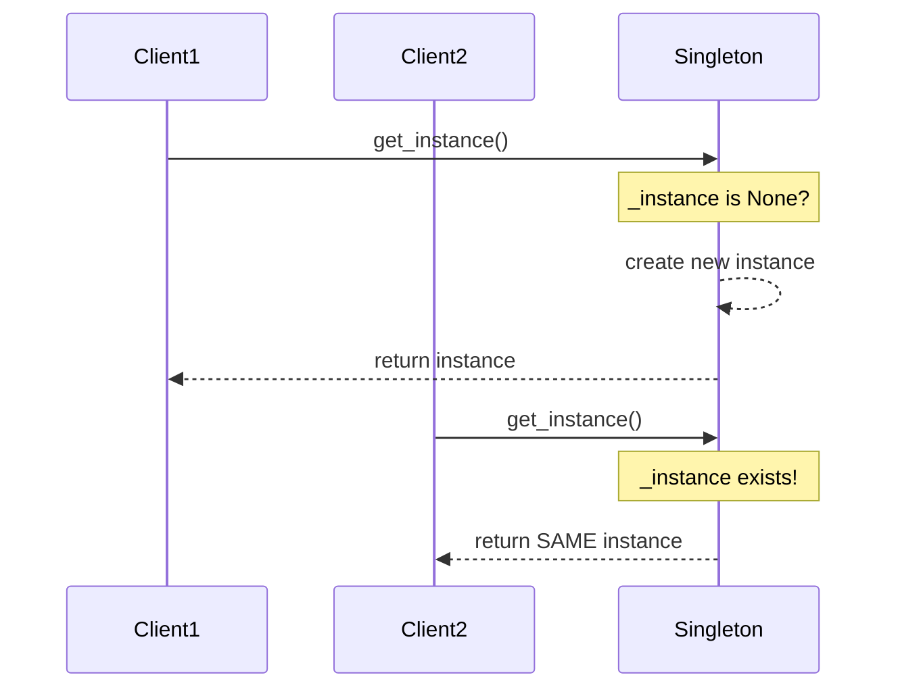
```mermaid
sequenceDiagram
    participant Client1
    participant Client2
    participant Singleton

    Client1->>Singleton: get_instance()
    Note over Singleton: _instance is None?
    Singleton-->>Singleton: create new instance
    Singleton-->>Client1: return instance

    Client2->>Singleton: get_instance()
    Note over Singleton: _instance exists!
    Singleton-->>Client2: return SAME instance
```

---

## 2. Factory Method

### Dinh Nghia
> **Factory Method** dinh nghia mot interface de tao object, nhung de **subclass quyet dinh** class nao se duoc khoi tao. Factory Method cho phep class tri hoan viec khoi tao den subclass.

### Van De Giai Quyet
- Khong biet truoc **loai object** can tao
- Muon subclass co the **ghi de** loai object duoc tao
- Giai phong client khoi viec biet class cu the

### Khi Nao Ap Dung
- Framework can tao object ma khong biet loai cu the
- Plugin system
- Tao UI element khac nhau theo platform
- Payment gateway (Paypal, Credit Card, ...)

### Uu Diem
- Tuan thu **Open/Closed Principle** — them product moi khong sua code cu
- Giam coupling giua creator va concrete product
- **Single Responsibility** — code tao product tach khoi logic dung

### Nhuoc Diem
- So luong class tang len (moi product can 1 ConcreteCreator)
- Code co the phuc tap hon can thiet voi app don gian

### Class Diagram
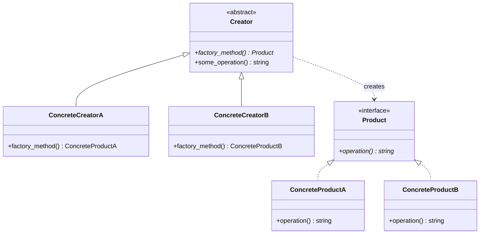
```mermaid
classDiagram
    class Creator {
        <<abstract>>
        +factory_method()* Product
        +some_operation() string
    }

    class ConcreteCreatorA {
        +factory_method() ConcreteProductA
    }

    class ConcreteCreatorB {
        +factory_method() ConcreteProductB
    }

    class Product {
        <<interface>>
        +operation()* string
    }

    class ConcreteProductA {
        +operation() string
    }

    class ConcreteProductB {
        +operation() string
    }

    Creator <|-- ConcreteCreatorA
    Creator <|-- ConcreteCreatorB
    Product <|.. ConcreteProductA
    Product <|.. ConcreteProductB
    Creator ..> Product : creates
```

### Code Python
```python
from abc import ABC, abstractmethod


class Notification(ABC):
    @abstractmethod
    def send(self, message: str) -> str:
        pass


class EmailNotification(Notification):
    def __init__(self, email: str):
        self.email = email

    def send(self, message: str) -> str:
        return f"Email to {self.email}: {message}"


class SMSNotification(Notification):
    def __init__(self, phone: str):
        self.phone = phone

    def send(self, message: str) -> str:
        return f"SMS to {self.phone}: {message}"


class PushNotification(Notification):
    def __init__(self, device_token: str):
        self.device_token = device_token

    def send(self, message: str) -> str:
        return f"Push to {self.device_token}: {message}"


# Creator (Abstract)
class NotificationFactory(ABC):
    @abstractmethod
    def create_notification(self) -> Notification:
        """Factory Method - phai override trong subclass."""
        pass

    def notify(self, message: str) -> str:
        notification = self.create_notification()
        return notification.send(message)


# Concrete Creators
class EmailFactory(NotificationFactory):
    def __init__(self, email: str):
        self.email = email

    def create_notification(self) -> Notification:
        return EmailNotification(self.email)


class SMSFactory(NotificationFactory):
    def __init__(self, phone: str):
        self.phone = phone

    def create_notification(self) -> Notification:
        return SMSNotification(self.phone)


class PushFactory(NotificationFactory):
    def __init__(self, device_token: str):
        self.device_token = device_token

    def create_notification(self) -> Notification:
        return PushNotification(self.device_token)


def send_alert(factory: NotificationFactory, message: str):
    """Client khong biet notification duoc tao ra la loai nao."""
    result = factory.notify(message)
    print(result)


if __name__ == "__main__":
    factories = [
        EmailFactory("alice@example.com"),
        SMSFactory("+84901234567"),
        PushFactory("device_abc_123"),
    ]

    for factory in factories:
        send_alert(factory, "Your order has been shipped!")
```

---

## 3. Abstract Factory

### Dinh Nghia
> **Abstract Factory** cung cap mot interface de tao ra **cac ho (families) cua cac object lien quan** ma khong can chi dinh cac class cu the cua chung.

### Van De Giai Quyet
- Can tao nhieu object lien quan va phai **dam bao chung tuong thich nhau**
- He thong can doc lap voi cach tao va ket hop product
- Vi du: UI theme (Dark/Light) — Button, Checkbox, TextBox phai cung style

### Khi Nao Ap Dung
- Cross-platform UI (Windows/Mac/Linux)
- Database voi nhieu vendor (MySQL/PostgreSQL)
- Game voi nhieu theme (Medieval/Futuristic)
- Khi muon doi toan bo "gia dinh" product de dang

### Uu Diem
- Dam bao tinh **tuong thich** giua cac product trong cung family
- Tuan thu **Open/Closed Principle**
- De dang chuyen doi giua cac product family

### Nhuoc Diem
- Kho them **product moi** (phai sua tat ca Abstract Factory va implementations)
- Nhieu class va interface, code phuc tap hon

### Class Diagram
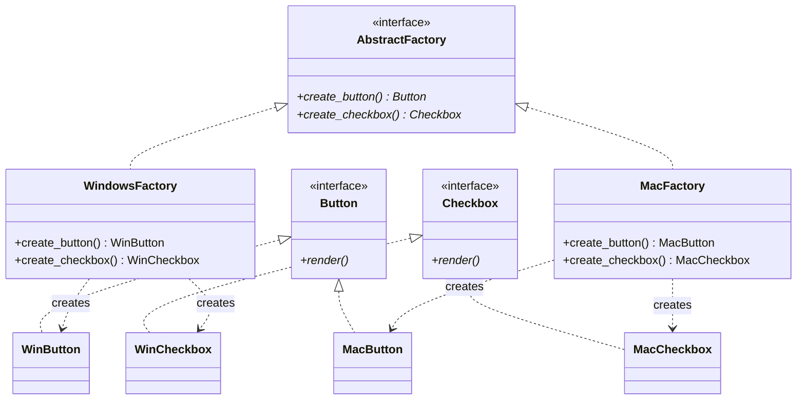
```mermaid
classDiagram
    class AbstractFactory {
        <<interface>>
        +create_button()* Button
        +create_checkbox()* Checkbox
    }

    class WindowsFactory {
        +create_button() WinButton
        +create_checkbox() WinCheckbox
    }

    class MacFactory {
        +create_button() MacButton
        +create_checkbox() MacCheckbox
    }

    class Button {
        <<interface>>
        +render()*
    }

    class Checkbox {
        <<interface>>
        +render()*
    }

    class WinButton
    class MacButton
    class WinCheckbox
    class MacCheckbox

    AbstractFactory <|.. WindowsFactory
    AbstractFactory <|.. MacFactory
    Button <|.. WinButton
    Button <|.. MacButton
    Checkbox <|.. WinCheckbox
    Checkbox <|.. MacCheckbox
    WindowsFactory ..> WinButton : creates
    WindowsFactory ..> WinCheckbox : creates
    MacFactory ..> MacButton : creates
    MacFactory ..> MacCheckbox : creates
```

### Code Python
```python
from abc import ABC, abstractmethod


class Button(ABC):
    @abstractmethod
    def render(self) -> str:
        pass

    @abstractmethod
    def on_click(self) -> str:
        pass


class Checkbox(ABC):
    @abstractmethod
    def render(self) -> str:
        pass

    @abstractmethod
    def toggle(self) -> str:
        pass


class WindowsButton(Button):
    def render(self) -> str:
        return "[ Windows Button ]"

    def on_click(self) -> str:
        return "Windows button clicked with Win32 API"


class WindowsCheckbox(Checkbox):
    def render(self) -> str:
        return "[v] Windows Checkbox"

    def toggle(self) -> str:
        return "Windows checkbox toggled"


class MacButton(Button):
    def render(self) -> str:
        return "( Mac Button )"

    def on_click(self) -> str:
        return "Mac button clicked with Cocoa framework"


class MacCheckbox(Checkbox):
    def render(self) -> str:
        return "[x] Mac Checkbox"

    def toggle(self) -> str:
        return "Mac checkbox toggled with animation"


class GUIFactory(ABC):
    @abstractmethod
    def create_button(self) -> Button:
        pass

    @abstractmethod
    def create_checkbox(self) -> Checkbox:
        pass


class WindowsFactory(GUIFactory):
    def create_button(self) -> Button:
        return WindowsButton()

    def create_checkbox(self) -> Checkbox:
        return WindowsCheckbox()


class MacFactory(GUIFactory):
    def create_button(self) -> Button:
        return MacButton()

    def create_checkbox(self) -> Checkbox:
        return MacCheckbox()


class Application:
    def __init__(self, factory: GUIFactory):
        self.button = factory.create_button()
        self.checkbox = factory.create_checkbox()

    def render_ui(self):
        print(f"Button:   {self.button.render()}")
        print(f"Checkbox: {self.checkbox.render()}")

    def simulate_interaction(self):
        print(self.button.on_click())
        print(self.checkbox.toggle())


def create_app(os_type: str) -> Application:
    factories = {
        "windows": WindowsFactory(),
        "mac": MacFactory(),
    }
    factory = factories.get(os_type.lower())
    if not factory:
        raise ValueError(f"Unknown OS: {os_type}")
    return Application(factory)


if __name__ == "__main__":
    for os_name in ["windows", "mac"]:
        print(f"\n=== {os_name.upper()} UI ===")
        app = create_app(os_name)
        app.render_ui()
        app.simulate_interaction()
```

---

## 4. Builder

### Dinh Nghia
> **Builder** tach biet viec xay dung mot object phuc tap khoi su bieu dien cua no, cho phep cung mot qua trinh xay dung tao ra **cac bieu dien khac nhau**.

### Van De Giai Quyet
- Object co **nhieu tham so** hoac **cau hinh phuc tap**
- Constructor co qua nhieu tham so (telescoping constructor anti-pattern)
- Can tao nhieu **bien the** cua cung mot loai object

### Khi Nao Ap Dung
- Xay dung object phuc tap (SQL query, HTTP request, pizza order)
- Khi constructor co nhieu optional parameters
- Tao document (PDF, HTML, XML) voi cung du lieu

### Uu Diem
- Tao object **tung buoc** — kiem soat tot hon
- **Tai su dung** code xay dung cho cac bieu dien khac nhau
- **Single Responsibility** — tach logic xay dung ra rieng

### Nhuoc Diem
- Tang do phuc tap do phai tao nhieu class moi
- Client phai bind voi ConcreteBuilder cu the

### Class Diagram
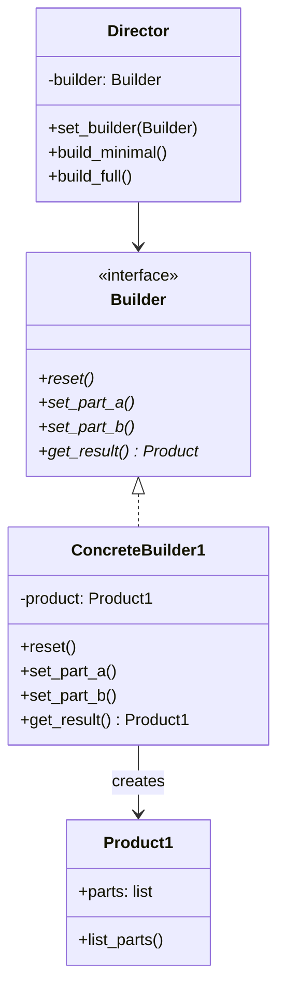
```mermaid
classDiagram
    class Director {
        -builder: Builder
        +set_builder(Builder)
        +build_minimal()
        +build_full()
    }

    class Builder {
        <<interface>>
        +reset()*
        +set_part_a()*
        +set_part_b()*
        +get_result()* Product
    }

    class ConcreteBuilder1 {
        -product: Product1
        +reset()
        +set_part_a()
        +set_part_b()
        +get_result() Product1
    }

    class Product1 {
        +parts: list
        +list_parts()
    }

    Director --> Builder
    Builder <|.. ConcreteBuilder1
    ConcreteBuilder1 --> Product1 : creates
```

### Code Python
```python
from dataclasses import dataclass, field


@dataclass
class Pizza:
    size: str = ""
    crust: str = ""
    sauce: str = ""
    cheese: str = ""
    toppings: list = field(default_factory=list)
    extra_cheese: bool = False
    thin_crust: bool = False

    def __str__(self):
        toppings_str = ", ".join(self.toppings) if self.toppings else "none"
        return (
            f"Pizza [{self.size}]\n"
            f"   Crust: {self.crust}\n"
            f"   Sauce: {self.sauce}\n"
            f"   Cheese: {self.cheese} {'(extra)' if self.extra_cheese else ''}\n"
            f"   Toppings: {toppings_str}\n"
            f"   Thin crust: {self.thin_crust}"
        )


class PizzaBuilder:
    def __init__(self):
        self.reset()

    def reset(self):
        self._pizza = Pizza()
        return self

    def set_size(self, size: str):
        self._pizza.size = size
        return self  # method chaining!

    def set_crust(self, crust: str):
        self._pizza.crust = crust
        return self

    def set_sauce(self, sauce: str):
        self._pizza.sauce = sauce
        return self

    def set_cheese(self, cheese: str):
        self._pizza.cheese = cheese
        return self

    def add_topping(self, topping: str):
        self._pizza.toppings.append(topping)
        return self

    def with_extra_cheese(self):
        self._pizza.extra_cheese = True
        return self

    def with_thin_crust(self):
        self._pizza.thin_crust = True
        return self

    def build(self) -> Pizza:
        pizza = self._pizza
        self.reset()
        return pizza


class PizzaDirector:
    def __init__(self, builder: PizzaBuilder):
        self._builder = builder

    def make_margherita(self) -> Pizza:
        return (
            self._builder
            .set_size("medium")
            .set_crust("thin")
            .set_sauce("tomato")
            .set_cheese("mozzarella")
            .add_topping("basil")
            .build()
        )

    def make_pepperoni(self) -> Pizza:
        return (
            self._builder
            .set_size("large")
            .set_crust("thick")
            .set_sauce("tomato")
            .set_cheese("mozzarella")
            .add_topping("pepperoni")
            .add_topping("olives")
            .with_extra_cheese()
            .build()
        )


if __name__ == "__main__":
    builder = PizzaBuilder()
    director = PizzaDirector(builder)

    print("=== Standard Pizzas ===")
    print(director.make_margherita())
    print()
    print(director.make_pepperoni())
    print()

    # Custom pizza (khong dung Director)
    print("=== Custom Pizza ===")
    custom = (
        PizzaBuilder()
        .set_size("extra-large")
        .set_crust("stuffed")
        .set_sauce("bbq")
        .set_cheese("cheddar")
        .add_topping("chicken")
        .add_topping("bacon")
        .with_extra_cheese()
        .build()
    )
    print(custom)
```

---

## 5. Prototype

### Dinh Nghia
> **Prototype** cho phep copy (clone) cac object hien co ma khong lam cho code phu thuoc vao cac class cua chung.

### Van De Giai Quyet
- Tao object moi bang cach **copy** object da co thay vi khoi tao tu dau
- Tranh chi phi tao object phuc tap (ket noi DB, tinh toan phuc tap)
- Can nhieu object tuong tu nhau voi vai thay doi nho

### Khi Nao Ap Dung
- Khi khoi tao object ton kem (DB query, network call)
- Game: spawn nhieu enemy cung loai
- Template documents, cau hinh mac dinh
- Khi muon tranh class hierarchy cua factories

### Uu Diem
- Clone object **nhanh** hon tao moi tu dau
- Giam so luong subclass
- Co the clone object phuc tap voi state hien tai

### Nhuoc Diem
- Clone object voi **circular references** rat kho
- Phan biet **shallow copy** vs **deep copy** de gay bug
- Phai implement clone() trong tat ca class

### Class Diagram
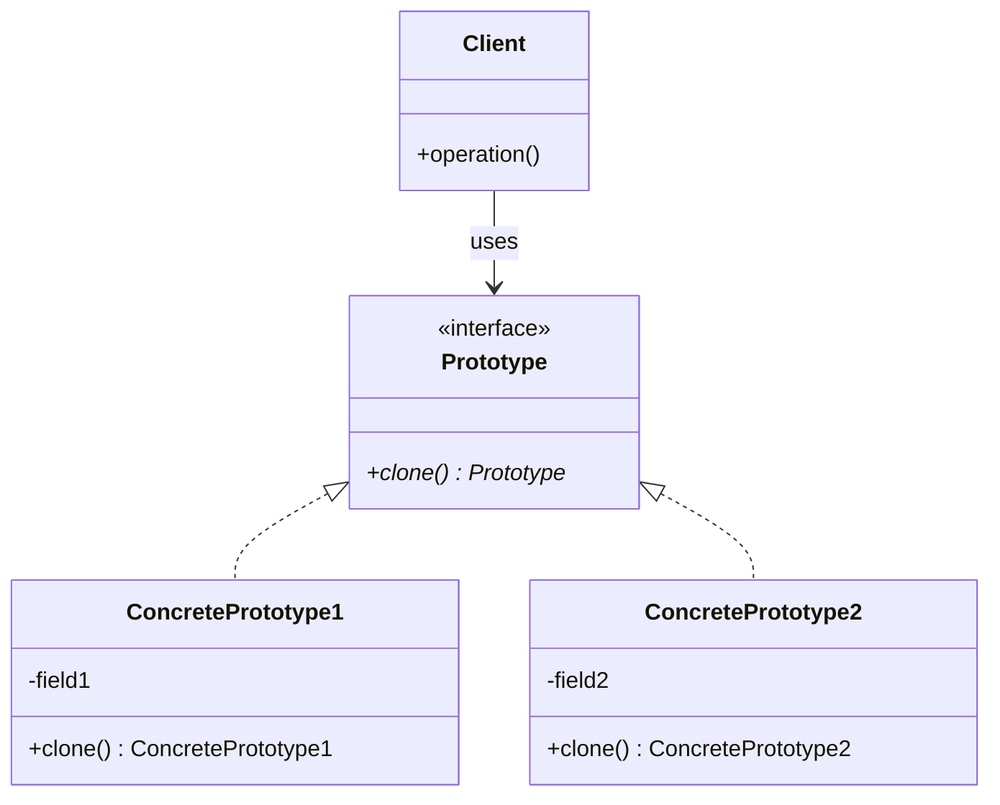
```mermaid
classDiagram
    class Prototype {
        <<interface>>
        +clone()* Prototype
    }

    class ConcretePrototype1 {
        -field1
        +clone() ConcretePrototype1
    }

    class ConcretePrototype2 {
        -field2
        +clone() ConcretePrototype2
    }

    class Client {
        +operation()
    }

    Prototype <|.. ConcretePrototype1
    Prototype <|.. ConcretePrototype2
    Client --> Prototype : uses
```

### Code Python
```python
import copy
from abc import ABC, abstractmethod


class Shape(ABC):
    def __init__(self, color: str = "black"):
        self.color = color
        self.x = 0
        self.y = 0

    @abstractmethod
    def clone(self) -> "Shape":
        pass

    @abstractmethod
    def draw(self) -> str:
        pass

    def move_to(self, x: int, y: int):
        self.x = x
        self.y = y
        return self


class Circle(Shape):
    def __init__(self, color: str = "black", radius: int = 10):
        super().__init__(color)
        self.radius = radius

    def clone(self) -> "Circle":
        return copy.deepcopy(self)

    def draw(self) -> str:
        return f"Circle(color={self.color}, radius={self.radius}, pos=({self.x},{self.y}))"


class Rectangle(Shape):
    def __init__(self, color: str = "black", width: int = 10, height: int = 5):
        super().__init__(color)
        self.width = width
        self.height = height

    def clone(self) -> "Rectangle":
        return copy.deepcopy(self)

    def draw(self) -> str:
        return f"Rect(color={self.color}, {self.width}x{self.height}, pos=({self.x},{self.y}))"


class Enemy:
    """Enemy phuc tap - tot hon nen clone."""

    def __init__(self, name: str, hp: int, damage: int, skills: list):
        self.name = name
        self.hp = hp
        self.damage = damage
        self.skills = skills
        print(f"  [EXPENSIVE] Creating {name} from scratch...")

    def clone(self) -> "Enemy":
        cloned = copy.deepcopy(self)
        cloned.name = f"{self.name}_clone"
        return cloned

    def __str__(self):
        return f"Enemy({self.name}, HP={self.hp}, DMG={self.damage}, Skills={self.skills})"


if __name__ == "__main__":
    # Shape cloning
    print("=== Shape Cloning ===")
    original_circle = Circle(color="red", radius=20)
    original_circle.move_to(10, 10)

    cloned_circle = original_circle.clone()
    cloned_circle.color = "blue"
    cloned_circle.move_to(50, 50)

    print(original_circle.draw())
    print(cloned_circle.draw())

    # Game enemy cloning
    print("\n=== Game Enemy Cloning ===")
    print("Creating base enemy (expensive):")
    base_goblin = Enemy("Goblin", hp=100, damage=15, skills=["slash", "dodge"])

    print("\nCloning enemies (cheap):")
    goblins = [base_goblin.clone() for _ in range(3)]
    for g in goblins:
        print(f"  {g}")

    # Thay doi clone khong anh huong original
    goblins[0].skills.append("fire")
    print(f"\nOriginal skills: {base_goblin.skills}")  # Khong bi anh huong
    print(f"Clone 0 skills:  {goblins[0].skills}")
```

---

# STRUCTURAL PATTERNS

---

## 6. Adapter

### Dinh Nghia
> **Adapter** cho phep cac object co **interface khong tuong thich** lam viec cung nhau, bang cach wrap object incompatible vao mot adapter.

### Van De Giai Quyet
- Muon dung class cu/thu vien ben ngoai nhung interface **khong khop**
- Khong the sua source code cua class goc (thu vien third-party)
- Vi du: cam o dien 3 chan vao o cam 2 chan can adapter

### Khi Nao Ap Dung
- Tich hop legacy code / third-party library
- Chuyen doi dinh dang du lieu (JSON to XML)
- Database driver adapter
- Payment gateway integration

### Uu Diem
- **Single Responsibility** — tach code chuyen doi interface ra rieng
- **Open/Closed** — them adapter moi khong can sua client
- Tai su dung class cu ma khong can sua

### Nhuoc Diem
- Tang do phuc tap tong the
- Doi khi don gian hon neu refactor code goc

### Class Diagram
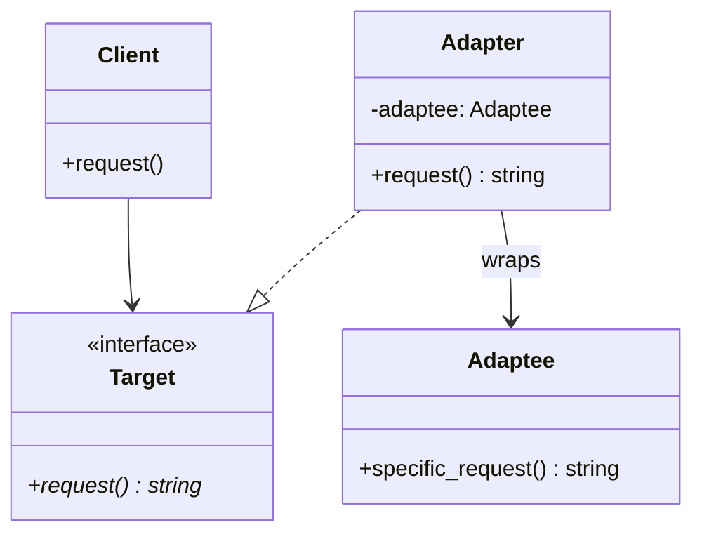
```mermaid
classDiagram
    class Client {
        +request()
    }

    class Target {
        <<interface>>
        +request()* string
    }

    class Adapter {
        -adaptee: Adaptee
        +request() string
    }

    class Adaptee {
        +specific_request() string
    }

    Client --> Target
    Adapter ..|> Target
    Adapter --> Adaptee : wraps
```

### Code Python
```python
from abc import ABC, abstractmethod


# Target Interface (ma client mong doi)
class MediaPlayer(ABC):
    @abstractmethod
    def play(self, filename: str) -> str:
        pass


# Legacy/Incompatible classes (khong the sua)
class VLCPlayer:
    def play_vlc(self, filename: str) -> str:
        return f"VLC playing: {filename}"


class MP4Player:
    def play_mp4(self, filename: str) -> str:
        return f"MP4 Player playing: {filename}"


class YouTubeStreamer:
    def stream_url(self, url: str) -> str:
        return f"Streaming from YouTube: {url}"


# Adapters
class VLCAdapter(MediaPlayer):
    def __init__(self, vlc_player: VLCPlayer):
        self._vlc = vlc_player

    def play(self, filename: str) -> str:
        return self._vlc.play_vlc(filename)


class MP4Adapter(MediaPlayer):
    def __init__(self, mp4_player: MP4Player):
        self._mp4 = mp4_player

    def play(self, filename: str) -> str:
        return self._mp4.play_mp4(filename)


class YouTubeAdapter(MediaPlayer):
    def __init__(self, streamer: YouTubeStreamer, base_url: str = "youtube.com/watch?v="):
        self._streamer = streamer
        self._base_url = base_url

    def play(self, video_id: str) -> str:
        url = f"{self._base_url}{video_id}"
        return self._streamer.stream_url(url)


class AudioVideoApp:
    """Client chi biet MediaPlayer interface."""

    def __init__(self):
        self.players: dict = {}

    def register(self, name: str, player: MediaPlayer):
        self.players[name] = player

    def play_media(self, player_name: str, source: str):
        player = self.players.get(player_name)
        if not player:
            print(f"Unknown player: {player_name}")
            return
        result = player.play(source)
        print(f"Playing: {result}")


if __name__ == "__main__":
    app = AudioVideoApp()

    app.register("vlc",     VLCAdapter(VLCPlayer()))
    app.register("mp4",     MP4Adapter(MP4Player()))
    app.register("youtube", YouTubeAdapter(YouTubeStreamer()))

    app.play_media("vlc",     "movie.avi")
    app.play_media("mp4",     "tutorial.mp4")
    app.play_media("youtube", "dQw4w9WgXcQ")
    app.play_media("unknown", "test.mkv")
```

---

## 7. Bridge

### Dinh Nghia
> **Bridge** tach biet mot **abstraction** khoi **implementation** cua no, cho phep ca hai thay doi doc lap voi nhau.

### Van De Giai Quyet
- Tranh **class explosion** khi co nhieu variant cua ca abstraction va implementation
- Muon switch implementation tai runtime
- Vi du: Shape x Color — khong muon tao RedCircle, BlueCircle, RedSquare...

### Khi Nao Ap Dung
- Khi muon phat trien abstraction va implementation doc lap
- Khi can thay doi implementation tai runtime
- Cross-platform applications
- Database voi nhieu driver khac nhau

### Uu Diem
- **Open/Closed Principle** — them abstraction/implementation moi de dang
- **Single Responsibility** — tach biet high-level logic va platform details
- Giam so luong class dang ke

### Nhuoc Diem
- Code phuc tap hon voi class co interface ro rang
- Co the over-engineering cho code don gian

### Class Diagram
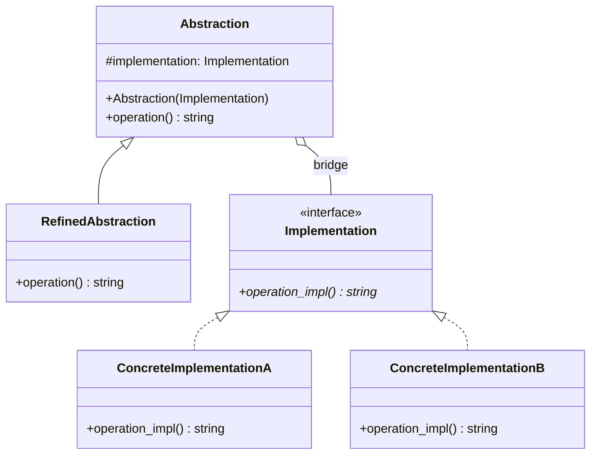
```mermaid
classDiagram
    class Abstraction {
        #implementation: Implementation
        +Abstraction(Implementation)
        +operation() string
    }

    class RefinedAbstraction {
        +operation() string
    }

    class Implementation {
        <<interface>>
        +operation_impl()* string
    }

    class ConcreteImplementationA {
        +operation_impl() string
    }

    class ConcreteImplementationB {
        +operation_impl() string
    }

    Abstraction o-- Implementation : bridge
    Abstraction <|-- RefinedAbstraction
    Implementation <|.. ConcreteImplementationA
    Implementation <|.. ConcreteImplementationB
```

### Code Python
```python
from abc import ABC, abstractmethod


# Implementation side (Platform)
class Renderer(ABC):
    @abstractmethod
    def render_circle(self, x: int, y: int, radius: int) -> str:
        pass

    @abstractmethod
    def render_rectangle(self, x: int, y: int, w: int, h: int) -> str:
        pass


class VectorRenderer(Renderer):
    def render_circle(self, x, y, radius) -> str:
        return f"<circle cx='{x}' cy='{y}' r='{radius}'/>"

    def render_rectangle(self, x, y, w, h) -> str:
        return f"<rect x='{x}' y='{y}' width='{w}' height='{h}'/>"


class RasterRenderer(Renderer):
    def render_circle(self, x, y, radius) -> str:
        return f"Drawing {radius*2}x{radius*2} pixel circle at ({x},{y})"

    def render_rectangle(self, x, y, w, h) -> str:
        return f"Drawing {w}x{h} pixel rectangle at ({x},{y})"


class AsciiRenderer(Renderer):
    def render_circle(self, x, y, radius) -> str:
        return f"  (O)  ASCII circle r={radius} at ({x},{y})"

    def render_rectangle(self, x, y, w, h) -> str:
        return f"  [=]  ASCII rectangle {w}x{h} at ({x},{y})"


# Abstraction side (Shapes)
class Shape(ABC):
    def __init__(self, renderer: Renderer):
        self.renderer = renderer  # Bridge to implementation

    @abstractmethod
    def draw(self) -> str:
        pass

    @abstractmethod
    def resize(self, factor: float):
        pass


class Circle(Shape):
    def __init__(self, renderer: Renderer, x: int, y: int, radius: int):
        super().__init__(renderer)
        self.x = x
        self.y = y
        self.radius = radius

    def draw(self) -> str:
        return self.renderer.render_circle(self.x, self.y, self.radius)

    def resize(self, factor: float):
        self.radius = int(self.radius * factor)
        return self


class Rectangle(Shape):
    def __init__(self, renderer: Renderer, x: int, y: int, w: int, h: int):
        super().__init__(renderer)
        self.x = x
        self.y = y
        self.width = w
        self.height = h

    def draw(self) -> str:
        return self.renderer.render_rectangle(self.x, self.y, self.width, self.height)

    def resize(self, factor: float):
        self.width = int(self.width * factor)
        self.height = int(self.height * factor)
        return self


if __name__ == "__main__":
    renderers = {
        "vector": VectorRenderer(),
        "raster": RasterRenderer(),
        "ascii":  AsciiRenderer(),
    }

    for name, renderer in renderers.items():
        print(f"\n=== {name.upper()} Renderer ===")
        circle = Circle(renderer, 100, 100, 50)
        rect   = Rectangle(renderer, 10, 10, 200, 100)
        print(circle.draw())
        print(rect.draw())

    # Thay doi renderer tai runtime!
    print("\n=== Switch Renderer at Runtime ===")
    shape = Circle(VectorRenderer(), 0, 0, 30)
    print("Before:", shape.draw())
    shape.renderer = AsciiRenderer()
    print("After: ", shape.draw())
```

---

## 8. Composite

### Dinh Nghia
> **Composite** cho phep ban sap xep cac object thanh **cau truc cay** va lam viec voi chung nhu voi tung object rieng le — ca cay va la deu co cung interface.

### Van De Giai Quyet
- Can bieu dien **cau truc phan cap** phan-toan the (part-whole hierarchy)
- Client muon xu ly **dong nhat** ca object don le lan nhom object
- Vi du: File system (File va Folder cung interface), Menu long nhau

### Khi Nao Ap Dung
- File system (file, folder)
- GUI components (button, panel, window)
- To chuc phan cap (cong ty, phong ban, nhan vien)
- Menu, tree view, HTML DOM

### Uu Diem
- **Polymorphism** va **recursion** — duyet cay de dang
- Them loai element moi khong can sua code hien co
- Client don gian — khong can phan biet la va nhanh

### Nhuoc Diem
- Kho gioi han component cua composite (type checking phuc tap)
- Co the qua generic — khong the restrict component type

### Class Diagram
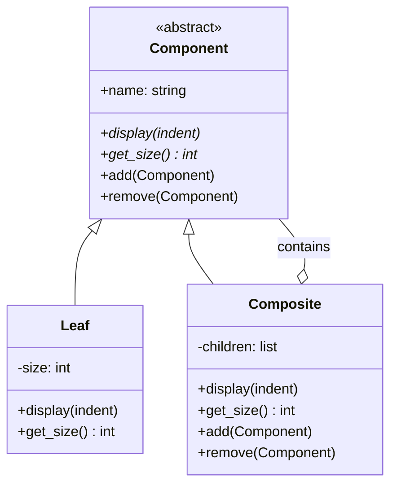
```mermaid
classDiagram
    class Component {
        <<abstract>>
        +name: string
        +display(indent)*
        +get_size()* int
        +add(Component)
        +remove(Component)
    }

    class Leaf {
        -size: int
        +display(indent)
        +get_size() int
    }

    class Composite {
        -children: list
        +display(indent)
        +get_size() int
        +add(Component)
        +remove(Component)
    }

    Component <|-- Leaf
    Component <|-- Composite
    Composite o-- Component : contains
```

### Code Python
```python
from abc import ABC, abstractmethod
from typing import List


class FileSystemItem(ABC):
    def __init__(self, name: str):
        self.name = name

    @abstractmethod
    def display(self, indent: int = 0) -> None:
        pass

    @abstractmethod
    def get_size(self) -> int:
        pass

    def add(self, item: "FileSystemItem"):
        raise NotImplementedError("Leaf cannot have children")

    def remove(self, item: "FileSystemItem"):
        raise NotImplementedError("Leaf cannot have children")


class File(FileSystemItem):
    def __init__(self, name: str, size: int):
        super().__init__(name)
        self.size = size

    def display(self, indent: int = 0) -> None:
        print(f"{'  ' * indent}[FILE] {self.name} ({self.size} KB)")

    def get_size(self) -> int:
        return self.size


class Folder(FileSystemItem):
    def __init__(self, name: str):
        super().__init__(name)
        self._children: List[FileSystemItem] = []

    def add(self, item: FileSystemItem):
        self._children.append(item)
        return self

    def remove(self, item: FileSystemItem):
        self._children.remove(item)

    def display(self, indent: int = 0) -> None:
        total = self.get_size()
        print(f"{'  ' * indent}[DIR] {self.name}/ ({total} KB total)")
        for child in self._children:
            child.display(indent + 1)

    def get_size(self) -> int:
        return sum(child.get_size() for child in self._children)


if __name__ == "__main__":
    root = Folder("project")

    src = Folder("src")
    src.add(File("main.py", 15))
    src.add(File("utils.py", 8))
    src.add(File("models.py", 25))

    tests = Folder("tests")
    tests.add(File("test_main.py", 10))
    tests.add(File("test_utils.py", 6))

    docs = Folder("docs")
    docs.add(File("README.md", 5))
    docs.add(File("API.md", 12))

    assets = Folder("assets")
    images = Folder("images")
    images.add(File("logo.png", 150))
    images.add(File("banner.jpg", 320))
    assets.add(images)
    assets.add(File("style.css", 20))

    root.add(src).add(tests).add(docs).add(assets)
    root.add(File(".gitignore", 1))

    print("File System Structure:")
    root.display()
    print(f"\nTotal project size: {root.get_size()} KB")
    print(f"Source code size:   {src.get_size()} KB")
```

---

## 9. Decorator

### Dinh Nghia
> **Decorator** cho phep **them hanh vi moi vao object** bang cach dat chung ben trong wrapper object dac biet, ma khong can thay doi class goc.

### Van De Giai Quyet
- Muon **mo rong behavior** ma khong dung inheritance (inheritance cung nhac)
- Can them behavior **tai runtime** va co the xep chong nhieu behavior
- Vi du: Coffee + Milk + Sugar + Syrup

### Khi Nao Ap Dung
- Them logging, caching, authentication vao class
- Text formatting (bold + italic + underline)
- I/O streams (BufferedReader, GZipReader)
- Middleware trong web framework

### Uu Diem
- Linh hoat hon inheritance
- **Single Responsibility** — them tung behavior rieng
- Combine nhieu decorator tuy y tai runtime

### Nhuoc Diem
- Nhieu decorator nho co the gay kho debug
- Thu tu wrap quan trong va de nham
- Config phuc tap khi nhieu lop decorator

### Class Diagram
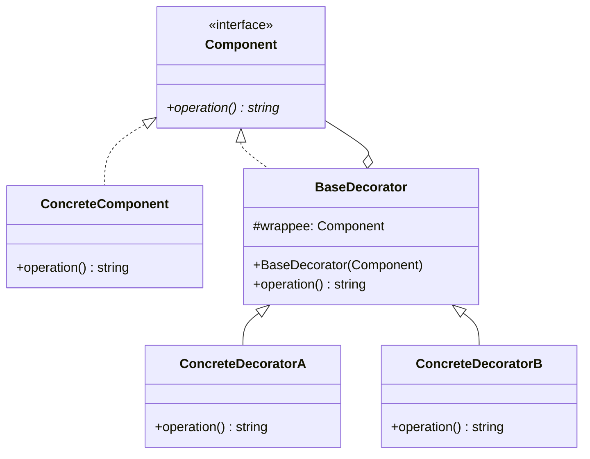
```mermaid
classDiagram
    class Component {
        <<interface>>
        +operation()* string
    }

    class ConcreteComponent {
        +operation() string
    }

    class BaseDecorator {
        #wrappee: Component
        +BaseDecorator(Component)
        +operation() string
    }

    class ConcreteDecoratorA {
        +operation() string
    }

    class ConcreteDecoratorB {
        +operation() string
    }

    Component <|.. ConcreteComponent
    Component <|.. BaseDecorator
    BaseDecorator o-- Component
    BaseDecorator <|-- ConcreteDecoratorA
    BaseDecorator <|-- ConcreteDecoratorB
```

### Code Python
```python
from abc import ABC, abstractmethod


class Coffee(ABC):
    @abstractmethod
    def get_description(self) -> str:
        pass

    @abstractmethod
    def get_cost(self) -> float:
        pass

    def __str__(self):
        return f"{self.get_description()} = ${self.get_cost():.2f}"


class SimpleCoffee(Coffee):
    def get_description(self) -> str:
        return "Simple Coffee"

    def get_cost(self) -> float:
        return 1.00


class Espresso(Coffee):
    def get_description(self) -> str:
        return "Espresso"

    def get_cost(self) -> float:
        return 1.50


class CoffeeDecorator(Coffee):
    def __init__(self, coffee: Coffee):
        self._coffee = coffee

    def get_description(self) -> str:
        return self._coffee.get_description()

    def get_cost(self) -> float:
        return self._coffee.get_cost()


class MilkDecorator(CoffeeDecorator):
    def get_description(self) -> str:
        return f"{self._coffee.get_description()}, Milk"

    def get_cost(self) -> float:
        return self._coffee.get_cost() + 0.25


class SugarDecorator(CoffeeDecorator):
    def get_description(self) -> str:
        return f"{self._coffee.get_description()}, Sugar"

    def get_cost(self) -> float:
        return self._coffee.get_cost() + 0.10


class VanillaDecorator(CoffeeDecorator):
    def get_description(self) -> str:
        return f"{self._coffee.get_description()}, Vanilla"

    def get_cost(self) -> float:
        return self._coffee.get_cost() + 0.50


class WhipDecorator(CoffeeDecorator):
    def get_description(self) -> str:
        return f"{self._coffee.get_description()}, Whip"

    def get_cost(self) -> float:
        return self._coffee.get_cost() + 0.35


if __name__ == "__main__":
    coffee = SimpleCoffee()
    print(f"Order 1: {coffee}")

    order2 = SugarDecorator(MilkDecorator(Espresso()))
    print(f"Order 2: {order2}")

    order3 = WhipDecorator(VanillaDecorator(MilkDecorator(MilkDecorator(Espresso()))))
    print(f"Order 3: {order3}")

    print("\n=== Dynamic decoration ===")
    base = SimpleCoffee()
    print(f"Start: {base}")

    extras = [MilkDecorator, SugarDecorator, VanillaDecorator]
    for Deco in extras:
        base = Deco(base)
        print(f"Add {Deco.__name__}: {base}")
```

---

## 10. Facade

### Dinh Nghia
> **Facade** cung cap mot **interface don gian hoa** cho mot subsystem phuc tap, thu vien, hoac framework.

### Van De Giai Quyet
- He thong qua phuc tap voi nhieu class va dependencies
- Client can dung nhieu class nhung chi can mot phan chuc nang
- Muon to chuc subsystem thanh cac layer

### Khi Nao Ap Dung
- Cung cap simple API cho complex library
- Layered architecture (Service layer, API Gateway)
- Home Theater System (1 remote cho TV + DVD + Sound)
- E-commerce checkout (payment + inventory + shipping)

### Uu Diem
- **Isolate** client khoi su phuc tap cua subsystem
- Giam dependencies, code de maintain
- Khong loai bo subsystem — van dung truc tiep duoc

### Nhuoc Diem
- Facade co the tro thanh **God Object**
- Khong gioi han truy cap truc tiep vao subsystem

### Class Diagram
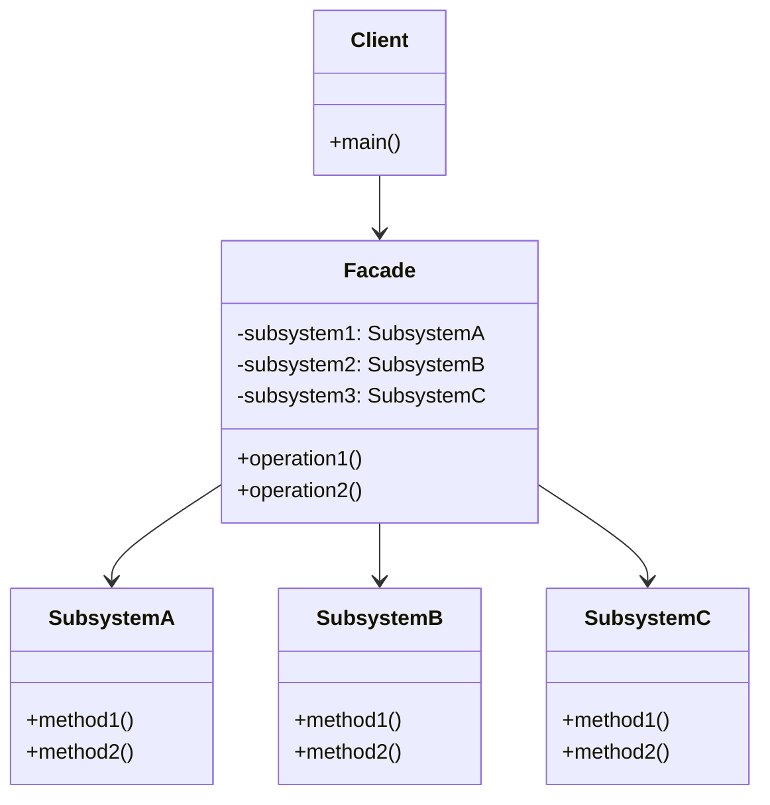
```mermaid
classDiagram
    class Facade {
        -subsystem1: SubsystemA
        -subsystem2: SubsystemB
        -subsystem3: SubsystemC
        +operation1()
        +operation2()
    }

    class SubsystemA {
        +method1()
        +method2()
    }

    class SubsystemB {
        +method1()
        +method2()
    }

    class SubsystemC {
        +method1()
        +method2()
    }

    class Client {
        +main()
    }

    Facade --> SubsystemA
    Facade --> SubsystemB
    Facade --> SubsystemC
    Client --> Facade
```

### Code Python
```python
# Complex Subsystems (E-commerce)
class InventoryService:
    def check_stock(self, product_id: str, qty: int) -> bool:
        print(f"  [Inventory] Checking stock for {product_id} x{qty}")
        return True

    def reserve_items(self, product_id: str, qty: int):
        print(f"  [Inventory] Reserved {qty}x {product_id}")

    def release_reservation(self, product_id: str, qty: int):
        print(f"  [Inventory] Released reservation: {qty}x {product_id}")


class PaymentService:
    def validate_card(self, card_number: str) -> bool:
        print(f"  [Payment] Validating card ****{card_number[-4:]}")
        return True

    def charge(self, amount: float, card_number: str) -> str:
        print(f"  [Payment] Charging ${amount:.2f}")
        return f"TXN_{card_number[-4:]}_OK"

    def refund(self, transaction_id: str):
        print(f"  [Payment] Refunding {transaction_id}")


class ShippingService:
    def calculate_fee(self, address: str) -> float:
        print(f"  [Shipping] Calculating fee for {address}")
        return 5.99

    def create_shipment(self, order_id: str, address: str) -> str:
        tracking = f"TRACK_{order_id}"
        print(f"  [Shipping] Created shipment {tracking} to {address}")
        return tracking


class NotificationService:
    def send_email(self, email: str, subject: str, body: str):
        print(f"  [Email] To: {email}, Subject: {subject}")


# Facade - don gian hoa qua trinh dat hang
class OrderFacade:
    def __init__(self):
        self._inventory    = InventoryService()
        self._payment      = PaymentService()
        self._shipping     = ShippingService()
        self._notification = NotificationService()

    def place_order(
        self,
        product_id: str,
        qty: int,
        card_number: str,
        address: str,
        email: str,
    ) -> dict:
        print("\n[OrderFacade] Processing order...")

        if not self._inventory.check_stock(product_id, qty):
            return {"success": False, "error": "Out of stock"}

        if not self._payment.validate_card(card_number):
            return {"success": False, "error": "Invalid card"}

        self._inventory.reserve_items(product_id, qty)
        shipping_fee = self._shipping.calculate_fee(address)

        total = qty * 29.99 + shipping_fee
        txn_id = self._payment.charge(total, card_number)

        import random
        order_id = f"ORD{random.randint(1000, 9999)}"
        tracking = self._shipping.create_shipment(order_id, address)

        self._notification.send_email(
            email, "Order Confirmed!",
            f"Your order {order_id} is confirmed. Tracking: {tracking}"
        )

        return {
            "success": True,
            "order_id": order_id,
            "tracking": tracking,
            "total": total,
        }


if __name__ == "__main__":
    facade = OrderFacade()
    result = facade.place_order(
        product_id="PROD_001",
        qty=2,
        card_number="4111111111111234",
        address="123 Main St, Hanoi",
        email="customer@example.com",
    )
    print(f"\nResult: {result}")
```

---

## 11. Flyweight

### Dinh Nghia
> **Flyweight** giup **chia se du lieu chung** giua nhieu object de giam thieu viec su dung RAM khi so luong object rat lon.

### Van De Giai Quyet
- Can tao **hang trieu object** tuong tu — ton qua nhieu RAM
- Chia du lieu thanh **intrinsic** (bat bien, share duoc) va **extrinsic** (thay doi, truyen tu ngoai)

### Khi Nao Ap Dung
- Game: hang ngan cay/dan co cung sprite
- Text editor: ky tu voi cung font/size
- Particle systems
- Caching objects co state bat bien

### Uu Diem
- **Giam RAM** dang ke khi nhieu object tuong tu
- Hieu nang tot hon khi so luong object lon

### Nhuoc Diem
- Code phuc tap hon
- Phai tinh toan extrinsic state moi lan — tang CPU
- Trade-off RAM vs CPU

### Class Diagram
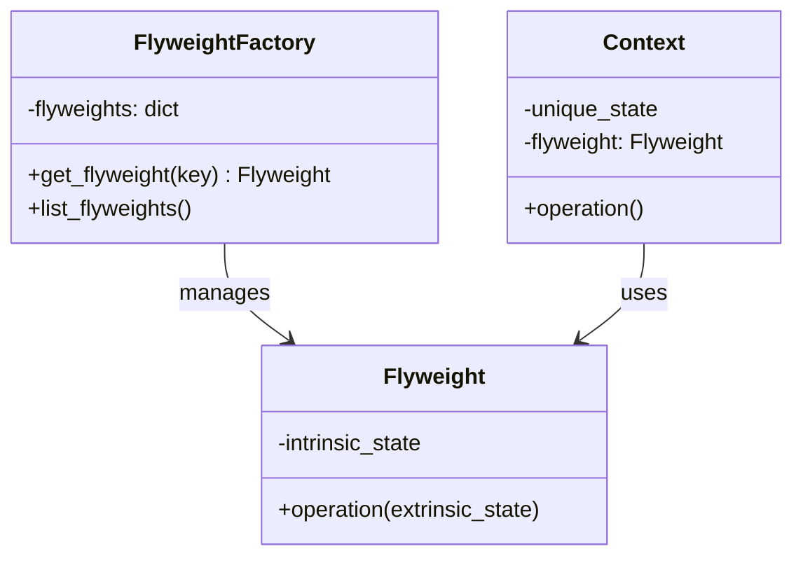
```mermaid
classDiagram
    class Flyweight {
        -intrinsic_state
        +operation(extrinsic_state)
    }

    class FlyweightFactory {
        -flyweights: dict
        +get_flyweight(key) Flyweight
        +list_flyweights()
    }

    class Context {
        -unique_state
        -flyweight: Flyweight
        +operation()
    }

    FlyweightFactory --> Flyweight : manages
    Context --> Flyweight : uses
```

### Code Python
```python
import json
from typing import Dict


# Flyweight (shared state)
class TreeType:
    """
    Intrinsic state — chia se giua tat ca cay cung loai.
    Khong the thay doi sau khi tao.
    """
    def __init__(self, name: str, color: str, texture: str):
        self.name = name
        self.color = color
        self.texture = texture  # Tuong tuong day la bitmap lon

    def draw(self, x: int, y: int):
        print(f"  Drawing {self.name} [{self.color}] at ({x}, {y})")

    def __repr__(self):
        return f"TreeType({self.name}, {self.color})"


# Flyweight Factory
class TreeTypeFactory:
    _cache: Dict[str, TreeType] = {}

    @classmethod
    def get_tree_type(cls, name: str, color: str, texture: str) -> TreeType:
        key = json.dumps({"name": name, "color": color, "texture": texture}, sort_keys=True)

        if key not in cls._cache:
            cls._cache[key] = TreeType(name, color, texture)
            print(f"  [Factory] Created new TreeType: {name}")
        else:
            print(f"  [Factory] Reusing existing TreeType: {name}")

        return cls._cache[key]

    @classmethod
    def count(cls) -> int:
        return len(cls._cache)


# Context (extrinsic state)
class Tree:
    """
    Context — chua extrinsic state (vi tri, trang thai rieng).
    Tham chieu den Flyweight thay vi luu lai intrinsic state.
    """
    def __init__(self, x: int, y: int, tree_type: TreeType):
        self.x = x
        self.y = y
        self.tree_type = tree_type

    def draw(self):
        self.tree_type.draw(self.x, self.y)


class Forest:
    def __init__(self):
        self.trees: list = []

    def plant_tree(self, x: int, y: int, name: str, color: str, texture: str):
        tree_type = TreeTypeFactory.get_tree_type(name, color, texture)
        tree = Tree(x, y, tree_type)
        self.trees.append(tree)

    def draw(self):
        print(f"\nDrawing forest with {len(self.trees)} trees:")
        for tree in self.trees:
            tree.draw()


if __name__ == "__main__":
    forest = Forest()

    import random
    random.seed(42)

    print("=== Planting trees ===")
    tree_types = [
        ("Oak",   "dark green", "bark_texture_A"),
        ("Pine",  "light green","bark_texture_B"),
        ("Maple", "orange",     "bark_texture_C"),
    ]

    for _ in range(10):
        name, color, texture = random.choice(tree_types)
        x, y = random.randint(0, 100), random.randint(0, 100)
        forest.plant_tree(x, y, name, color, texture)

    print(f"\n=== Memory Stats ===")
    print(f"Trees planted:     {len(forest.trees)}")
    print(f"TreeType objects:  {TreeTypeFactory.count()}")
    print(f"Memory saved: ~{len(forest.trees) - TreeTypeFactory.count()} duplicate objects avoided")
```

---

## 12. Proxy

### Dinh Nghia
> **Proxy** cung cap mot **surrogate (dai dien)** hoac placeholder cho mot object khac. Proxy kiem soat quyen truy cap vao object goc, cho phep thuc hien mot so viec truoc hoac sau khi request den object goc.

### Van De Giai Quyet
- **Lazy initialization**: tao object nang chi khi thuc su can
- **Access control**: kiem tra quyen truoc khi truy cap
- **Caching**: cache ket qua de khong tinh lai
- **Logging/Monitoring**: ghi log ma khong sua object goc

### Khi Nao Ap Dung
- Virtual Proxy: lazy loading anh lon
- Protection Proxy: kiem tra quyen truy cap
- Caching Proxy: cache database query
- Remote Proxy: dai dien cho object o server khac
- Logging Proxy: theo doi operations

### Uu Diem
- **Open/Closed** — them behavior khong sua subject
- Quan ly vong doi cua service object phuc tap
- Proxy hoat dong ngay ca khi service chua ready

### Nhuoc Diem
- Tang response time (them 1 lop trung gian)
- Code phuc tap hon

### Class Diagram
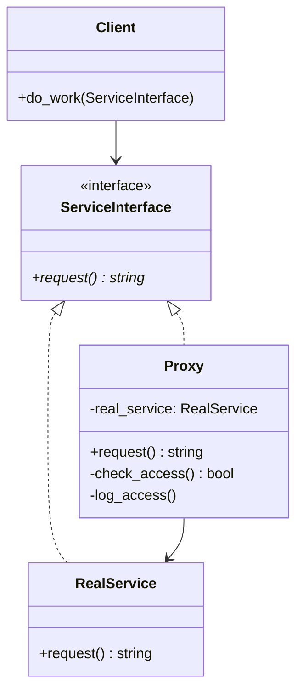
```mermaid
classDiagram
    class ServiceInterface {
        <<interface>>
        +request()* string
    }

    class RealService {
        +request() string
    }

    class Proxy {
        -real_service: RealService
        +request() string
        -check_access() bool
        -log_access()
    }

    class Client {
        +do_work(ServiceInterface)
    }

    ServiceInterface <|.. RealService
    ServiceInterface <|.. Proxy
    Proxy --> RealService
    Client --> ServiceInterface
```

### Code Python
```python
from abc import ABC, abstractmethod
import time
import hashlib


class DatabaseService(ABC):
    @abstractmethod
    def query(self, sql: str) -> list:
        pass

    @abstractmethod
    def execute(self, sql: str) -> bool:
        pass


class RealDatabaseService(DatabaseService):
    def __init__(self, connection_string: str):
        print(f"  [DB] Connecting to database...")
        time.sleep(0.05)
        self.conn = connection_string
        print(f"  [DB] Connected!")

    def query(self, sql: str) -> list:
        print(f"  [DB] Executing query: {sql}")
        return [{"id": 1, "name": "Alice"}, {"id": 2, "name": "Bob"}]

    def execute(self, sql: str) -> bool:
        print(f"  [DB] Executing: {sql}")
        return True


# Caching Proxy
class CachingProxy(DatabaseService):
    def __init__(self, service: DatabaseService):
        self._service = service
        self._cache: dict = {}
        self._hits = 0
        self._misses = 0

    def _cache_key(self, sql: str) -> str:
        return hashlib.md5(sql.encode()).hexdigest()

    def query(self, sql: str) -> list:
        key = self._cache_key(sql)

        if key in self._cache:
            self._hits += 1
            print(f"  [Cache HIT]  {sql[:40]}")
            return self._cache[key]

        self._misses += 1
        print(f"  [Cache MISS] {sql[:40]}")
        result = self._service.query(sql)
        self._cache[key] = result
        return result

    def execute(self, sql: str) -> bool:
        self._cache.clear()
        print("  [Cache] Cleared after write operation")
        return self._service.execute(sql)

    def stats(self):
        total = self._hits + self._misses
        ratio = self._hits / total * 100 if total > 0 else 0
        print(f"  Cache: {self._hits} hits, {self._misses} misses ({ratio:.1f}% hit rate)")


# Protection Proxy
class ProtectionProxy(DatabaseService):
    def __init__(self, service: DatabaseService, user_role: str):
        self._service = service
        self.user_role = user_role
        self._allowed_roles = {
            "query":   ["admin", "readonly", "user"],
            "execute": ["admin"],
        }

    def _check_access(self, operation: str) -> bool:
        allowed = self._allowed_roles.get(operation, [])
        if self.user_role not in allowed:
            print(f"  Access denied for role '{self.user_role}' on '{operation}'")
            return False
        return True

    def query(self, sql: str) -> list:
        if not self._check_access("query"):
            return []
        return self._service.query(sql)

    def execute(self, sql: str) -> bool:
        if not self._check_access("execute"):
            return False
        return self._service.execute(sql)


if __name__ == "__main__":
    print("=== Caching Proxy ===")
    real_db = RealDatabaseService("postgresql://localhost/mydb")
    cached_db = CachingProxy(real_db)

    sql = "SELECT * FROM users WHERE active = 1"
    cached_db.query(sql)     # Cache miss
    cached_db.query(sql)     # Cache hit!
    cached_db.query(sql)     # Cache hit!
    cached_db.query("SELECT * FROM products")
    cached_db.stats()

    print("\n=== Protection Proxy ===")
    admin_db    = ProtectionProxy(real_db, "admin")
    readonly_db = ProtectionProxy(real_db, "readonly")

    admin_db.query("SELECT * FROM users")
    admin_db.execute("DELETE FROM temp WHERE id = 5")

    readonly_db.query("SELECT * FROM products")
    readonly_db.execute("DROP TABLE users")  # Denied!
```

---

# BEHAVIORAL PATTERNS

---

## 13. Chain of Responsibility

### Dinh Nghia
> **Chain of Responsibility** cho phep truyen request doc theo mot **chuoi cac handler**. Moi handler quyet dinh xu ly request hoac chuyen tiep den handler tiep theo.

### Van De Giai Quyet
- Nhieu object co the xu ly request nhung **khong biet truoc** object nao se handle
- Muon gui request toi **nhieu object ma khong coupling** voi chung
- Vi du: Request phe duyet (Staff -> Manager -> Director -> CEO)

### Khi Nao Ap Dung
- Event handling (DOM events bubbling)
- Middleware pipeline (Express.js, Django middleware)
- Approval workflow
- Logging (Debug -> Info -> Warning -> Error)

### Uu Diem
- **Giam coupling** giua sender va receiver
- **Single Responsibility** — moi handler 1 nhiem vu
- De them/bot handler trong chain
- Thu tu xu ly co the thay doi tai runtime

### Nhuoc Diem
- Request co the khong duoc xu ly neu khong co handler phu hop
- Kho debug khi chain dai
- Hieu nang giam neu chain qua dai

### Class Diagram
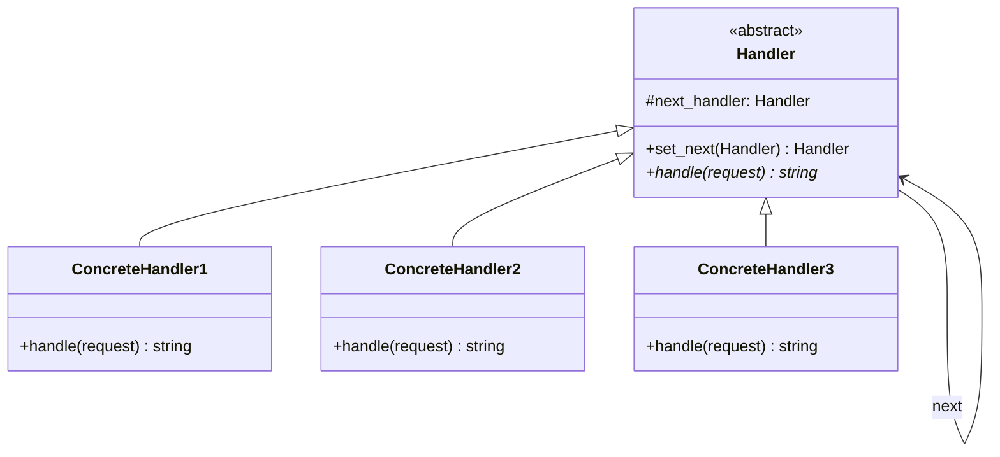
```mermaid
classDiagram
    class Handler {
        <<abstract>>
        #next_handler: Handler
        +set_next(Handler) Handler
        +handle(request)* string
    }

    class ConcreteHandler1 {
        +handle(request) string
    }

    class ConcreteHandler2 {
        +handle(request) string
    }

    class ConcreteHandler3 {
        +handle(request) string
    }

    Handler <|-- ConcreteHandler1
    Handler <|-- ConcreteHandler2
    Handler <|-- ConcreteHandler3
    Handler --> Handler : next
```

### Code Python
```python
from abc import ABC, abstractmethod
from typing import Optional


class ApprovalHandler(ABC):
    def __init__(self, name: str, max_amount: float):
        self.name = name
        self.max_amount = max_amount
        self._next: Optional["ApprovalHandler"] = None

    def set_next(self, handler: "ApprovalHandler") -> "ApprovalHandler":
        self._next = handler
        return handler  # Cho phep chaining: a.set_next(b).set_next(c)

    def handle(self, amount: float, description: str) -> str:
        if amount <= self.max_amount:
            return f"[OK] {self.name} approved ${amount:.2f} for '{description}'"
        elif self._next:
            return self._next.handle(amount, description)
        else:
            return f"[DENIED] No one can approve ${amount:.2f} for '{description}'"


class TeamLead(ApprovalHandler):
    def __init__(self):
        super().__init__("Team Lead", max_amount=1_000)


class Manager(ApprovalHandler):
    def __init__(self):
        super().__init__("Manager", max_amount=10_000)


class Director(ApprovalHandler):
    def __init__(self):
        super().__init__("Director", max_amount=100_000)


class CEO(ApprovalHandler):
    def __init__(self):
        super().__init__("CEO", max_amount=float("inf"))


if __name__ == "__main__":
    lead = TeamLead()
    mgr  = Manager()
    dir_ = Director()
    ceo  = CEO()

    # Xay chuoi
    lead.set_next(mgr).set_next(dir_).set_next(ceo)

    expenses = [
        (500,      "Office supplies"),
        (5_000,    "Team training"),
        (50_000,   "New servers"),
        (500_000,  "Office expansion"),
        (2_000_000,"Company acquisition"),
    ]

    print("=== Expense Approval Chain ===")
    for amount, desc in expenses:
        result = lead.handle(amount, desc)
        print(result)
```

---

## 14. Command

### Dinh Nghia
> **Command** chuyen doi request thanh mot **object doc lap** chua tat ca thong tin ve request do, cho phep truyen requests nhu arguments, delay, queue, va ho tro undo/redo.

### Van De Giai Quyet
- Can **parameterize** objects voi operations
- Can **queue/delay** execution cua operations
- Can **undo/redo** operations
- Can logging va transaction history

### Khi Nao Ap Dung
- Undo/Redo (text editor, Photoshop)
- Task queue, job scheduling
- Transaction (database rollback)
- Macro recording
- Remote control / GUI buttons

### Uu Diem
- **Single Responsibility** — tach UI khoi business logic
- **Open/Closed** — them command moi khong sua code
- Undo/Redo de implement
- Co the delay, queue, serialize commands

### Nhuoc Diem
- Tang so luong class (moi action 1 class)
- Code phuc tap hon cho feature don gian

### Class Diagram
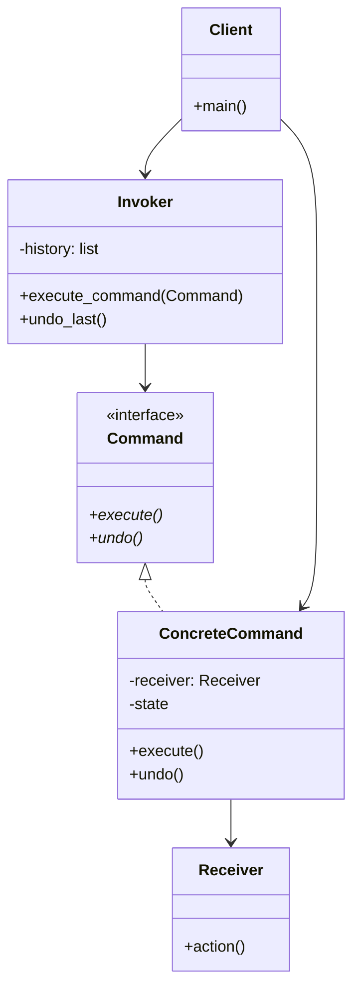
```mermaid
classDiagram
    class Command {
        <<interface>>
        +execute()*
        +undo()*
    }

    class ConcreteCommand {
        -receiver: Receiver
        -state
        +execute()
        +undo()
    }

    class Receiver {
        +action()
    }

    class Invoker {
        -history: list
        +execute_command(Command)
        +undo_last()
    }

    class Client {
        +main()
    }

    Command <|.. ConcreteCommand
    ConcreteCommand --> Receiver
    Invoker --> Command
    Client --> Invoker
    Client --> ConcreteCommand
```

### Code Python
```python
from abc import ABC, abstractmethod
from typing import List


class Command(ABC):
    @abstractmethod
    def execute(self) -> str:
        pass

    @abstractmethod
    def undo(self) -> str:
        pass


# Receiver
class TextDocument:
    def __init__(self, content: str = ""):
        self.content = content

    def insert(self, text: str, position: int):
        self.content = self.content[:position] + text + self.content[position:]

    def delete(self, start: int, length: int) -> str:
        deleted = self.content[start:start + length]
        self.content = self.content[:start] + self.content[start + length:]
        return deleted

    def __str__(self):
        return f'"{self.content}"'


# Concrete Commands
class InsertTextCommand(Command):
    def __init__(self, doc: TextDocument, text: str, position: int):
        self.doc = doc
        self.text = text
        self.position = position

    def execute(self) -> str:
        self.doc.insert(self.text, self.position)
        return f"Inserted '{self.text}' at position {self.position}"

    def undo(self) -> str:
        self.doc.delete(self.position, len(self.text))
        return f"Undone: removed '{self.text}' from position {self.position}"


class DeleteTextCommand(Command):
    def __init__(self, doc: TextDocument, start: int, length: int):
        self.doc = doc
        self.start = start
        self.length = length
        self._deleted_text = ""

    def execute(self) -> str:
        self._deleted_text = self.doc.delete(self.start, self.length)
        return f"Deleted '{self._deleted_text}' at position {self.start}"

    def undo(self) -> str:
        self.doc.insert(self._deleted_text, self.start)
        return f"Undone: restored '{self._deleted_text}' at position {self.start}"


# Invoker
class TextEditor:
    def __init__(self, doc: TextDocument):
        self.doc = doc
        self._history: List[Command] = []
        self._redo_stack: List[Command] = []

    def execute(self, command: Command):
        result = command.execute()
        self._history.append(command)
        self._redo_stack.clear()
        print(f"  Execute: {result} | Doc: {self.doc}")

    def undo(self):
        if not self._history:
            print("  Nothing to undo")
            return
        command = self._history.pop()
        result = command.undo()
        self._redo_stack.append(command)
        print(f"  Undo: {result} | Doc: {self.doc}")

    def redo(self):
        if not self._redo_stack:
            print("  Nothing to redo")
            return
        command = self._redo_stack.pop()
        result = command.execute()
        self._history.append(command)
        print(f"  Redo: {result} | Doc: {self.doc}")


if __name__ == "__main__":
    doc = TextDocument("Hello World")
    editor = TextEditor(doc)

    print(f"Initial: {doc}\n")
    editor.execute(InsertTextCommand(doc, " Beautiful", 5))
    editor.execute(InsertTextCommand(doc, "!", 22))
    editor.execute(DeleteTextCommand(doc, 0, 6))

    print("\n--- Undo operations ---")
    editor.undo()
    editor.undo()

    print("\n--- Redo operations ---")
    editor.redo()
```

---

## 15. Iterator

### Dinh Nghia
> **Iterator** cung cap cach de **duyet qua cac phan tu** cua mot collection ma khong can biet cau truc ben trong cua no.

### Van De Giai Quyet
- Muon duyet collection theo nhieu cach khac nhau (forward, backward, skip)
- Tach logic duyet khoi collection
- Cung cap interface thong nhat cho cac collection khac nhau

### Khi Nao Ap Dung
- Khi collection co cau truc phuc tap (tree, graph) nhung muon che giau
- Can nhieu loai traversal khac nhau
- Khi khong biet cau truc collection o compile time

### Uu Diem
- **Single Responsibility** — tach traversal logic ra iterator
- **Open/Closed** — them iterator moi khong sua collection
- Duyet song song nhieu collection cung luc

### Nhuoc Diem
- Overkill cho collection don gian
- Kem hieu qua hon dung truc tiep index cho mot so collection

### Class Diagram
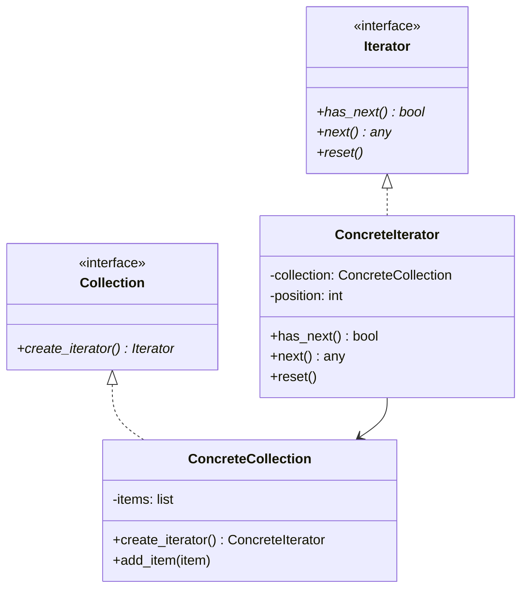
```mermaid
classDiagram
    class Iterator {
        <<interface>>
        +has_next()* bool
        +next()* any
        +reset()*
    }

    class Collection {
        <<interface>>
        +create_iterator()* Iterator
    }

    class ConcreteIterator {
        -collection: ConcreteCollection
        -position: int
        +has_next() bool
        +next() any
        +reset()
    }

    class ConcreteCollection {
        -items: list
        +create_iterator() ConcreteIterator
        +add_item(item)
    }

    Iterator <|.. ConcreteIterator
    Collection <|.. ConcreteCollection
    ConcreteIterator --> ConcreteCollection
```

### Code Python
```python
from abc import ABC, abstractmethod
from typing import Any, List


class Iterator(ABC):
    @abstractmethod
    def has_next(self) -> bool:
        pass

    @abstractmethod
    def next(self) -> Any:
        pass

    def __iter__(self):
        return self

    def __next__(self):
        if not self.has_next():
            raise StopIteration
        return self.next()


class IterableCollection(ABC):
    @abstractmethod
    def create_iterator(self) -> Iterator:
        pass


class BookCollection(IterableCollection):
    def __init__(self):
        self._books: List[dict] = []

    def add_book(self, title: str, author: str, year: int):
        self._books.append({"title": title, "author": author, "year": year})
        return self

    def create_iterator(self) -> "BookIterator":
        return BookIterator(self._books)

    def create_reverse_iterator(self) -> "ReverseBookIterator":
        return ReverseBookIterator(self._books)

    def create_year_filter_iterator(self, from_year: int) -> "FilteredBookIterator":
        return FilteredBookIterator(self._books, from_year)


class BookIterator(Iterator):
    def __init__(self, books: List[dict]):
        self._books = books
        self._position = 0

    def has_next(self) -> bool:
        return self._position < len(self._books)

    def next(self) -> dict:
        book = self._books[self._position]
        self._position += 1
        return book


class ReverseBookIterator(Iterator):
    def __init__(self, books: List[dict]):
        self._books = books
        self._position = len(books) - 1

    def has_next(self) -> bool:
        return self._position >= 0

    def next(self) -> dict:
        book = self._books[self._position]
        self._position -= 1
        return book


class FilteredBookIterator(Iterator):
    def __init__(self, books: List[dict], from_year: int):
        self._books = [b for b in books if b["year"] >= from_year]
        self._position = 0

    def has_next(self) -> bool:
        return self._position < len(self._books)

    def next(self) -> dict:
        book = self._books[self._position]
        self._position += 1
        return book


if __name__ == "__main__":
    collection = BookCollection()
    (collection
     .add_book("Clean Code", "Robert Martin", 2008)
     .add_book("Design Patterns", "GoF", 1994)
     .add_book("Python Fluent", "Luciano Ramalho", 2022)
     .add_book("The Pragmatic Programmer", "Hunt and Thomas", 2019))

    print("=== Forward Iteration ===")
    for book in collection.create_iterator():
        print(f"  {book['title']} ({book['year']})")

    print("\n=== Reverse Iteration ===")
    for book in collection.create_reverse_iterator():
        print(f"  {book['title']} ({book['year']})")

    print("\n=== Filter: After 2010 ===")
    for book in collection.create_year_filter_iterator(2010):
        print(f"  {book['title']} ({book['year']})")
```

---

## 16. Mediator

### Dinh Nghia
> **Mediator** giam su phu thuoc hon loan giua nhieu objects bang cach han che giao tiep truc tiep va bat chung chi hop tac qua mot **mediator object**.

### Van De Giai Quyet
- Nhieu class giao tiep truc tiep voi nhau, coupling cao
- Thay doi 1 class anh huong nhieu class khac
- Vi du: Chat room, Air traffic control, GUI form validation

### Khi Nao Ap Dung
- Chat room / messaging system
- GUI components (form validation, button enable/disable)
- Air traffic control
- Event bus / pub-sub

### Uu Diem
- **Giam coupling** giua components
- De tai su dung cac component rieng le
- Tap trung logic giao tiep vao 1 noi

### Nhuoc Diem
- Mediator co the tro thanh **God Object**
- Tap trung logic co the lam mediator phuc tap

### Class Diagram
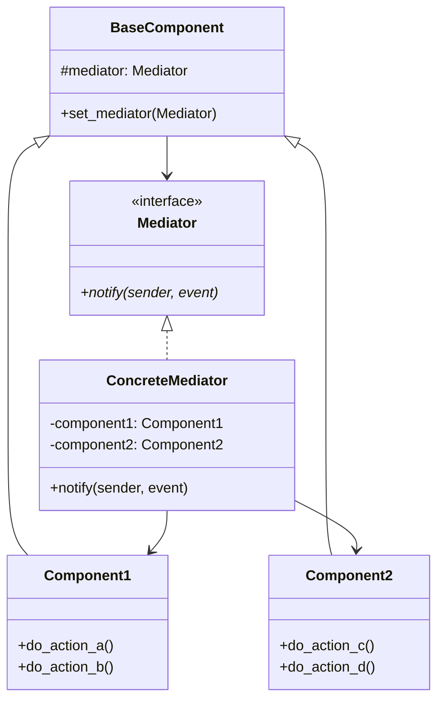
```mermaid
classDiagram
    class Mediator {
        <<interface>>
        +notify(sender, event)*
    }

    class ConcreteMediator {
        -component1: Component1
        -component2: Component2
        +notify(sender, event)
    }

    class BaseComponent {
        #mediator: Mediator
        +set_mediator(Mediator)
    }

    class Component1 {
        +do_action_a()
        +do_action_b()
    }

    class Component2 {
        +do_action_c()
        +do_action_d()
    }

    Mediator <|.. ConcreteMediator
    BaseComponent --> Mediator
    BaseComponent <|-- Component1
    BaseComponent <|-- Component2
    ConcreteMediator --> Component1
    ConcreteMediator --> Component2
```

### Code Python
```python
from abc import ABC, abstractmethod
from typing import List


class ChatMediator(ABC):
    @abstractmethod
    def send_message(self, message: str, sender: "ChatUser", room: str = "general"):
        pass

    @abstractmethod
    def add_user(self, user: "ChatUser"):
        pass


class ChatUser:
    def __init__(self, name: str):
        self.name = name
        self._mediator: ChatMediator = None

    def set_mediator(self, mediator: ChatMediator):
        self._mediator = mediator

    def send(self, message: str, room: str = "general"):
        print(f"  [{self.name}] sends: '{message}' to room #{room}")
        self._mediator.send_message(message, self, room)

    def receive(self, message: str, sender: str, room: str):
        print(f"  [{self.name}] received from {sender} in #{room}: '{message}'")


class ChatRoom(ChatMediator):
    def __init__(self, name: str):
        self.name = name
        self._users: List[ChatUser] = []
        self._rooms: dict = {"general": []}

    def add_user(self, user: ChatUser):
        user.set_mediator(self)
        self._users.append(user)
        self._rooms["general"].append(user)
        print(f"  {user.name} joined {self.name}")
        return self

    def join_room(self, user: ChatUser, room: str):
        if room not in self._rooms:
            self._rooms[room] = []
        if user not in self._rooms[room]:
            self._rooms[room].append(user)
            print(f"  {user.name} joined room #{room}")

    def send_message(self, message: str, sender: ChatUser, room: str = "general"):
        room_users = self._rooms.get(room, [])
        for user in room_users:
            if user != sender:
                user.receive(message, sender.name, room)


if __name__ == "__main__":
    print("=== Chat Room (Mediator) ===")
    room = ChatRoom("TechTalk")

    alice = ChatUser("Alice")
    bob   = ChatUser("Bob")
    carol = ChatUser("Carol")

    room.add_user(alice).add_user(bob).add_user(carol)
    room.join_room(alice, "python")
    room.join_room(bob, "python")

    print()
    alice.send("Hello everyone!")
    bob.send("Hey Alice!")

    print("\n--- Python channel ---")
    alice.send("Any Python tips?", room="python")
    bob.send("Use list comprehensions!", room="python")
    carol.send("Carol only in general")
```

---

## 17. Memento

### Dinh Nghia
> **Memento** cho phep **luu va khoi phuc trang thai** truoc do cua object ma khong tiet lo chi tiet implementation cua no.

### Van De Giai Quyet
- Can implement **undo/redo** ma khong vi pham encapsulation
- Luu snapshot trang thai de co the rollback
- Vi du: Text editor save points, game checkpoints, database transactions

### Khi Nao Ap Dung
- Undo/Redo trong editor
- Game save/load
- Transaction rollback
- Wizard/multi-step form (go back)

### Uu Diem
- Bao toan **encapsulation** — chi Originator moi biet noi dung Memento
- Don gian hoa Originator — khong can tu quan ly history
- De implement undo/redo

### Nhuoc Diem
- **Ton RAM** neu luu nhieu memento lon
- Caretaker phai quan ly vong doi memento

### Class Diagram
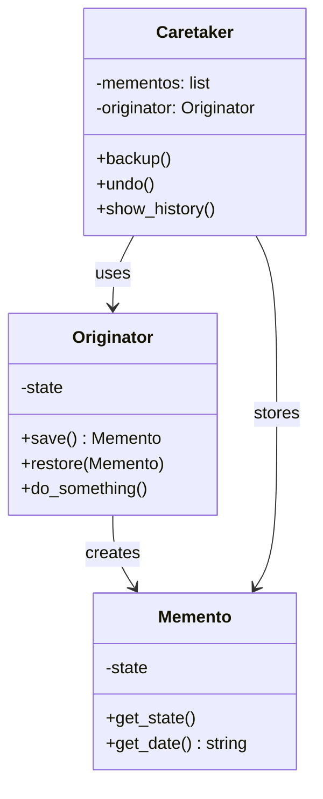
```mermaid
classDiagram
    class Originator {
        -state
        +save() Memento
        +restore(Memento)
        +do_something()
    }

    class Memento {
        -state
        +get_state()
        +get_date() string
    }

    class Caretaker {
        -mementos: list
        -originator: Originator
        +backup()
        +undo()
        +show_history()
    }

    Originator --> Memento : creates
    Caretaker --> Memento : stores
    Caretaker --> Originator : uses
```

### Code Python
```python
from datetime import datetime
from copy import deepcopy
from typing import List


class EditorMemento:
    def __init__(self, content: str, cursor_pos: int, selection: tuple):
        self._content    = content
        self._cursor_pos = cursor_pos
        self._selection  = selection
        self._created_at = datetime.now()

    def get_content(self) -> str:
        return self._content

    def get_cursor(self) -> int:
        return self._cursor_pos

    def get_selection(self) -> tuple:
        return self._selection

    def get_date(self) -> str:
        return self._created_at.strftime("%H:%M:%S")

    def __repr__(self):
        preview = self._content[:20] + "..." if len(self._content) > 20 else self._content
        return f"Snapshot[{self.get_date()}]: '{preview}'"


# Originator
class TextEditor:
    def __init__(self):
        self._content    = ""
        self._cursor_pos = 0
        self._selection  = (0, 0)

    def type(self, text: str):
        self._content = (
            self._content[:self._cursor_pos] +
            text +
            self._content[self._cursor_pos:]
        )
        self._cursor_pos += len(text)

    def delete(self, count: int = 1):
        if self._cursor_pos > 0:
            deleted = self._content[self._cursor_pos - count:self._cursor_pos]
            self._content = (
                self._content[:self._cursor_pos - count] +
                self._content[self._cursor_pos:]
            )
            self._cursor_pos -= count
            return deleted

    def save(self) -> EditorMemento:
        return EditorMemento(self._content, self._cursor_pos, self._selection)

    def restore(self, memento: EditorMemento):
        self._content    = memento.get_content()
        self._cursor_pos = memento.get_cursor()
        self._selection  = memento.get_selection()

    def __str__(self):
        cursor_display = self._content[:self._cursor_pos] + "|" + self._content[self._cursor_pos:]
        return f'Content: "{cursor_display}" (cursor: {self._cursor_pos})'


# Caretaker
class EditorHistory:
    def __init__(self, editor: TextEditor):
        self._editor      = editor
        self._history:    List[EditorMemento] = []
        self._redo_stack: List[EditorMemento] = []

    def save(self):
        memento = self._editor.save()
        self._history.append(memento)
        self._redo_stack.clear()
        print(f"  Saved: {memento}")

    def undo(self):
        if len(self._history) <= 1:
            print("  Nothing to undo (at initial state)")
            return
        current = self._history.pop()
        self._redo_stack.append(current)
        previous = self._history[-1]
        self._editor.restore(previous)
        print(f"  Restored: {previous}")

    def redo(self):
        if not self._redo_stack:
            print("  Nothing to redo")
            return
        memento = self._redo_stack.pop()
        self._history.append(memento)
        self._editor.restore(memento)
        print(f"  Redone: {memento}")


if __name__ == "__main__":
    editor  = TextEditor()
    history = EditorHistory(editor)

    history.save()  # Initial state

    editor.type("Hello")
    history.save()
    print(editor)

    editor.type(", World")
    history.save()
    print(editor)

    editor.type("!")
    history.save()
    print(editor)

    print("\n--- Undo 2 times ---")
    history.undo()
    print(editor)
    history.undo()
    print(editor)

    print("\n--- Redo ---")
    history.redo()
    print(editor)
```

---

## 18. Observer

### Dinh Nghia
> **Observer** dinh nghia mot co che **subscription** de thong bao cho nhieu objects ve bat ky su kien nao xay ra voi object dang duoc theo doi.

### Van De Giai Quyet
- Khi thay doi state cua object A can thong bao cho nhieu object khac (B, C, D)
- Khong muon A biet ve B, C, D (loose coupling)
- So luong observer co the thay doi tai runtime

### Khi Nao Ap Dung
- Event handling system
- MVC (Model notifies View)
- Stock price updates
- Social media notifications
- Reactive programming

### Uu Diem
- **Open/Closed** — them observer moi khong sua subject
- Co the thiet lap quan he giua objects tai runtime
- **Loose coupling** giua Subject va Observer

### Nhuoc Diem
- Observer duoc notify theo thu tu khong xac dinh
- Memory leak neu observer khong unsubscribe
- Unexpected updates — observer co the khong biet tai sao bi notify

### Class Diagram
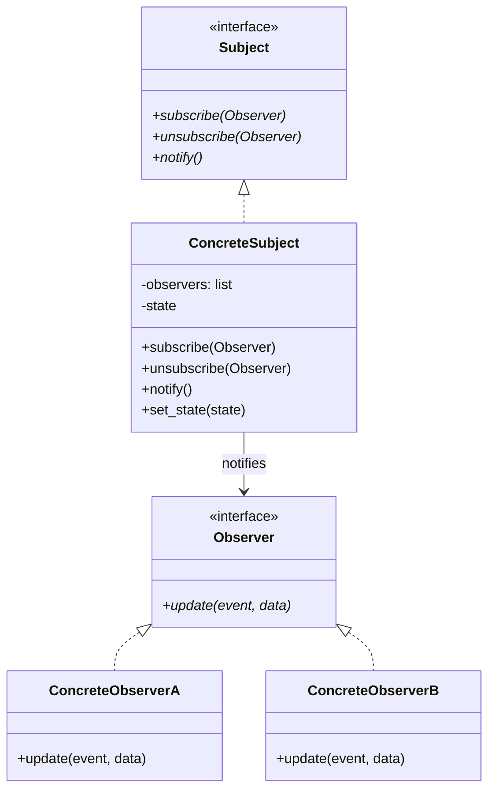
```mermaid
classDiagram
    class Subject {
        <<interface>>
        +subscribe(Observer)*
        +unsubscribe(Observer)*
        +notify()*
    }

    class Observer {
        <<interface>>
        +update(event, data)*
    }

    class ConcreteSubject {
        -observers: list
        -state
        +subscribe(Observer)
        +unsubscribe(Observer)
        +notify()
        +set_state(state)
    }

    class ConcreteObserverA {
        +update(event, data)
    }

    class ConcreteObserverB {
        +update(event, data)
    }

    Subject <|.. ConcreteSubject
    Observer <|.. ConcreteObserverA
    Observer <|.. ConcreteObserverB
    ConcreteSubject --> Observer : notifies
```

### Code Python
```python
from abc import ABC, abstractmethod
from typing import List, Dict, Any
from dataclasses import dataclass


class Observer(ABC):
    @abstractmethod
    def update(self, event: str, data: Any) -> None:
        pass


class Subject(ABC):
    @abstractmethod
    def subscribe(self, event: str, observer: Observer):
        pass

    @abstractmethod
    def unsubscribe(self, event: str, observer: Observer):
        pass

    @abstractmethod
    def notify(self, event: str, data: Any = None):
        pass


@dataclass
class StockData:
    symbol: str
    price: float
    volume: int
    change_pct: float


class StockMarket(Subject):
    def __init__(self):
        self._observers: Dict[str, List[Observer]] = {}
        self._stocks: Dict[str, StockData] = {}

    def subscribe(self, event: str, observer: Observer):
        if event not in self._observers:
            self._observers[event] = []
        self._observers[event].append(observer)
        print(f"  {observer.__class__.__name__} subscribed to '{event}'")

    def unsubscribe(self, event: str, observer: Observer):
        if event in self._observers:
            self._observers[event].remove(observer)
            print(f"  {observer.__class__.__name__} unsubscribed from '{event}'")

    def notify(self, event: str, data: Any = None):
        observers = self._observers.get(event, [])
        for observer in observers:
            observer.update(event, data)

    def update_stock(self, symbol: str, new_price: float, volume: int):
        old_stock = self._stocks.get(symbol)
        old_price = old_stock.price if old_stock else new_price

        change_pct = ((new_price - old_price) / old_price * 100) if old_price else 0

        stock = StockData(symbol, new_price, volume, change_pct)
        self._stocks[symbol] = stock

        self.notify("price_change", stock)

        if abs(change_pct) >= 5:
            self.notify("significant_change", stock)


class PriceDisplayBoard(Observer):
    def update(self, event: str, data: StockData):
        arrow = "UP" if data.change_pct >= 0 else "DOWN"
        print(f"  [Board] {arrow} {data.symbol}: ${data.price:.2f} ({data.change_pct:+.1f}%)")


class TradingBot(Observer):
    def __init__(self, name: str, buy_threshold: float, sell_threshold: float):
        self.name = name
        self.buy_threshold = buy_threshold
        self.sell_threshold = sell_threshold
        self.portfolio: Dict[str, int] = {}

    def update(self, event: str, data: StockData):
        if data.change_pct <= -self.buy_threshold:
            self.portfolio[data.symbol] = self.portfolio.get(data.symbol, 0) + 100
            print(f"  [Bot:{self.name}] BUY 100 {data.symbol} @ ${data.price:.2f}")
        elif data.change_pct >= self.sell_threshold:
            if self.portfolio.get(data.symbol, 0) > 0:
                self.portfolio[data.symbol] -= 100
                print(f"  [Bot:{self.name}] SELL 100 {data.symbol} @ ${data.price:.2f}")


class EmailAlertSystem(Observer):
    def update(self, event: str, data: StockData):
        print(f"  [EmailAlert] ALERT: {data.symbol} had {data.change_pct:+.1f}% change!")


if __name__ == "__main__":
    market = StockMarket()

    display = PriceDisplayBoard()
    bot1    = TradingBot("Aggressive", buy_threshold=3, sell_threshold=3)
    alerts  = EmailAlertSystem()

    market.subscribe("price_change", display)
    market.subscribe("price_change", bot1)
    market.subscribe("significant_change", alerts)

    print("\n=== Market Updates ===")
    market.update_stock("AAPL", 150.00, 1_000_000)
    market.update_stock("AAPL", 145.00, 800_000)    # -3.3% bot buys
    market.update_stock("AAPL", 158.00, 1_200_000)  # +8.9% significant! bot sells

    print("\n--- Unsubscribe bot1 ---")
    market.unsubscribe("price_change", bot1)
    market.update_stock("AAPL", 140.00, 900_000)  # bot1 won't react
```

---

## 19. State

### Dinh Nghia
> **State** cho phep mot object thay doi **hanh vi khi state noi bo cua no thay doi**. Object se co ve nhu thay doi class cua minh.

### Van De Giai Quyet
- Object co behavior **phu thuoc vao state** va phai thay doi behavior tai runtime
- Tranh nhieu if/elif kiem tra state trong methods
- Vi du: May ATM, den giao thong, vending machine, ket noi TCP

### Khi Nao Ap Dung
- Khi object phai thay doi behavior theo state
- State machine / workflow
- Media player (playing, paused, stopped)
- Document workflow (draft -> review -> published)

### Uu Diem
- **Single Responsibility** — moi state trong class rieng
- **Open/Closed** — them state moi khong sua context
- Loai bo cac if/elif phuc tap kiem tra state

### Nhuoc Diem
- Overkill neu chi co it states
- Tang so luong class

### Class Diagram
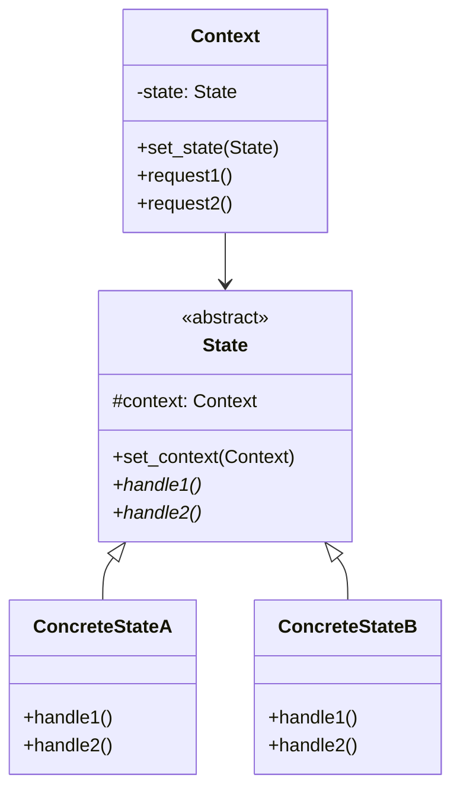
```mermaid
classDiagram
    class Context {
        -state: State
        +set_state(State)
        +request1()
        +request2()
    }

    class State {
        <<abstract>>
        #context: Context
        +set_context(Context)
        +handle1()*
        +handle2()*
    }

    class ConcreteStateA {
        +handle1()
        +handle2()
    }

    class ConcreteStateB {
        +handle1()
        +handle2()
    }

    Context --> State
    State <|-- ConcreteStateA
    State <|-- ConcreteStateB
```

### Code Python
```python
from abc import ABC, abstractmethod


class OrderState(ABC):
    def __init__(self):
        self._order = None

    def set_order(self, order: "Order"):
        self._order = order

    @abstractmethod
    def confirm(self) -> str:
        pass

    @abstractmethod
    def ship(self) -> str:
        pass

    @abstractmethod
    def deliver(self) -> str:
        pass

    @abstractmethod
    def cancel(self) -> str:
        pass

    def __str__(self):
        return self.__class__.__name__


class PendingState(OrderState):
    def confirm(self) -> str:
        self._order.transition_to(ConfirmedState())
        return "Order confirmed! Payment processed."

    def ship(self) -> str:
        return "Cannot ship - order not confirmed yet."

    def deliver(self) -> str:
        return "Cannot deliver - order not shipped."

    def cancel(self) -> str:
        self._order.transition_to(CancelledState())
        return "Order cancelled from pending state."


class ConfirmedState(OrderState):
    def confirm(self) -> str:
        return "Order already confirmed."

    def ship(self) -> str:
        self._order.transition_to(ShippedState())
        return "Order shipped! Tracking number assigned."

    def deliver(self) -> str:
        return "Cannot deliver - not shipped yet."

    def cancel(self) -> str:
        self._order.transition_to(CancelledState())
        return "Order cancelled. Refund initiated."


class ShippedState(OrderState):
    def confirm(self) -> str:
        return "Order already confirmed and shipped."

    def ship(self) -> str:
        return "Order already shipped."

    def deliver(self) -> str:
        self._order.transition_to(DeliveredState())
        return "Order delivered successfully!"

    def cancel(self) -> str:
        return "Cannot cancel - order is in transit."


class DeliveredState(OrderState):
    def confirm(self) -> str:
        return "Order delivered."

    def ship(self) -> str:
        return "Order already delivered."

    def deliver(self) -> str:
        return "Order already delivered."

    def cancel(self) -> str:
        return "Cannot cancel - order already delivered."


class CancelledState(OrderState):
    def confirm(self) -> str:
        return "Order is cancelled."

    def ship(self) -> str:
        return "Order is cancelled."

    def deliver(self) -> str:
        return "Order is cancelled."

    def cancel(self) -> str:
        return "Order already cancelled."


# Context
class Order:
    def __init__(self, order_id: str):
        self.order_id = order_id
        self._state: OrderState = PendingState()
        self._state.set_order(self)
        self._history = [str(self._state)]
        print(f"Order {order_id} created. State: {self._state}")

    def transition_to(self, state: OrderState):
        state.set_order(self)
        self._state = state
        self._history.append(str(state))
        print(f"   -> State changed to: {state}")

    def confirm(self):   print(self._state.confirm())
    def ship(self):      print(self._state.ship())
    def deliver(self):   print(self._state.deliver())
    def cancel(self):    print(self._state.cancel())

    def get_history(self):
        return " -> ".join(self._history)


if __name__ == "__main__":
    print("=== Order Lifecycle ===\n")
    order = Order("ORD-2024-001")
    print()

    order.ship()       # Cannot ship yet
    order.confirm()
    order.ship()
    order.cancel()     # Cannot cancel - in transit
    order.deliver()

    print(f"\nOrder history: {order.get_history()}")

    print("\n=== Cancellation Flow ===\n")
    order2 = Order("ORD-2024-002")
    order2.confirm()
    order2.cancel()
    order2.ship()      # Cannot ship - cancelled
```

---

## 20. Strategy

### Dinh Nghia
> **Strategy** dinh nghia mot ho cac thuat toan, dong goi tung thuat toan vao class rieng, va cho phep chung **co the hoan doi** voi nhau. Strategy cho phep thuat toan thay doi doc lap voi client su dung no.

### Van De Giai Quyet
- Can dung nhieu **variant cua thuat toan** va muon switch giua chung
- Tranh nhieu if/elif cho cac thuat toan khac nhau
- Vi du: Sorting (quicksort/mergesort), payment (cash/card/crypto)

### Khi Nao Ap Dung
- Nhieu cach sorting/searching
- Routing algorithms (fastest/shortest/scenic)
- Discount strategies
- Compression (zip/rar/7z)
- Validation strategies

### Uu Diem
- **Open/Closed** — them strategy moi khong sua context
- **Thay thuat toan tai runtime**
- Loai bo conditional statements
- Tach biet implementation khoi code dung no

### Nhuoc Diem
- Client phai biet su khac biet giua cac strategy
- Overkill neu chi co it thuat toan it thay doi
- Tang so luong objects/classes

### Class Diagram
```mermaid
classDiagram
    class Context {
        -strategy: Strategy
        +set_strategy(Strategy)
        +execute_strategy() any
    }

    class Strategy {
        <<interface>>
        +execute(data)* any
    }

    class ConcreteStrategyA {
        +execute(data) any
    }

    class ConcreteStrategyB {
        +execute(data) any
    }

    class ConcreteStrategyC {
        +execute(data) any
    }

    Context --> Strategy
    Strategy <|.. ConcreteStrategyA
    Strategy <|.. ConcreteStrategyB
    Strategy <|.. ConcreteStrategyC
```

### Code Python
```python
from abc import ABC, abstractmethod
from typing import List
import time


class SortStrategy(ABC):
    @abstractmethod
    def sort(self, data: List[int]) -> List[int]:
        pass

    def __str__(self):
        return self.__class__.__name__


class BubbleSortStrategy(SortStrategy):
    def sort(self, data: List[int]) -> List[int]:
        arr = data.copy()
        n = len(arr)
        for i in range(n):
            for j in range(0, n - i - 1):
                if arr[j] > arr[j + 1]:
                    arr[j], arr[j + 1] = arr[j + 1], arr[j]
        return arr


class QuickSortStrategy(SortStrategy):
    def sort(self, data: List[int]) -> List[int]:
        arr = data.copy()
        self._quick_sort(arr, 0, len(arr) - 1)
        return arr

    def _quick_sort(self, arr, low, high):
        if low < high:
            pivot_idx = self._partition(arr, low, high)
            self._quick_sort(arr, low, pivot_idx - 1)
            self._quick_sort(arr, pivot_idx + 1, high)

    def _partition(self, arr, low, high):
        pivot = arr[high]
        i = low - 1
        for j in range(low, high):
            if arr[j] <= pivot:
                i += 1
                arr[i], arr[j] = arr[j], arr[i]
        arr[i + 1], arr[high] = arr[high], arr[i + 1]
        return i + 1


class PythonBuiltinSortStrategy(SortStrategy):
    def sort(self, data: List[int]) -> List[int]:
        return sorted(data)


class ReverseSortStrategy(SortStrategy):
    def sort(self, data: List[int]) -> List[int]:
        return sorted(data, reverse=True)


class DataSorter:
    def __init__(self, strategy: SortStrategy = None):
        self._strategy = strategy or PythonBuiltinSortStrategy()

    @property
    def strategy(self):
        return self._strategy

    @strategy.setter
    def strategy(self, strategy: SortStrategy):
        self._strategy = strategy
        print(f"  Strategy changed to: {strategy}")

    def sort(self, data: List[int]) -> List[int]:
        start = time.perf_counter()
        result = self._strategy.sort(data)
        elapsed = (time.perf_counter() - start) * 1000
        print(f"  [{self._strategy}] Sorted {len(data)} items in {elapsed:.3f}ms")
        return result


class PaymentStrategy(ABC):
    @abstractmethod
    def pay(self, amount: float) -> bool:
        pass


class CashPayment(PaymentStrategy):
    def pay(self, amount: float) -> bool:
        print(f"  Paid ${amount:.2f} with cash")
        return True


class CreditCardPayment(PaymentStrategy):
    def __init__(self, card_number: str, cvv: str):
        self.card_number = card_number
        self.cvv = cvv

    def pay(self, amount: float) -> bool:
        print(f"  Charged ${amount:.2f} to card ****{self.card_number[-4:]}")
        return True


class CryptoPayment(PaymentStrategy):
    def __init__(self, wallet_address: str):
        self.wallet = wallet_address

    def pay(self, amount: float) -> bool:
        btc_amount = amount / 65000
        print(f"  Sent {btc_amount:.6f} BTC to {self.wallet[:10]}...")
        return True


class ShoppingCart:
    def __init__(self):
        self._items = []
        self._payment_strategy: PaymentStrategy = None

    def add_item(self, name: str, price: float):
        self._items.append((name, price))
        return self

    def set_payment(self, strategy: PaymentStrategy):
        self._payment_strategy = strategy

    def checkout(self) -> bool:
        if not self._payment_strategy:
            print("  No payment strategy set!")
            return False
        total = sum(price for _, price in self._items)
        print(f"  Total: ${total:.2f}")
        return self._payment_strategy.pay(total)


if __name__ == "__main__":
    import random
    data = [random.randint(1, 100) for _ in range(20)]

    sorter = DataSorter()
    strategies = [BubbleSortStrategy(), QuickSortStrategy(), PythonBuiltinSortStrategy(), ReverseSortStrategy()]

    print("=== Sorting Strategies ===")
    for strategy in strategies:
        sorter.strategy = strategy
        result = sorter.sort(data)
        print(f"  First 5: {result[:5]}")

    print("\n=== Payment Strategies ===")
    cart = ShoppingCart()
    cart.add_item("Laptop", 999.99).add_item("Mouse", 29.99)

    for payment in [
        CashPayment(),
        CreditCardPayment("1234567890123456", "123"),
        CryptoPayment("1A2B3C4D5E6F"),
    ]:
        print(f"\nPaying with {payment.__class__.__name__}:")
        cart.set_payment(payment)
        cart.checkout()
```

---

## 21. Template Method

### Dinh Nghia
> **Template Method** dinh nghia **skeleton (khung) cua mot thuat toan** trong superclass, nhung de subclass ghi de cac buoc cu the ma khong thay doi cau truc thuat toan.

### Van De Giai Quyet
- Nhieu class co cung **cau truc thuat toan** nhung khac implementation cac buoc
- Muon tranh trung lap code cau truc
- Vi du: Data mining, report generation, build process

### Khi Nao Ap Dung
- Khi nhieu class co thuat toan tuong tu, chi khac mot so buoc
- Game AI (setup -> play turns -> end)
- Report generation
- Build process (compile -> test -> deploy)

### Uu Diem
- Tranh **code duplication** — skeleton o 1 noi
- Client override chi nhung buoc can thiet
- **Open/Closed** — them variant bang subclass

### Nhuoc Diem
- Template method bi rang buoc voi superclass (skeleton cung)
- Liskov Substitution Principle co the bi vi pham
- Kho bao tri khi nhieu buoc

### Class Diagram
```mermaid
classDiagram
    class AbstractClass {
        +template_method() final
        +step1()
        +step2()*
        +step3()*
        +hook()
    }

    class ConcreteClass1 {
        +step2()
        +step3()
    }

    class ConcreteClass2 {
        +step2()
        +step3()
        +hook()
    }

    AbstractClass <|-- ConcreteClass1
    AbstractClass <|-- ConcreteClass2
```

### Code Python
```python
from abc import ABC, abstractmethod
from typing import List


class ReportGenerator(ABC):
    """
    Template Method trong generate_report() - khung co dinh.
    Subclass override cac buoc abstract.
    """

    def generate_report(self, data: list) -> str:
        """Template Method - KHONG override method nay."""
        output = []
        output.append(self._open_document())
        output.append(self._write_header())
        output.append(self._process_data(data))
        output.append(self._write_summary(data))
        if self._include_footer():  # Hook - optional override
            output.append(self._write_footer())
        output.append(self._close_document())
        return "\n".join(filter(None, output))

    @abstractmethod
    def _open_document(self) -> str:
        pass

    @abstractmethod
    def _write_header(self) -> str:
        pass

    @abstractmethod
    def _process_data(self, data: list) -> str:
        pass

    @abstractmethod
    def _close_document(self) -> str:
        pass

    def _write_summary(self, data: list) -> str:
        return f"Total records: {len(data)}"

    def _write_footer(self) -> str:
        return "--- End of Report ---"

    def _include_footer(self) -> bool:
        return True


class HTMLReport(ReportGenerator):
    def _open_document(self) -> str:
        return "<!DOCTYPE html>\n<html>\n<body>"

    def _write_header(self) -> str:
        return "<h1>Sales Report</h1><hr>"

    def _process_data(self, data: list) -> str:
        rows = "\n".join(
            f"  <tr><td>{i+1}</td><td>{item['name']}</td><td>${item['value']:.2f}</td></tr>"
            for i, item in enumerate(data)
        )
        return f"<table>\n  <tr><th>#</th><th>Name</th><th>Value</th></tr>\n{rows}\n</table>"

    def _write_summary(self, data: list) -> str:
        total = sum(item["value"] for item in data)
        return f"<p><b>Total: ${total:.2f} ({len(data)} records)</b></p>"

    def _close_document(self) -> str:
        return "</body>\n</html>"


class CSVReport(ReportGenerator):
    def _open_document(self) -> str:
        return "# CSV Report"

    def _write_header(self) -> str:
        return "id,name,value"

    def _process_data(self, data: list) -> str:
        return "\n".join(
            f"{i+1},{item['name']},{item['value']:.2f}"
            for i, item in enumerate(data)
        )

    def _write_summary(self, data: list) -> str:
        total = sum(item["value"] for item in data)
        return f"# Total: ${total:.2f}"

    def _close_document(self) -> str:
        return "# EOF"

    def _include_footer(self) -> bool:
        return False  # CSV khong can footer


class MarkdownReport(ReportGenerator):
    def _open_document(self) -> str:
        return "# Sales Report\n"

    def _write_header(self) -> str:
        return "| # | Name | Value |\n|---|------|-------|"

    def _process_data(self, data: list) -> str:
        return "\n".join(
            f"| {i+1} | {item['name']} | ${item['value']:.2f} |"
            for i, item in enumerate(data)
        )

    def _write_summary(self, data: list) -> str:
        total = sum(item["value"] for item in data)
        return f"\n**Total: ${total:.2f}** | *{len(data)} records*"

    def _close_document(self) -> str:
        return "\n---\n*Generated automatically*"


if __name__ == "__main__":
    sales_data = [
        {"name": "Product A", "value": 1250.00},
        {"name": "Product B", "value": 890.50},
        {"name": "Product C", "value": 3200.75},
        {"name": "Product D", "value": 450.25},
    ]

    generators = {
        "HTML":     HTMLReport(),
        "CSV":      CSVReport(),
        "Markdown": MarkdownReport(),
    }

    for format_name, generator in generators.items():
        print(f"\n{'='*50}")
        print(f"=== {format_name} Report ===")
        print('='*50)
        print(generator.generate_report(sales_data))
```

---

## 22. Visitor

### Dinh Nghia
> **Visitor** cho phep ban **them cac thao tac (operations) moi** vao cac class hien co ma **khong can sua doi chung**, bang cach tach biet thuat toan khoi cau truc object ma no hoat dong.

### Van De Giai Quyet
- Can them nhieu operation khac nhau vao mot class hierarchy ma khong muon "o nhiem" chung
- Vi du: AST trong compiler (serialize, compile, optimize deu la visitor)
- Export object theo nhieu format khac nhau

### Khi Nao Ap Dung
- Compiler (AST traversal)
- Export data sang nhieu format (XML, JSON, CSV)
- Tinh thue khac nhau cho cac loai san pham
- Khi can them nhieu operation vao object hierarchy on dinh

### Uu Diem
- **Open/Closed** — them visitor moi khong sua element classes
- **Single Responsibility** — tap hop related behavior vao 1 visitor class
- Visitor co the tich luy state khi duyet

### Nhuoc Diem
- Phai update tat ca visitor khi them/bot element class
- Visitor co the khong co quyen truy cap private members
- **Double dispatch** kho hieu

### Class Diagram
```mermaid
classDiagram
    class Visitor {
        <<interface>>
        +visit_element_a(ElementA)*
        +visit_element_b(ElementB)*
    }

    class ConcreteVisitor1 {
        +visit_element_a(ElementA)
        +visit_element_b(ElementB)
    }

    class Element {
        <<interface>>
        +accept(Visitor)*
    }

    class ElementA {
        +accept(Visitor)
        +feature_a()
    }

    class ElementB {
        +accept(Visitor)
        +feature_b()
    }

    Visitor <|.. ConcreteVisitor1
    Element <|.. ElementA
    Element <|.. ElementB
    ElementA --> Visitor : accepts
    ElementB --> Visitor : accepts
```

### Code Python
```python
from abc import ABC, abstractmethod
from typing import List
import math


class ShapeVisitor(ABC):
    @abstractmethod
    def visit_circle(self, circle: "Circle"):
        pass

    @abstractmethod
    def visit_rectangle(self, rectangle: "Rectangle"):
        pass

    @abstractmethod
    def visit_triangle(self, triangle: "Triangle"):
        pass


class Shape(ABC):
    @abstractmethod
    def accept(self, visitor: ShapeVisitor):
        pass


class Circle(Shape):
    def __init__(self, radius: float):
        self.radius = radius

    def accept(self, visitor: ShapeVisitor):
        visitor.visit_circle(self)


class Rectangle(Shape):
    def __init__(self, width: float, height: float):
        self.width = width
        self.height = height

    def accept(self, visitor: ShapeVisitor):
        visitor.visit_rectangle(self)


class Triangle(Shape):
    def __init__(self, base: float, height: float):
        self.base = base
        self.height = height

    def accept(self, visitor: ShapeVisitor):
        visitor.visit_triangle(self)


class AreaCalculator(ShapeVisitor):
    """Visitor tinh dien tich - khong sua Shape classes."""

    def __init__(self):
        self.total_area = 0.0
        self._results = {}

    def visit_circle(self, circle: Circle):
        area = math.pi * circle.radius ** 2
        self._results[f"Circle(r={circle.radius})"] = area
        self.total_area += area

    def visit_rectangle(self, rectangle: Rectangle):
        area = rectangle.width * rectangle.height
        self._results[f"Rect({rectangle.width}x{rectangle.height})"] = area
        self.total_area += area

    def visit_triangle(self, triangle: Triangle):
        area = 0.5 * triangle.base * triangle.height
        self._results[f"Triangle(b={triangle.base},h={triangle.height})"] = area
        self.total_area += area

    def report(self):
        print("  Area Report:")
        for name, area in self._results.items():
            print(f"    {name}: {area:.2f}")
        print(f"    Total: {self.total_area:.2f}")


class PerimeterCalculator(ShapeVisitor):
    """Visitor tinh chu vi - them operation ma khong sua Shape!"""

    def __init__(self):
        self._results = {}

    def visit_circle(self, circle: Circle):
        self._results[f"Circle(r={circle.radius})"] = 2 * math.pi * circle.radius

    def visit_rectangle(self, rectangle: Rectangle):
        self._results["Rectangle"] = 2 * (rectangle.width + rectangle.height)

    def visit_triangle(self, triangle: Triangle):
        hyp = math.sqrt(triangle.base**2 + triangle.height**2)
        self._results["Triangle"] = triangle.base + 2 * hyp

    def report(self):
        print("  Perimeter Report:")
        for name, peri in self._results.items():
            print(f"    {name}: {peri:.2f}")


class XMLExporter(ShapeVisitor):
    def __init__(self):
        self._output = ["<shapes>"]

    def visit_circle(self, circle: Circle):
        self._output.append(f'  <circle radius="{circle.radius}"/>')

    def visit_rectangle(self, rectangle: Rectangle):
        self._output.append(
            f'  <rectangle width="{rectangle.width}" height="{rectangle.height}"/>'
        )

    def visit_triangle(self, triangle: Triangle):
        self._output.append(
            f'  <triangle base="{triangle.base}" height="{triangle.height}"/>'
        )

    def get_xml(self) -> str:
        return "\n".join(self._output + ["</shapes>"])


if __name__ == "__main__":
    shapes: List[Shape] = [
        Circle(5),
        Rectangle(4, 6),
        Triangle(3, 8),
        Circle(2.5),
        Rectangle(10, 3),
    ]

    print("=== Area Calculation (Visitor 1) ===")
    area_calc = AreaCalculator()
    for shape in shapes:
        shape.accept(area_calc)
    area_calc.report()

    print("\n=== Perimeter Calculation (Visitor 2) ===")
    peri_calc = PerimeterCalculator()
    for shape in shapes:
        shape.accept(peri_calc)
    peri_calc.report()

    print("\n=== XML Export (Visitor 3) ===")
    exporter = XMLExporter()
    for shape in shapes:
        shape.accept(exporter)
    print(exporter.get_xml())
```

---

## 23. Interpreter

### Dinh Nghia
> **Interpreter** dinh nghia mot **representation cho grammar** cua mot ngon ngu va cung cap mot interpreter de xu ly grammar do.

### Van De Giai Quyet
- Can parse va evaluate cac cau trong mot **ngon ngu don gian**
- Vi du: SQL parser, regex engine, math expression evaluator, scripting language

### Khi Nao Ap Dung
- Math expression parser
- SQL-like query language
- Regular expression engine
- Configuration scripting
- Business rules engine

### Uu Diem
- De thay doi va mo rong grammar
- Implement grammar de dang (moi rule -> 1 class)
- Co the them operation moi qua Visitor

### Nhuoc Diem
- Grammar phuc tap -> nhieu class nho, kho quan ly
- Hieu nang kem voi grammar phuc tap (dung parser generator thay the)
- Kho maintain khi grammar thay doi nhieu

### Class Diagram
```mermaid
classDiagram
    class AbstractExpression {
        <<abstract>>
        +interpret(context)* int
    }

    class TerminalExpression {
        -value
        +interpret(context) int
    }

    class NonterminalExpression {
        -left: AbstractExpression
        -right: AbstractExpression
        +interpret(context) int
    }

    class Context {
        +variables: dict
    }

    AbstractExpression <|-- TerminalExpression
    AbstractExpression <|-- NonterminalExpression
    NonterminalExpression --> AbstractExpression
```

### Code Python
```python
from abc import ABC, abstractmethod
from typing import Dict


class Context:
    """Chua bien va thong tin can thiet khi interpret."""
    def __init__(self):
        self.variables: Dict[str, int] = {}

    def set_variable(self, name: str, value: int):
        self.variables[name] = value

    def get_variable(self, name: str) -> int:
        if name not in self.variables:
            raise NameError(f"Variable '{name}' not defined")
        return self.variables[name]


class Expression(ABC):
    @abstractmethod
    def interpret(self, context: Context) -> int:
        pass


# Terminal Expressions
class NumberExpression(Expression):
    def __init__(self, value: int):
        self.value = value

    def interpret(self, context: Context) -> int:
        return self.value


class VariableExpression(Expression):
    def __init__(self, name: str):
        self.name = name

    def interpret(self, context: Context) -> int:
        return context.get_variable(self.name)


# Non-Terminal Expressions
class AddExpression(Expression):
    def __init__(self, left: Expression, right: Expression):
        self.left = left
        self.right = right

    def interpret(self, context: Context) -> int:
        return self.left.interpret(context) + self.right.interpret(context)


class SubtractExpression(Expression):
    def __init__(self, left: Expression, right: Expression):
        self.left = left
        self.right = right

    def interpret(self, context: Context) -> int:
        return self.left.interpret(context) - self.right.interpret(context)


class MultiplyExpression(Expression):
    def __init__(self, left: Expression, right: Expression):
        self.left = left
        self.right = right

    def interpret(self, context: Context) -> int:
        return self.left.interpret(context) * self.right.interpret(context)


class DivideExpression(Expression):
    def __init__(self, left: Expression, right: Expression):
        self.left = left
        self.right = right

    def interpret(self, context: Context) -> int:
        divisor = self.right.interpret(context)
        if divisor == 0:
            raise ZeroDivisionError("Division by zero")
        return self.left.interpret(context) // self.right.interpret(context)


class NegateExpression(Expression):
    def __init__(self, operand: Expression):
        self.operand = operand

    def interpret(self, context: Context) -> int:
        return -self.operand.interpret(context)


# Parser
class SimpleParser:
    def __init__(self, expression: str, context: Context):
        self.tokens = self._tokenize(expression)
        self.context = context
        self.pos = 0

    def _tokenize(self, expression: str) -> list:
        import re
        return re.findall(r'\d+|[a-zA-Z_]\w*|[+\-*/()]', expression.replace(' ', ''))

    def _peek(self):
        if self.pos < len(self.tokens):
            return self.tokens[self.pos]
        return None

    def _consume(self):
        token = self.tokens[self.pos]
        self.pos += 1
        return token

    def parse(self) -> Expression:
        return self._parse_additive()

    def _parse_additive(self) -> Expression:
        left = self._parse_multiplicative()
        while self._peek() in ('+', '-'):
            op = self._consume()
            right = self._parse_multiplicative()
            if op == '+':
                left = AddExpression(left, right)
            else:
                left = SubtractExpression(left, right)
        return left

    def _parse_multiplicative(self) -> Expression:
        left = self._parse_primary()
        while self._peek() in ('*', '/'):
            op = self._consume()
            right = self._parse_primary()
            if op == '*':
                left = MultiplyExpression(left, right)
            else:
                left = DivideExpression(left, right)
        return left

    def _parse_primary(self) -> Expression:
        token = self._peek()
        if token == '(':
            self._consume()
            expr = self._parse_additive()
            self._consume()
            return expr
        elif token == '-':
            self._consume()
            return NegateExpression(self._parse_primary())
        elif token and token.isdigit():
            self._consume()
            return NumberExpression(int(token))
        elif token and token.isidentifier():
            self._consume()
            return VariableExpression(token)
        raise SyntaxError(f"Unexpected token: {token}")


if __name__ == "__main__":
    ctx = Context()
    ctx.set_variable("x", 10)
    ctx.set_variable("y", 5)
    ctx.set_variable("z", 3)

    expressions = [
        "x + y",
        "x - y + z",
        "x * y",
        "x * y + z",
        "(x + y) * z",
        "x * (y - z) + 2",
        "100 / (y * z) + x",
    ]

    print("=== Expression Interpreter ===")
    print(f"x={ctx.variables['x']}, y={ctx.variables['y']}, z={ctx.variables['z']}\n")

    for expr_str in expressions:
        parser = SimpleParser(expr_str, ctx)
        tree = parser.parse()
        result = tree.interpret(ctx)
        print(f"  {expr_str:25} = {result}")

    # Manual tree building
    print("\n=== Manual Expression Tree ===")
    # (3 + x) * (y - 2) manually
    expr = MultiplyExpression(
        AddExpression(NumberExpression(3), VariableExpression("x")),
        SubtractExpression(VariableExpression("y"), NumberExpression(2))
    )
    result = expr.interpret(ctx)
    print(f"  (3 + x) * (y - 2) = (3 + 10) * (5 - 2) = {result}")
```

---

## Tong Ket va So Sanh

### Bang So Sanh 23 Design Patterns

| Pattern | Nhom | Giai Quyet | Khi Dung | Do Phuc Tap |
|---------|------|------------|----------|-------------|
| **Singleton** | Creational | 1 instance duy nhat | Logger, Config | Trung binh |
| **Factory Method** | Creational | De subclass tao object | Plugin, UI | Trung binh |
| **Abstract Factory** | Creational | Ho object tuong thich | Cross-platform UI | Cao |
| **Builder** | Creational | Object phuc tap tung buoc | SQL query, Config | Trung binh |
| **Prototype** | Creational | Clone object | Game enemies | Thap |
| **Adapter** | Structural | Interface khong khop | Legacy code | Thap |
| **Bridge** | Structural | Tach abstraction/impl | Cross-platform | Cao |
| **Composite** | Structural | Cau truc cay | File system | Trung binh |
| **Decorator** | Structural | Them behavior runtime | Middleware | Trung binh |
| **Facade** | Structural | Don gian hoa he thong | API Gateway | Thap |
| **Flyweight** | Structural | Tiet kiem memory | Game particles | Cao |
| **Proxy** | Structural | Kiem soat truy cap | Cache, Auth | Trung binh |
| **Chain of Resp.** | Behavioral | Chuoi xu ly | Middleware | Trung binh |
| **Command** | Behavioral | Dong goi operation | Undo/Redo | Trung binh |
| **Iterator** | Behavioral | Duyet collection | Custom traversal | Thap |
| **Mediator** | Behavioral | Giam coupling | Chat, GUI | Trung binh |
| **Memento** | Behavioral | Luu/khoi phuc state | Undo, Checkpoint | Trung binh |
| **Observer** | Behavioral | Thong bao thay doi | Event system | Trung binh |
| **State** | Behavioral | Behavior theo state | State machine | Trung binh |
| **Strategy** | Behavioral | Hoan doi thuat toan | Sort, Payment | Thap |
| **Template Method** | Behavioral | Skeleton thuat toan | Report generator | Thap |
| **Visitor** | Behavioral | Them operation | Compiler, Export | Cao |
| **Interpreter** | Behavioral | Parse ngon ngu | Calc, DSL | Cao |

---

### Quan He Giua Cac Pattern

```mermaid
graph LR
    A[Factory Method] --> |specialized| B[Abstract Factory]
    B --> |often uses| C[Prototype]
    B --> |often uses| D[Singleton]

    E[Decorator] --> |similar structure| F[Proxy]
    E --> |similar structure| G[Composite]
    F --> |similar| G

    H[Command] --> |stored in| I[Memento]
    H --> |used with| J["Chain of Resp"]

    K[Strategy] --> |similar| L[Template Method]
    K --> |similar| M[State]

    N[Observer] --> |related| O[Mediator]

    P[Visitor] --> |traverses| G
```

---

### Nguyen Tac SOLID va Design Patterns

| SOLID | Ap Dung Trong Pattern |
|-------|----------------------|
| **S** - Single Responsibility | Command, Chain of Resp, Iterator |
| **O** - Open/Closed | Strategy, Observer, Decorator, Factory |
| **L** - Liskov Substitution | Template Method, Strategy |
| **I** - Interface Segregation | Facade, Abstract Factory |
| **D** - Dependency Inversion | Factory Method, Abstract Factory, DI |

---

### Khi Nao Dung Pattern Nao?

```
Can tao object phuc tap?
   -> Builder (nhieu params) / Factory Method (subclass quyet dinh)

Can 1 instance toan cuc?
   -> Singleton (can than voi testing!)

Can clone object?
   -> Prototype

Interface khong khop?
   -> Adapter

Qua nhieu class khi ket hop 2 dimension?
   -> Bridge

Cau truc cay (phan-toan the)?
   -> Composite

Them behavior khong sua class?
   -> Decorator (runtime) / Visitor (them nhieu operation)

He thong qua phuc tap?
   -> Facade

Qua nhieu object giong nhau?
   -> Flyweight

Kiem soat truy cap / lazy loading?
   -> Proxy

Nhieu handler co the xu ly request?
   -> Chain of Responsibility

Can undo/redo?
   -> Command + Memento

Duyet collection phuc tap?
   -> Iterator

Qua nhieu object giao tiep voi nhau?
   -> Mediator

Thong bao khi state thay doi?
   -> Observer

Behavior thay doi theo state?
   -> State

Can hoan doi thuat toan?
   -> Strategy

Cau truc thuat toan co dinh, buoc thay doi?
   -> Template Method

Can parse ngon ngu don gian?
   -> Interpreter
```

---

### Anti-Patterns Thuong Gap

| Anti-Pattern | Mo Ta | Pattern Thay The |
|-------------|-------|-----------------|
| **God Object** | 1 class biet/lam qua nhieu | Facade + SRP |
| **Singleton Abuse** | Dung Singleton cho moi thu | Dependency Injection |
| **Premature Optimization** | Dung Flyweight qua som | Profiling truoc |
| **Anemic Domain Model** | Objects chi co data, khong co behavior | Rich Domain Model |
| **Circular Dependencies** | A->B->C->A | Mediator / DI |

---
