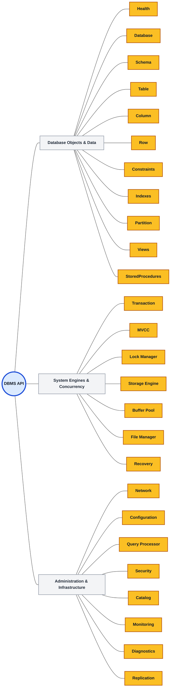
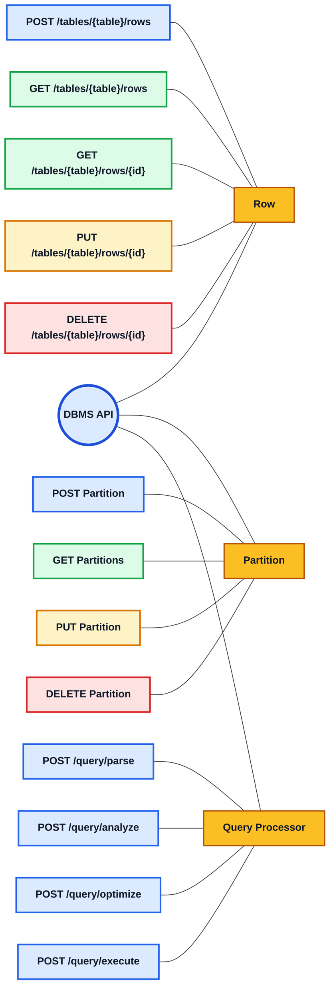
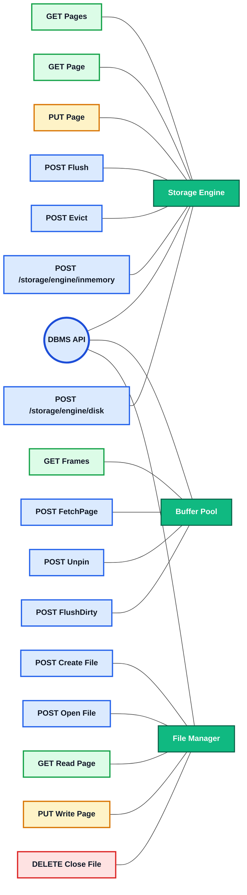
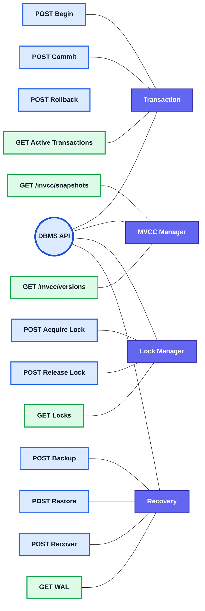

# DBMS API Mindmap & Sub-systems

This document presents the REST API structure of the Database Management System (DBMS). Due to the complexity of the API, it is broken down into a high-level **Overview Mindmap** followed by readable **Sub-Mindmaps** representing specific logical areas.

---

## 1. High-Level Overview Mindmap
A broad overview of the endpoints and subsystems connected to the central API gateway.

---

## 2. Detailed Sub-Mindmaps

### Sub-Mindmap A: Data Objects & Schema Management
*Covers database creation, schema definitions, tables, columns, constraints, views, and index operations.*

```mermaid
flowchart LR
    API((DBMS API))
    
    %% Modules
    API --- Database
    API --- Schema
    API --- Table
    API --- Column
    API --- Constraints
    API --- Indexes
    API --- Views
    
    %% Database API
    DB1["POST /databases"] --- Database
    DB2["GET /databases"] --- Database
    DB3["GET /databases/{db}"] --- Database
    DB4["DELETE /databases/{db}"] --- Database
    DB5["POST /databases/{db}/open"] --- Database
    DB6["POST /databases/{db}/close"] --- Database
    DB7["POST /databases/{db}/readonly"] --- Database
    DB8["POST /databases/{db}/recovery"] --- Database

    %% Schema API
    SC1["POST /databases/{db}/schemas"] --- Schema
    SC2["GET /databases/{db}/schemas"] --- Schema
    SC3["GET /databases/{db}/schemas/{schema}"] --- Schema
    SC4["PUT /databases/{db}/schemas/{schema}"] --- Schema
    SC5["DELETE /databases/{db}/schemas/{schema}"] --- Schema

    %% Table API
    TB1["POST /schemas/{schema}/tables"] --- Table
    TB2["GET /schemas/{schema}/tables"] --- Table
    TB3["GET /schemas/{schema}/tables/{table}"] --- Table
    TB4["PUT /schemas/{schema}/tables/{table}"] --- Table
    TB5["DELETE /schemas/{schema}/tables/{table}"] --- Table

    %% Column API
    C1["POST /tables/{table}/columns"] --- Column
    C2["GET /tables/{table}/columns"] --- Column
    C3["PUT /tables/{table}/columns/{column}"] --- Column
    C4["DELETE /tables/{table}/columns/{column}"] --- Column

    %% Constraints API
    CT1["POST CheckConstraint"] --- Constraints
    CT2["POST PrimaryKey"] --- Constraints
    CT3["POST Unique"] --- Constraints
    CT4["POST ForeignKey"] --- Constraints
    CT5["PUT Constraint"] --- Constraints
    CT6["DELETE Constraint"] --- Constraints

    %% Indexes API
    I1["POST /tables/{table}/indexes"] --- Indexes
    I2["GET /tables/{table}/indexes"] --- Indexes
    I3["DELETE /tables/{table}/indexes/{index}"] --- Indexes
    I4["POST Search"] --- Indexes
    I5["POST RangeSearch"] --- Indexes

    %% Views API
    V1["POST View"] --- Views
    V2["GET Views"] --- Views
    V3["PUT View"] --- Views
    V4["DELETE View"] --- Views

    classDef root fill:#dbeafe,stroke:#1d4ed8,stroke-width:4px,color:#111827,font-weight:bold
    classDef module fill:#ef4444,stroke:#7f1d1d,stroke-width:2px,color:#ffffff,font-weight:bold
    classDef get fill:#dcfce7,stroke:#16a34a,stroke-width:2.5px,color:#111827
    classDef post fill:#dbeafe,stroke:#2563eb,stroke-width:2.5px,color:#111827
    classDef put fill:#fef3c7,stroke:#d97706,stroke-width:2.5px,color:#111827
    classDef delete fill:#fee2e2,stroke:#dc2626,stroke-width:2.5px,color:#111827

    class API root
    class Database,Schema,Table,Column,Constraints,Indexes,Views module
    class DB2,DB3,SC2,SC3,TB2,TB3,C2,I2,V2 get
    class DB1,DB5,DB6,DB7,DB8,SC1,TB1,C1,CT1,CT2,CT3,CT4,I1,I4,I5,V1 post
    class SC4,TB4,C3,CT5,V3 put
    class DB4,SC5,TB5,C4,CT6,I3,V4 delete
```

---

### Sub-Mindmap B: Data Manipulation & Query Processing
*Covers row operations, SQL queries, and partitioned access.*

---

### Sub-Mindmap C: Storage, Buffer Pool, & File Management
*Covers lower-level page caching, memory frame tracking, and physical file persistence.*

---

### Sub-Mindmap D: Concurrency, Transactions, & Recovery
*Covers Two-Phase Locking (2PL), MVCC snapshots, and WAL recovery operations.*

---

### Sub-Mindmap E: Security, Networking, & Administration
*Covers user management, performance counters, diagnostic logging, and cluster replication.*

```mermaid
flowchart LR
    API((DBMS API))
    
    %% Modules
    API --- Network["Network Manager"]
    API --- Config["Configuration"]
    API --- Security
    API --- Catalog
    API --- Monitoring
    API --- Diagnostics
    API --- Replication
    
    %% Network API
    NW1["GET /network/status"] --- Network
    NW2["GET /network/connections"] --- Network
    NW3["POST /network/disconnect"] --- Network

    %% Config API
    CFG1["GET /config"] --- Config
    CFG2["PUT /config"] --- Config

    %% Security API
    SEC1["POST Login"] --- Security
    SEC2["POST Logout"] --- Security
    SEC3["POST Users"] --- Security
    SEC4["POST Roles"] --- Security
    SEC5["POST Permissions"] --- Security

    %% Catalog API
    CAT1["GET Objects"] --- Catalog
    CAT2["GET Statistics"] --- Catalog
    CAT3["POST UpdateStatistics"] --- Catalog

    %% Monitoring API
    M1["GET Metrics"] --- Monitoring
    M2["GET Performance"] --- Monitoring
    M3["GET BufferPool"] --- Monitoring
    M4["GET Transactions"] --- Monitoring

    %% Diagnostics API
    DIAG1["GET /diagnostics/errors"] --- Diagnostics
    DIAG2["GET /diagnostics/logs"] --- Diagnostics

    %% Replication API
    REP1["GET Nodes"] --- Replication
    REP2["POST Sync"] --- Replication
    REP3["POST AddNode"] --- Replication
    REP4["DELETE RemoveNode"] --- Replication

    classDef root fill:#dbeafe,stroke:#1d4ed8,stroke-width:4px,color:#111827,font-weight:bold
    classDef module fill:#a855f7,stroke:#6b21a8,stroke-width:2px,color:#ffffff,font-weight:bold
    classDef get fill:#dcfce7,stroke:#16a34a,stroke-width:2.5px,color:#111827
    classDef post fill:#dbeafe,stroke:#2563eb,stroke-width:2.5px,color:#111827
    classDef put fill:#fef3c7,stroke:#d97706,stroke-width:2.5px,color:#111827
    classDef delete fill:#fee2e2,stroke:#dc2626,stroke-width:2.5px,color:#111827

    class API root
    class Network,Config,Security,Catalog,Monitoring,Diagnostics,Replication module
    class NW1,NW2,CFG1,CAT1,CAT2,M1,M2,M3,M4,DIAG1,DIAG2,REP1 get
    class NW3,SEC1,SEC2,SEC3,SEC4,SEC5,CAT3,REP2,REP3 post
    class CFG2 put
    class REP4 delete
```

