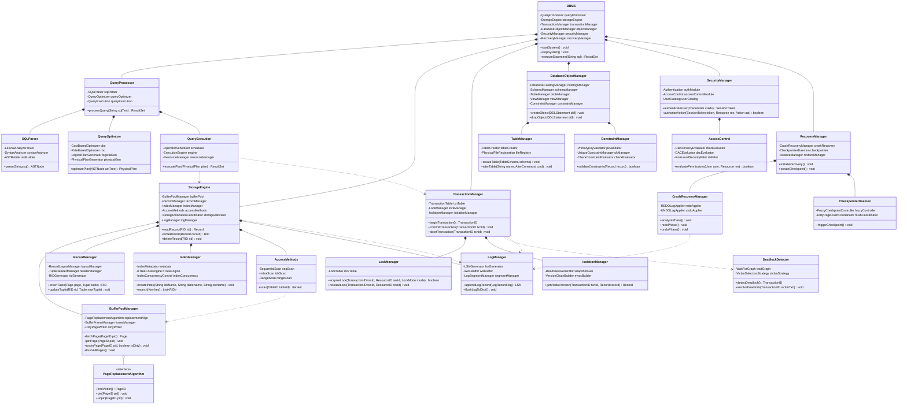

```mermaid
classDiagram
    %% Core DBMS Architecture
    class DBMS {
        -QueryProcessor queryProcessor
        -StorageEngine storageEngine
        -TransactionManager transactionManager
        -DatabaseObjectManager objectManager
        -SecurityManager securityManager
        -RecoveryManager recoveryManager
        +startSystem() void
        +stopSystem() void
        +executeStatement(String sql) ResultSet
    }

    %% -----------------------------------------
    %% Query Processor Subsystem
    %% -----------------------------------------
    class QueryProcessor {
        -SQLParser sqlParser
        -QueryOptimizer queryOptimizer
        -QueryExecution queryExecution
        +processQuery(String sqlText) ResultSet
    }

    class SQLParser {
        -LexicalAnalyzer lexer
        -SyntaxAnalyzer syntaxAnalyzer
        -ASTBuilder astBuilder
        +parse(String sql) ASTNode
    }

    class QueryOptimizer {
        -CostBasedOptimizer cbo
        -RuleBasedOptimizer rbo
        -LogicalPlanGenerator logicalGen
        -PhysicalPlanGenerator physicalGen
        +optimizePlan(ASTNode astTree) PhysicalPlan
    }

    class QueryExecution {
        -OperatorScheduler scheduler
        -ExecutionEngine engine
        -ResourceManager resourceManager
        +executePlan(PhysicalPlan plan) ResultSet
    }

    %% -----------------------------------------
    %% Storage Engine Subsystem
    %% -----------------------------------------
    class StorageEngine {
        -BufferPoolManager bufferPool
        -RecordManager recordManager
        -IndexManager indexManager
        -AccessMethods accessMethods
        -StorageAllocationCoordinator storageAllocator
        -LogManager logManager
        +readRecord(RID rid) Record
        +writeRecord(Record record) RID
        +deleteRecord(RID rid) void
    }

    class BufferPoolManager {
        -PageReplacementAlgorithm replacementAlgo
        -BufferFrameManager frameManager
        -DirtyPageWriter dirtyWriter
        +fetchPage(PageID pid) Page
        +pinPage(PageID pid) void
        +unpinPage(PageID pid, boolean isDirty) void
        +flushAllPages() void
    }

    class PageReplacementAlgorithm {
        <<interface>>
        +findVictim() PageID
        +pin(PageID pid) void
        +unpin(PageID pid) void
    }

    class RecordManager {
        -RecordLayoutManager layoutManager
        -TupleHeaderManager headerManager
        -RIDGenerator ridGenerator
        +insertTuple(Page page, Tuple tuple) RID
        +updateTuple(RID rid, Tuple newTuple) void
    }

    class IndexManager {
        -IndexMetadata metadata
        -BTreeCoreEngine bTreeEngine
        -IndexConcurrencyControl indexConcurrency
        +createIndex(String idxName, String tableName, String colName) void
        +search(Key key) List~RID~
    }

    class AccessMethods {
        -SequentialScan seqScan
        -IndexScan idxScan
        -RangeScan rangeScan
        +scan(TableID tableId) Iterator
    }

    class LogManager {
        -LSNGenerator lsnGenerator
        -WALBuffer walBuffer
        -LogSegmentManager segmentManager
        +appendLogRecord(LogRecord log) LSN
        +flushLogToDisk() void
    }

    %% -----------------------------------------
    %% Transaction Subsystem
    %% -----------------------------------------
    class TransactionManager {
        -TransactionTable txnTable
        -LockManager lockManager
        -IsolationManager isolationManager
        +beginTransaction() TransactionID
        +commitTransaction(TransactionID txnId) void
        +abortTransaction(TransactionID txnId) void
    }

    class LockManager {
        -LockTable lockTable
        +acquireLock(TransactionID txnId, ResourceID resId, LockMode mode) boolean
        +releaseLock(TransactionID txnId, ResourceID resId) void
    }

    class DeadlockDetector {
        -WaitForGraph waitGraph
        -VictimSelectionStrategy victimStrategy
        +detectDeadlock() TransactionID
        +resolveDeadlock(TransactionID victimTxn) void
    }

    class IsolationManager {
        -ReadViewGenerator snapshotGen
        -VersionChainBuilder mvccBuilder
        +getVisibleVersion(TransactionID txnId, Record record) Record
    }

    %% -----------------------------------------
    %% Database Object Management
    %% -----------------------------------------
    class DatabaseObjectManager {
        -DatabaseCatalogManager catalogManager
        -SchemaManager schemaManager
        -TableManager tableManager
        -ViewManager viewManager
        -ConstraintManager constraintManager
        +createObject(DDLStatement ddl) void
        +dropObject(DDLStatement ddl) void
    }

    class TableManager {
        -TableCreator tableCreator
        -PhysicalFileRegistration fileRegistry
        +createTable(TableSchema schema) void
        +alterTable(String name, AlterCommand cmd) void
    }

    class ConstraintManager {
        -PrimaryKeyValidator pkValidator
        -UniqueConstraintManager ukManager
        -CheckConstraintEvaluator checkEvaluator
        +validateConstraints(Record record) boolean
    }

    %% -----------------------------------------
    %% Backup & Durability
    %% -----------------------------------------
    class RecoveryManager {
        -CrashRecoveryManager crashRecovery
        -CheckpointerDaemon checkpointer
        -RestoreManager restoreManager
        +initiateRecovery() void
        +createCheckpoint() void
    }

    class CrashRecoveryManager {
        -REDOLogApplier redoApplier
        -UNDOLogApplier undoApplier
        +analyzePhase() void
        +redoPhase() void
        +undoPhase() void
    }

    class CheckpointerDaemon {
        -FuzzyCheckpointController fuzzyController
        -DirtyPageFlushCoordinator flushCoordinator
        +triggerCheckpoint() void
    }

    %% -----------------------------------------
    %% Security & Access Control
    %% -----------------------------------------
    class SecurityManager {
        -Authentication authModule
        -AccessControl accessControlModule
        -UserCatalog userCatalog
        +authenticateUser(Credentials creds) SessionToken
        +authorizeAction(SessionToken token, Resource res, Action act) boolean
    }

    class AccessControl {
        -RBACPolicyEvaluator rbacEvaluator
        -DACEvaluator dacEvaluator
        -RowLevelSecurityFilter rlsFilter
        +evaluatePermissions(User user, Resource res) boolean
    }

    %% -----------------------------------------
    %% Dependencies and Relationships
    %% -----------------------------------------
    DBMS *-- QueryProcessor
    DBMS *-- StorageEngine
    DBMS *-- TransactionManager
    DBMS *-- DatabaseObjectManager
    DBMS *-- SecurityManager
    DBMS *-- RecoveryManager

    QueryProcessor *-- SQLParser
    QueryProcessor *-- QueryOptimizer
    QueryProcessor *-- QueryExecution

    StorageEngine *-- BufferPoolManager
    StorageEngine *-- RecordManager
    StorageEngine *-- IndexManager
    StorageEngine *-- AccessMethods
    StorageEngine *-- LogManager

    BufferPoolManager o-- PageReplacementAlgorithm
    
    TransactionManager *-- LockManager
    TransactionManager *-- IsolationManager
    TransactionManager ..> DeadlockDetector

    RecoveryManager *-- CrashRecoveryManager
    RecoveryManager *-- CheckpointerDaemon

    DatabaseObjectManager *-- TableManager
    DatabaseObjectManager *-- ConstraintManager

    SecurityManager *-- AccessControl

    %% Cross-Subsystem Dependencies
    QueryExecution ..> StorageEngine
    QueryExecution ..> TransactionManager
    StorageEngine ..> LogManager
    CrashRecoveryManager ..> LogManager
    AccessMethods ..> BufferPoolManager
    TransactionManager ..> LogManager
```
