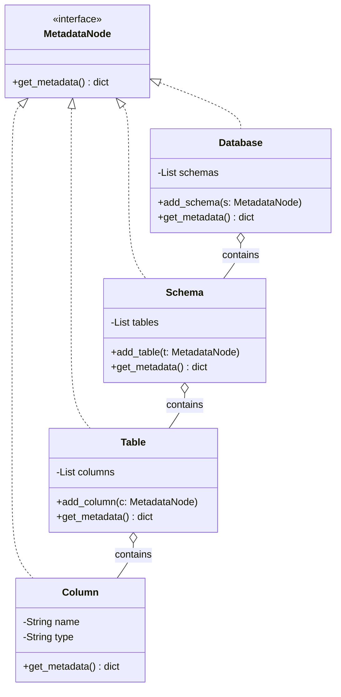
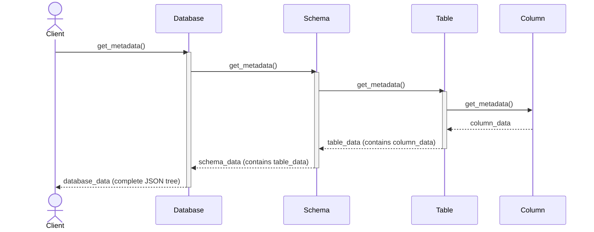
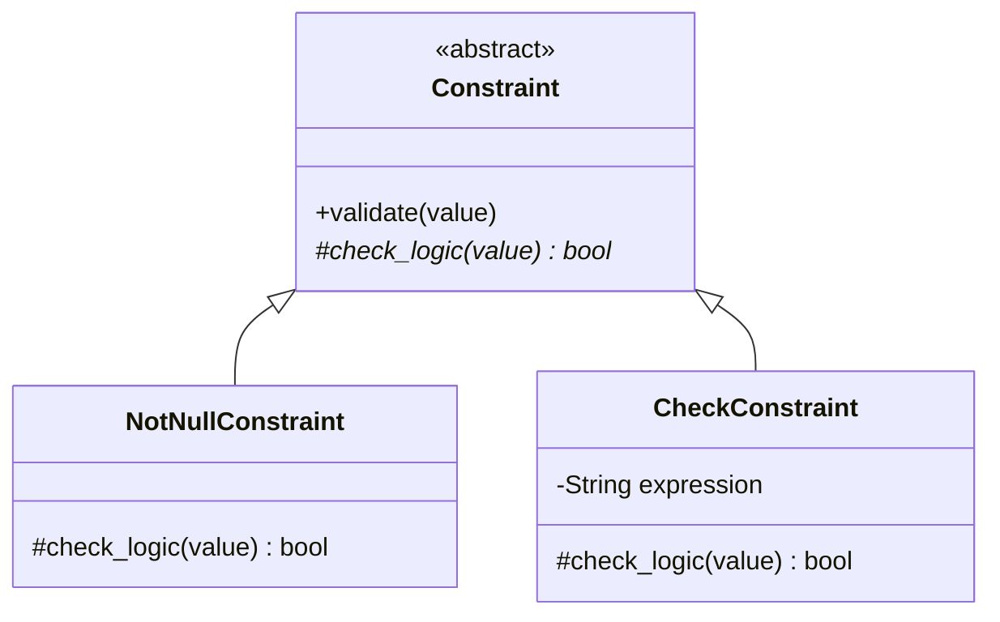
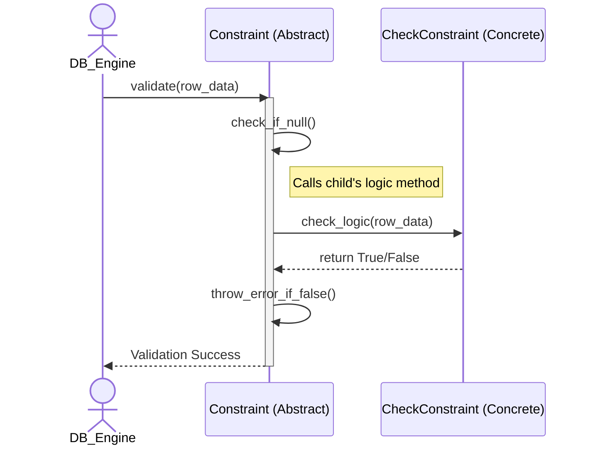

# Design Pattern Analysis: Database Object Management


## 1. Database Objects

This group manages the data-constituent components (Schemas, Tables, Constraints...).

| Priority | Feature | Design Pattern | Reason / Context |
| :---: | :--- | :--- | :--- |
| **Highest** | Database Objects | **Composite** | Database contains Schemas, Schema contains Tables/Views, and manages them uniformly. |
| **High** | Constraint Validation | **Template Method** | `Validate()` defines the workflow, each constraint only implements `Check()`. |
| **High** | Object Creation | **Factory Method** | Centralizes instantiation logic for various metadata objects like Indexes and Triggers. |
| **Medium High** | Referential Action | **Strategy** | Selects Cascade, Restrict, SetNull, or SetDefault behavior when deleting/updating. |
| **Medium High** | Schema Cloning | **Prototype** | Enables cloning of an existing Table or Schema structure without creating from scratch. |
| **Medium High** | Privilege Checking | **Chain of Responsibility** | Passes permission checks sequentially from Database -> Schema -> Table levels. |
| **Medium** | DDL Command | **Command** | `CreateTable`, `DropTable`, and `AlterTable` operations are encapsulated into executable objects. |
| **Medium** | Metadata Caching | **Proxy** | Acts as a placeholder for Table definitions to allow lazy-loading from disk. |
| **Medium** | Table Modification | **Decorator** | Dynamically attaches temporary constraints or properties to a Table during execution. |
| **Medium** | Schema Navigation | **Iterator** | Provides sequential access to traverse all objects in a schema transparently. |

## 2. Database Management

This group provides the external interface and manages the database lifecycle.

| Priority | Feature | Design Pattern | Reason / Context |
| :---: | :--- | :--- | :--- |
| **Highest** | Catalog Management | **Singleton** | Ensures exactly one global registry instance manages all database metadata. |
| **High** | DatabaseServer | **Facade** | Provides a single unified API to start, stop and configure database server. |
| **High** | Server Config | **Builder** | Constructs complex server startup configurations (memory size, thread pool) step by step. |
| **Medium High** | Database Lifecycle | **State** | Database transitions between states such as Offline, Online, ReadOnly, and Recovering. |
| **Medium High** | Database Events | **Observer** | Monitoring systems receive events for Create, Drop, Backup, and Restore. |
| **Medium High** | Connection Pooling | **Object Pool** | Reuses a fixed pool of client connections to avoid costly startup/teardown overhead. |
| **Medium High** | Storage Adapter | **Adapter** | Wraps the native OS file system API into a standard DBMS storage interface. |
| **Medium** | Backup/Restore | **Template Method**| Provides a fixed backup workflow, while differentiating between Full and Incremental. |
| **Medium** | Task Scheduling | **Command** | Encapsulates background tasks (vacuum, statistics gathering) into queueable objects. |
| **Medium** | Perf Monitoring | **Visitor** | Gathers health statistics by visiting various management components without modifying them. |

---

# Deep Dive Analysis (Class Diagrams & Sequence Diagrams)

Below is a detailed analysis for the deeply evaluated features mentioned above. The structure covers the Reason for choosing the Pattern, static Class Diagrams, dynamic Sequence Diagrams, and TDD Code examples.

## 1. Composite Pattern: Database Objects (Highest Priority)

*   **Why choose Composite instead of discrete `Lists` or rigid hierarchies?**
    In a DBMS, metadata is naturally hierarchical: A Database contains multiple Schemas, a Schema contains multiple Tables, and a Table contains multiple Columns. If we model this using rigid, separate lists (e.g., Database managing `List<Schema>`, Schema managing `List<Table>`), we face significant challenges when performing system-wide operations like calculating total storage size, generating a comprehensive DDL export, or traversing the object tree.
    
    Without the Composite pattern, traversing this hierarchy requires tightly coupled code with multiple nested `for` loops and type-checking (e.g., `if (obj instanceof Table)`). 
    
    **The Composite Pattern Solves This By:**
    1. **Uniformity:** It introduces a common interface (`MetadataNode`) for both leaf nodes (Columns, which have no children) and composite branches (Database, Schema, Table, which contain children).
    2. **Recursive Traversal:** Operations like `get_metadata()` are delegated down the tree. The client only needs to call `get_metadata()` on the root `Database` object, and the request automatically propagates down to the lowest `Column` level via recursion.
    3. **Extensibility:** If we later introduce new metadata objects like `View` or `Index` inside a Schema, we simply implement the `MetadataNode` interface. The core traversal logic remains entirely untouched, adhering perfectly to the Open/Closed Principle (OCP).

### Class Diagram


### Sequence Diagram


### TDD Code Example
```python
# All nodes in the tree inherit this interface
class MetadataNode:
    def get_metadata(self): pass

# Composite (Nodes containing children: Database, Schema, Table)
class Database(MetadataNode):
    def __init__(self):
        self.schemas = []
        
    def get_metadata(self):
        # Recursively collect data from all Schemas inside
        return [schema.get_metadata() for schema in self.schemas]

class Schema(MetadataNode):
    def __init__(self):
        self.tables = []
        
    def get_metadata(self):
        # Recursively collect data from all Tables inside
        return [table.get_metadata() for table in self.tables]
```

---

## 2. Template Method Pattern: Constraint (High Priority)

*   **Why choose Template Method instead of discrete, independent checking functions?**
    A relational database enforces various Constraints (`NotNull`, `Check`, `Unique`, `PrimaryKey`). While the specific business logic for each constraint differs, the overall validation lifecycle is largely identical across all of them:
    1. **Pre-processing:** Skip validation if the incoming value is `Null` (unless it's a NotNull constraint).
    2. **Core Logic Check:** Perform the actual validation rule (e.g., `value > 0`).
    3. **Post-processing:** Throw a standardized `ConstraintViolationException` if the check fails.

    If we implement these as independent functions, developers must manually copy-paste the pre-processing and post-processing boilerplate into every single constraint class. This leads to code duplication and the risk of inconsistent error handling (e.g., one constraint throws an error, another returns a boolean).

    **The Template Method Pattern Solves This By:**
    1. **Inversion of Control (The Hollywood Principle):** The abstract base class (`Constraint`) takes control of the overall algorithm's skeleton via the `validate()` method. It says to the subclasses: "Don't call us, we'll call you."
    2. **Code Reusability:** All boilerplate logic (null checks, exception throwing) is centralized in the base class.
    3. **Strict Enforcement:** The workflow is strictly enforced and cannot be altered by child classes. Subclasses are forced to implement *only* the specific abstract hook method (`check_logic()`), ensuring absolute consistency across the entire database engine.

### Class Diagram


### Sequence Diagram


### TDD Code Example
```python
class Constraint:
    def validate(self, value): # Hard-coded workflow skeleton (Immutable)
        if value is None: return True
        if not self.check_logic(value): 
            raise Exception("Constraint Violation!")
            
    def check_logic(self, value): raise NotImplementedError()

class CheckConstraint(Constraint):
    def check_logic(self, value): return value > 0 # Child class focuses purely on core logic
```
