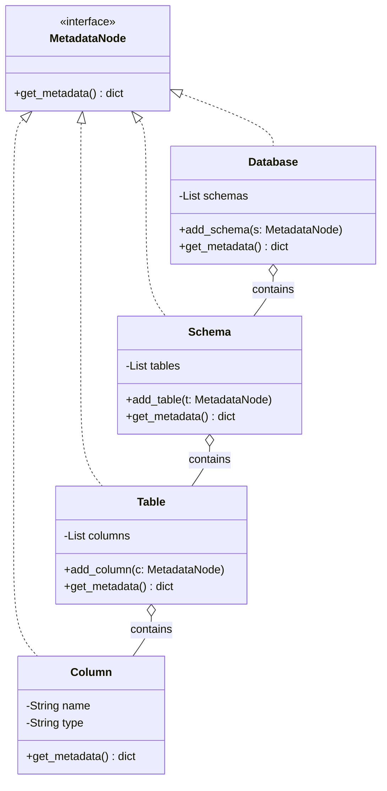
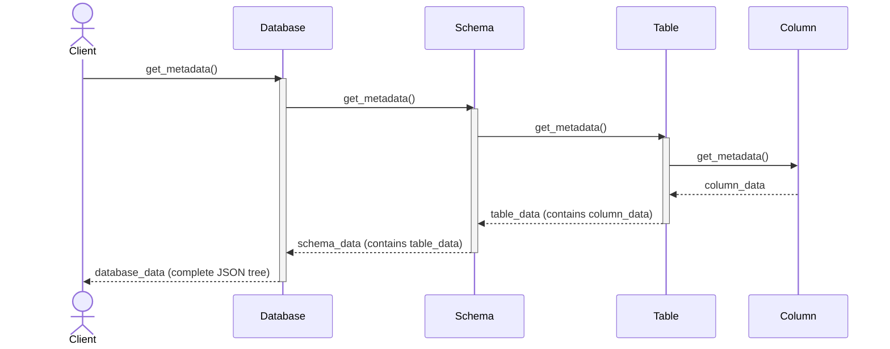
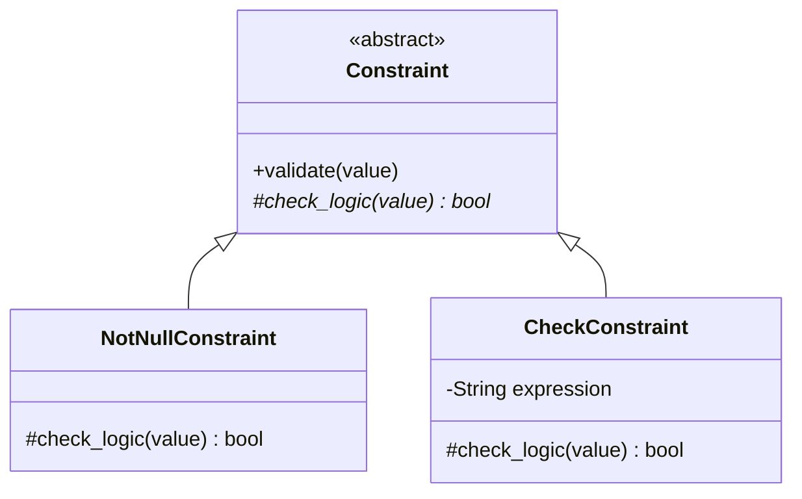
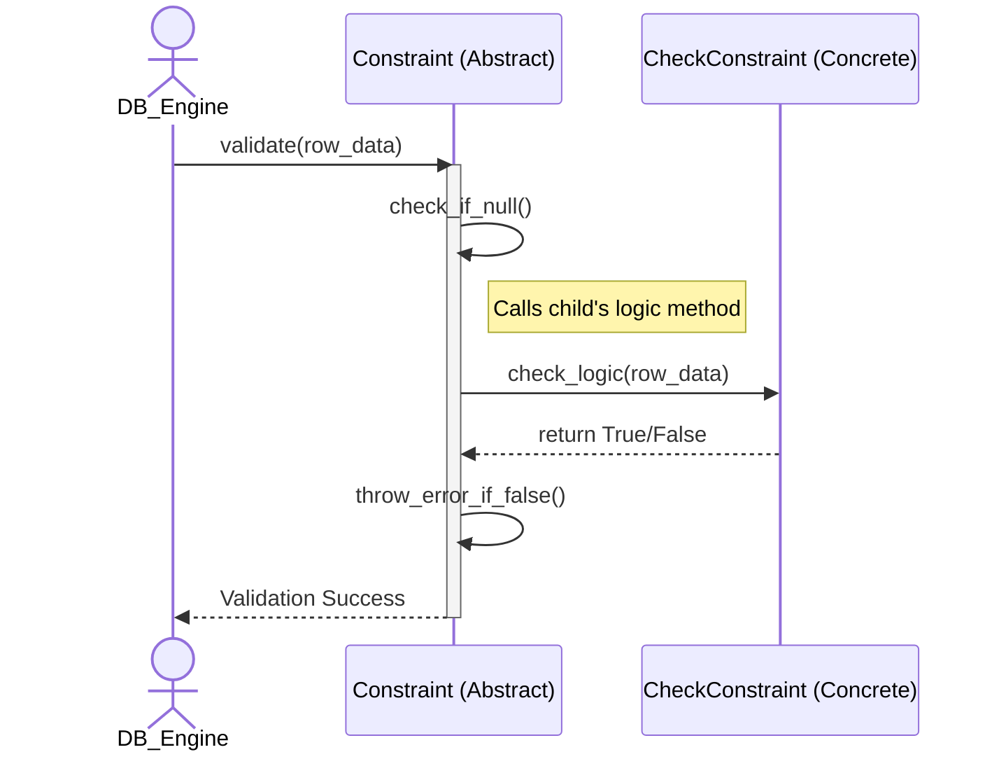

# Design Pattern Analysis: Database Object Management


## 📊 1. Database Objects

This group manages the data-constituent components (Schemas, Tables, Constraints...).

| Priority | Feature | Design Pattern | Reason / Context |
| :---: | :--- | :--- | :--- |
| 🔥 **Highest** | Database Objects | **Composite** | Database contains Schemas, Schema contains Tables/Views, and manages them uniformly. |
| 🌟 **High** | Constraint Validation | **Template Method** | `Validate()` defines the workflow, each constraint only implements `Check()`. |
| 🌟 **High** | Object Creation | **Factory Method** | Centralizes instantiation logic for various metadata objects like Indexes and Triggers. |
| ⭐ **Medium High** | Referential Action | **Strategy** | Selects Cascade, Restrict, SetNull, or SetDefault behavior when deleting/updating. |
| ⭐ **Medium High** | Schema Cloning | **Prototype** | Enables cloning of an existing Table or Schema structure without creating from scratch. |
| ⭐ **Medium High** | Privilege Checking | **Chain of Responsibility** | Passes permission checks sequentially from Database -> Schema -> Table levels. |
| 💡 **Medium**| DDL Command | **Command** | `CreateTable`, `DropTable`, and `AlterTable` operations are encapsulated into executable objects. |
| 💡 **Medium**| Metadata Caching | **Proxy** | Acts as a placeholder for Table definitions to allow lazy-loading from disk. |
| 💡 **Medium**| Table Modification | **Decorator** | Dynamically attaches temporary constraints or properties to a Table during execution. |
| 💡 **Medium**| Schema Navigation | **Iterator** | Provides sequential access to traverse all objects in a schema transparently. |

## 📊 2. Database Management

This group provides the external interface and manages the database lifecycle.

| Priority | Feature | Design Pattern | Reason / Context |
| :---: | :--- | :--- | :--- |
| 🔥 **Highest** | Catalog Management | **Singleton** | Ensures exactly one global registry instance manages all database metadata. |
| 🌟 **High** | DatabaseServer | **Facade** | Provides a single unified API to start, stop and configure database server. |
| 🌟 **High** | Server Config | **Builder** | Constructs complex server startup configurations (memory size, thread pool) step by step. |
| ⭐ **Medium High** | Database Lifecycle | **State** | Database transitions between states such as Offline, Online, ReadOnly, and Recovering. |
| ⭐ **Medium High** | Database Events | **Observer** | Monitoring systems receive events for Create, Drop, Backup, and Restore. |
| ⭐ **Medium High** | Connection Pooling | **Object Pool** | Reuses a fixed pool of client connections to avoid costly startup/teardown overhead. |
| ⭐ **Medium High** | Storage Adapter | **Adapter** | Wraps the native OS file system API into a standard DBMS storage interface. |
| 💡 **Medium**| Backup/Restore | **Template Method**| Provides a fixed backup workflow, while differentiating between Full and Incremental. |
| 💡 **Medium**| Task Scheduling | **Command** | Encapsulates background tasks (vacuum, statistics gathering) into queueable objects. |
| 💡 **Medium**| Perf Monitoring | **Visitor** | Gathers health statistics by visiting various management components without modifying them. |

---

# Deep Dive Analysis (Class Diagrams & Sequence Diagrams)

Below is a detailed analysis for the deeply evaluated features mentioned above. The structure covers the Reason for choosing the Pattern, static Class Diagrams, dynamic Sequence Diagrams, and TDD Code examples.

## 1. Composite Pattern: Database Objects (🔥 Highest Priority)

*   **Why choose Composite instead of a discrete `List`?** 
    If you let the Database manage an array of Schemas, and the Schema manage an array of discrete Tables... When the system needs to calculate total storage size (Size) or export the entire Metadata structure (Export), you would have to write multiple nested `for` loops. Composite groups everything (Database, Schema, Table, Column) into a single `MetadataNode` interface. Calling a recursive method once will scan the entire massive data tree.

### 🧩 Class Diagram


### 🔄 Sequence Diagram


### 💻 TDD Code Example
```python
# All nodes in the tree inherit this interface
class MetadataNode:
    def get_metadata(self): pass

# Composite (Nodes containing children: Database, Schema, Table)
class Database(MetadataNode):
    def __init__(self):
        self.schemas = []
        
    def get_metadata(self):
        # Recursively collect data from all Schemas inside
        return [schema.get_metadata() for schema in self.schemas]

class Schema(MetadataNode):
    def __init__(self):
        self.tables = []
        
    def get_metadata(self):
        # Recursively collect data from all Tables inside
        return [table.get_metadata() for table in self.tables]
```

---

## 2. Template Method Pattern: Constraint (🌟 High Priority)

*   **Why choose Template Method instead of discrete checking functions?**
    The system has multiple Constraints: `NotNull`, `Check`, `Unique`. Their validation flow is identical: (1) Skip if the value is Null, (2) Check business logic, (3) Throw an error if false. Without Template Method, you would have to copy/paste steps (1) and (3) everywhere. This pattern hard-codes the workflow skeleton in the base class, so child classes only need to implement the core logic (2).

### 🧩 Class Diagram


### 🔄 Sequence Diagram


### 💻 TDD Code Example
```python
class Constraint:
    def validate(self, value): # Hard-coded workflow skeleton (Immutable)
        if value is None: return True
        if not self.check_logic(value): 
            raise Exception("Constraint Violation!")
            
    def check_logic(self, value): raise NotImplementedError()

class CheckConstraint(Constraint):
    def check_logic(self, value): return value > 0 # Child class focuses purely on core logic
```
