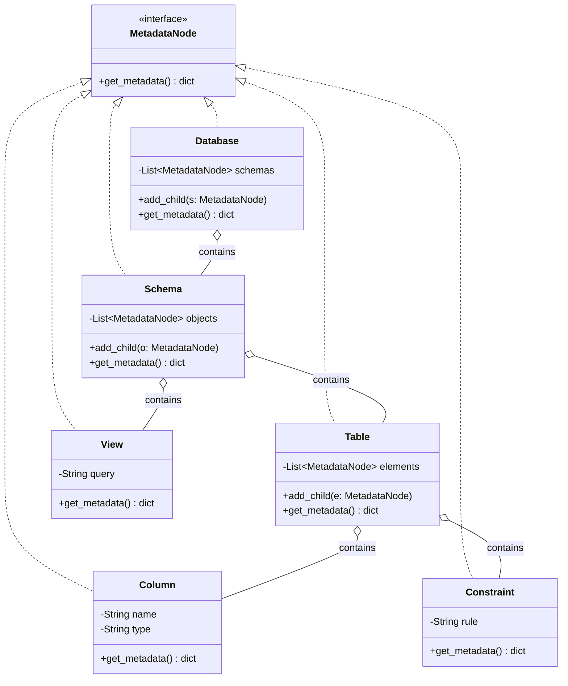
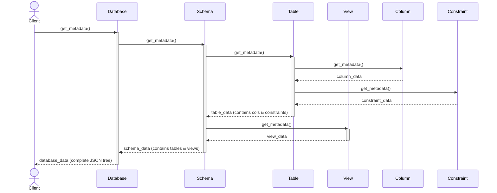
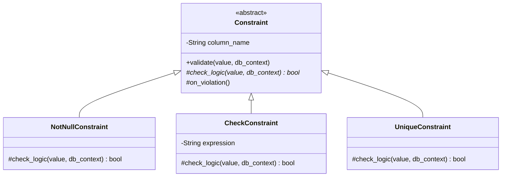
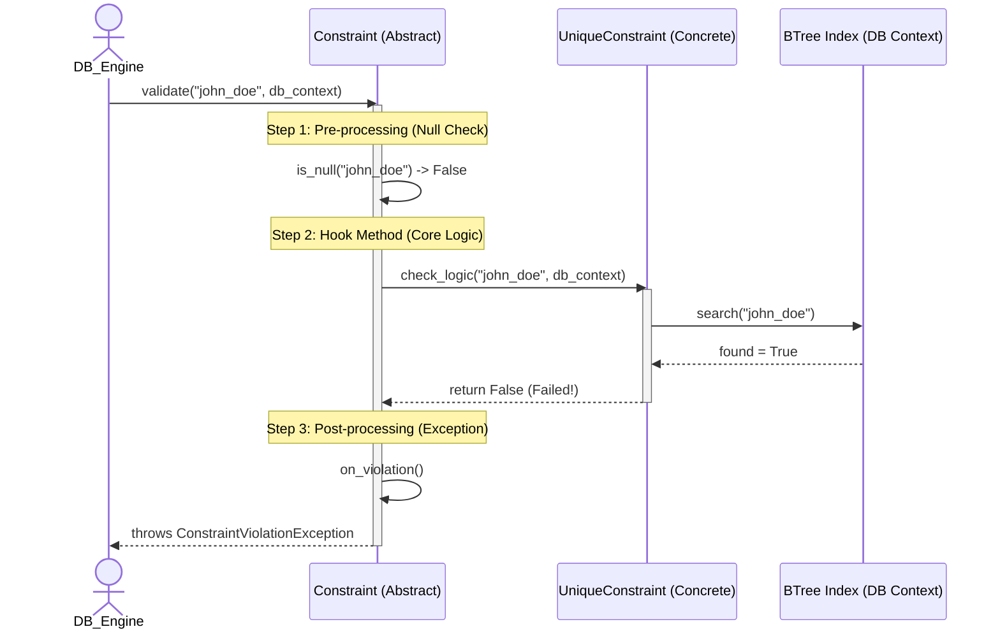
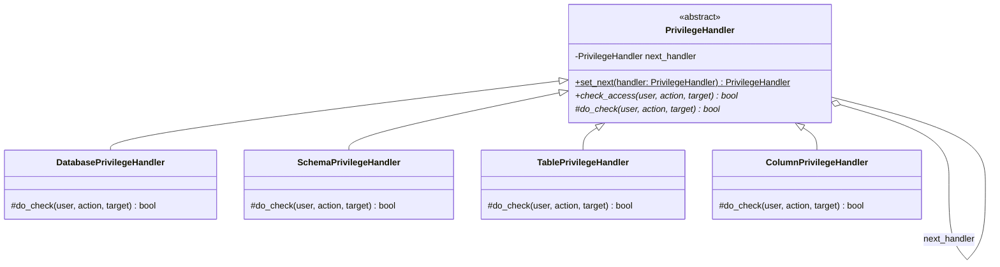
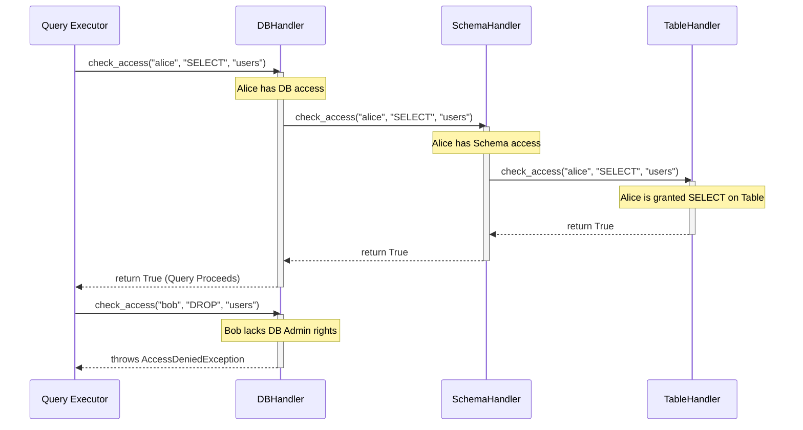

# Design Pattern Analysis: Database Object Management


## 1. Database Objects

This group manages the data-constituent components (Schemas, Tables, Constraints...).

| Priority | Feature | Design Pattern | Reason / Context |
| :---: | :--- | :--- | :--- |
| **Highest** | Database Objects | **Composite** | Database contains Schemas, Schema contains Tables/Views, and manages them uniformly. |
| **High** | Constraint Validation | **Template Method** | `Validate()` defines the workflow, each constraint only implements `Check()`. |
| **High** | Object Creation | **Factory Method** | Centralizes instantiation logic for various metadata objects like Indexes and Triggers. |
| **Medium High** | Referential Action | **Strategy** | Selects Cascade, Restrict, SetNull, or SetDefault behavior when deleting/updating. |
| **Medium High** | Schema Cloning | **Prototype** | Enables cloning of an existing Table or Schema structure without creating from scratch. |
| **Medium High** | Privilege Checking | **Chain of Responsibility** | Passes permission checks sequentially from Database -> Schema -> Table levels. |
| **Medium** | DDL Command | **Command** | `CreateTable`, `DropTable`, and `AlterTable` operations are encapsulated into executable objects. |
| **Medium** | Metadata Caching | **Proxy** | Acts as a placeholder for Table definitions to allow lazy-loading from disk. |
| **Medium** | Table Modification | **Decorator** | Dynamically attaches temporary constraints or properties to a Table during execution. |
| **Medium** | Schema Navigation | **Iterator** | Provides sequential access to traverse all objects in a schema transparently. |
| **Medium** | Data Type Sharing | **Flyweight** | Shares common data type instances (e.g., `INT`) across thousands of columns to save RAM. |
| **Medium** | Metadata Snapshot | **Memento** | Captures Table schema state before an `ALTER` operation to allow rollback on failure. |
| **Medium** | View Refreshment | **Strategy** | Allows switching between `Immediate`, `Deferred`, or `OnDemand` view materialization algorithms. |
| **Medium** | Trigger Notification | **Observer** | When a row changes, the Table notifies all attached Triggers to execute their custom logic. |
| **Medium** | Dependency Validation | **Visitor** | Traverses Views and Stored Procedures to check for broken dependencies when a base Table drops. |

## 2. Database Management

This group provides the external interface and manages the database lifecycle.

| Priority | Feature | Design Pattern | Reason / Context |
| :---: | :--- | :--- | :--- |
| **Highest** | Catalog Management | **Singleton** | Ensures exactly one global registry instance manages all database metadata. |
| **High** | DatabaseServer | **Facade** | Provides a single unified API to start, stop and configure database server. |
| **High** | Server Config | **Builder** | Constructs complex server startup configurations (memory size, thread pool) step by step. |
| **Medium High** | Database Lifecycle | **State** | Database transitions between states such as Offline, Online, ReadOnly, and Recovering. |
| **Medium High** | Database Events | **Observer** | Monitoring systems receive events for Create, Drop, Backup, and Restore. |
| **Medium High** | Connection Pooling | **Object Pool** | Reuses a fixed pool of client connections to avoid costly startup/teardown overhead. |
| **Medium High** | Storage Adapter | **Adapter** | Wraps the native OS file system API into a standard DBMS storage interface. |
| **Medium** | Backup/Restore | **Template Method**| Provides a fixed backup workflow, while differentiating between Full and Incremental. |
| **Medium** | Task Scheduling | **Command** | Encapsulates background tasks (vacuum, statistics gathering) into queueable objects. |
| **Medium** | Perf Monitoring | **Visitor** | Gathers health statistics by visiting various management components without modifying them. |
| **Medium High** | Query Execution | **Iterator** | Employs the Volcano model where physical operators (`Join`, `Filter`) fetch rows via `next()`. |
| **Medium High** | Buffer Eviction | **Strategy** | Encapsulates page replacement algorithms (LRU, Clock, LFU) to allow dynamic switching at runtime. |
| **Medium** | Access Control | **Proxy** | A security proxy intercepts client connections to verify permissions before hitting the actual Database Engine. |
| **Medium** | Config Resolution | **Chain of Responsibility** | Resolves settings by checking session-level, database-level, and global-level configs sequentially. |
| **Medium** | Transaction Savepoint | **Memento** | Stores a snapshot of the transaction's internal state to support partial rollbacks without full aborts. |

---

# Deep Dive Analysis (Class Diagrams & Sequence Diagrams)

Below is a detailed analysis for 3 heavily evaluated features. Each feature is broken down thoroughly with precise technical explanations, comprehensive UML diagrams, and robust Python TDD code.

## 1. Composite Pattern: Database Objects (Highest Priority)

*   **Why choose Composite instead of discrete `Lists` or rigid hierarchies?**
    In a DBMS, metadata is naturally hierarchical: A Database contains multiple Schemas, a Schema contains multiple Tables/Views, and a Table contains multiple Columns and Constraints. If we model this using rigid, separate lists (e.g., `List<Table>`, `List<View>`, `List<Constraint>`), we face significant challenges when performing system-wide operations like calculating total storage size, generating a comprehensive DDL export, or traversing the object tree.
    
    Without the Composite pattern, traversing this hierarchy requires tightly coupled code with multiple nested `for` loops and type-checking (e.g., `if (obj instanceof Table)`). 
    
    **The Composite Pattern Solves This By:**
    1. **Uniformity:** It introduces a common interface (`MetadataNode`) for both leaf nodes (Columns, Constraints - which have no children) and composite branches (Database, Schema, Table - which contain children).
    2. **Recursive Traversal:** Operations like `get_metadata()` are delegated down the tree. The client only needs to call `get_metadata()` on the root `Database` object, and the request automatically propagates down to the lowest `Column` or `Constraint` level via recursion.
    3. **Extensibility:** If we later introduce new metadata objects like `Trigger` or `Index`, we simply implement the `MetadataNode` interface. The core traversal logic remains entirely untouched, adhering perfectly to the Open/Closed Principle (OCP).

### Class Diagram


### Sequence Diagram


### TDD Code Example
```python
# All nodes in the tree inherit this interface
class MetadataNode:
    def get_metadata(self): pass

# Composite (Nodes containing children)
class Database(MetadataNode):
    def __init__(self): self.children = []
    def add_child(self, child: MetadataNode): self.children.append(child)
    def get_metadata(self):
        return {"type": "Database", "children": [c.get_metadata() for c in self.children]}

class Schema(MetadataNode):
    def __init__(self): self.children = []
    def add_child(self, child: MetadataNode): self.children.append(child)
    def get_metadata(self):
        return {"type": "Schema", "children": [c.get_metadata() for c in self.children]}

class Table(MetadataNode):
    def __init__(self, name): 
        self.name = name
        self.children = []
    def add_child(self, child: MetadataNode): self.children.append(child)
    def get_metadata(self):
        return {"type": "Table", "name": self.name, "children": [c.get_metadata() for c in self.children]}

# Leaf Nodes (No children)
class View(MetadataNode):
    def __init__(self, name): self.name = name
    def get_metadata(self): return {"type": "View", "name": self.name}

class Column(MetadataNode):
    def __init__(self, name, col_type): 
        self.name = name
        self.col_type = col_type
    def get_metadata(self): return {"type": "Column", "name": self.name, "col_type": self.col_type}

class Constraint(MetadataNode):
    def __init__(self, rule): self.rule = rule
    def get_metadata(self): return {"type": "Constraint", "rule": self.rule}

# --- TEST CODE ---
db = Database()
schema = Schema()
table = Table("Users")
table.add_child(Column("id", "INT"))
table.add_child(Constraint("PRIMARY KEY (id)"))

schema.add_child(table)
schema.add_child(View("ActiveUsers"))
db.add_child(schema)

# One call recursively builds the entire tree
import json
print(json.dumps(db.get_metadata(), indent=2))
```

---

## 2. Template Method Pattern: Constraint Validation (High Priority)

*   **Why choose Template Method instead of discrete, independent checking functions?**
    A relational database enforces various Constraints (`NotNull`, `Check`, `Unique`, `PrimaryKey`). While the specific business logic for each constraint differs drastically (e.g., `NotNull` just checks memory, whereas `Unique` must query the B-Tree index on disk), the overall validation lifecycle is identical across all of them:
    1. **Pre-processing:** Skip validation if the incoming value is `Null` (unless it's a NotNull constraint itself).
    2. **Core Logic Check:** Perform the actual validation rule (e.g., `value > 0` or `lookup_index()`).
    3. **Post-processing:** Throw a standardized `ConstraintViolationException` if the check fails, ensuring the transaction aborts.

    If we implement these as independent functions, developers must manually copy-paste the pre-processing and post-processing boilerplate into every single constraint class. This leads to code duplication and the dangerous risk of inconsistent error handling (e.g., one constraint throws an error, another accidentally returns a boolean).

    **The Template Method Pattern Solves This By:**
    1. **Inversion of Control (The Hollywood Principle):** The abstract base class (`Constraint`) takes control of the overall algorithm's skeleton via the `validate()` method. It says to the subclasses: "Don't call us, we'll call you."
    2. **Code Reusability:** All boilerplate logic (null checks, exception throwing) is centralized in the base class.
    3. **Strict Enforcement:** The workflow is strictly enforced and cannot be altered by child classes. Subclasses are forced to implement *only* the specific abstract hook method (`check_logic()`), ensuring absolute consistency across the entire database engine.

### Class Diagram


### Sequence Diagram


### TDD Code Example
```python
class ConstraintViolationException(Exception):
    pass

class Constraint:
    def __init__(self, col_name):
        self.col_name = col_name

    def validate(self, value, db_context): 
        # Hard-coded workflow skeleton (Immutable by children)
        if value is None and not isinstance(self, NotNullConstraint): 
            return True # Pre-processing: Skip nulls for standard constraints
            
        if not self.check_logic(value, db_context): # Core Logic Hook
            self.on_violation(value) # Post-processing
            
    def check_logic(self, value, db_context): 
        raise NotImplementedError("Subclasses must implement this hook!")
        
    def on_violation(self, value):
        raise ConstraintViolationException(f"Column '{self.col_name}' violated constraint with value '{value}'!")

class CheckConstraint(Constraint):
    def check_logic(self, value, db_context): 
        return value > 0 # Simple memory check

class UniqueConstraint(Constraint):
    def check_logic(self, value, db_context):
        # Complex DB lookup check
        index_data = db_context.get_index(self.col_name)
        return value not in index_data

class NotNullConstraint(Constraint):
    def check_logic(self, value, db_context):
        return value is not None

# --- TEST CODE ---
class MockDBContext:
    def get_index(self, col): return ["admin", "root"]

db_context = MockDBContext()

# Test 1: Unique Constraint
unique_username = UniqueConstraint("username")
unique_username.validate("new_user", db_context) # Passes successfully

try:
    unique_username.validate("admin", db_context) # Fails
except Exception as e:
    print(e) # Output: Column 'username' violated constraint with value 'admin'!

# Test 2: Check Constraint (skips Null properly)
age_check = CheckConstraint("age")
age_check.validate(None, db_context) # Passes immediately (Nulls allowed)
```

---

## 3. Chain of Responsibility Pattern: Privilege Checking (Medium High Priority)

*   **Why choose Chain of Responsibility instead of massive `if/else` checks?**
    In a DBMS, checking if a user has permission to execute a query (like `SELECT * FROM schema.table`) is highly layered. The database engine must sequentially check:
    1. Does the user have access to the Database?
    2. Does the user have access to the Schema?
    3. Does the user have `SELECT` privilege on the Table?
    4. (Optional) Does the user have access to specific Columns (Column-Level Security)?
    
    If we hardcode this in a single `SecurityManager` class with nested `if/else`, the code becomes incredibly bloated and brittle. Adding a new security layer (e.g., Row-Level Security or IP Address restrictions) would force us to modify the core security engine, violating the Open/Closed Principle.

    **The Chain of Responsibility Pattern Solves This By:**
    1. **Decoupling:** Each security check is encapsulated into its own distinct, lightweight Handler class (`DatabasePrivilegeHandler`, `SchemaPrivilegeHandler`).
    2. **Sequential Chaining:** Handlers are linked together. The request passes through the chain one by one. If one handler denies access, it breaks the chain immediately and throws a "Permission Denied" error. If it allows access, it automatically passes the request to the next handler.
    3. **Dynamic Configuration:** You can dynamically insert or remove security layers at runtime (e.g., enabling Column-Level Security only for the Enterprise edition) simply by rearranging the chain, without altering any core logic.

### Class Diagram


### Sequence Diagram


### TDD Code Example
```python
class AccessDeniedException(Exception):
    pass

class PrivilegeHandler:
    def __init__(self):
        self.next_handler = None
        
    def set_next(self, handler):
        self.next_handler = handler
        return handler # Allows method chaining
        
    def check_access(self, user, action, target):
        # 1. Execute the specific check for this layer
        if not self.do_check(user, action, target):
            raise AccessDeniedException(f"Access Denied at {self.__class__.__name__} for user '{user}'")
        
        # 2. If passed and there's a next handler, delegate down the chain
        if self.next_handler:
            return self.next_handler.check_access(user, action, target)
        
        # 3. If passed and no more handlers, access is fully granted
        return True 
        
    def do_check(self, user, action, target):
        raise NotImplementedError()

# Concrete Handlers
class DatabasePrivilegeHandler(PrivilegeHandler):
    def do_check(self, user, action, target):
        # Business logic: Only 'admin' can perform DROP operations
        if action == "DROP" and user != "admin": return False
        return True

class SchemaPrivilegeHandler(PrivilegeHandler):
    def do_check(self, user, action, target):
        # Business logic: 'guest' users have no access to underlying schemas
        return user != "guest"

class TablePrivilegeHandler(PrivilegeHandler):
    def do_check(self, user, action, target):
        # Business logic: 'alice' has SELECT rights, but no UPDATE rights
        if user == "alice" and action == "UPDATE": return False
        return True

# --- TEST CODE ---
# 1. Build the Security Chain dynamically
security_chain = DatabasePrivilegeHandler()
security_chain.set_next(SchemaPrivilegeHandler()).set_next(TablePrivilegeHandler())

# 2. Test Cases
# Test A: Alice tries to SELECT (Passes all 3 layers)
print(security_chain.check_access("alice", "SELECT", "users")) # Output: True

# Test B: Alice tries to UPDATE (Fails at Layer 3: TablePrivilegeHandler)
try:
    security_chain.check_access("alice", "UPDATE", "users")
except Exception as e:
    print(e) # Output: Access Denied at TablePrivilegeHandler for user 'alice'

# Test C: Bob tries to DROP (Fails immediately at Layer 1: DatabasePrivilegeHandler)
try:
    security_chain.check_access("bob", "DROP", "users")
except Exception as e:
    print(e) # Output: Access Denied at DatabasePrivilegeHandler for user 'bob'
```
