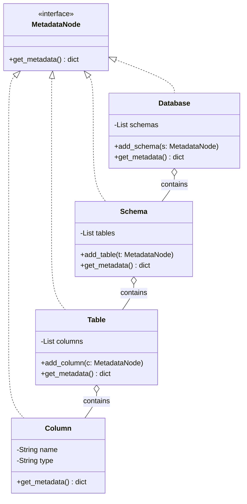
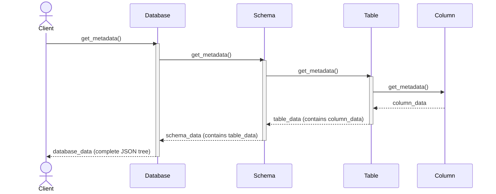
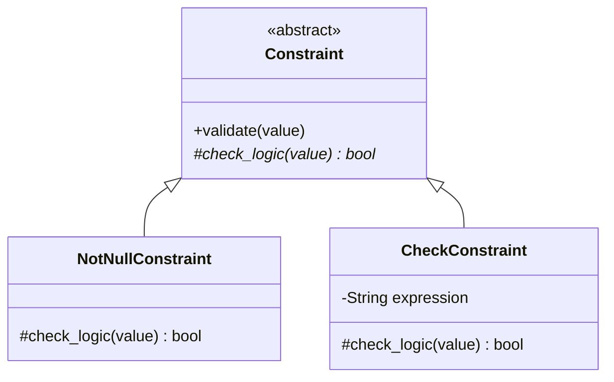
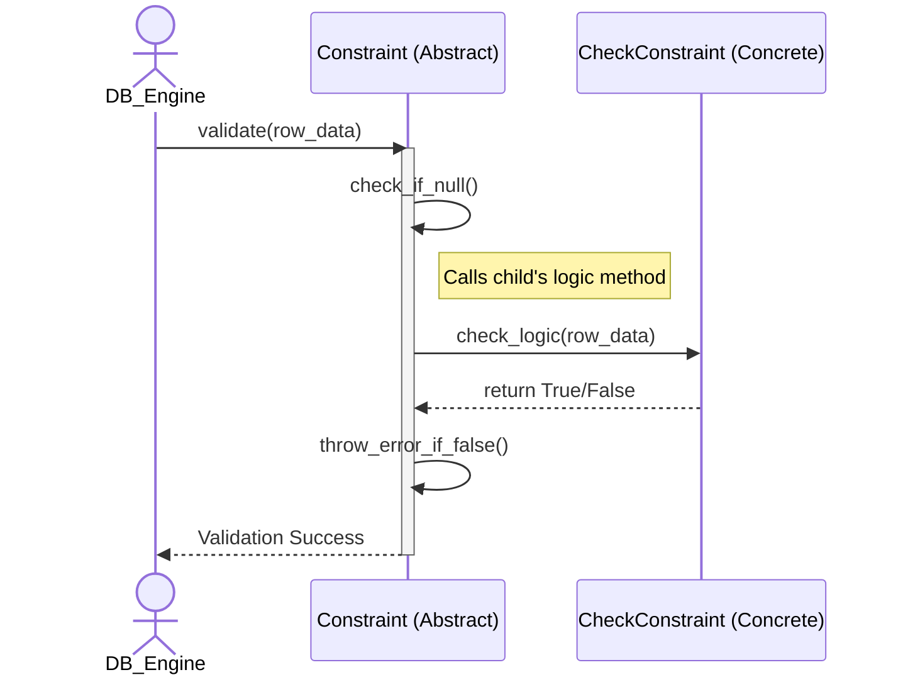
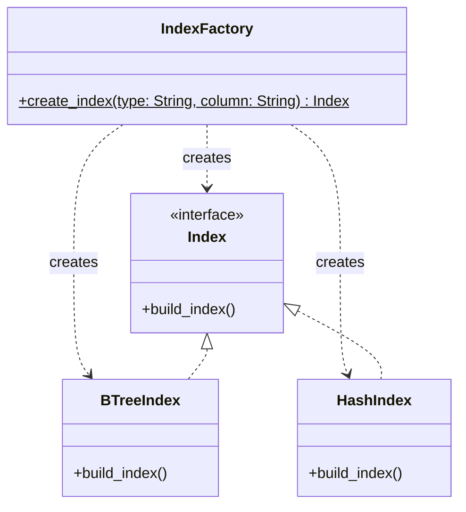
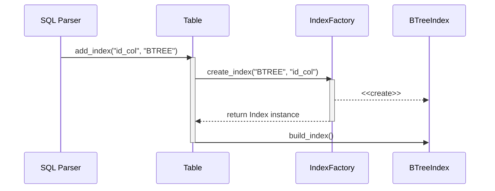
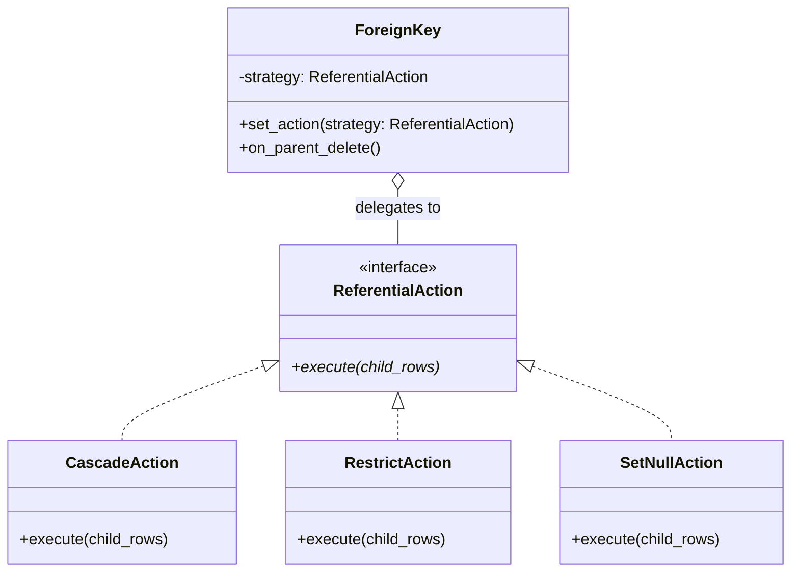
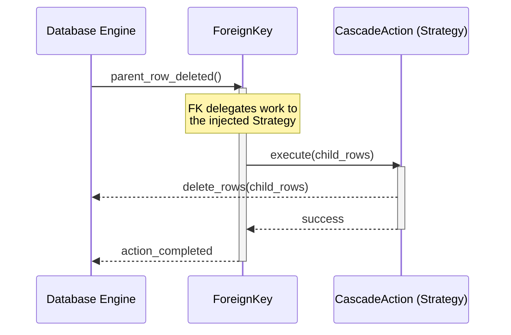
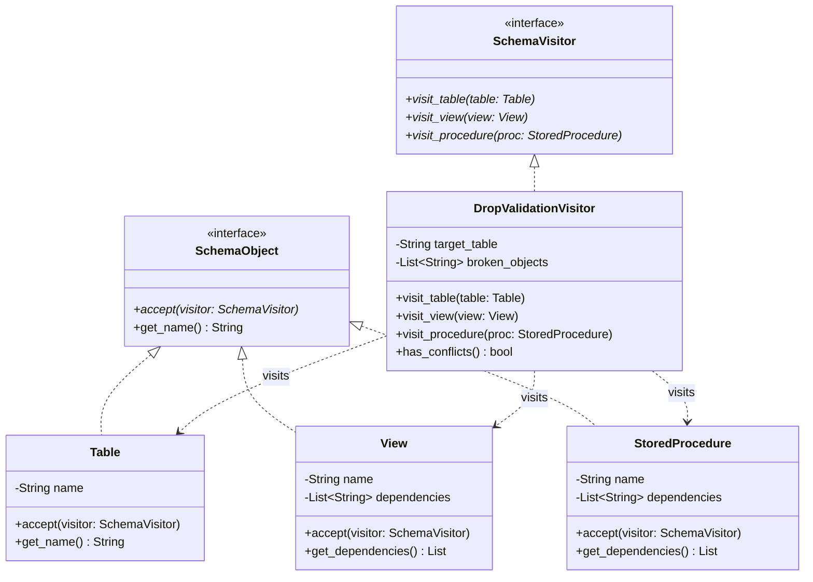
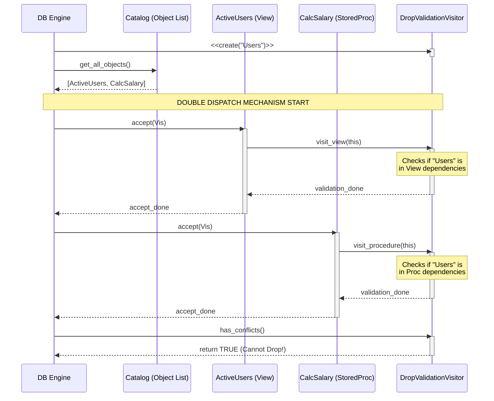

# Design Pattern Analysis: Database Object Management


## 1. Database Objects

This group manages the data-constituent components (Schemas, Tables, Constraints...).

| Priority | Feature | Design Pattern | Reason / Context |
| :---: | :--- | :--- | :--- |
| **Highest** | Database Objects | **Composite** | Database contains Schemas, Schema contains Tables/Views, and manages them uniformly. |
| **High** | Constraint Validation | **Template Method** | `Validate()` defines the workflow, each constraint only implements `Check()`. |
| **High** | Object Creation | **Factory Method** | Centralizes instantiation logic for various metadata objects like Indexes and Triggers. |
| **Medium High** | Referential Action | **Strategy** | Selects Cascade, Restrict, SetNull, or SetDefault behavior when deleting/updating. |
| **Medium High** | Schema Cloning | **Prototype** | Enables cloning of an existing Table or Schema structure without creating from scratch. |
| **Medium High** | Privilege Checking | **Chain of Responsibility** | Passes permission checks sequentially from Database -> Schema -> Table levels. |
| **Medium** | DDL Command | **Command** | `CreateTable`, `DropTable`, and `AlterTable` operations are encapsulated into executable objects. |
| **Medium** | Metadata Caching | **Proxy** | Acts as a placeholder for Table definitions to allow lazy-loading from disk. |
| **Medium** | Table Modification | **Decorator** | Dynamically attaches temporary constraints or properties to a Table during execution. |
| **Medium** | Schema Navigation | **Iterator** | Provides sequential access to traverse all objects in a schema transparently. |
| **Medium** | Data Type Sharing | **Flyweight** | Shares common data type instances (e.g., `INT`) across thousands of columns to save RAM. |
| **Medium** | Metadata Snapshot | **Memento** | Captures Table schema state before an `ALTER` operation to allow rollback on failure. |
| **Medium** | View Refreshment | **Strategy** | Allows switching between `Immediate`, `Deferred`, or `OnDemand` view materialization algorithms. |
| **Medium** | Trigger Notification | **Observer** | When a row changes, the Table notifies all attached Triggers to execute their custom logic. |
| **Medium** | Dependency Validation | **Visitor** | Traverses Views and Stored Procedures to check for broken dependencies when a base Table drops. |

## 2. Database Management

This group provides the external interface and manages the database lifecycle.

| Priority | Feature | Design Pattern | Reason / Context |
| :---: | :--- | :--- | :--- |
| **Highest** | Catalog Management | **Singleton** | Ensures exactly one global registry instance manages all database metadata. |
| **High** | DatabaseServer | **Facade** | Provides a single unified API to start, stop and configure database server. |
| **High** | Server Config | **Builder** | Constructs complex server startup configurations (memory size, thread pool) step by step. |
| **Medium High** | Database Lifecycle | **State** | Database transitions between states such as Offline, Online, ReadOnly, and Recovering. |
| **Medium High** | Database Events | **Observer** | Monitoring systems receive events for Create, Drop, Backup, and Restore. |
| **Medium High** | Connection Pooling | **Object Pool** | Reuses a fixed pool of client connections to avoid costly startup/teardown overhead. |
| **Medium High** | Storage Adapter | **Adapter** | Wraps the native OS file system API into a standard DBMS storage interface. |
| **Medium** | Backup/Restore | **Template Method**| Provides a fixed backup workflow, while differentiating between Full and Incremental. |
| **Medium** | Task Scheduling | **Command** | Encapsulates background tasks (vacuum, statistics gathering) into queueable objects. |
| **Medium** | Perf Monitoring | **Visitor** | Gathers health statistics by visiting various management components without modifying them. |
| **Medium High** | Query Execution | **Iterator** | Employs the Volcano model where physical operators (`Join`, `Filter`) fetch rows via `next()`. |
| **Medium High** | Buffer Eviction | **Strategy** | Encapsulates page replacement algorithms (LRU, Clock, LFU) to allow dynamic switching at runtime. |
| **Medium** | Access Control | **Proxy** | A security proxy intercepts client connections to verify permissions before hitting the actual Database Engine. |
| **Medium** | Config Resolution | **Chain of Responsibility** | Resolves settings by checking session-level, database-level, and global-level configs sequentially. |
| **Medium** | Transaction Savepoint | **Memento** | Stores a snapshot of the transaction's internal state to support partial rollbacks without full aborts. |

---

# Deep Dive Analysis (Class Diagrams & Sequence Diagrams)

Below is a detailed analysis for the deeply evaluated features mentioned above. The structure covers the Reason for choosing the Pattern, static Class Diagrams, dynamic Sequence Diagrams, and TDD Code examples.

## 1. Composite Pattern: Database Objects (Highest Priority)

*   **Why choose Composite instead of discrete `Lists` or rigid hierarchies?**
    In a DBMS, metadata is naturally hierarchical: A Database contains multiple Schemas, a Schema contains multiple Tables, and a Table contains multiple Columns. If we model this using rigid, separate lists (e.g., Database managing `List<Schema>`, Schema managing `List<Table>`), we face significant challenges when performing system-wide operations like calculating total storage size, generating a comprehensive DDL export, or traversing the object tree.
    
    Without the Composite pattern, traversing this hierarchy requires tightly coupled code with multiple nested `for` loops and type-checking (e.g., `if (obj instanceof Table)`). 
    
    **The Composite Pattern Solves This By:**
    1. **Uniformity:** It introduces a common interface (`MetadataNode`) for both leaf nodes (Columns, which have no children) and composite branches (Database, Schema, Table, which contain children).
    2. **Recursive Traversal:** Operations like `get_metadata()` are delegated down the tree. The client only needs to call `get_metadata()` on the root `Database` object, and the request automatically propagates down to the lowest `Column` level via recursion.
    3. **Extensibility:** If we later introduce new metadata objects like `View` or `Index` inside a Schema, we simply implement the `MetadataNode` interface. The core traversal logic remains entirely untouched, adhering perfectly to the Open/Closed Principle (OCP).

### Class Diagram


### Sequence Diagram


### TDD Code Example
```python
# All nodes in the tree inherit this interface
class MetadataNode:
    def get_metadata(self): pass

# Composite (Nodes containing children: Database, Schema, Table)
class Database(MetadataNode):
    def __init__(self):
        self.schemas = []
        
    def get_metadata(self):
        # Recursively collect data from all Schemas inside
        return [schema.get_metadata() for schema in self.schemas]

class Schema(MetadataNode):
    def __init__(self):
        self.tables = []
        
    def get_metadata(self):
        # Recursively collect data from all Tables inside
        return [table.get_metadata() for table in self.tables]
```

---

## 2. Template Method Pattern: Constraint (High Priority)

*   **Why choose Template Method instead of discrete, independent checking functions?**
    A relational database enforces various Constraints (`NotNull`, `Check`, `Unique`, `PrimaryKey`). While the specific business logic for each constraint differs, the overall validation lifecycle is largely identical across all of them:
    1. **Pre-processing:** Skip validation if the incoming value is `Null` (unless it's a NotNull constraint).
    2. **Core Logic Check:** Perform the actual validation rule (e.g., `value > 0`).
    3. **Post-processing:** Throw a standardized `ConstraintViolationException` if the check fails.

    If we implement these as independent functions, developers must manually copy-paste the pre-processing and post-processing boilerplate into every single constraint class. This leads to code duplication and the risk of inconsistent error handling (e.g., one constraint throws an error, another returns a boolean).

    **The Template Method Pattern Solves This By:**
    1. **Inversion of Control (The Hollywood Principle):** The abstract base class (`Constraint`) takes control of the overall algorithm's skeleton via the `validate()` method. It says to the subclasses: "Don't call us, we'll call you."
    2. **Code Reusability:** All boilerplate logic (null checks, exception throwing) is centralized in the base class.
    3. **Strict Enforcement:** The workflow is strictly enforced and cannot be altered by child classes. Subclasses are forced to implement *only* the specific abstract hook method (`check_logic()`), ensuring absolute consistency across the entire database engine.

### Class Diagram


### Sequence Diagram


### TDD Code Example
```python
class Constraint:
    def validate(self, value): # Hard-coded workflow skeleton (Immutable)
        if value is None: return True
        if not self.check_logic(value): 
            raise Exception("Constraint Violation!")
            
    def check_logic(self, value): raise NotImplementedError()

class CheckConstraint(Constraint):
    def check_logic(self, value): return value > 0 # Child class focuses purely on core logic
```

---

#### 3. Factory Method Pattern: Object Creation (High Priority)

*   **Why choose Factory Method instead of direct instantiation (`new BTreeIndex()`)?**
    In a DBMS, creating metadata objects like Indexes (`BTree`, `Hash`, `Bitmap`) or Constraints (`Check`, `Unique`) depends heavily on the SQL statement parsed. If the `Table` class directly instantiated a `BTreeIndex`, it would be tightly coupled to a specific implementation. Every time a new index type is added to the database, the `Table` class would have to be modified, violating the Open/Closed Principle.
    
    **The Factory Method Pattern Solves This By:**
    1. **Decoupling:** It shifts the responsibility of creating an index out of the `Table` and into a dedicated `IndexFactory`. The `Table` only deals with the generic `Index` interface.
    2. **Centralized Logic:** All complex instantiation logic (e.g., checking if the column supports Hash indexing) is centralized in one place.
    3. **Extensibility:** Adding a new `SpatialIndex` in the future only requires adding a new `if` branch inside the Factory; the core `Table` code remains 100% untouched.

##### Class Diagram


##### Sequence Diagram


##### TDD Code Example
```python
class Index:
    def build(self): pass

class BTreeIndex(Index):
    def build(self): return "Building balanced tree..."

class HashIndex(Index):
    def build(self): return "Building hash table..."

class IndexFactory:
    @staticmethod
    def create_index(index_type: str) -> Index:
        if index_type.upper() == "BTREE":
            return BTreeIndex()
        elif index_type.upper() == "HASH":
            return HashIndex()
        else:
            raise ValueError(f"Unsupported Index Type: {index_type}")

# Test Factory Method
btree = IndexFactory.create_index("BTREE")
assert isinstance(btree, BTreeIndex)
print(btree.build()) # Building balanced tree...

hash_idx = IndexFactory.create_index("HASH")
assert isinstance(hash_idx, HashIndex)
print(hash_idx.build()) # Building hash table...
```

---

#### 4. Strategy Pattern: Referential Action (Medium High Priority)

*   **Why choose Strategy instead of hardcoding `if/else` inside the Foreign Key?**
    A Foreign Key (FK) defines what happens to child rows when a referenced Primary Key is deleted. Standard SQL defines multiple behaviors: `CASCADE` (delete child), `RESTRICT` (block deletion), `SET NULL`, and `SET DEFAULT`.
    If we hardcode this logic directly inside the `ForeignKey` class, it becomes a massive, tangled mess of `if (action == 'CASCADE') else if...`.

    **The Strategy Pattern Solves This By:**
    1. **Behavior Isolation:** Each referential action (`CascadeAction`, `RestrictAction`) is isolated into its own class that implements a common `ReferentialAction` interface.
    2. **Dynamic Behavior:** The `ForeignKey` class simply holds a reference to the chosen Strategy. When a parent row is deleted, the FK delegates the work by calling `strategy.execute()`. 
    3. **Cleaner Code:** No massive `if/else` blocks. Adding a custom referential action in the future is as simple as creating a new Strategy class without modifying the FK class.

##### Class Diagram


##### Sequence Diagram


##### TDD Code Example
```python
class ReferentialAction:
    def execute(self, child_rows): pass

class CascadeAction(ReferentialAction):
    def execute(self, child_rows):
        return f"Deleted {len(child_rows)} child rows to maintain integrity."

class RestrictAction(ReferentialAction):
    def execute(self, child_rows):
        if len(child_rows) > 0:
            raise Exception("Cannot delete parent: Child rows exist (RESTRICT)!")

class ForeignKey:
    def __init__(self, strategy: ReferentialAction):
        self.strategy = strategy
        
    def on_parent_delete(self, child_rows):
        return self.strategy.execute(child_rows)

# Test Strategy Swapping
fk_cascade = ForeignKey(CascadeAction())
print(fk_cascade.on_parent_delete([1, 2, 3])) 
# Output: Deleted 3 child rows to maintain integrity.

fk_restrict = ForeignKey(RestrictAction())
try:
    fk_restrict.on_parent_delete([1, 2, 3])
except Exception as e:
    print(e) # Output: Cannot delete parent: Child rows exist (RESTRICT)!
```

---

#### 5. Visitor Pattern: Dependency Validation (Medium Priority)

*   **Why choose Visitor instead of putting validation logic inside each object?**
    When a DBA attempts to drop a table (e.g., `DROP TABLE Users`), the DBMS must verify that no other objects (like `Views` or `StoredProcedures`) depend on it. If we put this validation logic directly inside the `Table`, `View`, and `StoredProcedure` classes, these data-centric classes become bloated with complex business logic. Furthermore, if we later want to add a new operation (e.g., `ExportToJSON` or `CalculateMetrics`), we would have to modify every single object class again.

    **The Visitor Pattern Solves This By:**
    1. **Separation of Concerns:** It completely extracts the operational logic (Dependency Validation) out of the structural classes (`Table`, `View`) and puts it into a dedicated `Visitor` class.
    2. **Double Dispatch:** It allows the DBMS to dynamically execute the correct validation logic based on *both* the type of the Visitor and the type of the Object being visited.
    3. **Extreme Extensibility:** We can add infinite new operations (Visitors) without ever touching or recompiling the core `Table` or `View` classes.

##### Class Diagram


##### Sequence Diagram


##### TDD Code Example
```python
# 1. VISITOR INTERFACES
class SchemaVisitor:
    def visit_table(self, table): pass
    def visit_view(self, view): pass
    def visit_procedure(self, proc): pass

# 2. ELEMENT INTERFACES
class SchemaObject:
    def accept(self, visitor: SchemaVisitor): pass

# 3. CONCRETE ELEMENTS
class Table(SchemaObject):
    def __init__(self, name): self.name = name
    def accept(self, visitor): visitor.visit_table(self)

class View(SchemaObject):
    def __init__(self, name, dependencies): 
        self.name = name
        self.dependencies = dependencies
    def accept(self, visitor): visitor.visit_view(self)

class StoredProcedure(SchemaObject):
    def __init__(self, name, dependencies):
        self.name = name
        self.dependencies = dependencies
    def accept(self, visitor): visitor.visit_procedure(self)

# 4. CONCRETE VISITOR
class DropValidationVisitor(SchemaVisitor):
    def __init__(self, target_table):
        self.target_table = target_table
        self.broken_objects = []

    def visit_table(self, table):
        pass # Tables don't depend on other tables in this context

    def visit_view(self, view):
        if self.target_table in view.dependencies:
            self.broken_objects.append(f"View '{view.name}'")

    def visit_procedure(self, proc):
        if self.target_table in proc.dependencies:
            self.broken_objects.append(f"Procedure '{proc.name}'")

# 5. TEST: The Engine
target_to_drop = "users_table"
visitor = DropValidationVisitor(target_to_drop)

# Simulate the Object Catalog
objects = [
    Table("orders"),
    View("active_users", dependencies=["users_table", "logs"]),
    StoredProcedure("calc_salary", dependencies=["employees"])
]

# Double Dispatch execution
for obj in objects:
    obj.accept(visitor)

if visitor.broken_objects:
    print(f"ERROR: Cannot drop '{target_to_drop}'.")
    print(f"Objects relying on it: {', '.join(visitor.broken_objects)}")
else:
    print(f"SUCCESS: '{target_to_drop}' can be safely dropped.")

# Output: 
# ERROR: Cannot drop 'users_table'.
# Objects relying on it: View 'active_users'
```
