# Design Pattern Analysis: Database Object Management


## 1. Database Objects

This group manages the data-constituent components (Schemas, Tables, Constraints...).

| Priority | Feature | Design Pattern | Reason / Context |
| :---: | :--- | :--- | :--- |
| **Highest** | **Database Objects** | **Composite** | Database contains Schemas, Schema contains Tables/Views, and manages them uniformly. |
| **Medium High** | **Database Objects** | **Prototype** | Enables cloning of an existing Table or Schema structure without creating from scratch. |
| **Medium** | **Database Objects** | **Iterator** | Provides sequential access to traverse all objects in a schema transparently. |
| **Medium** | **Database Objects** | **Proxy** | Acts as a placeholder for Table definitions to allow lazy-loading from disk. |
| **High** | **Database Objects** | **Builder** | Constructs complex Table structures (columns, constraints) step-by-step. |
| **Medium** | **Database Objects** | **Flyweight** | Shares common data type instances (e.g., INT) across millions of columns to save RAM. |
| **Medium High** | **Database Objects** | **Visitor** | Walks the Database Object tree to perform operations like DDL generation without modifying classes. |
| **High** | **Constraint Validation** | **Template Method** | `Validate()` defines the workflow, each constraint only implements `Check()`. |
| **Medium** | **Constraint Validation** | **Decorator** | Dynamically attaches temporary constraints or properties to a Table during execution. |
| **Medium** | **Constraint Validation** | **Visitor** | Traverses Views and Stored Procedures to check for broken dependencies when a base Table drops. |
| **High** | **Object Creation** | **Factory Method** | Centralizes instantiation logic for various metadata objects like Indexes and Triggers. |
| **Medium** | **Object Creation** | **Flyweight** | Shares common data type instances (e.g., `INT`) across thousands of columns to save RAM. |
| **Medium High** | **Referential Action** | **Strategy** | Selects Cascade, Restrict, SetNull, or SetDefault behavior when deleting/updating. |
| **Medium High** | **Privilege Checking** | **Chain of Responsibility** | Passes permission checks sequentially from Database -> Schema -> Table levels. |
| **Medium** | **DDL Command** | **Command** | `CreateTable`, `DropTable`, and `AlterTable` operations are encapsulated into executable objects. |
| **Medium** | **DDL Command** | **Memento** | Captures Table schema state before an `ALTER` operation to allow rollback on failure. |
| **Medium** | **Views & Triggers** | **Strategy** | Allows switching between `Immediate`, `Deferred`, or `OnDemand` view materialization algorithms. |
| **Medium** | **Views & Triggers** | **Observer** | When a row changes, the Table notifies all attached Triggers to execute their custom logic. |

## 2. Database Management & Connectivity
This group provides the external interface and manages the database lifecycle.

| Priority | Feature | Design Pattern | Reason / Context |
| :---: | :--- | :--- | :--- |
| **High** | **Database Server Core** | **Facade** | Provides a single unified API to start, stop and configure database server. |
| **High** | **Database Server Core** | **Builder** | Constructs complex server startup configurations (memory size, thread pool) step by step. |
| **Highest** | **Database Server Core** | **Singleton** | Ensures exactly one global registry instance manages all database metadata. |
| **Medium High** | **Database Server Core** | **State** | Database transitions between states such as Offline, Online, ReadOnly, and Recovering. |
| **Medium High** | **Database Server Core** | **Observer** | Monitoring systems receive events for Create, Drop, Backup, and Restore. |
| **Medium High** | **Connection & Security** | **Object Pool** | Reuses a fixed pool of client connections to avoid costly startup/teardown overhead. |
| **Medium** | **Connection & Security** | **Proxy** | A security proxy intercepts client connections to verify permissions before hitting the engine. |
| **Medium** | **Connection & Security** | **Chain of Responsibility** | Resolves settings by checking session-level, database-level, and global-level configs. |
| **Medium High** | **Connection & Security** | **Decorator** | Attaches auditing capabilities to user actions dynamically without modifying core classes. |
| **Medium** | **Maintenance & Monitoring** | **Template Method**| Provides a fixed backup workflow, while differentiating between Full and Incremental. |
| **Medium** | **Maintenance & Monitoring** | **Command** | Encapsulates background tasks (vacuum, statistics gathering) into queueable objects. |
| **Medium** | **Maintenance & Monitoring** | **Visitor** | Gathers health statistics by visiting various management components without modifying them. |
| **Medium** | **Maintenance & Monitoring** | **Strategy** | Allows switching between simple Ping checks and Deep structural checks. |
| **Medium** | **Cluster & Plugins** | **Mediator** | Centralizes communication between cluster nodes (Heartbeats, Leader Election). |
| **Medium** | | **Factory Method** | Centralizes instantiation of third-party plugins (auth providers, custom types). |## 3. Query Processing & Optimization

This group handles parsing, optimizing, and executing SQL queries efficiently.

| Priority | Feature | Design Pattern | Reason / Context |
| :---: | :--- | :--- | :--- |
| **Highest** | **SQL Parsing & Optimization** | **Composite** | Represents parsed SQL queries as a nested tree of expressions and clauses. |
| **High** | **SQL Parsing & Optimization** | **Interpreter** | Evaluates mathematical and logical expressions within WHERE/HAVING clauses. |
| **Highest** | **SQL Parsing & Optimization** | **Strategy** | Allows switching between Cost-Based Optimizer (CBO) and Rule-Based Optimizer (RBO). |
| **Medium High** | **SQL Parsing & Optimization** | **Visitor** | Traverses the query plan to apply transformations (predicate pushdown) cleanly. |
| **Medium** | **SQL Parsing & Optimization** | **Chain of Responsibility** | Passes the query through a series of rewrite rules (view expansion, constant folding). |
| **High** | **Query Execution** | **Builder** | Constructs complex physical execution plans step by step from logical plans. |
| **Medium High** | **Query Execution** | **Iterator** | Employs the Volcano model where physical operators (`Join`, `Filter`) fetch rows via ext()\. |
| **Medium** | **Query Execution** | **Factory Method** | Creates specific execution operators (e.g., HashJoin, MergeJoin) based on optimizer choices. |
| **Medium** | **Query Execution** | **Singleton** | Provides global configuration and parameters for the current running query. |
| **Medium High** | **Result & Caching** | **Flyweight** | Reuses identical prepared execution plans across multiple sessions to save memory. |
| **Medium** | **Result & Caching** | **Observer** | Notifies monitoring systems about the progress of long-running analytics queries. |
| **Medium** | | **Adapter** | Converts internal data representations into standard client protocols (e.g., JDBC/ODBC). |## 4. Transaction Management & Concurrency Control

This group guarantees ACID properties across multiple concurrent operations.

| Priority | Feature | Design Pattern | Reason / Context |
| :---: | :--- | :--- | :--- |
| **Highest** | **Transaction Core** | **State** | Manages transaction transitions (Active, Partially Committed, Committed, Aborted). |
| **Medium** | **Transaction Core** | **Observer** | Notifies dependent components (e.g., Cache Manager) when a transaction commits or aborts. |
| **Medium** | **Transaction Core** | **Memento** | Allows a transaction to rollback to an intermediate state without fully aborting. |
| **Highest** | **Concurrency Control** | **Mediator** | Coordinates lock requests and releases between transactions to prevent conflicts. |
| **Medium High** | **Concurrency Control** | **Visitor** | Traverses the Wait-For Graph to identify cycles (deadlocks) among waiting transactions. |
| **Medium** | **Concurrency Control** | **Chain of Responsibility** | Passes conflicting writes through rules (First-Writer-Wins, Timestamp ordering). |
| **High** | **MVCC & Isolation** | **Strategy** | Implements different behaviors for Read Committed, Repeatable Read, and Serializable. |
| **Medium High** | **MVCC & Isolation** | **Prototype** | Creates new versions of rows for Multi-Version Concurrency Control instead of overwriting. |
| **Medium** | **MVCC & Isolation** | **Singleton** | Provides globally unique, monotonically increasing timestamps for MVCC. |
| **High** | **Durability & Commit** | **Command** | Encapsulates every database modification as a log record that can be replayed or undone. |
| **Medium** | **Durability & Commit** | **Command** | Queues commit requests to be flushed to disk in efficient batches (Group Commit). |
| **Medium** | | **Template Method** | Defines the strict Prepare and Commit phases (2PC), delegating specific node actions. |## 5. Storage Engine & Indexing

This group manages how data is persistently stored and retrieved from disk.

| Priority | Feature | Design Pattern | Reason / Context |
| :---: | :--- | :--- | :--- |
| **Highest** | **Storage Structures** | **Adapter** | Wraps OS-specific file I/O operations into a standardized DBMS storage interface. |
| **Medium High** | **Storage Structures** | **Composite** | Represents Tablespaces containing Files, which contain Extents, which contain Pages. |
| **Medium High** | **Storage Structures** | **Decorator** | Adds transparent compression/decompression to storage pages before writing to disk. |
| **Medium** | **Storage Structures** | **Proxy** | Intercepts writes to coalesce them in memory before flushing sequentially to disk. |
| **Medium** | **Storage Structures** | **Memento** | Captures before-image and after-image of data pages for crash recovery. |
| **Highest** | **Buffer Management** | **Strategy** | Encapsulates page replacement algorithms (LRU, Clock, LFU) to allow dynamic switching. |
| **High** | **Buffer Management** | **Flyweight** | Manages a pool of fixed-size memory pages shared across various queries to minimize I/O. |
| **High** | **Indexing** | **Factory Method** | Abstracts the instantiation of specific index structures (B+Tree, Hash, Bitmap). |
| **Medium High** | **Indexing** | **Iterator** | Provides sequential access to leaf nodes for efficient range scans. |
| **Medium** | **Indexing** | **Template Method** | Defines a generic search algorithm, delegating specific node comparisons to child classes. |
| **Medium** | **Data Formatting** | **Builder** | Constructs complex row formats (handling null bitmaps, variable lengths) step by step. |
| **Medium** | | **Strategy** | Allows switching between Hash, Range, and List partitioning schemes at runtime. |## 6. Distributed Systems & High Availability

This group handles replication, sharding, and cluster coordination for modern distributed databases.

| Priority | Feature | Design Pattern | Reason / Context |
| :---: | :--- | :--- | :--- |
| **Highest** | **Cluster State & Replication** | **State** | Manages node states (Follower, Candidate, Leader) in Raft/Paxos. |
| **Highest** | **Cluster State & Replication** | **Observer** | Replicates data changes to standby nodes as soon as the primary commits. |
| **Medium** | **Cluster State & Replication** | **Singleton** | Maintains a single, synchronized global view of all active nodes in the cluster. |
| **High** | **Distribution & Routing** | **Strategy** | Switches between Hash, Range, and Directory-based sharding algorithms. |
| **Medium** | **Distribution & Routing** | **Adapter** | Routes read queries to the closest replica while hiding cluster topology complexity. |
| **Medium** | **Distribution & Routing** | **Command** | Encapsulates the task of moving data partitions between nodes as a queueable job. |
| **High** | **Cluster Coordination** | **Mediator** | Coordinates locks across multiple distributed nodes to prevent race conditions. |
| **Medium High** | **Cluster Coordination** | **Chain of Responsibility** | Tries multiple tie-breaking rules when cluster network partitions occur. |
| **Medium High** | **Cluster Coordination** | **Proxy** | Intercepts RPC calls between nodes to handle retries and timeouts transparently. |
| **Medium** | **Health & Failover** | **Template Method** | Standardizes the failover workflow (Detect, Elect, Promote) across different node types. |
| **Medium** | **Health & Failover** | **Visitor** | Visits nodes across the network to collect latency and throughput metrics safely. |
| **Medium** | | **Iterator** | Traverses random neighbor nodes periodically to disseminate cluster state efficiently. |## 7. Security, Auditing & Compliance

This group ensures data privacy, access control, and regulatory compliance.

| Priority | Feature | Design Pattern | Reason / Context |
| :---: | :--- | :--- | :--- |
| **Highest** | **Authentication & Authorization** | **Chain of Responsibility** | Chains multiple auth methods (Password, LDAP, Kerberos, OAuth) for fallback. |
| **Highest** | **Authentication & Authorization** | **Composite** | Roles can inherit permissions from other Roles, forming a nested hierarchy. |
| **Medium** | **Authentication & Authorization** | **Observer** | Notifies active sessions to terminate immediately if a user's permissions are revoked. |
| **High** | **Data Protection** | **Proxy** | Encrypts and decrypts data pages transparently right before disk I/O. |
| **Medium High** | **Data Protection** | **Singleton** | Centralizes and strictly controls access to encryption keys and master secrets. |
| **Medium High** | **Data Protection** | **Strategy** | Applies different predicate logic based on the user's role to filter visible rows. |
| **Medium** | **Data Protection** | **Adapter** | Wraps normal data output with masked formats (e.g., `***-***-1234`) for untrusted clients. |
| **Medium** | **Connection Security** | **Interpreter** | Parses incoming SQL specifically to detect and block malicious token patterns. |
| **Medium** | **Connection Security** | **Factory Method** | Instantiates secure socket connections based on specific client protocol capabilities. |
| **Medium** | **Connection Security** | **Builder** | Constructs complex security profiles (combining IP whitelists and time restrictions) step by step. |
| **High** | **Auditing & Compliance** | **Decorator** | Attaches tracking capabilities to DDL/DML operations dynamically. |
| **Medium** | | **Visitor** | Scans system configurations without altering them to report potential weaknesses. |---

# Deep Dive Analysis (Class Diagrams & Sequence Diagrams)

Below is a detailed analysis for 3 heavily evaluated features. Each feature is broken down thoroughly with precise technical explanations, comprehensive UML diagrams, and robust Python TDD code.

## 1. Composite Pattern: Database Objects (Highest Priority)

*   **Why choose Composite instead of discrete `Lists` or rigid hierarchies?**
    In a DBMS, metadata is naturally hierarchical: A Database contains multiple Schemas, a Schema contains multiple Tables/Views, and a Table contains multiple Columns and Constraints. If we model this using rigid, separate lists (e.g., `List<Table>`, `List<View>`, `List<Constraint>`), we face significant challenges when performing system-wide operations like calculating total storage size, generating a comprehensive DDL export, or traversing the object tree.
    
    Without the Composite pattern, traversing this hierarchy requires tightly coupled code with multiple nested `for` loops and type-checking (e.g., `if (obj instanceof Table)`). 
    
    **The Composite Pattern Solves This By:**
    1. **Uniformity:** It introduces a common interface (`MetadataNode`) for both leaf nodes (Columns, Constraints - which have no children) and composite branches (Database, Schema, Table - which contain children).
    2. **Recursive Traversal:** Operations like `get_metadata()` are delegated down the tree. The client only needs to call `get_metadata()` on the root `Database` object, and the request automatically propagates down to the lowest `Column` or `Constraint` level via recursion.
    3. **Extensibility:** If we later introduce new metadata objects like `Trigger` or `Index`, we simply implement the `MetadataNode` interface. The core traversal logic remains entirely untouched, adhering perfectly to the Open/Closed Principle (OCP).

### Class Diagram
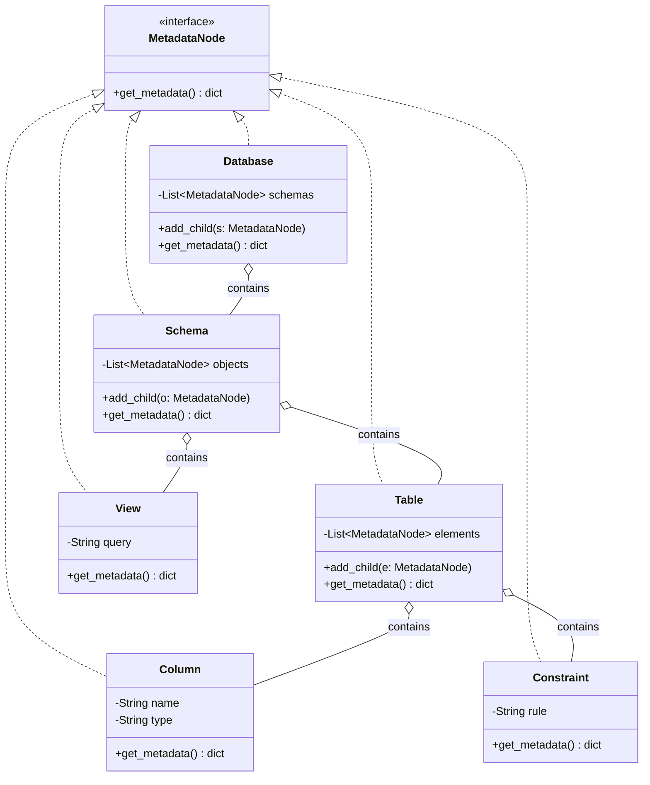
```mermaid
classDiagram
    class MetadataNode {
        <<interface>>
        +get_metadata() dict
    }
    
    class Database {
        -List~MetadataNode~ schemas
        +add_child(s: MetadataNode)
        +get_metadata() dict
    }
    
    class Schema {
        -List~MetadataNode~ objects
        +add_child(o: MetadataNode)
        +get_metadata() dict
    }
    
    class Table {
        -List~MetadataNode~ elements
        +add_child(e: MetadataNode)
        +get_metadata() dict
    }
    
    class View {
        -String query
        +get_metadata() dict
    }
    
    class Column {
        -String name
        -String type
        +get_metadata() dict
    }
    
    class Constraint {
        -String rule
        +get_metadata() dict
    }

    MetadataNode <|.. Database
    MetadataNode <|.. Schema
    MetadataNode <|.. Table
    MetadataNode <|.. View
    MetadataNode <|.. Column
    MetadataNode <|.. Constraint
    
    Database o-- Schema : contains
    Schema o-- Table : contains
    Schema o-- View : contains
    Table o-- Column : contains
    Table o-- Constraint : contains
```

### Sequence Diagram
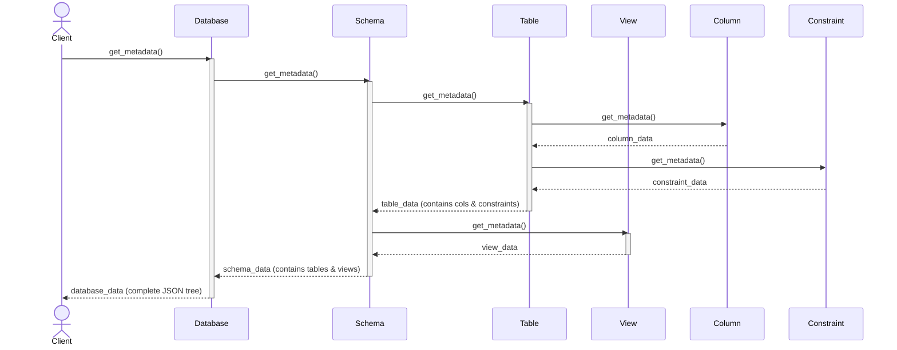
```mermaid
sequenceDiagram
    actor Client
    participant DB as Database
    participant Sch as Schema
    participant Tbl as Table
    participant Vw as View
    participant Col as Column
    participant Cst as Constraint

    Client->>DB: get_metadata()
    activate DB
    
    DB->>Sch: get_metadata()
    activate Sch
    
    %% Processing Table branch
    Sch->>Tbl: get_metadata()
    activate Tbl
    Tbl->>Col: get_metadata()
    Col-->>Tbl: column_data
    Tbl->>Cst: get_metadata()
    Cst-->>Tbl: constraint_data
    Tbl-->>Sch: table_data (contains cols & constraints)
    deactivate Tbl
    
    %% Processing View branch
    Sch->>Vw: get_metadata()
    activate Vw
    Vw-->>Sch: view_data
    deactivate Vw
    
    Sch-->>DB: schema_data (contains tables & views)
    deactivate Sch
    
    DB-->>Client: database_data (complete JSON tree)
    deactivate DB
```

### TDD Code Example
```python
# All nodes in the tree inherit this interface
class MetadataNode:
    def get_metadata(self): pass

# Composite (Nodes containing children)
class Database(MetadataNode):
    def __init__(self): self.children = []
    def add_child(self, child: MetadataNode): self.children.append(child)
    def get_metadata(self):
        return {"type": "Database", "children": [c.get_metadata() for c in self.children]}

class Schema(MetadataNode):
    def __init__(self): self.children = []
    def add_child(self, child: MetadataNode): self.children.append(child)
    def get_metadata(self):
        return {"type": "Schema", "children": [c.get_metadata() for c in self.children]}

class Table(MetadataNode):
    def __init__(self, name): 
        self.name = name
        self.children = []
    def add_child(self, child: MetadataNode): self.children.append(child)
    def get_metadata(self):
        return {"type": "Table", "name": self.name, "children": [c.get_metadata() for c in self.children]}

# Leaf Nodes (No children)
class View(MetadataNode):
    def __init__(self, name): self.name = name
    def get_metadata(self): return {"type": "View", "name": self.name}

class Column(MetadataNode):
    def __init__(self, name, col_type): 
        self.name = name
        self.col_type = col_type
    def get_metadata(self): return {"type": "Column", "name": self.name, "col_type": self.col_type}

class Constraint(MetadataNode):
    def __init__(self, rule): self.rule = rule
    def get_metadata(self): return {"type": "Constraint", "rule": self.rule}

# --- TEST CODE ---
db = Database()
schema = Schema()
table = Table("Users")
table.add_child(Column("id", "INT"))
table.add_child(Constraint("PRIMARY KEY (id)"))

schema.add_child(table)
schema.add_child(View("ActiveUsers"))
db.add_child(schema)

# One call recursively builds the entire tree
import json
print(json.dumps(db.get_metadata(), indent=2))
```

---

## 2. Template Method Pattern: Constraint Validation (High Priority)

*   **Why choose Template Method instead of discrete, independent checking functions?**
    A relational database enforces various Constraints (`NotNull`, `Check`, `Unique`, `PrimaryKey`). While the specific business logic for each constraint differs drastically (e.g., `NotNull` just checks memory, whereas `Unique` must query the B-Tree index on disk), the overall validation lifecycle is identical across all of them:
    1. **Pre-processing:** Skip validation if the incoming value is `Null` (unless it's a NotNull constraint itself).
    2. **Core Logic Check:** Perform the actual validation rule (e.g., `value > 0` or `lookup_index()`).
    3. **Post-processing:** Throw a standardized `ConstraintViolationException` if the check fails, ensuring the transaction aborts.

    If we implement these as independent functions, developers must manually copy-paste the pre-processing and post-processing boilerplate into every single constraint class. This leads to code duplication and the dangerous risk of inconsistent error handling (e.g., one constraint throws an error, another accidentally returns a boolean).

    **The Template Method Pattern Solves This By:**
    1. **Inversion of Control (The Hollywood Principle):** The abstract base class (`Constraint`) takes control of the overall algorithm's skeleton via the `validate()` method. It says to the subclasses: "Don't call us, we'll call you."
    2. **Code Reusability:** All boilerplate logic (null checks, exception throwing) is centralized in the base class.
    3. **Strict Enforcement:** The workflow is strictly enforced and cannot be altered by child classes. Subclasses are forced to implement *only* the specific abstract hook method (`check_logic()`), ensuring absolute consistency across the entire database engine.

### Class Diagram
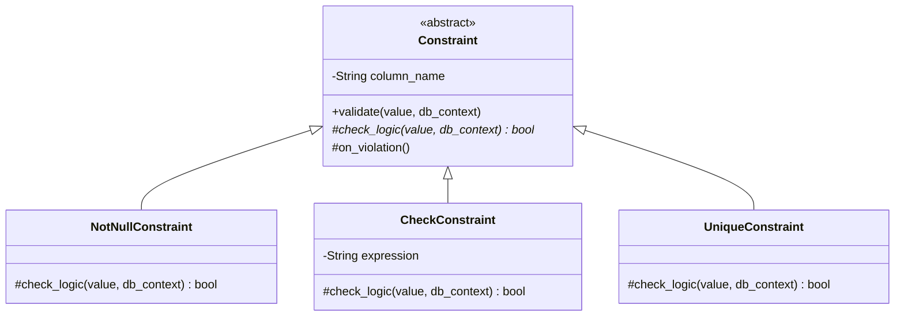
```mermaid
classDiagram
    class Constraint {
        <<abstract>>
        -String column_name
        +validate(value, db_context)
        #check_logic(value, db_context)* bool
        #on_violation()
    }
    
    class NotNullConstraint {
        #check_logic(value, db_context) bool
    }
    
    class CheckConstraint {
        -String expression
        #check_logic(value, db_context) bool
    }
    
    class UniqueConstraint {
        #check_logic(value, db_context) bool
    }

    Constraint <|-- NotNullConstraint
    Constraint <|-- CheckConstraint
    Constraint <|-- UniqueConstraint
```

### Sequence Diagram
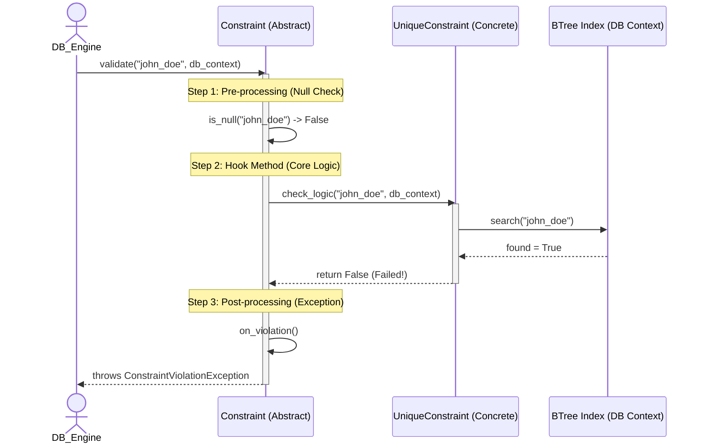
```mermaid
sequenceDiagram
    actor DB_Engine
    participant Base as Constraint (Abstract)
    participant Child as UniqueConstraint (Concrete)
    participant Index as BTree Index (DB Context)

    DB_Engine->>Base: validate("john_doe", db_context)
    activate Base
    
    Note over Base: Step 1: Pre-processing (Null Check)
    Base->>Base: is_null("john_doe") -> False
    
    Note over Base: Step 2: Hook Method (Core Logic)
    Base->>Child: check_logic("john_doe", db_context)
    activate Child
    Child->>Index: search("john_doe")
    Index-->>Child: found = True
    Child-->>Base: return False (Failed!)
    deactivate Child
    
    Note over Base: Step 3: Post-processing (Exception)
    Base->>Base: on_violation()
    Base-->>DB_Engine: throws ConstraintViolationException
    deactivate Base
```

### TDD Code Example
```python
class ConstraintViolationException(Exception):
    pass

class Constraint:
    def __init__(self, col_name):
        self.col_name = col_name

    def validate(self, value, db_context): 
        # Hard-coded workflow skeleton (Immutable by children)
        if value is None and not isinstance(self, NotNullConstraint): 
            return True # Pre-processing: Skip nulls for standard constraints
            
        if not self.check_logic(value, db_context): # Core Logic Hook
            self.on_violation(value) # Post-processing
            
    def check_logic(self, value, db_context): 
        raise NotImplementedError("Subclasses must implement this hook!")
        
    def on_violation(self, value):
        raise ConstraintViolationException(f"Column '{self.col_name}' violated constraint with value '{value}'!")

class CheckConstraint(Constraint):
    def check_logic(self, value, db_context): 
        return value > 0 # Simple memory check

class UniqueConstraint(Constraint):
    def check_logic(self, value, db_context):
        # Complex DB lookup check
        index_data = db_context.get_index(self.col_name)
        return value not in index_data

class NotNullConstraint(Constraint):
    def check_logic(self, value, db_context):
        return value is not None

# --- TEST CODE ---
class MockDBContext:
    def get_index(self, col): return ["admin", "root"]

db_context = MockDBContext()

# Test 1: Unique Constraint
unique_username = UniqueConstraint("username")
unique_username.validate("new_user", db_context) # Passes successfully

try:
    unique_username.validate("admin", db_context) # Fails
except Exception as e:
    print(e) # Output: Column 'username' violated constraint with value 'admin'!

# Test 2: Check Constraint (skips Null properly)
age_check = CheckConstraint("age")
age_check.validate(None, db_context) # Passes immediately (Nulls allowed)
```

---

## 3. Chain of Responsibility Pattern: Privilege Checking (Medium High Priority)

*   **Why choose Chain of Responsibility instead of massive `if/else` checks?**
    In a DBMS, checking if a user has permission to execute a query (like `SELECT * FROM schema.table`) is highly layered. The database engine must sequentially check:
    1. Does the user have access to the Database?
    2. Does the user have access to the Schema?
    3. Does the user have `SELECT` privilege on the Table?
    4. (Optional) Does the user have access to specific Columns (Column-Level Security)?
    
    If we hardcode this in a single `SecurityManager` class with nested `if/else`, the code becomes incredibly bloated and brittle. Adding a new security layer (e.g., Row-Level Security or IP Address restrictions) would force us to modify the core security engine, violating the Open/Closed Principle.

    **The Chain of Responsibility Pattern Solves This By:**
    1. **Decoupling:** Each security check is encapsulated into its own distinct, lightweight Handler class (`DatabasePrivilegeHandler`, `SchemaPrivilegeHandler`).
    2. **Sequential Chaining:** Handlers are linked together. The request passes through the chain one by one. If one handler denies access, it breaks the chain immediately and throws a "Permission Denied" error. If it allows access, it automatically passes the request to the next handler.
    3. **Dynamic Configuration:** You can dynamically insert or remove security layers at runtime (e.g., enabling Column-Level Security only for the Enterprise edition) simply by rearranging the chain, without altering any core logic.

### Class Diagram

```mermaid
classDiagram
    class PrivilegeHandler {
        <<abstract>>
        -PrivilegeHandler next_handler
        +set_next(handler: PrivilegeHandler)$ PrivilegeHandler
        +check_access(user, action, target)* bool
        #do_check(user, action, target)* bool
    }
    
    class DatabasePrivilegeHandler {
        #do_check(user, action, target) bool
    }
    
    class SchemaPrivilegeHandler {
        #do_check(user, action, target) bool
    }
    
    class TablePrivilegeHandler {
        #do_check(user, action, target) bool
    }
    
    class ColumnPrivilegeHandler {
        #do_check(user, action, target) bool
    }

    PrivilegeHandler o-- PrivilegeHandler : next_handler
    PrivilegeHandler <|-- DatabasePrivilegeHandler
    PrivilegeHandler <|-- SchemaPrivilegeHandler
    PrivilegeHandler <|-- TablePrivilegeHandler
    PrivilegeHandler <|-- ColumnPrivilegeHandler
```

### Sequence Diagram
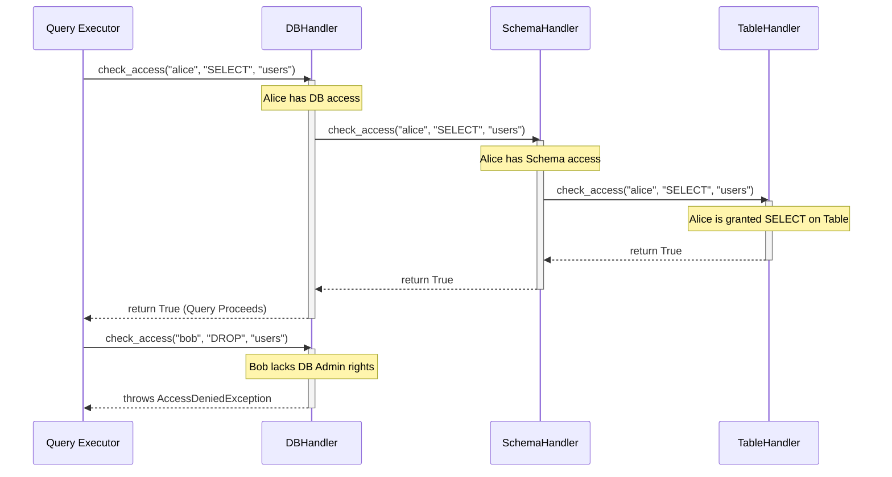
```mermaid
sequenceDiagram
    participant Client as Query Executor
    participant DB as DBHandler
    participant Sch as SchemaHandler
    participant Tbl as TableHandler
    
    Client->>DB: check_access("alice", "SELECT", "users")
    activate DB
    Note over DB: Alice has DB access
    
    DB->>Sch: check_access("alice", "SELECT", "users")
    activate Sch
    Note over Sch: Alice has Schema access
    
    Sch->>Tbl: check_access("alice", "SELECT", "users")
    activate Tbl
    Note over Tbl: Alice is granted SELECT on Table
    Tbl-->>Sch: return True
    deactivate Tbl
    
    Sch-->>DB: return True
    deactivate Sch
    
    DB-->>Client: return True (Query Proceeds)
    deactivate DB
    
    %% Example of Failure
    Client->>DB: check_access("bob", "DROP", "users")
    activate DB
    Note over DB: Bob lacks DB Admin rights
    DB-->>Client: throws AccessDeniedException
    deactivate DB
```

### TDD Code Example
```python
class AccessDeniedException(Exception):
    pass

class PrivilegeHandler:
    def __init__(self):
        self.next_handler = None
        
    def set_next(self, handler):
        self.next_handler = handler
        return handler # Allows method chaining
        
    def check_access(self, user, action, target):
        # 1. Execute the specific check for this layer
        if not self.do_check(user, action, target):
            raise AccessDeniedException(f"Access Denied at {self.__class__.__name__} for user '{user}'")
        
        # 2. If passed and there's a next handler, delegate down the chain
        if self.next_handler:
            return self.next_handler.check_access(user, action, target)
        
        # 3. If passed and no more handlers, access is fully granted
        return True 
        
    def do_check(self, user, action, target):
        raise NotImplementedError()

# Concrete Handlers
class DatabasePrivilegeHandler(PrivilegeHandler):
    def do_check(self, user, action, target):
        # Business logic: Only 'admin' can perform DROP operations
        if action == "DROP" and user != "admin": return False
        return True

class SchemaPrivilegeHandler(PrivilegeHandler):
    def do_check(self, user, action, target):
        # Business logic: 'guest' users have no access to underlying schemas
        return user != "guest"

class TablePrivilegeHandler(PrivilegeHandler):
    def do_check(self, user, action, target):
        # Business logic: 'alice' has SELECT rights, but no UPDATE rights
        if user == "alice" and action == "UPDATE": return False
        return True

# --- TEST CODE ---
# 1. Build the Security Chain dynamically
security_chain = DatabasePrivilegeHandler()
security_chain.set_next(SchemaPrivilegeHandler()).set_next(TablePrivilegeHandler())

# 2. Test Cases
# Test A: Alice tries to SELECT (Passes all 3 layers)
print(security_chain.check_access("alice", "SELECT", "users")) # Output: True

# Test B: Alice tries to UPDATE (Fails at Layer 3: TablePrivilegeHandler)
try:
    security_chain.check_access("alice", "UPDATE", "users")
except Exception as e:
    print(e) # Output: Access Denied at TablePrivilegeHandler for user 'alice'

# Test C: Bob tries to DROP (Fails immediately at Layer 1: DatabasePrivilegeHandler)
try:
    security_chain.check_access("bob", "DROP", "users")
except Exception as e:
    print(e) # Output: Access Denied at DatabasePrivilegeHandler for user 'bob'
```

---

## 4. Factory Method Pattern: Object Creation (High Priority)

*   **Why choose Factory Method instead of direct instantiation (`new Index()`)?**
    In a DBMS, creating objects like Indexes, Triggers, or Partitions often depends on the specific engine configuration, the chosen algorithm (e.g., B-Tree vs Hash for indexes), and involves complex initialization (allocating disk pages, registering with catalogs). If we let the `Table` class directly instantiate `BTreeIndex` or `HashIndex` via `if/else`, the `Table` class becomes tightly coupled to specific storage implementations. Adding a new index type (like `BitmapIndex`) would require modifying the core `Table` class, violating the Open/Closed Principle.
    
    **The Factory Method Pattern Solves This By:**
    1. **Decoupling:** The `Table` class delegates the creation of the index to a Factory interface. It doesn't need to know the concrete class of the index being created.
    2. **Encapsulation of Initialization:** The Factory hides all the complex setup logic (e.g., checking memory limits, allocating storage, writing to the system catalog) in one place.
    3. **Extensibility:** To add a new index type, we simply extend the factory logic or create a new factory subclass, leaving the core `Table` operations completely untouched.

### Class Diagram
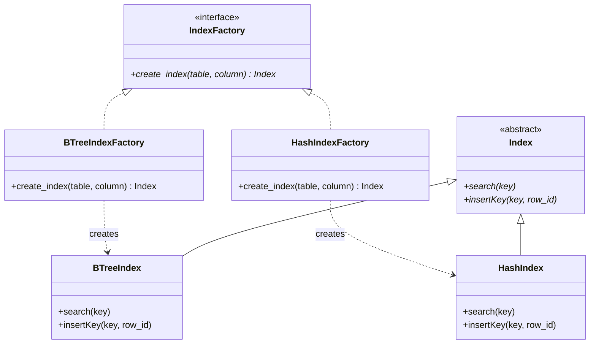
```mermaid
classDiagram
    class IndexFactory {
        <<interface>>
        +create_index(table, column)* Index
    }
    
    class BTreeIndexFactory {
        +create_index(table, column) Index
    }
    
    class HashIndexFactory {
        +create_index(table, column) Index
    }
    
    class Index {
        <<abstract>>
        +search(key)*
        +insertKey(key, row_id)*
    }
    
    class BTreeIndex {
        +search(key)
        +insertKey(key, row_id)
    }
    
    class HashIndex {
        +search(key)
        +insertKey(key, row_id)
    }

    IndexFactory <|.. BTreeIndexFactory
    IndexFactory <|.. HashIndexFactory
    BTreeIndexFactory ..> BTreeIndex : creates
    HashIndexFactory ..> HashIndex : creates
    Index <|-- BTreeIndex
    Index <|-- HashIndex
```

### Sequence Diagram
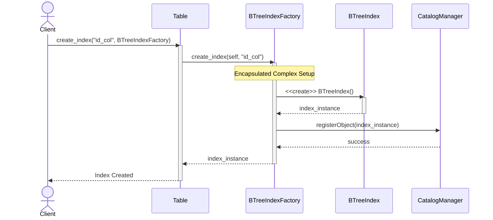
```mermaid
sequenceDiagram
    actor Client
    participant Tbl as Table
    participant Fct as BTreeIndexFactory
    participant Idx as BTreeIndex
    participant Cat as CatalogManager

    Client->>Tbl: create_index("id_col", BTreeIndexFactory)
    activate Tbl
    
    Tbl->>Fct: create_index(self, "id_col")
    activate Fct
    
    Note over Fct: Encapsulated Complex Setup
    Fct->>Idx: <<create>> BTreeIndex()
    activate Idx
    Idx-->>Fct: index_instance
    deactivate Idx
    
    Fct->>Cat: registerObject(index_instance)
    Cat-->>Fct: success
    
    Fct-->>Tbl: index_instance
    deactivate Fct
    
    Tbl-->>Client: Index Created
    deactivate Tbl
```

### TDD Code Example
```python
from abc import ABC, abstractmethod

# The Product Interface
class Index(ABC):
    @abstractmethod
    def search(self, key): pass

# Concrete Products
class BTreeIndex(Index):
    def __init__(self, table_name, column_name):
        self.type = "BTREE"
        print(f"Allocating B-Tree nodes for {table_name}.{column_name}")
        
    def search(self, key): pass

class HashIndex(Index):
    def __init__(self, table_name, column_name):
        self.type = "HASH"
        print(f"Allocating Hash buckets for {table_name}.{column_name}")
        
    def search(self, key): pass

# The Factory Interface
class IndexFactory(ABC):
    @abstractmethod
    def create_index(self, table_name, column_name) -> Index:
        pass
        
    def register_index(self, index: Index):
        # Centralized post-creation logic (e.g. catalog registration)
        print(f"Registering {index.type} index in System Catalog...")

# Concrete Factories
class BTreeIndexFactory(IndexFactory):
    def create_index(self, table_name, column_name) -> Index:
        index = BTreeIndex(table_name, column_name)
        self.register_index(index)
        return index

class HashIndexFactory(IndexFactory):
    def create_index(self, table_name, column_name) -> Index:
        index = HashIndex(table_name, column_name)
        self.register_index(index)
        return index

# --- TEST CODE ---
# The client/table decides WHICH factory to use, but depends on the interface
def create_table_index(table_name, column_name, factory: IndexFactory):
    return factory.create_index(table_name, column_name)

idx1 = create_table_index("users", "id", BTreeIndexFactory())
# Output: Allocating B-Tree nodes for users.id
# Output: Registering BTREE index in System Catalog...

idx2 = create_table_index("sessions", "token", HashIndexFactory())
# Output: Allocating Hash buckets for sessions.token
# Output: Registering HASH index in System Catalog...
```

---

## 5. Strategy Pattern: Referential Action (Medium High Priority)

*   **Why choose Strategy instead of massive `switch/case` inside `ForeignKey`?**
    When a referenced row in a parent table is deleted or updated, a Foreign Key constraint must enforce referential integrity. Standard SQL allows several actions: `CASCADE` (delete child rows), `RESTRICT` (block the deletion), `SET NULL` (nullify child keys), and `SET DEFAULT`. 
    If we put all these behaviors into a single `on_violation()` method inside the `ForeignKey` class with a giant `if/elif/else` block, the class becomes bloated. Testing each cascading behavior in isolation also becomes difficult.

    **The Strategy Pattern Solves This By:**
    1. **Behavior Encapsulation:** Each referential action (`CascadeAction`, `RestrictAction`, `SetNullAction`) is encapsulated into its own class implementing a common `ReferentialAction` interface.
    2. **Runtime Interchangeability:** A `ForeignKey` is composed of a `ReferentialAction` object. The action can be dynamically assigned when the constraint is defined.
    3. **Single Responsibility Principle:** The `ForeignKey` class focuses only on detecting the relationship change. The specific `ReferentialAction` class focuses purely on executing the consequent cascading operation.

### Class Diagram
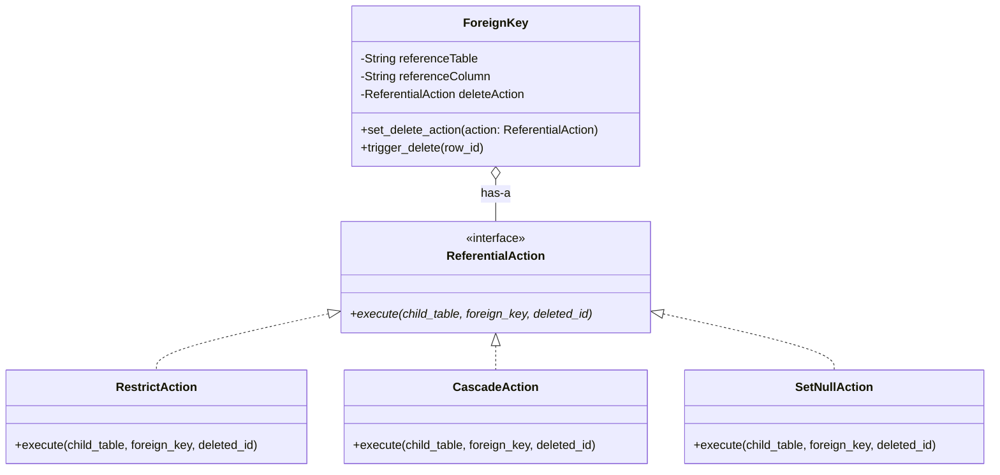
```mermaid
classDiagram
    class ForeignKey {
        -String referenceTable
        -String referenceColumn
        -ReferentialAction deleteAction
        +set_delete_action(action: ReferentialAction)
        +trigger_delete(row_id)
    }
    
    class ReferentialAction {
        <<interface>>
        +execute(child_table, foreign_key, deleted_id)*
    }
    
    class RestrictAction {
        +execute(child_table, foreign_key, deleted_id)
    }
    
    class CascadeAction {
        +execute(child_table, foreign_key, deleted_id)
    }
    
    class SetNullAction {
        +execute(child_table, foreign_key, deleted_id)
    }

    ForeignKey o-- ReferentialAction : has-a
    ReferentialAction <|.. RestrictAction
    ReferentialAction <|.. CascadeAction
    ReferentialAction <|.. SetNullAction
```

### Sequence Diagram
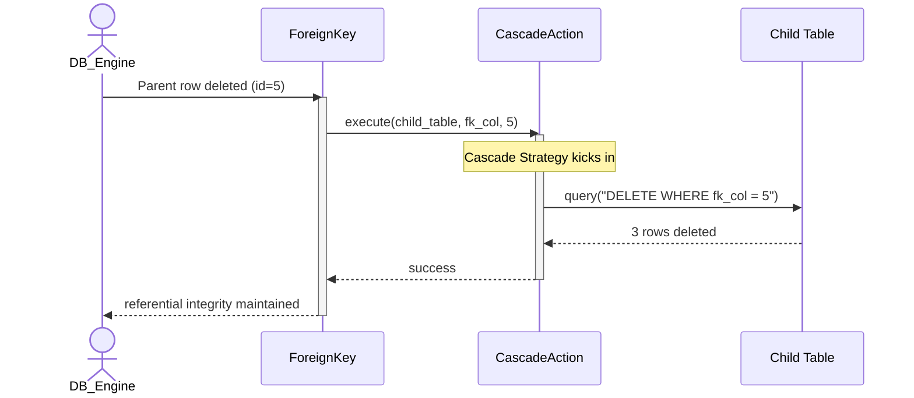
```mermaid
sequenceDiagram
    actor DB_Engine
    participant FK as ForeignKey
    participant Strat as CascadeAction
    participant ChildDB as Child Table

    DB_Engine->>FK: Parent row deleted (id=5)
    activate FK
    
    FK->>Strat: execute(child_table, fk_col, 5)
    activate Strat
    
    Note over Strat: Cascade Strategy kicks in
    Strat->>ChildDB: query("DELETE WHERE fk_col = 5")
    ChildDB-->>Strat: 3 rows deleted
    
    Strat-->>FK: success
    deactivate Strat
    
    FK-->>DB_Engine: referential integrity maintained
    deactivate FK
```

### TDD Code Example
```python
# The Strategy Interface
class ReferentialAction:
    def execute(self, child_table, fk_col, deleted_id):
        pass

# Concrete Strategies
class RestrictAction(ReferentialAction):
    def execute(self, child_table, fk_col, deleted_id):
        # Check if children exist; if yes, abort!
        child_rows = child_table.get(fk_col, deleted_id)
        if child_rows:
            raise Exception("RESTRICT: Cannot delete parent row. Child records exist.")
        print("RESTRICT: No child records found. Safe to delete.")

class CascadeAction(ReferentialAction):
    def execute(self, child_table, fk_col, deleted_id):
        # Delete children silently
        print(f"CASCADE: Deleting all rows in child table where {fk_col} = {deleted_id}")

class SetNullAction(ReferentialAction):
    def execute(self, child_table, fk_col, deleted_id):
        # Nullify children
        print(f"SET NULL: Setting {fk_col} to NULL in child table where {fk_col} = {deleted_id}")

# The Context
class ForeignKey:
    def __init__(self, ref_table, ref_col):
        self.ref_table = ref_table
        self.ref_col = ref_col
        self.delete_action = RestrictAction() # Default Strategy

    def set_delete_action(self, action: ReferentialAction):
        self.delete_action = action

    def trigger_delete(self, child_table_mock, deleted_id):
        # Delegates the behavior to the injected strategy
        self.delete_action.execute(child_table_mock, self.ref_col, deleted_id)

# --- TEST CODE ---
# Mocking a child table for testing
class MockChildTable:
    def get(self, col, val):
        return [1, 2] # Simulating that children DO exist

child_db = MockChildTable()
fk_constraint = ForeignKey("users", "user_id")

# Test 1: Default RESTRICT behavior
print("Testing RESTRICT:")
try:
    fk_constraint.trigger_delete(child_db, deleted_id=10)
except Exception as e:
    print(e) # Output: RESTRICT: Cannot delete parent row. Child records exist.

# Test 2: Swap strategy to CASCADE at runtime
print("\nTesting CASCADE:")
fk_constraint.set_delete_action(CascadeAction())
fk_constraint.trigger_delete(child_db, deleted_id=10)
# Output: CASCADE: Deleting all rows in child table where user_id = 10

# Test 3: Swap strategy to SET NULL at runtime
print("\nTesting SET NULL:")
fk_constraint.set_delete_action(SetNullAction())
fk_constraint.trigger_delete(child_db, deleted_id=10)
```

---

## 6. Iterator Pattern: Query Execution (Volcano Model) (High Priority)

*   **Why choose Iterator instead of fetching all data into memory at once?**
    When a database executes a query like `SELECT * FROM users JOIN orders`, it must process massive amounts of data. If the `Join` operator processes everything and returns a giant list to the `Filter` operator, it could consume gigabytes of RAM and crash the server (Out-Of-Memory).
    
    **The Iterator Pattern (Volcano Model) Solves This By:**
    1. **Pipelining:** Every physical execution operator (`TableScan`, `Filter`, `HashJoin`) implements a standard Iterator interface with a `next()` method.
    2. **Streaming Execution:** Data is pulled up the tree one row (or batch) at a time. The root node calls `next()`, which trickles down to the leaf node.
    3. **Low Memory Footprint:** Since rows are streamed lazily, only a small number of rows reside in memory at any given time, allowing the DBMS to process datasets much larger than RAM.

### Class Diagram
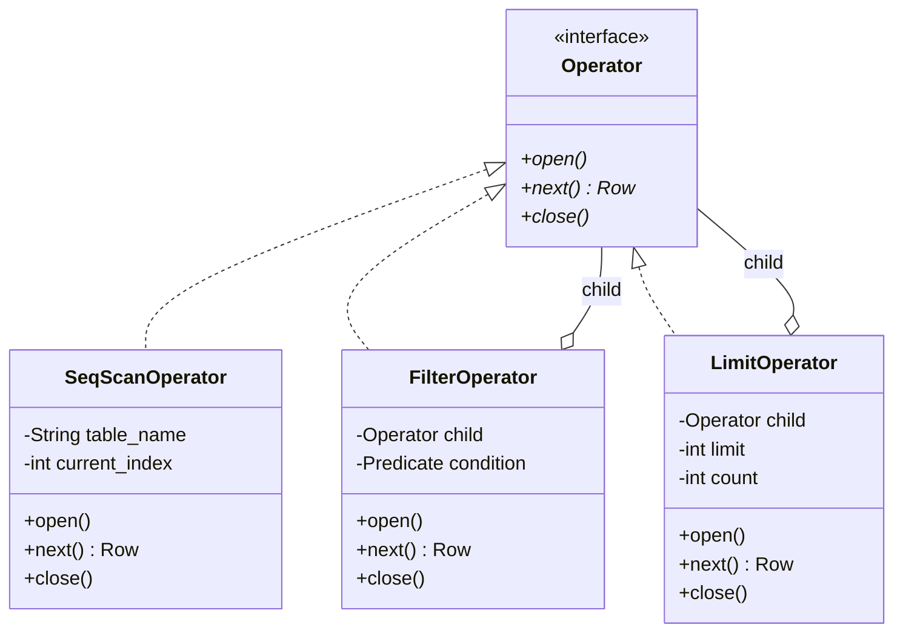
```mermaid
classDiagram
    class Operator {
        <<interface>>
        +open()*
        +next()* Row
        +close()*
    }
    
    class SeqScanOperator {
        -String table_name
        -int current_index
        +open()
        +next() Row
        +close()
    }
    
    class FilterOperator {
        -Operator child
        -Predicate condition
        +open()
        +next() Row
        +close()
    }
    
    class LimitOperator {
        -Operator child
        -int limit
        -int count
        +open()
        +next() Row
        +close()
    }

    Operator <|.. SeqScanOperator
    Operator <|.. FilterOperator
    Operator <|.. LimitOperator
    FilterOperator o-- Operator : child
    LimitOperator o-- Operator : child
```

### TDD Code Example
```python
from abc import ABC, abstractmethod

class Operator(ABC):
    @abstractmethod
    def open(self): pass
    @abstractmethod
    def next(self): pass
    @abstractmethod
    def close(self): pass

class SeqScanOperator(Operator):
    def __init__(self, data):
        self.data = data
        self.cursor = 0
        
    def open(self): self.cursor = 0
    def next(self):
        if self.cursor < len(self.data):
            row = self.data[self.cursor]
            self.cursor += 1
            return row
        return None
    def close(self): pass

class FilterOperator(Operator):
    def __init__(self, child_op, predicate):
        self.child = child_op
        self.predicate = predicate
        
    def open(self): self.child.open()
    def next(self):
        while True:
            row = self.child.next()
            if row is None: return None
            if self.predicate(row): return row # Passes the filter
    def close(self): self.child.close()

class LimitOperator(Operator):
    def __init__(self, child_op, limit):
        self.child = child_op
        self.limit = limit
        self.count = 0
        
    def open(self):
        self.child.open()
        self.count = 0
        
    def next(self):
        if self.count >= self.limit: return None
        row = self.child.next()
        if row is not None: self.count += 1
        return row
    def close(self): self.child.close()

# --- TEST CODE ---
# Simulating a physical query plan: SELECT * FROM users WHERE age > 18 LIMIT 2
raw_data = [
    {"id": 1, "age": 15},
    {"id": 2, "age": 22},
    {"id": 3, "age": 30},
    {"id": 4, "age": 12},
    {"id": 5, "age": 25}
]

scan = SeqScanOperator(raw_data)
filter_op = FilterOperator(scan, lambda r: r["age"] > 18)
limit_op = LimitOperator(filter_op, 2)

# Execution Engine Engine loop (Pull-based)
limit_op.open()
while True:
    row = limit_op.next()
    if row is None: break
    print(f"Fetched Row: {row}")
limit_op.close()
# Output:
# Fetched Row: {'id': 2, 'age': 22}
# Fetched Row: {'id': 3, 'age': 30}
```

---

## 7. Prototype Pattern: Schema Cloning (Medium High Priority)

*   **Why choose Prototype instead of creating a new object from scratch?**
    In a DBMS, cloning an existing Table (e.g., `CREATE TABLE users_backup AS SELECT * FROM users` with no data, just schema) involves duplicating the table definition, all of its columns (and their specific data types, lengths, default values), and sometimes indexes and constraints. If the DBMS Engine tries to manually extract each property from the metadata tables and instantiate new `Column` objects step-by-step, the code becomes extremely slow, complex, and coupled to the specific classes.
    
    **The Prototype Pattern Solves This By:**
    1. **Self-Cloning Capability:** Every `MetadataNode` (like `Table`, `Column`) implements a `clone()` method. The object itself knows best how to create an exact deep copy of its own state.
    2. **Performance:** Cloning objects in memory is generally faster than re-parsing definitions or querying the system catalog to build a new object from scratch.
    3. **Decoupling:** The Engine just calls `table.clone()`. It doesn't need to know the internal structure of the `Table` or how its children (`Columns`) are organized.

### Class Diagram
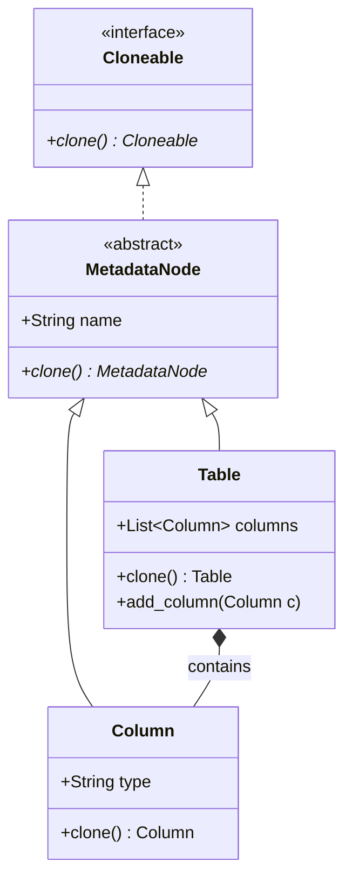
```mermaid
classDiagram
    class Cloneable {
        <<interface>>
        +clone()* Cloneable
    }
    
    class MetadataNode {
        <<abstract>>
        +String name
        +clone()* MetadataNode
    }
    
    class Table {
        +List~Column~ columns
        +clone() Table
        +add_column(Column c)
    }
    
    class Column {
        +String type
        +clone() Column
    }

    Cloneable <|.. MetadataNode
    MetadataNode <|-- Table
    MetadataNode <|-- Column
    Table *-- Column : contains
```

### Sequence Diagram
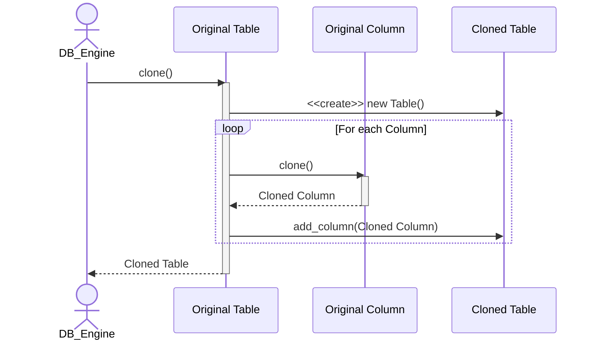
```mermaid
sequenceDiagram
    actor DB_Engine
    participant Tbl as Original Table
    participant Col1 as Original Column
    participant ClonedTbl as Cloned Table
    
    DB_Engine->>Tbl: clone()
    activate Tbl
    
    Tbl->>ClonedTbl: <<create>> new Table()
    
    loop For each Column
        Tbl->>Col1: clone()
        activate Col1
        Col1-->>Tbl: Cloned Column
        deactivate Col1
        Tbl->>ClonedTbl: add_column(Cloned Column)
    end
    
    Tbl-->>DB_Engine: Cloned Table
    deactivate Tbl
```

### TDD Code Example
```python
import copy
from abc import ABC, abstractmethod

class Cloneable(ABC):
    @abstractmethod
    def clone(self): pass

class Column(Cloneable):
    def __init__(self, name, data_type):
        self.name = name
        self.data_type = data_type
        
    def clone(self):
        # Shallow copy is fine for simple strings
        return copy.copy(self)
        
    def __str__(self): return f"{self.name} {self.data_type}"

class Table(Cloneable):
    def __init__(self, name):
        self.name = name
        self.columns = []
        
    def add_column(self, col):
        self.columns.append(col)
        
    def clone(self):
        # Deep copy needed because a Table contains a list of Columns
        cloned_table = Table(self.name + "_clone")
        for col in self.columns:
            cloned_table.add_column(col.clone())
        return cloned_table
        
    def __str__(self):
        cols = ", ".join(str(c) for c in self.columns)
        return f"Table({self.name}) [{cols}]"

# --- TEST CODE ---
original = Table("users")
original.add_column(Column("id", "INT"))
original.add_column(Column("name", "VARCHAR(50)"))

print(f"Original: {original}")

# Cloning the table
backup = original.clone()
print(f"Backup  : {backup}")

# Modify original to ensure deep copy works
original.add_column(Column("created_at", "TIMESTAMP"))
print(f"After modifying Original:")
print(f"Original: {original}")
print(f"Backup  : {backup}") # Backup should NOT have 'created_at'

# Output:
# Original: Table(users) [id INT, name VARCHAR(50)]
# Backup  : Table(users_clone) [id INT, name VARCHAR(50)]
# After modifying Original:
# Original: Table(users) [id INT, name VARCHAR(50), created_at TIMESTAMP]
# Backup  : Table(users_clone) [id INT, name VARCHAR(50)]
```

---

## 8. Proxy Pattern: Metadata Caching (Medium Priority)

*   **Why choose Proxy instead of loading everything on startup?**
    An enterprise DBMS may have tens of thousands of tables, views, and procedures. If the DBMS Engine tries to load the full metadata (columns, data types, constraints) of every single object into RAM at startup, it will cause immense memory bloat and unacceptable startup times.
    
    **The Proxy Pattern Solves This By:**
    1. **Lazy Loading:** A `TableProxy` acts as a lightweight placeholder. It only contains the table's name. It implements the same interface as the `RealTable`.
    2. **Transparent Access:** When the Query Optimizer queries the proxy for the table's columns (e.g., calling `get_columns()`), the proxy intercepts the call, fetches the heavy metadata from the disk catalog, instantiates the `RealTable`, and caches it for future calls.
    3. **Memory Efficiency:** Only the metadata of actively queried tables resides in memory.

### Class Diagram
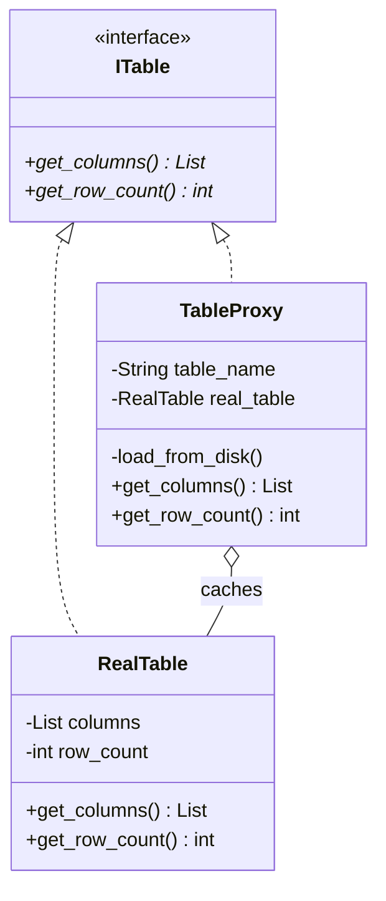
```mermaid
classDiagram
    class ITable {
        <<interface>>
        +get_columns()* List
        +get_row_count()* int
    }
    
    class RealTable {
        -List columns
        -int row_count
        +get_columns() List
        +get_row_count() int
    }
    
    class TableProxy {
        -String table_name
        -RealTable real_table
        -load_from_disk()
        +get_columns() List
        +get_row_count() int
    }

    ITable <|.. RealTable
    ITable <|.. TableProxy
    TableProxy o-- RealTable : caches
```

### Sequence Diagram
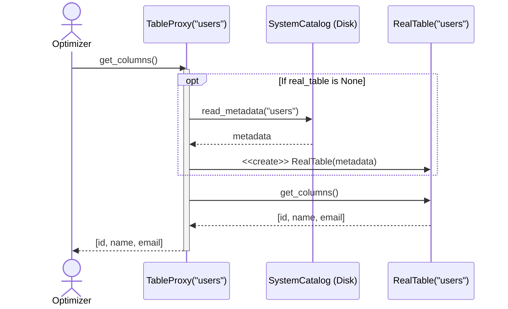
```mermaid
sequenceDiagram
    actor Optimizer
    participant Proxy as TableProxy("users")
    participant Disk as SystemCatalog (Disk)
    participant Real as RealTable("users")

    Optimizer->>Proxy: get_columns()
    activate Proxy
    
    opt If real_table is None
        Proxy->>Disk: read_metadata("users")
        Disk-->>Proxy: metadata
        Proxy->>Real: <<create>> RealTable(metadata)
    end
    
    Proxy->>Real: get_columns()
    Real-->>Proxy: [id, name, email]
    
    Proxy-->>Optimizer: [id, name, email]
    deactivate Proxy
```

### TDD Code Example
```python
from abc import ABC, abstractmethod

class ITable(ABC):
    @abstractmethod
    def get_columns(self): pass

class RealTable(ITable):
    def __init__(self, table_name):
        print(f"[DISK I/O] Loading heavy metadata for table '{table_name}' from disk...")
        self.table_name = table_name
        # Simulate loading columns
        self.columns = ["id", "username", "email"]
        
    def get_columns(self):
        return self.columns

class TableProxy(ITable):
    def __init__(self, table_name):
        self.table_name = table_name
        self.real_table = None # Cache is initially empty
        print(f"[PROXY] Created lightweight placeholder for '{table_name}'.")
        
    def _load(self):
        if self.real_table is None:
            self.real_table = RealTable(self.table_name)
            
    def get_columns(self):
        self._load() # Ensure real object exists
        return self.real_table.get_columns()

# --- TEST CODE ---
# Startup phase: Creating proxies is very fast
users_table = TableProxy("users")
orders_table = TableProxy("orders")

print("
--- Processing Query: SELECT email FROM users ---")
# First access triggers disk load
cols = users_table.get_columns()
print(f"Columns in users: {cols}")

print("
--- Processing Query: SELECT username FROM users ---")
# Second access uses cache (no disk I/O)
cols2 = users_table.get_columns()
print(f"Columns in users: {cols2}")

# Output:
# [PROXY] Created lightweight placeholder for 'users'.
# [PROXY] Created lightweight placeholder for 'orders'.
#
# --- Processing Query: SELECT email FROM users ---
# [DISK I/O] Loading heavy metadata for table 'users' from disk...
# Columns in users: ['id', 'username', 'email']
#
# --- Processing Query: SELECT username FROM users ---
# Columns in users: ['id', 'username', 'email']
```

---

## 9. Command Pattern: DDL Commands (Medium Priority)

*   **Why choose Command instead of running DDL logic directly?**
    When a user issues `CREATE TABLE`, `DROP TABLE`, or `ALTER TABLE`, executing the creation logic directly inside the SQL Parser or Query Engine tightly couples those components. It also makes it very difficult to implement features like Transactional DDL (where a `CREATE TABLE` can be rolled back if a subsequent command fails) or Replicated DDL (sending the command to replica nodes).
    
    **The Command Pattern Solves This By:**
    1. **Encapsulation:** Every DDL operation is wrapped into an object (e.g., `CreateTableCommand`) that contains all necessary information (table name, columns) to execute the action.
    2. **Undo Capability:** Commands can implement an `undo()` method. E.g., the undo of `CreateTable` is `DROP TABLE`.
    3. **Queueing & Logging:** Commands can be placed in a queue for sequential execution, or serialized to a Write-Ahead Log (WAL) before execution.

### Class Diagram
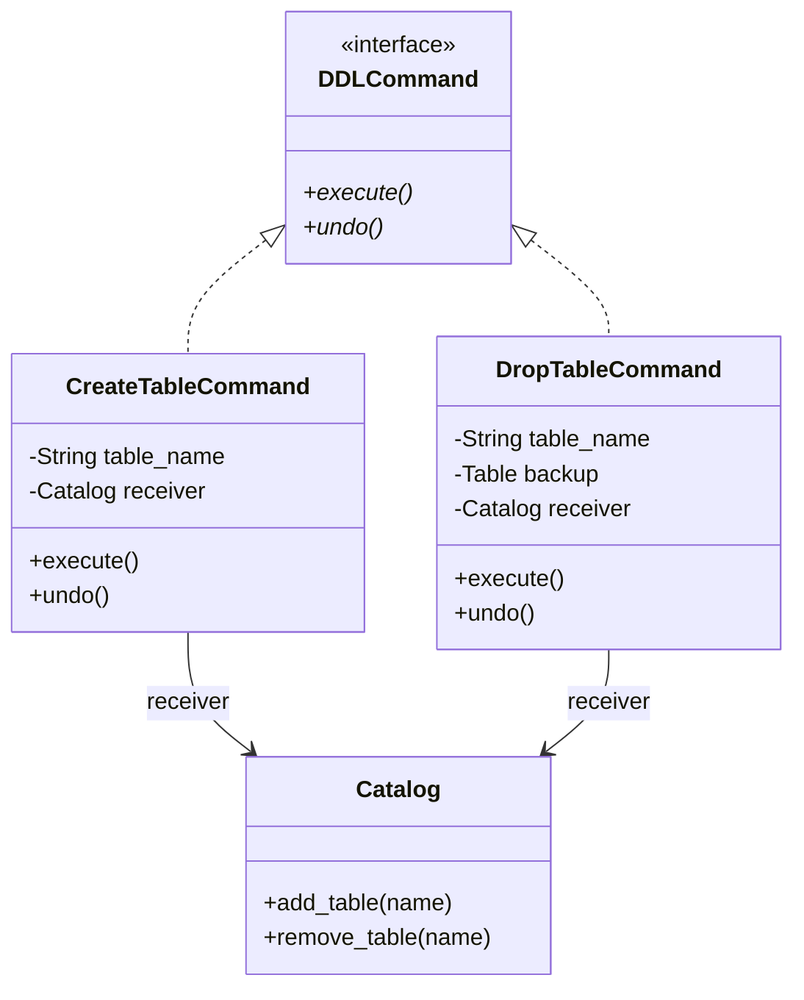
```mermaid
classDiagram
    class DDLCommand {
        <<interface>>
        +execute()*
        +undo()*
    }
    
    class CreateTableCommand {
        -String table_name
        -Catalog receiver
        +execute()
        +undo()
    }
    
    class DropTableCommand {
        -String table_name
        -Table backup
        -Catalog receiver
        +execute()
        +undo()
    }
    
    class Catalog {
        +add_table(name)
        +remove_table(name)
    }

    DDLCommand <|.. CreateTableCommand
    DDLCommand <|.. DropTableCommand
    CreateTableCommand --> Catalog : receiver
    DropTableCommand --> Catalog : receiver
```

### Sequence Diagram
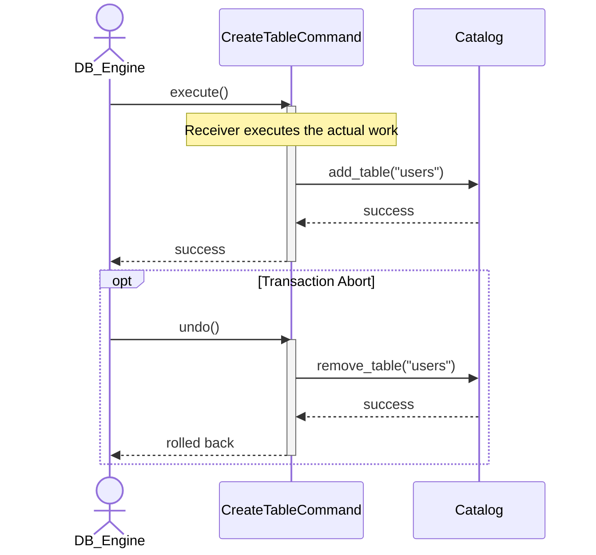
```mermaid
sequenceDiagram
    actor DB_Engine
    participant Cmd as CreateTableCommand
    participant Cat as Catalog

    DB_Engine->>Cmd: execute()
    activate Cmd
    
    Note over Cmd: Receiver executes the actual work
    Cmd->>Cat: add_table("users")
    Cat-->>Cmd: success
    
    Cmd-->>DB_Engine: success
    deactivate Cmd
    
    opt Transaction Abort
        DB_Engine->>Cmd: undo()
        activate Cmd
        Cmd->>Cat: remove_table("users")
        Cat-->>Cmd: success
        Cmd-->>DB_Engine: rolled back
        deactivate Cmd
    end
```

### TDD Code Example
```python
from abc import ABC, abstractmethod

# The Receiver
class Catalog:
    def __init__(self):
        self.tables = set()
        
    def add_table(self, name):
        print(f"[CATALOG] Creating table '{name}'")
        self.tables.add(name)
        
    def remove_table(self, name):
        print(f"[CATALOG] Dropping table '{name}'")
        self.tables.remove(name)
        
    def __str__(self): return f"Current Tables: {self.tables}"

# The Command Interface
class DDLCommand(ABC):
    @abstractmethod
    def execute(self): pass
    @abstractmethod
    def undo(self): pass

# Concrete Commands
class CreateTableCommand(DDLCommand):
    def __init__(self, catalog, table_name):
        self.catalog = catalog
        self.table_name = table_name
        
    def execute(self):
        self.catalog.add_table(self.table_name)
        
    def undo(self):
        print(f"-> UNDO CreateTableCommand({self.table_name})")
        self.catalog.remove_table(self.table_name)

class DropTableCommand(DDLCommand):
    def __init__(self, catalog, table_name):
        self.catalog = catalog
        self.table_name = table_name
        
    def execute(self):
        self.catalog.remove_table(self.table_name)
        
    def undo(self):
        print(f"-> UNDO DropTableCommand({self.table_name})")
        # In a real DBMS, this requires restoring the table from a Memento/Backup
        self.catalog.add_table(self.table_name)

# --- TEST CODE ---
catalog = Catalog()
history = [] # To keep track of executed commands for rollback

print(catalog)

cmd1 = CreateTableCommand(catalog, "users")
cmd1.execute()
history.append(cmd1)

cmd2 = CreateTableCommand(catalog, "orders")
cmd2.execute()
history.append(cmd2)

print(catalog)

# Something went wrong, rollback the last transaction!
print("
[TRANSACTION FAILED] Rolling back changes...")
while history:
    last_cmd = history.pop()
    last_cmd.undo()

print(catalog)

# Output:
# Current Tables: set()
# [CATALOG] Creating table 'users'
# [CATALOG] Creating table 'orders'
# Current Tables: {'users', 'orders'}
# 
# [TRANSACTION FAILED] Rolling back changes...
# -> UNDO CreateTableCommand(orders)
# [CATALOG] Dropping table 'orders'
# -> UNDO CreateTableCommand(users)
# [CATALOG] Dropping table 'users'
# Current Tables: set()
```

---

## 10. Observer Pattern: Trigger Notification (Medium Priority)

*   **Why choose Observer instead of hardcoding trigger logic inside `Table.insert()`?**
    Database Triggers are custom logic executed automatically when a table undergoes an `INSERT`, `UPDATE`, or `DELETE`. If a `Table` class explicitly calls `AuditLog.write()` or `NotificationService.send()` whenever a row is inserted, the `Table` becomes tightly coupled to arbitrary services and violates the Single Responsibility Principle.
    
    **The Observer Pattern Solves This By:**
    1. **Loose Coupling:** The `Table` acts as a Subject. It maintains a list of `Trigger` observers. It doesn't know what the triggers do.
    2. **Dynamic Subscription:** Triggers can be dynamically attached (created) or detached (dropped) at runtime via `attach()` and `detach()`.
    3. **Event Broadcasting:** When `Table.insert()` finishes, it simply iterates through its observers and calls `trigger.update(row_data)`.

### Class Diagram
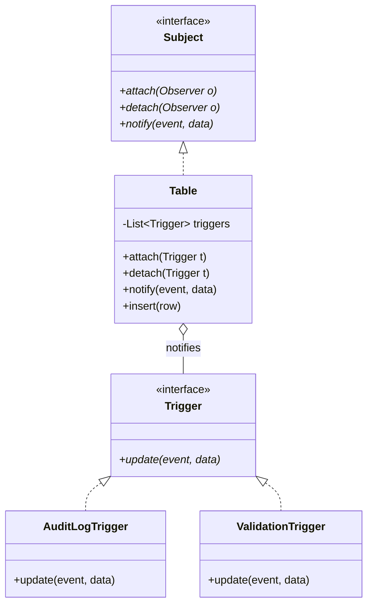
```mermaid
classDiagram
    class Subject {
        <<interface>>
        +attach(Observer o)*
        +detach(Observer o)*
        +notify(event, data)*
    }
    
    class Table {
        -List~Trigger~ triggers
        +attach(Trigger t)
        +detach(Trigger t)
        +notify(event, data)
        +insert(row)
    }
    
    class Trigger {
        <<interface>>
        +update(event, data)*
    }
    
    class AuditLogTrigger {
        +update(event, data)
    }
    
    class ValidationTrigger {
        +update(event, data)
    }

    Subject <|.. Table
    Trigger <|.. AuditLogTrigger
    Trigger <|.. ValidationTrigger
    Table o-- Trigger : notifies
```

### Sequence Diagram
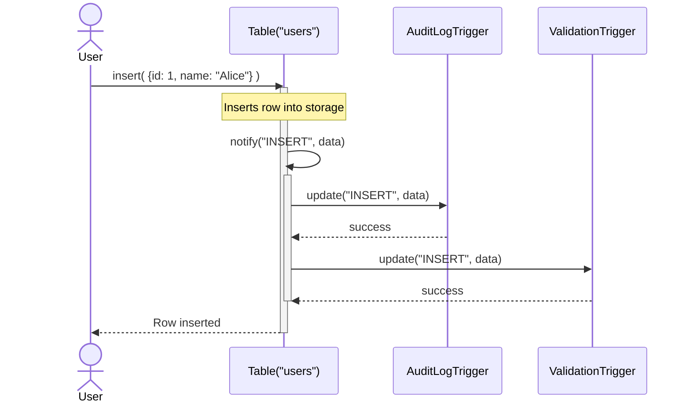
```mermaid
sequenceDiagram
    actor User
    participant Tbl as Table("users")
    participant Aud as AuditLogTrigger
    participant Val as ValidationTrigger

    User->>Tbl: insert( {id: 1, name: "Alice"} )
    activate Tbl
    
    Note over Tbl: Inserts row into storage
    
    Tbl->>Tbl: notify("INSERT", data)
    activate Tbl
    
    Tbl->>Aud: update("INSERT", data)
    Aud-->>Tbl: success
    
    Tbl->>Val: update("INSERT", data)
    Val-->>Tbl: success
    
    deactivate Tbl
    
    Tbl-->>User: Row inserted
    deactivate Tbl
```

### TDD Code Example
```python
from abc import ABC, abstractmethod

# The Observer Interface
class Trigger(ABC):
    @abstractmethod
    def update(self, event_type, row_data): pass

# Concrete Observers
class AuditLogTrigger(Trigger):
    def update(self, event_type, row_data):
        print(f"[AUDIT LOG] Recorded {event_type} operation with data: {row_data}")

class ValidationTrigger(Trigger):
    def update(self, event_type, row_data):
        if event_type == "INSERT" and "email" not in row_data:
            print(f"[VALIDATION] Warning: Inserted row is missing an email field!")

# The Subject
class Table:
    def __init__(self, name):
        self.name = name
        self.triggers = [] # List of observers
        
    def attach(self, trigger: Trigger):
        self.triggers.append(trigger)
        
    def detach(self, trigger: Trigger):
        self.triggers.remove(trigger)
        
    def notify(self, event_type, row_data):
        # Broadcast to all attached observers
        for trigger in self.triggers:
            trigger.update(event_type, row_data)
            
    def insert(self, row_data):
        print(f"\nTable '{self.name}': Inserting row {row_data} into storage...")
        # (Storage logic goes here)
        
        # Notify observers that an insert happened
        self.notify("INSERT", row_data)

# --- TEST CODE ---
users_table = Table("users")

# Create triggers (Observers)
audit_trigger = AuditLogTrigger()
val_trigger = ValidationTrigger()

# Attach triggers to the table (Subscription)
users_table.attach(audit_trigger)
users_table.attach(val_trigger)

# Perform operation
users_table.insert({"id": 1, "name": "Alice", "email": "alice@gmail.com"})
# Output:
# Table 'users': Inserting row {'id': 1, 'name': 'Alice', 'email': 'alice@gmail.com'} into storage...
# [AUDIT LOG] Recorded INSERT operation with data: {'id': 1, 'name': 'Alice', 'email': 'alice@gmail.com'}

# Perform another operation that fails validation trigger
users_table.insert({"id": 2, "name": "Bob"})
# Output:
# Table 'users': Inserting row {'id': 2, 'name': 'Bob'} into storage...
# [AUDIT LOG] Recorded INSERT operation with data: {'id': 2, 'name': 'Bob'}
# [VALIDATION] Warning: Inserted row is missing an email field!
```


---

## 11. Builder Pattern: Table Construction (High Priority)

*   **Why choose Builder instead of a massive constructor?**
    Creating a new `Table` object often requires defining a name, adding multiple columns (each with a specific type and constraints), setting a primary key, and defining foreign keys. If a constructor is used, it results in the "Telescoping Constructor Anti-Pattern" (e.g., `new Table("users", cols, pk, fks, indexes)`). The Builder pattern allows us to assemble this complex object step-by-step, making the API readable, fluent, and preventing partially initialized tables.

### Class Diagram
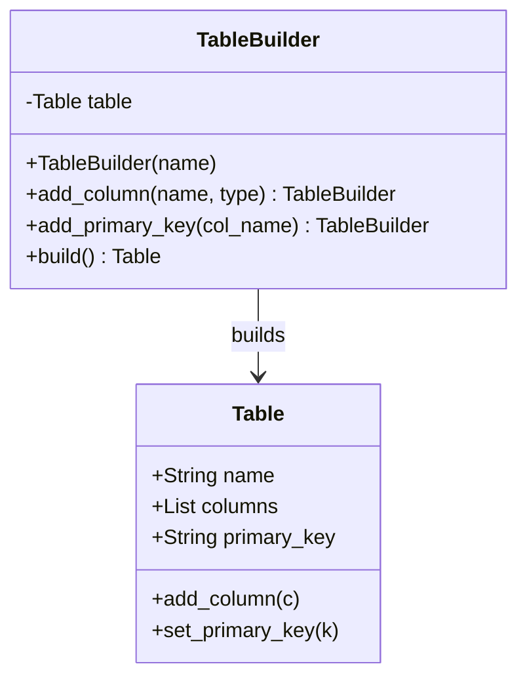
```mermaid
classDiagram
    class Table {
        +String name
        +List columns
        +String primary_key
        +add_column(c)
        +set_primary_key(k)
    }
    
    class TableBuilder {
        -Table table
        +TableBuilder(name)
        +add_column(name, type) TableBuilder
        +add_primary_key(col_name) TableBuilder
        +build() Table
    }

    TableBuilder --> Table : builds
```

### Sequence Diagram
```mermaid
sequenceDiagram
    actor DB_Engine
    participant Builder as TableBuilder
    participant Tbl as Table
    
    DB_Engine->>Builder: <<create>> TableBuilder("users")
    activate Builder
    Builder->>Tbl: <<create>> Table("users")
    
    DB_Engine->>Builder: add_column("id", "INT")
    Builder->>Tbl: add_column(Column("id", "INT"))
    Builder-->>DB_Engine: returns self
    
    DB_Engine->>Builder: add_primary_key("id")
    Builder->>Tbl: set_primary_key("id")
    Builder-->>DB_Engine: returns self
    
    DB_Engine->>Builder: build()
    Builder-->>DB_Engine: returns Table
    deactivate Builder
```

### TDD Code Example
```python
class Table:
    def __init__(self, name):
        self.name = name
        self.columns = []
        self.primary_key = None
        
    def __str__(self):
        cols = ", ".join(self.columns)
        return f"Table({self.name}) [Cols: {cols} | PK: {self.primary_key}]"

class TableBuilder:
    def __init__(self, name):
        self.table = Table(name)
        
    def add_column(self, name, data_type):
        self.table.columns.append(f"{name} {data_type}")
        return self # Fluent interface
        
    def add_primary_key(self, col_name):
        self.table.primary_key = col_name
        return self
        
    def build(self):
        return self.table

# --- TEST CODE ---
builder = TableBuilder("orders")
# Fluent method chaining
orders_table = (builder
                .add_column("order_id", "INT")
                .add_column("amount", "FLOAT")
                .add_primary_key("order_id")
                .build())

print(orders_table)
# Output: Table(orders) [Cols: order_id INT, amount FLOAT | PK: order_id]
```

---

## 12. Flyweight Pattern: Data Type Sharing (Medium Priority)

*   **Why choose Flyweight?**
    A database might manage thousands of tables, combining to millions of columns. The vast majority of these columns share the exact same data types (e.g., standard `INT`, `VARCHAR(255)`). Creating a new `DataType` object for every single column consumes massive amounts of RAM for redundant information. Flyweight solves this by storing intrinsic (shared) state in a factory cache and passing out references to the exact same object.

### Class Diagram
```mermaid
classDiagram
    class DataType {
        <<interface>>
        +get_name()* String
        +get_size()* int
    }
    
    class IntegerType {
        +get_name() String
        +get_size() int
    }
    
    class DataTypeFactory {
        -Map~String, DataType~ cache
        +get_type(name) DataType
    }
    
    class Column {
        -String name
        -DataType type
    }

    DataType <|.. IntegerType
    DataTypeFactory *-- DataType : caches
    Column o-- DataType : uses (shared)
```

### Sequence Diagram
```mermaid
sequenceDiagram
    actor Engine
    participant Factory as DataTypeFactory
    participant Cache as HashMap
    participant IntType as IntegerType
    
    Engine->>Factory: get_type("INT")
    activate Factory
    Factory->>Cache: check "INT"
    Cache-->>Factory: not found
    
    Factory->>IntType: <<create>> IntegerType()
    Factory->>Cache: store("INT", instance)
    
    Factory-->>Engine: IntType instance
    deactivate Factory
    
    Engine->>Factory: get_type("INT")
    activate Factory
    Factory->>Cache: check "INT"
    Cache-->>Factory: returns existing instance
    Factory-->>Engine: IntType instance (shared)
    deactivate Factory
```

### TDD Code Example
```python
class DataType:
    def __init__(self, name, size):
        self.name = name
        self.size = size
        
class DataTypeFactory:
    _cache = {}
    
    @staticmethod
    def get_type(type_name):
        type_name = type_name.upper()
        if type_name not in DataTypeFactory._cache:
            if type_name == "INT":
                DataTypeFactory._cache[type_name] = DataType("INT", 4)
            elif type_name == "BIGINT":
                DataTypeFactory._cache[type_name] = DataType("BIGINT", 8)
            else:
                DataTypeFactory._cache[type_name] = DataType(type_name, 0)
            print(f"[{type_name}] Instantiated new object.")
        else:
            print(f"[{type_name}] Returning cached object.")
            
        return DataTypeFactory._cache[type_name]

# --- TEST CODE ---
# Creating columns for Table A
col1_type = DataTypeFactory.get_type("INT")
col2_type = DataTypeFactory.get_type("BIGINT")

# Creating columns for Table B
col3_type = DataTypeFactory.get_type("INT")

print(f"Is col1 type exactly the same object as col3 type? {col1_type is col3_type}")
# Output: 
# [INT] Instantiated new object.
# [BIGINT] Instantiated new object.
# [INT] Returning cached object.
# Is col1 type exactly the same object as col3 type? True
```

---

## 13. Visitor Pattern: Tree Operations (Medium High Priority)

*   **Why choose Visitor instead of putting logic in the classes?**
    The `Database -> Schema -> Table` structure is an established Composite tree. If we want to implement a new feature like "Generate DDL Script" or "Calculate Disk Usage" across the whole tree, adding `generate_ddl()` or `calculate_size()` to every single node class pollutes them with unrelated logic and violates the Single Responsibility Principle. Visitor extracts this logic into a separate `Visitor` class. The tree nodes just need to `accept(visitor)`, enabling us to add infinite new tree-walking operations without modifying the structure.

### Class Diagram
```mermaid
classDiagram
    class DatabaseNode {
        <<interface>>
        +accept(Visitor v)*
    }
    
    class Table {
        +accept(Visitor v)
    }
    
    class Column {
        +accept(Visitor v)
    }
    
    class Visitor {
        <<interface>>
        +visit_table(Table t)*
        +visit_column(Column c)*
    }
    
    class DDLGeneratorVisitor {
        -String script
        +visit_table(Table t)
        +visit_column(Column c)
        +get_script() String
    }

    DatabaseNode <|.. Table
    DatabaseNode <|.. Column
    Visitor <|.. DDLGeneratorVisitor
    DatabaseNode --> Visitor : accepts
```

### Sequence Diagram
```mermaid
sequenceDiagram
    actor Engine
    participant Vis as DDLGeneratorVisitor
    participant Tbl as Table
    participant Col as Column
    
    Engine->>Tbl: accept(Vis)
    activate Tbl
    Tbl->>Vis: visit_table(self)
    activate Vis
    Note over Vis: Appends "CREATE TABLE..."
    
    loop For each column
        Tbl->>Col: accept(Vis)
        activate Col
        Col->>Vis: visit_column(self)
        Vis-->>Col: returns
        deactivate Col
    end
    
    Vis-->>Tbl: returns
    deactivate Vis
    Tbl-->>Engine: returns
    deactivate Tbl
```

### TDD Code Example
```python
# The Visitor interface
class DatabaseVisitor:
    def visit_table(self, table): pass
    def visit_column(self, column): pass

# The Concrete Visitor for generating SQL
class DDLGeneratorVisitor(DatabaseVisitor):
    def __init__(self):
        self.script = []
        
    def visit_table(self, table):
        self.script.append(f"CREATE TABLE {table.name} (")
        # Let the table tell its children to accept the visitor
        for col in table.columns:
            col.accept(self)
        self.script.append(");")
        
    def visit_column(self, column):
        self.script.append(f"    {column.name} {column.type},")
        
    def get_result(self):
        return "
".join(self.script)

# Tree Nodes
class Node:
    def accept(self, visitor): pass

class Column(Node):
    def __init__(self, name, type_):
        self.name = name
        self.type = type_
    def accept(self, visitor):
        visitor.visit_column(self)

class Table(Node):
    def __init__(self, name):
        self.name = name
        self.columns = []
    def accept(self, visitor):
        visitor.visit_table(self)

# --- TEST CODE ---
tbl = Table("employees")
tbl.columns.extend([Column("id", "INT"), Column("name", "VARCHAR")])

visitor = DDLGeneratorVisitor()
tbl.accept(visitor)

print("Generated Script:")
print(visitor.get_result())
# Output:
# Generated Script:
# CREATE TABLE employees (
#     id INT,
#     name VARCHAR,
# );
```
