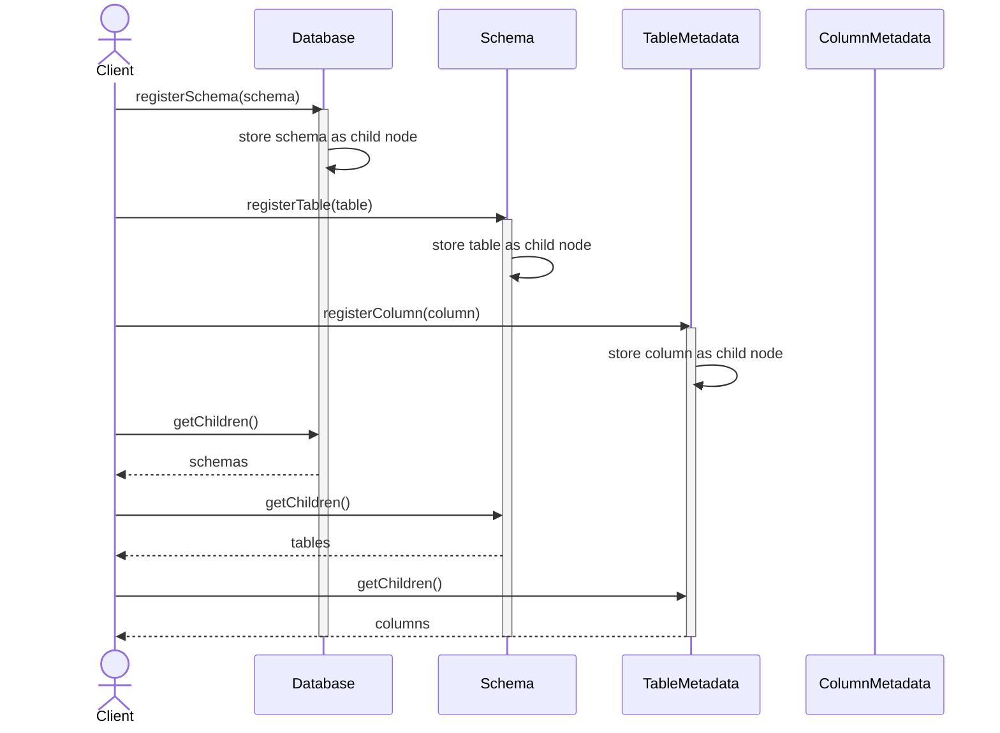
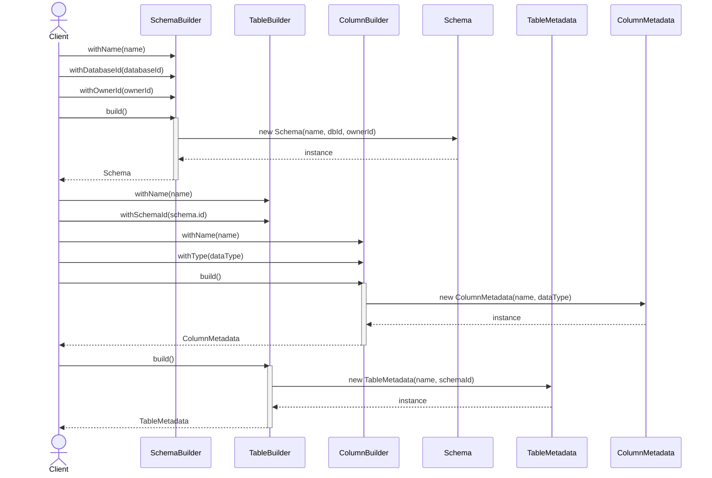
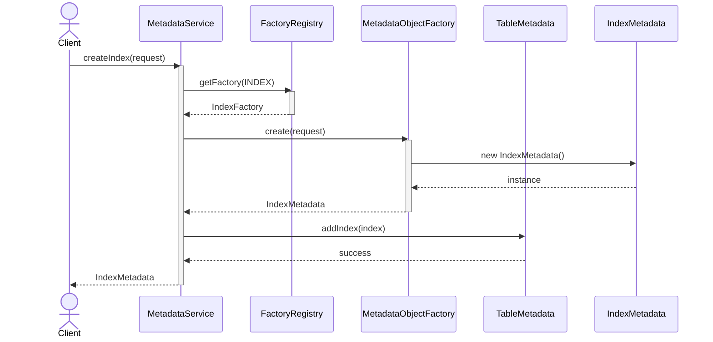
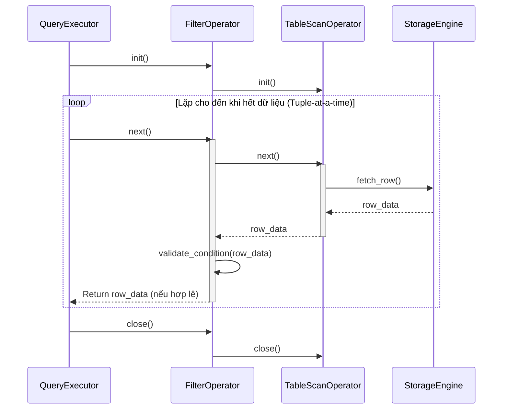
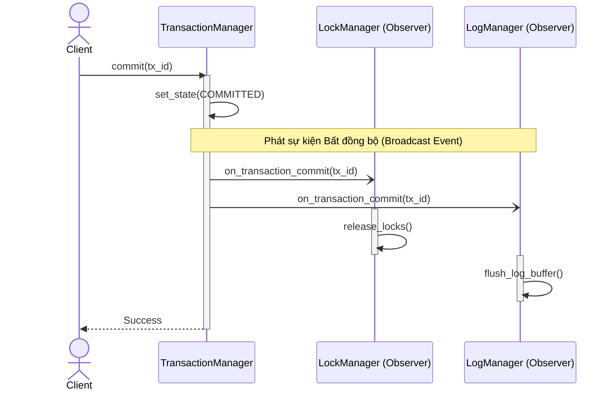

# Ứng dụng Design Pattern

Dựa trên việc phân tích Mindmap, Class Diagram và danh sách Test cases, dưới đây là tổng hợp các Design Patterns được phân loại theo các module cốt lõi trong hệ thống DBMS.

| Thứ tự | Tính năng chính (Main Feature) | Design Pattern áp dụng |
| :---: | :--- | :--- |
| 1 | **Database & Metadata Management** | Composite, Builder, Factory Method, Repository, Prototype, Observer |
| 2 | **Storage Engine** | Facade, Strategy, Factory Method, Object Pool, Adapter, Bridge |
| 3 | **Query Processor** | Builder, Composite, Visitor, Chain of Responsibility, Strategy, Iterator |
| 4 | **Transaction Management** | State, Command, Strategy, Observer, Mediator, Memento |

---

# Chi tiết Ứng dụng (Detail Application)

Bảng dưới đây trình bày chi tiết việc áp dụng từng Pattern vào các tính năng cụ thể.

| Tính năng | Pattern | Ứng dụng |
| :--- | :--- | :--- |
| Database & Metadata Management | **Composite** | Áp dụng cấu trúc cây: `Database` $\rightarrow$ `Schema` $\rightarrow$ `Table` $\rightarrow$ `Column` |
| Database & Metadata Management | **Builder** | Xây dựng từng bước cho các đối tượng phức tạp như `Schema`, `TableMetadata`, `ColumnMetadata` |
| Database & Metadata Management | **Factory Method** | Tạo linh hoạt các đối tượng `Table`, `Index`, `Constraint`, `Trigger`, `Function` |
| Database & Metadata Management | **Repository** | Đóng gói logic lưu và truy xuất dữ liệu Metadata từ ổ đĩa (Storage) |
| Database & Metadata Management | **Prototype** | Hỗ trợ sao chép (clone) nhanh các cấu trúc Schema hoặc Table definition |
| Database & Metadata Management | **Observer** | Tự động cập nhật Catalog và bảng thống kê (Statistics) mỗi khi Metadata thay đổi |
| Storage Engine | **Facade** | Cung cấp giao diện `StorageEngine` duy nhất, che giấu đi sự phức tạp của `BufferPool`, `DiskManager`, `FileManager`, `RecordManager` bên dưới |
| Storage Engine | **Strategy** | Hoán đổi linh hoạt thuật toán thay thế trang (Page replacement: LRU, MRU) và cấp phát ổ đĩa (Storage allocation) |
| Storage Engine | **Object Pool** | Quản lý tái sử dụng bộ nhớ cho `Buffer Pool` và `Frame Pool` nhằm tối ưu hiệu suất |
| Storage Engine | **Factory Method** | Khởi tạo các loại đối tượng vật lý: `Page`, `Record`, `Index`, `LogRecord` |
| Storage Engine | **Adapter** | Chuyển đổi API của hệ điều hành File System sang chuẩn chung của DBMS |
| Query Processor | **Builder** | Dựng cây phân tích cú pháp (AST Tree), Logical Plan và Physical Plan một cách liền mạch |
| Query Processor | **Composite** | Cấu trúc phân tầng cho AST Tree và Execution Tree |
| Query Processor | **Visitor** | Tách biệt logic phân tích: Validation, Plan generation và Cost estimation ra khỏi cấu trúc Node |
| Query Processor | **Chain of Responsibility** | Chuỗi kiểm tra tính hợp lệ: Schema $\rightarrow$ Table $\rightarrow$ Column $\rightarrow$ Type $\rightarrow$ Permission validation |
| Query Processor | **Strategy** | Tối ưu hóa việc chọn chiến lược Scan (Seq/Index Scan), Join (Hash/Nested) |
| Query Processor | **Iterator** | Triển khai giao diện `init()`, `next()`, `close()` cho các toán tử thực thi (Execution operator) để duyệt dữ liệu không làm tràn RAM |
| Transaction Management | **State** | Quản lý vòng đời trạng thái của một giao dịch: `ACTIVE`, `COMMITTED`, `ABORTED` |
| Transaction Management | **Command** | Đóng gói các hành động thành đối tượng lệnh: `BEGIN`, `COMMIT`, `ROLLBACK`, `SAVEPOINT` |
| Transaction Management | **Strategy** | Lựa chọn chiến lược xử lý đồng thời (Concurrency): MVCC, Optimistic hoặc Pessimistic |
| Transaction Management | **Observer** | Lắng nghe và phản ứng với các sự kiện Transaction commit và rollback |
| Transaction Management | **Memento** | Lưu trữ trạng thái Savepoint để có thể Rollback về một điểm cụ thể |

---

# Sơ đồ Tương tác (Sequences)

Dưới đây là sơ đồ tương tác (Sequence Diagrams) và giải thích chi tiết lý do áp dụng cho các Pattern cốt lõi.

## 1. Composite: Database $\rightarrow$ Schema $\rightarrow$ Table $\rightarrow$ Column

**Lý do sử dụng mẫu Composite:**
*   Trong cấu trúc cơ sở dữ liệu, các đối tượng có mối quan hệ phụ thuộc dạng cây: `Database` $\vdash$ `Schema` $\vdash$ `Table` $\vdash$ `Column` $\vdash$ `Index` \| $\angle$ `Constraint` $\angle$ `View`
*   **Ưu điểm:**
    *   Xử lý toàn bộ Metadata thông qua một giao diện chung (dễ dàng quét và hiển thị toàn bộ thành phần của cây hoặc tính toán dung lượng chỉ bằng một hàm đệ quy).
    *   Dễ dàng mở rộng (Scale) nếu cần thêm các đối tượng Metadata mới trong tương lai.
    *   Phân biệt rõ ràng giữa đối tượng chứa con (Composite như Database, Schema, Table) và đối tượng lá (Leaf như Column, Constraint - không chứa con).

---

## 2. Builder: Schema, TableMetadata, ColumnMetadata

**Lý do sử dụng mẫu Builder:**
*   Quá trình khởi tạo Metadata thường đòi hỏi cấu hình rất nhiều thuộc tính (ví dụ: tên, kiểu dữ liệu, ràng buộc, liên kết...).
*   **Ưu điểm:**
    *   Tránh tình trạng "Telescoping Constructor" (Constructor bị phình to với hàng tá tham số không cần thiết).
    *   Cung cấp một cú pháp nối tiếp nhau (Fluent API) giúp code khởi tạo rõ ràng và dễ đọc hơn (ví dụ: `.withName().withType().build()`).
    *   Đảm bảo đối tượng `TableMetadata` chỉ được tạo ra khi nó đã được cấu hình đầy đủ và chính xác.

---

## 3. Factory: Create Table, Index, Constraint, Trigger, Function

**Lý do sử dụng mẫu Factory Method:**
*   DBMS hỗ trợ nhiều loại cấu trúc nội bộ dùng chung một Interface nhưng cách khởi tạo hoàn toàn khác nhau (ví dụ: `BTreeIndex` so với `HashIndex`).
*   **Ưu điểm:**
    *   Tách biệt logic khởi tạo phức tạp ra khỏi Business Logic chính.
    *   Dễ dàng đăng ký và mở rộng (Register) bằng cách tạo thêm Factory mới (ví dụ thêm `BitmapIndexFactory`) khi có kiểu Index mới mà không cần sửa code phía Client.

---

## 4. Iterator: Query Execution Engine

**Lý do sử dụng mẫu Iterator:**
*   Cần thực thi truy vấn (Query) và duyệt qua một tập dữ liệu siêu khổng lồ (vài tỷ dòng) mà không làm tràn bộ nhớ RAM (Out-Of-Memory) của máy chủ.
*   **Ưu điểm:**
    *   Xử lý tuần tự từng dòng (Tuple-at-a-time). Bộ nhớ RAM chỉ cần lưu 1 dòng hoặc 1 lô (Batch) nhỏ cho mỗi Operator tại một thời điểm.
    *   Giao diện chuẩn hóa cho tất cả các Operator: Hàm `init()`, `next()`, `close()` giúp dễ dàng ghép nối (Chaining) các toán tử Scan, Filter, Join lại với nhau.

---

## 5. Observer: Transaction Events

**Lý do sử dụng mẫu Observer:**
*   Nhiều thành phần nội bộ (Lock Manager, Buffer Pool, Log Manager) cần phản ứng tức thời ngay khi một giao dịch thay đổi trạng thái (Commit hoặc Rollback).
*   **Ưu điểm:**
    *   **Giảm thiểu phụ thuộc (Loose Coupling):** `TransactionManager` không cần biết chi tiết về `LockManager` hay `LogManager`. Nó chỉ cần phát ra một sự kiện (Broadcast).
    *   Dễ dàng thêm các hệ thống theo dõi mới (như Auditing, Replication) tham gia lắng nghe sự kiện mà không ảnh hưởng hay phải sửa chữa Core Logic.

