# Phân tích Thiết kế Module: Database Object Management

Dựa trên cấu trúc của **Mindmap**, **Class Diagram** (từ `README.md`) và hình ảnh tham chiếu, chúng ta tập trung toàn lực bóc tách **1 Module duy nhất** hiện tại: **Database Object Management**. 

Module này được chia làm 2 nhóm tính năng chính (Sub-modules): **Database Objects** và **Database Management**. Dưới đây là bảng đánh giá mức độ quan trọng và danh sách các Design Pattern áp dụng thực tế đã được sắp xếp lại theo **Độ ưu tiên**.

## 📊 1. Database Objects

Nhóm này quản lý các thành phần cấu thành nên dữ liệu (Lược đồ, Bảng, Ràng buộc...).

| Độ ưu tiên | Feature | Design Pattern | Reason / Context |
| :---: | :--- | :--- | :--- |
| 🔥 **Cao nhất** | Database Objects | **Composite** | Database contains Schemas, Schema contains Tables/Views, and manages them uniformly. |
| 🌟 **Cao** | Constraint Validation | **Template Method** | `Validate()` defines the workflow, each constraint only implements `Check()`. |
| ⭐ **Khá cao** | Referential Action | **Strategy** | Selects Cascade, Restrict, SetNull, or SetDefault behavior when deleting/updating. |
| 💡 **Trung bình**| DDL Command | **Command** | `CreateTable`, `DropTable`, and `AlterTable` operations are encapsulated into executable objects. |

## 📊 2. Database Management

Nhóm này cung cấp mặt tiền giao tiếp và quản lý vòng đời của cơ sở dữ liệu.

| Độ ưu tiên | Feature | Design Pattern | Reason / Context |
| :---: | :--- | :--- | :--- |
| 🌟 **Cao** | DatabaseServer | **Facade** | Provides a single unified API to start, stop and configure database server. |
| ⭐ **Khá cao** | Database Lifecycle | **State** | Database transitions between states such as Offline, Online, ReadOnly, and Recovering. |
| ⭐ **Khá cao** | Database Events | **Observer** | Monitoring systems receive events for Create, Drop, Backup, and Restore. |
| 💡 **Trung bình**| Backup/Restore | **Template Method**| Provides a fixed backup workflow, while differentiating between Full and Incremental. |

---

# Phân tích Chuyên Sâu (Đầy đủ Class Diagram & Sequence Diagram)

Dưới đây là phân tích chi tiết cho **toàn bộ 8 Features** đã nêu ở trên. Cấu trúc đi từ Lý do chọn Pattern, Sơ đồ cấu trúc tĩnh (Class Diagram), Sơ đồ gọi hàm động (Sequence Diagram) cho tới Code TDD minh họa.

## 1. Mẫu Composite: Database Objects (🔥 Ưu tiên Cao nhất)

*   **Tại sao chọn Composite mà không dùng `List` rời rạc?** 
    Nếu bạn để Database quản lý 1 mảng các Schema, rồi Schema quản lý 1 mảng các Table rời rạc... Khi hệ thống cần tính toán tổng dung lượng (Size) hoặc xuất toàn bộ cấu trúc Metadata (Export), bạn phải viết rất nhiều vòng lặp `for` lồng nhau. Composite gom tất cả (Database, Schema, Table, Column) thành một interface `MetadataNode` duy nhất. Gọi đệ quy một lần là quét toàn bộ cây dữ liệu khổng lồ này.

### 🧩 Class Diagram
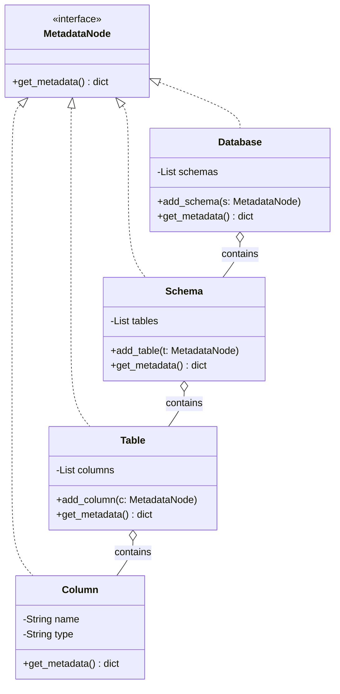

### 🔄 Sequence Diagram
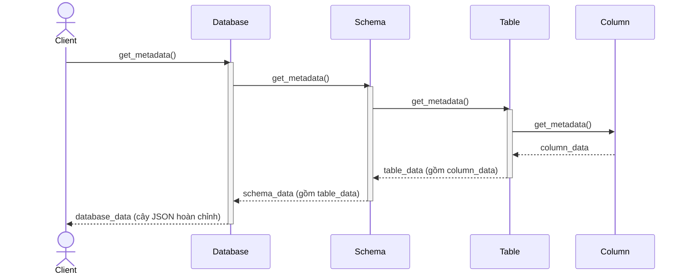

### 💻 Ví dụ Code TDD
```python
# Mọi node trong cây đều kế thừa interface này
class MetadataNode:
    def get_metadata(self): pass

# Composite (Node chứa con: Database, Schema, Table)
class Database(MetadataNode):
    def __init__(self):
        self.schemas = []
        
    def get_metadata(self):
        # Đệ quy thu thập dữ liệu của toàn bộ Schema bên trong
        return [schema.get_metadata() for schema in self.schemas]

class Schema(MetadataNode):
    def __init__(self):
        self.tables = []
        
    def get_metadata(self):
        # Đệ quy thu thập dữ liệu của toàn bộ Table bên trong
        return [table.get_metadata() for table in self.tables]
```

---

## 2. Mẫu Template Method: Constraint (🌟 Ưu tiên Cao)

*   **Tại sao chọn Template Method mà không viết hàm kiểm tra rời rạc?**
    Hệ thống có nhiều Constraint: `NotNull`, `Check`, `Unique`. Luồng kiểm tra của chúng đều giống nhau: (1) Bỏ qua nếu giá trị Null, (2) Kiểm tra logic, (3) Ném lỗi nếu sai. Nếu không dùng Template Method, bạn phải copy/paste đoạn code (1) và (3) ở khắp mọi nơi. Pattern này chốt cứng bộ khung ở lớp cha, lớp con chỉ việc viết phần logic lõi (2).

### 🧩 Class Diagram
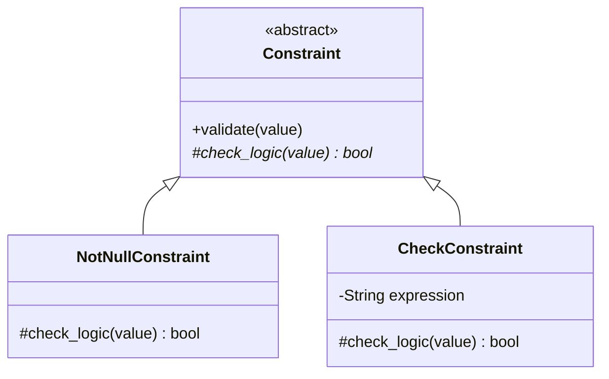

### 🔄 Sequence Diagram


### 💻 Ví dụ Code TDD
```python
class Constraint:
    def validate(self, value): # Bộ khung chốt cứng (Workflow không đổi)
        if value is None: return True
        if not self.check_logic(value): 
            raise Exception("Constraint Violation!")
            
    def check_logic(self, value): raise NotImplementedError()

class CheckConstraint(Constraint):
    def check_logic(self, value): return value > 0 # Con chỉ tập trung logic lõi
```

---

## 3. Mẫu Strategy: Referential Action (⭐ Ưu tiên Khá)

*   **Tại sao chọn Strategy mà không dùng lệnh `switch-case` khổng lồ?**
    Khi khóa chính bị xóa, khóa ngoại phản ứng bằng: `Cascade` (xóa theo), `SetNull`, hoặc `Restrict`. Dùng `if-else` trong hàm Xóa sẽ làm hàm dài nghìn dòng. Strategy cô lập hành vi "xóa theo hiệu ứng dây chuyền" vào các class riêng rẽ, nhúng qua (Dependency Injection).

### 🧩 Class Diagram
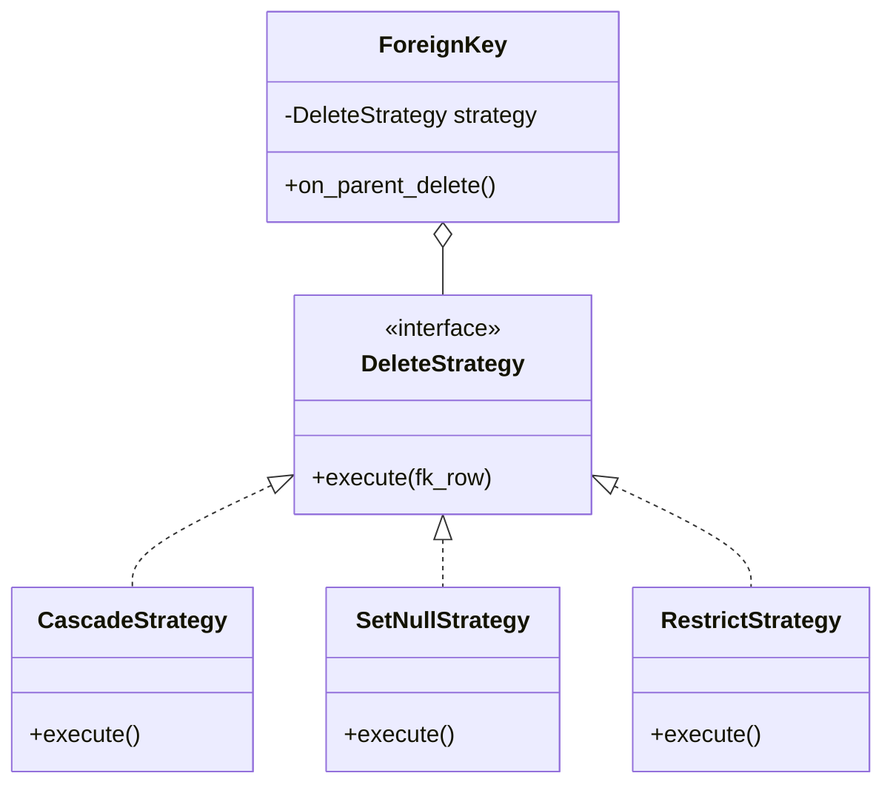

### 🔄 Sequence Diagram
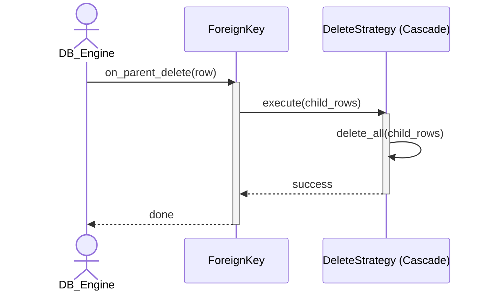

### 💻 Ví dụ Code TDD
```python
class ForeignKey:
    def __init__(self, strategy: DeleteStrategy):
        self.strategy = strategy
        
    def on_parent_delete(self, child_rows):
        self.strategy.execute(child_rows) # Gọi chiến thuật đã thiết lập
```

---

## 4. Mẫu Command: DDL Command (💡 Ưu tiên Trung bình)

*   **Tại sao chọn Command thay vì viết hàm trực tiếp?**
    Hệ thống Database cần khả năng Undo (Rollback) hoặc lưu lịch sử các lệnh thao tác (CreateTable, DropTable). Thay vì gọi hàm `database.create_table()` ngay lập tức, ta đóng gói lệnh đó thành 1 đối tượng `Command`. Đối tượng này có thể được lưu trữ, đưa vào hàng đợi, hoặc hoàn tác (undo).

### 🧩 Class Diagram
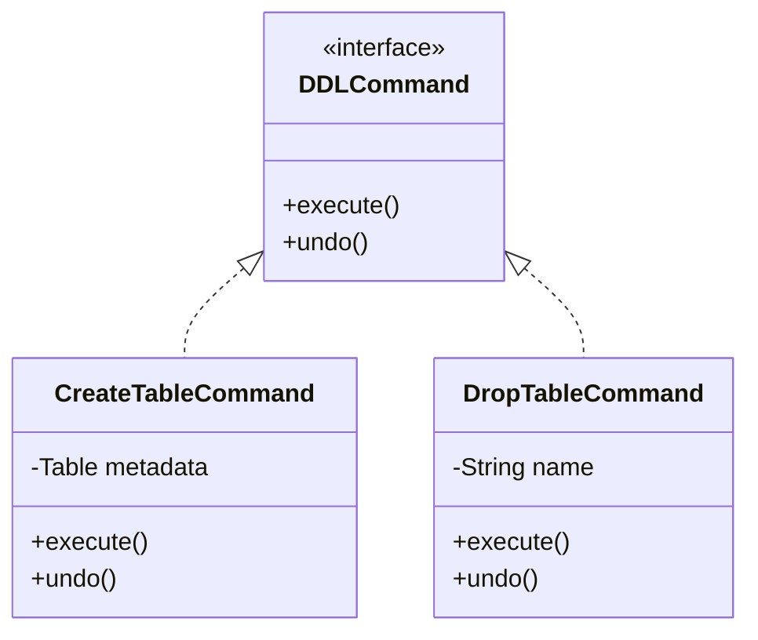

### 🔄 Sequence Diagram
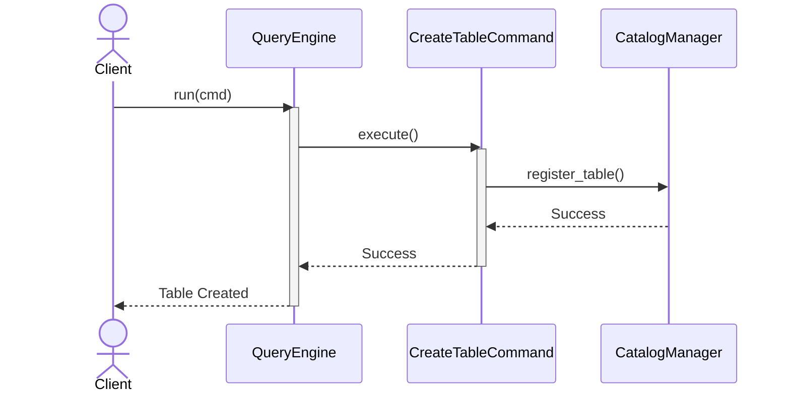

### 💻 Ví dụ Code TDD
```python
class CreateTableCommand(DDLCommand):
    def __init__(self, catalog, table_metadata):
        self.catalog = catalog
        self.table_metadata = table_metadata
        
    def execute(self):
        self.catalog.register_table(self.table_metadata)
        
    def undo(self):
        self.catalog.drop_table(self.table_metadata.name)
```

---

## 5. Mẫu Facade: DatabaseServer (🌟 Ưu tiên Cao)

*   **Tại sao chọn Facade mà không khởi tạo trực tiếp?**
    Khởi động DB yêu cầu bật BufferPool, mount DiskManager, start TransactionManager... Facade chắp vá tất cả các lệnh phức tạp này đằng sau một cái nút duy nhất `start()`, giảm hoàn toàn gánh nặng cho Client.

### 🧩 Class Diagram
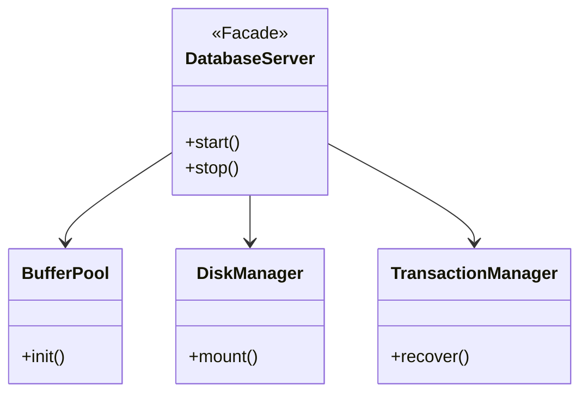

### 🔄 Sequence Diagram
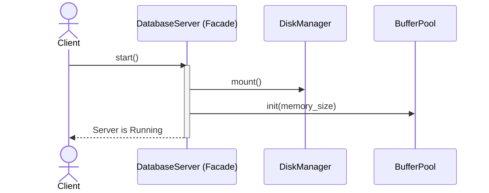

---

## 6. Mẫu State: Database Lifecycle (⭐ Ưu tiên Khá)

*   **Tại sao chọn State thay cho cờ (flag)?**
    Database có nhiều trạng thái: Offline, Online, Recovering, ReadOnly. Nếu bạn xài biến `is_online = True/False` thì code sẽ rác bởi hàng tá câu lệnh `if (state == ONLINE) do_this() else do_that()`. Mẫu State tách biệt trạng thái thành Object riêng, tự quyết định Database được làm gì ở trạng thái đó.

### 🧩 Class Diagram
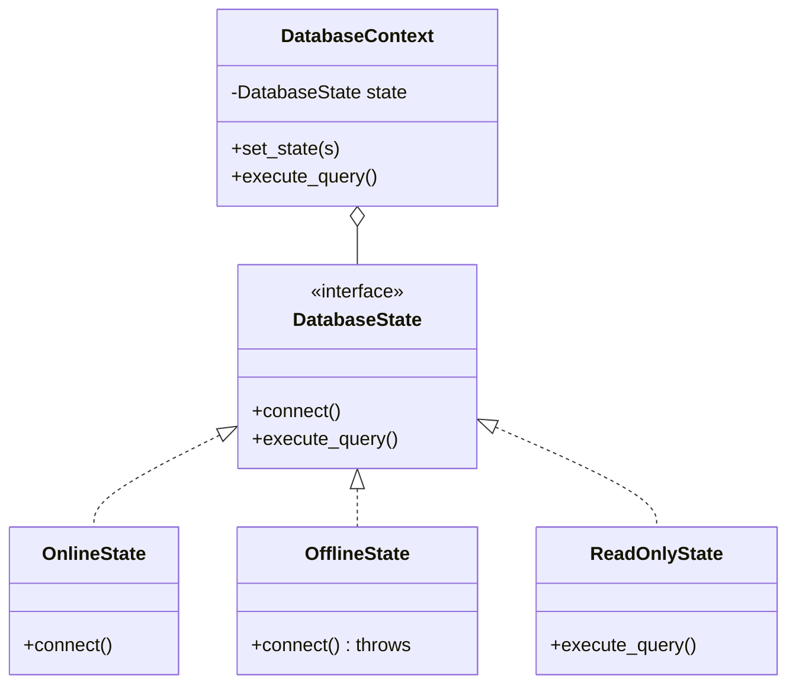

### 🔄 Sequence Diagram
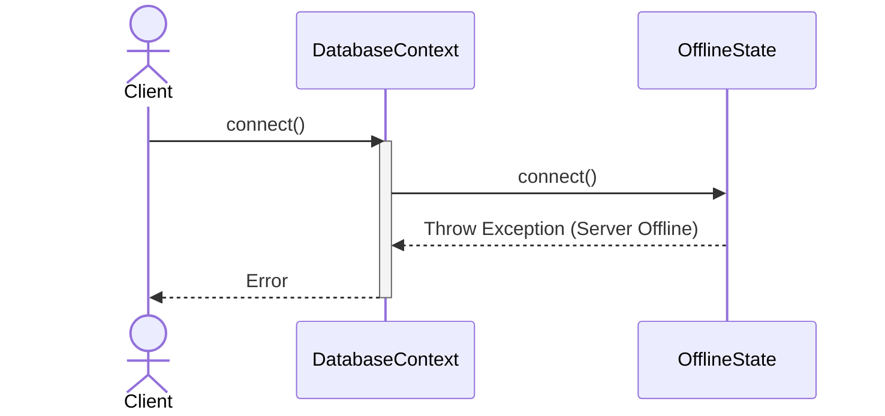

---

## 7. Mẫu Observer: Database Events (⭐ Ưu tiên Khá)

*   **Tại sao chọn Observer?**
    Hệ thống muốn gửi thông báo cho Audit, Backup System, Monitoring System mỗi khi có 1 table bị `Drop` hoặc DB bị đổi trạng thái. Broadcast sự kiện giúp các Module lắng nghe chủ động hơn.

### 🧩 Class Diagram
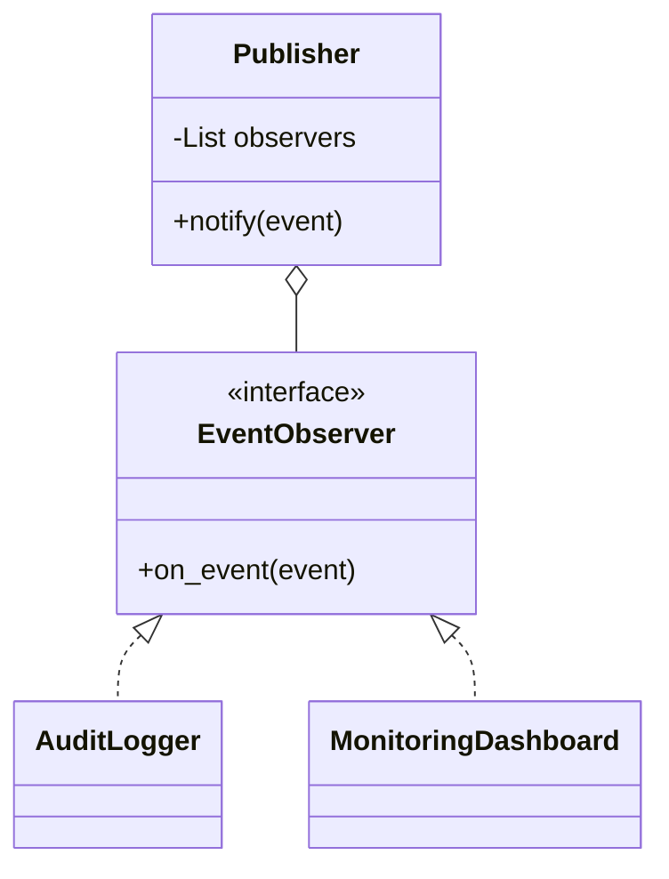

### 🔄 Sequence Diagram
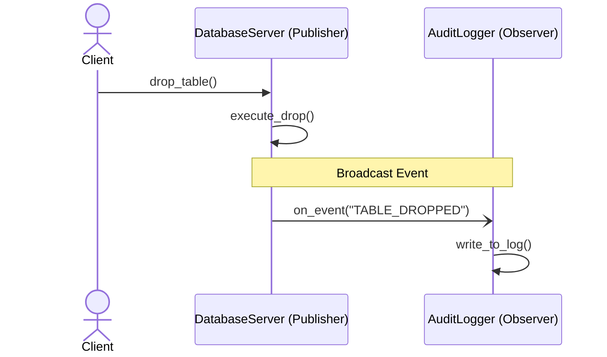

---

## 8. Mẫu Template Method: Backup/Restore (💡 Ưu tiên Trung bình)

*   **Tại sao chọn Template Method?**
    Quá trình Backup bao giờ cũng là: Khóa DB (Lock) $\rightarrow$ Đổ dữ liệu xuống đĩa (Dump) $\rightarrow$ Mở khóa DB (Unlock). `FullBackup` và `IncrementalBackup` chỉ khác nhau ở bước Đổ dữ liệu (Dump). Chốt cứng bộ khung, chỉ cho override hàm `Dump`.

### 🧩 Class Diagram
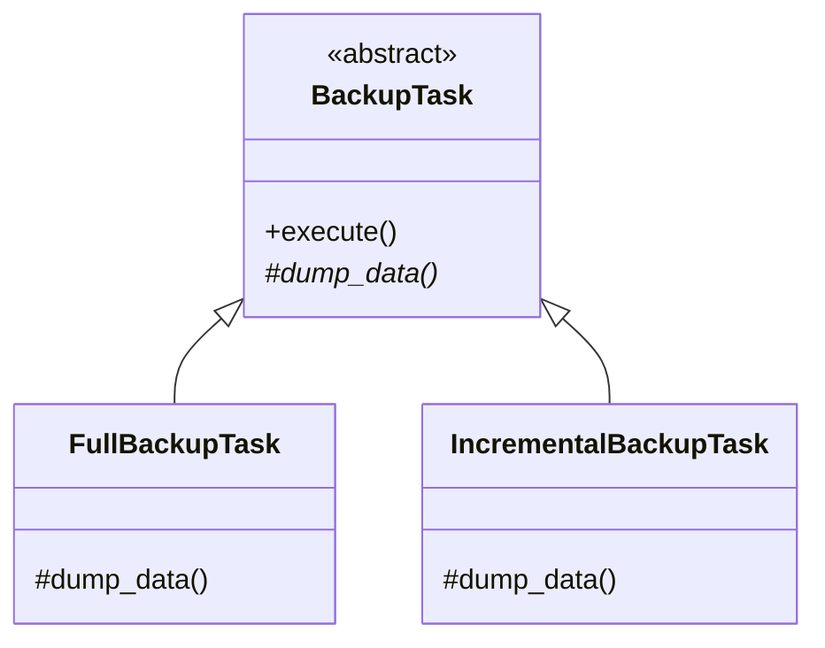

### 🔄 Sequence Diagram
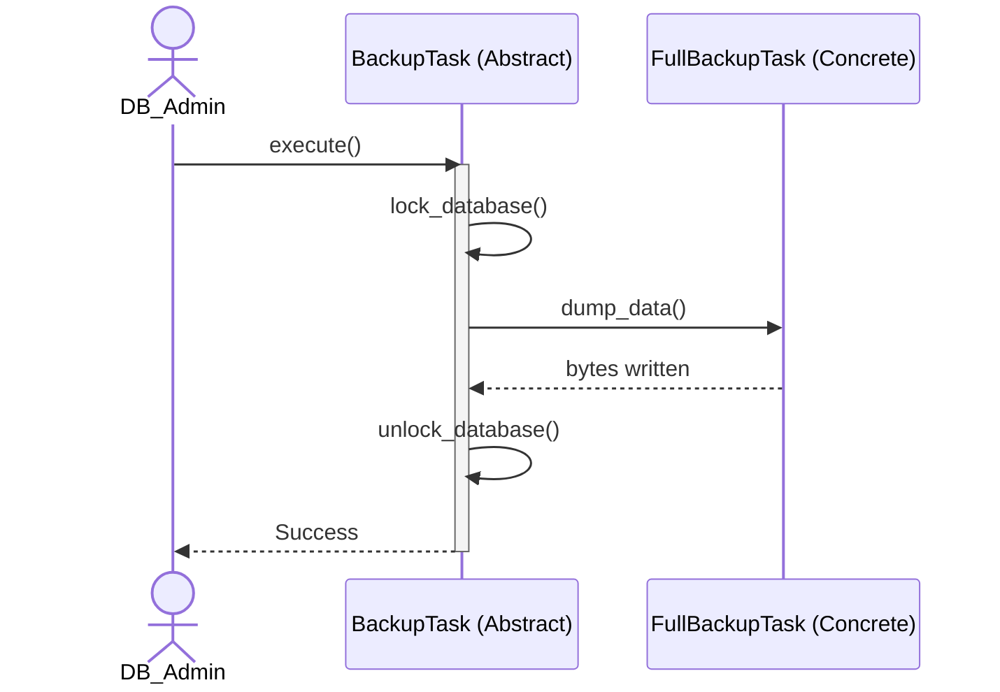
