# Design Pattern Analysis: Database Architecture

This document outlines the **12 core Gang of Four (GoF) Design Patterns** applied to the Database Management System (DBMS).

## Summary Table

| Priority | Feature | Group | Pattern Name | DBMS Use Case |
| :--- | :--- | :--- | :--- | :--- |
| Highest Priority | Global Managers | **Creational** | **1. Singleton** | Ensures core managers like TransactionManager have only one instance. |
| High Priority | Object Creation | **Creational** | **2. Factory Method** | Centralizes instantiation logic for metadata objects like Indexes. |
| High Priority | Table Construction | **Creational** | **3. Builder** | Constructs complex Table structures (columns, constraints) step-by-step. |
| Medium Priority | External Data | **Structural** | **4. Adapter** | Wraps external data sources (CSV/JSON) to implement internal Table interface. |
| High Priority | Unified Client Connection | **Structural** | **5. Facade** | Provides a simplified `DBMSClient` that hides Parser, Optimizer, and Executor. |
| Medium Priority | Dynamic Table Wrappers | **Structural** | **6. Decorator** | Dynamically wraps a Table with temporary behaviors (e.g., ReadOnlyDecorator). |
| Highest Priority | Database Objects | **Structural** | **7. Composite** | Database contains Schemas, Schema contains Tables, treated uniformly. |
| Medium High Priority | Privilege Checking | **Behavioral** | **8. Chain of Responsibility** | Passes permission checks sequentially from Database -> Schema -> Table. |
| Medium Priority | Trigger Notification | **Behavioral** | **9. Observer** | When a row changes, the Table notifies attached Triggers to execute logic. |
| Medium High Priority | Referential Action | **Behavioral** | **10. Strategy** | Selects Cascade, Restrict, SetNull behavior when deleting rows. |
| Medium Priority | DDL Commands | **Behavioral** | **11. Command** | `CreateTable`, `DropTable` operations are encapsulated into executable objects. |
| High Priority | Constraint Validation | **Behavioral** | **12. Template Method** | `Validate()` defines workflow, constraints only implement `Check()`. |


---

## 1. Singleton Pattern: Global Managers (Highest Priority)

*   **Why choose Singleton?**
    Certain components in a DBMS *must* have exactly one instance. For example, the `TransactionManager` coordinates locks. If two instances of `TransactionManager` exist, they will have conflicting lock tables, resulting in immediate data corruption and deadlocks. Singleton guarantees that a class has only one instance and provides a global point of access to it.

### Class Diagram
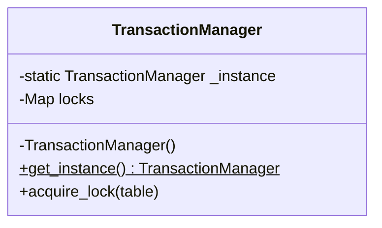
```mermaid
classDiagram
    class TransactionManager {
        -static TransactionManager _instance
        -Map locks
        -TransactionManager()
        +get_instance()$ TransactionManager
        +acquire_lock(table)
    }
```

### Sequence Diagram
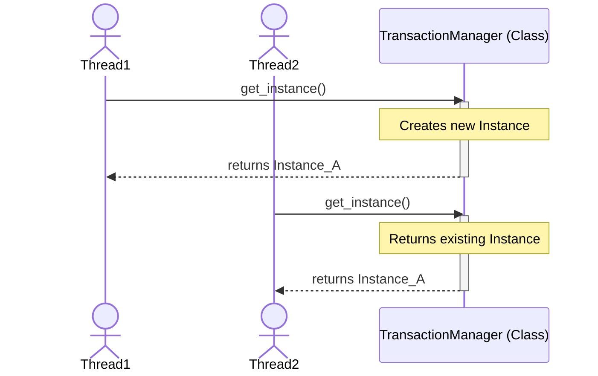
```mermaid
sequenceDiagram
    actor Thread1
    actor Thread2
    participant TM as TransactionManager (Class)
    
    Thread1->>TM: get_instance()
    activate TM
    Note over TM: Creates new Instance
    TM-->>Thread1: returns Instance_A
    deactivate TM
    
    Thread2->>TM: get_instance()
    activate TM
    Note over TM: Returns existing Instance
    TM-->>Thread2: returns Instance_A
    deactivate TM
```

### TDD Code Example
```python
import threading

class TransactionManager:
    _instance = None
    _lock = threading.Lock() # Thread-safe initialization
    
    def __new__(cls):
        with cls._lock:
            if cls._instance is None:
                print("Initializing the Global Transaction Manager...")
                cls._instance = super(TransactionManager, cls).__new__(cls)
                cls._instance.active_transactions = 0
        return cls._instance
        
    def begin_transaction(self):
        self.active_transactions += 1
        print(f"Active transactions: {self.active_transactions}")

# --- TEST CODE ---
tm1 = TransactionManager()
tm1.begin_transaction()

tm2 = TransactionManager()
tm2.begin_transaction()

print(f"Are tm1 and tm2 the exact same object? {tm1 is tm2}")
# Output:
# Initializing the Global Transaction Manager...
# Active transactions: 1
# Active transactions: 2
# Are tm1 and tm2 the exact same object? True
```

---


---

## 2. Factory Method Pattern: Object Creation (High Priority)

*   **Why choose Factory Method instead of direct instantiation (`new Index()`)?**
    In a DBMS, creating objects like Indexes, Triggers, or Partitions often depends on the specific engine configuration, the chosen algorithm (e.g., B-Tree vs Hash for indexes), and involves complex initialization (allocating disk pages, registering with catalogs). If we let the `Table` class directly instantiate `BTreeIndex` or `HashIndex` via `if/else`, the `Table` class becomes tightly coupled to specific storage implementations. Adding a new index type (like `BitmapIndex`) would require modifying the core `Table` class, violating the Open/Closed Principle.
    
    **The Factory Method Pattern Solves This By:**
    1. **Decoupling:** The `Table` class delegates the creation of the index to a Factory interface. It doesn't need to know the concrete class of the index being created.
    2. **Encapsulation of Initialization:** The Factory hides all the complex setup logic (e.g., checking memory limits, allocating storage, writing to the system catalog) in one place.
    3. **Extensibility:** To add a new index type, we simply extend the factory logic or create a new factory subclass, leaving the core `Table` operations completely untouched.

### Class Diagram
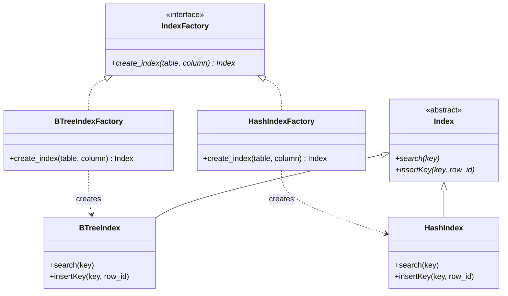
```mermaid
classDiagram
    class IndexFactory {
        <<interface>>
        +create_index(table, column)* Index
    }
    
    class BTreeIndexFactory {
        +create_index(table, column) Index
    }
    
    class HashIndexFactory {
        +create_index(table, column) Index
    }
    
    class Index {
        <<abstract>>
        +search(key)*
        +insertKey(key, row_id)*
    }
    
    class BTreeIndex {
        +search(key)
        +insertKey(key, row_id)
    }
    
    class HashIndex {
        +search(key)
        +insertKey(key, row_id)
    }

    IndexFactory <|.. BTreeIndexFactory
    IndexFactory <|.. HashIndexFactory
    BTreeIndexFactory ..> BTreeIndex : creates
    HashIndexFactory ..> HashIndex : creates
    Index <|-- BTreeIndex
    Index <|-- HashIndex
```

### Sequence Diagram
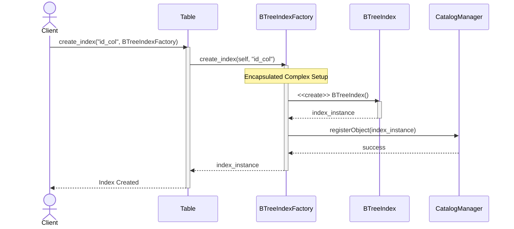
```mermaid
sequenceDiagram
    actor Client
    participant Tbl as Table
    participant Fct as BTreeIndexFactory
    participant Idx as BTreeIndex
    participant Cat as CatalogManager

    Client->>Tbl: create_index("id_col", BTreeIndexFactory)
    activate Tbl
    
    Tbl->>Fct: create_index(self, "id_col")
    activate Fct
    
    Note over Fct: Encapsulated Complex Setup
    Fct->>Idx: <<create>> BTreeIndex()
    activate Idx
    Idx-->>Fct: index_instance
    deactivate Idx
    
    Fct->>Cat: registerObject(index_instance)
    Cat-->>Fct: success
    
    Fct-->>Tbl: index_instance
    deactivate Fct
    
    Tbl-->>Client: Index Created
    deactivate Tbl
```

### TDD Code Example
```python
from abc import ABC, abstractmethod

# The Product Interface
class Index(ABC):
    @abstractmethod
    def search(self, key): pass

# Concrete Products
class BTreeIndex(Index):
    def __init__(self, table_name, column_name):
        self.type = "BTREE"
        print(f"Allocating B-Tree nodes for {table_name}.{column_name}")
        
    def search(self, key): pass

class HashIndex(Index):
    def __init__(self, table_name, column_name):
        self.type = "HASH"
        print(f"Allocating Hash buckets for {table_name}.{column_name}")
        
    def search(self, key): pass

# The Factory Interface
class IndexFactory(ABC):
    @abstractmethod
    def create_index(self, table_name, column_name) -> Index:
        pass
        
    def register_index(self, index: Index):
        # Centralized post-creation logic (e.g. catalog registration)
        print(f"Registering {index.type} index in System Catalog...")

# Concrete Factories
class BTreeIndexFactory(IndexFactory):
    def create_index(self, table_name, column_name) -> Index:
        index = BTreeIndex(table_name, column_name)
        self.register_index(index)
        return index

class HashIndexFactory(IndexFactory):
    def create_index(self, table_name, column_name) -> Index:
        index = HashIndex(table_name, column_name)
        self.register_index(index)
        return index

# --- TEST CODE ---
# The client/table decides WHICH factory to use, but depends on the interface
def create_table_index(table_name, column_name, factory: IndexFactory):
    return factory.create_index(table_name, column_name)

idx1 = create_table_index("users", "id", BTreeIndexFactory())
# Output: Allocating B-Tree nodes for users.id
# Output: Registering BTREE index in System Catalog...

idx2 = create_table_index("sessions", "token", HashIndexFactory())
# Output: Allocating Hash buckets for sessions.token
# Output: Registering HASH index in System Catalog...
```

---


---

## 3. Builder Pattern: Table Construction (High Priority)

*   **Why choose Builder instead of a massive constructor?**
    Creating a new `Table` object often requires defining a name, adding multiple columns (each with a specific type and constraints), setting a primary key, and defining foreign keys. If a constructor is used, it results in the "Telescoping Constructor Anti-Pattern" (e.g., `new Table("users", cols, pk, fks, indexes)`). The Builder pattern allows us to assemble this complex object step-by-step, making the API readable, fluent, and preventing partially initialized tables.

### Class Diagram
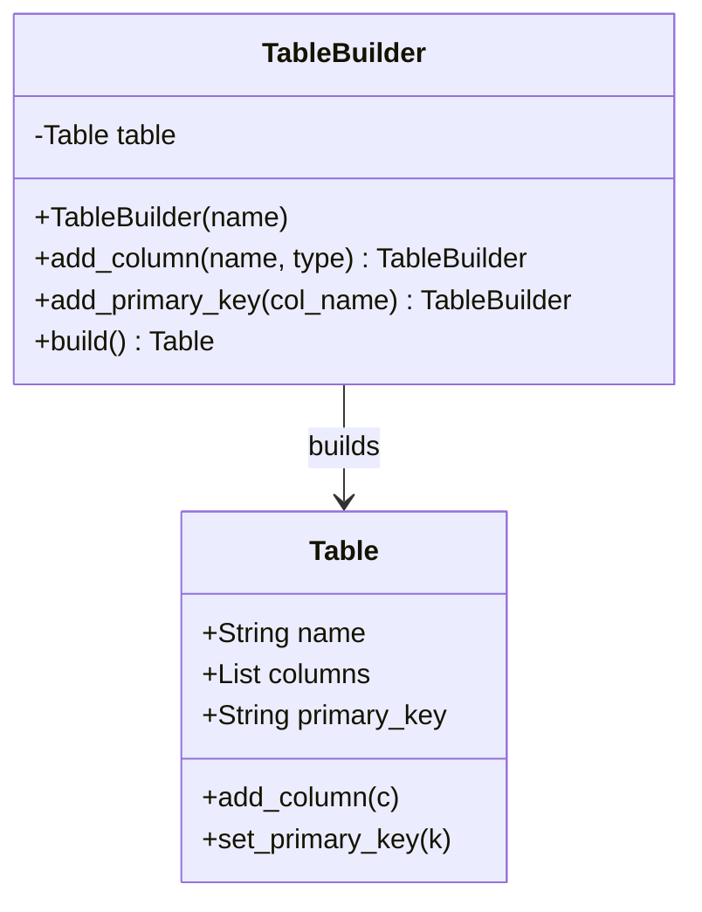
```mermaid
classDiagram
    class Table {
        +String name
        +List columns
        +String primary_key
        +add_column(c)
        +set_primary_key(k)
    }
    
    class TableBuilder {
        -Table table
        +TableBuilder(name)
        +add_column(name, type) TableBuilder
        +add_primary_key(col_name) TableBuilder
        +build() Table
    }

    TableBuilder --> Table : builds
```

### Sequence Diagram
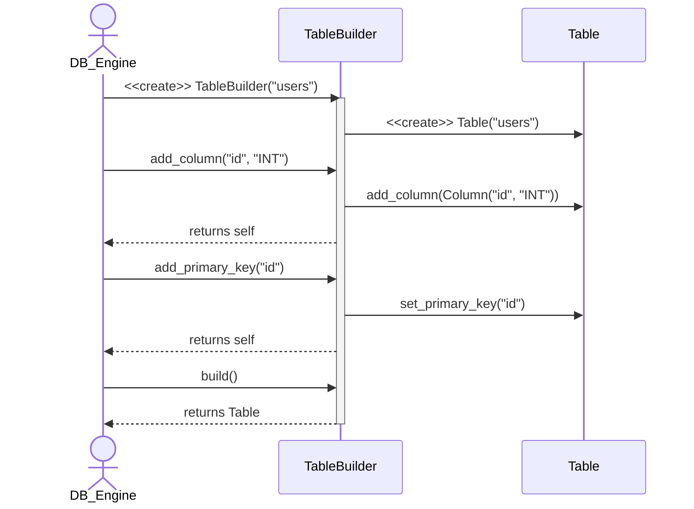
```mermaid
sequenceDiagram
    actor DB_Engine
    participant Builder as TableBuilder
    participant Tbl as Table
    
    DB_Engine->>Builder: <<create>> TableBuilder("users")
    activate Builder
    Builder->>Tbl: <<create>> Table("users")
    
    DB_Engine->>Builder: add_column("id", "INT")
    Builder->>Tbl: add_column(Column("id", "INT"))
    Builder-->>DB_Engine: returns self
    
    DB_Engine->>Builder: add_primary_key("id")
    Builder->>Tbl: set_primary_key("id")
    Builder-->>DB_Engine: returns self
    
    DB_Engine->>Builder: build()
    Builder-->>DB_Engine: returns Table
    deactivate Builder
```

### TDD Code Example
```python
class Table:
    def __init__(self, name):
        self.name = name
        self.columns = []
        self.primary_key = None
        
    def __str__(self):
        cols = ", ".join(self.columns)
        return f"Table({self.name}) [Cols: {cols} | PK: {self.primary_key}]"

class TableBuilder:
    def __init__(self, name):
        self.table = Table(name)
        
    def add_column(self, name, data_type):
        self.table.columns.append(f"{name} {data_type}")
        return self # Fluent interface
        
    def add_primary_key(self, col_name):
        self.table.primary_key = col_name
        return self
        
    def build(self):
        return self.table

# --- TEST CODE ---
builder = TableBuilder("orders")
# Fluent method chaining
orders_table = (builder
                .add_column("order_id", "INT")
                .add_column("amount", "FLOAT")
                .add_primary_key("order_id")
                .build())

print(orders_table)
# Output: Table(orders) [Cols: order_id INT, amount FLOAT | PK: order_id]
```

---


---

## 4. Adapter Pattern: External Data (Medium Priority)

*   **Why choose Adapter?**
    The SQL Query Engine is hardcoded to interact with the internal `ITable` interface (calling `get_rows()`, `get_columns()`). If we want to allow users to run SQL queries directly on an external CSV file, we can't rewrite the Query Engine. Instead, we use an Adapter to wrap the CSV reader and make it "look like" a standard Database Table to the Engine.

### Class Diagram
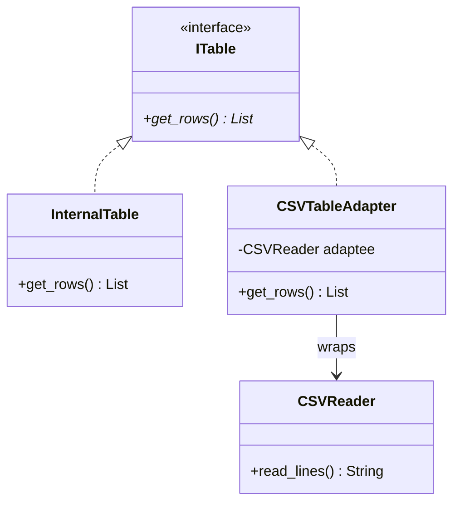
```mermaid
classDiagram
    class ITable {
        <<interface>>
        +get_rows()* List
    }
    class InternalTable {
        +get_rows() List
    }
    class CSVReader {
        +read_lines() String
    }
    class CSVTableAdapter {
        -CSVReader adaptee
        +get_rows() List
    }
    
    ITable <|.. InternalTable
    ITable <|.. CSVTableAdapter
    CSVTableAdapter --> CSVReader : wraps
```

### Sequence Diagram
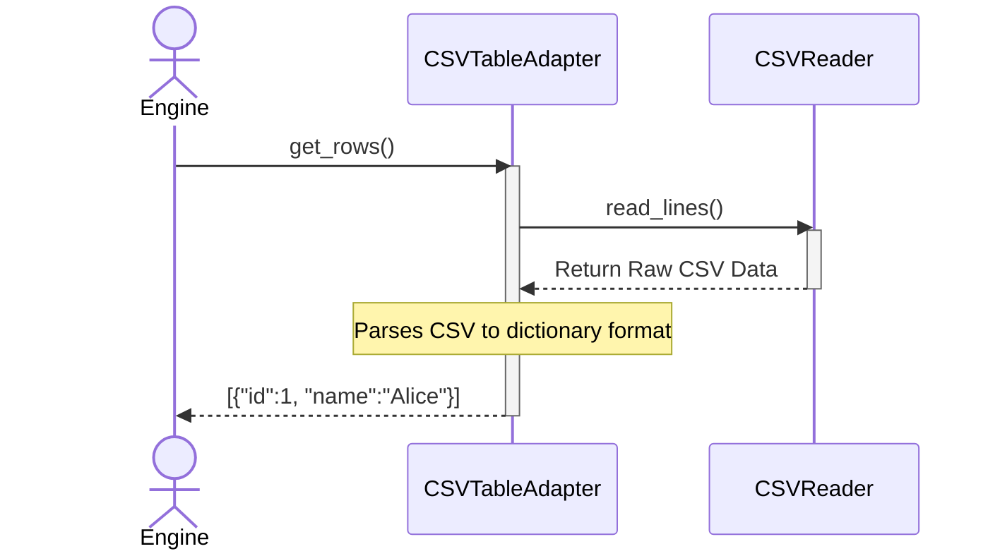
```mermaid
sequenceDiagram
    actor Engine
    participant Adapter as CSVTableAdapter
    participant Reader as CSVReader
    
    Engine->>Adapter: get_rows()
    activate Adapter
    Adapter->>Reader: read_lines()
    activate Reader
    Reader-->>Adapter: Return Raw CSV Data
    deactivate Reader
    Note over Adapter: Parses CSV to dictionary format
    Adapter-->>Engine: [{"id":1, "name":"Alice"}]
    deactivate Adapter
```

### TDD Code Example
```python
# The Target Interface that the Engine expects
class ITable:
    def get_rows(self): pass

# The Incompatible External Library/System
class CSVReader:
    def __init__(self, filename):
        self.filename = filename
    def read_lines(self):
        return ["1,Alice", "2,Bob"] # Simulated raw CSV text

# The Adapter
class CSVTableAdapter(ITable):
    def __init__(self, filename):
        self.adaptee = CSVReader(filename)
        
    def get_rows(self):
        raw_lines = self.adaptee.read_lines()
        parsed_rows = []
        for line in raw_lines:
            parts = line.split(',')
            parsed_rows.append({"id": int(parts[0]), "name": parts[1]})
        return parsed_rows

# --- TEST CODE ---
# The Engine is completely oblivious to the fact it's reading a CSV
def execute_select_all(table: ITable):
    print("Executing SELECT * ...")
    for row in table.get_rows():
        print(f"Row: {row}")

csv_table = CSVTableAdapter("data.csv")
execute_select_all(csv_table)
# Output:
# Executing SELECT * ...
# Row: {'id': 1, 'name': 'Alice'}
# Row: {'id': 2, 'name': 'Bob'}
```

---


---

## 5. Facade Pattern: Unified Client Connection (High Priority)

*   **Why choose Facade?**
    Executing a simple SQL query internally requires coordinating dozens of complex subsystems: The Lexer, Parser, AST Builder, Query Optimizer, Execution Engine, and Storage Manager. Forcing an external application (like a Python or Java backend) to interact with all these subsystems directly is a nightmare. Facade provides a single, unified `DBMSClient` class with a simple `execute(query)` method, completely hiding the internal orchestration.

### Class Diagram
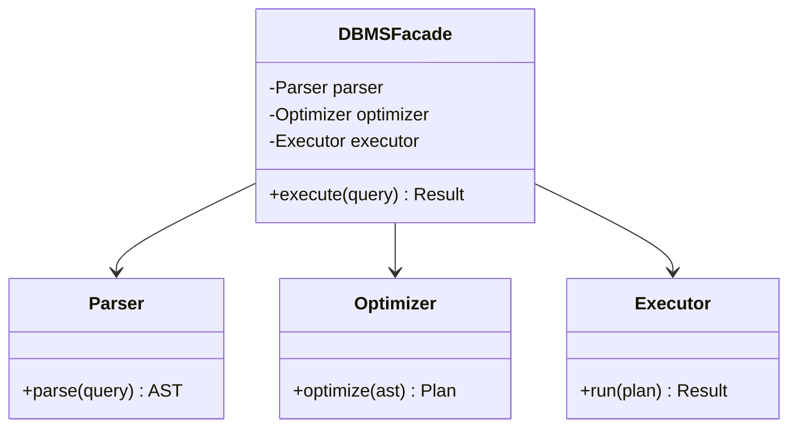
```mermaid
classDiagram
    class DBMSFacade {
        -Parser parser
        -Optimizer optimizer
        -Executor executor
        +execute(query) Result
    }
    
    class Parser { +parse(query) AST }
    class Optimizer { +optimize(ast) Plan }
    class Executor { +run(plan) Result }
    
    DBMSFacade --> Parser
    DBMSFacade --> Optimizer
    DBMSFacade --> Executor
```

### Sequence Diagram
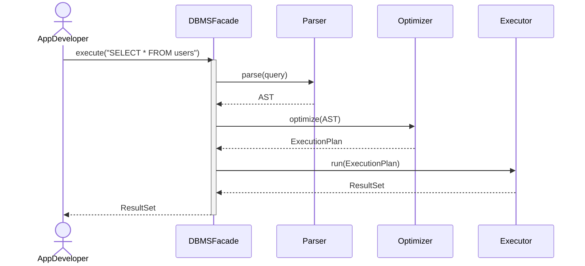
```mermaid
sequenceDiagram
    actor AppDeveloper
    participant Facade as DBMSFacade
    participant P as Parser
    participant O as Optimizer
    participant E as Executor
    
    AppDeveloper->>Facade: execute("SELECT * FROM users")
    activate Facade
    Facade->>P: parse(query)
    P-->>Facade: AST
    Facade->>O: optimize(AST)
    O-->>Facade: ExecutionPlan
    Facade->>E: run(ExecutionPlan)
    E-->>Facade: ResultSet
    Facade-->>AppDeveloper: ResultSet
    deactivate Facade
```

### TDD Code Example
```python
# --- Complex Internal Subsystems ---
class Parser:
    def parse(self, sql):
        print("Parser: Breaking SQL into tokens and building AST...")
        return {"type": "SELECT", "table": "users"}

class Optimizer:
    def optimize(self, ast):
        print("Optimizer: Finding best execution path (Index Scan vs Full Scan)...")
        return "Plan(IndexScan on users)"

class Executor:
    def run(self, plan):
        print(f"Executor: Running {plan}...")
        return [{"id": 1, "name": "Alice"}]

# --- The Facade ---
class DBMSFacade:
    def __init__(self):
        # Initializes the complex web of subsystems
        self.parser = Parser()
        self.optimizer = Optimizer()
        self.executor = Executor()
        
    def execute(self, sql_query):
        print(f"--- Facade received query: '{sql_query}' ---")
        ast = self.parser.parse(sql_query)
        plan = self.optimizer.optimize(ast)
        result = self.executor.run(plan)
        return result

# --- TEST CODE ---
# The App Developer's code is extremely clean!
db = DBMSFacade()
rows = db.execute("SELECT * FROM users")
print(f"Result: {rows}")
# Output:
# --- Facade received query: 'SELECT * FROM users' ---
# Parser: Breaking SQL into tokens and building AST...
# Optimizer: Finding best execution path (Index Scan vs Full Scan)...
# Executor: Running Plan(IndexScan on users)...
# Result: [{'id': 1, 'name': 'Alice'}]
```

---


---

## 6. Decorator Pattern: Dynamic Table Wrappers (Medium Priority)

*   **Why choose Decorator?**
    Sometimes we need to add temporary responsibilities to a Table without modifying its underlying class or affecting other instances. For example, during a live database backup, a specific table needs to be strictly Read-Only. Using inheritance (`ReadOnlyTable`) is static and inflexible. The Decorator pattern allows us to wrap the original `Table` object dynamically at runtime with a `ReadOnlyDecorator`, intercepting calls to `insert()` or `update()`.

### Class Diagram
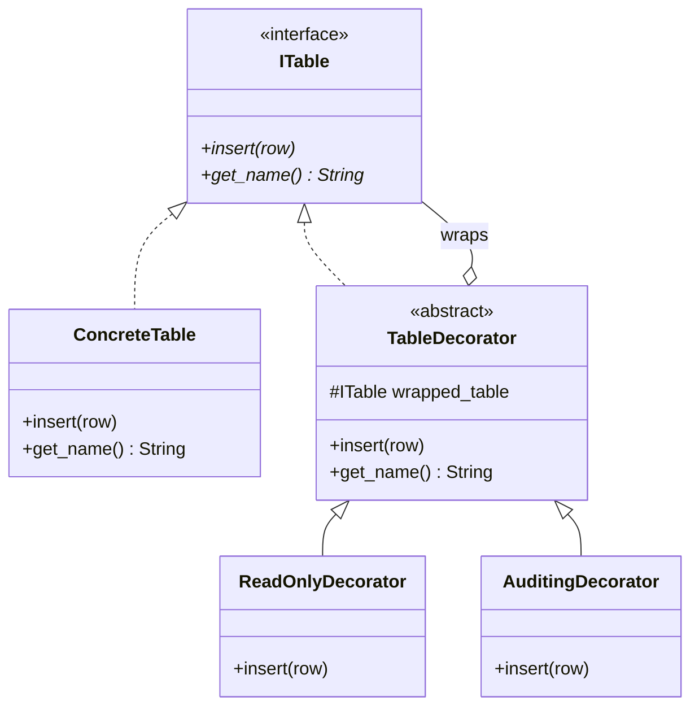
```mermaid
classDiagram
    class ITable {
        <<interface>>
        +insert(row)*
        +get_name()* String
    }
    class ConcreteTable {
        +insert(row)
        +get_name() String
    }
    
    class TableDecorator {
        <<abstract>>
        #ITable wrapped_table
        +insert(row)
        +get_name() String
    }
    class ReadOnlyDecorator {
        +insert(row)
    }
    class AuditingDecorator {
        +insert(row)
    }
    
    ITable <|.. ConcreteTable
    ITable <|.. TableDecorator
    TableDecorator o-- ITable : wraps
    TableDecorator <|-- ReadOnlyDecorator
    TableDecorator <|-- AuditingDecorator
```

### Sequence Diagram
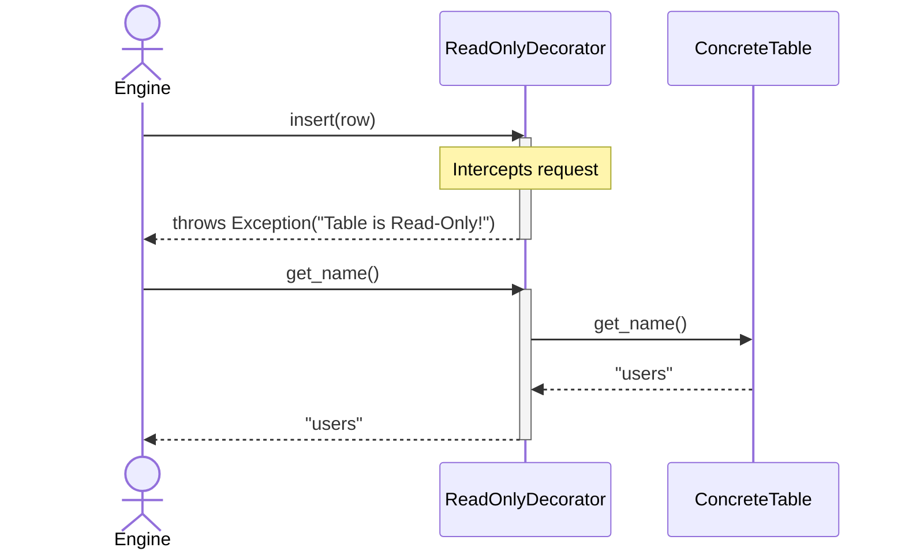
```mermaid
sequenceDiagram
    actor Engine
    participant Dec as ReadOnlyDecorator
    participant Tbl as ConcreteTable
    
    Engine->>Dec: insert(row)
    activate Dec
    Note over Dec: Intercepts request
    Dec-->>Engine: throws Exception("Table is Read-Only!")
    deactivate Dec
    
    Engine->>Dec: get_name()
    activate Dec
    Dec->>Tbl: get_name()
    Tbl-->>Dec: "users"
    Dec-->>Engine: "users"
    deactivate Dec
```

### TDD Code Example
```python
from abc import ABC, abstractmethod

class ITable(ABC):
    @abstractmethod
    def insert(self, row): pass
    @abstractmethod
    def get_name(self): pass

class ConcreteTable(ITable):
    def __init__(self, name):
        self.name = name
    def insert(self, row):
        print(f"Table '{self.name}': Successfully inserted {row}")
    def get_name(self):
        return self.name

# Base Decorator
class TableDecorator(ITable):
    def __init__(self, table: ITable):
        self.wrapped = table
    def insert(self, row):
        self.wrapped.insert(row)
    def get_name(self):
        return self.wrapped.get_name()

# Concrete Decorators
class ReadOnlyDecorator(TableDecorator):
    def insert(self, row):
        raise PermissionError(f"DENIED: Table '{self.get_name()}' is currently in READ-ONLY mode (e.g., backing up).")

class AuditingDecorator(TableDecorator):
    def insert(self, row):
        print(f"[SECURITY AUDIT] Attempting to insert into {self.get_name()}...")
        super().insert(row)
        print(f"[SECURITY AUDIT] Insert completed.")

# --- TEST CODE ---
original_table = ConcreteTable("employees")

# Wrap with Audit
audited_table = AuditingDecorator(original_table)
audited_table.insert({"id": 1, "name": "Bob"})
# Output:
# [SECURITY AUDIT] Attempting to insert into employees...
# Table 'employees': Successfully inserted {'id': 1, 'name': 'Bob'}
# [SECURITY AUDIT] Insert completed.

# Suddenly, a backup starts! Wrap the audited table with Read-Only
locked_table = ReadOnlyDecorator(audited_table)

try:
    locked_table.insert({"id": 2, "name": "Alice"})
except Exception as e:
    print(e)
# Output:
# DENIED: Table 'employees' is currently in READ-ONLY mode (e.g., backing up).
```

---


---

## 7. Composite Pattern: Database Objects (Highest Priority)

*   **Why choose Composite instead of discrete `Lists` or rigid hierarchies?**
    In a DBMS, metadata is naturally hierarchical: A Database contains multiple Schemas, a Schema contains multiple Tables/Views, and a Table contains multiple Columns and Constraints. If we model this using rigid, separate lists (e.g., `List<Table>`, `List<View>`, `List<Constraint>`), we face significant challenges when performing system-wide operations like calculating total storage size, generating a comprehensive DDL export, or traversing the object tree.
    
    Without the Composite pattern, traversing this hierarchy requires tightly coupled code with multiple nested `for` loops and type-checking (e.g., `if (obj instanceof Table)`). 
    
    **The Composite Pattern Solves This By:**
    1. **Uniformity:** It introduces a common interface (`MetadataNode`) for both leaf nodes (Columns, Constraints - which have no children) and composite branches (Database, Schema, Table - which contain children).
    2. **Recursive Traversal:** Operations like `get_metadata()` are delegated down the tree. The client only needs to call `get_metadata()` on the root `Database` object, and the request automatically propagates down to the lowest `Column` or `Constraint` level via recursion.
    3. **Extensibility:** If we later introduce new metadata objects like `Trigger` or `Index`, we simply implement the `MetadataNode` interface. The core traversal logic remains entirely untouched, adhering perfectly to the Open/Closed Principle (OCP).

### Class Diagram
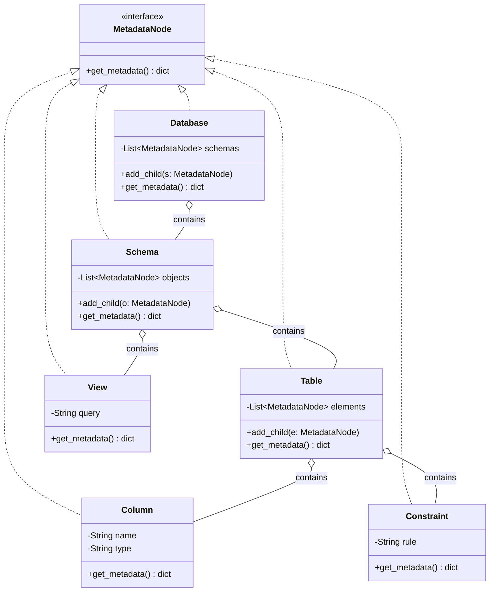
```mermaid
classDiagram
    class MetadataNode {
        <<interface>>
        +get_metadata() dict
    }
    
    class Database {
        -List~MetadataNode~ schemas
        +add_child(s: MetadataNode)
        +get_metadata() dict
    }
    
    class Schema {
        -List~MetadataNode~ objects
        +add_child(o: MetadataNode)
        +get_metadata() dict
    }
    
    class Table {
        -List~MetadataNode~ elements
        +add_child(e: MetadataNode)
        +get_metadata() dict
    }
    
    class View {
        -String query
        +get_metadata() dict
    }
    
    class Column {
        -String name
        -String type
        +get_metadata() dict
    }
    
    class Constraint {
        -String rule
        +get_metadata() dict
    }

    MetadataNode <|.. Database
    MetadataNode <|.. Schema
    MetadataNode <|.. Table
    MetadataNode <|.. View
    MetadataNode <|.. Column
    MetadataNode <|.. Constraint
    
    Database o-- Schema : contains
    Schema o-- Table : contains
    Schema o-- View : contains
    Table o-- Column : contains
    Table o-- Constraint : contains
```

### Sequence Diagram
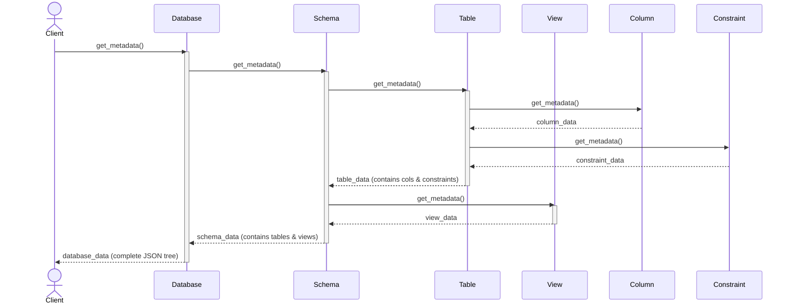
```mermaid
sequenceDiagram
    actor Client
    participant DB as Database
    participant Sch as Schema
    participant Tbl as Table
    participant Vw as View
    participant Col as Column
    participant Cst as Constraint

    Client->>DB: get_metadata()
    activate DB
    
    DB->>Sch: get_metadata()
    activate Sch
    
    %% Processing Table branch
    Sch->>Tbl: get_metadata()
    activate Tbl
    Tbl->>Col: get_metadata()
    Col-->>Tbl: column_data
    Tbl->>Cst: get_metadata()
    Cst-->>Tbl: constraint_data
    Tbl-->>Sch: table_data (contains cols & constraints)
    deactivate Tbl
    
    %% Processing View branch
    Sch->>Vw: get_metadata()
    activate Vw
    Vw-->>Sch: view_data
    deactivate Vw
    
    Sch-->>DB: schema_data (contains tables & views)
    deactivate Sch
    
    DB-->>Client: database_data (complete JSON tree)
    deactivate DB
```

### TDD Code Example
```python
# All nodes in the tree inherit this interface
class MetadataNode:
    def get_metadata(self): pass

# Composite (Nodes containing children)
class Database(MetadataNode):
    def __init__(self): self.children = []
    def add_child(self, child: MetadataNode): self.children.append(child)
    def get_metadata(self):
        return {"type": "Database", "children": [c.get_metadata() for c in self.children]}

class Schema(MetadataNode):
    def __init__(self): self.children = []
    def add_child(self, child: MetadataNode): self.children.append(child)
    def get_metadata(self):
        return {"type": "Schema", "children": [c.get_metadata() for c in self.children]}

class Table(MetadataNode):
    def __init__(self, name): 
        self.name = name
        self.children = []
    def add_child(self, child: MetadataNode): self.children.append(child)
    def get_metadata(self):
        return {"type": "Table", "name": self.name, "children": [c.get_metadata() for c in self.children]}

# Leaf Nodes (No children)
class View(MetadataNode):
    def __init__(self, name): self.name = name
    def get_metadata(self): return {"type": "View", "name": self.name}

class Column(MetadataNode):
    def __init__(self, name, col_type): 
        self.name = name
        self.col_type = col_type
    def get_metadata(self): return {"type": "Column", "name": self.name, "col_type": self.col_type}

class Constraint(MetadataNode):
    def __init__(self, rule): self.rule = rule
    def get_metadata(self): return {"type": "Constraint", "rule": self.rule}

# --- TEST CODE ---
db = Database()
schema = Schema()
table = Table("Users")
table.add_child(Column("id", "INT"))
table.add_child(Constraint("PRIMARY KEY (id)"))

schema.add_child(table)
schema.add_child(View("ActiveUsers"))
db.add_child(schema)

# One call recursively builds the entire tree
import json
print(json.dumps(db.get_metadata(), indent=2))
```

---


---

## 8. Chain of Responsibility Pattern: Privilege Checking (Medium High Priority)

*   **Why choose Chain of Responsibility instead of massive `if/else` checks?**
    In a DBMS, checking if a user has permission to execute a query (like `SELECT * FROM schema.table`) is highly layered. The database engine must sequentially check:
    1. Does the user have access to the Database?
    2. Does the user have access to the Schema?
    3. Does the user have `SELECT` privilege on the Table?
    4. (Optional) Does the user have access to specific Columns (Column-Level Security)?
    
    If we hardcode this in a single `SecurityManager` class with nested `if/else`, the code becomes incredibly bloated and brittle. Adding a new security layer (e.g., Row-Level Security or IP Address restrictions) would force us to modify the core security engine, violating the Open/Closed Principle.

    **The Chain of Responsibility Pattern Solves This By:**
    1. **Decoupling:** Each security check is encapsulated into its own distinct, lightweight Handler class (`DatabasePrivilegeHandler`, `SchemaPrivilegeHandler`).
    2. **Sequential Chaining:** Handlers are linked together. The request passes through the chain one by one. If one handler denies access, it breaks the chain immediately and throws a "Permission Denied" error. If it allows access, it automatically passes the request to the next handler.
    3. **Dynamic Configuration:** You can dynamically insert or remove security layers at runtime (e.g., enabling Column-Level Security only for the Enterprise edition) simply by rearranging the chain, without altering any core logic.

### Class Diagram
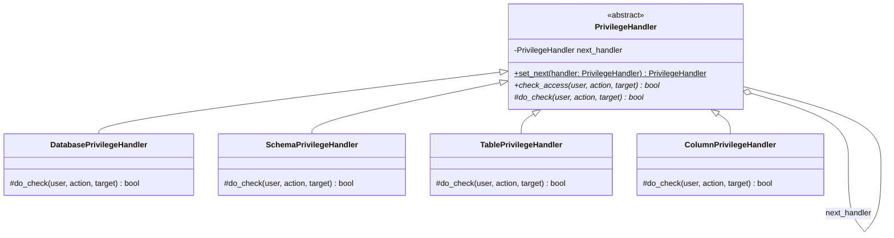
```mermaid
classDiagram
    class PrivilegeHandler {
        <<abstract>>
        -PrivilegeHandler next_handler
        +set_next(handler: PrivilegeHandler)$ PrivilegeHandler
        +check_access(user, action, target)* bool
        #do_check(user, action, target)* bool
    }
    
    class DatabasePrivilegeHandler {
        #do_check(user, action, target) bool
    }
    
    class SchemaPrivilegeHandler {
        #do_check(user, action, target) bool
    }
    
    class TablePrivilegeHandler {
        #do_check(user, action, target) bool
    }
    
    class ColumnPrivilegeHandler {
        #do_check(user, action, target) bool
    }

    PrivilegeHandler o-- PrivilegeHandler : next_handler
    PrivilegeHandler <|-- DatabasePrivilegeHandler
    PrivilegeHandler <|-- SchemaPrivilegeHandler
    PrivilegeHandler <|-- TablePrivilegeHandler
    PrivilegeHandler <|-- ColumnPrivilegeHandler
```

### Sequence Diagram
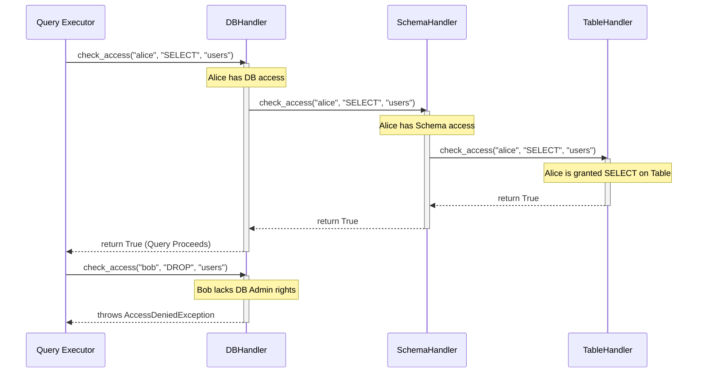
```mermaid
sequenceDiagram
    participant Client as Query Executor
    participant DB as DBHandler
    participant Sch as SchemaHandler
    participant Tbl as TableHandler
    
    Client->>DB: check_access("alice", "SELECT", "users")
    activate DB
    Note over DB: Alice has DB access
    
    DB->>Sch: check_access("alice", "SELECT", "users")
    activate Sch
    Note over Sch: Alice has Schema access
    
    Sch->>Tbl: check_access("alice", "SELECT", "users")
    activate Tbl
    Note over Tbl: Alice is granted SELECT on Table
    Tbl-->>Sch: return True
    deactivate Tbl
    
    Sch-->>DB: return True
    deactivate Sch
    
    DB-->>Client: return True (Query Proceeds)
    deactivate DB
    
    %% Example of Failure
    Client->>DB: check_access("bob", "DROP", "users")
    activate DB
    Note over DB: Bob lacks DB Admin rights
    DB-->>Client: throws AccessDeniedException
    deactivate DB
```

### TDD Code Example
```python
class AccessDeniedException(Exception):
    pass

class PrivilegeHandler:
    def __init__(self):
        self.next_handler = None
        
    def set_next(self, handler):
        self.next_handler = handler
        return handler # Allows method chaining
        
    def check_access(self, user, action, target):
        # 1. Execute the specific check for this layer
        if not self.do_check(user, action, target):
            raise AccessDeniedException(f"Access Denied at {self.__class__.__name__} for user '{user}'")
        
        # 2. If passed and there's a next handler, delegate down the chain
        if self.next_handler:
            return self.next_handler.check_access(user, action, target)
        
        # 3. If passed and no more handlers, access is fully granted
        return True 
        
    def do_check(self, user, action, target):
        raise NotImplementedError()

# Concrete Handlers
class DatabasePrivilegeHandler(PrivilegeHandler):
    def do_check(self, user, action, target):
        # Business logic: Only 'admin' can perform DROP operations
        if action == "DROP" and user != "admin": return False
        return True

class SchemaPrivilegeHandler(PrivilegeHandler):
    def do_check(self, user, action, target):
        # Business logic: 'guest' users have no access to underlying schemas
        return user != "guest"

class TablePrivilegeHandler(PrivilegeHandler):
    def do_check(self, user, action, target):
        # Business logic: 'alice' has SELECT rights, but no UPDATE rights
        if user == "alice" and action == "UPDATE": return False
        return True

# --- TEST CODE ---
# 1. Build the Security Chain dynamically
security_chain = DatabasePrivilegeHandler()
security_chain.set_next(SchemaPrivilegeHandler()).set_next(TablePrivilegeHandler())

# 2. Test Cases
# Test A: Alice tries to SELECT (Passes all 3 layers)
print(security_chain.check_access("alice", "SELECT", "users")) # Output: True

# Test B: Alice tries to UPDATE (Fails at Layer 3: TablePrivilegeHandler)
try:
    security_chain.check_access("alice", "UPDATE", "users")
except Exception as e:
    print(e) # Output: Access Denied at TablePrivilegeHandler for user 'alice'

# Test C: Bob tries to DROP (Fails immediately at Layer 1: DatabasePrivilegeHandler)
try:
    security_chain.check_access("bob", "DROP", "users")
except Exception as e:
    print(e) # Output: Access Denied at DatabasePrivilegeHandler for user 'bob'
```

---


---

## 9. Observer Pattern: Trigger Notification (Medium Priority)

*   **Why choose Observer instead of hardcoding trigger logic inside `Table.insert()`?**
    Database Triggers are custom logic executed automatically when a table undergoes an `INSERT`, `UPDATE`, or `DELETE`. If a `Table` class explicitly calls `AuditLog.write()` or `NotificationService.send()` whenever a row is inserted, the `Table` becomes tightly coupled to arbitrary services and violates the Single Responsibility Principle.
    
    **The Observer Pattern Solves This By:**
    1. **Loose Coupling:** The `Table` acts as a Subject. It maintains a list of `Trigger` observers. It doesn't know what the triggers do.
    2. **Dynamic Subscription:** Triggers can be dynamically attached (created) or detached (dropped) at runtime via `attach()` and `detach()`.
    3. **Event Broadcasting:** When `Table.insert()` finishes, it simply iterates through its observers and calls `trigger.update(row_data)`.

### Class Diagram
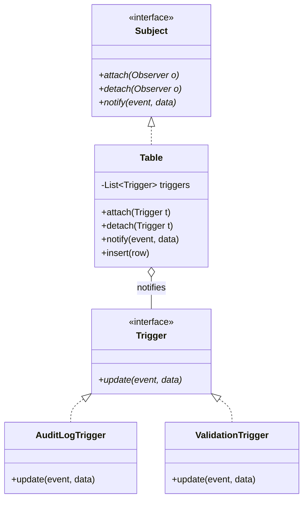
```mermaid
classDiagram
    class Subject {
        <<interface>>
        +attach(Observer o)*
        +detach(Observer o)*
        +notify(event, data)*
    }
    
    class Table {
        -List~Trigger~ triggers
        +attach(Trigger t)
        +detach(Trigger t)
        +notify(event, data)
        +insert(row)
    }
    
    class Trigger {
        <<interface>>
        +update(event, data)*
    }
    
    class AuditLogTrigger {
        +update(event, data)
    }
    
    class ValidationTrigger {
        +update(event, data)
    }

    Subject <|.. Table
    Trigger <|.. AuditLogTrigger
    Trigger <|.. ValidationTrigger
    Table o-- Trigger : notifies
```

### Sequence Diagram
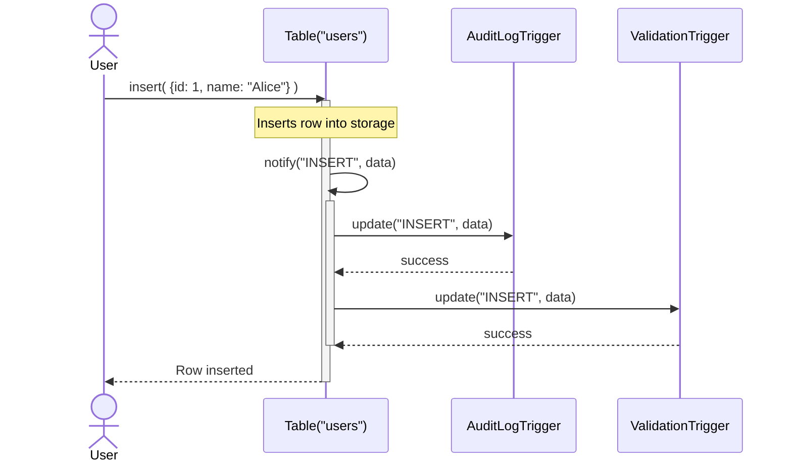
```mermaid
sequenceDiagram
    actor User
    participant Tbl as Table("users")
    participant Aud as AuditLogTrigger
    participant Val as ValidationTrigger

    User->>Tbl: insert( {id: 1, name: "Alice"} )
    activate Tbl
    
    Note over Tbl: Inserts row into storage
    
    Tbl->>Tbl: notify("INSERT", data)
    activate Tbl
    
    Tbl->>Aud: update("INSERT", data)
    Aud-->>Tbl: success
    
    Tbl->>Val: update("INSERT", data)
    Val-->>Tbl: success
    
    deactivate Tbl
    
    Tbl-->>User: Row inserted
    deactivate Tbl
```

### TDD Code Example
```python
from abc import ABC, abstractmethod

# The Observer Interface
class Trigger(ABC):
    @abstractmethod
    def update(self, event_type, row_data): pass

# Concrete Observers
class AuditLogTrigger(Trigger):
    def update(self, event_type, row_data):
        print(f"[AUDIT LOG] Recorded {event_type} operation with data: {row_data}")

class ValidationTrigger(Trigger):
    def update(self, event_type, row_data):
        if event_type == "INSERT" and "email" not in row_data:
            print(f"[VALIDATION] Warning: Inserted row is missing an email field!")

# The Subject
class Table:
    def __init__(self, name):
        self.name = name
        self.triggers = [] # List of observers
        
    def attach(self, trigger: Trigger):
        self.triggers.append(trigger)
        
    def detach(self, trigger: Trigger):
        self.triggers.remove(trigger)
        
    def notify(self, event_type, row_data):
        # Broadcast to all attached observers
        for trigger in self.triggers:
            trigger.update(event_type, row_data)
            
    def insert(self, row_data):
        print(f"\nTable '{self.name}': Inserting row {row_data} into storage...")
        # (Storage logic goes here)
        
        # Notify observers that an insert happened
        self.notify("INSERT", row_data)

# --- TEST CODE ---
users_table = Table("users")

# Create triggers (Observers)
audit_trigger = AuditLogTrigger()
val_trigger = ValidationTrigger()

# Attach triggers to the table (Subscription)
users_table.attach(audit_trigger)
users_table.attach(val_trigger)

# Perform operation
users_table.insert({"id": 1, "name": "Alice", "email": "alice@gmail.com"})

users_table.insert({"id": 2, "name": "Bob"})

```


---


---

## 10. Strategy Pattern: Referential Action (Medium High Priority)

*   **Why choose Strategy instead of massive `switch/case` inside `ForeignKey`?**
    When a referenced row in a parent table is deleted or updated, a Foreign Key constraint must enforce referential integrity. Standard SQL allows several actions: `CASCADE` (delete child rows), `RESTRICT` (block the deletion), `SET NULL` (nullify child keys), and `SET DEFAULT`. 
    If we put all these behaviors into a single `on_violation()` method inside the `ForeignKey` class with a giant `if/elif/else` block, the class becomes bloated. Testing each cascading behavior in isolation also becomes difficult.

    **The Strategy Pattern Solves This By:**
    1. **Behavior Encapsulation:** Each referential action (`CascadeAction`, `RestrictAction`, `SetNullAction`) is encapsulated into its own class implementing a common `ReferentialAction` interface.
    2. **Runtime Interchangeability:** A `ForeignKey` is composed of a `ReferentialAction` object. The action can be dynamically assigned when the constraint is defined.
    3. **Single Responsibility Principle:** The `ForeignKey` class focuses only on detecting the relationship change. The specific `ReferentialAction` class focuses purely on executing the consequent cascading operation.

### Class Diagram
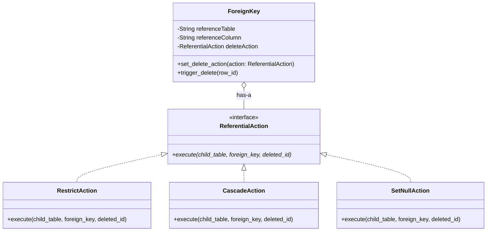
```mermaid
classDiagram
    class ForeignKey {
        -String referenceTable
        -String referenceColumn
        -ReferentialAction deleteAction
        +set_delete_action(action: ReferentialAction)
        +trigger_delete(row_id)
    }
    
    class ReferentialAction {
        <<interface>>
        +execute(child_table, foreign_key, deleted_id)*
    }
    
    class RestrictAction {
        +execute(child_table, foreign_key, deleted_id)
    }
    
    class CascadeAction {
        +execute(child_table, foreign_key, deleted_id)
    }
    
    class SetNullAction {
        +execute(child_table, foreign_key, deleted_id)
    }

    ForeignKey o-- ReferentialAction : has-a
    ReferentialAction <|.. RestrictAction
    ReferentialAction <|.. CascadeAction
    ReferentialAction <|.. SetNullAction
```

### Sequence Diagram
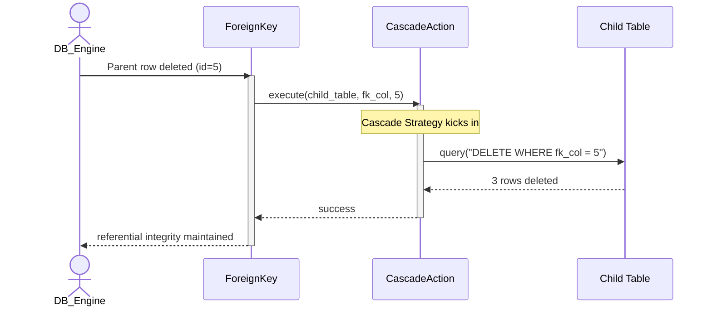
```mermaid
sequenceDiagram
    actor DB_Engine
    participant FK as ForeignKey
    participant Strat as CascadeAction
    participant ChildDB as Child Table

    DB_Engine->>FK: Parent row deleted (id=5)
    activate FK
    
    FK->>Strat: execute(child_table, fk_col, 5)
    activate Strat
    
    Note over Strat: Cascade Strategy kicks in
    Strat->>ChildDB: query("DELETE WHERE fk_col = 5")
    ChildDB-->>Strat: 3 rows deleted
    
    Strat-->>FK: success
    deactivate Strat
    
    FK-->>DB_Engine: referential integrity maintained
    deactivate FK
```

### TDD Code Example
```python
# The Strategy Interface
class ReferentialAction:
    def execute(self, child_table, fk_col, deleted_id):
        pass

# Concrete Strategies
class RestrictAction(ReferentialAction):
    def execute(self, child_table, fk_col, deleted_id):
        # Check if children exist; if yes, abort!
        child_rows = child_table.get(fk_col, deleted_id)
        if child_rows:
            raise Exception("RESTRICT: Cannot delete parent row. Child records exist.")
        print("RESTRICT: No child records found. Safe to delete.")

class CascadeAction(ReferentialAction):
    def execute(self, child_table, fk_col, deleted_id):
        # Delete children silently
        print(f"CASCADE: Deleting all rows in child table where {fk_col} = {deleted_id}")

class SetNullAction(ReferentialAction):
    def execute(self, child_table, fk_col, deleted_id):
        # Nullify children
        print(f"SET NULL: Setting {fk_col} to NULL in child table where {fk_col} = {deleted_id}")

# The Context
class ForeignKey:
    def __init__(self, ref_table, ref_col):
        self.ref_table = ref_table
        self.ref_col = ref_col
        self.delete_action = RestrictAction() # Default Strategy

    def set_delete_action(self, action: ReferentialAction):
        self.delete_action = action

    def trigger_delete(self, child_table_mock, deleted_id):
        # Delegates the behavior to the injected strategy
        self.delete_action.execute(child_table_mock, self.ref_col, deleted_id)

# --- TEST CODE ---
# Mocking a child table for testing
class MockChildTable:
    def get(self, col, val):
        return [1, 2] # Simulating that children DO exist

child_db = MockChildTable()
fk_constraint = ForeignKey("users", "user_id")

# Test 1: Default RESTRICT behavior
print("Testing RESTRICT:")
try:
    fk_constraint.trigger_delete(child_db, deleted_id=10)
except Exception as e:
    print(e) # Output: RESTRICT: Cannot delete parent row. Child records exist.

# Test 2: Swap strategy to CASCADE at runtime
print("\nTesting CASCADE:")
fk_constraint.set_delete_action(CascadeAction())
fk_constraint.trigger_delete(child_db, deleted_id=10)
# Output: CASCADE: Deleting all rows in child table where user_id = 10

# Test 3: Swap strategy to SET NULL at runtime
print("\nTesting SET NULL:")
fk_constraint.set_delete_action(SetNullAction())
fk_constraint.trigger_delete(child_db, deleted_id=10)
```

---


---

## 11. Command Pattern: DDL Commands (Medium Priority)

*   **Why choose Command instead of running DDL logic directly?**
    When a user issues `CREATE TABLE`, `DROP TABLE`, or `ALTER TABLE`, executing the creation logic directly inside the SQL Parser or Query Engine tightly couples those components. It also makes it very difficult to implement features like Transactional DDL (where a `CREATE TABLE` can be rolled back if a subsequent command fails) or Replicated DDL (sending the command to replica nodes).
    
    **The Command Pattern Solves This By:**
    1. **Encapsulation:** Every DDL operation is wrapped into an object (e.g., `CreateTableCommand`) that contains all necessary information (table name, columns) to execute the action.
    2. **Undo Capability:** Commands can implement an `undo()` method. E.g., the undo of `CreateTable` is `DROP TABLE`.
    3. **Queueing & Logging:** Commands can be placed in a queue for sequential execution, or serialized to a Write-Ahead Log (WAL) before execution.

### Class Diagram
```mermaid
classDiagram
    class DDLCommand {
        <<interface>>
        +execute()*
        +undo()*
    }
    
    class CreateTableCommand {
        -String table_name
        -Catalog receiver
        +execute()
        +undo()
    }
    
    class DropTableCommand {
        -String table_name
        -Table backup
        -Catalog receiver
        +execute()
        +undo()
    }
    
    class Catalog {
        +add_table(name)
        +remove_table(name)
    }

    DDLCommand <|.. CreateTableCommand
    DDLCommand <|.. DropTableCommand
    CreateTableCommand --> Catalog : receiver
    DropTableCommand --> Catalog : receiver
```

### Sequence Diagram
```mermaid
sequenceDiagram
    actor DB_Engine
    participant Cmd as CreateTableCommand
    participant Cat as Catalog

    DB_Engine->>Cmd: execute()
    activate Cmd
    
    Note over Cmd: Receiver executes the actual work
    Cmd->>Cat: add_table("users")
    Cat-->>Cmd: success
    
    Cmd-->>DB_Engine: success
    deactivate Cmd
    
    opt Transaction Abort
        DB_Engine->>Cmd: undo()
        activate Cmd
        Cmd->>Cat: remove_table("users")
        Cat-->>Cmd: success
        Cmd-->>DB_Engine: rolled back
        deactivate Cmd
    end
```

### TDD Code Example
```python
from abc import ABC, abstractmethod

# The Receiver
class Catalog:
    def __init__(self):
        self.tables = set()
        
    def add_table(self, name):
        print(f"[CATALOG] Creating table '{name}'")
        self.tables.add(name)
        
    def remove_table(self, name):
        print(f"[CATALOG] Dropping table '{name}'")
        self.tables.remove(name)
        
    def __str__(self): return f"Current Tables: {self.tables}"

# The Command Interface
class DDLCommand(ABC):
    @abstractmethod
    def execute(self): pass
    @abstractmethod
    def undo(self): pass

# Concrete Commands
class CreateTableCommand(DDLCommand):
    def __init__(self, catalog, table_name):
        self.catalog = catalog
        self.table_name = table_name
        
    def execute(self):
        self.catalog.add_table(self.table_name)
        
    def undo(self):
        print(f"-> UNDO CreateTableCommand({self.table_name})")
        self.catalog.remove_table(self.table_name)

class DropTableCommand(DDLCommand):
    def __init__(self, catalog, table_name):
        self.catalog = catalog
        self.table_name = table_name
        
    def execute(self):
        self.catalog.remove_table(self.table_name)
        
    def undo(self):
        print(f"-> UNDO DropTableCommand({self.table_name})")
        # In a real DBMS, this requires restoring the table from a Memento/Backup
        self.catalog.add_table(self.table_name)

# --- TEST CODE ---
catalog = Catalog()
history = [] # To keep track of executed commands for rollback

print(catalog)

cmd1 = CreateTableCommand(catalog, "users")
cmd1.execute()
history.append(cmd1)

cmd2 = CreateTableCommand(catalog, "orders")
cmd2.execute()
history.append(cmd2)

print(catalog)

# Something went wrong, rollback the last transaction!
print("
[TRANSACTION FAILED] Rolling back changes...")
while history:
    last_cmd = history.pop()
    last_cmd.undo()

print(catalog)

# Output:
# Current Tables: set()
# [CATALOG] Creating table 'users'
# [CATALOG] Creating table 'orders'
# Current Tables: {'users', 'orders'}
# 
# [TRANSACTION FAILED] Rolling back changes...
# -> UNDO CreateTableCommand(orders)
# [CATALOG] Dropping table 'orders'
# -> UNDO CreateTableCommand(users)
# [CATALOG] Dropping table 'users'
# Current Tables: set()
```

---


---

## 12. Template Method Pattern: Constraint Validation (High Priority)

*   **Why choose Template Method instead of discrete, independent checking functions?**
    A relational database enforces various Constraints (`NotNull`, `Check`, `Unique`, `PrimaryKey`). While the specific business logic for each constraint differs drastically (e.g., `NotNull` just checks memory, whereas `Unique` must query the B-Tree index on disk), the overall validation lifecycle is identical across all of them:
    1. **Pre-processing:** Skip validation if the incoming value is `Null` (unless it's a NotNull constraint itself).
    2. **Core Logic Check:** Perform the actual validation rule (e.g., `value > 0` or `lookup_index()`).
    3. **Post-processing:** Throw a standardized `ConstraintViolationException` if the check fails, ensuring the transaction aborts.

    If we implement these as independent functions, developers must manually copy-paste the pre-processing and post-processing boilerplate into every single constraint class. This leads to code duplication and the dangerous risk of inconsistent error handling (e.g., one constraint throws an error, another accidentally returns a boolean).

    **The Template Method Pattern Solves This By:**
    1. **Inversion of Control (The Hollywood Principle):** The abstract base class (`Constraint`) takes control of the overall algorithm's skeleton via the `validate()` method. It says to the subclasses: "Don't call us, we'll call you."
    2. **Code Reusability:** All boilerplate logic (null checks, exception throwing) is centralized in the base class.
    3. **Strict Enforcement:** The workflow is strictly enforced and cannot be altered by child classes. Subclasses are forced to implement *only* the specific abstract hook method (`check_logic()`), ensuring absolute consistency across the entire database engine.

### Class Diagram
```mermaid
classDiagram
    class Constraint {
        <<abstract>>
        -String column_name
        +validate(value, db_context)
        #check_logic(value, db_context)* bool
        #on_violation()
    }
    
    class NotNullConstraint {
        #check_logic(value, db_context) bool
    }
    
    class CheckConstraint {
        -String expression
        #check_logic(value, db_context) bool
    }
    
    class UniqueConstraint {
        #check_logic(value, db_context) bool
    }

    Constraint <|-- NotNullConstraint
    Constraint <|-- CheckConstraint
    Constraint <|-- UniqueConstraint
```

### Sequence Diagram
```mermaid
sequenceDiagram
    actor DB_Engine
    participant Base as Constraint (Abstract)
    participant Child as UniqueConstraint (Concrete)
    participant Index as BTree Index (DB Context)

    DB_Engine->>Base: validate("john_doe", db_context)
    activate Base
    
    Note over Base: Step 1: Pre-processing (Null Check)
    Base->>Base: is_null("john_doe") -> False
    
    Note over Base: Step 2: Hook Method (Core Logic)
    Base->>Child: check_logic("john_doe", db_context)
    activate Child
    Child->>Index: search("john_doe")
    Index-->>Child: found = True
    Child-->>Base: return False (Failed!)
    deactivate Child
    
    Note over Base: Step 3: Post-processing (Exception)
    Base->>Base: on_violation()
    Base-->>DB_Engine: throws ConstraintViolationException
    deactivate Base
```

### TDD Code Example
```python
class ConstraintViolationException(Exception):
    pass

class Constraint:
    def __init__(self, col_name):
        self.col_name = col_name

    def validate(self, value, db_context): 
        # Hard-coded workflow skeleton (Immutable by children)
        if value is None and not isinstance(self, NotNullConstraint): 
            return True # Pre-processing: Skip nulls for standard constraints
            
        if not self.check_logic(value, db_context): # Core Logic Hook
            self.on_violation(value) # Post-processing
            
    def check_logic(self, value, db_context): 
        raise NotImplementedError("Subclasses must implement this hook!")
        
    def on_violation(self, value):
        raise ConstraintViolationException(f"Column '{self.col_name}' violated constraint with value '{value}'!")

class CheckConstraint(Constraint):
    def check_logic(self, value, db_context): 
        return value > 0 # Simple memory check

class UniqueConstraint(Constraint):
    def check_logic(self, value, db_context):
        # Complex DB lookup check
        index_data = db_context.get_index(self.col_name)
        return value not in index_data

class NotNullConstraint(Constraint):
    def check_logic(self, value, db_context):
        return value is not None

# --- TEST CODE ---
class MockDBContext:
    def get_index(self, col): return ["admin", "root"]

db_context = MockDBContext()

# Test 1: Unique Constraint
unique_username = UniqueConstraint("username")
unique_username.validate("new_user", db_context) # Passes successfully

try:
    unique_username.validate("admin", db_context) # Fails
except Exception as e:
    print(e) # Output: Column 'username' violated constraint with value 'admin'!

# Test 2: Check Constraint (skips Null properly)
age_check = CheckConstraint("age")
age_check.validate(None, db_context) # Passes immediately (Nulls allowed)
```

---

