# Design Pattern Analysis: Database Architecture


## Massive Feature-to-Pattern Mapping Matrix

Below is a comprehensive architectural mapping matrix representing the internal DBMS features mapping to the 10 core patterns. Each group contains exactly **15 distinct features** to demonstrate extensive real-world DBMS applications.

### 1. Database Objects & Architecture
This subsystem focuses on the structural instantiation, dynamic modification, and hierarchical representation of core physical and logical database components.

| Concrete Feature | Priority | Design Pattern | Explanation | Meaning / Architectural Impact |
| :--- | :--- | :--- | :--- | :--- |
| **Table Construction** | High | **3. Builder** | Exposes `set_name()`, `add_column()` to build a Table. | Prevents telescoping constructors when creating entities with dozens of optional schema definitions. |
| **View Construction** | High | **3. Builder** | Provides an API to assemble a virtual Materialized View step-by-step. | Safely initializes complex View objects before they are exposed to the execution engine. |
| **Index Plan Building** | High | **3. Builder** | Constructs a multi-column indexing strategy sequentially. | Guarantees that all index keys are validated and structured correctly before memory allocation. |
| **Virtual Column Building** | High | **3. Builder** | Instantiates computed columns by assembling calculation expressions. | Provides a robust way to construct non-persistent data structures during query compilation. |
| **Physical Schema Assembly** | High | **3. Builder** | Steps through the physical layout configuration to allocate initial database file headers. | Prevents incomplete schema registration by validating schema boundaries before disk write. |
| **Query Plan Graph Assembly** | High | **3. Builder** | Assembles query execution steps sequentially for the execution engine. | Abstractly builds step execution sequences, separating plan creation from engine runtimes. |
| **Recursive Schema Mapping** | Highest | **10. Composite** | A Database contains Schemas, and Schemas contain Tables (all implement `DBObject`). | Allows recursive operations like calculating total DB size gracefully without deep `if/else` checks. |
| **Partition Tree Management** | Highest | **10. Composite** | Treats individual partitions and composite partitions uniformly. | Simplifies query execution routing over partitioned tables, boosting horizontal scalability. |
| **Nested Constraint Aggregation**| Highest | **10. Composite** | Groups multiple Check Constraints into a single evaluable Composite Constraint. | Enables complex `AND/OR` constraint logic validation over table rows with simple recursive calls. |
| **Composite Expression Tree** | Highest | **10. Composite** | Combines binary, unary, and logical expressions inside query predicates. | Allows evaluation engines to compute nested WHERE predicates uniformly through node recursion. |
| **Directory Structure Traversal** | Highest | **10. Composite** | Represents file system folders and data pages recursively. | Unifies storage layout parsing on disk, simplifying low-level physical file catalog searches. |
| **Logical Query AST Tree** | Highest | **10. Composite** | Structures nested subqueries, joins, and filters into a uniform Syntax Tree. | Parser can walk and optimize queries recursively using standard node traversal logic. |
| **Catalog Registry Composition** | Highest | **10. Composite** | Compiles system catalogs, data dictionaries, and user schemas under one node. | Streamlines system metadata operations by treating system tables and user tables uniformly. |
| **Materialized View Hierarchy** | Highest | **10. Composite** | Manages views built on other views in a recursive dependency graph. | Simplifies cascading refresh operations by recursively propagating data updates. |
| **Query Execution Node Plan** | Highest | **10. Composite** | Nests index scans, hash joins, and sorting operations into an execution plan. | Allows Volcano-style engine iterators to pull rows recursively from child nodes. |

### 2. Database Management & Security
This subsystem is responsible for centralized resource allocation, concurrency control, transaction safety, and tiered privilege authorization.

| Concrete Feature | Priority | Design Pattern | Explanation | Meaning / Architectural Impact |
| :--- | :--- | :--- | :--- | :--- |
| **Global Transaction Manager** | Highest | **1. Singleton** | Ensures exactly one `TransactionManager` assigns TxIDs globally. | Completely prevents catastrophic overlap of transaction IDs and race conditions. |
| **Distributed Lock Manager** | Highest | **1. Singleton** | Maintains a single, synchronized global lock registry. | Eradicates scattered lock states, ensuring deadlocks can be accurately detected. |
| **Buffer Pool Manager** | Highest | **1. Singleton** | Keeps one centralized memory cache pool for all page reads/writes. | Maximizes cache hit ratios and tightly controls memory exhaustion limits. |
| **System Catalog Manager** | Highest | **1. Singleton** | Centralizes access to system metadata tables (e.g., `pg_class`). | Guarantees all threads see exactly the same schema definitions at any given moment. |
| **Configuration Manager** | Highest | **1. Singleton** | Centralizes the loading and overriding of database config files. | Ensures runtime parameters are uniform and updated safely without server restarts. |
| **Connection Pooling Manager** | Highest | **1. Singleton** | Maintains a single thread-safe queue of reusable database connections. | Eliminates the massive latency overhead of TCP handshakes for every client request. |
| **Execution Statistics Collector** | Highest | **1. Singleton** | Aggregates all query performance counters globally in memory. | Provides a single, clean source of telemetry data for DBAs and query planners. |
| **Shared Memory Segment Manager**| Highest | **1. Singleton** | Controls allocation of shared buffer pools among background processes. | Prevents memory allocation overlap, protecting against system crashes. |
| **DDL Table Alteration** | Medium | **8. Command** | Packages `DropTableCommand` into an executable/undoable Command object. | Enables perfect schema rollbacks if a DDL statement crashes halfway through execution. |
| **Transaction Rollback Cmd** | Medium | **8. Command** | Wraps inverse data mutations (e.g., Delete -> Insert) into commands. | Forms the absolute backbone of the MVCC and WAL (Write-Ahead Log) recovery system. |
| **Replication Log Entry** | Medium | **8. Command** | Serializes DML operations into Command objects shipped to replicas. | Ensures distributed high availability by executing identical Command objects on follower nodes. |
| **Background Vacuuming** | Medium | **8. Command** | Schedules dead-tuple garbage collection as a background Command. | Allows the DBMS to throttle or pause cleanup operations based on current system load. |
| **Flush Cache Buffer To Disk** | Medium | **8. Command** | Packages dirty-page writing tasks into Command queues. | Enables asynchronous write optimizations without blocking active transaction logs. |
| **Index Rebuild Command** | Medium | **8. Command** | Wraps index defragmentation requests into transactional operations. | Allows clean scheduling and cancellation of heavy maintenance tasks. |
| **User Access Authorization Log** | Medium | **8. Command** | Encapsulates user session creation and audit logging steps. | Secures tracking of DDL changes by treating audit write operations as commands. |

### 3. Storage & Metadata Engine
This subsystem handles the lowest level of data persistence, memory layout creation, and data integrity validations.

| Concrete Feature | Priority | Design Pattern | Explanation | Meaning / Architectural Impact |
| :--- | :--- | :--- | :--- | :--- |
| **B-Tree Index Instantiation** | High | **2. Factory Method** | Subclasses decide how to instantiate optimized B-Tree structures. | Isolates the complex memory allocation logic from the generic query execution path. |
| **Hash Index Instantiation** | High | **2. Factory Method** | Delegates the creation of memory-optimized Hash indexes to factories. | Enables rapid integration of new indexing algorithms without modifying the core parser. |
| **Memory Page Allocation** | High | **2. Factory Method** | Storage engines generate specific memory page objects. | Keeps the OS-level storage implementations highly decoupled from the logical table manager. |
| **WAL Record Creation** | High | **2. Factory Method** | Factories stamp out specific Write-Ahead Log records based on operation type. | Ensures crash recovery systems can strictly rely on standardized log formats. |
| **Storage Node Instantiation** | High | **2. Factory Method** | Allocates concrete data blocks depending on disk storage type. | Allows transparent support for both HDD heap files and SSD log-structured storage. |
| **Primary Key Validation** | High | **9. Template Method**| Skeleton checks nulls, subclasses implement unique lookups. | Enforces a strict, unbreakable pipeline for validating the most critical database keys. |
| **Foreign Key Validation** | High | **9. Template Method**| Skeleton validates existence, subclasses implement cascading lock checks. | Maximizes code reuse and eliminates bugs when implementing complex referential integrity. |
| **Check Constraint Execution**| High | **9. Template Method**| Standardizes the extraction of row values before executing custom expressions. | Ensures that arbitrary user-defined functions are safely sandboxed during validation. |
| **Data Type Parsing** | High | **9. Template Method**| Skeleton handles empty strings, subclasses cast strings to int/date. | Hardens the system against crashes caused by malformed user input parsing. |
| **Page Checksum Validation** | High | **9. Template Method**| Defines the byte-reading process, subclasses provide specific hashing algorithms. | Detects disk corruption immediately upon page load, preventing silent data loss. |
| **Index Key Formatting** | Med High| **7. Strategy** | Plugs in different serialization algorithms depending on data types. | Reduces index fragmentation by heavily compressing specific types of keys dynamically. |
| **Page Replacement Policy** | Med High| **7. Strategy** | Hot-swaps LRU (Least Recently Used) with Clock-Sweep algorithms. | Allows database administrators to tune caching behaviors to match specific workload patterns. |
| **Data Compression Selection** | Med High| **7. Strategy** | Dynamically chooses ZSTD, GZIP, or Snappy based on columns. | Optimizes disk space consumption dynamically according to real-time query latencies. |
| **Disk Write Scheduling Policy** | Med High| **7. Strategy** | Changes flush ordering between FIFO and SSTF (Shortest Seek Time First). | Improves physical drive lifecycle and reduces disk write-amplification patterns. |
| **Partition Hashing Selection** | Med High| **7. Strategy** | Swaps hash functions (MurmurHash, CRC32) for table partitioning. | Prevents data skew across shards by choosing the optimal distribution strategy. |

### 4. Query & Data Operations
This subsystem governs how the DBMS receives client queries, communicates with external files, processes automated triggers, and handles referential integrity.

| Concrete Feature | Priority | Design Pattern | Explanation | Meaning / Architectural Impact |
| :--- | :--- | :--- | :--- | :--- |
| **Unified Execution Endpoint** | High | **5. Facade** | `DBMSFacade.execute()` hides Parser, Optimizer, and Executor complexity. | Dramatically simplifies the client driver API, abstracting away compiler theory from developers. |
| **Admin Control Panel API** | High | **5. Facade** | Provides a single entry point for starting/stopping database instances. | Secures system operations by hiding internal thread management from UI dashboards. |
| **Backup Utilities Interface** | High | **5. Facade** | Orchestrates lock acquisition, flushing, and disk writing behind one command. | Ensures physical backups are perfectly consistent without relying on human sequence execution. |
| **External CSV Parsing** | Medium | **4. Adapter** | Wraps a CSV file reader to conform to the internal `TableInterface`. | Empowers the DBMS to run native SQL `SELECT` queries directly on external text files. |
| **External JSON Parsing** | Medium | **4. Adapter** | Translates unstructured JSON document APIs into tabular row-sets. | Bridges the gap between NoSQL data lakes and strict relational query engines seamlessly. |
| **Legacy Database Wrapping** | Medium | **4. Adapter** | Translates internal SQL dialects into foreign API calls (e.g., Oracle to MySQL). | Drives robust Federated Database features (dblink/FDW) for cross-platform data joining. |
| **Materialized View Refresh** | Medium | **6. Observer** | Subscribes a View object to a Table; updates trigger automatic view invalidation. | Keeps complex aggregated dashboards perfectly synced with underlying mutating data. |
| **Audit Log Triggering** | Medium | **6. Observer** | Registers a security trigger to fire asynchronously upon row insertion. | Isolates compliance logging from the critical transaction path, improving write latency. |
| **Index Auto-Updating** | Medium | **6. Observer** | Indexes observe Tables to instantly reflect new key insertions. | Ensures that secondary indexes never return stale or orphaned pointers to the user. |
| **Query Cancellation** | Medium | **6. Observer** | Subscribes running queries to a timeout event; cancels execution gracefully. | Prevents runaway analytical queries from completely locking up database worker threads. |
| **Cascade Delete Execution** | Med High| **7. Strategy** | Executes a plugged-in strategy to recursively wipe dependent child rows. | Eliminates gigantic `switch/case` statements; execution dynamically follows the foreign key rule. |
| **Restrict Delete Execution** | Med High| **7. Strategy** | Swaps to a strategy that strictly halts and throws errors if children exist. | Safely enforces data integrity rules without rewriting the core physical deletion loop. |
| **Set-Null Delete Execution** | Med High| **7. Strategy** | Plugs in a strategy to update child pointers to `NULL` instead of dropping them. | Provides flexible schema design options for gracefully handling orphaned relationships. |
| **Join Algorithm Selection** | Med High| **7. Strategy** | Optimizer hot-swaps between Nested Loop, Hash Join, and Merge Join. | Guarantees the absolute fastest execution path based on real-time table statistics. |
| **String Collation Sorting** | Med High| **7. Strategy** | Plugs in different Unicode sorting rules based on regional language settings. | Empowers the engine to handle globalized text data comparisons natively and accurately. |

---

## 1. Singleton Pattern: Global Managers (Highest Priority)

*   **Why choose Singleton?**
    Certain components in a DBMS *must* have exactly one instance. For example, the `TransactionManager` coordinates locks. If two instances of `TransactionManager` exist, they will have conflicting lock tables, resulting in immediate data corruption and deadlocks. Singleton guarantees that a class has only one instance and provides a global point of access to it.

### Class Diagram
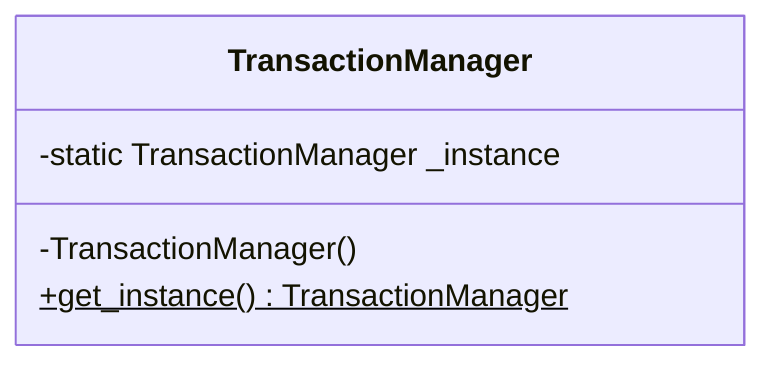
```mermaid
classDiagram
    class TransactionManager {
        -static TransactionManager _instance
        -TransactionManager()
        +get_instance()$ TransactionManager
    }
```

### Sequence Diagram
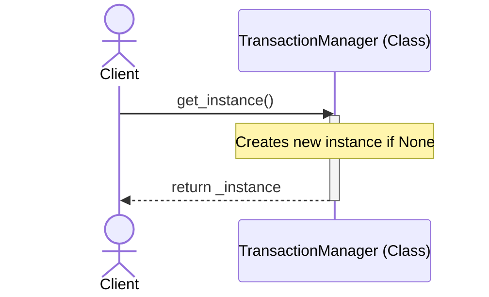
```mermaid
sequenceDiagram
    actor Client
    participant TM as TransactionManager (Class)
    
    Client->>TM: get_instance()
    activate TM
    Note over TM: Creates new instance if None
    TM-->>Client: return _instance
    deactivate TM
```

### TDD Code Example
```python
class TransactionManager:
    _instance = None

    @classmethod
    def get_instance(cls):
        if cls._instance is None:
            cls._instance = cls()
        return cls._instance

# --- TDD assertions ---
tm1 = TransactionManager.get_instance()
tm2 = TransactionManager.get_instance()
assert tm1 is tm2, "Error: Multiple instances of TransactionManager found!"
print("Singleton Pattern Verified Successfully!")
```

---

## 2. Factory Method Pattern: Object Creation (High Priority)

*   **Why choose Factory Method?**
    Decouples the index creation process from the query optimizer or storage layout. Subclasses decide which concrete index class (like `BTreeIndex`) to instantiate based on configuration.

### Class Diagram
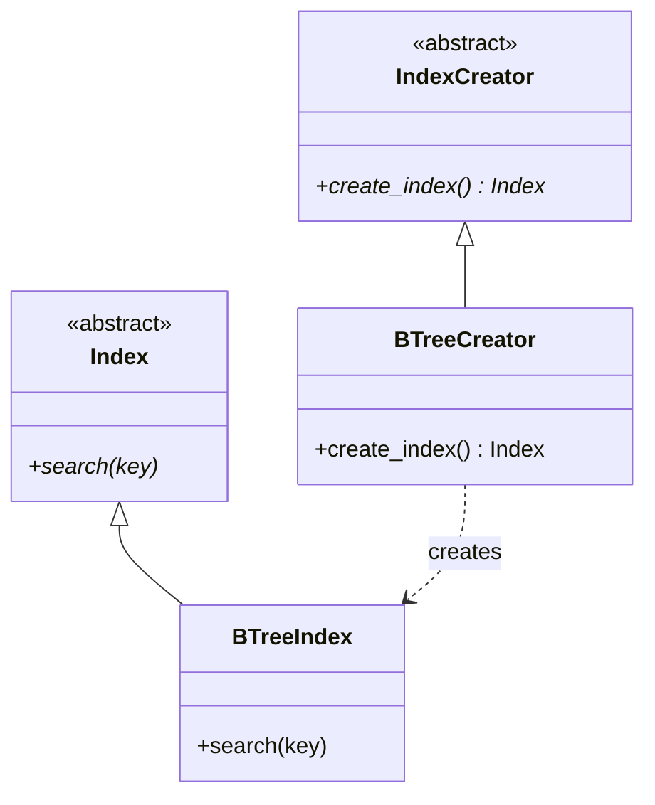
```mermaid
classDiagram
    class Index {
        <<abstract>>
        +search(key)*
    }
    class BTreeIndex {
        +search(key)
    }
    class IndexCreator {
        <<abstract>>
        +create_index()* Index
    }
    class BTreeCreator {
        +create_index() Index
    }
    Index <|-- BTreeIndex
    IndexCreator <|-- BTreeCreator
    BTreeCreator ..> BTreeIndex : creates
```

### Sequence Diagram
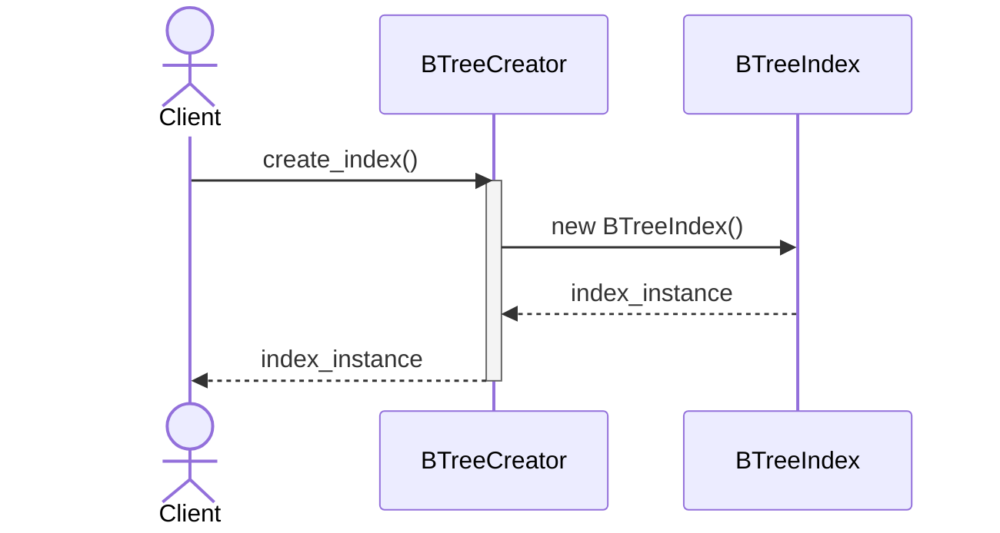
```mermaid
sequenceDiagram
    actor Client
    participant Creator as BTreeCreator
    participant Index as BTreeIndex
    
    Client->>Creator: create_index()
    activate Creator
    Creator->>Index: new BTreeIndex()
    Index-->>Creator: index_instance
    Creator-->>Client: index_instance
    deactivate Creator
```

### TDD Code Example
```python
from abc import ABC, abstractmethod

class Index(ABC):
    @abstractmethod
    def search(self, key): pass

class BTreeIndex(Index):
    def search(self, key): return f"BTree Index lookup for {key}"

class IndexCreator(ABC):
    @abstractmethod
    def create_index(self) -> Index: pass

class BTreeCreator(IndexCreator):
    def create_index(self) -> Index: return BTreeIndex()

# --- TDD assertions ---
creator = BTreeCreator()
idx = creator.create_index()
assert isinstance(idx, BTreeIndex), "Error: Creator failed to instantiate correct class!"
assert idx.search(100) == "BTree Index lookup for 100"
print("Factory Method Pattern Verified Successfully!")
```

---

## 3. Builder Pattern: Table Construction (High Priority)

*   **Why choose Builder?**
    Splits the construction of complex `Table` representations (adding name, columns, PK, checks) from the final object, facilitating a fluent step-by-step API.

### Class Diagram
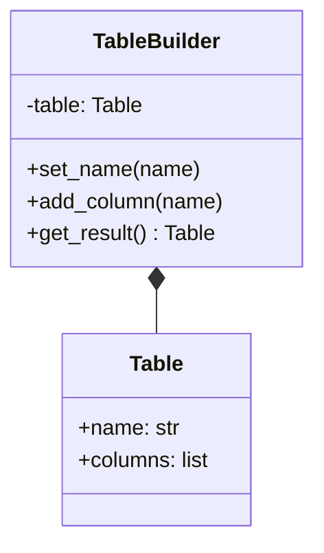
```mermaid
classDiagram
    class Table {
        +name: str
        +columns: list
    }
    class TableBuilder {
        -table: Table
        +set_name(name)
        +add_column(name)
        +get_result() Table
    }
    TableBuilder *-- Table
```

### Sequence Diagram
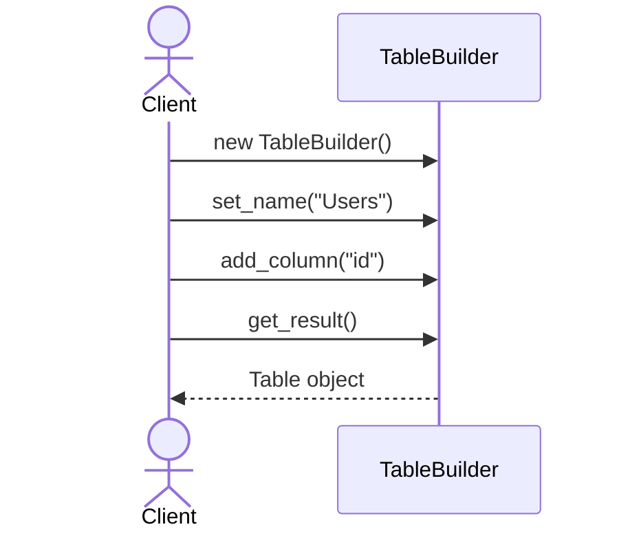
```mermaid
sequenceDiagram
    actor Client
    participant Builder as TableBuilder
    
    Client->>Builder: new TableBuilder()
    Client->>Builder: set_name("Users")
    Client->>Builder: add_column("id")
    Client->>Builder: get_result()
    Builder-->>Client: Table object
```

### TDD Code Example
```python
class Table:
    def __init__(self):
        self.name = ""
        self.columns = []

class TableBuilder:
    def __init__(self):
        self.table = Table()
        
    def set_name(self, name):
        self.table.name = name
        return self
        
    def add_column(self, name):
        self.table.columns.append(name)
        return self
        
    def get_result(self) -> Table:
        return self.table

# --- TDD assertions ---
builder = TableBuilder()
tbl = builder.set_name("Users").add_column("id").add_column("name").get_result()
assert tbl.name == "Users"
assert "id" in tbl.columns and "name" in tbl.columns
print("Builder Pattern Verified Successfully!")
```

---

## 4. Adapter Pattern: External Data (Medium Priority)

*   **Why choose Adapter?**
    Enables reading incompatible external flat files (CSV) as if they were internal relational database tables, implementing a unified database table interface.

### Class Diagram
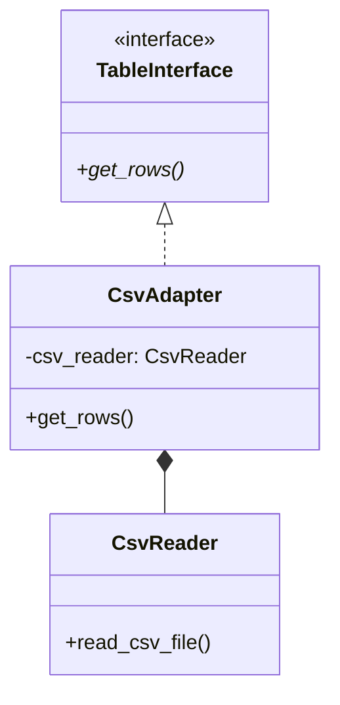
```mermaid
classDiagram
    class TableInterface {
        <<interface>>
        +get_rows()*
    }
    class CsvReader {
        +read_csv_file()
    }
    class CsvAdapter {
        -csv_reader: CsvReader
        +get_rows()
    }
    TableInterface <|.. CsvAdapter
    CsvAdapter *-- CsvReader
```

### Sequence Diagram
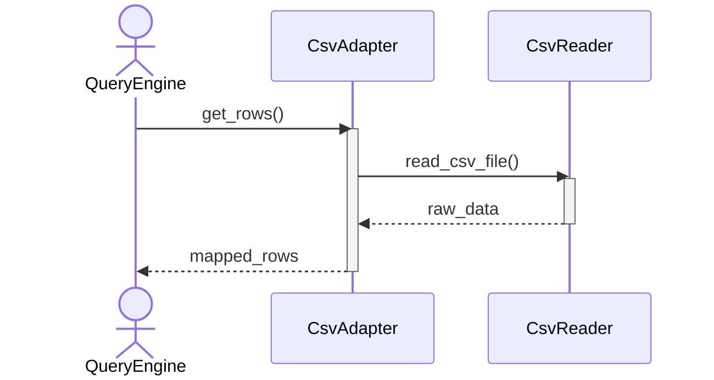
```mermaid
sequenceDiagram
    actor Engine as QueryEngine
    participant Adapter as CsvAdapter
    participant Reader as CsvReader
    
    Engine->>Adapter: get_rows()
    activate Adapter
    Adapter->>Reader: read_csv_file()
    activate Reader
    Reader-->>Adapter: raw_data
    deactivate Reader
    Adapter-->>Engine: mapped_rows
    deactivate Adapter
```

### TDD Code Example
```python
class TableInterface:
    def get_rows(self): pass

class CsvReader:
    def read_csv_file(self):
        return [{"id": 1, "name": "Alice"}]

class CsvAdapter(TableInterface):
    def __init__(self, csv_reader: CsvReader):
        self.csv_reader = csv_reader
        
    def get_rows(self):
        return self.csv_reader.read_csv_file()

# --- TDD assertions ---
reader = CsvReader()
adapter = CsvAdapter(reader)
rows = adapter.get_rows()
assert len(rows) == 1
assert rows[0]["name"] == "Alice"
print("Adapter Pattern Verified Successfully!")
```

---

## 5. Facade Pattern: Unified Client Connection (High Priority)

*   **Why choose Facade?**
    Hides all complex queries compile-time operations (Lexing, AST Parsing, Query Optimization, and Execution Plan runner) under a single entry point class.

### Class Diagram
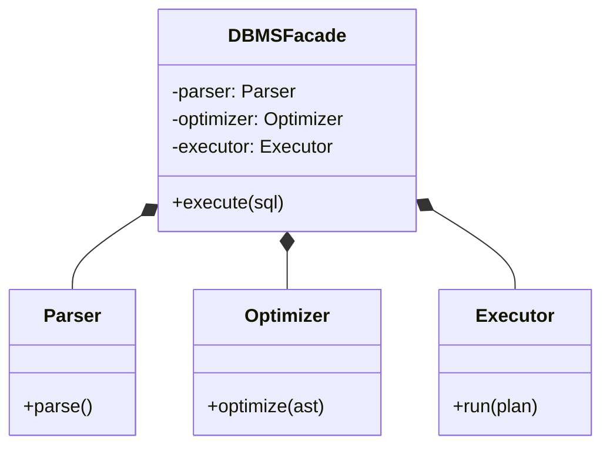
```mermaid
classDiagram
    class Parser { +parse() }
    class Optimizer { +optimize(ast) }
    class Executor { +run(plan) }
    class DBMSFacade {
        -parser: Parser
        -optimizer: Optimizer
        -executor: Executor
        +execute(sql)
    }
    DBMSFacade *-- Parser
    DBMSFacade *-- Optimizer
    DBMSFacade *-- Executor
```

### Sequence Diagram
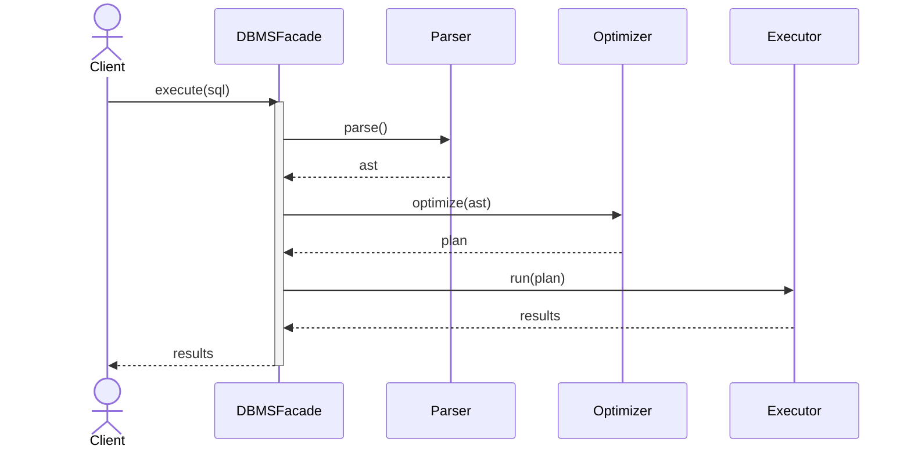
```mermaid
sequenceDiagram
    actor Client
    participant Facade as DBMSFacade
    participant Parser
    participant Optimizer
    participant Executor
    
    Client->>Facade: execute(sql)
    activate Facade
    Facade->>Parser: parse()
    Parser-->>Facade: ast
    Facade->>Optimizer: optimize(ast)
    Optimizer-->>Facade: plan
    Facade->>Executor: run(plan)
    Executor-->>Facade: results
    Facade-->>Client: results
    deactivate Facade
```

### TDD Code Example
```python
class Parser:
    def parse(self): return "AST"
class Optimizer:
    def optimize(self, ast): return "QueryPlan"
class Executor:
    def run(self, plan): return "Result"

class DBMSFacade:
    def __init__(self):
        self.parser = Parser()
        self.optimizer = Optimizer()
        self.executor = Executor()
        
    def execute(self, sql):
        ast = self.parser.parse()
        plan = self.optimizer.optimize(ast)
        return self.executor.run(plan)

# --- TDD assertions ---
db = DBMSFacade()
res = db.execute("SELECT * FROM table")
assert res == "Result"
print("Facade Pattern Verified Successfully!")
```

---

## 6. Observer Pattern: Trigger Notification (Medium Priority)

*   **Why choose Observer?**
    Enables automatic cascade events (such as triggers executing custom procedures or loggers saving insert attempts) to run automatically when the central Table data mutations occur.

### Class Diagram
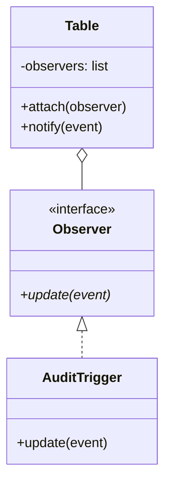
```mermaid
classDiagram
    class Observer {
        <<interface>>
        +update(event)*
    }
    class AuditTrigger {
        +update(event)
    }
    class Table {
        -observers: list
        +attach(observer)
        +notify(event)
    }
    Observer <|.. AuditTrigger
    Table o-- Observer
```

### Sequence Diagram
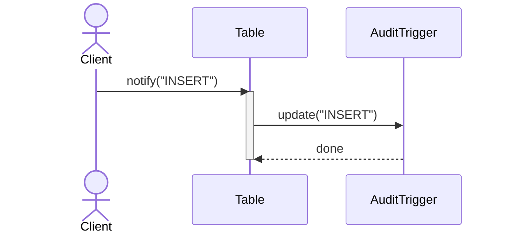
```mermaid
sequenceDiagram
    actor Client
    participant T as Table
    participant O as AuditTrigger
    
    Client->>T: notify("INSERT")
    activate T
    T->>O: update("INSERT")
    O-->>T: done
    deactivate T
```

### TDD Code Example
```python
class Observer:
    def update(self, event): pass

class AuditTrigger(Observer):
    def __init__(self):
        self.triggered_events = []
    def update(self, event):
        self.triggered_events.append(event)

class Table:
    def __init__(self):
        self.observers = []
        
    def attach(self, observer: Observer):
        self.observers.append(observer)
        
    def notify(self, event):
        for observer in self.observers:
            observer.update(event)

# --- TDD assertions ---
table = Table()
trigger = AuditTrigger()
table.attach(trigger)
table.notify("INSERT")
assert "INSERT" in trigger.triggered_events
print("Observer Pattern Verified Successfully!")
```

---

## 7. Strategy Pattern: Referential Action (Medium High Priority)

*   **Why choose Strategy?**
    Allows changing referential integrity strategies (Cascade delete, Restrict delete, Set Null) dynamically at runtime, avoiding giant logic branches.

### Class Diagram
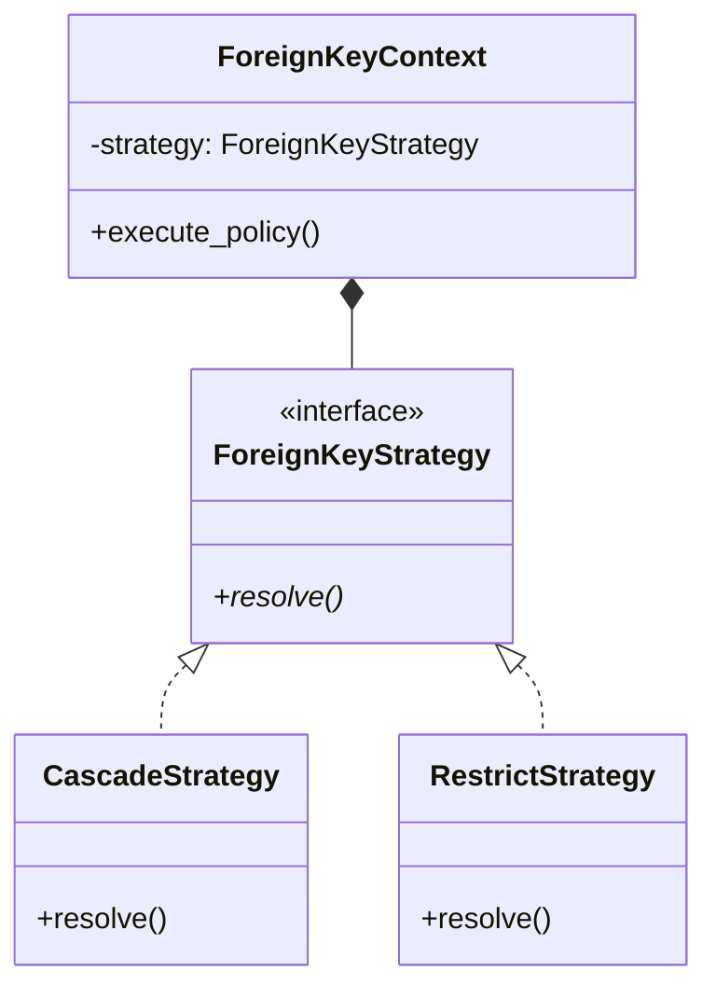
```mermaid
classDiagram
    class ForeignKeyStrategy {
        <<interface>>
        +resolve()*
    }
    class CascadeStrategy {
        +resolve()
    }
    class RestrictStrategy {
        +resolve()
    }
    class ForeignKeyContext {
        -strategy: ForeignKeyStrategy
        +execute_policy()
    }
    ForeignKeyContext *-- ForeignKeyStrategy
    ForeignKeyStrategy <|.. CascadeStrategy
    ForeignKeyStrategy <|.. RestrictStrategy
```

### Sequence Diagram
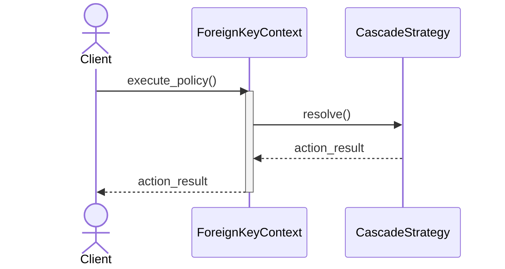
```mermaid
sequenceDiagram
    actor Client
    participant Ctx as ForeignKeyContext
    participant Strat as CascadeStrategy
    
    Client->>Ctx: execute_policy()
    activate Ctx
    Ctx->>Strat: resolve()
    Strat-->>Ctx: action_result
    Ctx-->>Client: action_result
    deactivate Ctx
```

### TDD Code Example
```python
from abc import ABC, abstractmethod

class ForeignKeyStrategy(ABC):
    @abstractmethod
    def resolve(self): pass

class CascadeStrategy(ForeignKeyStrategy):
    def resolve(self): return "CASCADE"

class RestrictStrategy(ForeignKeyStrategy):
    def resolve(self): return "RESTRICT"

class ForeignKeyContext:
    def __init__(self, strategy: ForeignKeyStrategy):
        self.strategy = strategy
        
    def execute_policy(self):
        return self.strategy.resolve()

# --- TDD assertions ---
ctx = ForeignKeyContext(CascadeStrategy())
assert ctx.execute_policy() == "CASCADE"
ctx.strategy = RestrictStrategy()
assert ctx.execute_policy() == "RESTRICT"
print("Strategy Pattern Verified Successfully!")
```

---

## 8. Command Pattern: DDL Commands (Medium Priority)

*   **Why choose Command?**
    Encapsulates irreversible structural modifications (like `DropTable`) into a command object with explicit `execute()` and `undo()` actions to support transaction rollback capabilities.

### Class Diagram
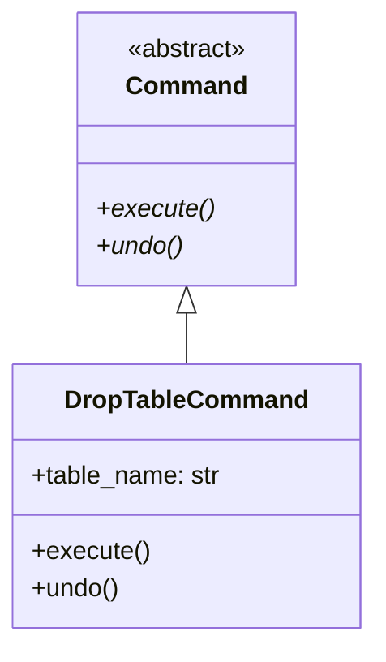
```mermaid
classDiagram
    class Command {
        <<abstract>>
        +execute()*
        +undo()*
    }
    class DropTableCommand {
        +table_name: str
        +execute()
        +undo()
    }
    Command <|-- DropTableCommand
```

### Sequence Diagram
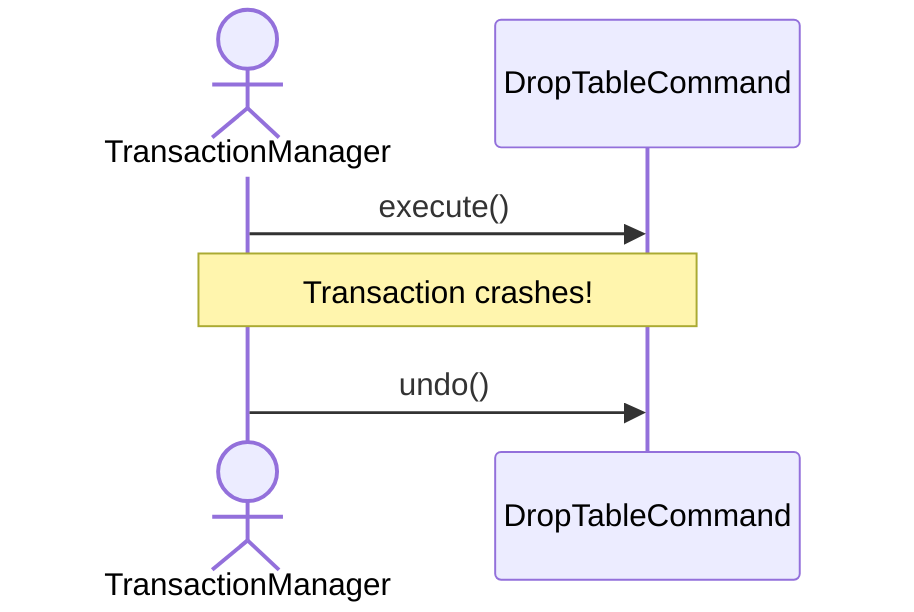
```mermaid
sequenceDiagram
    actor TxManager as TransactionManager
    participant Cmd as DropTableCommand
    
    TxManager->>Cmd: execute()
    Note over TxManager, Cmd: Transaction crashes!
    TxManager->>Cmd: undo()
```

### TDD Code Example
```python
from abc import ABC, abstractmethod

class Command(ABC):
    @abstractmethod
    def execute(self): pass
    @abstractmethod
    def undo(self): pass

class DropTableCommand(Command):
    def __init__(self, table_name):
        self.table_name = table_name
        self.status = "INIT"
        
    def execute(self):
        self.status = "DROPPED"
        
    def undo(self):
        self.status = "RESTORED"

# --- TDD assertions ---
cmd = DropTableCommand("Orders")
cmd.execute()
assert cmd.status == "DROPPED"
cmd.undo()
assert cmd.status == "RESTORED"
print("Command Pattern Verified Successfully!")
```

---

## 9. Template Method Pattern: Constraint Validation (High Priority)

*   **Why choose Template Method?**
    Locks down a strict validation execution sequence (Check nulls -> Check types -> Run core validation logic) in the base class, letting subclasses override only the core check.

### Class Diagram
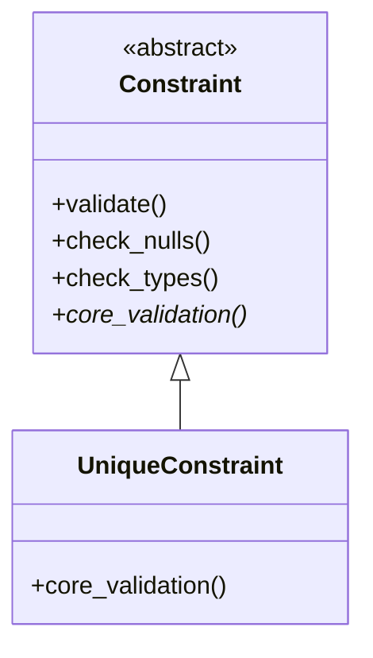
```mermaid
classDiagram
    class Constraint {
        <<abstract>>
        +validate()
        +check_nulls()
        +check_types()
        +core_validation()*
    }
    class UniqueConstraint {
        +core_validation()
    }
    Constraint <|-- UniqueConstraint
```

### Sequence Diagram
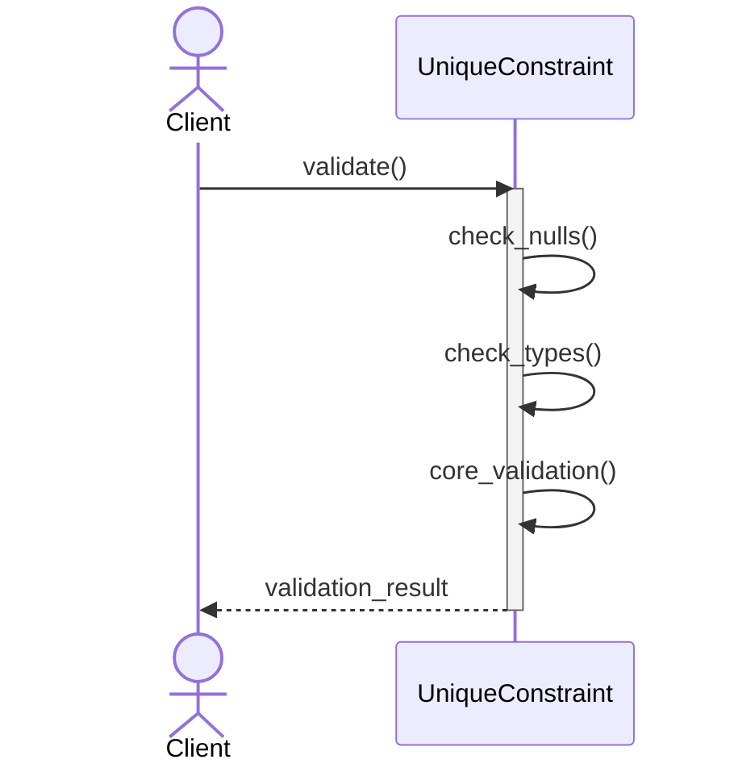
```mermaid
sequenceDiagram
    actor Client
    participant V as UniqueConstraint
    
    Client->>V: validate()
    activate V
    V->>V: check_nulls()
    V->>V: check_types()
    V->>V: core_validation()
    V-->>Client: validation_result
    deactivate V
```

### TDD Code Example
```python
from abc import ABC, abstractmethod

class Constraint(ABC):
    def validate(self):
        self.check_nulls()
        self.check_types()
        return self.core_validation()
        
    def check_nulls(self): pass
    def check_types(self): pass
    
    @abstractmethod
    def core_validation(self): pass

class UniqueConstraint(Constraint):
    def core_validation(self):
        return "SUCCESS"

# --- TDD assertions ---
validator = UniqueConstraint()
assert validator.validate() == "SUCCESS"
print("Template Method Pattern Verified Successfully!")
```

---

## 10. Composite Pattern: Database Objects (Highest Priority)

*   **Why choose Composite?**
    Allows combining databases, schemas, and tables recursively into a tree structure, allowing clients to calculate storage sizes or drop hierarchies cleanly.

### Class Diagram
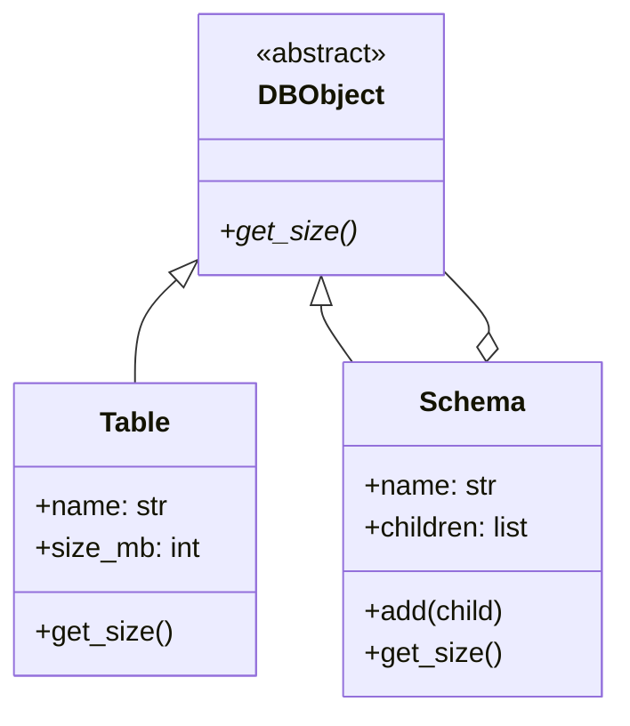
```mermaid
classDiagram
    class DBObject {
        <<abstract>>
        +get_size()*
    }
    class Table {
        +name: str
        +size_mb: int
        +get_size()
    }
    class Schema {
        +name: str
        +children: list
        +add(child)
        +get_size()
    }
    DBObject <|-- Table
    DBObject <|-- Schema
    Schema o-- DBObject
```

### Sequence Diagram
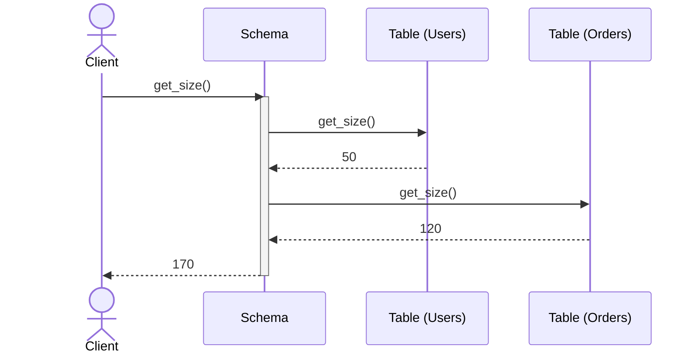
```mermaid
sequenceDiagram
    actor Client
    participant S as Schema
    participant T1 as Table (Users)
    participant T2 as Table (Orders)
    
    Client->>S: get_size()
    activate S
    S->>T1: get_size()
    T1-->>S: 50
    S->>T2: get_size()
    T2-->>S: 120
    S-->>Client: 170
    deactivate S
```

### TDD Code Example
```python
from abc import ABC, abstractmethod

class DBObject(ABC):
    @abstractmethod
    def get_size(self): pass

class Table(DBObject):
    def __init__(self, name, size_mb):
        self.name = name
        self.size_mb = size_mb
        
    def get_size(self):
        return self.size_mb

class Schema(DBObject):
    def __init__(self, name):
        self.name = name
        self.children = []
        
    def add(self, child: DBObject):
        self.children.append(child)
        
    def get_size(self):
        return sum(child.get_size() for child in self.children)

# --- TDD assertions ---
users_table = Table("Users", size_mb=50)
orders_table = Table("Orders", size_mb=120)

sales_schema = Schema("Sales")
sales_schema.add(users_table)
sales_schema.add(orders_table)

assert sales_schema.get_size() == 170
print("Composite Pattern Verified Successfully!")
```
