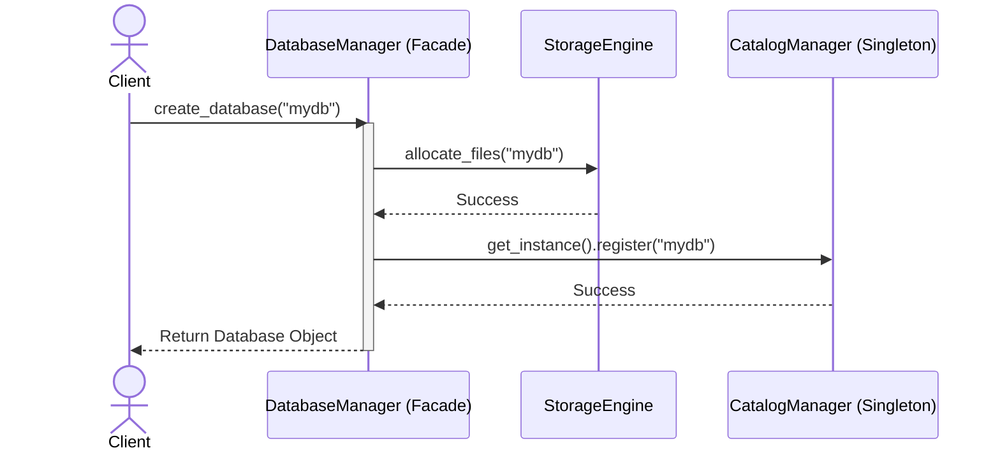
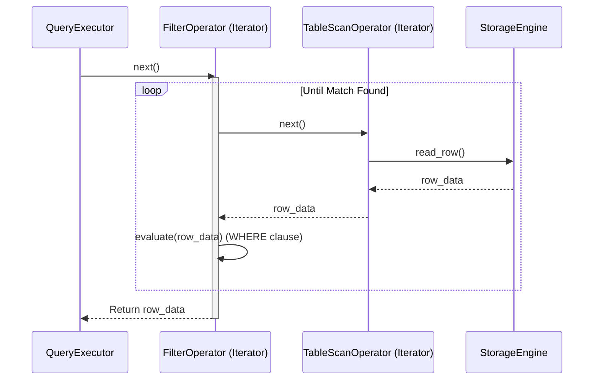
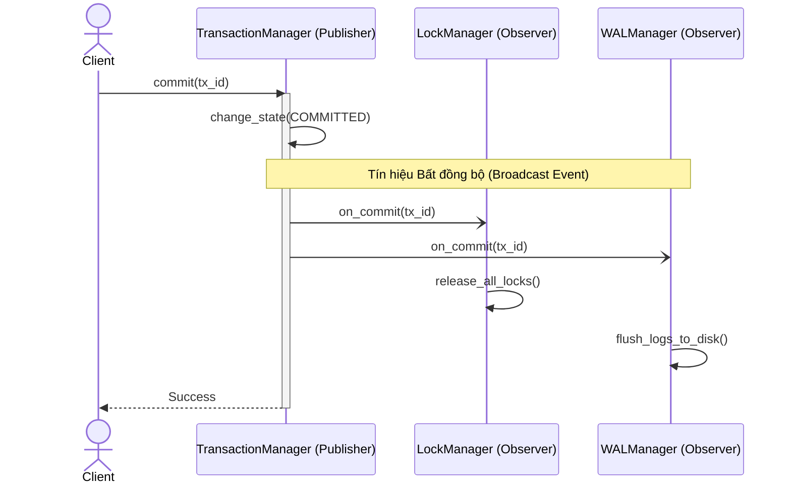
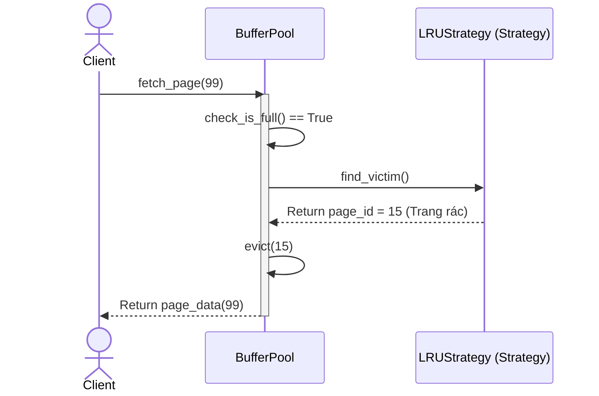
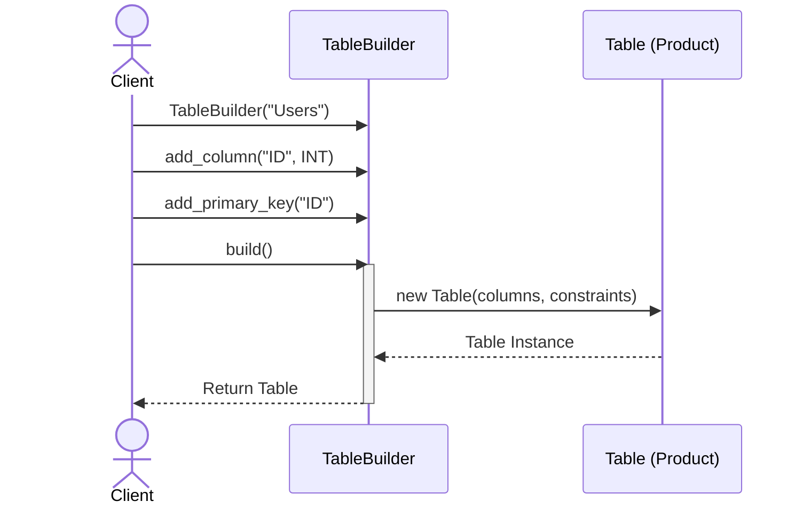

# 📐 Phân tích Design Patterns cho Kiến Trúc DBMS

Dưới đây là tài liệu tổng hợp **duy nhất** về cách áp dụng Design Patterns vào DBMS. Tài liệu đi từ **Bảng tóm tắt trực quan** đến **Sơ đồ tương tác (Sequence)** và **Code minh họa (TDD)** để bạn dễ dàng nắm bắt.

---

## 📊 1. Bảng Tóm Tắt (Độ ưu tiên giảm dần)

| Feature (Tính năng) | Pattern áp dụng | Vấn đề cần giải quyết | Giải pháp cốt lõi (Ý tưởng) |
| :--- | :--- | :--- | :--- |
| **1. Database & Catalog**<br/>*(Quản lý hệ thống)* | **Facade** + **Singleton** + **Composite** | 1. Chỉ được có 1 sổ cái duy nhất.<br/>2. Lệnh tạo DB quá phức tạp (cấp đĩa, quyền).<br/>3. Xóa DB phải xóa đệ quy con cháu. | - **Singleton:** Giữ `CatalogManager` độc bản.<br/>- **Facade:** Dùng `DatabaseManager` làm mặt tiền che giấu sự phức tạp.<br/>- **Composite:** Tổ chức DB -> Schema -> Table thành cấu trúc cây. |
| **2. Query Execution**<br/>*(Xử lý truy vấn)* | **Iterator**<br/>*(Volcano Model)* | Làm sao duyệt bảng có 1 tỷ dòng mà không bị tràn bộ nhớ RAM (OOM)? | Ép tất cả toán tử (Scan, Filter, Join) giao tiếp với nhau bằng hàm `next()`. Dữ liệu sẽ nhích lên từng dòng một giống như băng chuyền. |
| **3. Transaction**<br/>*(Quản lý giao dịch)* | **Observer** | Làm sao báo cho LockManager nhả khóa và BufferPool ghi Log ngay khi Commit mà không bị dính mã (Coupling)? | Cho LockManager và BufferPool "đăng ký theo dõi" TransactionManager. Khi TX chốt xong, nó hô to "Sự kiện Commit", Observers tự động phản ứng. |
| **4. Cache Eviction**<br/>*(Quản lý Buffer Pool)* | **Strategy** | Khi RAM đầy, thuật toán đuổi trang ra khỏi RAM có thể thay đổi liên tục (LRU, Clock) tùy cấu hình máy. | Đóng gói từng thuật toán đuổi trang thành các Strategy riêng. Khởi tạo BufferPool với Strategy nào thì nó xài thuật toán đó. |
| **5. Create Table**<br/>*(Định nghĩa cấu trúc)* | **Builder** | Object Table có rất nhiều thành phần phức tạp (Column, PK, FK...) làm constructor quá dài và dễ nhầm lẫn. | Xây dựng Table từng bước một thông qua các hàm dây chuyền (Fluent API) thay vì ném một cục tham số vào constructor. |

---

## 🔍 2. Phân tích chi tiết từng Pattern (Sơ đồ & Code)

### 🧩 2.1. Mẫu Facade + Singleton (Quản lý Database)
**Mục đích:** Khi người dùng muốn tạo Database, họ chỉ giao tiếp với `DatabaseManager` (Facade). Facade sẽ đi gọi Storage Engine cấp ổ cứng, và gọi `CatalogManager` (Singleton) để ghi vào sổ cái.

**Sơ đồ Tương tác (Sequence):**


**Code Minh họa:**
```python
# SINGLETON: Cuốn sổ cái duy nhất của Server
class CatalogManager:
    _instance = None
    def __new__(cls):
        if cls._instance is None:
            cls._instance = super().__new__(cls)
            cls._instance.databases = {}
        return cls._instance

# FACADE: Che giấu sự phức tạp
class DatabaseManager:
    def create_database(self, name):
        db = Database(name)
        StorageEngine.allocate_files_for(name)  
        CatalogManager().register(db)           
        return db
```

---

### 🧩 2.2. Mẫu Iterator / Volcano (Thực thi Truy vấn)
**Mục đích:** Xử lý Big Data. Dữ liệu chảy ngược lên giống như hiệu ứng Domino mà không cần nạp toàn bộ Bảng vào danh sách (List).

**Sơ đồ Tương tác (Sequence):**


**Code Minh họa:**
```python
class FilterOperator(PhysicalOperator):
    def next(self):
        while True:
            # Nhích băng chuyền lên 1 dòng từ toán tử bên dưới
            row = self.child_operator.next()
            if row is None: 
                return None # Hết dữ liệu
            # Trả về cho Executor nếu thỏa mãn điều kiện
            if self.condition.evaluate(row): 
                return row
```

---

### 🧩 2.3. Mẫu Observer (Quản lý Giao dịch)
**Mục đích:** Đảm bảo hệ thống phản ứng nhanh nhạy khi Transaction Commit/Rollback mà không bị hard-code gọi vòng vo.

**Sơ đồ Tương tác (Sequence):**


**Code Minh họa:**
```python
class TransactionManager:
    def commit_tx(self, tx_id):
        # ... xử lý dữ liệu ...
        # Phóng sự kiện (Broadcast) cho tất cả Observers đã đăng ký
        for observer in self.observers:
            observer.on_transaction_committed(tx_id)
            
class LockManager(TransactionObserver):
    def on_transaction_committed(self, tx_id):
        # Tự động nhả khóa khi nghe thấy tín hiệu
        self.release_all_locks(tx_id) 
```

---

### 🧩 2.4. Mẫu Strategy (Quản lý Cache)
**Mục đích:** Tách biệt thuật toán tìm "Trang rác" (LRU, LFU, Clock) khỏi logic tương tác ổ cứng của Buffer Pool.

**Sơ đồ Tương tác (Sequence):**


**Code Minh họa:**
```python
class BufferPool:
    def __init__(self, strategy: PageReplacementStrategy):
        self.strategy = strategy # Tiêm chiến lược vào (vd: LRUStrategy)
        
    def fetch_page(self, page_id):
        if self.is_full():
            # Delegate (Ủy quyền) cho Strategy tìm trang cần đuổi
            victim_page = self.strategy.find_victim() 
            self.evict(victim_page)
```

---

### 🧩 2.5. Mẫu Builder (Khởi tạo Cấu trúc Bảng)
**Mục đích:** Khởi tạo bảng sạch sẽ và an toàn bằng các hàm xâu chuỗi (Fluent API) thay vì ném hàng chục tham số vào hàm `__init__`.

**Sơ đồ Tương tác (Sequence):**


**Code Minh họa:**
```python
# Thay vì viết: Table("Users", [col1, col2], [pk], [fk])
# Sử dụng Builder Pattern:
table = (TableBuilder("Users")
            .add_column("id", DataType.INT)
            .add_column("name", DataType.VARCHAR)
            .add_primary_key("id")
            .build())
```
