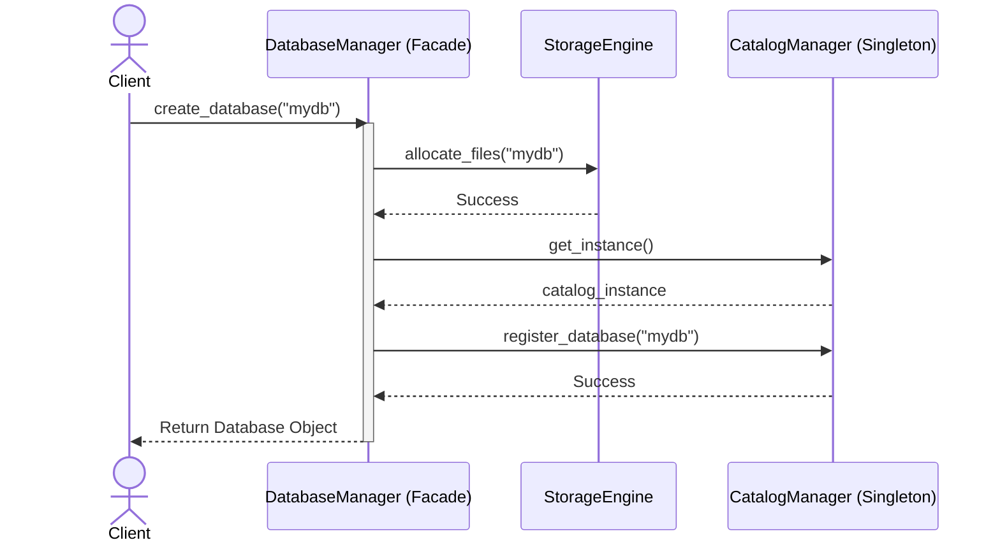
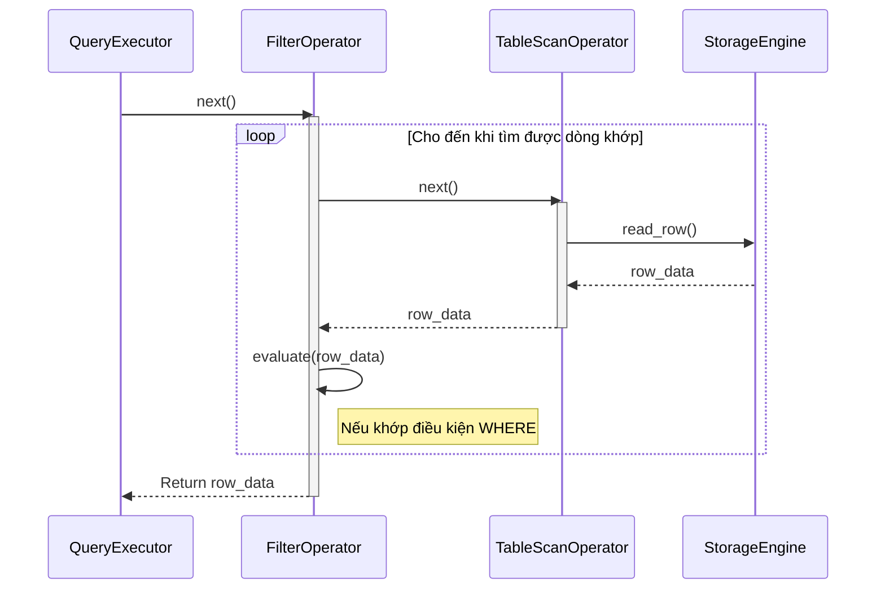
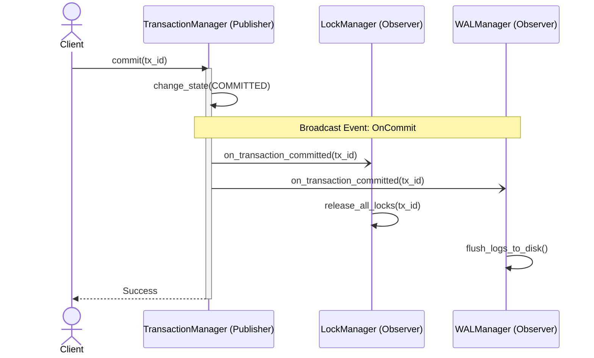
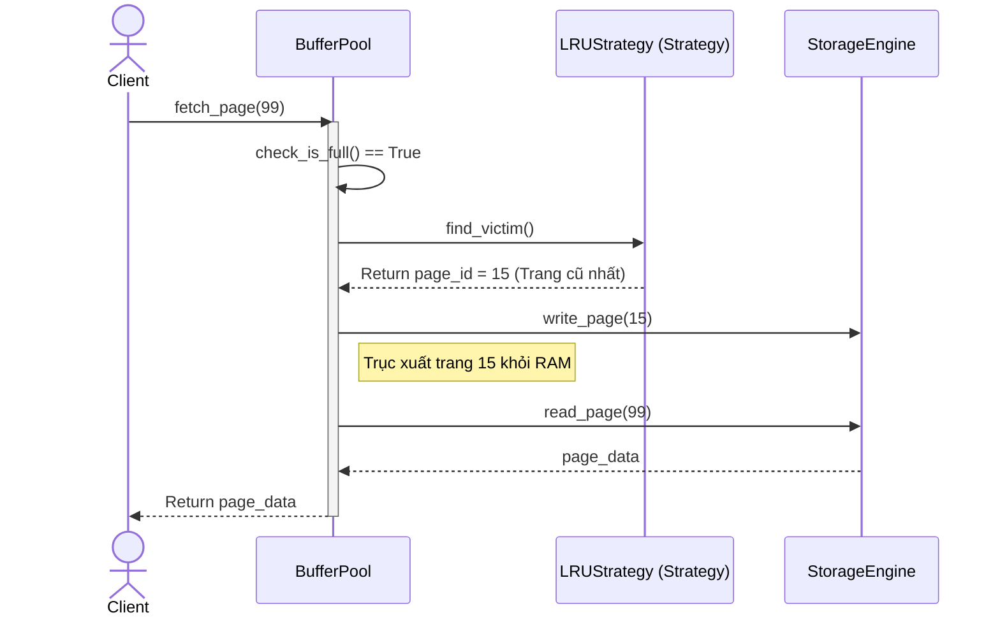
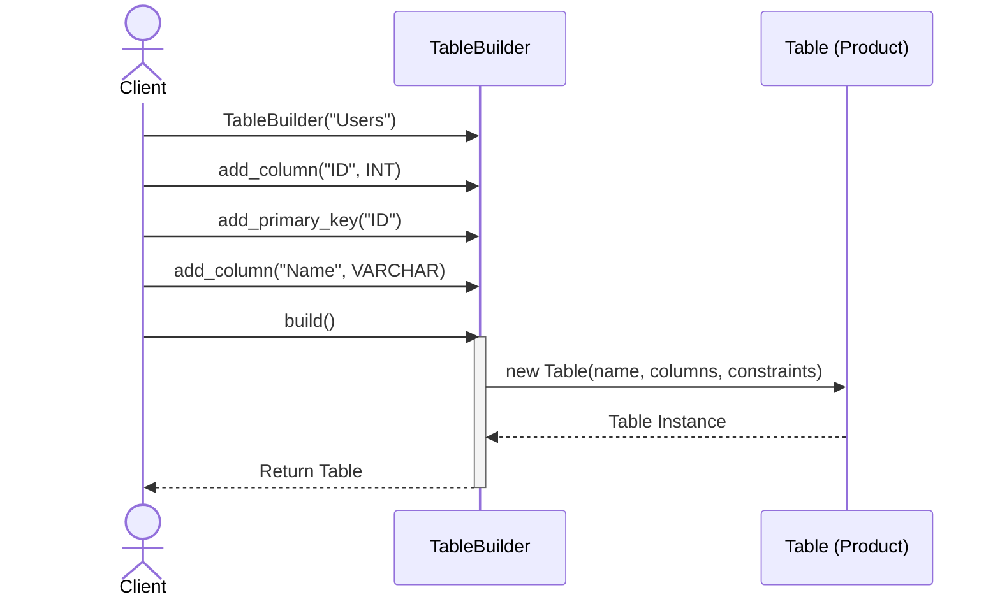

# 📐 Sơ đồ Tuần tự (Sequence Diagram) áp dụng Design Patterns cho DBMS

Tài liệu này ánh xạ trực tiếp từ **Mindmap Features**, **Classes** và **Test Cases** để đưa ra cách triển khai 5 Design Patterns quan trọng nhất. Mỗi Pattern được minh họa bằng một **Sequence Diagram** (Sơ đồ tuần tự) chi tiết.

---

## 1. Mẫu Facade + Singleton (Tính năng Quản lý Database)

*   **Mindmap Feature:** Database Object Management -> Database Management
*   **Classes:** `DatabaseManager` (Facade), `CatalogManager` (Singleton), `StorageEngine`
*   **Test Case liên quan:** `CreateDatabase_WhenNameIsValid_CreatesMetadataAndFiles`

**Ý nghĩa & Cách sử dụng:** 
Khi tạo DB, client không cần gọi từng Subsystem rời rạc. Client chỉ gọi Facade (`DatabaseManager`). Facade sẽ lo việc lấy `CatalogManager` độc bản (Singleton) để ghi sổ cái và gọi Storage để tạo file.

### 🔄 Sequence Diagram

**Phân tích:** 
Sơ đồ chứng minh `DatabaseManager` che giấu hoàn toàn sự phức tạp (Facade). Client không hề biết sự tồn tại của `StorageEngine` hay `CatalogManager`. Sổ cái `CatalogManager` được gọi qua hàm `get_instance()` để đảm bảo tính Singleton.

---

## 2. Mẫu Iterator / Volcano (Tính năng Thực thi Truy vấn)

*   **Mindmap Feature:** Query Processor -> Query Execution
*   **Classes:** `QueryExecutor`, `FilterOperator`, `TableScanOperator`
*   **Test Case liên quan:** `ExecutePlan_WhenValidPhysicalPlan_IteratesAndYieldsResults`

**Ý nghĩa & Cách sử dụng:** 
Đảm bảo hệ thống xử lý được 1 tỷ dòng dữ liệu mà không tràn RAM. Các Node trong cây truy vấn sẽ gọi hàm `next()` của nhau để lấy dữ liệu **từng dòng một (tuple-at-a-time)**.

### 🔄 Sequence Diagram

**Phân tích:** 
Nhờ Iterator Pattern, vòng lặp (loop) được đẩy xuống sâu nhất có thể. Dữ liệu chảy ngược lên giống như hiệu ứng Domino (Volcano) mà không cần nạp toàn bộ Bảng vào danh sách List.

---

## 3. Mẫu Observer (Tính năng Quản lý Giao dịch)

*   **Mindmap Feature:** Transaction -> Transaction Manager
*   **Classes:** `TransactionManager` (Publisher), `LockManager` (Subscriber), `BufferPool` (Subscriber)
*   **Test Case liên quan:** `Commit_WhenSuccessful_WritesToLogAndChangesState`

**Ý nghĩa & Cách sử dụng:** 
`TransactionManager` không gọi trực tiếp các hệ thống con để tránh "Hard-code". Khi Transaction hoàn tất, nó phát tín hiệu (Broadcast). `LockManager` nghe thấy sẽ tự động nhả khóa.

### 🔄 Sequence Diagram

**Phân tích:** 
Sử dụng tín hiệu bất đồng bộ (mũi tên đứt `-)`). `TransactionManager` không cần chờ Observers thực thi xong, giúp quá trình Commit diễn ra cực kỳ nhanh chóng và tách bạch logic (Decoupling).

---

## 4. Mẫu Strategy (Tính năng Quản lý Cache)

*   **Mindmap Feature:** Storage Engine -> Buffer Pool + Cache
*   **Classes:** `BufferPool`, `PageReplacementStrategy` (Interface), `LRUStrategy`
*   **Test Case liên quan:** `FetchPage_WhenPoolFull_EvictsUnpinnedPage`

**Ý nghĩa & Cách sử dụng:** 
Khi RAM đầy, hệ thống cần đẩy bớt dữ liệu rác ra ổ cứng. `BufferPool` không tự viết thuật toán tìm trang rác, mà nó ủy quyền (delegate) việc đó cho một Strategy.

### 🔄 Sequence Diagram

**Phân tích:** 
Sơ đồ cho thấy rõ sự phân công lao động. `BufferPool` lo việc tương tác I/O với Disk, còn tính toán não bộ "Đuổi ai?" là do `LRUStrategy` phụ trách. Bạn có thể dễ dàng rút `LRUStrategy` ra và cắm `ClockStrategy` vào mà không phá hỏng luồng này.

---

## 5. Mẫu Builder (Tính năng Khởi tạo Bảng)

*   **Mindmap Feature:** Database Object Management -> Table Management
*   **Classes:** `TableBuilder`, `Table`, `Column`, `Constraint`
*   **Test Case liên quan:** `CreateTable_WhenValidTable_RegistersInSchema`

**Ý nghĩa & Cách sử dụng:** 
Bảng (Table) là một tổ hợp rất rối rắm gồm cột, khóa chính, khóa ngoại. Dùng Builder giúp xâu chuỗi (fluent interface) việc khởi tạo từng bước một trước khi đúc ra sản phẩm cuối cùng.

### 🔄 Sequence Diagram

**Phân tích:** 
Sơ đồ thể hiện quá trình "tích lũy" thông số trên `TableBuilder`. Chỉ đến khi Client gọi hàm `build()`, đối tượng `Table` thực sự mới được đẻ ra. Luồng này giúp đảm bảo `Table` không bị tạo ra ở trạng thái lỗi (ví dụ thiếu cột mà đã có Constraint).
