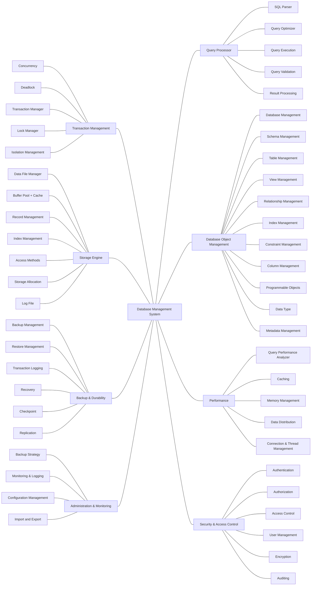

```mermaid
flowchart LR
    DBMS[Database Management System]


    Concurrency[Concurrency] --- Transaction[Transaction Management]
    Deadlock[Deadlock] --- Transaction
    TxnManager[Transaction Manager] --- Transaction
    LockManager[Lock Manager] --- Transaction
    Isolation[Isolation Management] --- Transaction
    Transaction --- DBMS

    DataFile[Data File Manager] --- Storage[Storage Engine]
    BufferPool[Buffer Pool + Cache] --- Storage
    RecordMgmt[Record Management] --- Storage
    StorageIndexMgmt[Index Management] --- Storage
    AccessMethods[Access Methods] --- Storage
    StorageAlloc[Storage Allocation] --- Storage
    LogFile[Log File] --- Storage
    Storage --- DBMS

    BackupMgmt[Backup Management] --- Backup[Backup & Durability]
    RestoreMgmt[Restore Management] --- Backup
    TxnLogging[Transaction Logging] --- Backup
    Recovery[Recovery] --- Backup
    Checkpoint[Checkpoint] --- Backup
    Replication[Replication] --- Backup
    Backup --- DBMS

    BackupStrategy[Backup Strategy] --- Admin[Administration & Monitoring]
    Monitoring[Monitoring & Logging] --- Admin
    ConfigMgmt[Configuration Management] --- Admin
    ImportExport[Import and Export] --- Admin
    Admin --- DBMS


    DBMS --- QP[Query Processor]
    QP --- Parser[SQL Parser]
    QP --- Optimizer[Query Optimizer]
    QP --- Execution[Query Execution]
    QP --- Validation[Query Validation]
    QP --- Result[Result Processing]

    DBMS --- DBObject[Database Object Management]
    DBObject --- DBMgmt[Database Management]
    DBObject --- SchemaMgmt[Schema Management]
    DBObject --- TableMgmt[Table Management]
    DBObject --- ViewMgmt[View Management]
    DBObject --- RelMgmt[Relationship Management]
    DBObject --- DBObjIndexMgmt[Index Management]
    DBObject --- ConstraintMgmt[Constraint Management]
    DBObject --- ColumnMgmt[Column Management]
    DBObject --- ProgObjects[Programmable Objects]
    DBObject --- DataType[Data Type]
    DBObject --- MetaMgmt[Metadata Management]

    DBMS --- Perf[Performance]
    Perf --- PerfAnalyzer[Query Performance Analyzer]
    Perf --- Caching[Caching]
    Perf --- MemMgmt[Memory Management]
    Perf --- DataDist[Data Distribution]
    Perf --- ConnThread[Connection & Thread Management]

    DBMS --- Security[Security & Access Control]
    Security --- Auth[Authentication]
    Security --- Authorization[Authorization]
    Security --- AccessCtrl[Access Control]
    Security --- UserMgmt[User Management]
    Security --- Encryption[Encryption]
    Security --- Auditing[Auditing]

    style DBMS fill:#e6e6ff,stroke:#b3b3ff,stroke-width:2px
    style Transaction fill:#e6e6ff,stroke:#b3b3ff,stroke-width:2px
    style Storage fill:#e6e6ff,stroke:#b3b3ff,stroke-width:2px
    style Backup fill:#e6e6ff,stroke:#b3b3ff,stroke-width:2px
    style Admin fill:#e6e6ff,stroke:#b3b3ff,stroke-width:2px
    style QP fill:#e6e6ff,stroke:#b3b3ff,stroke-width:2px
    style DBObject fill:#e6e6ff,stroke:#b3b3ff,stroke-width:2px
    style Perf fill:#e6e6ff,stroke:#b3b3ff,stroke-width:2px
    style Security fill:#e6e6ff,stroke:#b3b3ff,stroke-width:2px
```
