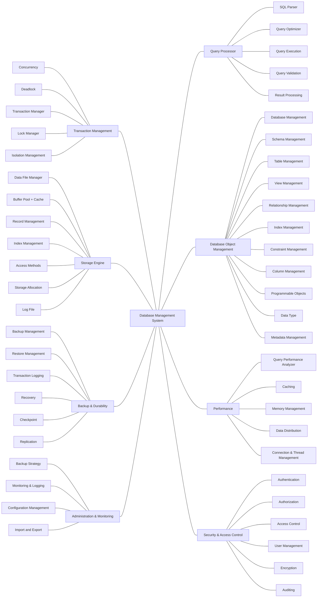
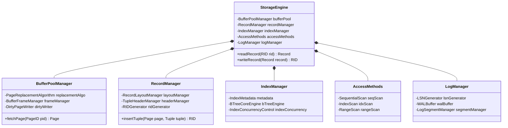
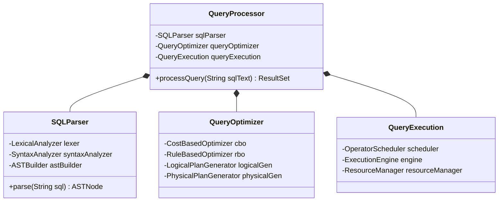
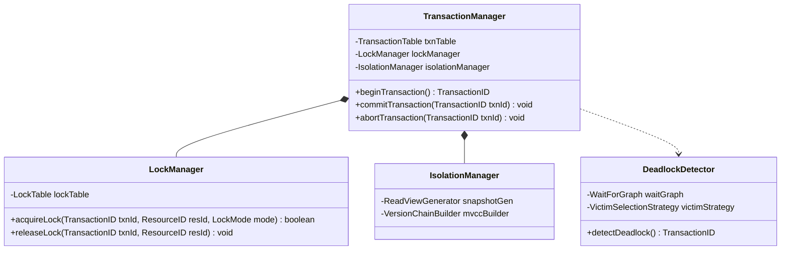

# DBMS Architecture Design

This project is a comprehensive, high-level object-oriented design and implementation plan for a modern Database Management System (DBMS). It serves as a foundational blueprint that covers all critical subsystems, adhering to SOLID principles and applying design patterns.

## 🏗️ System Architecture

The DBMS is modularized into several core components, each handling a specific domain of database operations:

- **Storage Engine**: Manages the Buffer Pool, Data Files, Records, Indexes, and WAL (Write-Ahead Logging).
- **Query Processor**: Handles SQL Parsing, Query Optimization (Cost/Rule-based), and Query Execution.
- **Transaction Management**: Ensures ACID properties via Lock Management, Deadlock Detection, and Concurrency Control.
- **Database Object Management**: Manages schemas, tables, views, columns, and constraints.
- **Security & Access Control**: Manages Users, Roles, Authentication, Authorization (RBAC/DAC), and Encryption.
- **Backup & Durability**: Handles full/incremental backups, point-in-time recovery, crash recovery, and checkpointing.
- **Performance**: Manages memory allocation, caching, query performance analysis, and connection pooling.
- **Administration & Monitoring**: Collects system metrics, profiles slow queries, and manages dynamic configurations.

## 🧠 Mind Map

Below is the mind map illustrating the layered architecture of the DBMS.

### Mindmap (Text Representation)

## 📐 Class Diagrams

The detailed UML Class Diagrams defining the entities, properties, and relationships within each subsystem:

```mermaid
classDiagram
    %% Core DBMS Architecture
    class DBMS {
        -QueryProcessor queryProcessor
        -StorageEngine storageEngine
        -TransactionManager transactionManager
        -DatabaseObjectManager objectManager
        -SecurityManager securityManager
        -RecoveryManager recoveryManager
        +startSystem() void
        +stopSystem() void
        +executeStatement(String sql) ResultSet
    }

    %% -----------------------------------------
    %% Query Processor Subsystem
    %% -----------------------------------------
    class QueryProcessor {
        -SQLParser sqlParser
        -QueryOptimizer queryOptimizer
        -QueryExecution queryExecution
        +processQuery(String sqlText) ResultSet
    }

    class SQLParser {
        -LexicalAnalyzer lexer
        -SyntaxAnalyzer syntaxAnalyzer
        -ASTBuilder astBuilder
        +parse(String sql) ASTNode
    }

    class QueryOptimizer {
        -CostBasedOptimizer cbo
        -RuleBasedOptimizer rbo
        -LogicalPlanGenerator logicalGen
        -PhysicalPlanGenerator physicalGen
        +optimizePlan(ASTNode astTree) PhysicalPlan
    }

    class QueryExecution {
        -OperatorScheduler scheduler
        -ExecutionEngine engine
        -ResourceManager resourceManager
        +executePlan(PhysicalPlan plan) ResultSet
    }

    %% -----------------------------------------
    %% Storage Engine Subsystem
    %% -----------------------------------------
    class StorageEngine {
        -BufferPoolManager bufferPool
        -RecordManager recordManager
        -IndexManager indexManager
        -AccessMethods accessMethods
        -StorageAllocationCoordinator storageAllocator
        -LogManager logManager
        +readRecord(RID rid) Record
        +writeRecord(Record record) RID
        +deleteRecord(RID rid) void
    }

    class BufferPoolManager {
        -PageReplacementAlgorithm replacementAlgo
        -BufferFrameManager frameManager
        -DirtyPageWriter dirtyWriter
        +fetchPage(PageID pid) Page
        +pinPage(PageID pid) void
        +unpinPage(PageID pid, boolean isDirty) void
        +flushAllPages() void
    }

    class PageReplacementAlgorithm {
        <<interface>>
        +findVictim() PageID
        +pin(PageID pid) void
        +unpin(PageID pid) void
    }

    class RecordManager {
        -RecordLayoutManager layoutManager
        -TupleHeaderManager headerManager
        -RIDGenerator ridGenerator
        +insertTuple(Page page, Tuple tuple) RID
        +updateTuple(RID rid, Tuple newTuple) void
    }

    class IndexManager {
        -IndexMetadata metadata
        -BTreeCoreEngine bTreeEngine
        -IndexConcurrencyControl indexConcurrency
        +createIndex(String idxName, String tableName, String colName) void
        +search(Key key) List~RID~
    }

    class AccessMethods {
        -SequentialScan seqScan
        -IndexScan idxScan
        -RangeScan rangeScan
        +scan(TableID tableId) Iterator
    }

    class LogManager {
        -LSNGenerator lsnGenerator
        -WALBuffer walBuffer
        -LogSegmentManager segmentManager
        +appendLogRecord(LogRecord log) LSN
        +flushLogToDisk() void
    }

    %% -----------------------------------------
    %% Transaction Subsystem
    %% -----------------------------------------
    class TransactionManager {
        -TransactionTable txnTable
        -LockManager lockManager
        -IsolationManager isolationManager
        +beginTransaction() TransactionID
        +commitTransaction(TransactionID txnId) void
        +abortTransaction(TransactionID txnId) void
    }

    class LockManager {
        -LockTable lockTable
        +acquireLock(TransactionID txnId, ResourceID resId, LockMode mode) boolean
        +releaseLock(TransactionID txnId, ResourceID resId) void
    }

    class DeadlockDetector {
        -WaitForGraph waitGraph
        -VictimSelectionStrategy victimStrategy
        +detectDeadlock() TransactionID
        +resolveDeadlock(TransactionID victimTxn) void
    }

    class IsolationManager {
        -ReadViewGenerator snapshotGen
        -VersionChainBuilder mvccBuilder
        +getVisibleVersion(TransactionID txnId, Record record) Record
    }

    %% -----------------------------------------
    %% Database Object Management
    %% -----------------------------------------
    class DatabaseObjectManager {
        -DatabaseCatalogManager catalogManager
        -SchemaManager schemaManager
        -TableManager tableManager
        -ViewManager viewManager
        -ConstraintManager constraintManager
        +createObject(DDLStatement ddl) void
        +dropObject(DDLStatement ddl) void
    }

    class TableManager {
        -TableCreator tableCreator
        -PhysicalFileRegistration fileRegistry
        +createTable(TableSchema schema) void
        +alterTable(String name, AlterCommand cmd) void
    }

    class ConstraintManager {
        -PrimaryKeyValidator pkValidator
        -UniqueConstraintManager ukManager
        -CheckConstraintEvaluator checkEvaluator
        +validateConstraints(Record record) boolean
    }

    %% -----------------------------------------
    %% Backup & Durability
    %% -----------------------------------------
    class RecoveryManager {
        -CrashRecoveryManager crashRecovery
        -CheckpointerDaemon checkpointer
        -RestoreManager restoreManager
        +initiateRecovery() void
        +createCheckpoint() void
    }

    class CrashRecoveryManager {
        -REDOLogApplier redoApplier
        -UNDOLogApplier undoApplier
        +analyzePhase() void
        +redoPhase() void
        +undoPhase() void
    }

    class CheckpointerDaemon {
        -FuzzyCheckpointController fuzzyController
        -DirtyPageFlushCoordinator flushCoordinator
        +triggerCheckpoint() void
    }

    %% -----------------------------------------
    %% Security & Access Control
    %% -----------------------------------------
    class SecurityManager {
        -Authentication authModule
        -AccessControl accessControlModule
        -UserCatalog userCatalog
        +authenticateUser(Credentials creds) SessionToken
        +authorizeAction(SessionToken token, Resource res, Action act) boolean
    }

    class AccessControl {
        -RBACPolicyEvaluator rbacEvaluator
        -DACEvaluator dacEvaluator
        -RowLevelSecurityFilter rlsFilter
        +evaluatePermissions(User user, Resource res) boolean
    }

    %% -----------------------------------------
    %% Dependencies and Relationships
    %% -----------------------------------------
    DBMS *-- QueryProcessor
    DBMS *-- StorageEngine
    DBMS *-- TransactionManager
    DBMS *-- DatabaseObjectManager
    DBMS *-- SecurityManager
    DBMS *-- RecoveryManager

    QueryProcessor *-- SQLParser
    QueryProcessor *-- QueryOptimizer
    QueryProcessor *-- QueryExecution

    StorageEngine *-- BufferPoolManager
    StorageEngine *-- RecordManager
    StorageEngine *-- IndexManager
    StorageEngine *-- AccessMethods
    StorageEngine *-- LogManager

    BufferPoolManager o-- PageReplacementAlgorithm
    
    TransactionManager *-- LockManager
    TransactionManager *-- IsolationManager
    TransactionManager ..> DeadlockDetector

    RecoveryManager *-- CrashRecoveryManager
    RecoveryManager *-- CheckpointerDaemon

    DatabaseObjectManager *-- TableManager
    DatabaseObjectManager *-- ConstraintManager

    SecurityManager *-- AccessControl

    %% Cross-Subsystem Dependencies
    QueryExecution ..> StorageEngine
    QueryExecution ..> TransactionManager
    StorageEngine ..> LogManager
    CrashRecoveryManager ..> LogManager
    AccessMethods ..> BufferPoolManager
    TransactionManager ..> LogManager
```

## 🧪 Test-Driven Development (TDD)

The implementation follows a **Test-Driven Development (TDD)** methodology. 

- `Classes/`: Contains the skeleton classes with properties and empty methods (`pass`) corresponding to the structural design.
- `Tests/`: Contains the unit tests for each class, testing both happy paths and failure paths. Currently, all tests will naturally fail as the internal logic in the classes is yet to be fully implemented.

## 🔍 Subsystem Class Diagrams

Below are the detailed, isolated class diagrams for the most critical subsystems for better readability.

### 1. Storage Engine Subsystem

### 2. Query Processor Subsystem

### 3. Transaction Management Subsystem

