# DBMS Architecture Design

This project is a comprehensive, high-level object-oriented design and implementation plan for a modern Database Management System (DBMS).

##  System Architecture


##  Mind Map

Below is the mind map illustrating the layered architecture of the DBMS.


### Mindmap (Text)

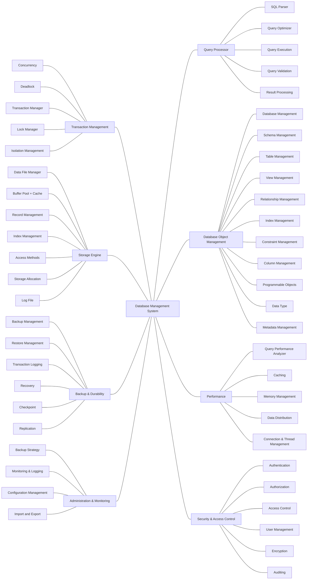
```mermaid
flowchart LR
    %% Root Node
    DBMS[Database Management System]

    %% -----------------------------------------
    %% LEFT SIDE BRANCHES (Child --- Parent --- DBMS)
    %% -----------------------------------------

    %% Transaction Branch (Left)
    Concurrency[Concurrency] --- Transaction[Transaction Management]
    Deadlock[Deadlock] --- Transaction
    TxnManager[Transaction Manager] --- Transaction
    LockManager[Lock Manager] --- Transaction
    Isolation[Isolation Management] --- Transaction
    Transaction --- DBMS

    %% Storage Engine Branch (Left)
    DataFile[Data File Manager] --- Storage[Storage Engine]
    BufferPool[Buffer Pool + Cache] --- Storage
    RecordMgmt[Record Management] --- Storage
    StorageIndexMgmt[Index Management] --- Storage
    AccessMethods[Access Methods] --- Storage
    StorageAlloc[Storage Allocation] --- Storage
    LogFile[Log File] --- Storage
    Storage --- DBMS

    %% Backup & Durability Branch (Left)
    BackupMgmt[Backup Management] --- Backup[Backup & Durability]
    RestoreMgmt[Restore Management] --- Backup
    TxnLogging[Transaction Logging] --- Backup
    Recovery[Recovery] --- Backup
    Checkpoint[Checkpoint] --- Backup
    Replication[Replication] --- Backup
    Backup --- DBMS

    %% Administration & Monitoring Branch (Left)
    BackupStrategy[Backup Strategy] --- Admin[Administration & Monitoring]
    Monitoring[Monitoring & Logging] --- Admin
    ConfigMgmt[Configuration Management] --- Admin
    ImportExport[Import and Export] --- Admin
    Admin --- DBMS

    %% -----------------------------------------
    %% RIGHT SIDE BRANCHES (DBMS --- Parent --- Child)
    %% -----------------------------------------

    %% Query Processor Branch (Right)
    DBMS --- QP[Query Processor]
    QP --- Parser[SQL Parser]
    QP --- Optimizer[Query Optimizer]
    QP --- Execution[Query Execution]
    QP --- Validation[Query Validation]
    QP --- Result[Result Processing]

    %% Database Object Management Branch (Right)
    DBMS --- DBObject[Database Object Management]
    DBObject --- DBMgmt[Database Management]
    DBObject --- SchemaMgmt[Schema Management]
    DBObject --- TableMgmt[Table Management]
    DBObject --- ViewMgmt[View Management]
    DBObject --- RelMgmt[Relationship Management]
    DBObject --- DBObjIndexMgmt[Index Management]
    DBObject --- ConstraintMgmt[Constraint Management]
    DBObject --- ColumnMgmt[Column Management]
    DBObject --- ProgObjects[Programmable Objects]
    DBObject --- DataType[Data Type]
    DBObject --- MetaMgmt[Metadata Management]

    %% Performance Branch (Right)
    DBMS --- Perf[Performance]
    Perf --- PerfAnalyzer[Query Performance Analyzer]
    Perf --- Caching[Caching]
    Perf --- MemMgmt[Memory Management]
    Perf --- DataDist[Data Distribution]
    Perf --- ConnThread[Connection & Thread Management]

    %% Security & Access Control Branch (Right)
    DBMS --- Security[Security & Access Control]
    Security --- Auth[Authentication]
    Security --- Authorization[Authorization]
    Security --- AccessCtrl[Access Control]
    Security --- UserMgmt[User Management]
    Security --- Encryption[Encryption]
    Security --- Auditing[Auditing]

    %% -----------------------------------------
    %% STYLING
    %% -----------------------------------------
    style DBMS fill:#e6e6ff,stroke:#b3b3ff,stroke-width:2px
    style Transaction fill:#e6e6ff,stroke:#b3b3ff,stroke-width:2px
    style Storage fill:#e6e6ff,stroke:#b3b3ff,stroke-width:2px
    style Backup fill:#e6e6ff,stroke:#b3b3ff,stroke-width:2px
    style Admin fill:#e6e6ff,stroke:#b3b3ff,stroke-width:2px
    style QP fill:#e6e6ff,stroke:#b3b3ff,stroke-width:2px
    style DBObject fill:#e6e6ff,stroke:#b3b3ff,stroke-width:2px
    style Perf fill:#e6e6ff,stroke:#b3b3ff,stroke-width:2px
    style Security fill:#e6e6ff,stroke:#b3b3ff,stroke-width:2px
```

## 🎨 Design Pattern Analysis: Database Object Management


### 1. Database Objects

This group manages the data-constituent components (Schemas, Tables, Constraints...).

| Priority | Feature | Design Pattern | Reason / Context |
| :---: | :--- | :--- | :--- |
| **Highest** | Database Objects | **Composite** | Database contains Schemas, Schema contains Tables/Views, and manages them uniformly. |
| **High** | Constraint Validation | **Template Method** | `Validate()` defines the workflow, each constraint only implements `Check()`. |
| **High** | Object Creation | **Factory Method** | Centralizes instantiation logic for various metadata objects like Indexes and Triggers. |
| **Medium High** | Referential Action | **Strategy** | Selects Cascade, Restrict, SetNull, or SetDefault behavior when deleting/updating. |
| **Medium High** | Schema Cloning | **Prototype** | Enables cloning of an existing Table or Schema structure without creating from scratch. |
| **Medium High** | Privilege Checking | **Chain of Responsibility** | Passes permission checks sequentially from Database -> Schema -> Table levels. |
| **Medium** | DDL Command | **Command** | `CreateTable`, `DropTable`, and `AlterTable` operations are encapsulated into executable objects. |
| **Medium** | Metadata Caching | **Proxy** | Acts as a placeholder for Table definitions to allow lazy-loading from disk. |
| **Medium** | Table Modification | **Decorator** | Dynamically attaches temporary constraints or properties to a Table during execution. |
| **Medium** | Schema Navigation | **Iterator** | Provides sequential access to traverse all objects in a schema transparently. |
| **Medium** | Data Type Sharing | **Flyweight** | Shares common data type instances (e.g., `INT`) across thousands of columns to save RAM. |
| **Medium** | Metadata Snapshot | **Memento** | Captures Table schema state before an `ALTER` operation to allow rollback on failure. |
| **Medium** | View Refreshment | **Strategy** | Allows switching between `Immediate`, `Deferred`, or `OnDemand` view materialization algorithms. |
| **Medium** | Trigger Notification | **Observer** | When a row changes, the Table notifies all attached Triggers to execute their custom logic. |
| **Medium** | Dependency Validation | **Visitor** | Traverses Views and Stored Procedures to check for broken dependencies when a base Table drops. |

### 2. Database Management

This group provides the external interface and manages the database lifecycle.

| Priority | Feature | Design Pattern | Reason / Context |
| :---: | :--- | :--- | :--- |
| **Highest** | Catalog Management | **Singleton** | Ensures exactly one global registry instance manages all database metadata. |
| **High** | DatabaseServer | **Facade** | Provides a single unified API to start, stop and configure database server. |
| **High** | Server Config | **Builder** | Constructs complex server startup configurations (memory size, thread pool) step by step. |
| **Medium High** | Database Lifecycle | **State** | Database transitions between states such as Offline, Online, ReadOnly, and Recovering. |
| **Medium High** | Database Events | **Observer** | Monitoring systems receive events for Create, Drop, Backup, and Restore. |
| **Medium High** | Connection Pooling | **Object Pool** | Reuses a fixed pool of client connections to avoid costly startup/teardown overhead. |
| **Medium High** | Storage Adapter | **Adapter** | Wraps the native OS file system API into a standard DBMS storage interface. |
| **Medium** | Backup/Restore | **Template Method**| Provides a fixed backup workflow, while differentiating between Full and Incremental. |
| **Medium** | Task Scheduling | **Command** | Encapsulates background tasks (vacuum, statistics gathering) into queueable objects. |
| **Medium** | Perf Monitoring | **Visitor** | Gathers health statistics by visiting various management components without modifying them. |
| **Medium High** | Query Execution | **Iterator** | Employs the Volcano model where physical operators (`Join`, `Filter`) fetch rows via `next()`. |
| **Medium High** | Buffer Eviction | **Strategy** | Encapsulates page replacement algorithms (LRU, Clock, LFU) to allow dynamic switching at runtime. |
| **Medium** | Access Control | **Proxy** | A security proxy intercepts client connections to verify permissions before hitting the actual Database Engine. |
| **Medium** | Config Resolution | **Chain of Responsibility** | Resolves settings by checking session-level, database-level, and global-level configs sequentially. |
| **Medium** | Transaction Savepoint | **Memento** | Stores a snapshot of the transaction's internal state to support partial rollbacks without full aborts. |

---

### Deep Dive Analysis (Class Diagrams & Sequence Diagrams)

Below is a detailed analysis for the deeply evaluated features mentioned above. The structure covers the Reason for choosing the Pattern, static Class Diagrams, dynamic Sequence Diagrams, and TDD Code examples.

#### 1. Composite Pattern: Database Objects (Highest Priority)

*   **Why choose Composite instead of discrete `Lists` or rigid hierarchies?**
    In a DBMS, metadata is naturally hierarchical: A Database contains multiple Schemas, a Schema contains multiple Tables/Views, and a Table contains multiple Columns and Constraints. If we model this using rigid, separate lists (e.g., `List<Table>`, `List<View>`, `List<Constraint>`), we face significant challenges when performing system-wide operations like calculating total storage size, generating a comprehensive DDL export, or traversing the object tree.
    
    Without the Composite pattern, traversing this hierarchy requires tightly coupled code with multiple nested `for` loops and type-checking (e.g., `if (obj instanceof Table)`). 
    
    **The Composite Pattern Solves This By:**
    1. **Uniformity:** It introduces a common interface (`MetadataNode`) for both leaf nodes (Columns, Constraints - which have no children) and composite branches (Database, Schema, Table - which contain children).
    2. **Recursive Traversal:** Operations like `get_metadata()` are delegated down the tree. The client only needs to call `get_metadata()` on the root `Database` object, and the request automatically propagates down to the lowest `Column` or `Constraint` level via recursion.
    3. **Extensibility:** If we later introduce new metadata objects like `Trigger` or `Index`, we simply implement the `MetadataNode` interface. The core traversal logic remains entirely untouched, adhering perfectly to the Open/Closed Principle (OCP).

##### Class Diagram
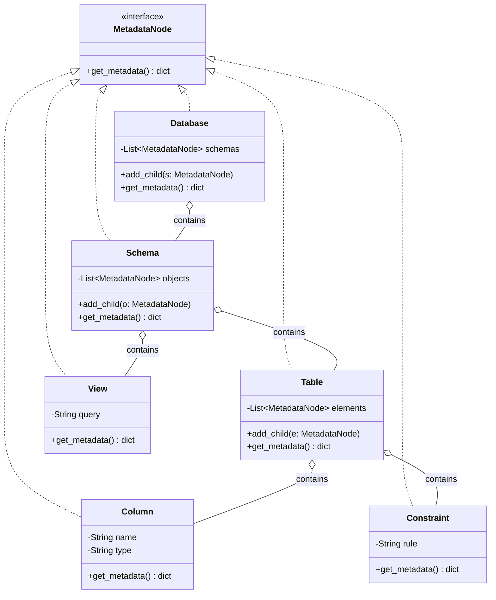
```mermaid
classDiagram
    class MetadataNode {
        <<interface>>
        +get_metadata() dict
    }
    
    class Database {
        -List~MetadataNode~ schemas
        +add_child(s: MetadataNode)
        +get_metadata() dict
    }
    
    class Schema {
        -List~MetadataNode~ objects
        +add_child(o: MetadataNode)
        +get_metadata() dict
    }
    
    class Table {
        -List~MetadataNode~ elements
        +add_child(e: MetadataNode)
        +get_metadata() dict
    }
    
    class View {
        -String query
        +get_metadata() dict
    }
    
    class Column {
        -String name
        -String type
        +get_metadata() dict
    }
    
    class Constraint {
        -String rule
        +get_metadata() dict
    }

    MetadataNode <|.. Database
    MetadataNode <|.. Schema
    MetadataNode <|.. Table
    MetadataNode <|.. View
    MetadataNode <|.. Column
    MetadataNode <|.. Constraint
    
    Database o-- Schema : contains
    Schema o-- Table : contains
    Schema o-- View : contains
    Table o-- Column : contains
    Table o-- Constraint : contains
```

##### Sequence Diagram
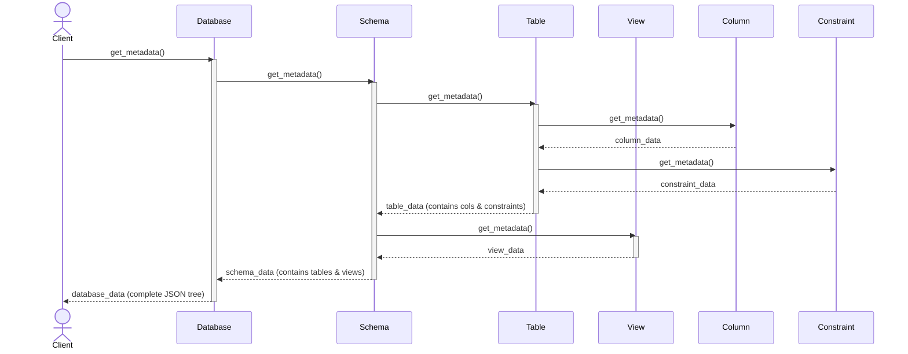
```mermaid
sequenceDiagram
    actor Client
    participant DB as Database
    participant Sch as Schema
    participant Tbl as Table
    participant Vw as View
    participant Col as Column
    participant Cst as Constraint

    Client->>DB: get_metadata()
    activate DB
    
    DB->>Sch: get_metadata()
    activate Sch
    
    %% Processing Table branch
    Sch->>Tbl: get_metadata()
    activate Tbl
    Tbl->>Col: get_metadata()
    Col-->>Tbl: column_data
    Tbl->>Cst: get_metadata()
    Cst-->>Tbl: constraint_data
    Tbl-->>Sch: table_data (contains cols & constraints)
    deactivate Tbl
    
    %% Processing View branch
    Sch->>Vw: get_metadata()
    activate Vw
    Vw-->>Sch: view_data
    deactivate Vw
    
    Sch-->>DB: schema_data (contains tables & views)
    deactivate Sch
    
    DB-->>Client: database_data (complete JSON tree)
    deactivate DB
```

##### TDD Code Example
```python
# All nodes in the tree inherit this interface
class MetadataNode:
    def get_metadata(self): pass

# Composite (Nodes containing children)
class Database(MetadataNode):
    def __init__(self): self.children = []
    def add_child(self, child: MetadataNode): self.children.append(child)
    def get_metadata(self):
        return {"type": "Database", "children": [c.get_metadata() for c in self.children]}

class Schema(MetadataNode):
    def __init__(self): self.children = []
    def add_child(self, child: MetadataNode): self.children.append(child)
    def get_metadata(self):
        return {"type": "Schema", "children": [c.get_metadata() for c in self.children]}

class Table(MetadataNode):
    def __init__(self, name): 
        self.name = name
        self.children = []
    def add_child(self, child: MetadataNode): self.children.append(child)
    def get_metadata(self):
        return {"type": "Table", "name": self.name, "children": [c.get_metadata() for c in self.children]}

# Leaf Nodes (No children)
class View(MetadataNode):
    def __init__(self, name): self.name = name
    def get_metadata(self): return {"type": "View", "name": self.name}

class Column(MetadataNode):
    def __init__(self, name, col_type): 
        self.name = name
        self.col_type = col_type
    def get_metadata(self): return {"type": "Column", "name": self.name, "col_type": self.col_type}

class Constraint(MetadataNode):
    def __init__(self, rule): self.rule = rule
    def get_metadata(self): return {"type": "Constraint", "rule": self.rule}

# --- TEST CODE ---
db = Database()
schema = Schema()
table = Table("Users")
table.add_child(Column("id", "INT"))
table.add_child(Constraint("PRIMARY KEY (id)"))

schema.add_child(table)
schema.add_child(View("ActiveUsers"))
db.add_child(schema)

# One call recursively builds the entire tree
import json
print(json.dumps(db.get_metadata(), indent=2))
```

---

#### 2. Template Method Pattern: Constraint Validation (High Priority)

*   **Why choose Template Method instead of discrete, independent checking functions?**
    A relational database enforces various Constraints (`NotNull`, `Check`, `Unique`, `PrimaryKey`). While the specific business logic for each constraint differs drastically (e.g., `NotNull` just checks memory, whereas `Unique` must query the B-Tree index on disk), the overall validation lifecycle is identical across all of them:
    1. **Pre-processing:** Skip validation if the incoming value is `Null` (unless it's a NotNull constraint itself).
    2. **Core Logic Check:** Perform the actual validation rule (e.g., `value > 0` or `lookup_index()`).
    3. **Post-processing:** Throw a standardized `ConstraintViolationException` if the check fails, ensuring the transaction aborts.

    If we implement these as independent functions, developers must manually copy-paste the pre-processing and post-processing boilerplate into every single constraint class. This leads to code duplication and the dangerous risk of inconsistent error handling (e.g., one constraint throws an error, another accidentally returns a boolean).

    **The Template Method Pattern Solves This By:**
    1. **Inversion of Control (The Hollywood Principle):** The abstract base class (`Constraint`) takes control of the overall algorithm's skeleton via the `validate()` method. It says to the subclasses: "Don't call us, we'll call you."
    2. **Code Reusability:** All boilerplate logic (null checks, exception throwing) is centralized in the base class.
    3. **Strict Enforcement:** The workflow is strictly enforced and cannot be altered by child classes. Subclasses are forced to implement *only* the specific abstract hook method (`check_logic()`), ensuring absolute consistency across the entire database engine.

##### Class Diagram
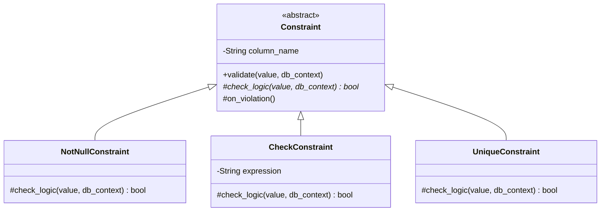
```mermaid
classDiagram
    class Constraint {
        <<abstract>>
        -String column_name
        +validate(value, db_context)
        #check_logic(value, db_context)* bool
        #on_violation()
    }
    
    class NotNullConstraint {
        #check_logic(value, db_context) bool
    }
    
    class CheckConstraint {
        -String expression
        #check_logic(value, db_context) bool
    }
    
    class UniqueConstraint {
        #check_logic(value, db_context) bool
    }

    Constraint <|-- NotNullConstraint
    Constraint <|-- CheckConstraint
    Constraint <|-- UniqueConstraint
```

##### Sequence Diagram
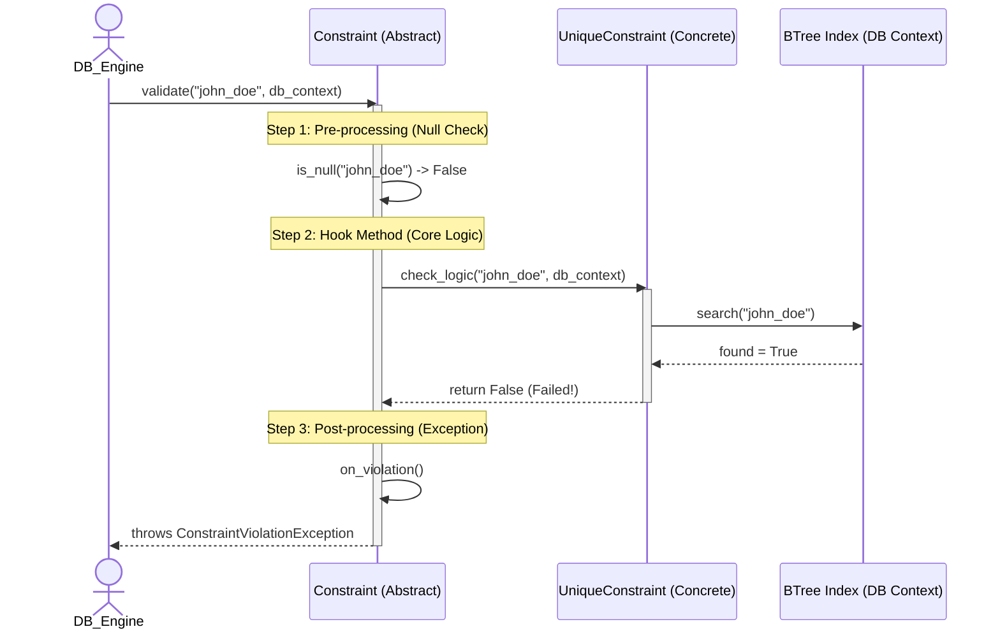
```mermaid
sequenceDiagram
    actor DB_Engine
    participant Base as Constraint (Abstract)
    participant Child as UniqueConstraint (Concrete)
    participant Index as BTree Index (DB Context)

    DB_Engine->>Base: validate("john_doe", db_context)
    activate Base
    
    Note over Base: Step 1: Pre-processing (Null Check)
    Base->>Base: is_null("john_doe") -> False
    
    Note over Base: Step 2: Hook Method (Core Logic)
    Base->>Child: check_logic("john_doe", db_context)
    activate Child
    Child->>Index: search("john_doe")
    Index-->>Child: found = True
    Child-->>Base: return False (Failed!)
    deactivate Child
    
    Note over Base: Step 3: Post-processing (Exception)
    Base->>Base: on_violation()
    Base-->>DB_Engine: throws ConstraintViolationException
    deactivate Base
```

##### TDD Code Example
```python
class ConstraintViolationException(Exception):
    pass

class Constraint:
    def __init__(self, col_name):
        self.col_name = col_name

    def validate(self, value, db_context): 
        # Hard-coded workflow skeleton (Immutable by children)
        if value is None and not isinstance(self, NotNullConstraint): 
            return True # Pre-processing: Skip nulls for standard constraints
            
        if not self.check_logic(value, db_context): # Core Logic Hook
            self.on_violation(value) # Post-processing
            
    def check_logic(self, value, db_context): 
        raise NotImplementedError("Subclasses must implement this hook!")
        
    def on_violation(self, value):
        raise ConstraintViolationException(f"Column '{self.col_name}' violated constraint with value '{value}'!")

class CheckConstraint(Constraint):
    def check_logic(self, value, db_context): 
        return value > 0 # Simple memory check

class UniqueConstraint(Constraint):
    def check_logic(self, value, db_context):
        # Complex DB lookup check
        index_data = db_context.get_index(self.col_name)
        return value not in index_data

class NotNullConstraint(Constraint):
    def check_logic(self, value, db_context):
        return value is not None

# --- TEST CODE ---
class MockDBContext:
    def get_index(self, col): return ["admin", "root"]

db_context = MockDBContext()

# Test 1: Unique Constraint
unique_username = UniqueConstraint("username")
unique_username.validate("new_user", db_context) # Passes successfully

try:
    unique_username.validate("admin", db_context) # Fails
except Exception as e:
    print(e) # Output: Column 'username' violated constraint with value 'admin'!

# Test 2: Check Constraint (skips Null properly)
age_check = CheckConstraint("age")
age_check.validate(None, db_context) # Passes immediately (Nulls allowed)
```

---

## 3. Chain of Responsibility Pattern: Privilege Checking (Medium High Priority)

*   **Why choose Chain of Responsibility instead of massive `if/else` checks?**
    In a DBMS, checking if a user has permission to execute a query (like `SELECT * FROM schema.table`) is highly layered. The database engine must sequentially check:
    1. Does the user have access to the Database?
    2. Does the user have access to the Schema?
    3. Does the user have `SELECT` privilege on the Table?
    4. (Optional) Does the user have access to specific Columns (Column-Level Security)?
    
    If we hardcode this in a single `SecurityManager` class with nested `if/else`, the code becomes incredibly bloated and brittle. Adding a new security layer (e.g., Row-Level Security or IP Address restrictions) would force us to modify the core security engine, violating the Open/Closed Principle.

    **The Chain of Responsibility Pattern Solves This By:**
    1. **Decoupling:** Each security check is encapsulated into its own distinct, lightweight Handler class (`DatabasePrivilegeHandler`, `SchemaPrivilegeHandler`).
    2. **Sequential Chaining:** Handlers are linked together. The request passes through the chain one by one. If one handler denies access, it breaks the chain immediately and throws a "Permission Denied" error. If it allows access, it automatically passes the request to the next handler.
    3. **Dynamic Configuration:** You can dynamically insert or remove security layers at runtime (e.g., enabling Column-Level Security only for the Enterprise edition) simply by rearranging the chain, without altering any core logic.

### Class Diagram
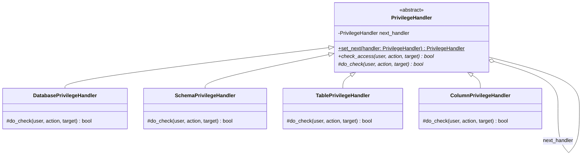
```mermaid
classDiagram
    class PrivilegeHandler {
        <<abstract>>
        -PrivilegeHandler next_handler
        +set_next(handler: PrivilegeHandler)$ PrivilegeHandler
        +check_access(user, action, target)* bool
        #do_check(user, action, target)* bool
    }
    
    class DatabasePrivilegeHandler {
        #do_check(user, action, target) bool
    }
    
    class SchemaPrivilegeHandler {
        #do_check(user, action, target) bool
    }
    
    class TablePrivilegeHandler {
        #do_check(user, action, target) bool
    }
    
    class ColumnPrivilegeHandler {
        #do_check(user, action, target) bool
    }

    PrivilegeHandler o-- PrivilegeHandler : next_handler
    PrivilegeHandler <|-- DatabasePrivilegeHandler
    PrivilegeHandler <|-- SchemaPrivilegeHandler
    PrivilegeHandler <|-- TablePrivilegeHandler
    PrivilegeHandler <|-- ColumnPrivilegeHandler
```

### Sequence Diagram
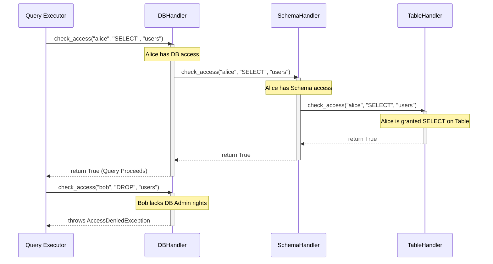
```mermaid
sequenceDiagram
    participant Client as Query Executor
    participant DB as DBHandler
    participant Sch as SchemaHandler
    participant Tbl as TableHandler
    
    Client->>DB: check_access("alice", "SELECT", "users")
    activate DB
    Note over DB: Alice has DB access
    
    DB->>Sch: check_access("alice", "SELECT", "users")
    activate Sch
    Note over Sch: Alice has Schema access
    
    Sch->>Tbl: check_access("alice", "SELECT", "users")
    activate Tbl
    Note over Tbl: Alice is granted SELECT on Table
    Tbl-->>Sch: return True
    deactivate Tbl
    
    Sch-->>DB: return True
    deactivate Sch
    
    DB-->>Client: return True (Query Proceeds)
    deactivate DB
    
    %% Example of Failure
    Client->>DB: check_access("bob", "DROP", "users")
    activate DB
    Note over DB: Bob lacks DB Admin rights
    DB-->>Client: throws AccessDeniedException
    deactivate DB
```

### TDD Code Example
```python
class AccessDeniedException(Exception):
    pass

class PrivilegeHandler:
    def __init__(self):
        self.next_handler = None
        
    def set_next(self, handler):
        self.next_handler = handler
        return handler # Allows method chaining
        
    def check_access(self, user, action, target):
        # 1. Execute the specific check for this layer
        if not self.do_check(user, action, target):
            raise AccessDeniedException(f"Access Denied at {self.__class__.__name__} for user '{user}'")
        
        # 2. If passed and there's a next handler, delegate down the chain
        if self.next_handler:
            return self.next_handler.check_access(user, action, target)
        
        # 3. If passed and no more handlers, access is fully granted
        return True 
        
    def do_check(self, user, action, target):
        raise NotImplementedError()

# Concrete Handlers
class DatabasePrivilegeHandler(PrivilegeHandler):
    def do_check(self, user, action, target):
        # Business logic: Only 'admin' can perform DROP operations
        if action == "DROP" and user != "admin": return False
        return True

class SchemaPrivilegeHandler(PrivilegeHandler):
    def do_check(self, user, action, target):
        # Business logic: 'guest' users have no access to underlying schemas
        return user != "guest"

class TablePrivilegeHandler(PrivilegeHandler):
    def do_check(self, user, action, target):
        # Business logic: 'alice' has SELECT rights, but no UPDATE rights
        if user == "alice" and action == "UPDATE": return False
        return True

# ---

---

 TEST CODE ---
# 1. Build the Security Chain dynamically
security_chain = DatabasePrivilegeHandler()
security_chain.set_next(SchemaPrivilegeHandler()).set_next(TablePrivilegeHandler())

# 2. Test Cases
# Test A: Alice tries to SELECT (Passes all 3 layers)
print(security_chain.check_access("alice", "SELECT", "users")) # Output: True

# Test B: Alice tries to UPDATE (Fails at Layer 3: TablePrivilegeHandler)
try:
    security_chain.check_access("alice", "UPDATE", "users")
except Exception as e:
    print(e) # Output: Access Denied at TablePrivilegeHandler for user 'alice'

# Test C: Bob tries to DROP (Fails immediately at Layer 1: DatabasePrivilegeHandler)
try:
    security_chain.check_access("bob", "DROP", "users")
except Exception as e:
    print(e) # Output: Access Denied at DatabasePrivilegeHandler for user 'bob'
```

---

## 4. Factory Method Pattern: Object Creation (High Priority)

*   **Why choose Factory Method instead of direct instantiation (`new Index()`)?**
    In a DBMS, creating objects like Indexes, Triggers, or Partitions often depends on the specific engine configuration, the chosen algorithm (e.g., B-Tree vs Hash for indexes), and involves complex initialization (allocating disk pages, registering with catalogs). If we let the `Table` class directly instantiate `BTreeIndex` or `HashIndex` via `if/else`, the `Table` class becomes tightly coupled to specific storage implementations. Adding a new index type (like `BitmapIndex`) would require modifying the core `Table` class, violating the Open/Closed Principle.
    
    **The Factory Method Pattern Solves This By:**
    1. **Decoupling:** The `Table` class delegates the creation of the index to a Factory interface. It doesn't need to know the concrete class of the index being created.
    2. **Encapsulation of Initialization:** The Factory hides all the complex setup logic (e.g., checking memory limits, allocating storage, writing to the system catalog) in one place.
    3. **Extensibility:** To add a new index type, we simply extend the factory logic or create a new factory subclass, leaving the core `Table` operations completely untouched.

### Class Diagram
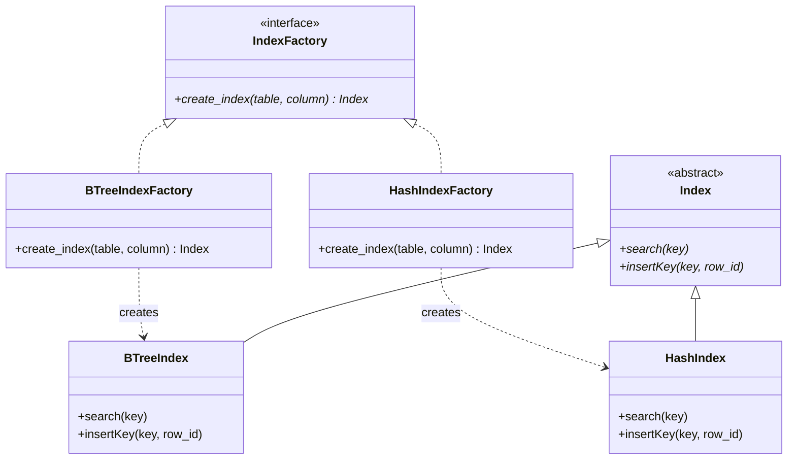
```mermaid
classDiagram
    class IndexFactory {
        <<interface>>
        +create_index(table, column)* Index
    }
    
    class BTreeIndexFactory {
        +create_index(table, column) Index
    }
    
    class HashIndexFactory {
        +create_index(table, column) Index
    }
    
    class Index {
        <<abstract>>
        +search(key)*
        +insertKey(key, row_id)*
    }
    
    class BTreeIndex {
        +search(key)
        +insertKey(key, row_id)
    }
    
    class HashIndex {
        +search(key)
        +insertKey(key, row_id)
    }

    IndexFactory <|.. BTreeIndexFactory
    IndexFactory <|.. HashIndexFactory
    BTreeIndexFactory ..> BTreeIndex : creates
    HashIndexFactory ..> HashIndex : creates
    Index <|-- BTreeIndex
    Index <|-- HashIndex
```

### Sequence Diagram
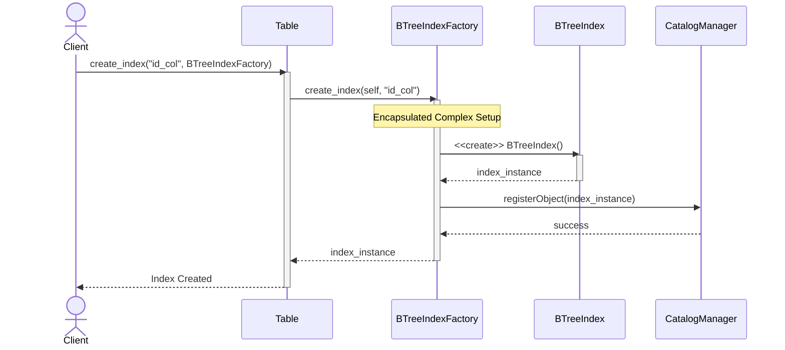
```mermaid
sequenceDiagram
    actor Client
    participant Tbl as Table
    participant Fct as BTreeIndexFactory
    participant Idx as BTreeIndex
    participant Cat as CatalogManager

    Client->>Tbl: create_index("id_col", BTreeIndexFactory)
    activate Tbl
    
    Tbl->>Fct: create_index(self, "id_col")
    activate Fct
    
    Note over Fct: Encapsulated Complex Setup
    Fct->>Idx: <<create>> BTreeIndex()
    activate Idx
    Idx-->>Fct: index_instance
    deactivate Idx
    
    Fct->>Cat: registerObject(index_instance)
    Cat-->>Fct: success
    
    Fct-->>Tbl: index_instance
    deactivate Fct
    
    Tbl-->>Client: Index Created
    deactivate Tbl
```

### TDD Code Example
```python
from abc import ABC, abstractmethod

# The Product Interface
class Index(ABC):
    @abstractmethod
    def search(self, key): pass

# Concrete Products
class BTreeIndex(Index):
    def __init__(self, table_name, column_name):
        self.type = "BTREE"
        print(f"Allocating B-Tree nodes for {table_name}.{column_name}")
        
    def search(self, key): pass

class HashIndex(Index):
    def __init__(self, table_name, column_name):
        self.type = "HASH"
        print(f"Allocating Hash buckets for {table_name}.{column_name}")
        
    def search(self, key): pass

# The Factory Interface
class IndexFactory(ABC):
    @abstractmethod
    def create_index(self, table_name, column_name) -> Index:
        pass
        
    def register_index(self, index: Index):
        # Centralized post-creation logic (e.g. catalog registration)
        print(f"Registering {index.type} index in System Catalog...")

# Concrete Factories
class BTreeIndexFactory(IndexFactory):
    def create_index(self, table_name, column_name) -> Index:
        index = BTreeIndex(table_name, column_name)
        self.register_index(index)
        return index

class HashIndexFactory(IndexFactory):
    def create_index(self, table_name, column_name) -> Index:
        index = HashIndex(table_name, column_name)
        self.register_index(index)
        return index

# --- TEST CODE ---
# The client/table decides WHICH factory to use, but depends on the interface
def create_table_index(table_name, column_name, factory: IndexFactory):
    return factory.create_index(table_name, column_name)

idx1 = create_table_index("users", "id", BTreeIndexFactory())
# Output: Allocating B-Tree nodes for users.id
# Output: Registering BTREE index in System Catalog...

idx2 = create_table_index("sessions", "token", HashIndexFactory())
# Output: Allocating Hash buckets for sessions.token
# Output: Registering HASH index in System Catalog...
```

---

## 5. Strategy Pattern: Referential Action (Medium High Priority)

*   **Why choose Strategy instead of massive `switch/case` inside `ForeignKey`?**
    When a referenced row in a parent table is deleted or updated, a Foreign Key constraint must enforce referential integrity. Standard SQL allows several actions: `CASCADE` (delete child rows), `RESTRICT` (block the deletion), `SET NULL` (nullify child keys), and `SET DEFAULT`. 
    If we put all these behaviors into a single `on_violation()` method inside the `ForeignKey` class with a giant `if/elif/else` block, the class becomes bloated. Testing each cascading behavior in isolation also becomes difficult.

    **The Strategy Pattern Solves This By:**
    1. **Behavior Encapsulation:** Each referential action (`CascadeAction`, `RestrictAction`, `SetNullAction`) is encapsulated into its own class implementing a common `ReferentialAction` interface.
    2. **Runtime Interchangeability:** A `ForeignKey` is composed of a `ReferentialAction` object. The action can be dynamically assigned when the constraint is defined.
    3. **Single Responsibility Principle:** The `ForeignKey` class focuses only on detecting the relationship change. The specific `ReferentialAction` class focuses purely on executing the consequent cascading operation.

### Class Diagram
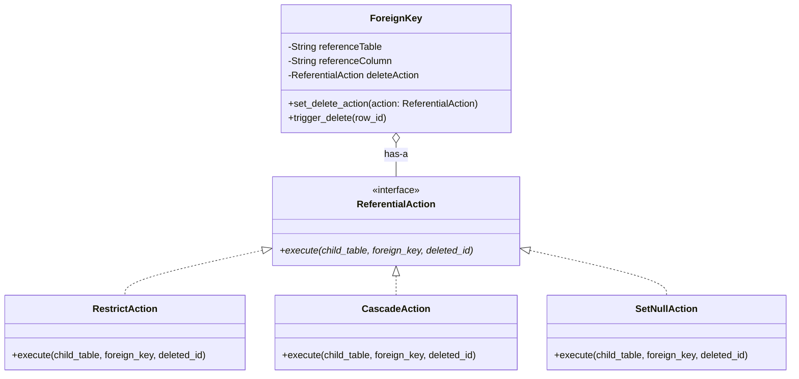
```mermaid
classDiagram
    class ForeignKey {
        -String referenceTable
        -String referenceColumn
        -ReferentialAction deleteAction
        +set_delete_action(action: ReferentialAction)
        +trigger_delete(row_id)
    }
    
    class ReferentialAction {
        <<interface>>
        +execute(child_table, foreign_key, deleted_id)*
    }
    
    class RestrictAction {
        +execute(child_table, foreign_key, deleted_id)
    }
    
    class CascadeAction {
        +execute(child_table, foreign_key, deleted_id)
    }
    
    class SetNullAction {
        +execute(child_table, foreign_key, deleted_id)
    }

    ForeignKey o-- ReferentialAction : has-a
    ReferentialAction <|.. RestrictAction
    ReferentialAction <|.. CascadeAction
    ReferentialAction <|.. SetNullAction
```

### Sequence Diagram
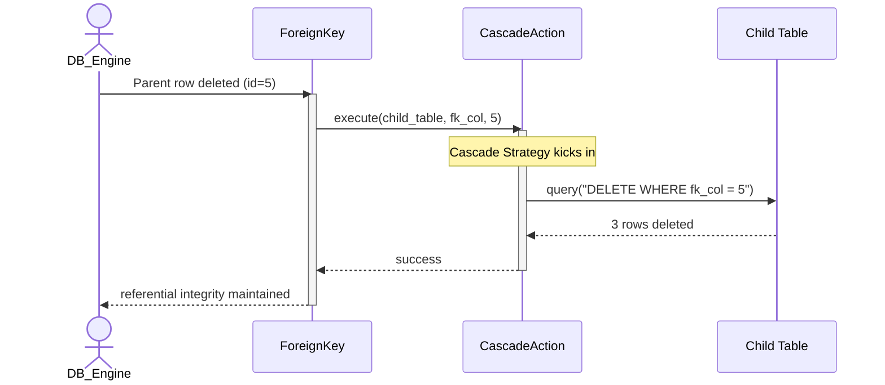
```mermaid
sequenceDiagram
    actor DB_Engine
    participant FK as ForeignKey
    participant Strat as CascadeAction
    participant ChildDB as Child Table

    DB_Engine->>FK: Parent row deleted (id=5)
    activate FK
    
    FK->>Strat: execute(child_table, fk_col, 5)
    activate Strat
    
    Note over Strat: Cascade Strategy kicks in
    Strat->>ChildDB: query("DELETE WHERE fk_col = 5")
    ChildDB-->>Strat: 3 rows deleted
    
    Strat-->>FK: success
    deactivate Strat
    
    FK-->>DB_Engine: referential integrity maintained
    deactivate FK
```

### TDD Code Example
```python
# The Strategy Interface
class ReferentialAction:
    def execute(self, child_table, fk_col, deleted_id):
        pass

# Concrete Strategies
class RestrictAction(ReferentialAction):
    def execute(self, child_table, fk_col, deleted_id):
        # Check if children exist; if yes, abort!
        child_rows = child_table.get(fk_col, deleted_id)
        if child_rows:
            raise Exception("RESTRICT: Cannot delete parent row. Child records exist.")
        print("RESTRICT: No child records found. Safe to delete.")

class CascadeAction(ReferentialAction):
    def execute(self, child_table, fk_col, deleted_id):
        # Delete children silently
        print(f"CASCADE: Deleting all rows in child table where {fk_col} = {deleted_id}")

class SetNullAction(ReferentialAction):
    def execute(self, child_table, fk_col, deleted_id):
        # Nullify children
        print(f"SET NULL: Setting {fk_col} to NULL in child table where {fk_col} = {deleted_id}")

# The Context
class ForeignKey:
    def __init__(self, ref_table, ref_col):
        self.ref_table = ref_table
        self.ref_col = ref_col
        self.delete_action = RestrictAction() # Default Strategy

    def set_delete_action(self, action: ReferentialAction):
        self.delete_action = action

    def trigger_delete(self, child_table_mock, deleted_id):
        # Delegates the behavior to the injected strategy
        self.delete_action.execute(child_table_mock, self.ref_col, deleted_id)

# --- TEST CODE ---
# Mocking a child table for testing
class MockChildTable:
    def get(self, col, val):
        return [1, 2] # Simulating that children DO exist

child_db = MockChildTable()
fk_constraint = ForeignKey("users", "user_id")

# Test 1: Default RESTRICT behavior
print("Testing RESTRICT:")
try:
    fk_constraint.trigger_delete(child_db, deleted_id=10)
except Exception as e:
    print(e) # Output: RESTRICT: Cannot delete parent row. Child records exist.

# Test 2: Swap strategy to CASCADE at runtime
print("\nTesting CASCADE:")
fk_constraint.set_delete_action(CascadeAction())
fk_constraint.trigger_delete(child_db, deleted_id=10)
# Output: CASCADE: Deleting all rows in child table where user_id = 10

# Test 3: Swap strategy to SET NULL at runtime
print("\nTesting SET NULL:")
fk_constraint.set_delete_action(SetNullAction())
fk_constraint.trigger_delete(child_db, deleted_id=10)
```

---

## 6. Iterator Pattern: Query Execution (Volcano Model) (High Priority)

*   **Why choose Iterator instead of fetching all data into memory at once?**
    When a database executes a query like `SELECT * FROM users JOIN orders`, it must process massive amounts of data. If the `Join` operator processes everything and returns a giant list to the `Filter` operator, it could consume gigabytes of RAM and crash the server (Out-Of-Memory).
    
    **The Iterator Pattern (Volcano Model) Solves This By:**
    1. **Pipelining:** Every physical execution operator (`TableScan`, `Filter`, `HashJoin`) implements a standard Iterator interface with a `next()` method.
    2. **Streaming Execution:** Data is pulled up the tree one row (or batch) at a time. The root node calls `next()`, which trickles down to the leaf node.
    3. **Low Memory Footprint:** Since rows are streamed lazily, only a small number of rows reside in memory at any given time, allowing the DBMS to process datasets much larger than RAM.

### Class Diagram
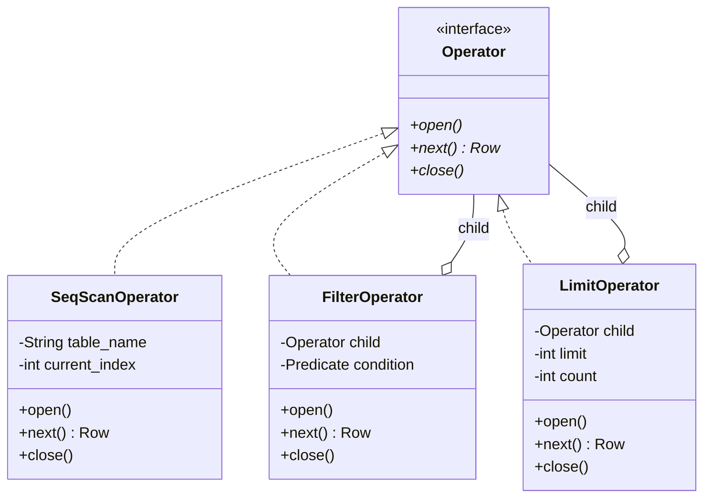
```mermaid
classDiagram
    class Operator {
        <<interface>>
        +open()*
        +next()* Row
        +close()*
    }
    
    class SeqScanOperator {
        -String table_name
        -int current_index
        +open()
        +next() Row
        +close()
    }
    
    class FilterOperator {
        -Operator child
        -Predicate condition
        +open()
        +next() Row
        +close()
    }
    
    class LimitOperator {
        -Operator child
        -int limit
        -int count
        +open()
        +next() Row
        +close()
    }

    Operator <|.. SeqScanOperator
    Operator <|.. FilterOperator
    Operator <|.. LimitOperator
    FilterOperator o-- Operator : child
    LimitOperator o-- Operator : child
```

### TDD Code Example
```python
from abc import ABC, abstractmethod

class Operator(ABC):
    @abstractmethod
    def open(self): pass
    @abstractmethod
    def next(self): pass
    @abstractmethod
    def close(self): pass

class SeqScanOperator(Operator):
    def __init__(self, data):
        self.data = data
        self.cursor = 0
        
    def open(self): self.cursor = 0
    def next(self):
        if self.cursor < len(self.data):
            row = self.data[self.cursor]
            self.cursor += 1
            return row
        return None
    def close(self): pass

class FilterOperator(Operator):
    def __init__(self, child_op, predicate):
        self.child = child_op
        self.predicate = predicate
        
    def open(self): self.child.open()
    def next(self):
        while True:
            row = self.child.next()
            if row is None: return None
            if self.predicate(row): return row # Passes the filter
    def close(self): self.child.close()

class LimitOperator(Operator):
    def __init__(self, child_op, limit):
        self.child = child_op
        self.limit = limit
        self.count = 0
        
    def open(self):
        self.child.open()
        self.count = 0
        
    def next(self):
        if self.count >= self.limit: return None
        row = self.child.next()
        if row is not None: self.count += 1
        return row
    def close(self): self.child.close()

# --- TEST CODE ---
# Simulating a physical query plan: SELECT * FROM users WHERE age > 18 LIMIT 2
raw_data = [
    {"id": 1, "age": 15},
    {"id": 2, "age": 22},
    {"id": 3, "age": 30},
    {"id": 4, "age": 12},
    {"id": 5, "age": 25}
]

scan = SeqScanOperator(raw_data)
filter_op = FilterOperator(scan, lambda r: r["age"] > 18)
limit_op = LimitOperator(filter_op, 2)

# Execution Engine Engine loop (Pull-based)
limit_op.open()
while True:
    row = limit_op.next()
    if row is None: break
    print(f"Fetched Row: {row}")
limit_op.close()
# Output:
# Fetched Row: {'id': 2, 'age': 22}
# Fetched Row: {'id': 3, 'age': 30}
```


## 📐 Class Diagrams


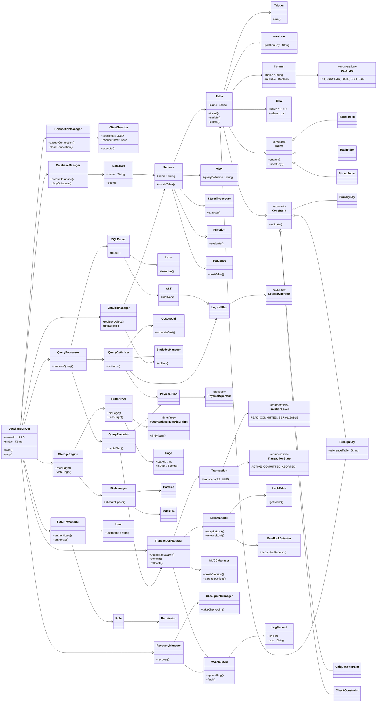
```mermaid
classDiagram
direction LR

%% 1. Core Server & Connections
class DatabaseServer {
    +serverId : UUID
    +status : String
    +start()
    +stop()
}
class ConnectionManager {
    +acceptConnection()
    +closeConnection()
}
class ClientSession {
    +sessionId : UUID
    +connectTime : Date
    +execute()
}

%% 2. Database & Schema
class DatabaseManager {
    +createDatabase()
    +dropDatabase()
}
class Database {
    +name : String
    +open()
}
class Schema {
    +name : String
    +createTable()
}
class CatalogManager {
    +registerObject()
    +findObject()
}

%% 3. Objects
class Table {
    +name : String
    +insert()
    +update()
    +delete()
}
class View {
    +queryDefinition : String
}
class StoredProcedure {
    +execute()
}
class Function {
    +evaluate()
}
class Sequence {
    +nextValue()
}
class Trigger {
    +fire()
}
class Partition {
    +partitionKey : String
}

%% 4. Table Internals
class Column {
    +name : String
    +nullable : Boolean
}
class Row {
    +rowId : UUID
    +values : List
}
class DataType {
    <<enumeration>>
    INT, VARCHAR, DATE, BOOLEAN
}

%% 5. Constraints
class Constraint {
    <<abstract>>
    +validate()
}
class PrimaryKey
class ForeignKey {
    +referenceTable : String
}
class UniqueConstraint
class CheckConstraint

%% 6. Indexes
class Index {
    <<abstract>>
    +search()
    +insertKey()
}
class BTreeIndex
class HashIndex
class BitmapIndex

%% 7. Query Processing
class QueryProcessor {
    +processQuery()
}
class SQLParser {
    +parse()
}
class Lexer {
    +tokenize()
}
class AST {
    +rootNode
}
class QueryOptimizer {
    +optimize()
}
class CostModel {
    +estimateCost()
}
class StatisticsManager {
    +collect()
}
class LogicalPlan
class LogicalOperator {
    <<abstract>>
}
class PhysicalPlan
class PhysicalOperator {
    <<abstract>>
}
class QueryExecutor {
    +executePlan()
}

%% 8. Transactions
class TransactionManager {
    +beginTransaction()
    +commit()
    +rollback()
}
class Transaction {
    +transactionId : UUID
}
class IsolationLevel {
    <<enumeration>>
    READ_COMMITTED, SERIALIZABLE
}
class TransactionState {
    <<enumeration>>
    ACTIVE, COMMITTED, ABORTED
}
class LockManager {
    +acquireLock()
    +releaseLock()
}
class LockTable {
    +getLocks()
}
class DeadlockDetector {
    +detectAndResolve()
}
class MVCCManager {
    +createVersion()
    +garbageCollect()
}

%% 9. Storage & Buffer
class StorageEngine {
    +readPage()
    +writePage()
}
class BufferPool {
    +pinPage()
    +flushPage()
}
class PageReplacementAlgorithm {
    <<interface>>
    +findVictim()
}
class Page {
    +pageId : Int
    +isDirty : Boolean
}
class FileManager {
    +allocateSpace()
}
class DataFile
class IndexFile

%% 10. Recovery & Logging
class RecoveryManager {
    +recover()
}
class CheckpointManager {
    +takeCheckpoint()
}
class WALManager {
    +appendLog()
    +flush()
}
class LogRecord {
    +lsn : Int
    +type : String
}

%% 11. Security
class SecurityManager {
    +authenticate()
    +authorize()
}
class User {
    +username : String
}
class Role
class Permission

%% --- RELATIONSHIPS ---

DatabaseServer --> ConnectionManager
DatabaseServer --> DatabaseManager
DatabaseServer --> QueryProcessor
DatabaseServer --> TransactionManager
DatabaseServer --> StorageEngine
DatabaseServer --> SecurityManager
DatabaseServer --> CatalogManager
DatabaseServer --> RecoveryManager

ConnectionManager --> ClientSession

DatabaseManager --> Database
Database --> Schema
Schema --> Table
Schema --> View
Schema --> StoredProcedure
Schema --> Function
Schema --> Sequence

Table --> Column
Table --> Row
Table --> Index
Table --> Constraint
Table --> Partition
Table --> Trigger

Column --> DataType

Constraint <|-- PrimaryKey
Constraint <|-- ForeignKey
Constraint <|-- UniqueConstraint
Constraint <|-- CheckConstraint

Index <|-- BTreeIndex
Index <|-- HashIndex
Index <|-- BitmapIndex

ForeignKey --> Table

QueryProcessor --> SQLParser
QueryProcessor --> QueryOptimizer
QueryProcessor --> QueryExecutor

SQLParser --> Lexer
SQLParser --> AST
AST --> LogicalPlan
LogicalPlan --> LogicalOperator

QueryOptimizer --> LogicalPlan
QueryOptimizer --> CostModel
QueryOptimizer --> StatisticsManager
QueryOptimizer --> PhysicalPlan
PhysicalPlan --> PhysicalOperator

QueryExecutor --> PhysicalPlan
QueryExecutor --> TransactionManager

TransactionManager --> Transaction
TransactionManager --> LockManager
TransactionManager --> MVCCManager
TransactionManager --> WALManager

Transaction --> IsolationLevel
Transaction --> TransactionState

LockManager --> LockTable
LockManager --> DeadlockDetector

StorageEngine --> BufferPool
StorageEngine --> FileManager
BufferPool --> Page
BufferPool --> PageReplacementAlgorithm
FileManager --> DataFile
FileManager --> IndexFile

RecoveryManager --> WALManager
RecoveryManager --> CheckpointManager

WALManager --> LogRecord

CatalogManager --> Schema
CatalogManager --> StatisticsManager

SecurityManager --> User
SecurityManager --> Role
Role --> Permission
```

### 🌟 Expanded Class Diagram 



```mermaid
classDiagram
direction LR

%% 1. Core Server & Connections
class DatabaseServer {
    +serverId : UUID
    +status : String
    +start()
    +stop()
    +catalogManager
    +config : Configuration
    +connectionManager
    +databaseManager
    +healthCheck()
    +restart()
    +status()
}
class ConnectionManager {
    +acceptConnection()
    +closeConnection()
    +MAX_LIMIT : Int
    +activeConnections : List
    +isPaused : Bool
    +broadcastMessage()
    +cleanup()
    +getActiveSessions()
    +killSession()
}
class ClientSession {
    +sessionId : UUID
    +connectTime : Date
    +execute()
    +TIMEOUT : Int
    +connectTime : DateTime
    +sessionVariables : Dict
    +getSessionVariable()
    +ping()
    +setSessionVariable()
}

%% 2. Database & Schema
class DatabaseManager {
    +createDatabase()
    +dropDatabase()
    +getDatabase()
    +listDatabases()
    +renameDatabase()
}
class MetadataNode {
    <<interface>>
    +get_metadata() dict
}
class Database {
    +name : String
    -children : List~MetadataNode~
    +open()
    +contextData
    +schemaDict : Dict
    +close()
    +createSchema()
    +getSchema()
    +add_child(node: MetadataNode)
    +get_metadata() dict
}
class Schema {
    +name : String
    -children : List~MetadataNode~
    +createTable()
    +tables : Dict
    +dropTable()
    +getTable()
    +listTables()
    +validate()
    +add_child(node: MetadataNode)
    +get_metadata() dict
}
class CatalogManager {
    +registerObject()
    +findObject()
    +catalogDict : Dict
    +flushCatalog()
    +loadCatalog()
    +removeObject()
    +updateObject()
}

%% 3. Objects
class Table {
    +name : String
    -children : List~MetadataNode~
    +insert()
    +update()
    +delete()
    +columns : List
    +rows : List
    +addColumn()
    +dropColumn()
    +getRowCount()
    +renameColumn()
    +truncate()
    +add_child(node: MetadataNode)
    +get_metadata() dict
}
class View {
    +queryDefinition : String
    -name : String
    -query : String
    +materializedData : Cache
    +compileView()
    +materialize()
    +refresh()
    +get_metadata() dict
}
class StoredProcedure {
    +execute()
    +parameters : List
    +compile()
    +drop()
}
class Function {
    +evaluate()
    +arguments : List
    +isDeterministic()
}
class Sequence {
    +nextValue()
    +currentValue : Int
    +maxValue : Int
    +step : Int
    +currentValue()
    +reset()
}
class Trigger {
    +fire()
    +action
    +eventCondition
    +isActive : Bool
    +disable()
    +enable()
    +validate()
}
class Partition {
    +partitionKey : String
    +maxValue
    +minValue
    +partitionKey
    +checkBoundary()
    +merge()
    +split()
}

%% 4. Table Internals
class Column {
    +name : String
    -type : String
    +nullable : Boolean
    +dataType
    +defaultValue
    +isNullable : Bool
    +changeType()
    +setDefaultValue()
    +validateNullable()
    +validateType()
    +get_metadata() dict
}
class Row {
    +rowId : UUID
    +values : List
    +deserialize()
    +getSize()
    +getValue()
    +serialize()
    +setValue()
}
class DataType {
    <<enumeration>>
    INT, VARCHAR, DATE, BOOLEAN
    +getSize()
    +isVariableLength()
    +parseString()
}

%% 5. Constraints
class Constraint {
    <<abstract>>
    -column_name : String
    -rule : String
    +validate(value, db_context)
    #check_logic(value, db_context) bool
    #on_violation(value)
    +get_metadata() dict
}
class PrimaryKey
class ForeignKey {
    +referenceTable : String
    +onDeleteAction
    +referenceColumn
    +referenceTable
    +onDeleteCascade()
    +onDeleteRestrict()
    +onUpdateCascade()
    +validate()
}
class UniqueConstraint {
    #check_logic(value, db_context) bool
}
class CheckConstraint {
    -expression : String
    #check_logic(value, db_context) bool
}
class NotNullConstraint {
    #check_logic(value, db_context) bool
}

%% 6. Indexes
class Index {
    <<abstract>>
    +search()
    +insertKey()
}
class BTreeIndex
class HashIndex
class BitmapIndex

%% 7. Query Processing
class QueryProcessor {
    +processQuery()
    +explain()
    +prepareStatement()
}
class SQLParser {
    +parse()
}
class Lexer {
    +tokenize()
}
class AST {
    +rootNode
    +clone()
    +countNodes()
    +toSQL()
    +traverse()
}
class QueryOptimizer {
    +optimize()
}
class CostModel {
    +estimateCost()
    +estimateMemoryUsage()
    +updateStatistics()
}
class StatisticsManager {
    +collect()
    +cardinalities : Dict
    +rowCounts : Dict
    +buildHistogram()
    +estimateSelectivity()
    +getStatistics()
    +invalidateStats()
}
class LogicalPlan
class LogicalOperator {
    <<abstract>>
}
class PhysicalPlan
class PhysicalOperator {
    <<abstract>>
}
class QueryExecutor {
    +executePlan()
    +memoryLimit : Int
    +close()
    +initialize()
    +streamResults()
}

%% 8. Transactions
class TransactionManager {
    +beginTransaction()
    +commit()
    +rollback()
    +activeTransactions : Dict
    +walManager
    +forceRollbackAll()
    +getActiveTransactions()
    +resumeTransaction()
    +suspendTransaction()
}
class Transaction {
    +transactionId : UUID
    +heldLocks : List
    +isolationLevel
    +savepoints : List
    +state
    +transactionId
    +addLock()
    +releaseAllLocks()
    +rollbackToSavepoint()
    +setIsolationLevel()
    +setSavepoint()
}
class IsolationLevel {
    <<enumeration>>
    READ_COMMITTED, SERIALIZABLE
}
class TransactionState {
    <<enumeration>>
    ACTIVE, COMMITTED, ABORTED
}
class LockManager {
    +acquireLock()
    +releaseLock()
    +deadlockDetector
    +lockTable
    +downgradeLock()
    +upgradeLock()
}
class LockTable {
    +getLocks()
    +locks : Dict
    +addLock()
    +clear()
    +countLocks()
    +removeLock()
}
class DeadlockDetector {
    +detectAndResolve()
    +timeout : Int
    +waitForGraph
    +buildWaitForGraph()
    +chooseVictim()
    +setTimeout()
}
class MVCCManager {
    +createVersion()
    +garbageCollect()
    +versionChain : List
    +detectWriteConflict()
    +readVersion()
}

%% 9. Storage & Buffer
class StorageEngine {
    +readPage()
    +writePage()
    +allocatePage()
    +deallocatePage()
    +formatDrive()
    +sync()
}
class BufferPool {
    +pinPage()
    +flushPage()
    +maxSize : Int
    +pages : Dict
    +replacementAlgorithm
    +clear()
    +fetchPage()
    +getHitRate()
    +unpinPage()
}
class PageReplacementAlgorithm {
    <<interface>>
    +findVictim()
}
class Page {
    +pageId : Int
    +isDirty : Boolean
    +isDirty : Bool
    +pageId
    +pinCount : Int
    +compact()
    +deleteTuple()
    +hasSpace()
    +markDirty()
    +readTuple()
    +writeTuple()
}
class FileManager {
    +allocateSpace()
    +freeBlocks : List
    +checkSpace()
    +closeAll()
    +deallocateSpace()
    +extendFile()
    +getFileSize()
}
class DataFile
class IndexFile

%% 10. Recovery & Logging
class RecoveryManager {
    +recover()
    +walManager
    +analyzePhase()
    +redoPhase()
    +undoPhase()
}
class CheckpointManager {
    +takeCheckpoint()
    +bufferPool
    +autoCheckpoint()
    +getLastCheckpointLSN()
}
class WALManager {
    +appendLog()
    +flush()
    +BUFFER_LIMIT : Int
    +logBuffer : List
    +readLog()
    +switchLogFile()
    +truncateLog()
}
class LogRecord {
    +lsn : Int
    +type : String
    +lsn
    +payload
    +type
    +deserialize()
    +getTransactionId()
    +getUndoInfo()
    +serialize()
}

%% 11. Security
class SecurityManager {
    +authenticate()
    +authorize()
    +activeTokens : Set
    +usersDict : Dict
    +cleanupTokens()
    +hashPassword()
    +revokeToken()
}
class User {
    +username : String
    +isLocked : Bool
    +roles : List
    +addRole()
    +hasRole()
    +isLocked()
    +lockAccount()
    +removeRole()
    +updatePassword()
}
class Role
class Permission

class PrivilegeHandler {
    <<abstract>>
    -next_handler : PrivilegeHandler
    +set_next(handler: PrivilegeHandler) PrivilegeHandler
    +check_access(user, action, target) bool
    #do_check(user, action, target) bool
}
class DatabasePrivilegeHandler {
    #do_check(user, action, target) bool
}
class SchemaPrivilegeHandler {
    #do_check(user, action, target) bool
}
class TablePrivilegeHandler {
    #do_check(user, action, target) bool
}
class ColumnPrivilegeHandler {
    #do_check(user, action, target) bool
}

%% --- RELATIONSHIPS ---

DatabaseServer --> ConnectionManager
DatabaseServer --> DatabaseManager
DatabaseServer --> QueryProcessor
DatabaseServer --> TransactionManager
DatabaseServer --> StorageEngine
DatabaseServer --> SecurityManager
DatabaseServer --> CatalogManager
DatabaseServer --> RecoveryManager

ConnectionManager --> ClientSession

DatabaseManager --> Database
Database --> Schema
Schema --> Table
Schema --> View
Schema --> StoredProcedure
Schema --> Function
Schema --> Sequence

Table --> Column
Table --> Row
Table --> Index
Table --> Constraint
Table --> Partition
Table --> Trigger

Column --> DataType

Constraint <|-- PrimaryKey
Constraint <|-- ForeignKey
Constraint <|-- UniqueConstraint
Constraint <|-- CheckConstraint

Index <|-- BTreeIndex
Index <|-- HashIndex
Index <|-- BitmapIndex

ForeignKey --> Table

QueryProcessor --> SQLParser
QueryProcessor --> QueryOptimizer
QueryProcessor --> QueryExecutor

SQLParser --> Lexer
SQLParser --> AST
AST --> LogicalPlan
LogicalPlan --> LogicalOperator

QueryOptimizer --> LogicalPlan
QueryOptimizer --> CostModel
QueryOptimizer --> StatisticsManager
QueryOptimizer --> PhysicalPlan
PhysicalPlan --> PhysicalOperator

QueryExecutor --> PhysicalPlan
QueryExecutor --> TransactionManager

TransactionManager --> Transaction
TransactionManager --> LockManager
TransactionManager --> MVCCManager
TransactionManager --> WALManager

Transaction --> IsolationLevel
Transaction --> TransactionState

LockManager --> LockTable
LockManager --> DeadlockDetector

StorageEngine --> BufferPool
StorageEngine --> FileManager
BufferPool --> Page
BufferPool --> PageReplacementAlgorithm
FileManager --> DataFile
FileManager --> IndexFile

RecoveryManager --> WALManager
RecoveryManager --> CheckpointManager

WALManager --> LogRecord

CatalogManager --> Schema
CatalogManager --> StatisticsManager

SecurityManager --> User
SecurityManager --> Role
Role --> Permission

MetadataNode <|.. Database
MetadataNode <|.. Schema
MetadataNode <|.. Table
MetadataNode <|.. View
MetadataNode <|.. Column
MetadataNode <|.. Constraint

Constraint <|-- NotNullConstraint

PrivilegeHandler o-- PrivilegeHandler : next_handler
PrivilegeHandler <|-- DatabasePrivilegeHandler
PrivilegeHandler <|-- SchemaPrivilegeHandler
PrivilegeHandler <|-- TablePrivilegeHandler
PrivilegeHandler <|-- ColumnPrivilegeHandler
```


## 🔍 Subsystem Class Diagrams

### 1. Query Processor Subsystem
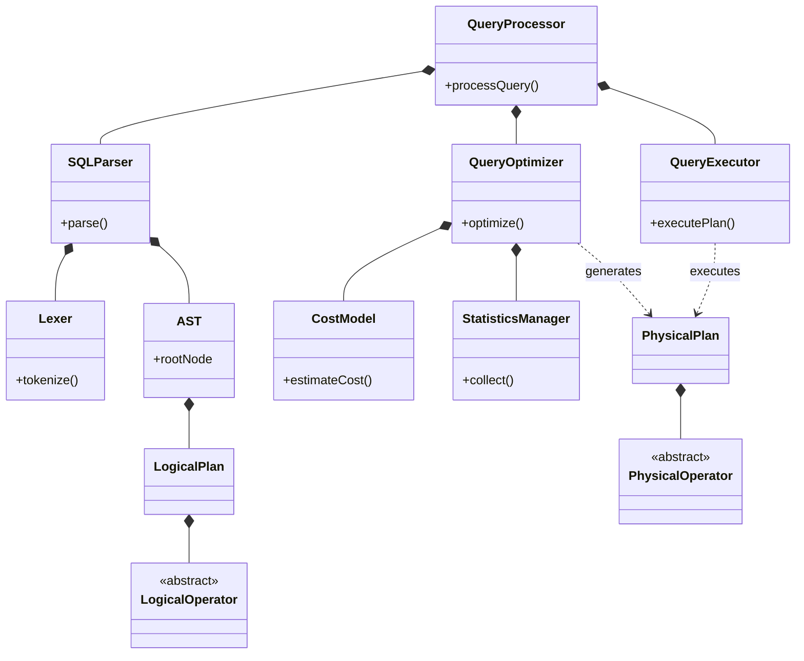
```mermaid
classDiagram
    class QueryProcessor {
        +processQuery()
    }
    class SQLParser {
        +parse()
    }
    class Lexer {
        +tokenize()
    }
    class AST {
        +rootNode
    }
    class QueryOptimizer {
        +optimize()
    }
    class CostModel {
        +estimateCost()
    }
    class StatisticsManager {
        +collect()
    }
    class LogicalPlan
    class LogicalOperator {
        <<abstract>>
    }
    class PhysicalPlan
    class PhysicalOperator {
        <<abstract>>
    }
    class QueryExecutor {
        +executePlan()
    }

    QueryProcessor *-- SQLParser
    QueryProcessor *-- QueryOptimizer
    QueryProcessor *-- QueryExecutor
    SQLParser *-- Lexer
    SQLParser *-- AST
    AST *-- LogicalPlan
    LogicalPlan *-- LogicalOperator
    QueryOptimizer *-- CostModel
    QueryOptimizer *-- StatisticsManager
    QueryOptimizer ..> PhysicalPlan : generates
    PhysicalPlan *-- PhysicalOperator
    QueryExecutor ..> PhysicalPlan : executes
```

### 2. Storage Engine Subsystem
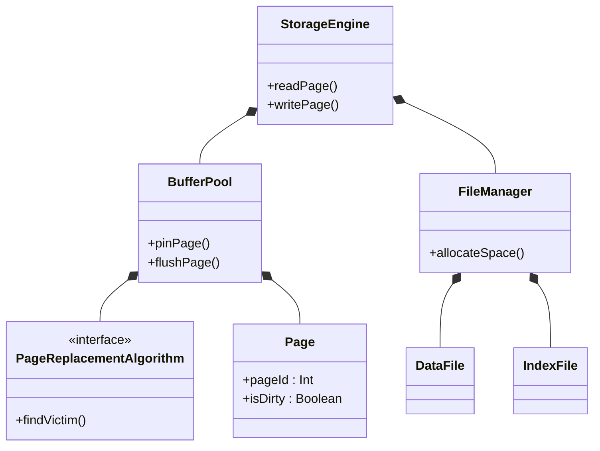
```mermaid
classDiagram
    class StorageEngine {
        +readPage()
        +writePage()
    }
    class BufferPool {
        +pinPage()
        +flushPage()
    }
    class PageReplacementAlgorithm {
        <<interface>>
        +findVictim()
    }
    class Page {
        +pageId : Int
        +isDirty : Boolean
    }
    class FileManager {
        +allocateSpace()
    }
    class DataFile
    class IndexFile

    StorageEngine *-- BufferPool
    StorageEngine *-- FileManager
    BufferPool *-- PageReplacementAlgorithm
    BufferPool *-- Page
    FileManager *-- DataFile
    FileManager *-- IndexFile
```

### 3. Transaction Subsystem
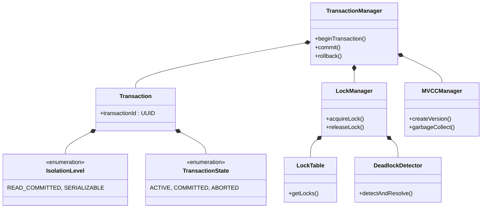
```mermaid
classDiagram
    class TransactionManager {
        +beginTransaction()
        +commit()
        +rollback()
    }
    class Transaction {
        +transactionId : UUID
    }
    class IsolationLevel {
        <<enumeration>>
        READ_COMMITTED, SERIALIZABLE
    }
    class TransactionState {
        <<enumeration>>
        ACTIVE, COMMITTED, ABORTED
    }
    class LockManager {
        +acquireLock()
        +releaseLock()
    }
    class LockTable {
        +getLocks()
    }
    class DeadlockDetector {
        +detectAndResolve()
    }
    class MVCCManager {
        +createVersion()
        +garbageCollect()
    }

    TransactionManager *-- Transaction
    TransactionManager *-- LockManager
    TransactionManager *-- MVCCManager
    Transaction *-- IsolationLevel
    Transaction *-- TransactionState
    LockManager *-- LockTable
    LockManager *-- DeadlockDetector
```

### 4. Database Object Management
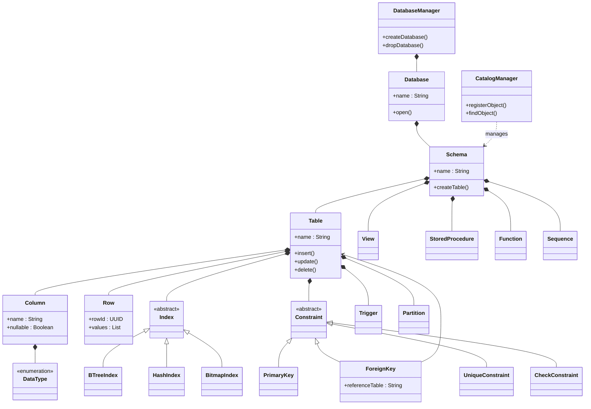
```mermaid
classDiagram
    class CatalogManager {
        +registerObject()
        +findObject()
    }
    class DatabaseManager {
        +createDatabase()
        +dropDatabase()
    }
    class Database {
        +name : String
        +open()
    }
    class Schema {
        +name : String
        +createTable()
    }
    class Table {
        +name : String
        +insert()
        +update()
        +delete()
    }
    class Column {
        +name : String
        +nullable : Boolean
    }
    class Row {
        +rowId : UUID
        +values : List
    }
    class DataType {
        <<enumeration>>
    }
    class Constraint {
        <<abstract>>
    }
    class PrimaryKey
    class ForeignKey {
        +referenceTable : String
    }
    class UniqueConstraint
    class CheckConstraint
    class Index {
        <<abstract>>
    }
    class BTreeIndex
    class HashIndex
    class BitmapIndex
    class View
    class StoredProcedure
    class Function
    class Sequence
    class Trigger
    class Partition

    DatabaseManager *-- Database
    Database *-- Schema
    Schema *-- Table
    Schema *-- View
    Schema *-- StoredProcedure
    Schema *-- Function
    Schema *-- Sequence
    Table *-- Column
    Table *-- Row
    Table *-- Index
    Table *-- Constraint
    Table *-- Partition
    Table *-- Trigger
    Column *-- DataType
    Constraint <|-- PrimaryKey
    Constraint <|-- ForeignKey
    Constraint <|-- UniqueConstraint
    Constraint <|-- CheckConstraint
    Index <|-- BTreeIndex
    Index <|-- HashIndex
    Index <|-- BitmapIndex
    ForeignKey --> Table
    CatalogManager ..> Schema : manages
```

### 5. Backup & Durability
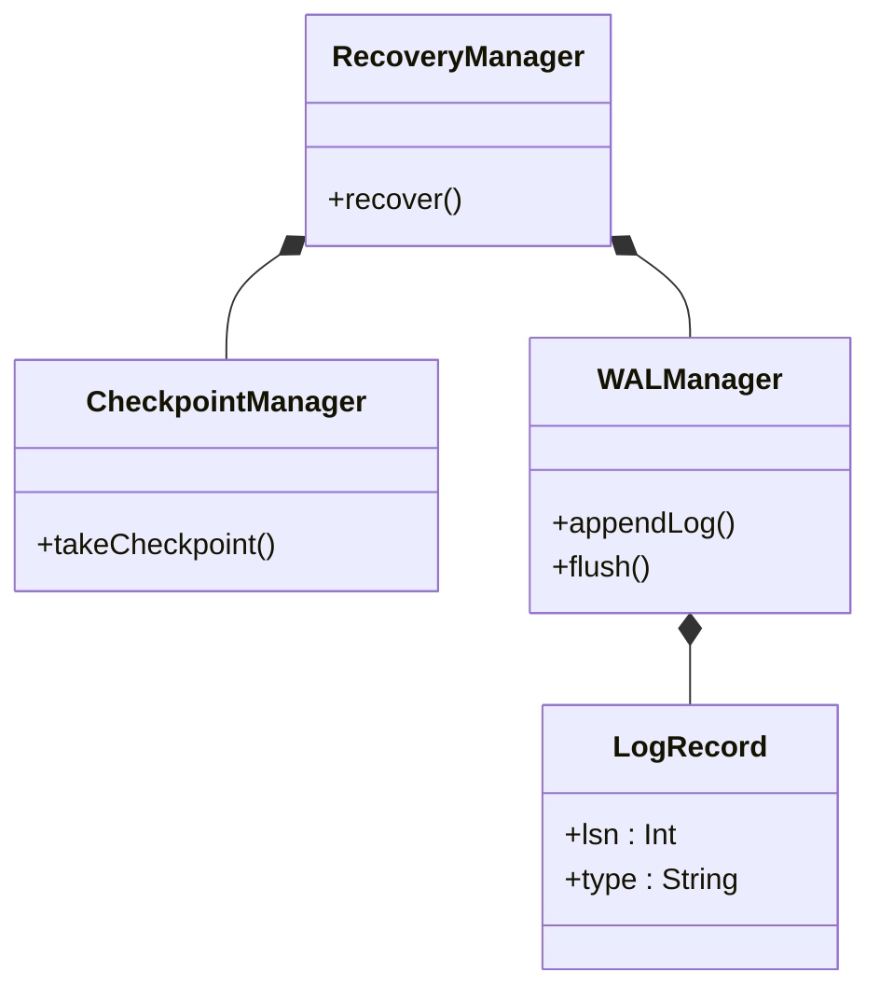
```mermaid
classDiagram
    class RecoveryManager {
        +recover()
    }
    class CheckpointManager {
        +takeCheckpoint()
    }
    class WALManager {
        +appendLog()
        +flush()
    }
    class LogRecord {
        +lsn : Int
        +type : String
    }
    
    RecoveryManager *-- CheckpointManager
    RecoveryManager *-- WALManager
    WALManager *-- LogRecord
```

### 6. Security & Access Control
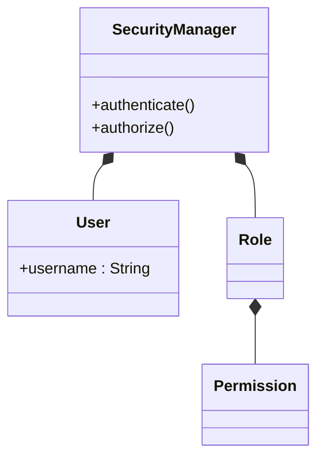
```mermaid
classDiagram
    class SecurityManager {
        +authenticate()
        +authorize()
    }
    class User {
        +username : String
    }
    class Role
    class Permission

    SecurityManager *-- User
    SecurityManager *-- Role
    Role *-- Permission
```

### 7. Core Server & Connections
```mermaid
classDiagram
    class DatabaseServer {
        +serverId : UUID
        +status : String
        +start()
        +stop()
    }
    class ConnectionManager {
        +acceptConnection()
        +closeConnection()
    }
    class ClientSession {
        +sessionId : UUID
        +connectTime : Date
        +execute()
    }
    
    DatabaseServer *-- ConnectionManager
    ConnectionManager *-- ClientSession
```

## 🧪 Unit Test 

### Core Server & Connections Unit Tests

```mermaid
graph LR
    S0["Core Server & Connections"]
    S0 --> C0_0["DatabaseServer"]
    C0_0 --> T0_0_0["Start_WhenConfigValid_InitializesAllSubsystems"]
    C0_0 --> T0_0_1["Start_WhenAlreadyRunning_ThrowsIllegalStateException"]
    C0_0 --> T0_0_2["Stop_WhenRunning_ShutsDownGracefully"]
    C0_0 --> T0_0_3["Stop_WhenAlreadyStopped_DoesNothing"]
    C0_0 --> T0_0_4["Status_ReturnsCurrentOperationalState"]
    C0_0 --> T0_0_5["Start_WhenPortAlreadyInUse_ThrowsBindException"]
    C0_0 --> T0_0_6["Stop_WhenActiveTransactionsExist_WaitsForCompletionOrTimeout"]
    C0_0 --> T0_0_7["Restart_GracefullyStopsAndStartsSystem"]
    C0_0 --> T0_0_8["Init_WithMissingConfigFilePath_ThrowsConfigurationException"]
    C0_0 --> T0_0_9["HealthCheck_ReturnsTrueIfAllSubsystemsAreRunning"]
    S0 --> C0_1["ConnectionManager"]
    C0_1 --> T0_1_0["AcceptConnection_WhenUnderMaxLimit_CreatesClientSession"]
    C0_1 --> T0_1_1["AcceptConnection_WhenAtMaxLimit_RejectsConnection"]
    C0_1 --> T0_1_2["AcceptConnection_WhenServerPaused_QueuesOrRejects"]
    C0_1 --> T0_1_3["CloseConnection_WhenValidSession_ReleasesResources"]
    C0_1 --> T0_1_4["CloseConnection_WhenInvalidSession_ThrowsException"]
    C0_1 --> T0_1_5["GetActiveSessions_ReturnsSnapshotOfConnectedClients"]
    C0_1 --> T0_1_6["BroadcastMessage_SendsToAllActiveSessions"]
    C0_1 --> T0_1_7["KillSession_ForcefullyTerminatesConnection"]
    C0_1 --> T0_1_8["Cleanup_RemovesIdleConnectionsAutomatically"]
    C0_1 --> T0_1_9["AcceptConnection_WhenClientBlacklisted_RejectsImmediately"]
    S0 --> C0_2["ClientSession"]
    C0_2 --> T0_2_0["Init_SetsSessionIdAndTimestamp"]
    C0_2 --> T0_2_1["Execute_WhenValidQuery_ReturnsExecutionResult"]
    C0_2 --> T0_2_2["Execute_WhenSessionExpired_ThrowsTimeoutException"]
    C0_2 --> T0_2_3["Execute_WhenConnectionLost_FailsGracefully"]
    C0_2 --> T0_2_4["SetSessionVariable_UpdatesInternalState"]
    C0_2 --> T0_2_5["GetSessionVariable_ReturnsSetValue"]
    C0_2 --> T0_2_6["Execute_WhenEmptyQuery_ReturnsEmptyResult"]
    C0_2 --> T0_2_7["GetSessionVariable_WhenKeyNotExists_ReturnsNull"]
    C0_2 --> T0_2_8["Ping_ResetsIdleTimer"]
    S0 --> C0_3["DatabaseManager"]
    C0_3 --> T0_3_0["CreateDatabase_WhenNameIsValid_CreatesMetadataAndFiles"]
    C0_3 --> T0_3_1["CreateDatabase_WhenNameExists_ThrowsDuplicateDatabaseException"]
    C0_3 --> T0_3_2["CreateDatabase_WhenInvalidCharacters_ThrowsValidationException"]
    C0_3 --> T0_3_3["DropDatabase_WhenExists_RemovesAllAssociatedData"]
    C0_3 --> T0_3_4["DropDatabase_WhenInUse_ThrowsConcurrencyException"]
    C0_3 --> T0_3_5["GetDatabase_WhenExists_ReturnsDatabaseInstance"]
    C0_3 --> T0_3_6["GetDatabase_WhenNotExists_ThrowsDatabaseNotFoundException"]
    C0_3 --> T0_3_7["ListDatabases_ReturnsAllRegisteredDatabases"]
    C0_3 --> T0_3_8["RenameDatabase_WhenNewNameValid_UpdatesMetadata"]
    C0_3 --> T0_3_9["CreateDatabase_WhenDiskFull_ThrowsInsufficientStorageException"]
    C0_3 --> T0_3_10["CreateDatabase_WhenNameTooLong_ThrowsValidationException"]
    C0_3 --> T0_3_11["DropDatabase_WhenPermissionDenied_ThrowsSecurityException"]
    S0 --> C0_4["Database"]
    C0_4 --> T0_4_0["Init_SetsDatabaseNameCorrectly"]
    C0_4 --> T0_4_1["Open_WhenValidMetadata_LoadsDatabaseContext"]
    C0_4 --> T0_4_2["Open_WhenCorruptedMetadata_ThrowsCorruptionException"]
    C0_4 --> T0_4_3["Close_FlushesUnsavedChangesAndReleasesLocks"]
    C0_4 --> T0_4_4["GetSchema_WhenSchemaExists_ReturnsSchema"]
    C0_4 --> T0_4_5["CreateSchema_WhenNameValid_AddsToDatabase"]
    C0_4 --> T0_4_6["Close_WhenAlreadyClosed_DoesNothing"]
    C0_4 --> T0_4_7["Open_WhenMissingDataFiles_ThrowsFileNotFoundException"]
    S0 --> C0_5["CatalogManager"]
    C0_5 --> T0_5_0["RegisterObject_WhenObjectIsValid_UpdatesCatalogDictionary"]
    C0_5 --> T0_5_1["RegisterObject_WhenDuplicateId_ThrowsException"]
    C0_5 --> T0_5_2["FindObject_WhenExists_ReturnsObjectMetadata"]
    C0_5 --> T0_5_3["FindObject_WhenNotExists_ReturnsNull"]
    C0_5 --> T0_5_4["RemoveObject_WhenExists_DeletesFromCatalog"]
    C0_5 --> T0_5_5["RemoveObject_WhenNotExists_ThrowsNotFoundException"]
    C0_5 --> T0_5_6["UpdateObject_WhenExists_RefreshesMetadata"]
    C0_5 --> T0_5_7["FlushCatalog_WritesToStorageSuccessfully"]
    C0_5 --> T0_5_8["LoadCatalog_PopulatesMemoryFromDisk"]
    C0_5 --> T0_5_9["LoadCatalog_WhenCorruptFile_TriggersRecoveryMode"]


    %% -----------------------------------------
    %% HIGHLIGHT DONE ITEMS
    %% -----------------------------------------
    style C0_0 fill:#1f2937,color:#ffffff,stroke:#3b82f6,stroke-width:3px
    style T0_0_0 fill:#93c5fd,color:#000000,stroke:#2563eb,stroke-width:2px
    style T0_0_1 fill:#93c5fd,color:#000000,stroke:#2563eb,stroke-width:2px
    style T0_0_2 fill:#93c5fd,color:#000000,stroke:#2563eb,stroke-width:2px
    style T0_0_3 fill:#93c5fd,color:#000000,stroke:#2563eb,stroke-width:2px
    style T0_0_4 fill:#93c5fd,color:#000000,stroke:#2563eb,stroke-width:2px
    style T0_0_5 fill:#93c5fd,color:#000000,stroke:#2563eb,stroke-width:2px
    style T0_0_6 fill:#93c5fd,color:#000000,stroke:#2563eb,stroke-width:2px
    style T0_0_7 fill:#93c5fd,color:#000000,stroke:#2563eb,stroke-width:2px
    style T0_0_8 fill:#93c5fd,color:#000000,stroke:#2563eb,stroke-width:2px
    style T0_0_9 fill:#93c5fd,color:#000000,stroke:#2563eb,stroke-width:2px
    style C0_4 fill:#1f2937,color:#ffffff,stroke:#3b82f6,stroke-width:3px
    style T0_4_0 fill:#93c5fd,color:#000000,stroke:#2563eb,stroke-width:2px
    style T0_4_1 fill:#93c5fd,color:#000000,stroke:#2563eb,stroke-width:2px
    style T0_4_2 fill:#93c5fd,color:#000000,stroke:#2563eb,stroke-width:2px
    style T0_4_3 fill:#93c5fd,color:#000000,stroke:#2563eb,stroke-width:2px
    style T0_4_4 fill:#93c5fd,color:#000000,stroke:#2563eb,stroke-width:2px
    style T0_4_5 fill:#93c5fd,color:#000000,stroke:#2563eb,stroke-width:2px
    style T0_4_6 fill:#93c5fd,color:#000000,stroke:#2563eb,stroke-width:2px
    style T0_4_7 fill:#93c5fd,color:#000000,stroke:#2563eb,stroke-width:2px
```

### Database Object Management Unit Tests

```mermaid
graph LR
    S1["Database Object Management"]
    S1 --> C1_0["Schema"]
    C1_0 --> T1_0_0["Init_SetsSchemaName"]
    C1_0 --> T1_0_1["CreateTable_WhenValidTable_RegistersInSchema"]
    C1_0 --> T1_0_2["CreateTable_WhenTableNameExists_ThrowsException"]
    C1_0 --> T1_0_3["DropTable_WhenExists_RemovesFromSchema"]
    C1_0 --> T1_0_4["DropTable_WhenNotExists_ThrowsException"]
    C1_0 --> T1_0_5["GetTable_WhenExists_ReturnsTable"]
    C1_0 --> T1_0_6["ListTables_ReturnsAllRegisteredTables"]
    C1_0 --> T1_0_7["Validate_EnsuresSchemaNameIsAlphanumeric"]
    S1 --> C1_1["Table"]
    C1_1 --> T1_1_0["Insert_WhenValidRowAndConstraintsMet_AppendsRow"]
    C1_1 --> T1_1_1["Insert_WhenPrimaryKeyViolated_ThrowsConstraintException"]
    C1_1 --> T1_1_2["Update_WhenRowExists_ModifiesValues"]
    C1_1 --> T1_1_3["Update_WhenRowNotExists_ReturnsZeroAffectedRows"]
    C1_1 --> T1_1_4["Delete_WhenRowExists_RemovesRow"]
    C1_1 --> T1_1_5["Insert_WhenForeignKeyViolated_ThrowsException"]
    C1_1 --> T1_1_6["Insert_WhenCheckConstraintViolated_ThrowsException"]
    C1_1 --> T1_1_7["Truncate_RemovesAllRowsRapidly"]
    C1_1 --> T1_1_8["AddColumn_AppendsColumnDefinitionToSchema"]
    C1_1 --> T1_1_9["DropColumn_RemovesColumnAndData"]
    C1_1 --> T1_1_10["GetRowCount_ReturnsAccurateCount"]
    C1_1 --> T1_1_11["RenameColumn_WhenExists_UpdatesMetadataAndViews"]
    S1 --> C1_2["View"]
    C1_2 --> T1_2_0["Init_SetsQueryDefinition"]
    C1_2 --> T1_2_1["CompileView_WhenUnderlyingTablesExist_Succeeds"]
    C1_2 --> T1_2_2["CompileView_WhenTableDropped_ThrowsInvalidViewException"]
    C1_2 --> T1_2_3["Materialize_CachesResultSetToDisk"]
    C1_2 --> T1_2_4["Refresh_UpdatesMaterializedData"]
    C1_2 --> T1_2_5["CompileView_WhenCircularDependencyDetected_ThrowsException"]
    S1 --> C1_3["StoredProcedure"]
    C1_3 --> T1_3_0["Execute_WhenValidParametersProvided_RunsLogic"]
    C1_3 --> T1_3_1["Execute_WhenTypeMismatchInParams_ThrowsException"]
    C1_3 --> T1_3_2["Execute_WhenMissingParameters_ThrowsArgumentException"]
    C1_3 --> T1_3_3["Compile_ValidatesSyntaxAndDependencies"]
    C1_3 --> T1_3_4["Drop_RemovesProcedureFromCatalog"]
    C1_3 --> T1_3_5["Execute_WhenProcedureTimesOut_KillsExecution"]
    S1 --> C1_4["Function"]
    C1_4 --> T1_4_0["Evaluate_WhenValidArguments_ReturnsComputedValue"]
    C1_4 --> T1_4_1["Evaluate_WhenMissingArguments_ThrowsArgumentException"]
    C1_4 --> T1_4_2["Evaluate_WhenDivideByZero_ThrowsArithmeticException"]
    C1_4 --> T1_4_3["IsDeterministic_ReturnsTrueIfNoExternalStateUsed"]
    C1_4 --> T1_4_4["Evaluate_WhenNullPassedToStrictFunction_ReturnsNull"]
    S1 --> C1_5["Sequence"]
    C1_5 --> T1_5_0["NextValue_IncrementsByStepAndReturnsValue"]
    C1_5 --> T1_5_1["NextValue_WhenMaxLimitReached_ThrowsOverflowException"]
    C1_5 --> T1_5_2["Reset_SetsValueBackToStart"]
    C1_5 --> T1_5_3["Init_SetsStartStepAndMaxLimit"]
    C1_5 --> T1_5_4["CurrentValue_ReturnsCurrentWithoutIncrementing"]
    C1_5 --> T1_5_5["NextValue_WhenStepIsNegative_DecrementsCorrectly"]
    S1 --> C1_6["Trigger"]
    C1_6 --> T1_6_0["Fire_OnEventConditionMet_ExecutesTriggerAction"]
    C1_6 --> T1_6_1["Fire_OnEventConditionNotMet_SkipsExecution"]
    C1_6 --> T1_6_2["Fire_WhenActionFails_RollsBackTransaction"]
    C1_6 --> T1_6_3["Enable_ActivatesTrigger"]
    C1_6 --> T1_6_4["Disable_DeactivatesTrigger"]
    C1_6 --> T1_6_5["Validate_EnsuresNoInfiniteTriggerLoops"]
    S1 --> C1_7["Partition"]
    C1_7 --> T1_7_0["Init_SetsPartitionKeyCorrectly"]
    C1_7 --> T1_7_1["CheckBoundary_WhenValueInRange_ReturnsTrue"]
    C1_7 --> T1_7_2["CheckBoundary_WhenValueOutOfRange_ReturnsFalse"]
    C1_7 --> T1_7_3["Merge_CombinesTwoAdjacentPartitions"]
    C1_7 --> T1_7_4["Split_DividesPartitionAtGivenValue"]
    S1 --> C1_8["Column"]
    C1_8 --> T1_8_0["Init_SetsNameAndNullableFlags"]
    C1_8 --> T1_8_1["ValidateType_WhenDataMatchesColumnType_Succeeds"]
    C1_8 --> T1_8_2["ValidateType_WhenDataIsStringForIntColumn_ThrowsTypeException"]
    C1_8 --> T1_8_3["ValidateNullable_WhenNullPassedToNotNullColumn_ThrowsException"]
    C1_8 --> T1_8_4["SetDefaultValue_StoresDefaultExpression"]
    C1_8 --> T1_8_5["ChangeType_WhenCompatible_Succeeds"]
    C1_8 --> T1_8_6["ChangeType_WhenIncompatible_ThrowsException"]
    S1 --> C1_9["Row"]
    C1_9 --> T1_9_0["Init_GeneratesRowIdAndInitializesValueList"]
    C1_9 --> T1_9_1["GetValue_WhenIndexValid_ReturnsData"]
    C1_9 --> T1_9_2["GetValue_WhenIndexOutOfBounds_ThrowsIndexException"]
    C1_9 --> T1_9_3["SetValue_UpdatesDataAtIndex"]
    C1_9 --> T1_9_4["Serialize_ConvertsToByteArray"]
    C1_9 --> T1_9_5["Deserialize_ReadsFromByteArray"]
    C1_9 --> T1_9_6["GetSize_ReturnsByteSizeOfAllValues"]
    S1 --> C1_10["DataType"]
    C1_10 --> T1_10_0["EnumValues_IncludeIntVarcharDateBoolean"]
    C1_10 --> T1_10_1["ParseString_WhenValidFormat_ReturnsDataTypeInstance"]
    C1_10 --> T1_10_2["ParseString_WhenInvalidFormat_ThrowsParseException"]
    C1_10 --> T1_10_3["GetSize_ReturnsByteSizeForFixedTypes"]
    C1_10 --> T1_10_4["IsVariableLength_ReturnsTrueForVarchar"]
    S1 --> C1_11["Constraint"]
    C1_11 --> T1_11_0["Instantiation_OfAbstractClass_FailsWithTypeError"]
    S1 --> C1_12["PrimaryKey"]
    C1_12 --> T1_12_0["Validate_WhenValueIsUniqueAndNotNull_Succeeds"]
    C1_12 --> T1_12_1["Validate_WhenValueIsNull_ThrowsNullException"]
    C1_12 --> T1_12_2["Validate_WhenValueIsDuplicate_ThrowsDuplicateKeyException"]
    C1_12 --> T1_12_3["Validate_WithCompositeKey_ChecksAllColumns"]
    C1_12 --> T1_12_4["Drop_RemovesIndexFromStorage"]
    S1 --> C1_13["ForeignKey"]
    C1_13 --> T1_13_0["Validate_WhenReferencedRowExists_Succeeds"]
    C1_13 --> T1_13_1["Validate_WhenReferencedRowDoesNotExist_ThrowsForeignKeyException"]
    C1_13 --> T1_13_2["Init_SetsReferenceTableCorrectly"]
    C1_13 --> T1_13_3["OnDeleteCascade_RemovesChildRowsWhenParentDeleted"]
    C1_13 --> T1_13_4["OnDeleteRestrict_ThrowsExceptionWhenParentDeleted"]
    C1_13 --> T1_13_5["OnUpdateCascade_ModifiesChildRowsWhenParentKeyChanges"]
    S1 --> C1_14["UniqueConstraint"]
    C1_14 --> T1_14_0["Validate_WhenValueIsGloballyUnique_Succeeds"]
    C1_14 --> T1_14_1["Validate_WhenValueExistsInAnotherRow_ThrowsException"]
    C1_14 --> T1_14_2["Validate_WhenValueIsNull_SucceedsIfNullable"]
    S1 --> C1_15["CheckConstraint"]
    C1_15 --> T1_15_0["Validate_WhenExpressionEvaluatesToTrue_Succeeds"]
    C1_15 --> T1_15_1["Validate_WhenExpressionEvaluatesToFalse_ThrowsCheckException"]
    C1_15 --> T1_15_2["Validate_WhenExpressionUsesInvalidColumn_ThrowsException"]
    S1 --> C1_16["Index"]
    C1_16 --> T1_16_0["Instantiation_OfAbstractClass_FailsWithTypeError"]
    S1 --> C1_17["BTreeIndex"]
    C1_17 --> T1_17_0["InsertKey_WhenValid_AddsNodeToTreeBalancing"]
    C1_17 --> T1_17_1["Search_WhenKeyExists_ReturnsCorrespondingRowID"]
    C1_17 --> T1_17_2["Search_WhenKeyNotExists_ReturnsEmptyResult"]
    C1_17 --> T1_17_3["DeleteKey_WhenExists_RemovesNodeAndRebalances"]
    C1_17 --> T1_17_4["RangeSearch_ReturnsAllRowIDsInRange"]
    C1_17 --> T1_17_5["BulkLoad_BuildsTreeEfficientlyFromSortedData"]
    C1_17 --> T1_17_6["SplitNode_WhenFull_CreatesSibling"]
    C1_17 --> T1_17_7["MergeNodes_WhenUnderfull_CombinesSiblings"]
    S1 --> C1_18["HashIndex"]
    C1_18 --> T1_18_0["InsertKey_ComputesHashAndAddsToBucket"]
    C1_18 --> T1_18_1["Search_WhenKeyExists_ResolvesHashToRowID"]
    C1_18 --> T1_18_2["HandleCollision_CreatesLinkedListInBucket"]
    C1_18 --> T1_18_3["Resize_ExpandsHashTableWhenLoadFactorExceeded"]
    C1_18 --> T1_18_4["DeleteKey_RemovesFromBucketLinkedList"]
    C1_18 --> T1_18_5["ComputeHash_DistributesKeysEvenly"]
    S1 --> C1_19["BitmapIndex"]
    C1_19 --> T1_19_0["InsertKey_UpdatesBitmapBitsForGivenValue"]
    C1_19 --> T1_19_1["Search_WhenKeyExists_UsesBitwiseOperationsToFindRID"]
    C1_19 --> T1_19_2["BitwiseAND_CombinesTwoBitmapsForComplexQuery"]
    C1_19 --> T1_19_3["BitwiseOR_CombinesTwoBitmapsForOrQuery"]
    C1_19 --> T1_19_4["Compress_ReducesMemoryFootprintOfSparseBitmap"]
    C1_19 --> T1_19_5["DeleteKey_ClearsBitForDeletedRow"]


    %% -----------------------------------------
    %% HIGHLIGHT DONE ITEMS
    %% -----------------------------------------
    style C1_0 fill:#1f2937,color:#ffffff,stroke:#3b82f6,stroke-width:3px
    style T1_0_0 fill:#93c5fd,color:#000000,stroke:#2563eb,stroke-width:2px
    style T1_0_1 fill:#93c5fd,color:#000000,stroke:#2563eb,stroke-width:2px
    style T1_0_2 fill:#93c5fd,color:#000000,stroke:#2563eb,stroke-width:2px
    style T1_0_3 fill:#93c5fd,color:#000000,stroke:#2563eb,stroke-width:2px
    style T1_0_4 fill:#93c5fd,color:#000000,stroke:#2563eb,stroke-width:2px
    style T1_0_5 fill:#93c5fd,color:#000000,stroke:#2563eb,stroke-width:2px
    style T1_0_6 fill:#93c5fd,color:#000000,stroke:#2563eb,stroke-width:2px
    style T1_0_7 fill:#93c5fd,color:#000000,stroke:#2563eb,stroke-width:2px
    style C1_1 fill:#1f2937,color:#ffffff,stroke:#3b82f6,stroke-width:3px
    style T1_1_0 fill:#93c5fd,color:#000000,stroke:#2563eb,stroke-width:2px
    style T1_1_1 fill:#93c5fd,color:#000000,stroke:#2563eb,stroke-width:2px
    style T1_1_2 fill:#93c5fd,color:#000000,stroke:#2563eb,stroke-width:2px
    style T1_1_3 fill:#93c5fd,color:#000000,stroke:#2563eb,stroke-width:2px
    style T1_1_4 fill:#93c5fd,color:#000000,stroke:#2563eb,stroke-width:2px
    style T1_1_5 fill:#93c5fd,color:#000000,stroke:#2563eb,stroke-width:2px
    style T1_1_6 fill:#93c5fd,color:#000000,stroke:#2563eb,stroke-width:2px
    style T1_1_7 fill:#93c5fd,color:#000000,stroke:#2563eb,stroke-width:2px
    style T1_1_8 fill:#93c5fd,color:#000000,stroke:#2563eb,stroke-width:2px
    style T1_1_9 fill:#93c5fd,color:#000000,stroke:#2563eb,stroke-width:2px
    style T1_1_10 fill:#93c5fd,color:#000000,stroke:#2563eb,stroke-width:2px
    style T1_1_11 fill:#93c5fd,color:#000000,stroke:#2563eb,stroke-width:2px
    style C1_8 fill:#1f2937,color:#ffffff,stroke:#3b82f6,stroke-width:3px
    style T1_8_0 fill:#93c5fd,color:#000000,stroke:#2563eb,stroke-width:2px
    style T1_8_1 fill:#93c5fd,color:#000000,stroke:#2563eb,stroke-width:2px
    style T1_8_2 fill:#93c5fd,color:#000000,stroke:#2563eb,stroke-width:2px
    style T1_8_3 fill:#93c5fd,color:#000000,stroke:#2563eb,stroke-width:2px
    style T1_8_4 fill:#93c5fd,color:#000000,stroke:#2563eb,stroke-width:2px
    style T1_8_5 fill:#93c5fd,color:#000000,stroke:#2563eb,stroke-width:2px
    style T1_8_6 fill:#93c5fd,color:#000000,stroke:#2563eb,stroke-width:2px
    style C1_9 fill:#1f2937,color:#ffffff,stroke:#3b82f6,stroke-width:3px
    style T1_9_0 fill:#93c5fd,color:#000000,stroke:#2563eb,stroke-width:2px
    style T1_9_1 fill:#93c5fd,color:#000000,stroke:#2563eb,stroke-width:2px
    style T1_9_2 fill:#93c5fd,color:#000000,stroke:#2563eb,stroke-width:2px
    style T1_9_3 fill:#93c5fd,color:#000000,stroke:#2563eb,stroke-width:2px
    style T1_9_4 fill:#93c5fd,color:#000000,stroke:#2563eb,stroke-width:2px
    style T1_9_5 fill:#93c5fd,color:#000000,stroke:#2563eb,stroke-width:2px
    style T1_9_6 fill:#93c5fd,color:#000000,stroke:#2563eb,stroke-width:2px
    style C1_10 fill:#1f2937,color:#ffffff,stroke:#3b82f6,stroke-width:3px
    style T1_10_0 fill:#93c5fd,color:#000000,stroke:#2563eb,stroke-width:2px
    style T1_10_1 fill:#93c5fd,color:#000000,stroke:#2563eb,stroke-width:2px
    style T1_10_2 fill:#93c5fd,color:#000000,stroke:#2563eb,stroke-width:2px
    style T1_10_3 fill:#93c5fd,color:#000000,stroke:#2563eb,stroke-width:2px
    style T1_10_4 fill:#93c5fd,color:#000000,stroke:#2563eb,stroke-width:2px
    style C1_11 fill:#1f2937,color:#ffffff,stroke:#3b82f6,stroke-width:3px
    style T1_11_0 fill:#93c5fd,color:#000000,stroke:#2563eb,stroke-width:2px
    style C1_12 fill:#1f2937,color:#ffffff,stroke:#3b82f6,stroke-width:3px
    style T1_12_0 fill:#93c5fd,color:#000000,stroke:#2563eb,stroke-width:2px
    style T1_12_1 fill:#93c5fd,color:#000000,stroke:#2563eb,stroke-width:2px
    style T1_12_2 fill:#93c5fd,color:#000000,stroke:#2563eb,stroke-width:2px
    style T1_12_3 fill:#93c5fd,color:#000000,stroke:#2563eb,stroke-width:2px
    style T1_12_4 fill:#93c5fd,color:#000000,stroke:#2563eb,stroke-width:2px
    style C1_13 fill:#1f2937,color:#ffffff,stroke:#3b82f6,stroke-width:3px
    style T1_13_0 fill:#93c5fd,color:#000000,stroke:#2563eb,stroke-width:2px
    style T1_13_1 fill:#93c5fd,color:#000000,stroke:#2563eb,stroke-width:2px
    style T1_13_2 fill:#93c5fd,color:#000000,stroke:#2563eb,stroke-width:2px
    style T1_13_3 fill:#93c5fd,color:#000000,stroke:#2563eb,stroke-width:2px
    style T1_13_4 fill:#93c5fd,color:#000000,stroke:#2563eb,stroke-width:2px
    style T1_13_5 fill:#93c5fd,color:#000000,stroke:#2563eb,stroke-width:2px
    style C1_14 fill:#1f2937,color:#ffffff,stroke:#3b82f6,stroke-width:3px
    style T1_14_0 fill:#93c5fd,color:#000000,stroke:#2563eb,stroke-width:2px
    style T1_14_1 fill:#93c5fd,color:#000000,stroke:#2563eb,stroke-width:2px
    style T1_14_2 fill:#93c5fd,color:#000000,stroke:#2563eb,stroke-width:2px
    style C1_15 fill:#1f2937,color:#ffffff,stroke:#3b82f6,stroke-width:3px
    style T1_15_0 fill:#93c5fd,color:#000000,stroke:#2563eb,stroke-width:2px
    style T1_15_1 fill:#93c5fd,color:#000000,stroke:#2563eb,stroke-width:2px
    style T1_15_2 fill:#93c5fd,color:#000000,stroke:#2563eb,stroke-width:2px
```

### Query Processor Unit Tests

```mermaid
graph LR
    S2["Query Processor"]
    S2 --> C2_0["QueryProcessor"]
    C2_0 --> T2_0_0["ProcessQuery_WhenValidSQL_ReturnsQueryResult"]
    C2_0 --> T2_0_1["ProcessQuery_WhenExecutionFails_RollsBackAndThrows"]
    C2_0 --> T2_0_2["ProcessQuery_WhenTimeoutReached_AbortsQuery"]
    C2_0 --> T2_0_3["Explain_ReturnsQueryExecutionPlanWithoutRunning"]
    C2_0 --> T2_0_4["PrepareStatement_CachesCompiledPlanForReuse"]
    S2 --> C2_1["SQLParser"]
    C2_1 --> T2_1_0["Parse_WhenValidSelectStatement_GeneratesAST"]
    C2_1 --> T2_1_1["Parse_WhenInvalidSyntax_ThrowsSyntaxErrorException"]
    C2_1 --> T2_1_2["Parse_WhenUnsupportedCommand_ThrowsNotImplementedException"]
    C2_1 --> T2_1_3["Parse_WhenMissingSemicolon_SucceedsOrThrowsBasedOnDialect"]
    C2_1 --> T2_1_4["Parse_ComplexJoinAndGroupBy_ConstructsCorrectTree"]
    C2_1 --> T2_1_5["Parse_NestedSubqueries_HandlesDepthLimits"]
    C2_1 --> T2_1_6["Parse_WhenMalformedDateLiteral_ThrowsException"]
    S2 --> C2_2["Lexer"]
    C2_2 --> T2_2_0["Tokenize_WhenValidString_ReturnsListOfTokens"]
    C2_2 --> T2_2_1["Tokenize_IgnoresWhitespaceAndComments"]
    C2_2 --> T2_2_2["Tokenize_WhenUnclosedStringLiteral_ThrowsLexerException"]
    C2_2 --> T2_2_3["Tokenize_IdentifiesOperatorsAndPunctuationCorrectly"]
    C2_2 --> T2_2_4["Tokenize_HandlesEscapedCharactersInStrings"]
    S2 --> C2_3["AST"]
    C2_3 --> T2_3_0["Init_SetsRootNode"]
    C2_3 --> T2_3_1["Traverse_VisitsAllNodesInCorrectOrder"]
    C2_3 --> T2_3_2["ToSQL_ReconstructsSQLStringFromTree"]
    C2_3 --> T2_3_3["Clone_CreatesDeepCopyOfTree"]
    C2_3 --> T2_3_4["CountNodes_ReturnsTotalSizeOfTree"]
    S2 --> C2_4["QueryOptimizer"]
    C2_4 --> T2_4_0["Optimize_WhenGivenLogicalPlan_TransformsToPhysicalPlan"]
    C2_4 --> T2_4_1["Optimize_AppliesFilterPushdownRule"]
    C2_4 --> T2_4_2["Optimize_AppliesJoinReorderingForEfficiency"]
    C2_4 --> T2_4_3["Optimize_ChoosesIndexScanOverSeqScanWhenSelective"]
    C2_4 --> T2_4_4["Optimize_EliminatesDeadCodeOrAlwaysFalseConditions"]
    C2_4 --> T2_4_5["Optimize_FlattensUnnecessarySubqueries"]
    C2_4 --> T2_4_6["Optimize_WhenStatsMissing_DefaultsToHeuristicRules"]
    S2 --> C2_5["CostModel"]
    C2_5 --> T2_5_0["EstimateCost_CalculatesIOAndCPUCost"]
    C2_5 --> T2_5_1["EstimateCost_WhenUsingIndex_ReturnsLowerCostThanSeqScan"]
    C2_5 --> T2_5_2["EstimateCost_ForNestedLoopJoin_IsHigherThanHashJoinForLargeTables"]
    C2_5 --> T2_5_3["UpdateStatistics_AdjustsInternalWeightsBasedOnFeedback"]
    C2_5 --> T2_5_4["EstimateMemoryUsage_ForSortOperator_ReturnsExpectedBytes"]
    S2 --> C2_6["StatisticsManager"]
    C2_6 --> T2_6_0["Collect_UpdatesRowCountsAndCardinality"]
    C2_6 --> T2_6_1["GetStatistics_WhenCalled_ReturnsAccurateMetadata"]
    C2_6 --> T2_6_2["EstimateSelectivity_ReturnsPercentageOfRowsMatchingFilter"]
    C2_6 --> T2_6_3["BuildHistogram_ForSkewedDataDistribution"]
    C2_6 --> T2_6_4["InvalidateStats_WhenTableModifiedSignificantly"]
    S2 --> C2_7["LogicalPlan"]
    C2_7 --> T2_7_0["Init_CreatesEmptyOperatorTree"]
    C2_7 --> T2_7_1["AddOperator_AppendsToPlan"]
    C2_7 --> T2_7_2["Validate_EnsuresReferencesExistInCatalog"]
    C2_7 --> T2_7_3["PrintTree_OutputsFormattedStringForDebugging"]
    C2_7 --> T2_7_4["GetLeaves_ReturnsBaseTableScans"]
    S2 --> C2_8["LogicalOperator"]
    C2_8 --> T2_8_0["Instantiation_OfAbstractClass_FailsWithTypeError"]
    S2 --> C2_9["PhysicalPlan"]
    C2_9 --> T2_9_0["Init_CreatesEmptyOperatorTree"]
    C2_9 --> T2_9_1["ValidatePipeline_EnsuresOperatorCompatibility"]
    C2_9 --> T2_9_2["EstimateTotalCost_SumsCostOfAllOperators"]
    C2_9 --> T2_9_3["GetRoot_ReturnsTopOperator"]
    C2_9 --> T2_9_4["Clone_CreatesIsolatedExecutionInstance"]
    S2 --> C2_10["PhysicalOperator"]
    C2_10 --> T2_10_0["Instantiation_OfAbstractClass_FailsWithTypeError"]
    S2 --> C2_11["QueryExecutor"]
    C2_11 --> T2_11_0["ExecutePlan_WhenValidPhysicalPlan_IteratesAndYieldsResults"]
    C2_11 --> T2_11_1["ExecutePlan_WhenMemoryExceeded_SpillsToDiskOrThrows"]
    C2_11 --> T2_11_2["ExecutePlan_WhenCanceledByUser_AbortsImmediately"]
    C2_11 --> T2_11_3["StreamResults_YieldsBatchesInsteadOfLoadingAllIntoMemory"]
    C2_11 --> T2_11_4["Initialize_AllocatesRequiredTempSpace"]
    C2_11 --> T2_11_5["Close_ReleasesAllInternalIterators"]
```

### Transaction Management Unit Tests

```mermaid
graph LR
    S3["Transaction Management"]
    S3 --> C3_0["TransactionManager"]
    C3_0 --> T3_0_0["BeginTransaction_CreatesAndRegistersNewActiveTransaction"]
    C3_0 --> T3_0_1["Commit_WhenSuccessful_WritesToLogAndChangesState"]
    C3_0 --> T3_0_2["Rollback_WhenCalled_RevertsAllModifications"]
    C3_0 --> T3_0_3["Commit_WhenValidationFails_ForcesRollback"]
    C3_0 --> T3_0_4["GetActiveTransactions_ReturnsListOfCurrentlyRunningTx"]
    C3_0 --> T3_0_5["SuspendTransaction_TemporarilyHaltsExecution"]
    C3_0 --> T3_0_6["ResumeTransaction_ContinuesSuspendedExecution"]
    C3_0 --> T3_0_7["ForceRollbackAll_UsedDuringServerShutdown"]
    S3 --> C3_1["Transaction"]
    C3_1 --> T3_1_0["Init_GeneratesUniqueTransactionId"]
    C3_1 --> T3_1_1["SetIsolationLevel_UpdatesTransactionProperties"]
    C3_1 --> T3_1_2["AddLock_TracksLocksHeldByThisTransaction"]
    C3_1 --> T3_1_3["ReleaseAllLocks_CalledDuringCommitOrRollback"]
    C3_1 --> T3_1_4["SetSavepoint_CreatesPartialRollbackMarker"]
    C3_1 --> T3_1_5["RollbackToSavepoint_RevertsChangesAfterMarker"]
    S3 --> C3_2["IsolationLevel"]
    C3_2 --> T3_2_0["EnumValues_IncludeReadCommittedAndSerializable"]
    S3 --> C3_3["TransactionState"]
    C3_3 --> T3_3_0["EnumValues_IncludeActiveCommittedAborted"]
    S3 --> C3_4["LockManager"]
    C3_4 --> T3_4_0["AcquireLock_WhenResourceFree_GrantsLockInstantly"]
    C3_4 --> T3_4_1["AcquireLock_WhenResourceLocked_BlocksOrThrowsTimeout"]
    C3_4 --> T3_4_2["ReleaseLock_WhenHoldingLock_FreesResourceAndWakesWaiters"]
    C3_4 --> T3_4_3["AcquireLock_WhenSharedLockExists_GrantsAnotherSharedLock"]
    C3_4 --> T3_4_4["AcquireLock_WhenSharedLockExists_BlocksExclusiveLock"]
    C3_4 --> T3_4_5["UpgradeLock_ConvertsSharedToExclusiveIfPossible"]
    C3_4 --> T3_4_6["DowngradeLock_ConvertsExclusiveToShared"]
    C3_4 --> T3_4_7["ReleaseLock_WhenNotHoldingLock_ThrowsException"]
    S3 --> C3_5["LockTable"]
    C3_5 --> T3_5_0["GetLocks_ReturnsCurrentLockInformation"]
    C3_5 --> T3_5_1["AddLock_RegistersNewLockForResource"]
    C3_5 --> T3_5_2["RemoveLock_DeletesRegistration"]
    C3_5 --> T3_5_3["Clear_RemovesAllLocksDuringSystemReset"]
    C3_5 --> T3_5_4["CountLocks_ForSpecificTransactionId"]
    S3 --> C3_6["DeadlockDetector"]
    C3_6 --> T3_6_0["DetectAndResolve_WhenCycleFound_AbortsVictimTransaction"]
    C3_6 --> T3_6_1["DetectAndResolve_WhenNoCycleFound_DoesNothing"]
    C3_6 --> T3_6_2["BuildWaitForGraph_CorrectlyMapsDependencies"]
    C3_6 --> T3_6_3["ChooseVictim_SelectsTransactionWithLeastWorkDone"]
    C3_6 --> T3_6_4["SetTimeout_ControlsBackgroundDetectionInterval"]
    S3 --> C3_7["MVCCManager"]
    C3_7 --> T3_7_0["CreateVersion_AppendsNewRecordVersionToChain"]
    C3_7 --> T3_7_1["GarbageCollect_RemovesVersionsInvisibleToAllActiveTransactions"]
    C3_7 --> T3_7_2["ReadVersion_ReturnsCorrectDataBasedOnTxSnapshot"]
    C3_7 --> T3_7_3["DetectWriteConflict_WhenTwoTxUpdateSameRecord_ThrowsException"]
    C3_7 --> T3_7_4["ReadVersion_WhenNoVisibleVersion_ReturnsNull"]
```

### Storage Engine Unit Tests

```mermaid
graph LR
    S4["Storage Engine"]
    S4 --> C4_0["StorageEngine"]
    C4_0 --> T4_0_0["ReadPage_WhenPageNotInBuffer_LoadsFromDisk"]
    C4_0 --> T4_0_1["WritePage_WhenPageIsDirty_FlushesToDisk"]
    C4_0 --> T4_0_2["AllocatePage_CreatesNewPageAndReturnsId"]
    C4_0 --> T4_0_3["DeallocatePage_FreesPageSpace"]
    C4_0 --> T4_0_4["Sync_ForcesAllDirtyPagesToDisk"]
    C4_0 --> T4_0_5["FormatDrive_InitializesDataDirectoryStructure"]
    S4 --> C4_1["BufferPool"]
    C4_1 --> T4_1_0["PinPage_IncrementsPinCountAndPreventsEviction"]
    C4_1 --> T4_1_1["UnpinPage_DecrementsPinCount"]
    C4_1 --> T4_1_2["FlushPage_ForcesDirtyPageToDisk"]
    C4_1 --> T4_1_3["FetchPage_WhenPoolFull_EvictsUnpinnedPage"]
    C4_1 --> T4_1_4["FetchPage_WhenAllPagesPinned_ThrowsBufferFullException"]
    C4_1 --> T4_1_5["GetHitRate_ReturnsCacheHitRatioMetrics"]
    C4_1 --> T4_1_6["Clear_EvictsAllUnpinnedPages"]
    C4_1 --> T4_1_7["UnpinPage_WhenCountIsZero_ThrowsException"]
    S4 --> C4_2["PageReplacementAlgorithm"]
    C4_2 --> T4_2_0["Instantiation_OfInterface_FailsWithTypeError"]
    S4 --> C4_3["Page"]
    C4_3 --> T4_3_0["Init_SetsPageIdAndClearsDirtyFlag"]
    C4_3 --> T4_3_1["MarkDirty_SetsDirtyFlagToTrue"]
    C4_3 --> T4_3_2["ReadTuple_ReturnsDataAtOffset"]
    C4_3 --> T4_3_3["WriteTuple_SavesDataAndUpdatesFreeSpace"]
    C4_3 --> T4_3_4["HasSpace_ReturnsTrueIfTupleFits"]
    C4_3 --> T4_3_5["Compact_ReorganizesTuplesToRemoveFragmentation"]
    C4_3 --> T4_3_6["DeleteTuple_MarksSlotAsEmpty"]
    S4 --> C4_4["FileManager"]
    C4_4 --> T4_4_0["AllocateSpace_CreatesNewBlockAndReturnsId"]
    C4_4 --> T4_4_1["DeallocateSpace_MarksBlockAsFree"]
    C4_4 --> T4_4_2["ExtendFile_IncreasesFileSizeWhenFull"]
    C4_4 --> T4_4_3["CloseAll_ReleasesFileHandles"]
    C4_4 --> T4_4_4["GetFileSize_ReturnsSizeInBytes"]
    C4_4 --> T4_4_5["CheckSpace_ReturnsAvailableBlocks"]
    S4 --> C4_5["DataFile"]
    C4_5 --> T4_5_0["Init_OpensFileStreamForDataBlocks"]
    C4_5 --> T4_5_1["ReadBlock_LoadsBytesFromDisk"]
    C4_5 --> T4_5_2["WriteBlock_SavesBytesToDisk"]
    C4_5 --> T4_5_3["DeleteFile_RemovesFromOS"]
    C4_5 --> T4_5_4["Init_WhenFileLockedByOS_ThrowsIOException"]
    S4 --> C4_6["IndexFile"]
    C4_6 --> T4_6_0["Init_OpensFileStreamForIndexBlocks"]
    C4_6 --> T4_6_1["WriteBlock_SavesBytesToDisk"]
    C4_6 --> T4_6_2["ReadBlock_LoadsBytesFromDisk"]
    C4_6 --> T4_6_3["Rebuild_CompactsIndexData"]
    C4_6 --> T4_6_4["VerifyChecksum_DetectsCorruption"]
```

### Backup & Durability Unit Tests

```mermaid
graph LR
    S5["Backup & Durability"]
    S5 --> C5_0["RecoveryManager"]
    C5_0 --> T5_0_0["Recover_WhenSystemCrashes_ReplaysWALToRestoreState"]
    C5_0 --> T5_0_1["Recover_WhenUndoNeeded_RollsBackUncommittedTransactions"]
    C5_0 --> T5_0_2["AnalyzePhase_IdentifiesDirtyPagesAndActiveTx"]
    C5_0 --> T5_0_3["RedoPhase_ReappliesChangesFromLog"]
    C5_0 --> T5_0_4["UndoPhase_RevertsChangesOfAbortedTx"]
    C5_0 --> T5_0_5["Recover_WhenWALFileCorrupt_ThrowsFatalException"]
    S5 --> C5_1["CheckpointManager"]
    C5_1 --> T5_1_0["TakeCheckpoint_FlushesAllDirtyPages"]
    C5_1 --> T5_1_1["TakeCheckpoint_WritesCheckpointRecordToLog"]
    C5_1 --> T5_1_2["AutoCheckpoint_TriggersWhenLogReachesSizeLimit"]
    C5_1 --> T5_1_3["AutoCheckpoint_TriggersWhenTimeIntervalElapsed"]
    C5_1 --> T5_1_4["GetLastCheckpointLSN_ReadsFromMasterRecord"]
    S5 --> C5_2["WALManager"]
    C5_2 --> T5_2_0["AppendLog_AddsRecordToMemoryBuffer"]
    C5_2 --> T5_2_1["Flush_WritesBufferToDiskSynchronously"]
    C5_2 --> T5_2_2["AppendLog_WhenBufferFull_TriggersAutomaticFlush"]
    C5_2 --> T5_2_3["ReadLog_ReturnsRecordByLSN"]
    C5_2 --> T5_2_4["TruncateLog_DeletesLogsOlderThanCheckpoint"]
    C5_2 --> T5_2_5["Flush_WhenDiskFull_ThrowsStorageException"]
    C5_2 --> T5_2_6["SwitchLogFile_CreatesNewSegmentWhenMaxFileSizeReached"]
    S5 --> C5_3["LogRecord"]
    C5_3 --> T5_3_0["Init_SetsLsnTypeAndPayloadData"]
    C5_3 --> T5_3_1["Serialize_ConvertsRecordToByteArray"]
    C5_3 --> T5_3_2["Deserialize_ReconstructsRecordFromBytes"]
    C5_3 --> T5_3_3["GetTransactionId_ReturnsAssociatedTx"]
    C5_3 --> T5_3_4["GetUndoInfo_ReturnsBeforeImageForRollback"]
```

### Security & Access Control Unit Tests

```mermaid
graph LR
    S6["Security & Access Control"]
    S6 --> C6_0["SecurityManager"]
    C6_0 --> T6_0_0["Authenticate_WhenValidCredentials_ReturnsSessionToken"]
    C6_0 --> T6_0_1["Authenticate_WhenInvalidCredentials_ThrowsAuthException"]
    C6_0 --> T6_0_2["Authorize_WhenUserHasRequiredRole_Succeeds"]
    C6_0 --> T6_0_3["Authorize_WhenUserLacksPermission_ThrowsAccessException"]
    C6_0 --> T6_0_4["RevokeToken_InvalidatesSessionImmediately"]
    C6_0 --> T6_0_5["HashPassword_UsesStrongCryptography"]
    C6_0 --> T6_0_6["Authenticate_WhenAccountLocked_ThrowsLockedException"]
    C6_0 --> T6_0_7["CleanupTokens_RemovesExpiredSessions"]
    S6 --> C6_1["User"]
    C6_1 --> T6_1_0["Init_SetsUsernameAndHashedPassword"]
    C6_1 --> T6_1_1["AddRole_AssignsNewRoleToUser"]
    C6_1 --> T6_1_2["RemoveRole_TakesAwayPermissions"]
    C6_1 --> T6_1_3["UpdatePassword_HashesAndSavesNewPassword"]
    C6_1 --> T6_1_4["LockAccount_PreventsLoginAfterFailedAttempts"]
    C6_1 --> T6_1_5["IsLocked_ReturnsStatus"]
    C6_1 --> T6_1_6["HasRole_ReturnsTrueIfAssigned"]
    S6 --> C6_2["Role"]
    C6_2 --> T6_2_0["Init_SetsRoleName"]
    C6_2 --> T6_2_1["AddPermission_GrantsPermissionToRole"]
    C6_2 --> T6_2_2["RemovePermission_RevokesAccess"]
    C6_2 --> T6_2_3["HasPermission_ReturnsTrueIfMatchFound"]
    C6_2 --> T6_2_4["GetAllPermissions_ReturnsCombinedList"]
    C6_2 --> T6_2_5["InheritRole_AppliesParentPermissionsToChildRole"]
    S6 --> C6_3["Permission"]
    C6_3 --> T6_3_0["Init_SetsResourceAndActionType"]
    C6_3 --> T6_3_1["Matches_WhenActionAndResourceAlign_ReturnsTrue"]
    C6_3 --> T6_3_2["Matches_WhenWildcardResource_ReturnsTrueForAll"]
    C6_3 --> T6_3_3["ToString_FormatsPermissionForLogging"]
    C6_3 --> T6_3_4["Matches_WhenActionIsDeny_OverridesGrant"]
```

