# DBMS Architecture Design

This project is a comprehensive, high-level object-oriented design and implementation plan for a modern Database Management System (DBMS).

## 🏗️ System Architecture


## 🧠 Mind Map

Below is the mind map illustrating the layered architecture of the DBMS.


### Mindmap (Text)

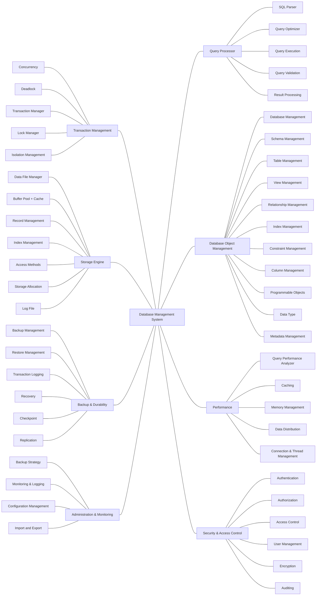

## 📐 Class Diagrams

:


## 🔍 Subsystem Class Diagrams


### 1. Query Processor Subsystem
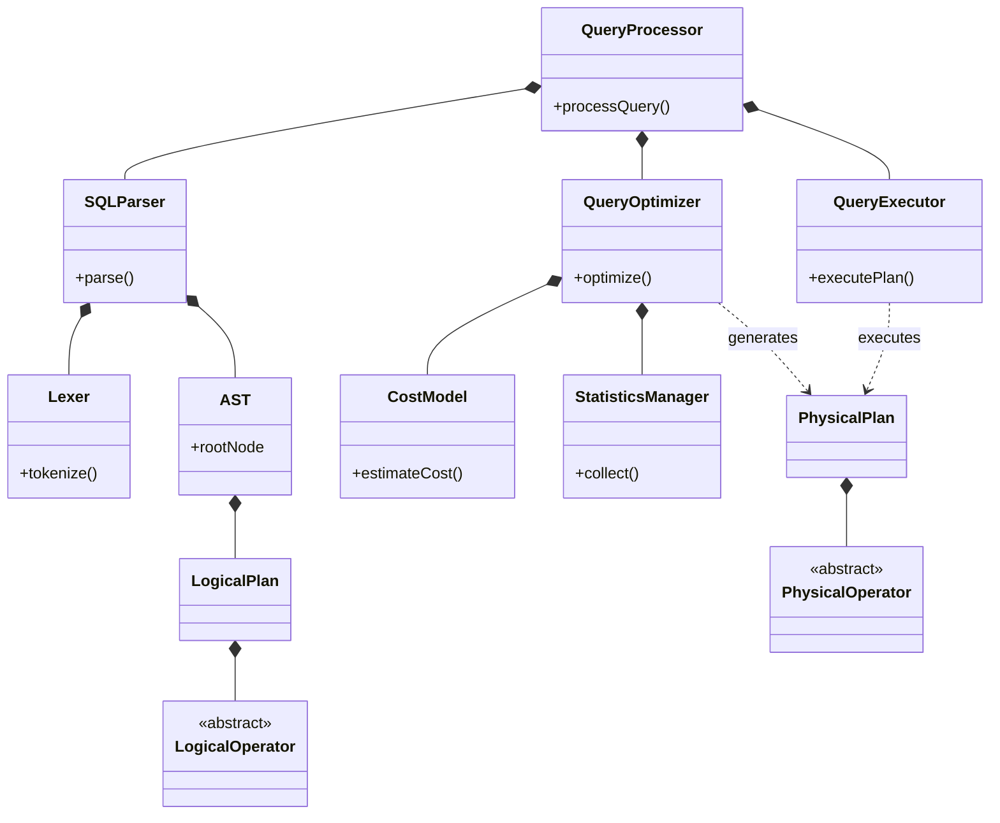

### 2. Storage Engine Subsystem
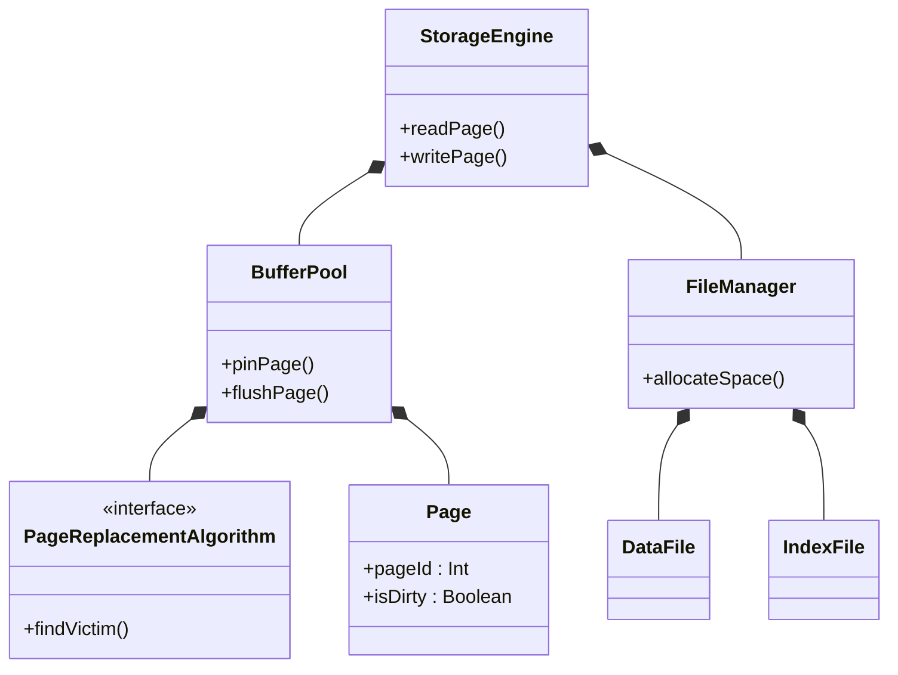

### 3. Transaction Subsystem
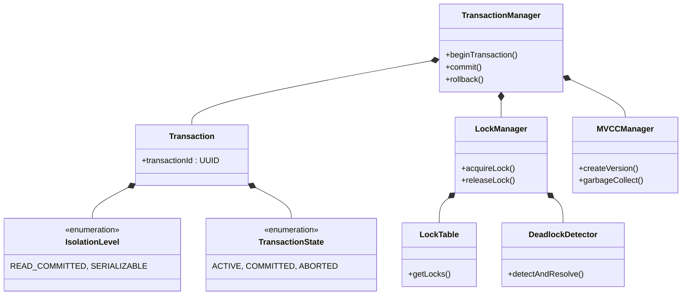

### 4. Database Object Management
```mermaid
classDiagram
    class CatalogManager {
        +registerObject()
        +findObject()
    }
    class DatabaseManager {
        +createDatabase()
        +dropDatabase()
    }
    class Database {
        +name : String
        +open()
    }
    class Schema {
        +name : String
        +createTable()
    }
    class Table {
        +name : String
        +insert()
        +update()
        +delete()
    }
    class Column {
        +name : String
        +nullable : Boolean
    }
    class Row {
        +rowId : UUID
        +values : List
    }
    class DataType {
        <<enumeration>>
    }
    class Constraint {
        <<abstract>>
    }
    class PrimaryKey
    class ForeignKey {
        +referenceTable : String
    }
    class UniqueConstraint
    class CheckConstraint
    class Index {
        <<abstract>>
    }
    class BTreeIndex
    class HashIndex
    class BitmapIndex
    class View
    class StoredProcedure
    class Function
    class Sequence
    class Trigger
    class Partition

    DatabaseManager *-- Database
    Database *-- Schema
    Schema *-- Table
    Schema *-- View
    Schema *-- StoredProcedure
    Schema *-- Function
    Schema *-- Sequence
    Table *-- Column
    Table *-- Row
    Table *-- Index
    Table *-- Constraint
    Table *-- Partition
    Table *-- Trigger
    Column *-- DataType
    Constraint <|-- PrimaryKey
    Constraint <|-- ForeignKey
    Constraint <|-- UniqueConstraint
    Constraint <|-- CheckConstraint
    Index <|-- BTreeIndex
    Index <|-- HashIndex
    Index <|-- BitmapIndex
    ForeignKey --> Table
    CatalogManager ..> Schema : manages
```

### 5. Backup & Durability
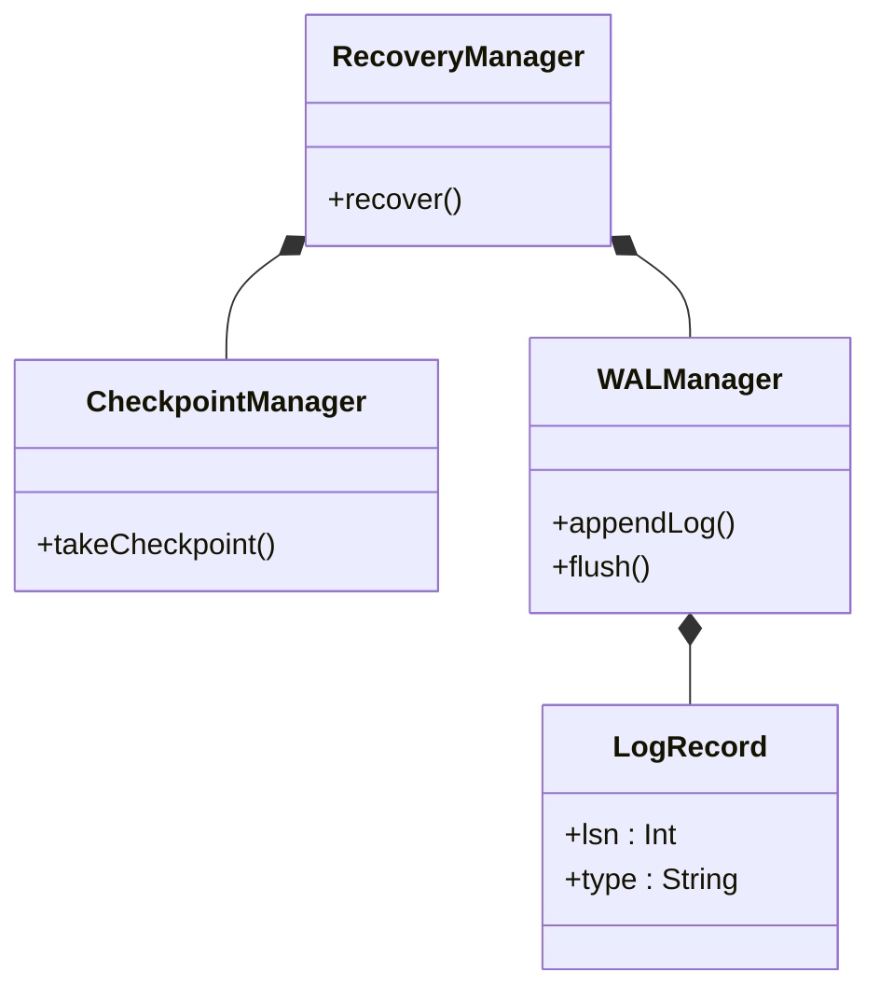

### 6. Security & Access Control
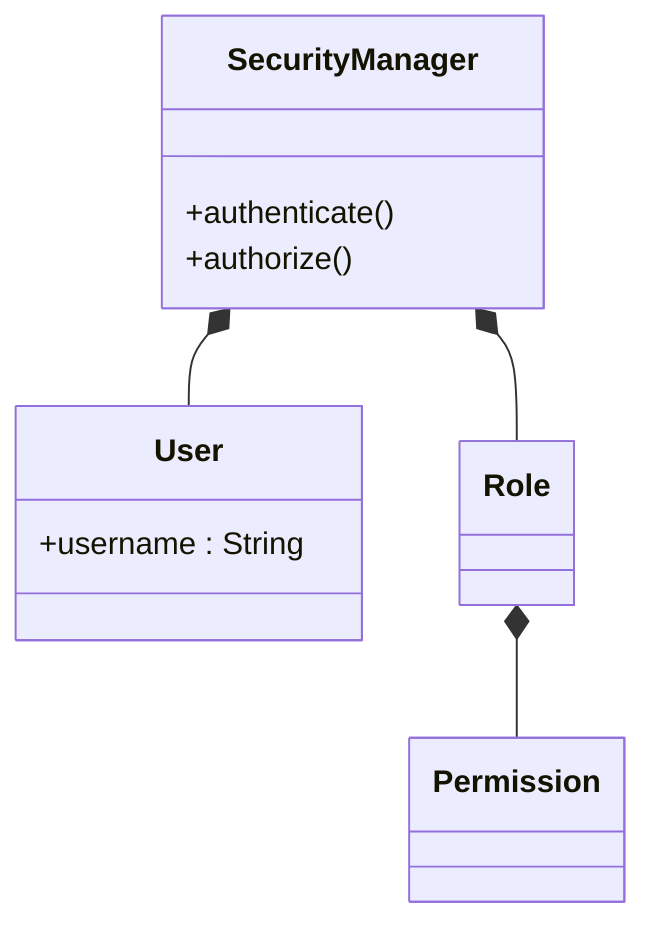

### 7. Core Server & Connections
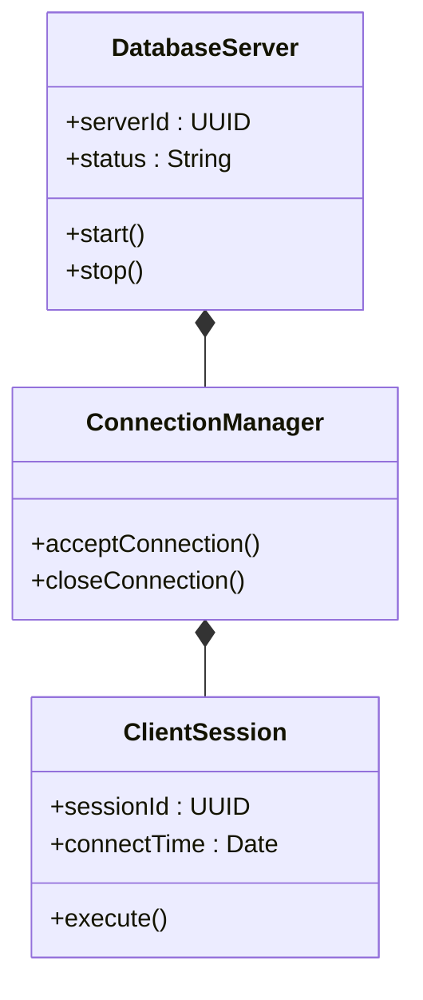


## 🧪 Unit Test 

### Core Server & Connections Unit Tests

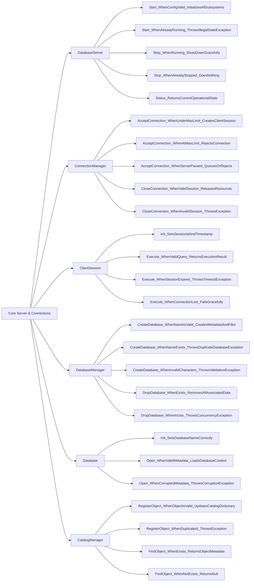

### Database Object Management Unit Tests

```mermaid
graph LR
    S1["Database Object Management"]
    S1 --> C1_0["Schema"]
    C1_0 --> T1_0_0["Init_SetsSchemaName"]
    C1_0 --> T1_0_1["CreateTable_WhenValidTable_RegistersInSchema"]
    C1_0 --> T1_0_2["CreateTable_WhenTableNameExists_ThrowsException"]
    C1_0 --> T1_0_3["DropTable_WhenExists_RemovesFromSchema"]
    S1 --> C1_1["Table"]
    C1_1 --> T1_1_0["Insert_WhenValidRowAndConstraintsMet_AppendsRow"]
    C1_1 --> T1_1_1["Insert_WhenPrimaryKeyViolated_ThrowsConstraintException"]
    C1_1 --> T1_1_2["Update_WhenRowExists_ModifiesValues"]
    C1_1 --> T1_1_3["Update_WhenRowNotExists_ReturnsZeroAffectedRows"]
    C1_1 --> T1_1_4["Delete_WhenRowExists_RemovesRow"]
    S1 --> C1_2["View"]
    C1_2 --> T1_2_0["Init_SetsQueryDefinition"]
    C1_2 --> T1_2_1["CompileView_WhenUnderlyingTablesExist_Succeeds"]
    S1 --> C1_3["StoredProcedure"]
    C1_3 --> T1_3_0["Execute_WhenValidParametersProvided_RunsLogic"]
    C1_3 --> T1_3_1["Execute_WhenTypeMismatchInParams_ThrowsException"]
    S1 --> C1_4["Function"]
    C1_4 --> T1_4_0["Evaluate_WhenValidArguments_ReturnsComputedValue"]
    C1_4 --> T1_4_1["Evaluate_WhenMissingArguments_ThrowsArgumentException"]
    S1 --> C1_5["Sequence"]
    C1_5 --> T1_5_0["NextValue_IncrementsByStepAndReturnsValue"]
    C1_5 --> T1_5_1["NextValue_WhenMaxLimitReached_ThrowsOverflowException"]
    S1 --> C1_6["Trigger"]
    C1_6 --> T1_6_0["Fire_OnEventConditionMet_ExecutesTriggerAction"]
    C1_6 --> T1_6_1["Fire_OnEventConditionNotMet_SkipsExecution"]
    S1 --> C1_7["Partition"]
    C1_7 --> T1_7_0["Init_SetsPartitionKeyCorrectly"]
    C1_7 --> T1_7_1["CheckBoundary_WhenValueInRange_ReturnsTrue"]
    S1 --> C1_8["Column"]
    C1_8 --> T1_8_0["Init_SetsNameAndNullableFlags"]
    C1_8 --> T1_8_1["ValidateType_WhenDataMatchesColumnType_Succeeds"]
    S1 --> C1_9["Row"]
    C1_9 --> T1_9_0["Init_GeneratesRowIdAndInitializesValueList"]
    C1_9 --> T1_9_1["GetValue_WhenIndexValid_ReturnsData"]
    S1 --> C1_10["DataType"]
    C1_10 --> T1_10_0["EnumValues_IncludeIntVarcharDateBoolean"]
    C1_10 --> T1_10_1["ParseString_WhenValidFormat_ReturnsDataTypeInstance"]
    S1 --> C1_11["Constraint"]
    C1_11 --> T1_11_0["Instantiation_OfAbstractClass_FailsWithTypeError"]
    S1 --> C1_12["PrimaryKey"]
    C1_12 --> T1_12_0["Validate_WhenValueIsUniqueAndNotNull_Succeeds"]
    C1_12 --> T1_12_1["Validate_WhenValueIsNull_ThrowsNullException"]
    C1_12 --> T1_12_2["Validate_WhenValueIsDuplicate_ThrowsDuplicateKeyException"]
    S1 --> C1_13["ForeignKey"]
    C1_13 --> T1_13_0["Validate_WhenReferencedRowExists_Succeeds"]
    C1_13 --> T1_13_1["Validate_WhenReferencedRowDoesNotExist_ThrowsForeignKeyException"]
    C1_13 --> T1_13_2["Init_SetsReferenceTableCorrectly"]
    S1 --> C1_14["UniqueConstraint"]
    C1_14 --> T1_14_0["Validate_WhenValueIsGloballyUnique_Succeeds"]
    C1_14 --> T1_14_1["Validate_WhenValueExistsInAnotherRow_ThrowsException"]
    S1 --> C1_15["CheckConstraint"]
    C1_15 --> T1_15_0["Validate_WhenExpressionEvaluatesToTrue_Succeeds"]
    C1_15 --> T1_15_1["Validate_WhenExpressionEvaluatesToFalse_ThrowsCheckException"]
    S1 --> C1_16["Index"]
    C1_16 --> T1_16_0["Instantiation_OfAbstractClass_FailsWithTypeError"]
    S1 --> C1_17["BTreeIndex"]
    C1_17 --> T1_17_0["InsertKey_WhenValid_AddsNodeToTreeBalancing"]
    C1_17 --> T1_17_1["Search_WhenKeyExists_ReturnsCorrespondingRowID"]
    C1_17 --> T1_17_2["Search_WhenKeyNotExists_ReturnsEmptyResult"]
    S1 --> C1_18["HashIndex"]
    C1_18 --> T1_18_0["InsertKey_ComputesHashAndAddsToBucket"]
    C1_18 --> T1_18_1["Search_WhenKeyExists_ResolvesHashToRowID"]
    C1_18 --> T1_18_2["HandleCollision_CreatesLinkedListInBucket"]
    S1 --> C1_19["BitmapIndex"]
    C1_19 --> T1_19_0["InsertKey_UpdatesBitmapBitsForGivenValue"]
    C1_19 --> T1_19_1["Search_WhenKeyExists_UsesBitwiseOperationsToFindRID"]
```

### Query Processor Unit Tests

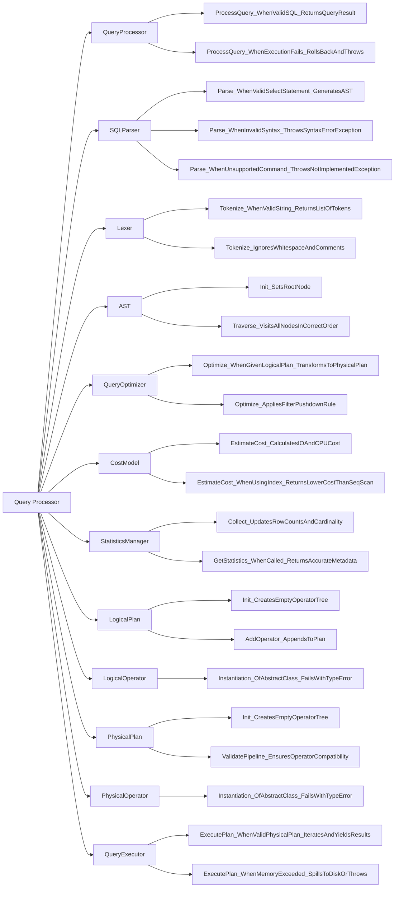

### Transaction Management Unit Tests

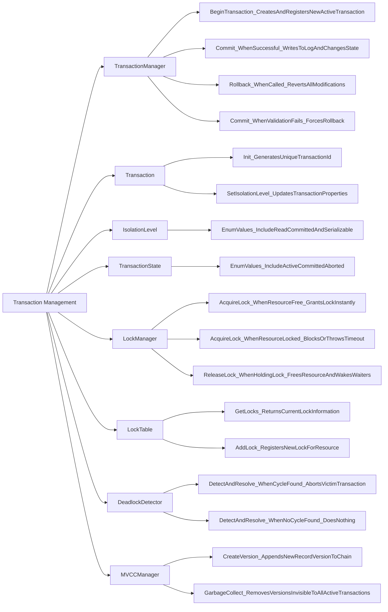

### Storage Engine Unit Tests

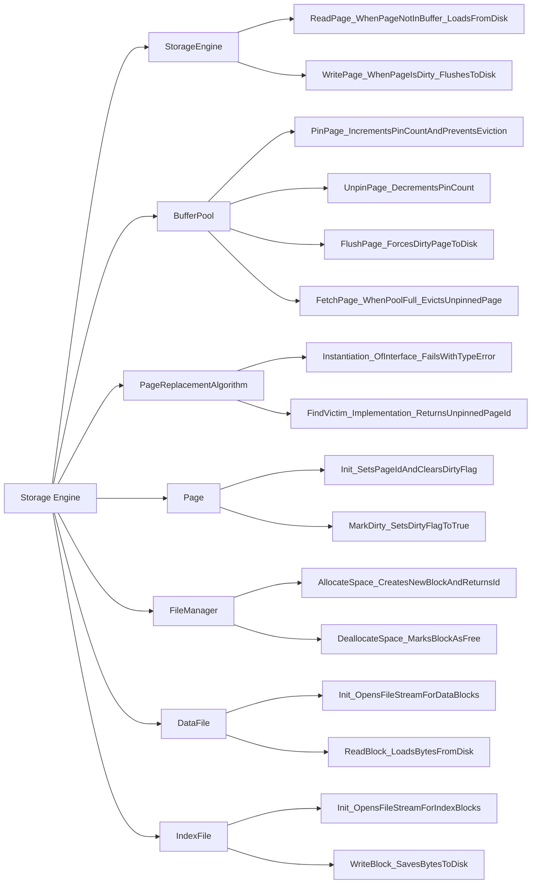

### Backup & Durability Unit Tests

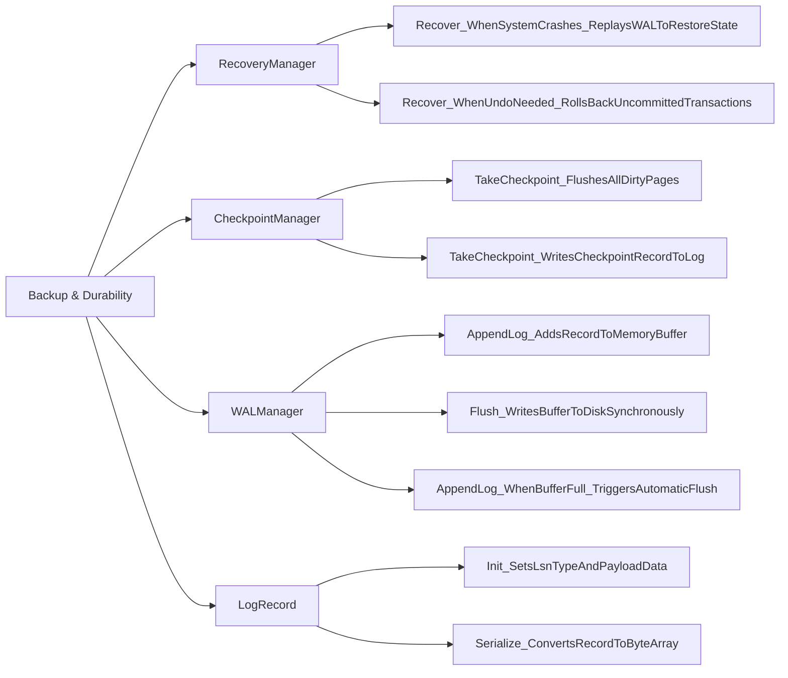

### Security & Access Control Unit Tests

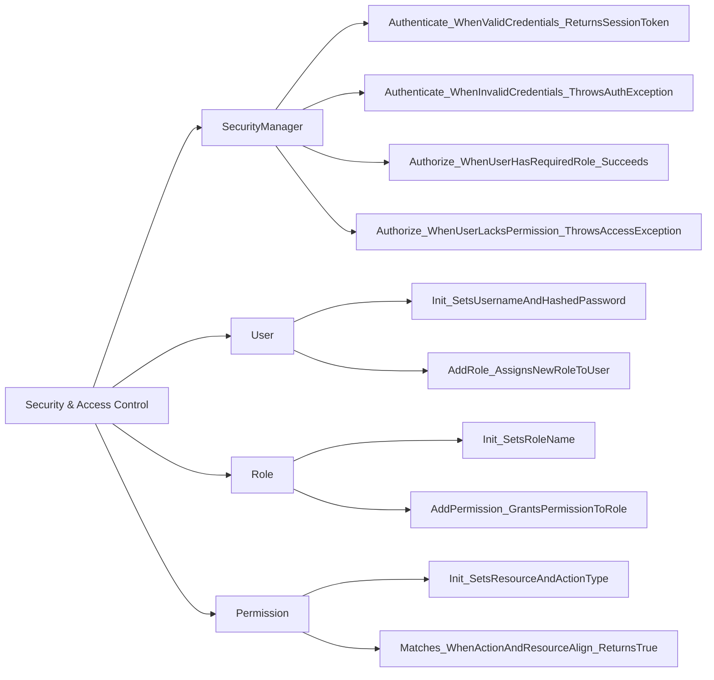
