# DBMS Index Management (B+ Tree Implementation)

<!-- Source: class_diagrams/1_lifecycle_management.md -->
# Index Management Subsystem - Lifecycle Management

This component is responsible for initializing new indexes, deleting indexes, rebuilding them when massive data changes occur (Rebuild), and validating the structural integrity of the B+ Tree (Validate).

---

## 1. Sub-Class Diagram

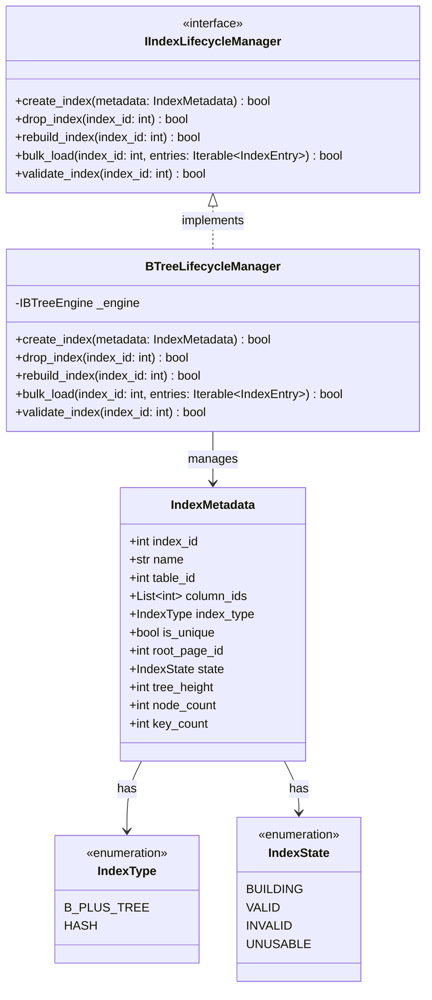
```mermaid
classDiagram
    %% --- ENUMS ---
    class IndexType {
        <<enumeration>>
        B_PLUS_TREE
        HASH
    }
    class IndexState {
        <<enumeration>>
        BUILDING
        VALID
        INVALID
        UNUSABLE
    }

    %% --- METADATA ---
    class IndexMetadata {
        +int index_id
        +str name
        +int table_id
        +List~int~ column_ids
        +IndexType index_type
        +bool is_unique
        +int root_page_id
        +IndexState state
        +int tree_height
        +int node_count
        +int key_count
    }

    %% --- INTERFACE ---
    class IIndexLifecycleManager {
        <<interface>>
        +create_index(metadata: IndexMetadata) bool
        +drop_index(index_id: int) bool
        +rebuild_index(index_id: int) bool
        +bulk_load(index_id: int, entries: Iterable~IndexEntry~) bool
        +validate_index(index_id: int) bool
    }

    %% --- IMPLEMENTATION ---
    class BTreeLifecycleManager {
        -IBTreeEngine _engine
        +create_index(metadata: IndexMetadata) bool
        +drop_index(index_id: int) bool
        +rebuild_index(index_id: int) bool
        +bulk_load(index_id: int, entries: Iterable~IndexEntry~) bool
        +validate_index(index_id: int) bool
    }

    %% --- RELATIONSHIPS ---
    IIndexLifecycleManager <|.. BTreeLifecycleManager : implements
    BTreeLifecycleManager --> IndexMetadata : manages
    IndexMetadata --> IndexType : has
    IndexMetadata --> IndexState : has
```

---

 

---

 

<!-- Source: class_diagrams/2_access_methods.md -->
# Index Management Subsystem - Access Methods

This component provides the main API interface for the end-user or Query Optimizer to interact with the index, performing operations: Point Search, Range Scan, Insert, Delete, and Update.

---

## 1. Sub-Class Diagram

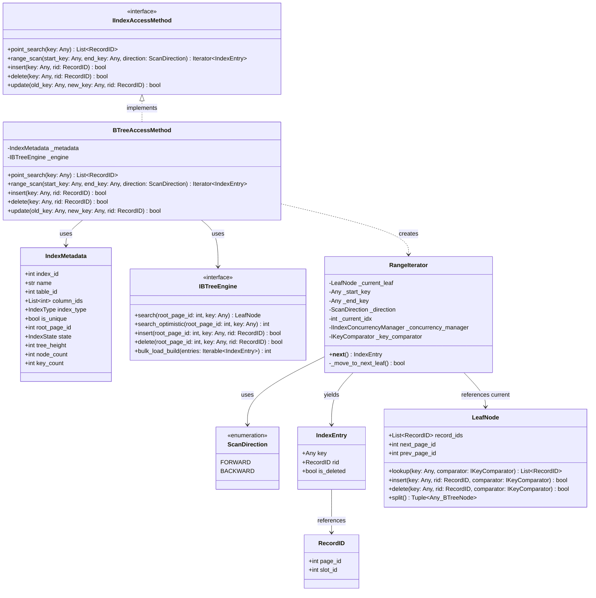
```mermaid
classDiagram
    %% --- ENUM ---
    class ScanDirection {
        <<enumeration>>
        FORWARD
        BACKWARD
    }

    %% --- ENTITIES ---
    class RecordID {
        +int page_id
        +int slot_id
    }

    class IndexEntry {
        +Any key
        +RecordID rid
        +bool is_deleted
    }

    class IndexMetadata {
        +int index_id
        +str name
        +int table_id
        +List~int~ column_ids
        +IndexType index_type
        +bool is_unique
        +int root_page_id
        +IndexState state
        +int tree_height
        +int node_count
        +int key_count
    }

    class LeafNode {
        +List~RecordID~ record_ids
        +int next_page_id
        +int prev_page_id
        +lookup(key: Any, comparator: IKeyComparator) List~RecordID~
        +insert(key: Any, rid: RecordID, comparator: IKeyComparator) bool
        +delete(key: Any, rid: RecordID, comparator: IKeyComparator) bool
        +split() Tuple~Any_BTreeNode~
    }

    %% --- INTERFACES ---
    class IIndexAccessMethod {
        <<interface>>
        +point_search(key: Any) List~RecordID~
        +range_scan(start_key: Any, end_key: Any, direction: ScanDirection) Iterator~IndexEntry~
        +insert(key: Any, rid: RecordID) bool
        +delete(key: Any, rid: RecordID) bool
        +update(old_key: Any, new_key: Any, rid: RecordID) bool
    }

    class IBTreeEngine {
        <<interface>>
        +search(root_page_id: int, key: Any) LeafNode
        +search_optimistic(root_page_id: int, key: Any) int
        +insert(root_page_id: int, key: Any, rid: RecordID) bool
        +delete(root_page_id: int, key: Any, rid: RecordID) bool
        +bulk_load_build(entries: Iterable~IndexEntry~) int
    }

    %% --- IMPLEMENTATIONS ---
    class BTreeAccessMethod {
        -IndexMetadata _metadata
        -IBTreeEngine _engine
        +point_search(key: Any) List~RecordID~
        +range_scan(start_key: Any, end_key: Any, direction: ScanDirection) Iterator~IndexEntry~
        +insert(key: Any, rid: RecordID) bool
        +delete(key: Any, rid: RecordID) bool
        +update(old_key: Any, new_key: Any, rid: RecordID) bool
    }

    class RangeIterator {
        -LeafNode _current_leaf
        -Any _start_key
        -Any _end_key
        -ScanDirection _direction
        -int _current_idx
        -IIndexConcurrencyManager _concurrency_manager
        -IKeyComparator _key_comparator
        +__next__() IndexEntry
        -_move_to_next_leaf() bool
    }

    %% --- RELATIONSHIPS ---
    IIndexAccessMethod <|.. BTreeAccessMethod : implements
    BTreeAccessMethod --> IBTreeEngine : uses
    BTreeAccessMethod --> IndexMetadata : uses
    BTreeAccessMethod ..> RangeIterator : creates
    RangeIterator --> ScanDirection : uses
    RangeIterator --> IndexEntry : yields
    RangeIterator --> LeafNode : references current
    IndexEntry --> RecordID : references
```

---

 

---

 

<!-- Source: class_diagrams/3_btree_core_engine.md -->
# Index Management Subsystem - Core B+ Tree Engine

This component represents the core of the B+ Tree algorithm, responsible for tree traversal, page allocation, node splitting upon overflow, and merging/borrowing keys from siblings upon underflow.

---

## 1. Sub-Class Diagram

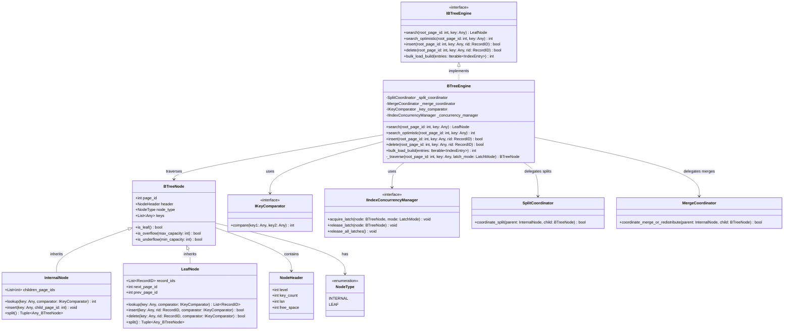
```mermaid
classDiagram
    %% --- ENUM ---
    class NodeType {
        <<enumeration>>
        INTERNAL
        LEAF
    }

    %% --- ENTITIES ---
    class NodeHeader {
        +int level
        +int key_count
        +int lsn
        +int free_space
    }

    class BTreeNode {
        +int page_id
        +NodeHeader header
        +NodeType node_type
        +List~Any~ keys
        +is_leaf() bool
        +is_overflow(max_capacity: int) bool
        +is_underflow(min_capacity: int) bool
    }

    class InternalNode {
        +List~int~ children_page_ids
        +lookup(key: Any, comparator: IKeyComparator) int
        +insert(key: Any, child_page_id: int) void
        +split() Tuple~Any_BTreeNode~
    }

    class LeafNode {
        +List~RecordID~ record_ids
        +int next_page_id
        +int prev_page_id
        +lookup(key: Any, comparator: IKeyComparator) List~RecordID~
        +insert(key: Any, rid: RecordID, comparator: IKeyComparator) bool
        +delete(key: Any, rid: RecordID, comparator: IKeyComparator) bool
        +split() Tuple~Any_BTreeNode~
    }

    %% --- INTERFACES ---
    class IBTreeEngine {
        <<interface>>
        +search(root_page_id: int, key: Any) LeafNode
        +search_optimistic(root_page_id: int, key: Any) int
        +insert(root_page_id: int, key: Any, rid: RecordID) bool
        +delete(root_page_id: int, key: Any, rid: RecordID) bool
        +bulk_load_build(entries: Iterable~IndexEntry~) int
    }

    class IKeyComparator {
        <<interface>>
        +compare(key1: Any, key2: Any) int
    }

    class IIndexConcurrencyManager {
        <<interface>>
        +acquire_latch(node: BTreeNode, mode: LatchMode) void
        +release_latch(node: BTreeNode) void
        +release_all_latches() void
    }

    %% --- IMPLEMENTATIONS & COORDINATORS ---
    class BTreeEngine {
        -SplitCoordinator _split_coordinator
        -MergeCoordinator _merge_coordinator
        -IKeyComparator _key_comparator
        -IIndexConcurrencyManager _concurrency_manager
        +search(root_page_id: int, key: Any) LeafNode
        +search_optimistic(root_page_id: int, key: Any) int
        +insert(root_page_id: int, key: Any, rid: RecordID) bool
        +delete(root_page_id: int, key: Any, rid: RecordID) bool
        +bulk_load_build(entries: Iterable~IndexEntry~) int
        -_traverse(root_page_id: int, key: Any, latch_mode: LatchMode) BTreeNode
    }

    class SplitCoordinator {
        +coordinate_split(parent: InternalNode, child: BTreeNode) bool
    }

    class MergeCoordinator {
        +coordinate_merge_or_redistribute(parent: InternalNode, child: BTreeNode) bool
    }

    %% --- RELATIONSHIPS ---
    BTreeNode <|-- InternalNode : inherits
    BTreeNode <|-- LeafNode : inherits
    BTreeNode --> NodeHeader : contains
    BTreeNode --> NodeType : has

    IBTreeEngine <|.. BTreeEngine : implements
    BTreeEngine --> SplitCoordinator : delegates splits
    BTreeEngine --> MergeCoordinator : delegates merges
    BTreeEngine --> BTreeNode : traverses
    BTreeEngine --> IKeyComparator : uses
    BTreeEngine --> IIndexConcurrencyManager : uses
```

---

 

---

 

<!-- Source: class_diagrams/4_concurrency_control.md -->
# Index Management Subsystem - Concurrency Control

This component ensures the structural consistency of the index tree when multiple threads are reading and writing simultaneously (Multi-threading). It implements the Latch Crabbing protocol and supports the Optimistic Read strategy.

---

## 1. Sub-Class Diagram

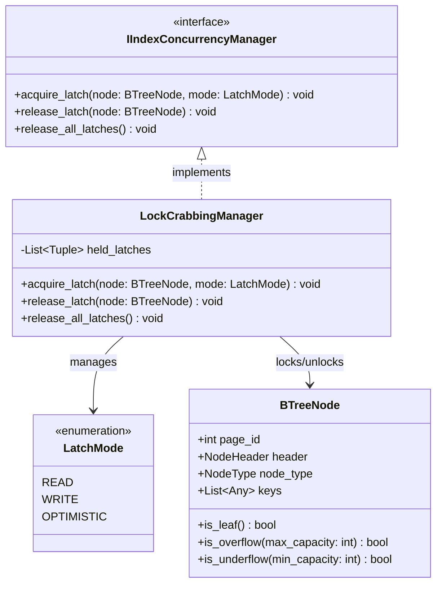
```mermaid
classDiagram
    %% --- ENUM ---
    class LatchMode {
        <<enumeration>>
        READ
        WRITE
        OPTIMISTIC
    }

    %% --- ENTITIES ---
    class BTreeNode {
        +int page_id
        +NodeHeader header
        +NodeType node_type
        +List~Any~ keys
        +is_leaf() bool
        +is_overflow(max_capacity: int) bool
        +is_underflow(min_capacity: int) bool
    }

    %% --- INTERFACE ---
    class IIndexConcurrencyManager {
        <<interface>>
        +acquire_latch(node: BTreeNode, mode: LatchMode) void
        +release_latch(node: BTreeNode) void
        +release_all_latches() void
    }

    %% --- IMPLEMENTATION ---
    class LockCrabbingManager {
        -List~Tuple~ held_latches
        +acquire_latch(node: BTreeNode, mode: LatchMode) void
        +release_latch(node: BTreeNode) void
        +release_all_latches() void
    }

    %% --- RELATIONSHIPS ---
    IIndexConcurrencyManager <|.. LockCrabbingManager : implements
    LockCrabbingManager --> LatchMode : manages
    LockCrabbingManager --> BTreeNode : locks/unlocks
```

---

 

---

 

<!-- Source: class_diagrams/5_maintenance_garbage_collection.md -->
# Index Management Subsystem - Maintenance & Garbage Collection

This component performs periodic or background space reclamation. The Vacuum worker is responsible for physically reclaiming memory slots of logically deleted entries (Tombstone) and compressing prefix keys (Prefix Compression) on B+ Tree leaf nodes. The Key Comparator class is used to define how to compare different data types of keys.

---

## 1. Sub-Class Diagram

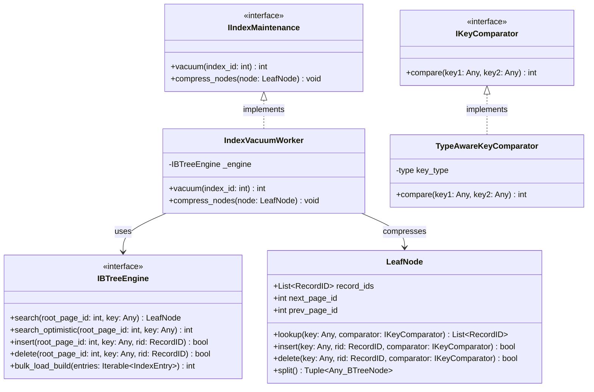
```mermaid
classDiagram
    %% --- ENTITIES ---
    class LeafNode {
        +List~RecordID~ record_ids
        +int next_page_id
        +int prev_page_id
        +lookup(key: Any, comparator: IKeyComparator) List~RecordID~
        +insert(key: Any, rid: RecordID, comparator: IKeyComparator) bool
        +delete(key: Any, rid: RecordID, comparator: IKeyComparator) bool
        +split() Tuple~Any_BTreeNode~
    }

    %% --- INTERFACES ---
    class IIndexMaintenance {
        <<interface>>
        +vacuum(index_id: int) int
        +compress_nodes(node: LeafNode) void
    }

    class IKeyComparator {
        <<interface>>
        +compare(key1: Any, key2: Any) int
    }

    class IBTreeEngine {
        <<interface>>
        +search(root_page_id: int, key: Any) LeafNode
        +search_optimistic(root_page_id: int, key: Any) int
        +insert(root_page_id: int, key: Any, rid: RecordID) bool
        +delete(root_page_id: int, key: Any, rid: RecordID) bool
        +bulk_load_build(entries: Iterable~IndexEntry~) int
    }

    %% --- IMPLEMENTATIONS ---
    class IndexVacuumWorker {
        -IBTreeEngine _engine
        +vacuum(index_id: int) int
        +compress_nodes(node: LeafNode) void
    }

    class TypeAwareKeyComparator {
        -type key_type
        +compare(key1: Any, key2: Any) int
    }

    %% --- RELATIONSHIPS ---
    IIndexMaintenance <|.. IndexVacuumWorker : implements
    IKeyComparator <|.. TypeAwareKeyComparator : implements
    IndexVacuumWorker --> IBTreeEngine : uses
    IndexVacuumWorker --> LeafNode : compresses
```

---

 

---

 

<!-- Source: class_diagrams/0_overall.md -->
# DBMS Index Management Final Class Diagram (Overall)

This document contains the **Final Class Diagram** which is 100% synchronized with the previous **8 Sequence Diagrams**. This diagram specifies in detail all the classes, interfaces, entities, properties, methods (with parameter and return types) and relationships, ready for implementation in **Python**.

---

## 1. Class Diagram (Mermaid)

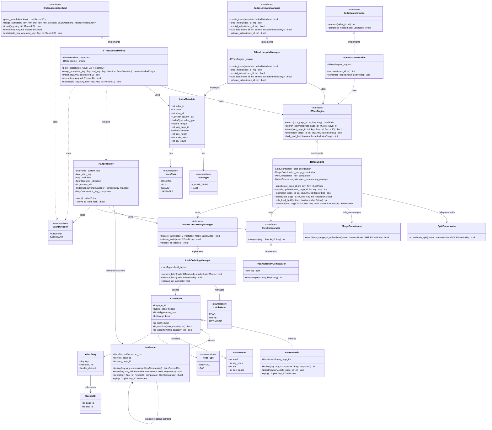
```mermaid
classDiagram
    %% --- ENUMS ---
    class IndexType {
        <<enumeration>>
        B_PLUS_TREE
        HASH
    }
    class IndexState {
        <<enumeration>>
        BUILDING
        VALID
        INVALID
        UNUSABLE
    }
    class NodeType {
        <<enumeration>>
        INTERNAL
        LEAF
    }
    class LatchMode {
        <<enumeration>>
        READ
        WRITE
        OPTIMISTIC
    }
    class ScanDirection {
        <<enumeration>>
        FORWARD
        BACKWARD
    }

    %% --- ENTITIES ---
    class RecordID {
        +int page_id
        +int slot_id
    }

    class IndexEntry {
        +Any key
        +RecordID rid
        +bool is_deleted
    }

    class NodeHeader {
        +int level
        +int key_count
        +int lsn
        +int free_space
    }

    class BTreeNode {
        +int page_id
        +NodeHeader header
        +NodeType node_type
        +List~Any~ keys
        +is_leaf() bool
        +is_overflow(max_capacity: int) bool
        +is_underflow(min_capacity: int) bool
    }

    class InternalNode {
        +List~int~ children_page_ids
        +lookup(key: Any, comparator: IKeyComparator) int
        +insert(key: Any, child_page_id: int) void
        +split() Tuple~Any_BTreeNode~
    }

    class LeafNode {
        +List~RecordID~ record_ids
        +int next_page_id
        +int prev_page_id
        +lookup(key: Any, comparator: IKeyComparator) List~RecordID~
        +insert(key: Any, rid: RecordID, comparator: IKeyComparator) bool
        +delete(key: Any, rid: RecordID, comparator: IKeyComparator) bool
        +split() Tuple~Any_BTreeNode~
    }

    class IndexMetadata {
        +int index_id
        +str name
        +int table_id
        +List~int~ column_ids
        +IndexType index_type
        +bool is_unique
        +int root_page_id
        +IndexState state
        +int tree_height
        +int node_count
        +int key_count
    }

    %% --- INTERFACES ---
    class IIndexLifecycleManager {
        <<interface>>
        +create_index(metadata: IndexMetadata) bool
        +drop_index(index_id: int) bool
        +rebuild_index(index_id: int) bool
        +bulk_load(index_id: int, entries: Iterable~IndexEntry~) bool
        +validate_index(index_id: int) bool
    }

    class IIndexAccessMethod {
        <<interface>>
        +point_search(key: Any) List~RecordID~
        +range_scan(start_key: Any, end_key: Any, direction: ScanDirection) Iterator~IndexEntry~
        +insert(key: Any, rid: RecordID) bool
        +delete(key: Any, rid: RecordID) bool
        +update(old_key: Any, new_key: Any, rid: RecordID) bool
    }

    class IBTreeEngine {
        <<interface>>
        +search(root_page_id: int, key: Any) LeafNode
        +search_optimistic(root_page_id: int, key: Any) int
        +insert(root_page_id: int, key: Any, rid: RecordID) bool
        +delete(root_page_id: int, key: Any, rid: RecordID) bool
        +bulk_load_build(entries: Iterable~IndexEntry~) int
    }

    class IKeyComparator {
        <<interface>>
        +compare(key1: Any, key2: Any) int
    }

    class IIndexConcurrencyManager {
        <<interface>>
        +acquire_latch(node: BTreeNode, mode: LatchMode) void
        +release_latch(node: BTreeNode) void
        +release_all_latches() void
    }

    class IIndexMaintenance {
        <<interface>>
        +vacuum(index_id: int) int
        +compress_nodes(node: LeafNode) void
    }

    %% --- IMPLEMENTATIONS & CLASSES ---
    class BTreeLifecycleManager {
        -IBTreeEngine _engine
        +create_index(metadata: IndexMetadata) bool
        +drop_index(index_id: int) bool
        +rebuild_index(index_id: int) bool
        +bulk_load(index_id: int, entries: Iterable~IndexEntry~) bool
        +validate_index(index_id: int) bool
    }

    class BTreeAccessMethod {
        -IndexMetadata _metadata
        -IBTreeEngine _engine
        +point_search(key: Any) List~RecordID~
        +range_scan(start_key: Any, end_key: Any, direction: ScanDirection) Iterator~IndexEntry~
        +insert(key: Any, rid: RecordID) bool
        +delete(key: Any, rid: RecordID) bool
        +update(old_key: Any, new_key: Any, rid: RecordID) bool
    }

    class BTreeEngine {
        -SplitCoordinator _split_coordinator
        -MergeCoordinator _merge_coordinator
        -IKeyComparator _key_comparator
        -IIndexConcurrencyManager _concurrency_manager
        +search(root_page_id: int, key: Any) LeafNode
        +search_optimistic(root_page_id: int, key: Any) int
        +insert(root_page_id: int, key: Any, rid: RecordID) bool
        +delete(root_page_id: int, key: Any, rid: RecordID) bool
        +bulk_load_build(entries: Iterable~IndexEntry~) int
        -_traverse(root_page_id: int, key: Any, latch_mode: LatchMode) BTreeNode
    }

    class RangeIterator {
        -LeafNode _current_leaf
        -Any _start_key
        -Any _end_key
        -ScanDirection _direction
        -int _current_idx
        -IIndexConcurrencyManager _concurrency_manager
        -IKeyComparator _key_comparator
        +__next__() IndexEntry
        -_move_to_next_leaf() bool
    }

    class SplitCoordinator {
        +coordinate_split(parent: InternalNode, child: BTreeNode) bool
    }

    class MergeCoordinator {
        +coordinate_merge_or_redistribute(parent: InternalNode, child: BTreeNode) bool
    }

    class TypeAwareKeyComparator {
        -type key_type
        +compare(key1: Any, key2: Any) int
    }

    class LockCrabbingManager {
        -List~Tuple~ held_latches
        +acquire_latch(node: BTreeNode, mode: LatchMode) void
        +release_latch(node: BTreeNode) void
        +release_all_latches() void
    }

    class IndexVacuumWorker {
        -IBTreeEngine _engine
        +vacuum(index_id: int) int
        +compress_nodes(node: LeafNode) void
    }

    %% --- RELATIONSHIPS & INHERITANCE ---
    BTreeNode <|-- InternalNode : inherits
    BTreeNode <|-- LeafNode : inherits

    IIndexLifecycleManager <|.. BTreeLifecycleManager : implements
    IIndexAccessMethod <|.. BTreeAccessMethod : implements
    IBTreeEngine <|.. BTreeEngine : implements
    IKeyComparator <|.. TypeAwareKeyComparator : implements
    IIndexConcurrencyManager <|.. LockCrabbingManager : implements
    IIndexMaintenance <|.. IndexVacuumWorker : implements

    BTreeAccessMethod --> IBTreeEngine : uses
    BTreeAccessMethod --> IndexMetadata : uses
    BTreeAccessMethod ..> RangeIterator : creates
    BTreeLifecycleManager --> IBTreeEngine : uses
    BTreeLifecycleManager --> IndexMetadata : manages
    IndexVacuumWorker --> IBTreeEngine : uses

    BTreeEngine --> SplitCoordinator : delegates splits
    BTreeEngine --> MergeCoordinator : delegates merges
    BTreeEngine --> IKeyComparator : uses
    BTreeEngine --> IIndexConcurrencyManager : uses

    RangeIterator --> LeafNode : references current
    RangeIterator --> IIndexConcurrencyManager : uses
    RangeIterator --> IKeyComparator : uses
    RangeIterator --> ScanDirection : uses
    IIndexAccessMethod ..> ScanDirection : uses
    BTreeAccessMethod ..> ScanDirection : uses

    LockCrabbingManager --> LatchMode : manages
    LockCrabbingManager --> BTreeNode : latches

    IndexMetadata --> IndexType : has
    IndexMetadata --> IndexState : has
    BTreeNode --> NodeHeader : contains
    BTreeNode --> NodeType : has
    BTreeNode --> IndexEntry : contains list of
    IndexEntry --> RecordID : references
    LeafNode --> LeafNode : next/prev sibling pointers
```

---

 

---

 

<!-- Source: sequence_diagrams/1_point_search.md -->
# Index Management Subsystem - Point Search Flow

The Point Search flow performs a search for a specific key in the B+ Tree index to return the corresponding list of `RecordID`s. Below is a detailed description of the scenarios for this flow.

---

## 1. Scenario A: Key Found - Happy Path

* **Description:** The key exists in the index. The traversal process succeeds from the root node down to the leaf node, applying **Read Lock Crabbing**, finds the key at the leaf page, and returns a valid list of `RecordID`s.

### Sequence Diagram:

```mermaid
sequenceDiagram
    autonumber
    actor Client
    participant AM as BTreeAccessMethod
    participant MD as IndexMetadata
    participant BE as BTreeEngine
    participant LCM as LockCrabbingManager
    participant Leaf as LeafNode
    participant Internal as InternalNode
    participant Comp as IKeyComparator

    Client->>AM: point_search(key)
    activate AM
    
    AM->>MD: get root_page_id & state
    activate MD
    MD-->>AM: root_page_id, state=VALID
    deactivate MD

    AM->>BE: search(root_page_id, key)
    activate BE
    
    BE->>BE: _traverse(root_page_id, key, LatchMode.READ)
    activate BE
    
    BE->>LCM: acquire_latch(root_node, LatchMode.READ)
    activate LCM
    LCM-->>BE: success
    deactivate LCM
    
    loop Traverse from parent node to child node (InternalNode -> ChildNode)
        BE->>Internal: get children page pointers
        activate Internal
        Internal-->>BE: children_page_ids
        deactivate Internal
        
        BE->>Internal: lookup(key, comparator)
        activate Internal
        Internal->>Comp: compare(key, node_keys)
        activate Comp
        Comp-->>Internal: index_position
        deactivate Comp
        Internal-->>BE: child_page_id
        deactivate Internal
        
        BE->>LCM: acquire_latch(child_node, LatchMode.READ)
        activate LCM
        LCM-->>BE: success
        deactivate LCM
        
        BE->>LCM: release_latch(parent_node)
        activate LCM
        LCM-->>BE: success
        deactivate LCM
    end
    deactivate BE
    
    BE-->>AM: leaf_node (holds Read latch)
    deactivate BE

    AM->>Leaf: lookup(key, comparator)
    activate Leaf
    Leaf->>Comp: compare(key, leaf_keys)
    activate Comp
    Comp-->>Leaf: matching_positions
    deactivate Comp
    Leaf-->>AM: List[RecordID]
    deactivate Leaf

    AM->>LCM: release_all_latches()
    activate LCM
    LCM-->>AM: success
    deactivate LCM

    AM-->>Client: List[RecordID]
    deactivate AM
```

---

## 2. Scenario B: Key Not Found

* **Description:** The key does not exist in the index. The tree traversal process proceeds normally down to the leaf node, but when performing the binary search on the leaf node, there is no matching key. The system returns an empty list (`[]`).

### Sequence Diagram:
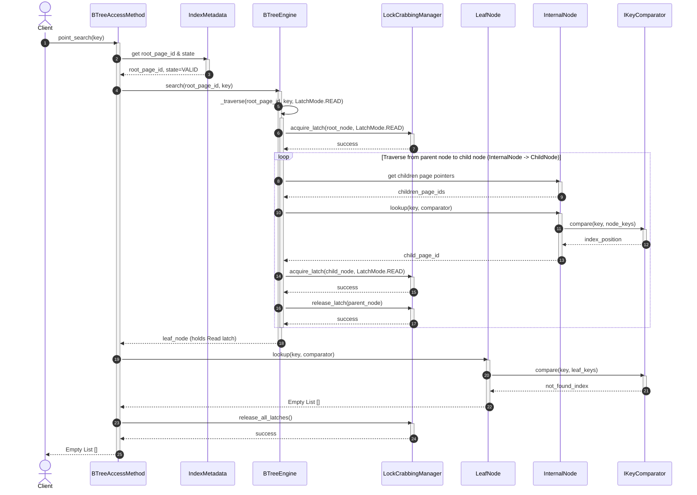
```mermaid
sequenceDiagram
    autonumber
    actor Client
    participant AM as BTreeAccessMethod
    participant MD as IndexMetadata
    participant BE as BTreeEngine
    participant LCM as LockCrabbingManager
    participant Leaf as LeafNode
    participant Internal as InternalNode
    participant Comp as IKeyComparator

    Client->>AM: point_search(key)
    activate AM
    
    AM->>MD: get root_page_id & state
    activate MD
    MD-->>AM: root_page_id, state=VALID
    deactivate MD

    AM->>BE: search(root_page_id, key)
    activate BE
    
    BE->>BE: _traverse(root_page_id, key, LatchMode.READ)
    activate BE
    
    BE->>LCM: acquire_latch(root_node, LatchMode.READ)
    activate LCM
    LCM-->>BE: success
    deactivate LCM
    
    loop Traverse from parent node to child node (InternalNode -> ChildNode)
        BE->>Internal: get children page pointers
        activate Internal
        Internal-->>BE: children_page_ids
        deactivate Internal
        
        BE->>Internal: lookup(key, comparator)
        activate Internal
        Internal->>Comp: compare(key, node_keys)
        activate Comp
        Comp-->>Internal: index_position
        deactivate Comp
        Internal-->>BE: child_page_id
        deactivate Internal
        
        BE->>LCM: acquire_latch(child_node, LatchMode.READ)
        activate LCM
        LCM-->>BE: success
        deactivate LCM
        
        BE->>LCM: release_latch(parent_node)
        activate LCM
        LCM-->>BE: success
        deactivate LCM
    end
    deactivate BE
    
    BE-->>AM: leaf_node (holds Read latch)
    deactivate BE

    AM->>Leaf: lookup(key, comparator)
    activate Leaf
    Leaf->>Comp: compare(key, leaf_keys)
    activate Comp
    Comp-->>Leaf: not_found_index
    deactivate Comp
    Leaf-->>AM: Empty List []
    deactivate Leaf

    AM->>LCM: release_all_latches()
    activate LCM
    LCM-->>AM: success
    deactivate LCM

    AM-->>Client: Empty List []
    deactivate AM
```

---

## 3. Scenario C: Invalid Index - Early Failure

* **Description:** The client requests a search on an index that is corrupted or currently being built (`state != VALID`). The system checks the metadata, detects the invalid state, and aborts the process early, throwing an error.

### Sequence Diagram:
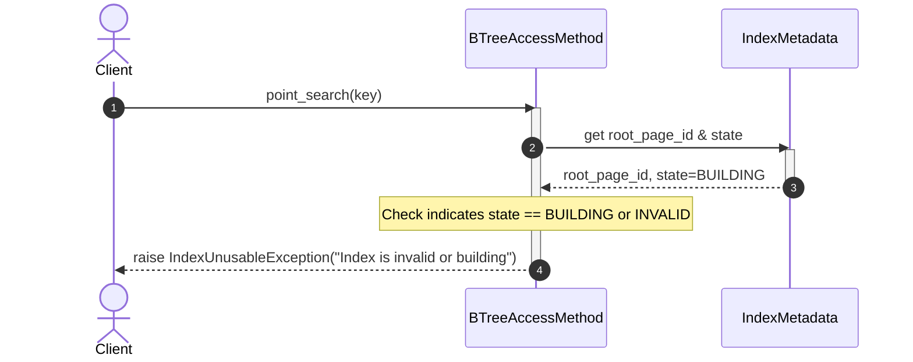
```mermaid
sequenceDiagram
    autonumber
    actor Client
    participant AM as BTreeAccessMethod
    participant MD as IndexMetadata

    Client->>AM: point_search(key)
    activate AM
    
    AM->>MD: get root_page_id & state
    activate MD
    MD-->>AM: root_page_id, state=BUILDING
    deactivate MD

    note over AM: Check indicates state == BUILDING or INVALID
    AM-->>Client: raise IndexUnusableException("Index is invalid or building")
    deactivate AM
```

 

---

 

<!-- Source: sequence_diagrams/2_range_scan.md -->
# Index Management Subsystem - Range Scan Flow

The Range Scan flow allows users to scan and retrieve all records falling within a key range `[start_key, end_key]` in either forward or backward direction.

---

## 1. Scenario A: Forward Scan - Multiple Leaves

* **Description:** The scan process moves from `start_key` to `end_key` in the forward direction (`direction = FORWARD`). When finishing scanning the current page, it gets the `next_page_id`, acquires the read latch on the next leaf page first before releasing the read latch on the current leaf page (Lock Crabbing on leaf pages) to prevent losing the link due to another write thread.

### Sequence Diagram:
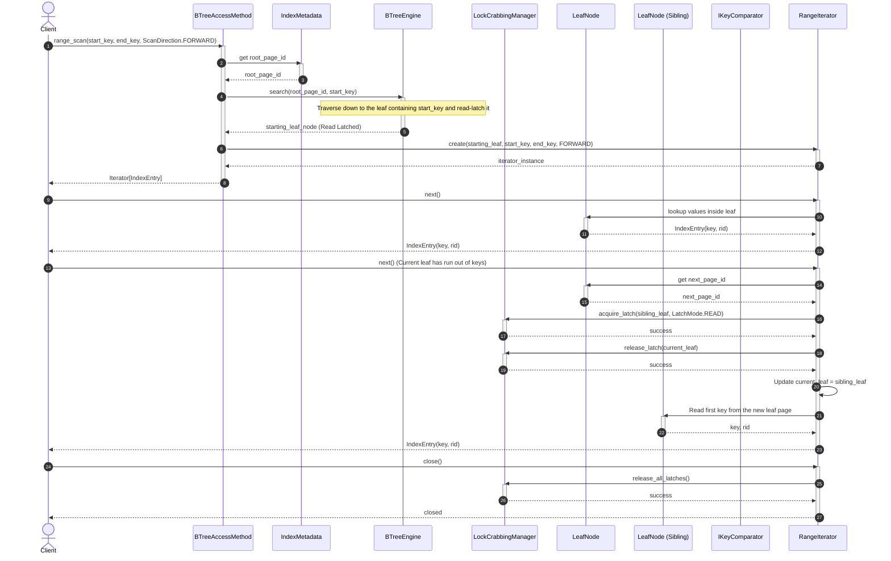
```mermaid
sequenceDiagram
    autonumber
    actor Client
    participant AM as BTreeAccessMethod
    participant MD as IndexMetadata
    participant BE as BTreeEngine
    participant LCM as LockCrabbingManager
    participant Leaf as LeafNode
    participant Sibling as LeafNode (Sibling)
    participant Comp as IKeyComparator
    participant Iter as RangeIterator

    Client->>AM: range_scan(start_key, end_key, ScanDirection.FORWARD)
    activate AM
    
    AM->>MD: get root_page_id
    activate MD
    MD-->>AM: root_page_id
    deactivate MD

    AM->>BE: search(root_page_id, start_key)
    activate BE
    note over BE: Traverse down to the leaf containing start_key and read-latch it
    BE-->>AM: starting_leaf_node (Read Latched)
    deactivate BE

    AM->>Iter: create(starting_leaf, start_key, end_key, FORWARD)
    activate Iter
    Iter-->>AM: iterator_instance
    deactivate Iter
    
    AM-->>Client: Iterator[IndexEntry]
    deactivate AM

    %% Client pulls elements
    Client->>Iter: next()
    activate Iter
    Iter->>Leaf: lookup values inside leaf
    activate Leaf
    Leaf-->>Iter: IndexEntry(key, rid)
    deactivate Leaf
    Iter-->>Client: IndexEntry(key, rid)
    deactivate Iter

    %% Sibling movement
    Client->>Iter: next() (Current leaf has run out of keys)
    activate Iter
    Iter->>Leaf: get next_page_id
    activate Leaf
    Leaf-->>Iter: next_page_id
    deactivate Leaf
    
    Iter->>LCM: acquire_latch(sibling_leaf, LatchMode.READ)
    activate LCM
    LCM-->>Iter: success
    deactivate LCM
    
    Iter->>LCM: release_latch(current_leaf)
    activate LCM
    LCM-->>Iter: success
    deactivate LCM
    
    Iter->>Iter: Update current_leaf = sibling_leaf
    
    Iter->>Sibling: Read first key from the new leaf page
    activate Sibling
    Sibling-->>Iter: key, rid
    deactivate Sibling
    
    Iter-->>Client: IndexEntry(key, rid)
    deactivate Iter

    %% Close iterator
    Client->>Iter: close()
    activate Iter
    Iter->>LCM: release_all_latches()
    activate LCM
    LCM-->>Iter: success
    deactivate LCM
    Iter-->>Client: closed
    deactivate Iter
```

---

## 2. Scenario B: Backward Scan

* **Description:** The backward scan process goes from `start_key` to `end_key` (`direction = BACKWARD`). It traverses in the reverse direction using the previous page link pointer `prev_page_id`.

### Sequence Diagram:
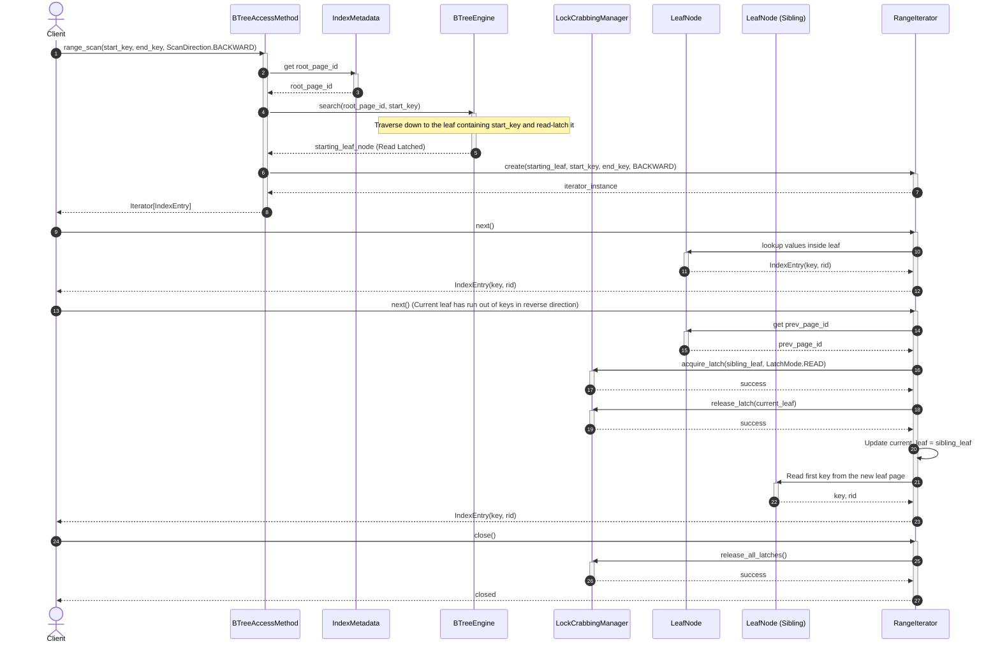
```mermaid
sequenceDiagram
    autonumber
    actor Client
    participant AM as BTreeAccessMethod
    participant MD as IndexMetadata
    participant BE as BTreeEngine
    participant LCM as LockCrabbingManager
    participant Leaf as LeafNode
    participant Sibling as LeafNode (Sibling)
    participant Iter as RangeIterator

    Client->>AM: range_scan(start_key, end_key, ScanDirection.BACKWARD)
    activate AM
    
    AM->>MD: get root_page_id
    activate MD
    MD-->>AM: root_page_id
    deactivate MD

    AM->>BE: search(root_page_id, start_key)
    activate BE
    note over BE: Traverse down to the leaf containing start_key and read-latch it
    BE-->>AM: starting_leaf_node (Read Latched)
    deactivate BE

    AM->>Iter: create(starting_leaf, start_key, end_key, BACKWARD)
    activate Iter
    Iter-->>AM: iterator_instance
    deactivate Iter
    
    AM-->>Client: Iterator[IndexEntry]
    deactivate AM

    %% Client pulls elements
    Client->>Iter: next()
    activate Iter
    Iter->>Leaf: lookup values inside leaf
    activate Leaf
    Leaf-->>Iter: IndexEntry(key, rid)
    deactivate Leaf
    Iter-->>Client: IndexEntry(key, rid)
    deactivate Iter

    %% Sibling movement
    Client->>Iter: next() (Current leaf has run out of keys in reverse direction)
    activate Iter
    Iter->>Leaf: get prev_page_id
    activate Leaf
    Leaf-->>Iter: prev_page_id
    deactivate Leaf
    
    Iter->>LCM: acquire_latch(sibling_leaf, LatchMode.READ)
    activate LCM
    LCM-->>Iter: success
    deactivate LCM
    
    Iter->>LCM: release_latch(current_leaf)
    activate LCM
    LCM-->>Iter: success
    deactivate LCM
    
    Iter->>Iter: Update current_leaf = sibling_leaf
    
    Iter->>Sibling: Read first key from the new leaf page
    activate Sibling
    Sibling-->>Iter: key, rid
    deactivate Sibling
    
    Iter-->>Client: IndexEntry(key, rid)
    deactivate Iter

    %% Close iterator
    Client->>Iter: close()
    activate Iter
    Iter->>LCM: release_all_latches()
    activate LCM
    LCM-->>Iter: success
    deactivate LCM
    Iter-->>Client: closed
    deactivate Iter
```

---

## 3. Scenario C: Empty Range

* **Description:** No key falls within the scan range or the start_key is completely out of bounds of the index tree. The iterator terminates immediately with a `StopIteration` error.

### Sequence Diagram:
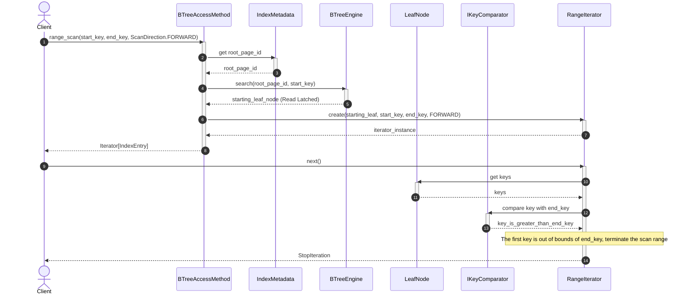
```mermaid
sequenceDiagram
    autonumber
    actor Client
    participant AM as BTreeAccessMethod
    participant MD as IndexMetadata
    participant BE as BTreeEngine
    participant Leaf as LeafNode
    participant Comp as IKeyComparator
    participant Iter as RangeIterator

    Client->>AM: range_scan(start_key, end_key, ScanDirection.FORWARD)
    activate AM
    
    AM->>MD: get root_page_id
    activate MD
    MD-->>AM: root_page_id
    deactivate MD

    AM->>BE: search(root_page_id, start_key)
    activate BE
    BE-->>AM: starting_leaf_node (Read Latched)
    deactivate BE

    AM->>Iter: create(starting_leaf, start_key, end_key, FORWARD)
    activate Iter
    Iter-->>AM: iterator_instance
    deactivate Iter
    
    AM-->>Client: Iterator[IndexEntry]
    deactivate AM

    Client->>Iter: next()
    activate Iter
    
    Iter->>Leaf: get keys
    activate Leaf
    Leaf-->>Iter: keys
    deactivate Leaf
    
    Iter->>Comp: compare key with end_key
    activate Comp
    Comp-->>Iter: key_is_greater_than_end_key
    deactivate Comp
    
    note over Iter: The first key is out of bounds of end_key, terminate the scan range
    Iter-->>Client: StopIteration
    deactivate Iter
```

 

---

 

<!-- Source: sequence_diagrams/3_insert_operation.md -->
# Index Management Subsystem - Insert Flow (Insert Key & Node Split)

The flow to insert a new key into the B+ Tree requires locating the appropriate leaf page, verifying uniqueness (if it is a unique index), and handling recursive node splitting when the page overflows.

---

## 1. Scenario A: Leaf Node Has Free Space (No Split) - Happy Path

* **Description:** The target leaf node still has enough free space. The new key is inserted directly into the correct sorted position on the leaf page. No tree structure modification is needed.

### Sequence Diagram:
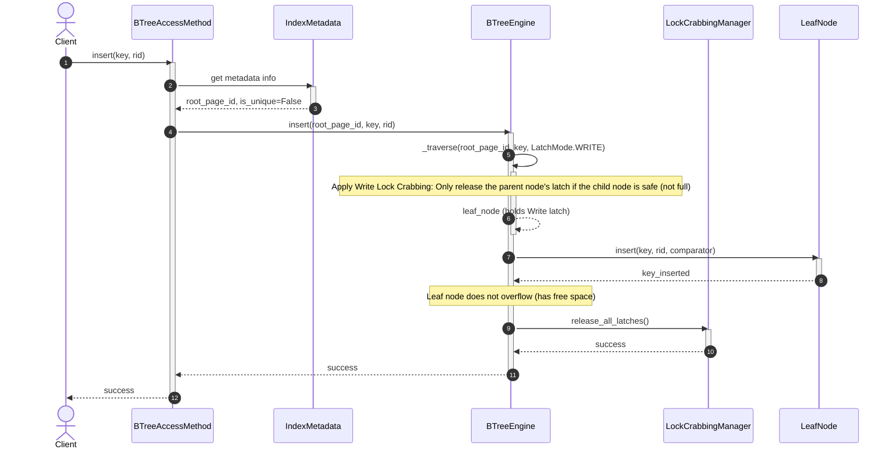
```mermaid
sequenceDiagram
    autonumber
    actor Client
    participant AM as BTreeAccessMethod
    participant MD as IndexMetadata
    participant BE as BTreeEngine
    participant LCM as LockCrabbingManager
    participant Leaf as LeafNode

    Client->>AM: insert(key, rid)
    activate AM
    
    AM->>MD: get metadata info
    activate MD
    MD-->>AM: root_page_id, is_unique=False
    deactivate MD

    AM->>BE: insert(root_page_id, key, rid)
    activate BE

    BE->>BE: _traverse(root_page_id, key, LatchMode.WRITE)
    activate BE
    note over BE: Apply Write Lock Crabbing: Only release the parent node's latch if the child node is safe (not full)
    BE-->>BE: leaf_node (holds Write latch)
    deactivate BE

    BE->>Leaf: insert(key, rid, comparator)
    activate Leaf
    Leaf-->>BE: key_inserted
    deactivate Leaf

    note over BE: Leaf node does not overflow (has free space)
    BE->>LCM: release_all_latches()
    activate LCM
    LCM-->>BE: success
    deactivate LCM
    
    BE-->>AM: success
    deactivate BE
    AM-->>Client: success
    deactivate AM
```

---

## 2. Scenario B: Leaf Node Splits, Parent Safe (Leaf Split, Parent Safe)

* **Description:** The target leaf page is full (`key_count > max_capacity`). The system splits the leaf page into two (creates a new sibling leaf page, moves 50% of the keys to the new node, updates sibling links). The median key (`median_key`) is pushed up and inserted into the parent node (`InternalNode`). The parent node still has free space, so it accepts the new key without needing a further split.

### Sequence Diagram:
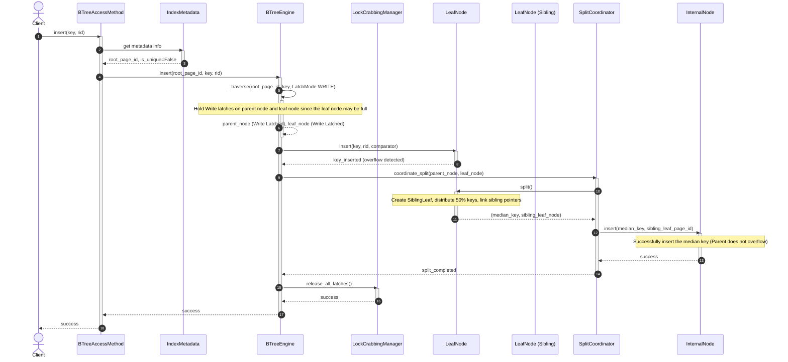
```mermaid
sequenceDiagram
    autonumber
    actor Client
    participant AM as BTreeAccessMethod
    participant MD as IndexMetadata
    participant BE as BTreeEngine
    participant LCM as LockCrabbingManager
    participant Leaf as LeafNode
    participant Sibling as LeafNode (Sibling)
    participant SC as SplitCoordinator
    participant Parent as InternalNode

    Client->>AM: insert(key, rid)
    activate AM
    
    AM->>MD: get metadata info
    activate MD
    MD-->>AM: root_page_id, is_unique=False
    deactivate MD

    AM->>BE: insert(root_page_id, key, rid)
    activate BE

    BE->>BE: _traverse(root_page_id, key, LatchMode.WRITE)
    activate BE
    note over BE: Hold Write latches on parent node and leaf node since the leaf node may be full
    BE-->>BE: parent_node (Write Latched), leaf_node (Write Latched)
    deactivate BE

    BE->>Leaf: insert(key, rid, comparator)
    activate Leaf
    Leaf-->>BE: key_inserted (overflow detected)
    deactivate Leaf

    BE->>SC: coordinate_split(parent_node, leaf_node)
    activate SC
    
    SC->>Leaf: split()
    activate Leaf
    note over Leaf: Create SiblingLeaf, distribute 50% keys, link sibling pointers
    Leaf-->>SC: (median_key, sibling_leaf_node)
    deactivate Leaf
    
    SC->>Parent: insert(median_key, sibling_leaf_page_id)
    activate Parent
    note over Parent: Successfully insert the median key (Parent does not overflow)
    Parent-->>SC: success
    deactivate Parent
    
    SC-->>BE: split_completed
    deactivate SC
    
    BE->>LCM: release_all_latches()
    activate LCM
    LCM-->>BE: success
    deactivate LCM
    
    BE-->>AM: success
    deactivate BE
    AM-->>Client: success
    deactivate AM
```

---

## 3. Scenario C: Recursive Split to Root

* **Description:** The leaf node becomes full and splits, pushing the median key up to the parent node. The parent node also becomes full and must split and push further up. This process repeats until it reaches the root node. The root node splits, a new root node is created, and the index tree height increases by 1.

### Sequence Diagram:
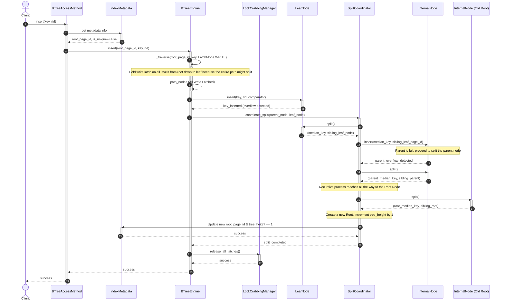
```mermaid
sequenceDiagram
    autonumber
    actor Client
    participant AM as BTreeAccessMethod
    participant MD as IndexMetadata
    participant BE as BTreeEngine
    participant LCM as LockCrabbingManager
    participant Leaf as LeafNode
    participant SC as SplitCoordinator
    participant Parent as InternalNode
    participant Root as InternalNode (Old Root)

    Client->>AM: insert(key, rid)
    activate AM
    
    AM->>MD: get metadata info
    activate MD
    MD-->>AM: root_page_id, is_unique=False
    deactivate MD

    AM->>BE: insert(root_page_id, key, rid)
    activate BE

    BE->>BE: _traverse(root_page_id, key, LatchMode.WRITE)
    activate BE
    note over BE: Hold write latch on all levels from root down to leaf because the entire path might split
    BE-->>BE: path_nodes (All Write Latched)
    deactivate BE

    BE->>Leaf: insert(key, rid, comparator)
    activate Leaf
    Leaf-->>BE: key_inserted (overflow detected)
    deactivate Leaf

    BE->>SC: coordinate_split(parent_node, leaf_node)
    activate SC
    
    SC->>Leaf: split()
    activate Leaf
    Leaf-->>SC: (median_key, sibling_leaf_node)
    deactivate Leaf
    
    SC->>Parent: insert(median_key, sibling_leaf_page_id)
    activate Parent
    note over Parent: Parent is full, proceed to split the parent node
    Parent-->>SC: parent_overflow_detected
    deactivate Parent

    SC->>Parent: split()
    activate Parent
    Parent-->>SC: (parent_median_key, sibling_parent)
    deactivate Parent

    note over SC: Recursive process reaches all the way to the Root Node
    SC->>Root: split()
    activate Root
    Root-->>SC: (root_median_key, sibling_root)
    deactivate Root

    note over SC: Create a new Root, increment tree_height by 1
    SC->>MD: Update new root_page_id & tree_height += 1
    activate MD
    MD-->>SC: success
    deactivate MD
    
    SC-->>BE: split_completed
    deactivate SC
    
    BE->>LCM: release_all_latches()
    activate LCM
    LCM-->>BE: success
    deactivate LCM
    
    BE-->>AM: success
    deactivate BE
    AM-->>Client: success
    deactivate AM
```

---

## 4. Scenario D: Duplicate Key on Unique Index

* **Description:** The index is configured as unique (`is_unique = True`). Before insertion, the system performs a search and detects that this key already exists in the index tree. The insertion process stops immediately and throws a duplicate key error.

### Sequence Diagram:
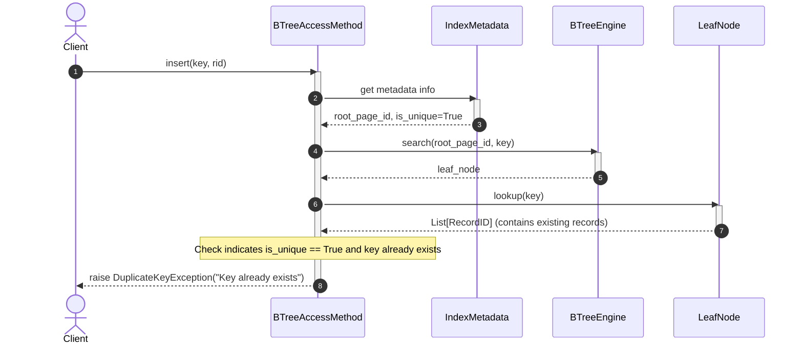
```mermaid
sequenceDiagram
    autonumber
    actor Client
    participant AM as BTreeAccessMethod
    participant MD as IndexMetadata
    participant BE as BTreeEngine
    participant Leaf as LeafNode

    Client->>AM: insert(key, rid)
    activate AM
    
    AM->>MD: get metadata info
    activate MD
    MD-->>AM: root_page_id, is_unique=True
    deactivate MD

    AM->>BE: search(root_page_id, key)
    activate BE
    BE-->>AM: leaf_node
    deactivate BE

    AM->>Leaf: lookup(key)
    activate Leaf
    Leaf-->>AM: List[RecordID] (contains existing records)
    deactivate Leaf

    note over AM: Check indicates is_unique == True and key already exists
    AM-->>Client: raise DuplicateKeyException("Key already exists")
    deactivate AM
```

 

---

 

<!-- Source: sequence_diagrams/4_delete_operation.md -->
# Index Management Subsystem - Delete Flow (Delete Key & Merge/Redistribute)

The flow to delete a key from the B+ Tree performs locating the leaf page containing the key, removing the key, and coordinating tree restructuring if the leaf page falls into an underflow state.

---

## 1. Scenario A: Leaf Safe After Delete (Leaf Safe) - Happy Path

* **Description:** The key is deleted from the leaf page. The number of remaining keys on the leaf page still satisfies the minimum capacity requirement (`key_count >= min_capacity`). The tree structure is preserved.

### Sequence Diagram:
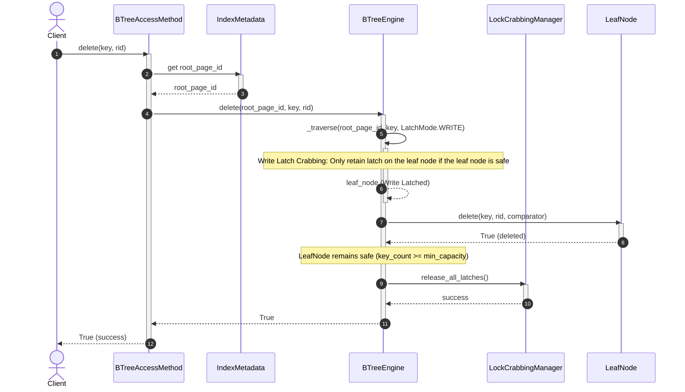
```mermaid
sequenceDiagram
    autonumber
    actor Client
    participant AM as BTreeAccessMethod
    participant MD as IndexMetadata
    participant BE as BTreeEngine
    participant LCM as LockCrabbingManager
    participant Leaf as LeafNode

    Client->>AM: delete(key, rid)
    activate AM
    
    AM->>MD: get root_page_id
    activate MD
    MD-->>AM: root_page_id
    deactivate MD

    AM->>BE: delete(root_page_id, key, rid)
    activate BE

    BE->>BE: _traverse(root_page_id, key, LatchMode.WRITE)
    activate BE
    note over BE: Write Latch Crabbing: Only retain latch on the leaf node if the leaf node is safe
    BE-->>BE: leaf_node (Write Latched)
    deactivate BE

    BE->>Leaf: delete(key, rid, comparator)
    activate Leaf
    Leaf-->>BE: True (deleted)
    deactivate Leaf

    note over BE: LeafNode remains safe (key_count >= min_capacity)
    BE->>LCM: release_all_latches()
    activate LCM
    LCM-->>BE: success
    deactivate LCM
    
    BE-->>AM: True
    deactivate BE
    AM-->>Client: True (success)
    deactivate AM
```

---

## 2. Scenario B: Key Underflow & Borrowing from Sibling (Redistribution)

* **Description:** After deletion, the leaf page suffers from underflow (`key_count < min_capacity`). The adjacent sibling (sibling page under the same parent) has surplus keys. The system borrows 1 key from the sibling page and moves it to the underflowing leaf page, and simultaneously updates the separating key in the parent node.

### Sequence Diagram:
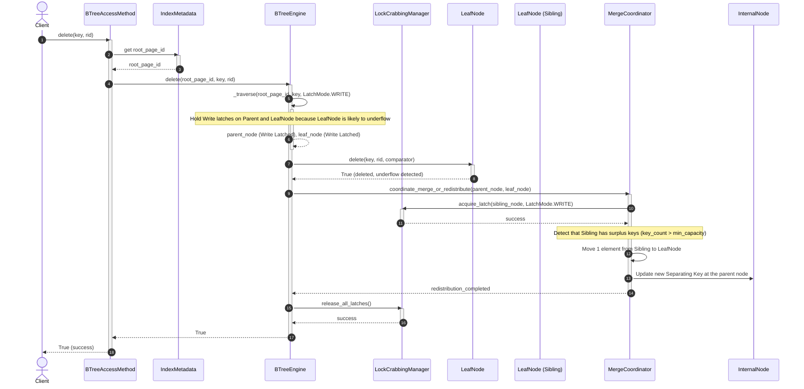
```mermaid
sequenceDiagram
    autonumber
    actor Client
    participant AM as BTreeAccessMethod
    participant MD as IndexMetadata
    participant BE as BTreeEngine
    participant LCM as LockCrabbingManager
    participant Leaf as LeafNode
    participant Sibling as LeafNode (Sibling)
    participant MC as MergeCoordinator
    participant Parent as InternalNode

    Client->>AM: delete(key, rid)
    activate AM
    
    AM->>MD: get root_page_id
    activate MD
    MD-->>AM: root_page_id
    deactivate MD

    AM->>BE: delete(root_page_id, key, rid)
    activate BE

    BE->>BE: _traverse(root_page_id, key, LatchMode.WRITE)
    activate BE
    note over BE: Hold Write latches on Parent and LeafNode because LeafNode is likely to underflow
    BE-->>BE: parent_node (Write Latched), leaf_node (Write Latched)
    deactivate BE

    BE->>Leaf: delete(key, rid, comparator)
    activate Leaf
    Leaf-->>BE: True (deleted, underflow detected)
    deactivate Leaf

    BE->>MC: coordinate_merge_or_redistribute(parent_node, leaf_node)
    activate MC
    
    MC->>LCM: acquire_latch(sibling_node, LatchMode.WRITE)
    activate LCM
    LCM-->>MC: success
    deactivate LCM

    note over MC: Detect that Sibling has surplus keys (key_count > min_capacity)
    MC->>MC: Move 1 element from Sibling to LeafNode
    MC->>Parent: Update new Separating Key at the parent node
    
    MC-->>BE: redistribution_completed
    deactivate MC
    
    BE->>LCM: release_all_latches()
    activate LCM
    LCM-->>BE: success
    deactivate LCM
    
    BE-->>AM: True
    deactivate BE
    AM-->>Client: True (success)
    deactivate AM
```

---

## 3. Scenario C: Key Underflow & Node Merging (Merge)

* **Description:** The leaf page suffers from underflow, but the adjacent sibling page also only has the minimum number of keys (cannot lend). The system performs a merge of all keys from the leaf page and the sibling page into a single page. The separating key in the parent node is deleted.

### Sequence Diagram:
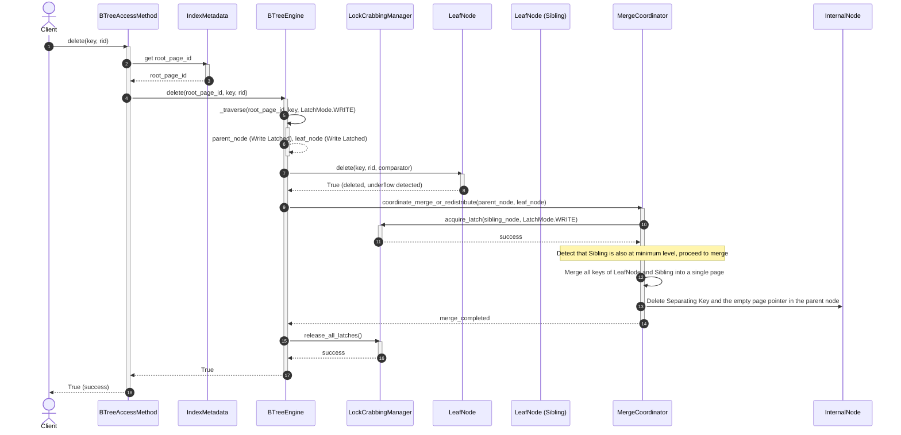
```mermaid
sequenceDiagram
    autonumber
    actor Client
    participant AM as BTreeAccessMethod
    participant MD as IndexMetadata
    participant BE as BTreeEngine
    participant LCM as LockCrabbingManager
    participant Leaf as LeafNode
    participant Sibling as LeafNode (Sibling)
    participant MC as MergeCoordinator
    participant Parent as InternalNode

    Client->>AM: delete(key, rid)
    activate AM
    
    AM->>MD: get root_page_id
    activate MD
    MD-->>AM: root_page_id
    deactivate MD

    AM->>BE: delete(root_page_id, key, rid)
    activate BE

    BE->>BE: _traverse(root_page_id, key, LatchMode.WRITE)
    activate BE
    BE-->>BE: parent_node (Write Latched), leaf_node (Write Latched)
    deactivate BE

    BE->>Leaf: delete(key, rid, comparator)
    activate Leaf
    Leaf-->>BE: True (deleted, underflow detected)
    deactivate Leaf

    BE->>MC: coordinate_merge_or_redistribute(parent_node, leaf_node)
    activate MC
    
    MC->>LCM: acquire_latch(sibling_node, LatchMode.WRITE)
    activate LCM
    LCM-->>MC: success
    deactivate LCM

    note over MC: Detect that Sibling is also at minimum level, proceed to merge
    MC->>MC: Merge all keys of LeafNode and Sibling into a single page
    MC->>Parent: Delete Separating Key and the empty page pointer in the parent node
    
    MC-->>BE: merge_completed
    deactivate MC
    
    BE->>LCM: release_all_latches()
    activate LCM
    LCM-->>BE: success
    deactivate LCM
    
    BE-->>AM: True
    deactivate BE
    AM-->>Client: True (success)
    deactivate AM
```

---

## 4. Scenario D: Recursive Merge to Root & Root Delete (Recursive Merge)

* **Description:** After merging the leaf node and deleting the key in the parent node, the parent node also suffers from underflow and must continue merging recursively up to the root. The old root node is left with only 1 child pointer, gets deleted, and promotes its child page to become the new root, decreasing the index tree height by 1.

### Sequence Diagram:
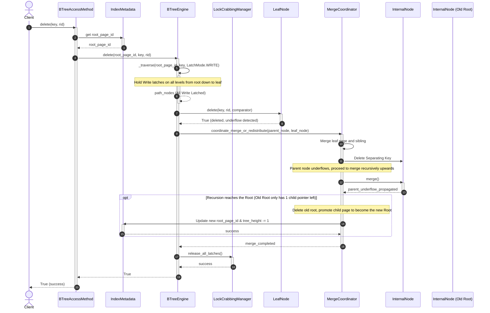
```mermaid
sequenceDiagram
    autonumber
    actor Client
    participant AM as BTreeAccessMethod
    participant MD as IndexMetadata
    participant BE as BTreeEngine
    participant LCM as LockCrabbingManager
    participant Leaf as LeafNode
    participant MC as MergeCoordinator
    participant Parent as InternalNode
    participant Root as InternalNode (Old Root)

    Client->>AM: delete(key, rid)
    activate AM
    
    AM->>MD: get root_page_id
    activate MD
    MD-->>AM: root_page_id
    deactivate MD

    AM->>BE: delete(root_page_id, key, rid)
    activate BE

    BE->>BE: _traverse(root_page_id, key, LatchMode.WRITE)
    activate BE
    note over BE: Hold Write latches on all levels from root down to leaf
    BE-->>BE: path_nodes (All Write Latched)
    deactivate BE

    BE->>Leaf: delete(key, rid, comparator)
    activate Leaf
    Leaf-->>BE: True (deleted, underflow detected)
    deactivate Leaf

    BE->>MC: coordinate_merge_or_redistribute(parent_node, leaf_node)
    activate MC
    
    MC->>MC: Merge leaf page and sibling
    MC->>Parent: Delete Separating Key
    
    note over MC: Parent node underflows, proceed to merge recursively upwards
    MC->>Parent: merge()
    activate Parent
    Parent-->>MC: parent_underflow_propagated
    deactivate Parent

    opt Recursion reaches the Root (Old Root only has 1 child pointer left)
        note over MC: Delete old root, promote child page to become the new Root
        MC->>MD: Update new root_page_id & tree_height -= 1
        activate MD
        MD-->>MC: success
        deactivate MD
    end

    MC-->>BE: merge_completed
    deactivate MC
    
    BE->>LCM: release_all_latches()
    activate LCM
    LCM-->>BE: success
    deactivate LCM
    
    BE-->>AM: True
    deactivate BE
    AM-->>Client: True (success)
    deactivate AM
```

---

## 5. Scenario E: Key to Delete Not Found

* **Description:** The system traverses the tree to the leaf node but detects that the key to be deleted does not exist in the index. The process stops and returns `False`.

### Sequence Diagram:
```mermaid
sequenceDiagram
    autonumber
    actor Client
    participant AM as BTreeAccessMethod
    participant MD as IndexMetadata
    participant BE as BTreeEngine
    participant LCM as LockCrabbingManager
    participant Leaf as LeafNode

    Client->>AM: delete(key, rid)
    activate AM
    
    AM->>MD: get root_page_id
    activate MD
    MD-->>AM: root_page_id
    deactivate MD

    AM->>BE: delete(root_page_id, key, rid)
    activate BE

    BE->>BE: _traverse(root_page_id, key, LatchMode.WRITE)
    activate BE
    BE-->>BE: leaf_node (Write Latched)
    deactivate BE

    BE->>Leaf: delete(key, rid, comparator)
    activate Leaf
    Leaf-->>BE: False (key_not_found)
    deactivate Leaf

    BE->>LCM: release_all_latches()
    activate LCM
    LCM-->>BE: success
    deactivate LCM
    
    BE-->>AM: False
    deactivate BE
    AM-->>Client: False (failure)
    deactivate AM
```

 

---

 

<!-- Source: sequence_diagrams/5_optimistic_read.md -->
# Index Management Subsystem - Optimistic Read Strategy Flow

The Optimistic Read strategy helps accelerate multi-threaded queries on the index by eliminating the need to continuously acquire Read Latches on the upper nodes of the B+ Tree.

---

## 1. Scenario A: Optimistic Success

* **Description:** A Reader traverses a node without any Writer modifying that node simultaneously. The Reader reads the version number before and after reading the node's data; if they match, the data is considered consistent. No latch needs to be acquired on that node.

### Sequence Diagram:
```mermaid
sequenceDiagram
    autonumber
    actor Client
    participant BE as BTreeEngine
    participant Node as BTreeNode

    Client->>BE: search_optimistic(root_page_id, key)
    activate BE

    BE->>Node: Read the first version number (initial_version) from NodeHeader
    activate Node
    Node-->>BE: initial_version
    deactivate Node

    BE->>Node: Read keys data and child_page_id
    activate Node
    Node-->>BE: keys, child_page_id
    deactivate Node

    BE->>Node: Read the second version number (final_version)
    activate Node
    Node-->>BE: final_version
    deactivate Node

    note over BE: Validation: initial_version == final_version (Success)
    BE-->>Client: child_page_id (Safe read without latch)
    deactivate BE
```

---

## 2. Scenario B: Optimistic Failure & Fallback to Pessimistic Latch

* **Description:** While the Reader is reading the node's keys, a Writer thread concurrently performs an insert/delete operation on this node and alters the node's version number. Upon the second check, the Reader detects the version mismatch and considers the read data inconsistent. The system will automatically fall back to the standard Read Latch mode on that node to safely re-read the data.

### Sequence Diagram:
```mermaid
sequenceDiagram
    autonumber
    actor Client
    participant BE as BTreeEngine
    participant Node as BTreeNode
    participant LCM as LockCrabbingManager

    Client->>BE: search_optimistic(root_page_id, key)
    activate BE

    BE->>Node: Read the first version number (initial_version) from NodeHeader
    activate Node
    Node-->>BE: initial_version
    deactivate Node

    BE->>Node: Read keys data and child_page_id
    activate Node
    Node-->>BE: keys, child_page_id
    deactivate Node

    BE->>Node: Read the second version number (final_version)
    activate Node
    Node-->>BE: final_version (Version Mismatch Detected!)
    deactivate Node

    note over BE: Validation failed: initial_version != final_version. Fallback to Pessimistic Latch
    
    BE->>LCM: acquire_latch(node, LatchMode.READ)
    activate LCM
    LCM-->>BE: success
    deactivate LCM
    
    BE->>Node: Re-read keys data and child_page_id (safe under read latch)
    activate Node
    Node-->>BE: keys, child_page_id
    deactivate Node
    
    BE->>LCM: release_latch(node)
    activate LCM
    LCM-->>BE: success
    deactivate LCM
    
    BE-->>Client: child_page_id
    deactivate BE
```

 

---

 

<!-- Source: sequence_diagrams/6_bulk_loading.md -->
# Index Management Subsystem - Bulk Loading Flow

Bulk Loading is an extremely high-performance optimization method used to build a new B+ Tree index from a large existing dataset using a bottom-up build algorithm.

---

## 1. Scenario A: Bulk Load Success

* **Description:** The input dataset contains multiple valid records. The process first sorts the entire data by key, then sequentially allocates the records into leaf pages from left to right. When a page fills up, the separating key is pushed directly to the immediate parent nodes (InternalNode) without recursively traversing from the root node.

### Sequence Diagram:
```mermaid
sequenceDiagram
    autonumber
    actor Client
    participant LM as BTreeLifecycleManager
    participant BE as BTreeEngine
    participant MD as IndexMetadata
    participant Leaf as LeafNode
    participant Parent as InternalNode

    Client->>LM: bulk_load(index_id, sorted_entries)
    activate LM

    note over LM: Perform ascending sort on raw data by key using KeyComparator
    LM->>LM: sort(raw_entries)
    
    LM->>BE: bulk_load_build(sorted_entries)
    activate BE

    loop For each Entry in the sorted list
        alt Current leaf page is not full
            BE->>Leaf: Write entry directly to the current LeafNode
        else Current leaf page is full
            BE->>Leaf: Set next_page_id pointing to the new page
            BE->>BE: Initialize a new leaf page (NewLeafNode)
            BE->>Leaf: Write entry to the new leaf page
            BE->>Parent: Push the separating key and leaf page address to the parent node (Level 1 InternalNode)
            
            opt Parent node (InternalNode) is also full
                BE->>Parent: Create a new parent node and push the key to a higher-level InternalNode
            end
        end
    end

    BE-->>LM: new_root_page_id
    deactivate BE

    LM->>MD: Update new root_page_id, state=VALID, tree_height, node_count, key_count
    activate MD
    MD-->>LM: success
    deactivate MD

    LM-->>Client: success (Index build completed)
    deactivate LM
```

---

## 2. Scenario B: Empty Dataset

* **Description:** The input dataset contains no elements. The process creates a standard empty index tree: consisting of only a single empty leaf page acting as the root node. The index state is set to `VALID`.

### Sequence Diagram:
```mermaid
sequenceDiagram
    autonumber
    actor Client
    participant LM as BTreeLifecycleManager
    participant BE as BTreeEngine
    participant MD as IndexMetadata

    Client->>LM: bulk_load(index_id, empty_entries)
    activate LM

    LM->>BE: allocate_empty_tree()
    activate BE
    BE-->>LM: empty_root_page_id
    deactivate BE
    
    LM->>MD: Update root_page_id, state=VALID, height=1
    activate MD
    MD-->>LM: success
    deactivate MD
    
    LM-->>Client: success (Empty Index Initialized)
    deactivate LM
```

 

---

 

