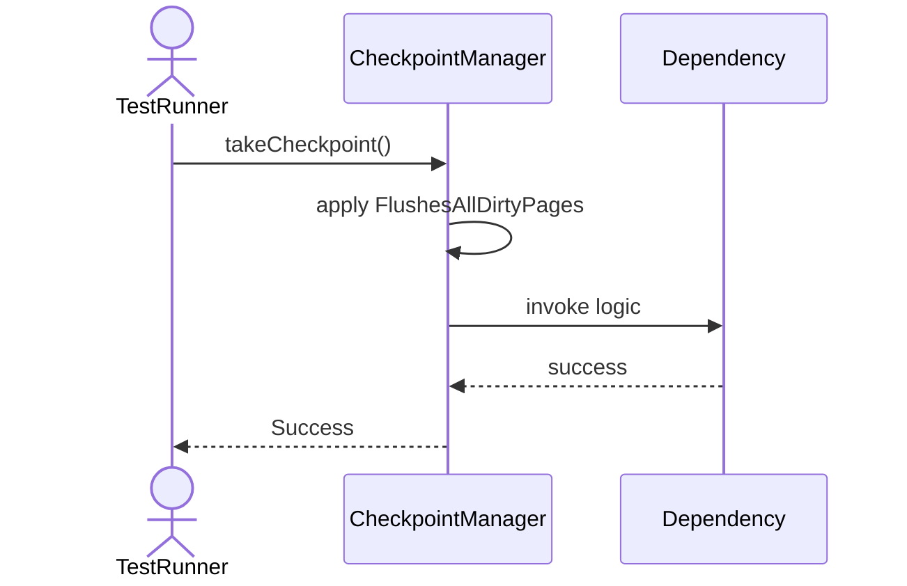
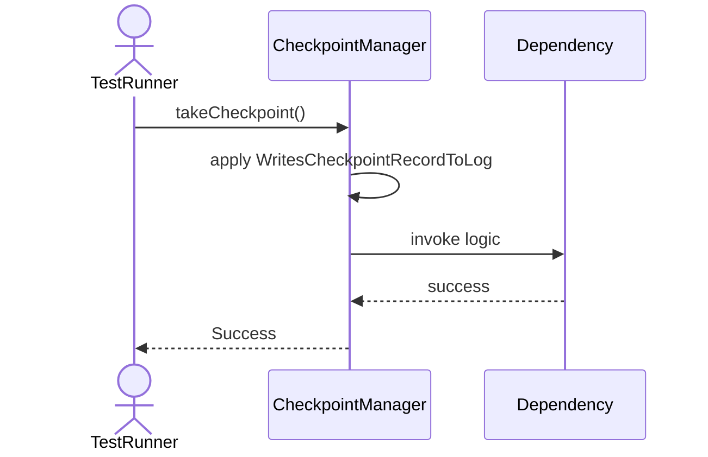
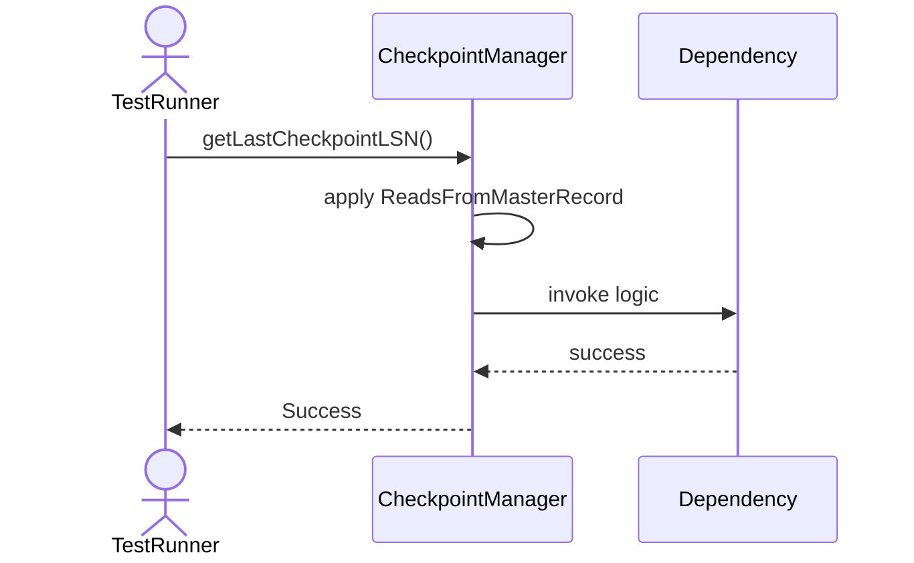

# Sequence Diagrams: CheckpointManager

## 🆕 Added Properties & Methods for `CheckpointManager`
To support the detailed sequence logic for unit testing, please update the `CheckpointManager` class in your Class Diagram with the following properties and methods:

- **Property** added to `CheckpointManager`: `bufferPool`
- **Method** added to `CheckpointManager`: `autoCheckpoint()`
- **Method** added to `CheckpointManager`: `getLastCheckpointLSN()`
- **Method** added to `CheckpointManager`: `takeCheckpoint()`

---

This file contains the detailed sequence diagrams for all 5 unit tests of the **CheckpointManager** class.

## 1. TakeCheckpoint_FlushesAllDirtyPages

## 2. TakeCheckpoint_WritesCheckpointRecordToLog

## 3. AutoCheckpoint_TriggersWhenLogReachesSizeLimit

## 4. AutoCheckpoint_TriggersWhenTimeIntervalElapsed

## 5. GetLastCheckpointLSN_ReadsFromMasterRecord

