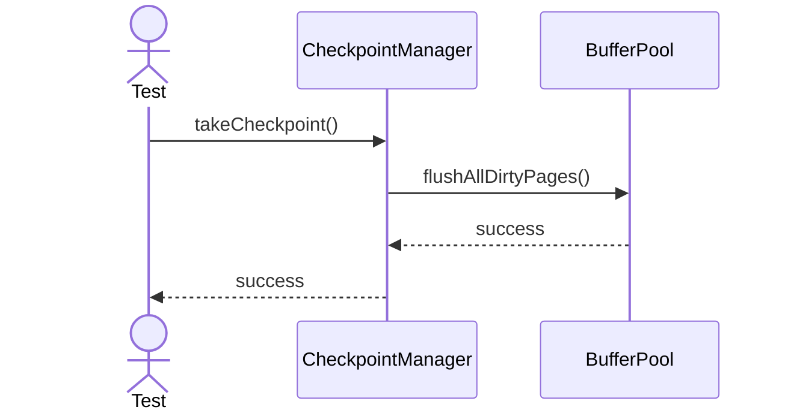
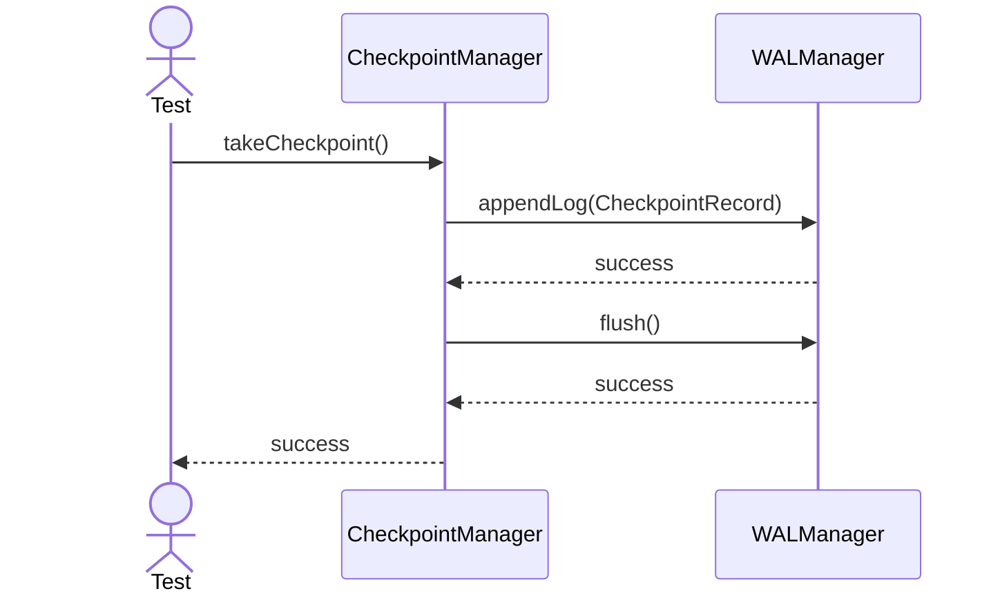

# Sequence Diagrams: CheckpointManager

## 🆕 Added Properties & Methods for `CheckpointManager`
To support the detailed sequence logic for unit testing, the following missing properties/methods have been introduced. **Please update the `CheckpointManager` class in your Class Diagram with these:**

- **Property** added to `CheckpointManager`: `bufferPool` (Reference to force flush dirty pages)

---

This file contains the detailed sequence diagrams for all unit tests of the **CheckpointManager** class in the Backup & Durability subsystem.

## 1. TakeCheckpoint_FlushesAllDirtyPages

## 2. TakeCheckpoint_WritesCheckpointRecordToLog

