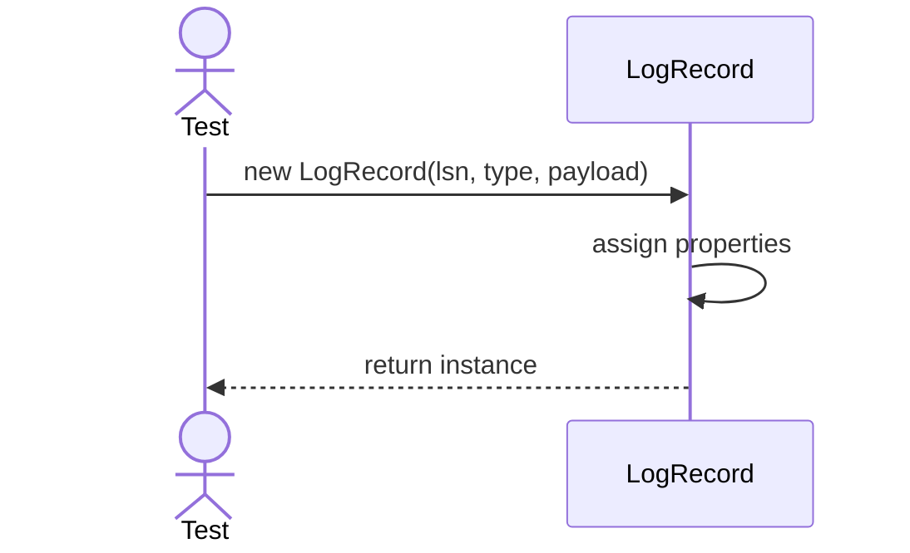
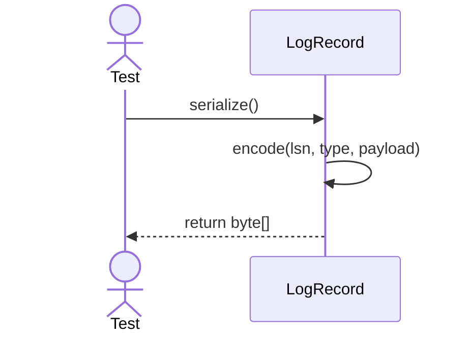

# Sequence Diagrams: LogRecord

## 🆕 Added Properties & Methods for `LogRecord`
To support the detailed sequence logic for unit testing, the following missing properties/methods have been introduced. **Please update the `LogRecord` class in your Class Diagram with these:**

- **Property** added to `LogRecord`: `lsn` (Log Sequence Number), `type`, `payload`

---

This file contains the detailed sequence diagrams for all unit tests of the **LogRecord** class in the Backup & Durability subsystem.

## 1. Init_SetsLsnTypeAndPayloadData

## 2. Serialize_ConvertsRecordToByteArray

