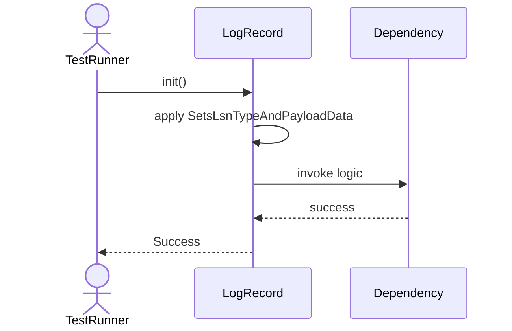
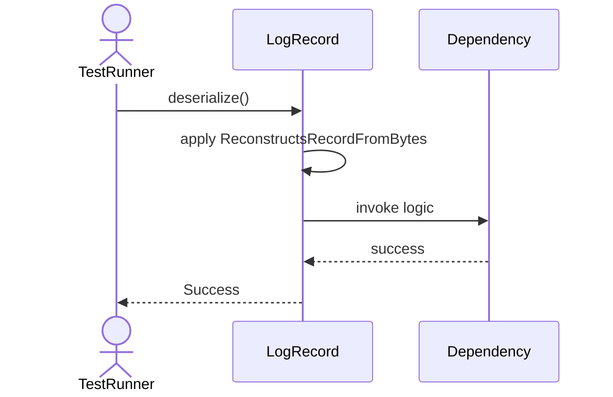
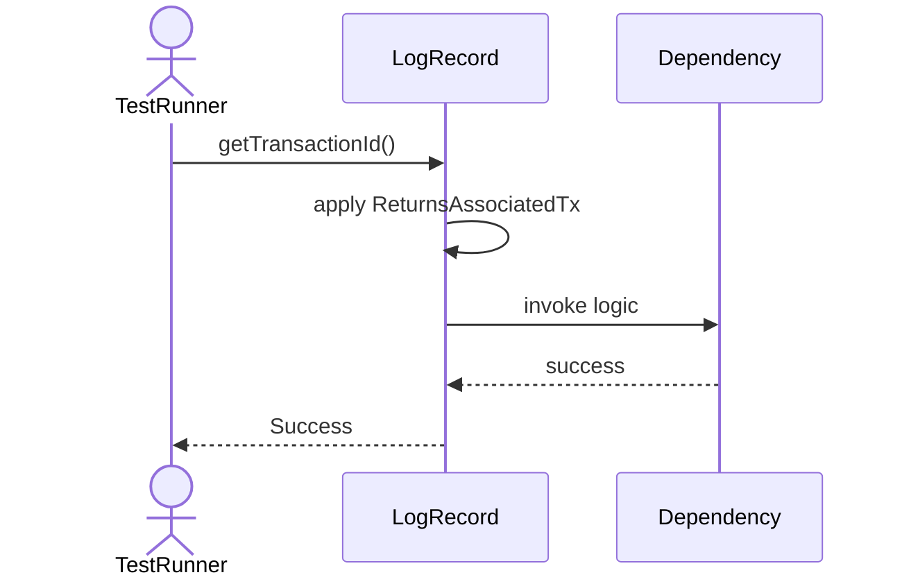

# Sequence Diagrams: LogRecord

## 🆕 Added Properties & Methods for `LogRecord`
To support the detailed sequence logic for unit testing, please update the `LogRecord` class in your Class Diagram with the following properties and methods:

- **Property** added to `LogRecord`: `lsn`
- **Property** added to `LogRecord`: `type`
- **Property** added to `LogRecord`: `payload`
- **Method** added to `LogRecord`: `deserialize()`
- **Method** added to `LogRecord`: `getTransactionId()`
- **Method** added to `LogRecord`: `getUndoInfo()`
- **Method** added to `LogRecord`: `serialize()`

---

This file contains the detailed sequence diagrams for all 5 unit tests of the **LogRecord** class.

## 1. Init_SetsLsnTypeAndPayloadData

## 2. Serialize_ConvertsRecordToByteArray

## 3. Deserialize_ReconstructsRecordFromBytes

## 4. GetTransactionId_ReturnsAssociatedTx

## 5. GetUndoInfo_ReturnsBeforeImageForRollback

