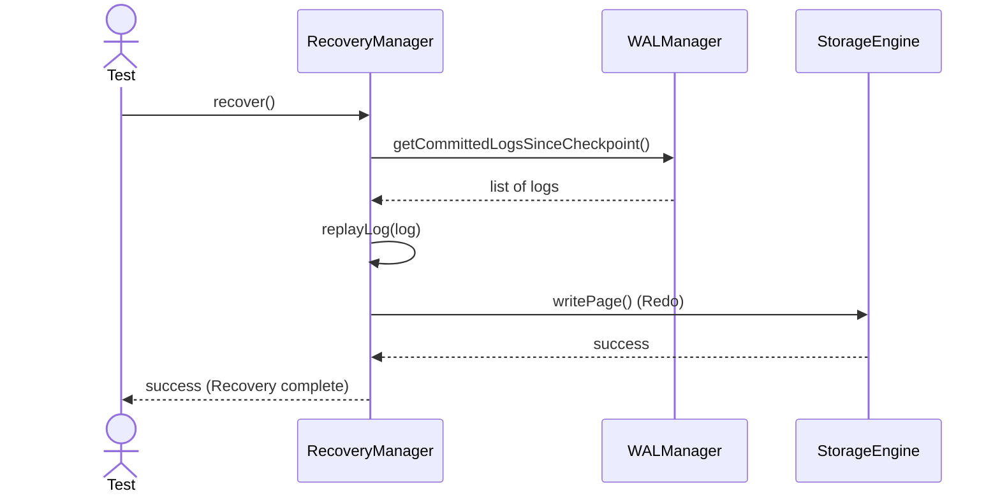
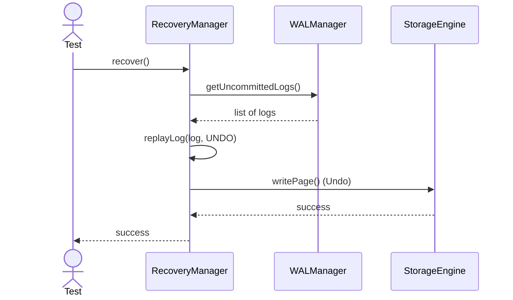

# Sequence Diagrams: RecoveryManager

## 🆕 Added Properties & Methods for `RecoveryManager`
To support the detailed sequence logic for unit testing, the following missing properties/methods have been introduced. **Please update the `RecoveryManager` class in your Class Diagram with these:**

- **Property** added to `RecoveryManager`: `walManager` (Reference to WAL for reading logs)
- **Method** added to `RecoveryManager`: `replayLog(record)` (Executes redo/undo logic)

---

This file contains the detailed sequence diagrams for all unit tests of the **RecoveryManager** class in the Backup & Durability subsystem.

## 1. Recover_WhenSystemCrashes_ReplaysWALToRestoreState

## 2. Recover_WhenUndoNeeded_RollsBackUncommittedTransactions

