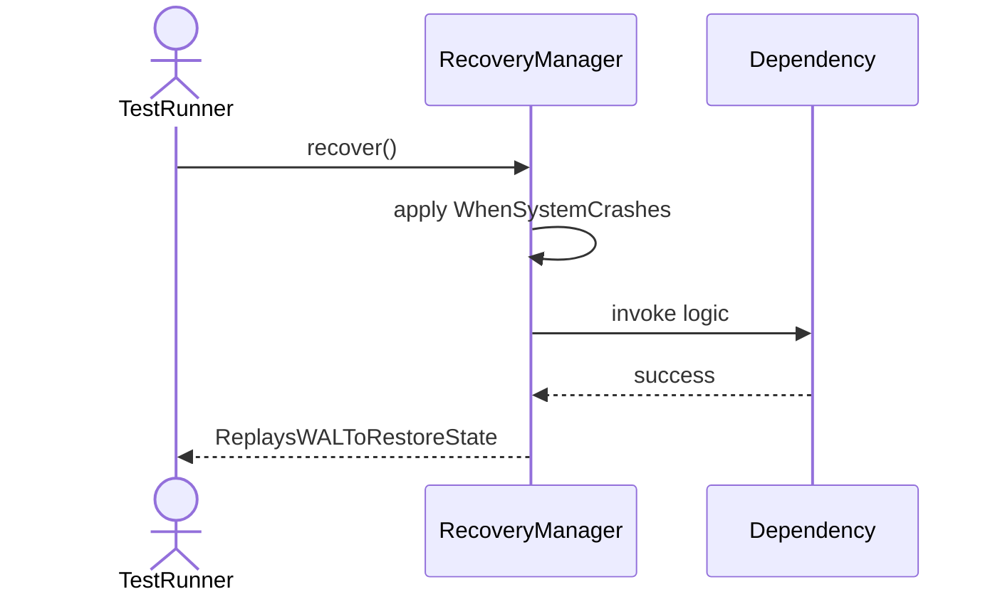
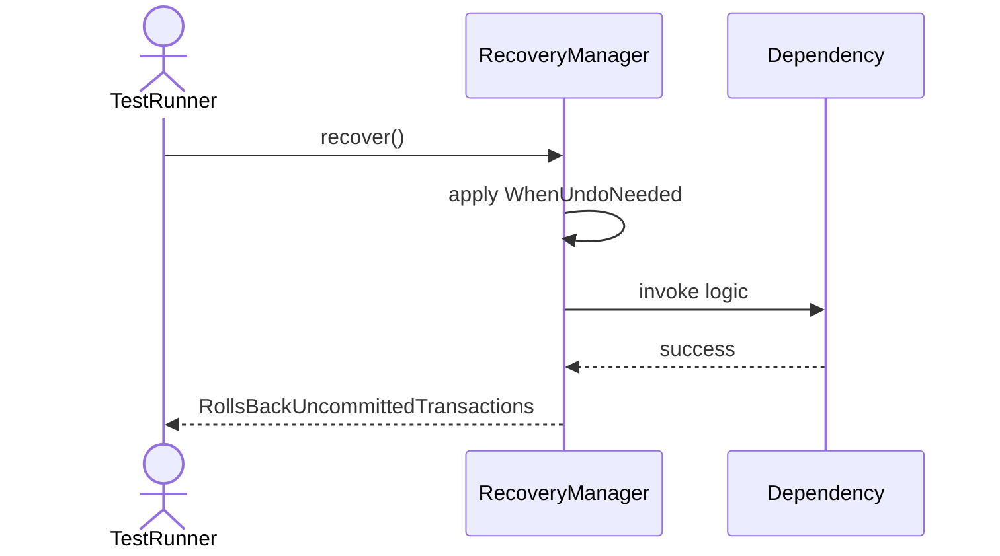
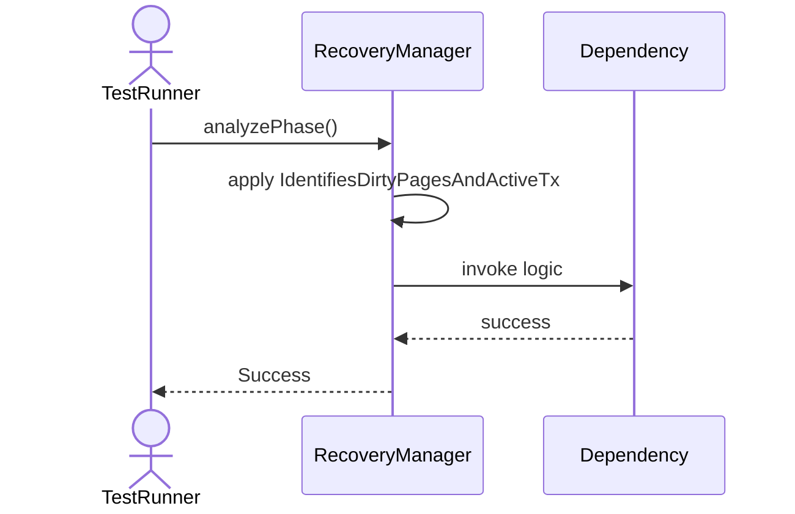
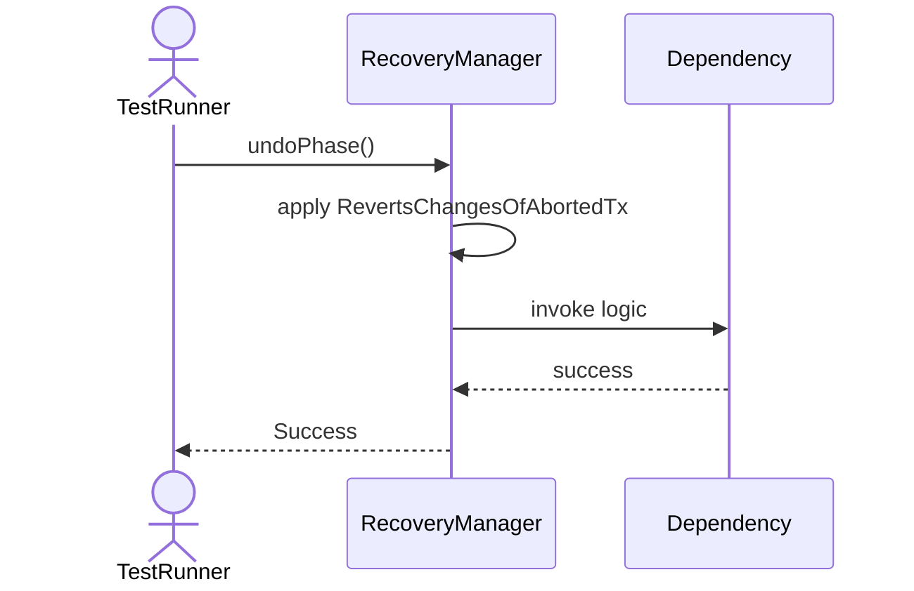
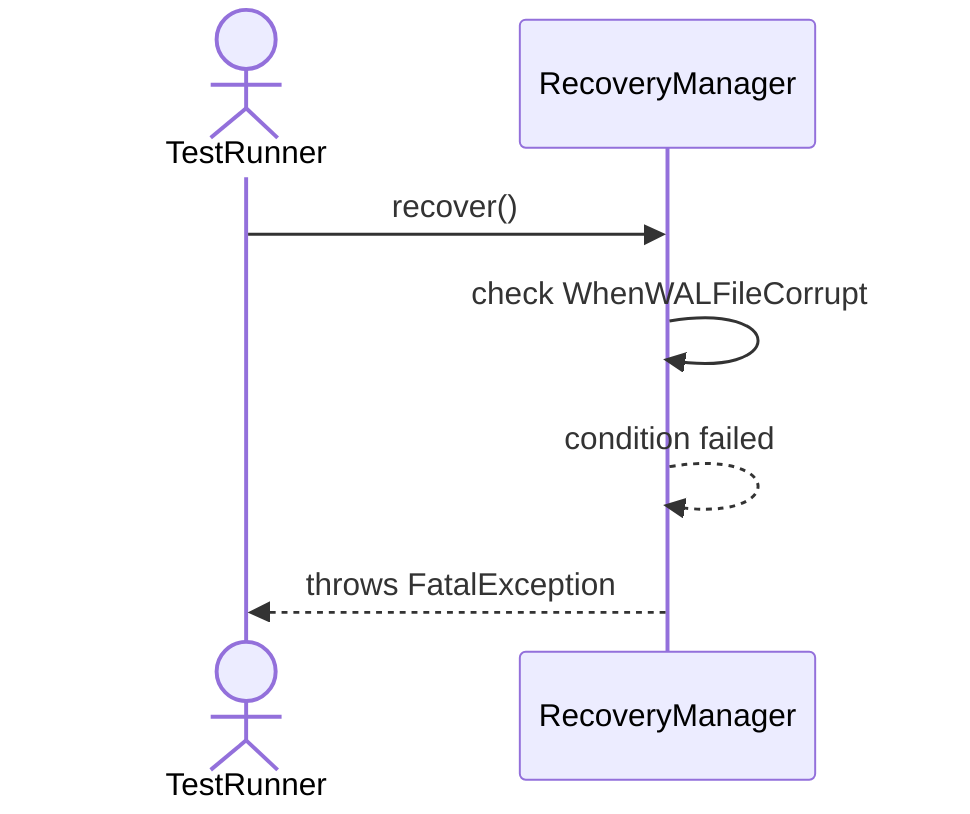

# Sequence Diagrams: RecoveryManager

## 🆕 Added Properties & Methods for `RecoveryManager`
To support the detailed sequence logic for unit testing, please update the `RecoveryManager` class in your Class Diagram with the following properties and methods:

- **Property** added to `RecoveryManager`: `walManager`
- **Method** added to `RecoveryManager`: `analyzePhase()`
- **Method** added to `RecoveryManager`: `recover()`
- **Method** added to `RecoveryManager`: `redoPhase()`
- **Method** added to `RecoveryManager`: `undoPhase()`

---

This file contains the detailed sequence diagrams for all 6 unit tests of the **RecoveryManager** class.

## 1. Recover_WhenSystemCrashes_ReplaysWALToRestoreState

## 2. Recover_WhenUndoNeeded_RollsBackUncommittedTransactions

## 3. AnalyzePhase_IdentifiesDirtyPagesAndActiveTx

## 4. RedoPhase_ReappliesChangesFromLog

## 5. UndoPhase_RevertsChangesOfAbortedTx

## 6. Recover_WhenWALFileCorrupt_ThrowsFatalException

