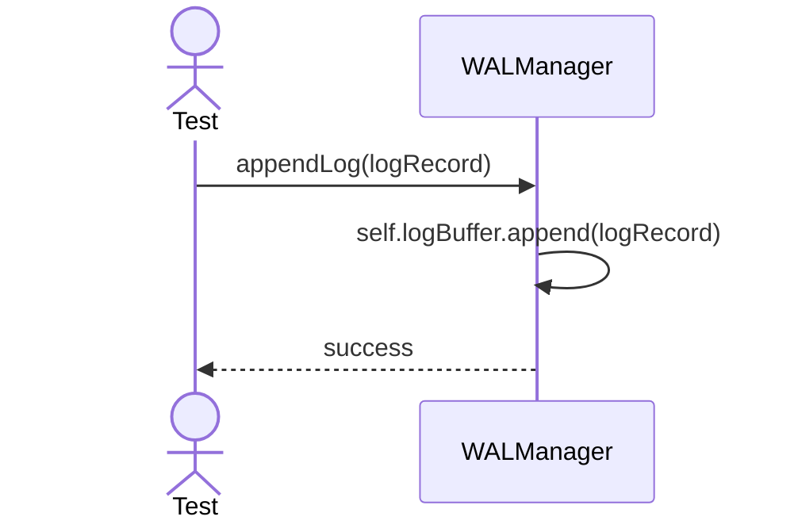
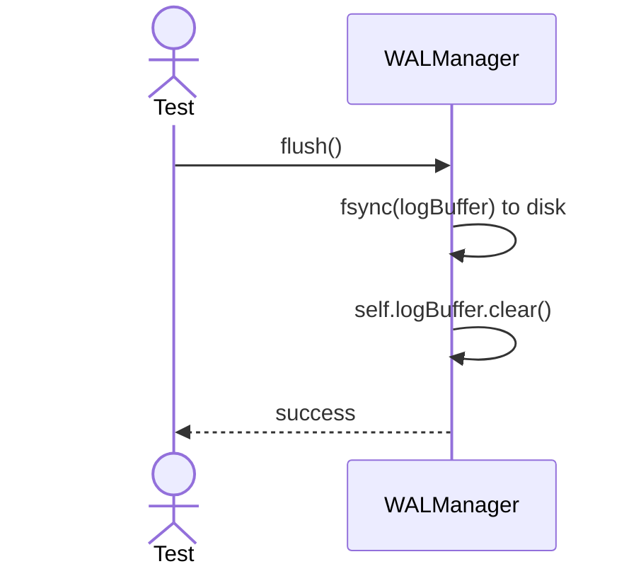
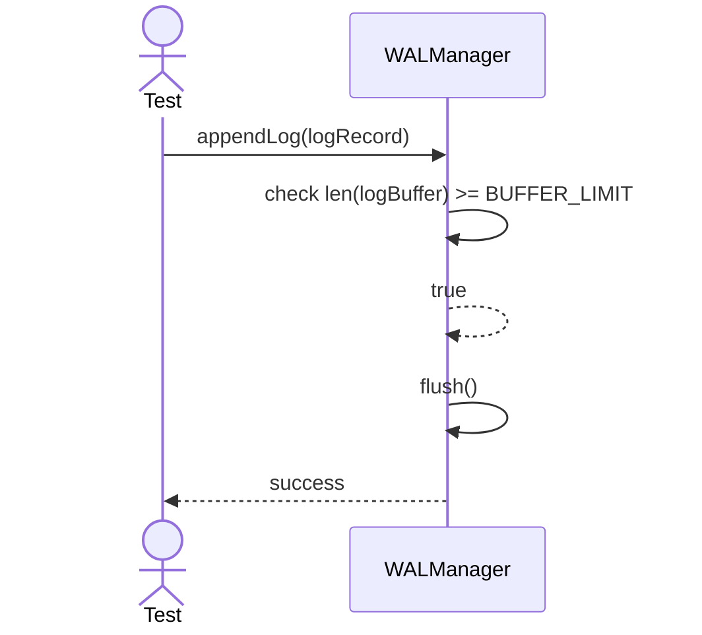

# Sequence Diagrams: WALManager

## 🆕 Added Properties & Methods for `WALManager`
To support the detailed sequence logic for unit testing, the following missing properties/methods have been introduced. **Please update the `WALManager` class in your Class Diagram with these:**

- **Property** added to `WALManager`: `logBuffer` (In-memory array of LogRecords)
- **Property** added to `WALManager`: `BUFFER_LIMIT` (Max size before auto-flush)

---

This file contains the detailed sequence diagrams for all unit tests of the **WALManager** class in the Backup & Durability subsystem.

## 1. AppendLog_AddsRecordToMemoryBuffer

## 2. Flush_WritesBufferToDiskSynchronously

## 3. AppendLog_WhenBufferFull_TriggersAutomaticFlush

