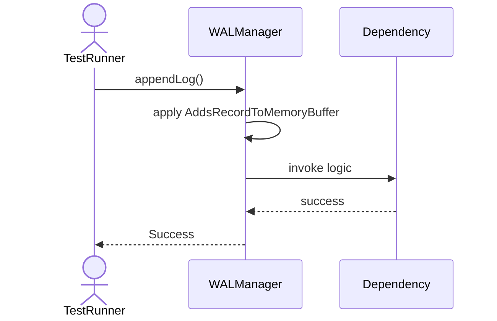
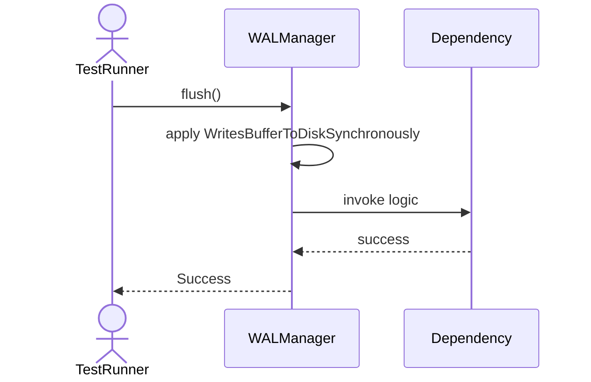
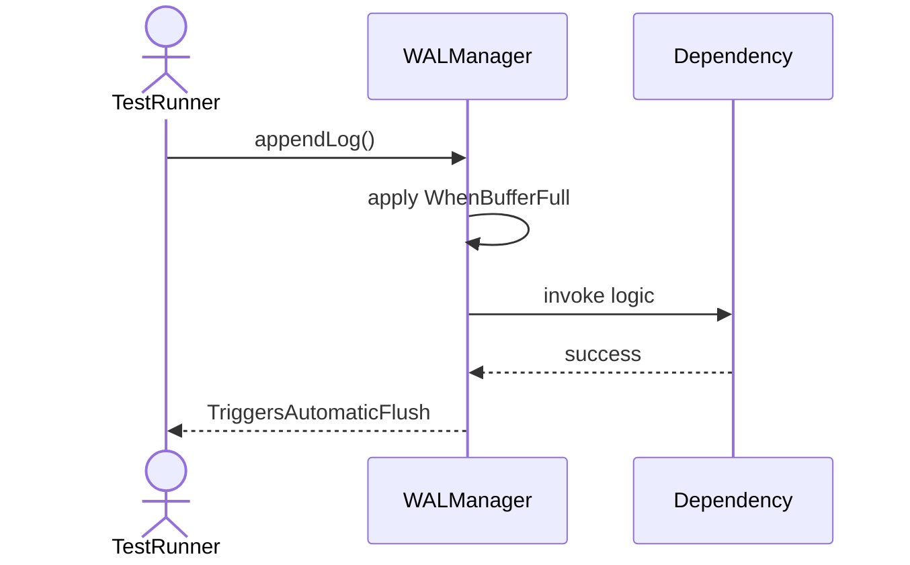
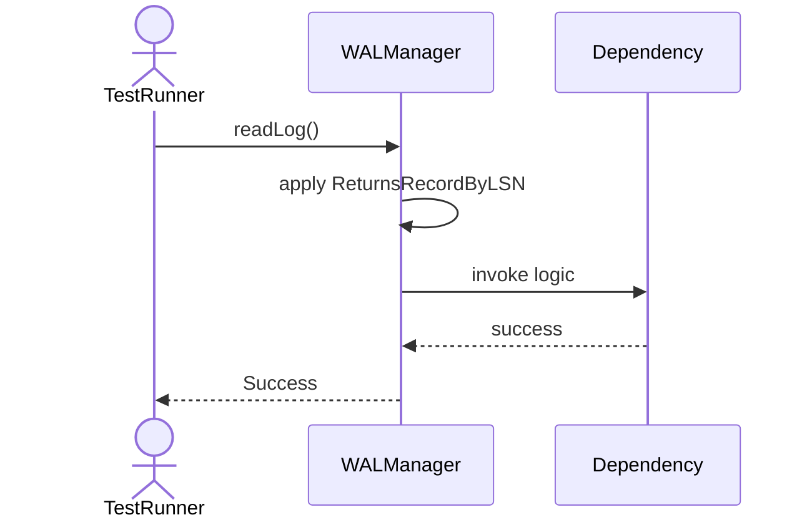
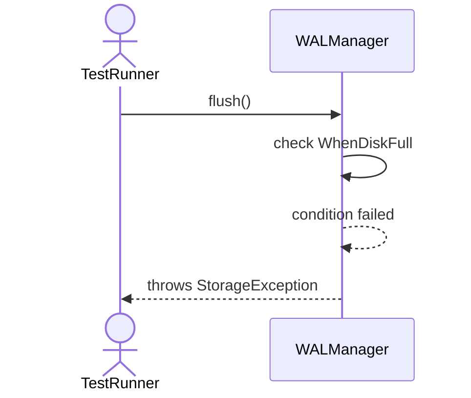
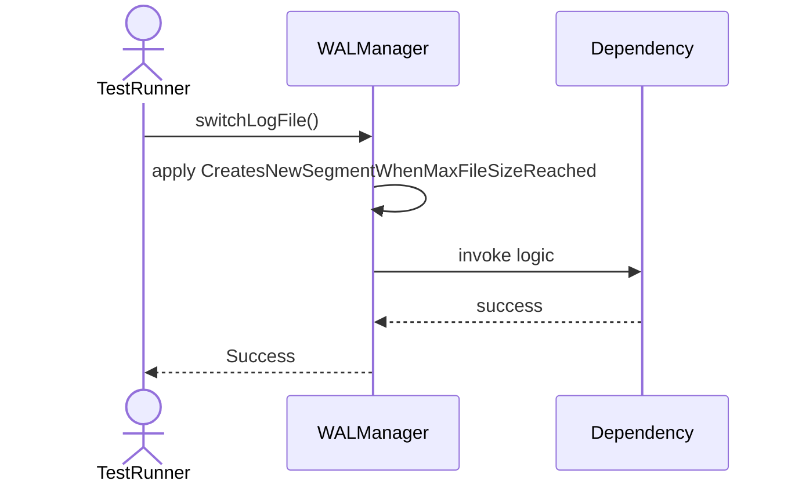

# Sequence Diagrams: WALManager

## 🆕 Added Properties & Methods for `WALManager`
To support the detailed sequence logic for unit testing, please update the `WALManager` class in your Class Diagram with the following properties and methods:

- **Property** added to `WALManager`: `logBuffer (List)`
- **Property** added to `WALManager`: `BUFFER_LIMIT (Int)`
- **Method** added to `WALManager`: `appendLog()`
- **Method** added to `WALManager`: `flush()`
- **Method** added to `WALManager`: `readLog()`
- **Method** added to `WALManager`: `switchLogFile()`
- **Method** added to `WALManager`: `truncateLog()`

---

This file contains the detailed sequence diagrams for all 7 unit tests of the **WALManager** class.

## 1. AppendLog_AddsRecordToMemoryBuffer

## 2. Flush_WritesBufferToDiskSynchronously

## 3. AppendLog_WhenBufferFull_TriggersAutomaticFlush

## 4. ReadLog_ReturnsRecordByLSN

## 5. TruncateLog_DeletesLogsOlderThanCheckpoint

## 6. Flush_WhenDiskFull_ThrowsStorageException

## 7. SwitchLogFile_CreatesNewSegmentWhenMaxFileSizeReached

