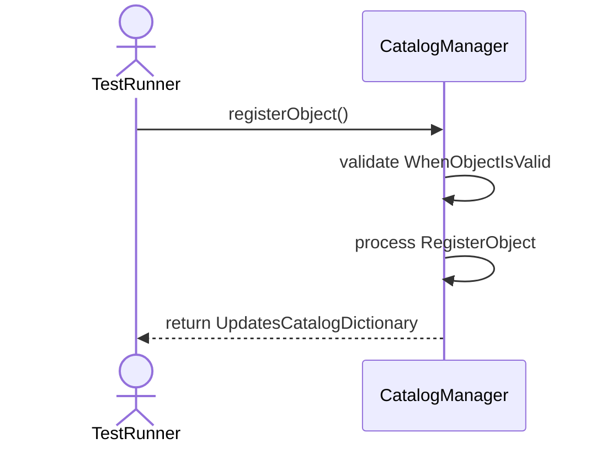
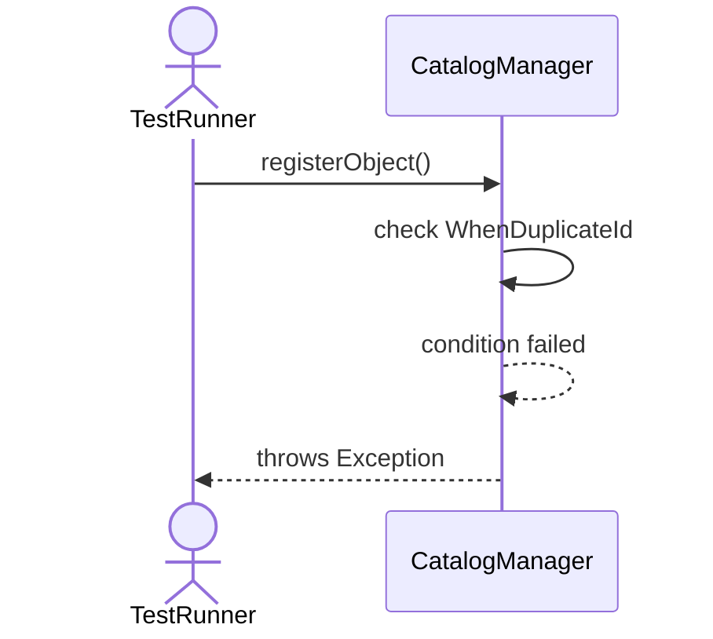
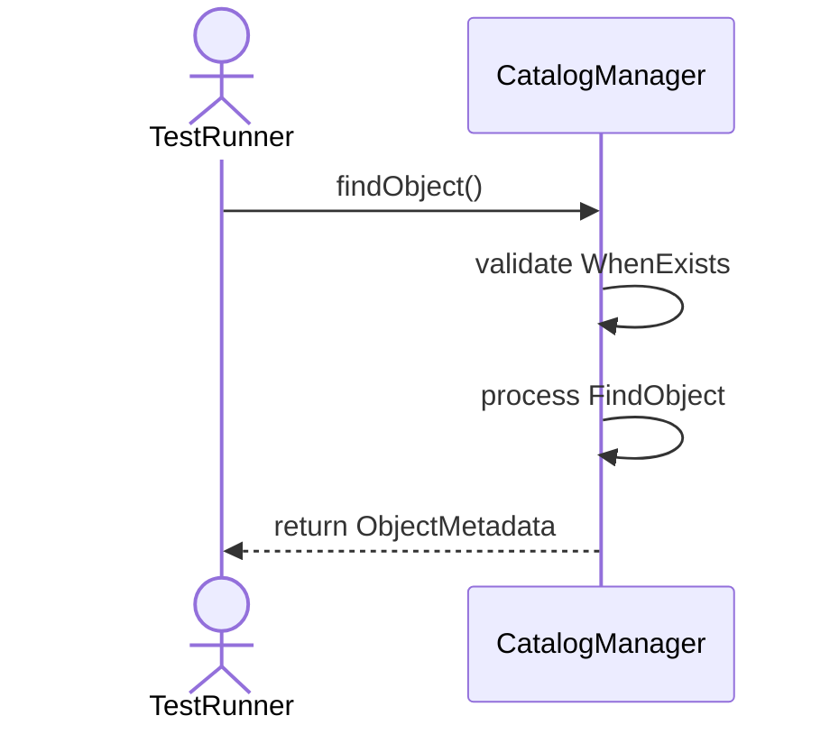
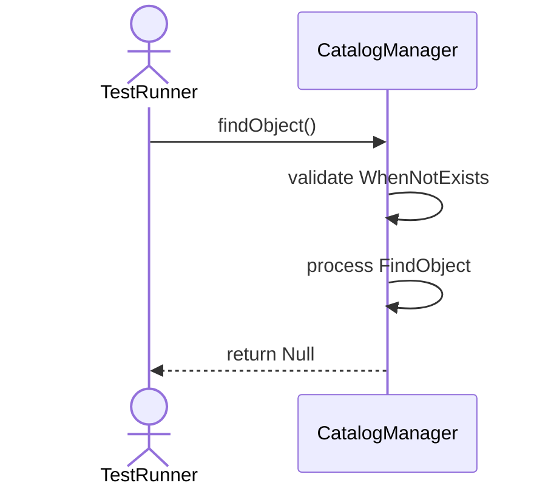
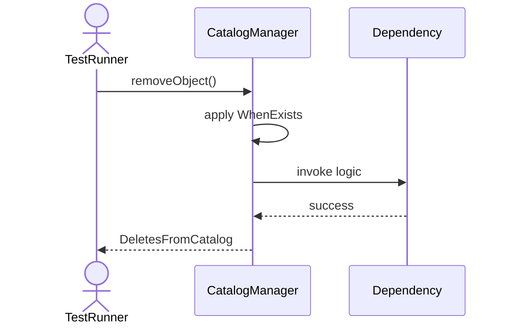
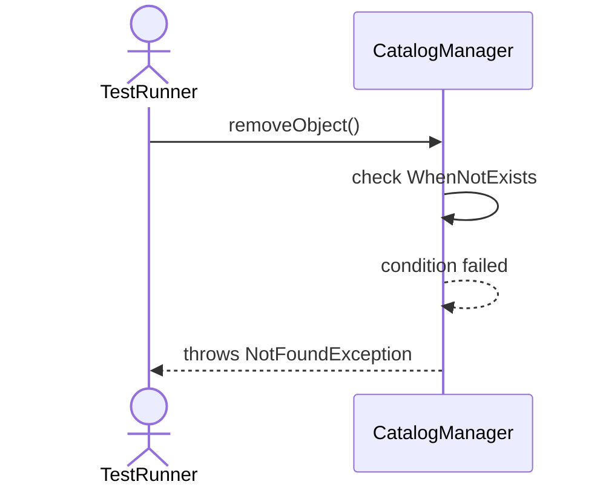
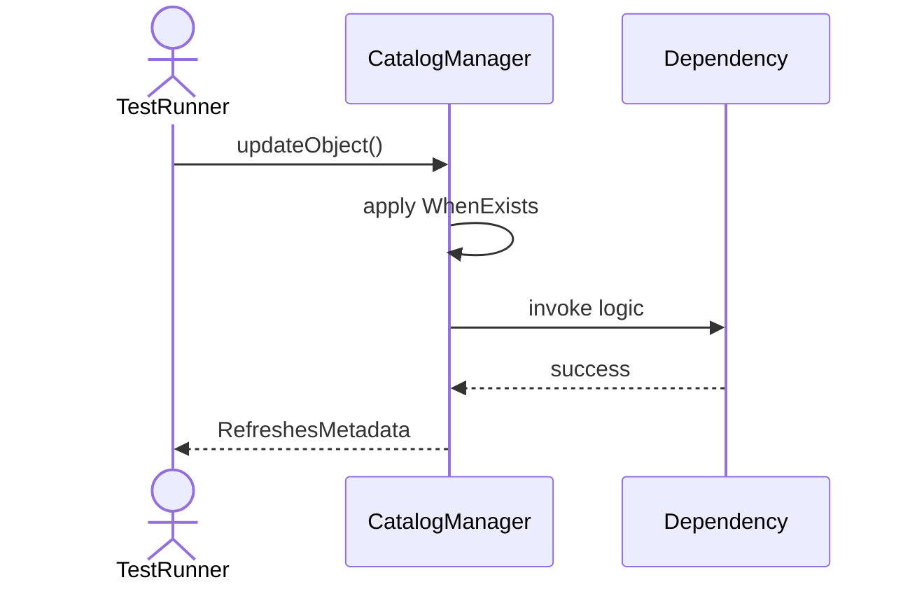
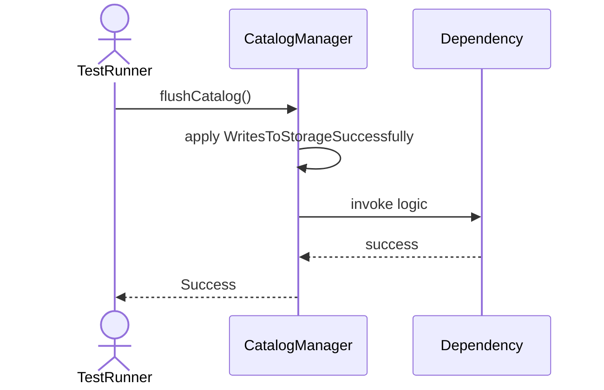
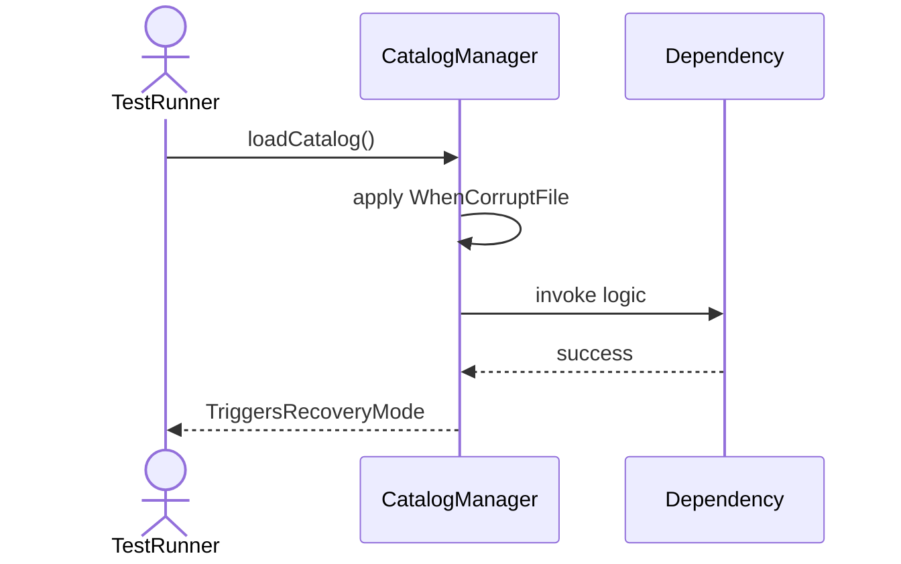

# Sequence Diagrams: CatalogManager

## 🆕 Added Properties & Methods for `CatalogManager`
To support the detailed sequence logic for unit testing, please update the `CatalogManager` class in your Class Diagram with the following properties and methods:

- **Property** added to `CatalogManager`: `catalogDict (Dict)`
- **Method** added to `CatalogManager`: `findObject()`
- **Method** added to `CatalogManager`: `flushCatalog()`
- **Method** added to `CatalogManager`: `loadCatalog()`
- **Method** added to `CatalogManager`: `registerObject()`
- **Method** added to `CatalogManager`: `removeObject()`
- **Method** added to `CatalogManager`: `updateObject()`

---

This file contains the detailed sequence diagrams for all 10 unit tests of the **CatalogManager** class.

## 1. RegisterObject_WhenObjectIsValid_UpdatesCatalogDictionary

## 2. RegisterObject_WhenDuplicateId_ThrowsException

## 3. FindObject_WhenExists_ReturnsObjectMetadata

## 4. FindObject_WhenNotExists_ReturnsNull

## 5. RemoveObject_WhenExists_DeletesFromCatalog

## 6. RemoveObject_WhenNotExists_ThrowsNotFoundException

## 7. UpdateObject_WhenExists_RefreshesMetadata

## 8. FlushCatalog_WritesToStorageSuccessfully

## 9. LoadCatalog_PopulatesMemoryFromDisk

## 10. LoadCatalog_WhenCorruptFile_TriggersRecoveryMode

