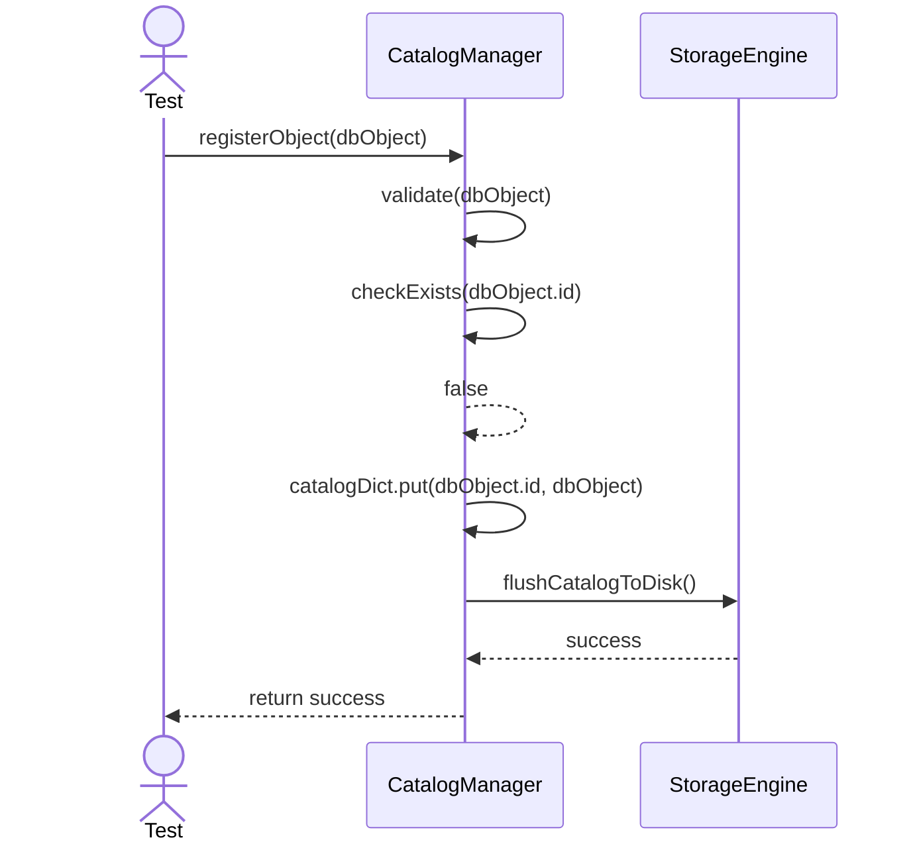
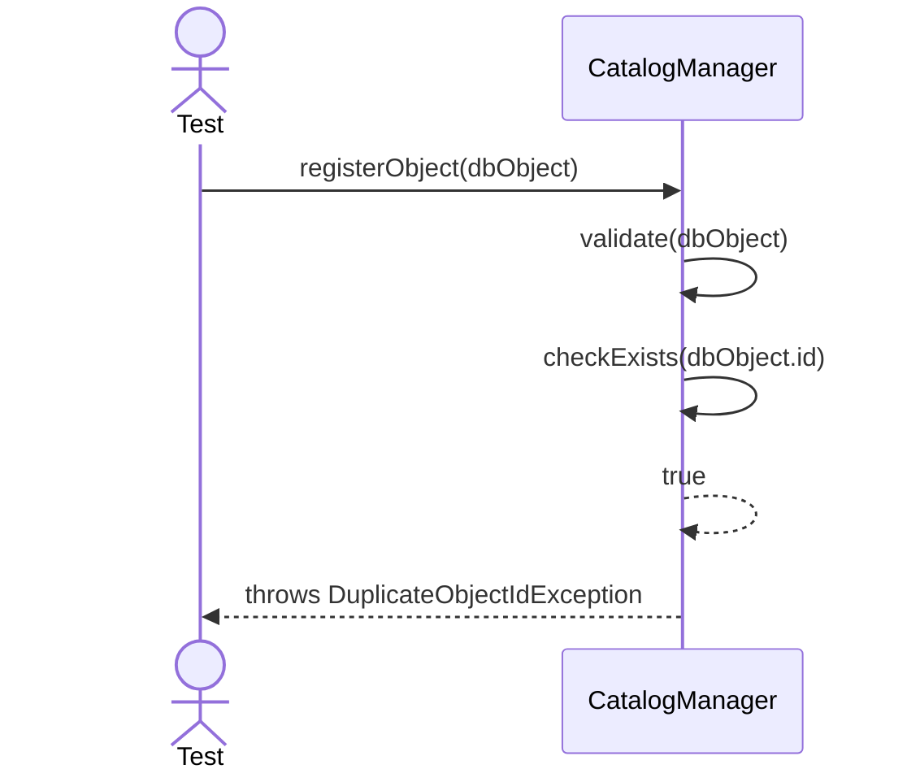
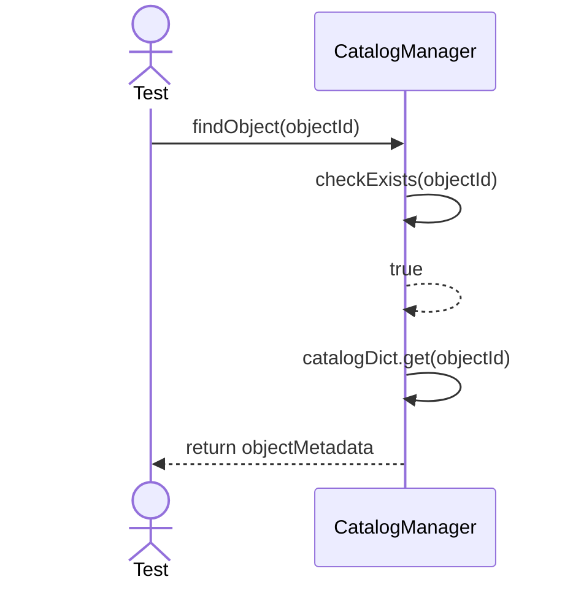
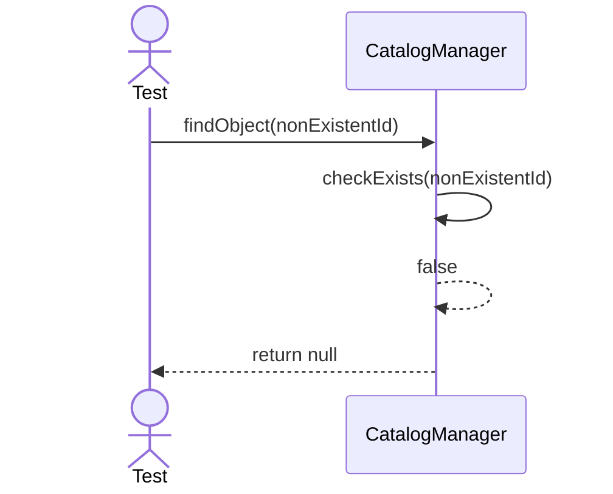

# Sequence Diagrams: CatalogManager

## 🆕 Added Properties & Methods for `CatalogManager`
To support the detailed sequence logic for unit testing, the following missing properties/methods have been introduced. **Please update the `CatalogManager` class in your Class Diagram with these:**

- **Property** added to `CatalogManager`: `catalogDict` (Dictionary/Map mapping object IDs to their Metadata)
- **Method** added to `CatalogManager`: `checkExists(objectId)` (Returns a boolean indicating if an object exists)
- **Method** added to `CatalogManager`: `removeObject(objectId)` (Removes an object from `catalogDict`)
- **Method** added to `CatalogManager`: `validate(dbObject)` (Validates object integrity before registering)

---

This file contains the detailed sequence diagrams for all unit tests of the **CatalogManager** class in the Core Server & Connections subsystem.

## 1. RegisterObject_WhenObjectIsValid_UpdatesCatalogDictionary

## 2. RegisterObject_WhenDuplicateId_ThrowsException

## 3. FindObject_WhenExists_ReturnsObjectMetadata

## 4. FindObject_WhenNotExists_ReturnsNull

