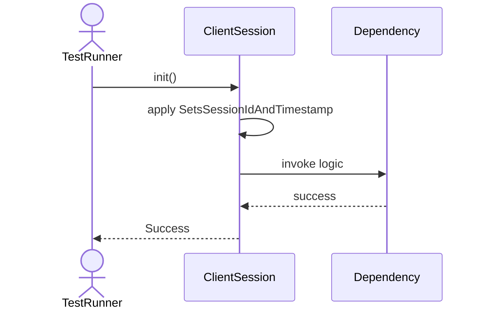
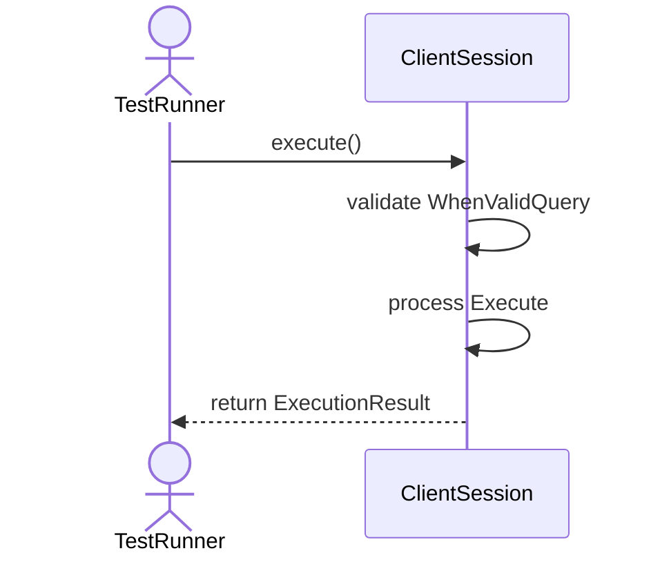
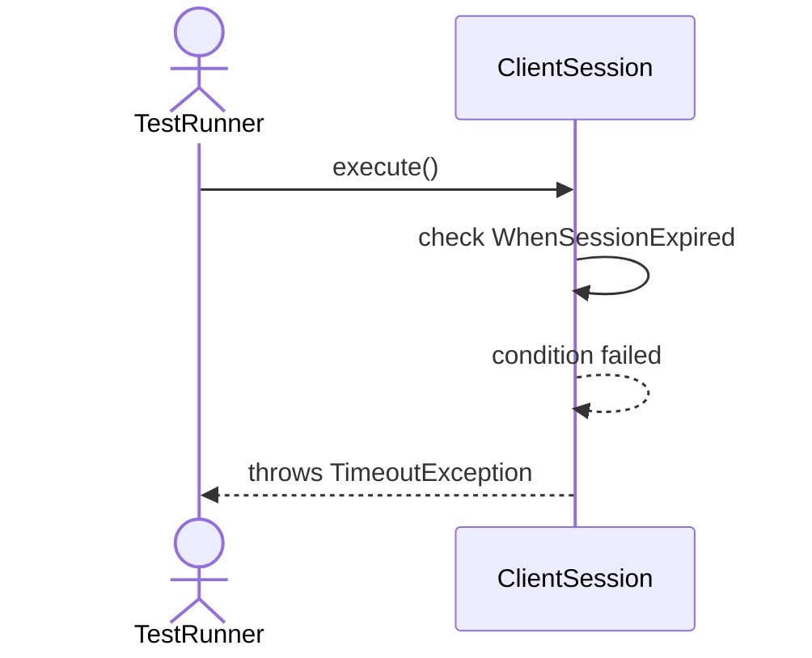
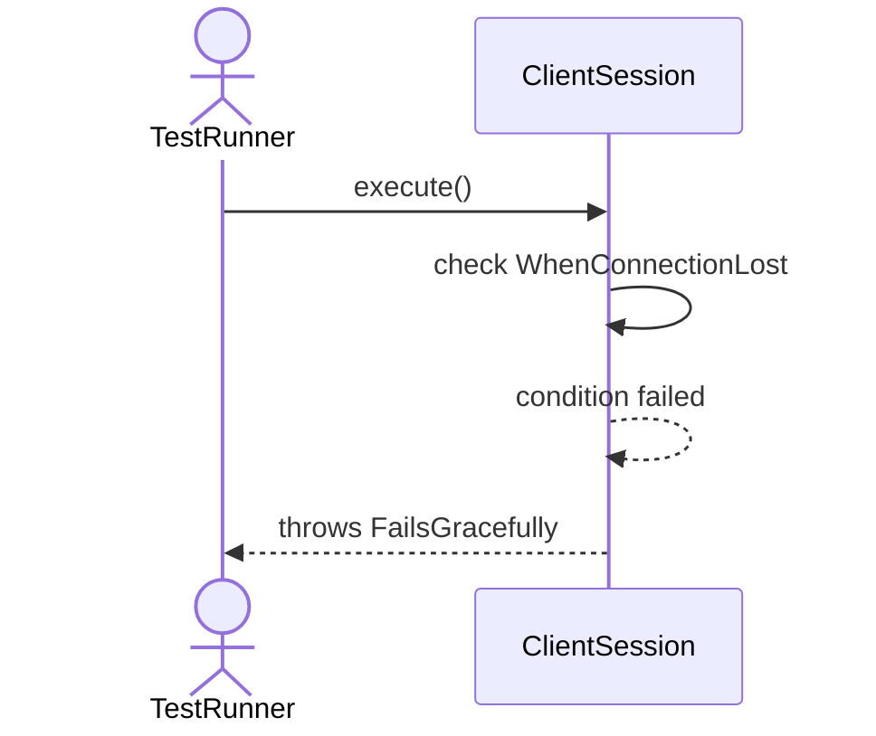
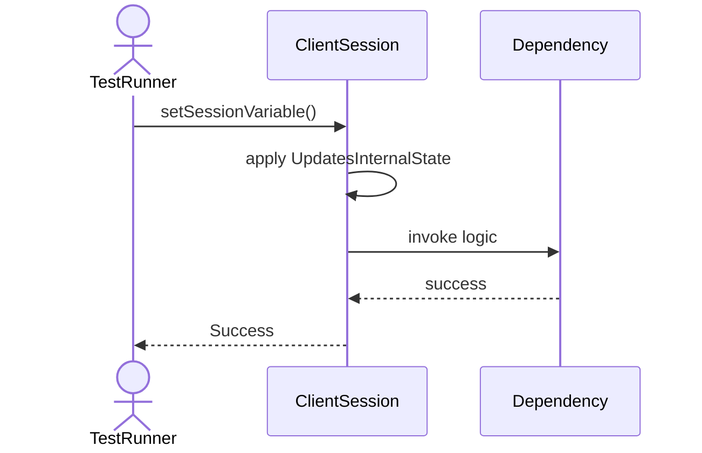
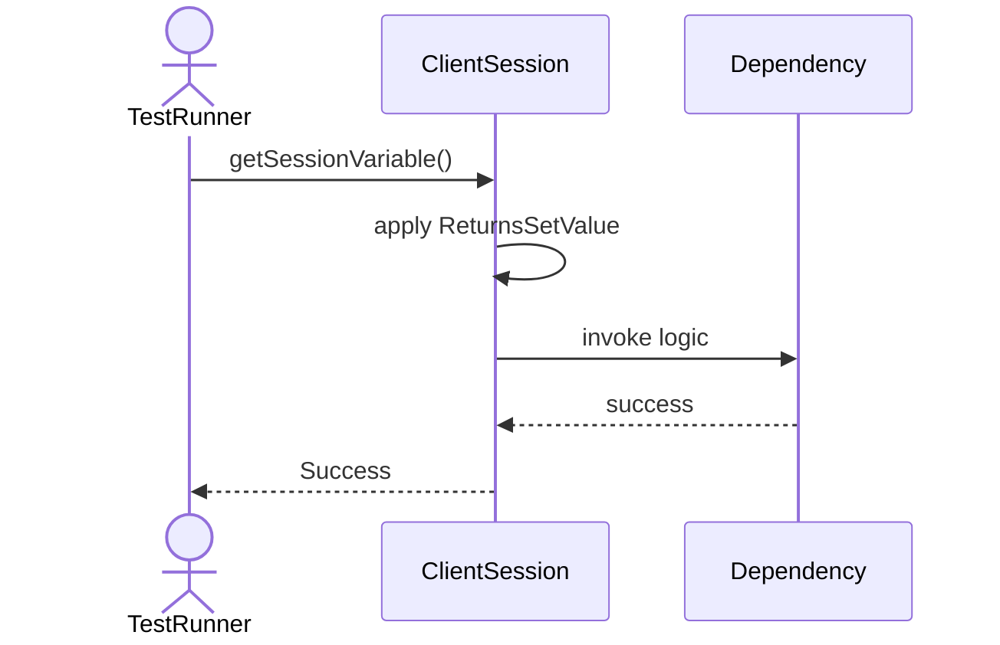
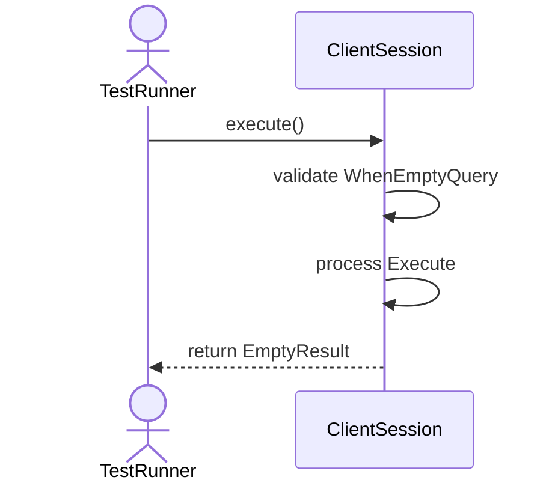
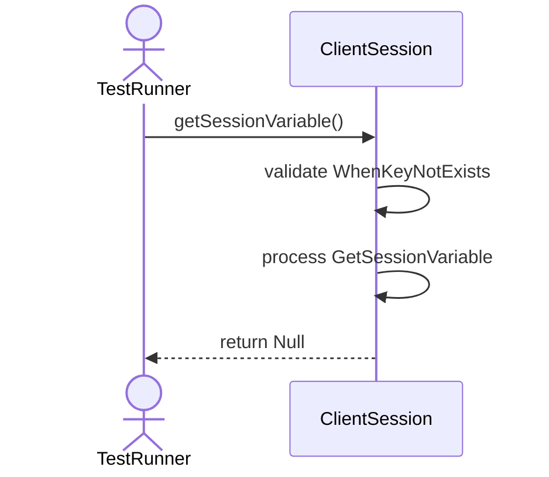
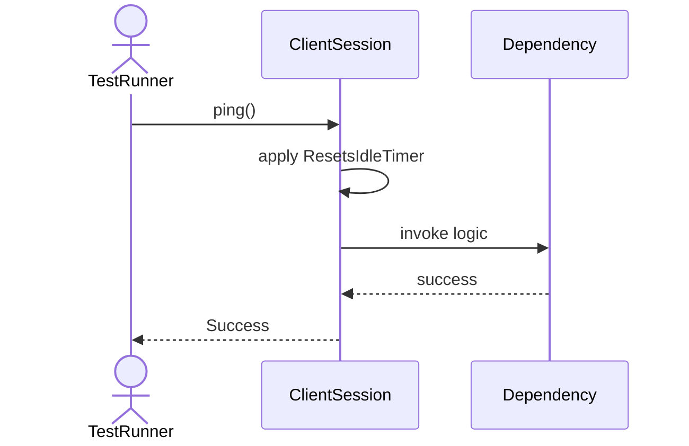

# Sequence Diagrams: ClientSession

## 🆕 Added Properties & Methods for `ClientSession`
To support the detailed sequence logic for unit testing, please update the `ClientSession` class in your Class Diagram with the following properties and methods:

- **Property** added to `ClientSession`: `TIMEOUT (Int)`
- **Property** added to `ClientSession`: `connectTime (DateTime)`
- **Property** added to `ClientSession`: `sessionVariables (Dict)`
- **Method** added to `ClientSession`: `execute()`
- **Method** added to `ClientSession`: `getSessionVariable()`
- **Method** added to `ClientSession`: `ping()`
- **Method** added to `ClientSession`: `setSessionVariable()`

---

This file contains the detailed sequence diagrams for all 9 unit tests of the **ClientSession** class.

## 1. Init_SetsSessionIdAndTimestamp

## 2. Execute_WhenValidQuery_ReturnsExecutionResult

## 3. Execute_WhenSessionExpired_ThrowsTimeoutException

## 4. Execute_WhenConnectionLost_FailsGracefully

## 5. SetSessionVariable_UpdatesInternalState

## 6. GetSessionVariable_ReturnsSetValue

## 7. Execute_WhenEmptyQuery_ReturnsEmptyResult

## 8. GetSessionVariable_WhenKeyNotExists_ReturnsNull

## 9. Ping_ResetsIdleTimer

