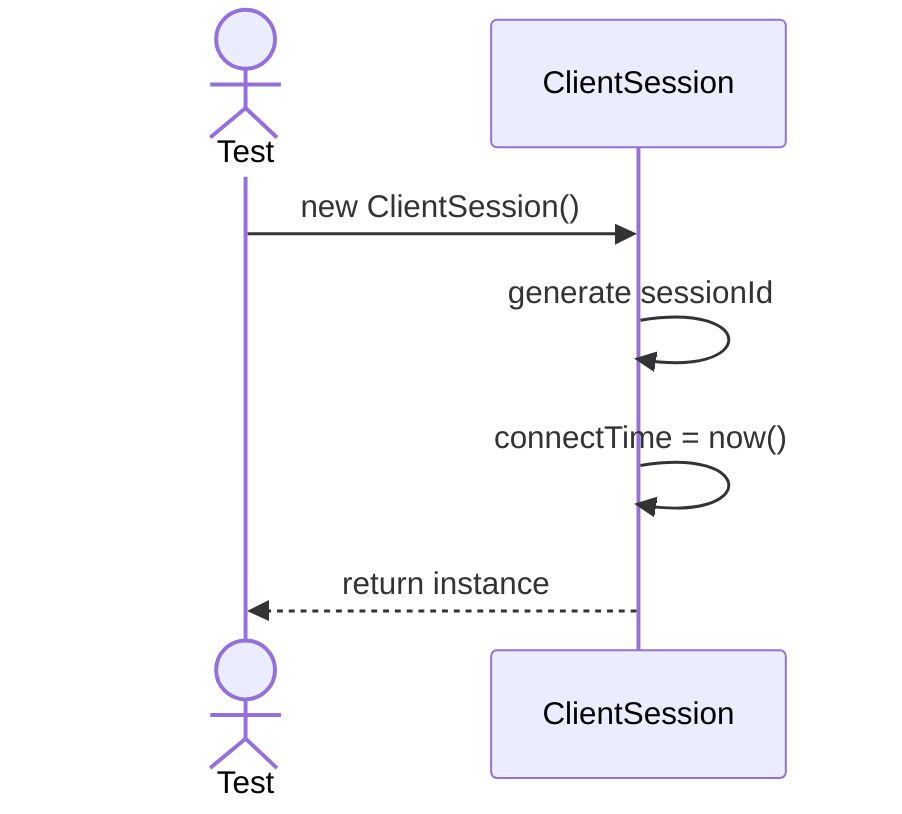
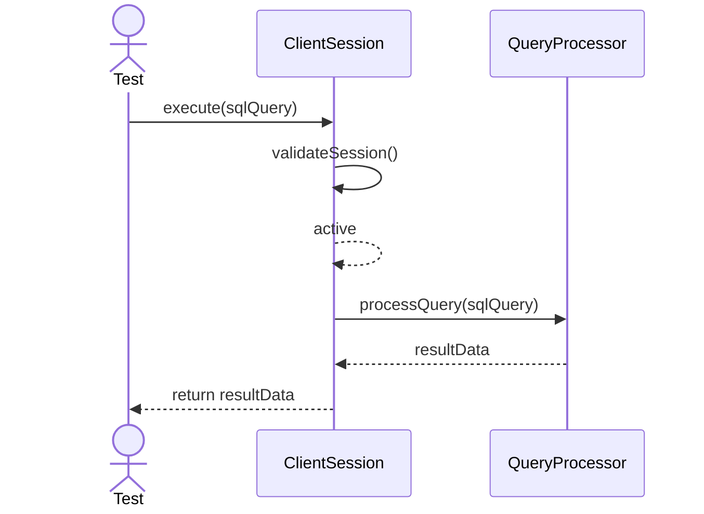
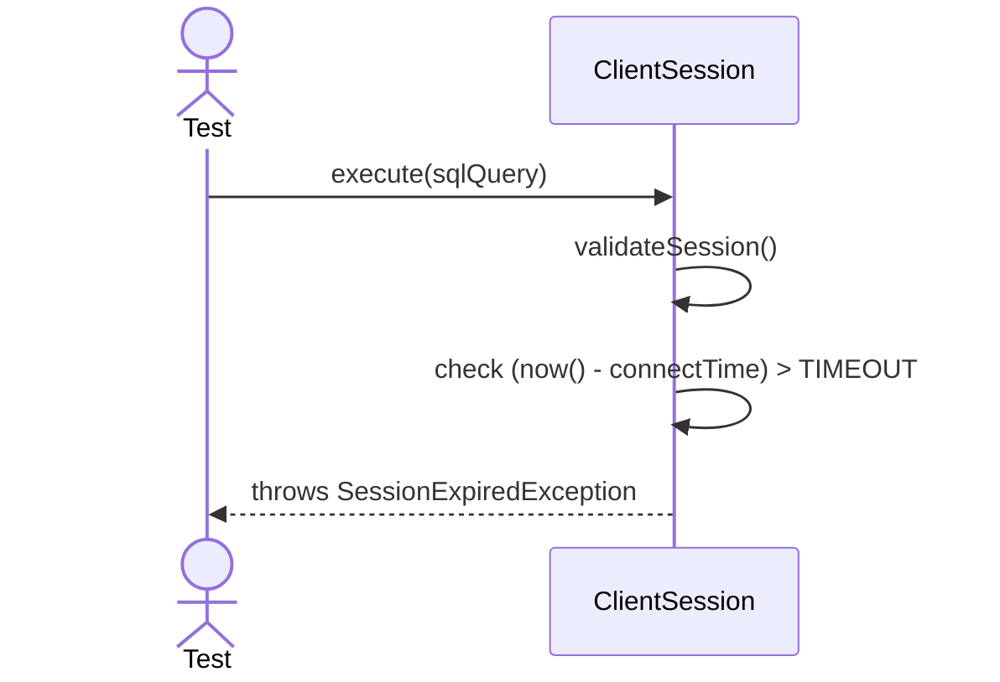
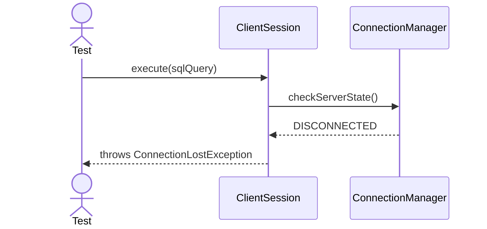

# Sequence Diagrams: ClientSession

## 🆕 Added Properties & Methods for `ClientSession`
To support the detailed sequence logic for unit testing, the following missing properties/methods have been introduced. **Please update the `ClientSession` class in your Class Diagram with these:**

- **Property** added to `ClientSession`: `TIMEOUT` (Constant for session expiration)
- **Method** added to `ClientSession`: `close()` (Releases session resources, called by ConnectionManager)
- **Method** added to `ClientSession`: `validateSession()` (Checks session expiration against `connectTime`)

---

This file contains the detailed sequence diagrams for all unit tests of the **ClientSession** class in the Core Server & Connections subsystem.

## 1. Init_SetsSessionIdAndTimestamp

## 2. Execute_WhenValidQuery_ReturnsExecutionResult

## 3. Execute_WhenSessionExpired_ThrowsTimeoutException

## 4. Execute_WhenConnectionLost_FailsGracefully

