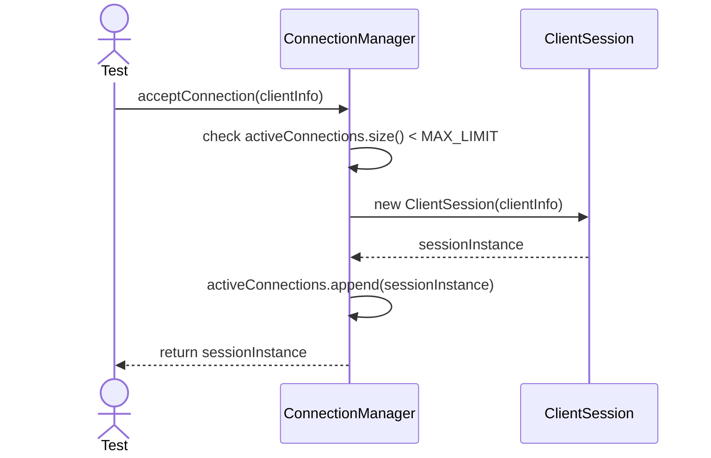
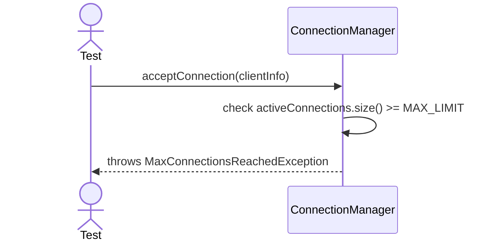
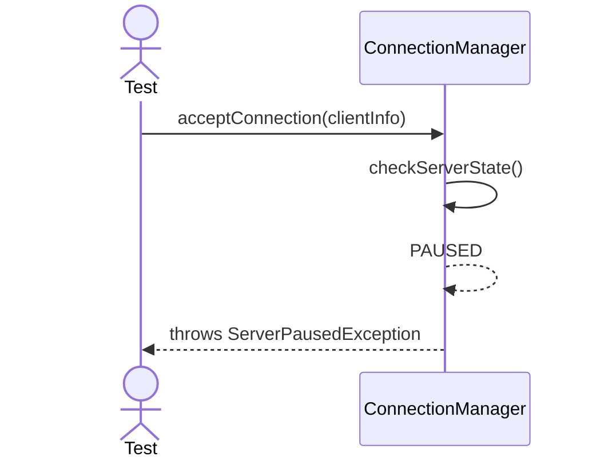
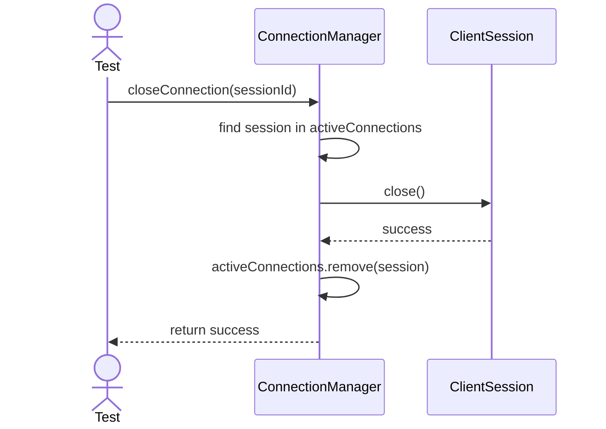
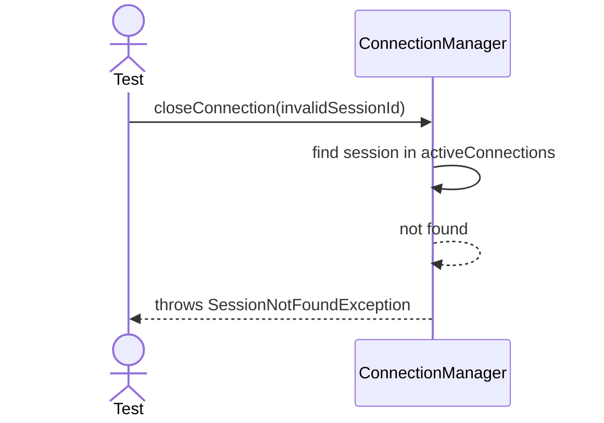

# Sequence Diagrams: ConnectionManager

## 🆕 Added Properties & Methods for `ConnectionManager`
To support the detailed sequence logic for unit testing, the following missing properties/methods have been introduced. **Please update the `ConnectionManager` class in your Class Diagram with these:**

- **Property** added to `ConnectionManager`: `activeConnections` (List or Counter of currently active sessions)
- **Property** added to `ConnectionManager`: `MAX_LIMIT` (Integer constant defining maximum concurrent connections)
- **Method** added to `ConnectionManager`: `getActiveSessions(dbName)` (Returns active sessions for a specific database, used by DatabaseManager)
- **Method** added to `ConnectionManager`: `checkServerState()` (Checks if the server is PAUSED or DISCONNECTED)

---

This file contains the detailed sequence diagrams for all unit tests of the **ConnectionManager** class in the Core Server & Connections subsystem.

## 1. AcceptConnection_WhenUnderMaxLimit_CreatesClientSession

## 2. AcceptConnection_WhenAtMaxLimit_RejectsConnection

## 3. AcceptConnection_WhenServerPaused_QueuesOrRejects

## 4. CloseConnection_WhenValidSession_ReleasesResources

## 5. CloseConnection_WhenInvalidSession_ThrowsException

