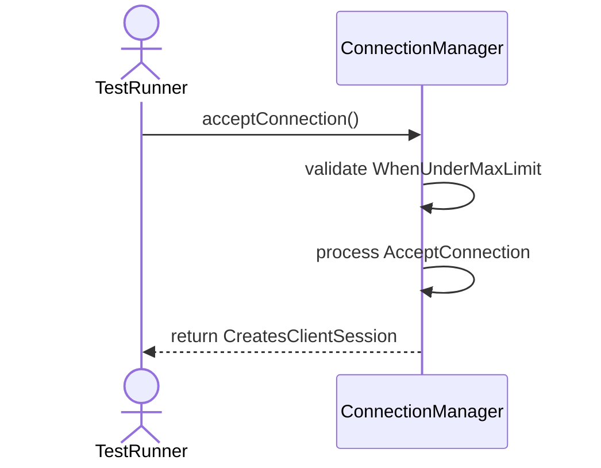
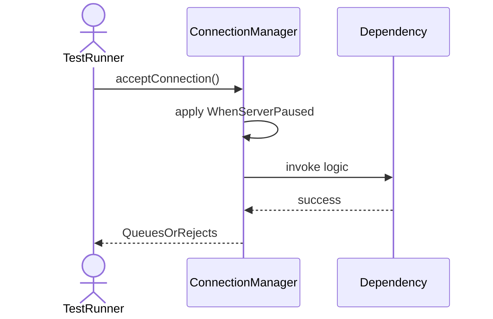
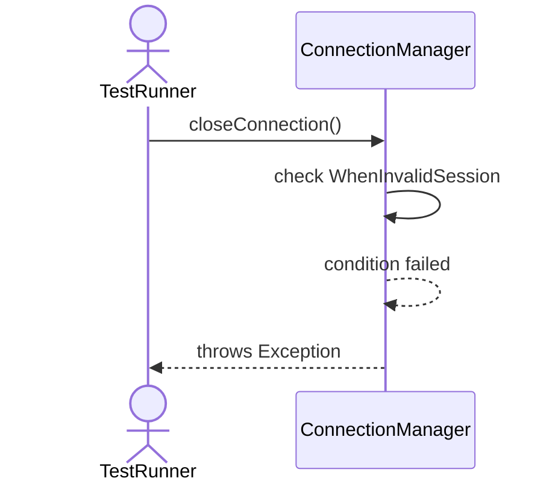
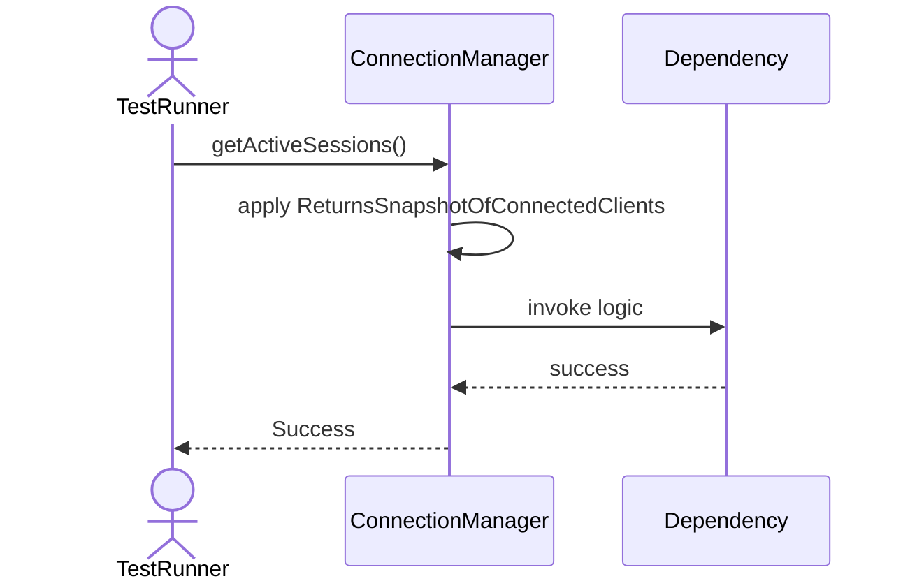
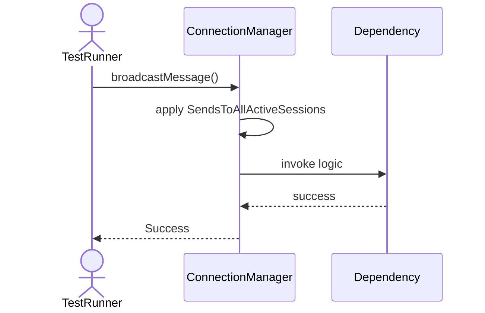
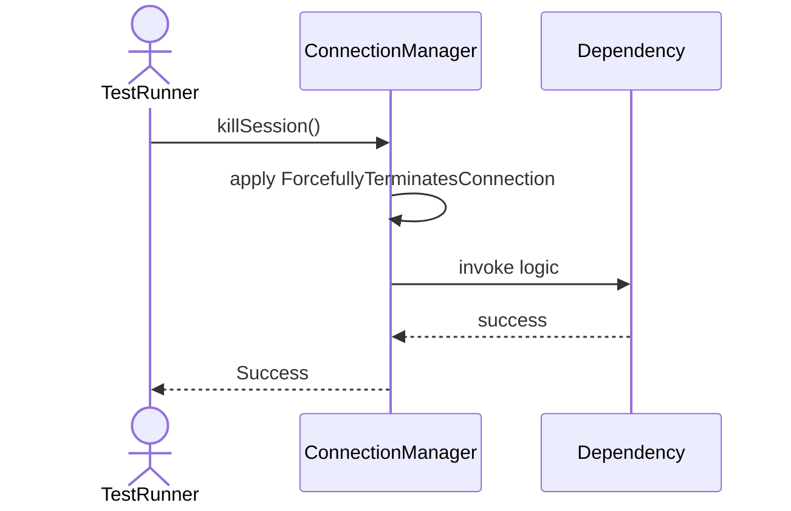
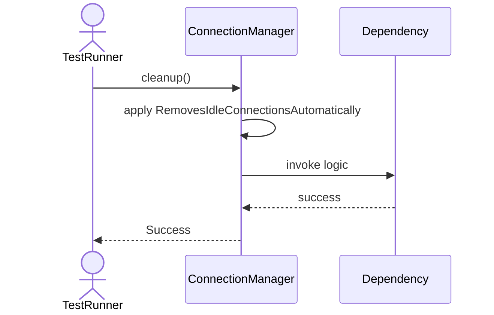
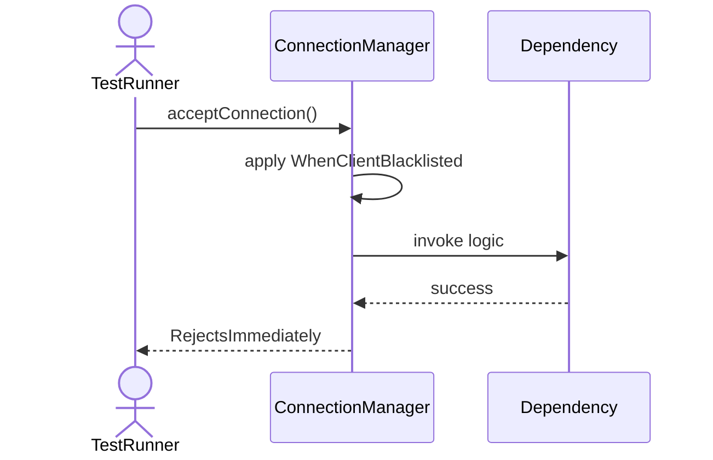

# Sequence Diagrams: ConnectionManager

## 🆕 Added Properties & Methods for `ConnectionManager`
To support the detailed sequence logic for unit testing, please update the `ConnectionManager` class in your Class Diagram with the following properties and methods:

- **Property** added to `ConnectionManager`: `activeConnections (List)`
- **Property** added to `ConnectionManager`: `MAX_LIMIT (Int)`
- **Property** added to `ConnectionManager`: `isPaused (Bool)`
- **Method** added to `ConnectionManager`: `acceptConnection()`
- **Method** added to `ConnectionManager`: `broadcastMessage()`
- **Method** added to `ConnectionManager`: `cleanup()`
- **Method** added to `ConnectionManager`: `closeConnection()`
- **Method** added to `ConnectionManager`: `getActiveSessions()`
- **Method** added to `ConnectionManager`: `killSession()`

---

This file contains the detailed sequence diagrams for all 10 unit tests of the **ConnectionManager** class.

## 1. AcceptConnection_WhenUnderMaxLimit_CreatesClientSession

## 2. AcceptConnection_WhenAtMaxLimit_RejectsConnection

## 3. AcceptConnection_WhenServerPaused_QueuesOrRejects

## 4. CloseConnection_WhenValidSession_ReleasesResources

## 5. CloseConnection_WhenInvalidSession_ThrowsException

## 6. GetActiveSessions_ReturnsSnapshotOfConnectedClients

## 7. BroadcastMessage_SendsToAllActiveSessions

## 8. KillSession_ForcefullyTerminatesConnection

## 9. Cleanup_RemovesIdleConnectionsAutomatically

## 10. AcceptConnection_WhenClientBlacklisted_RejectsImmediately

