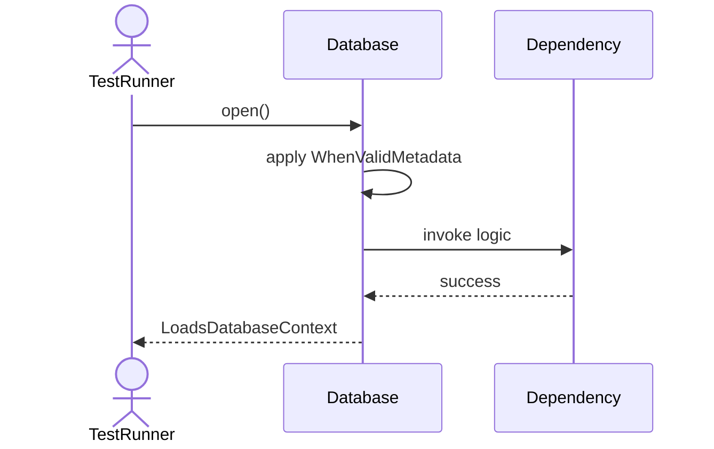
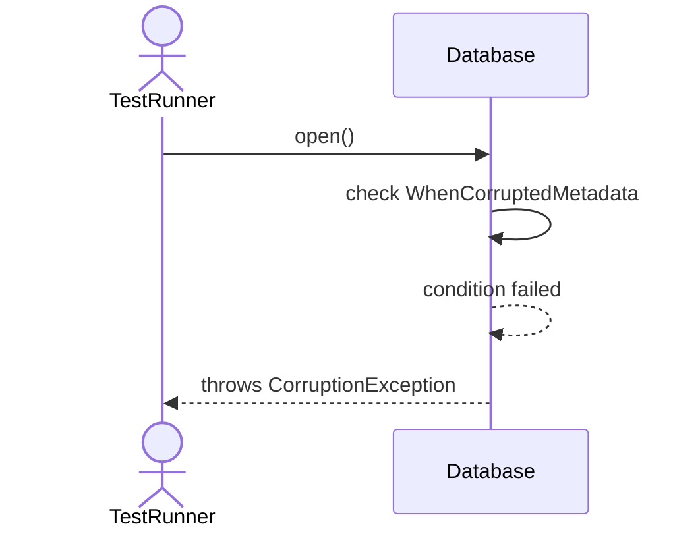
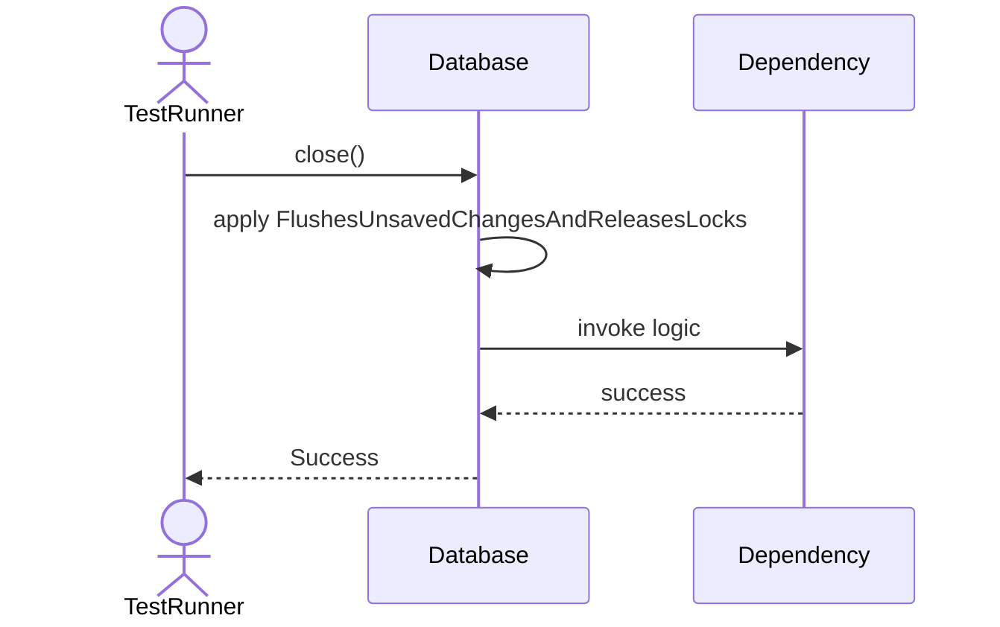
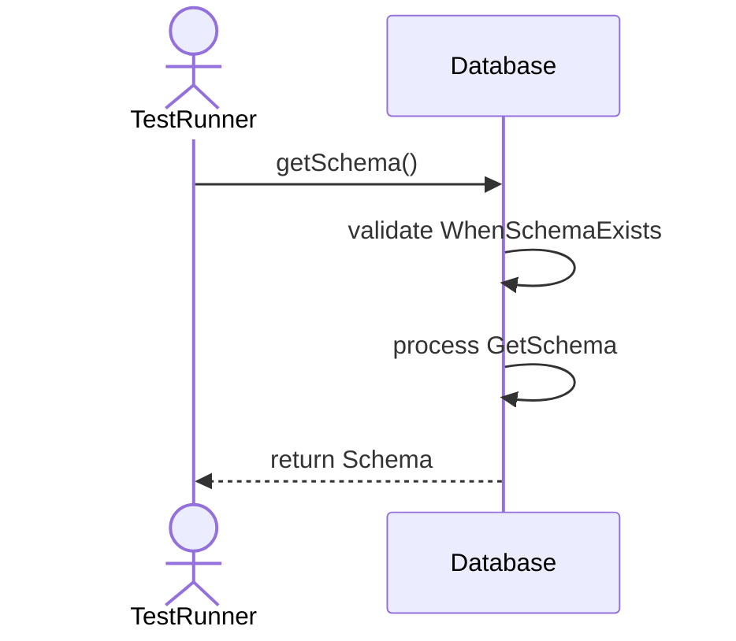
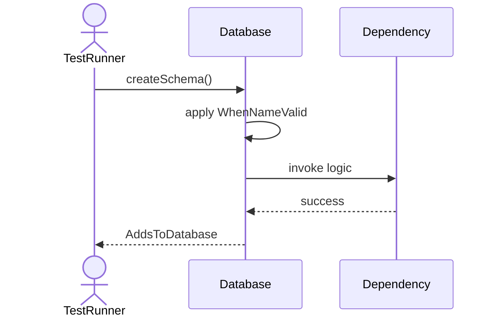
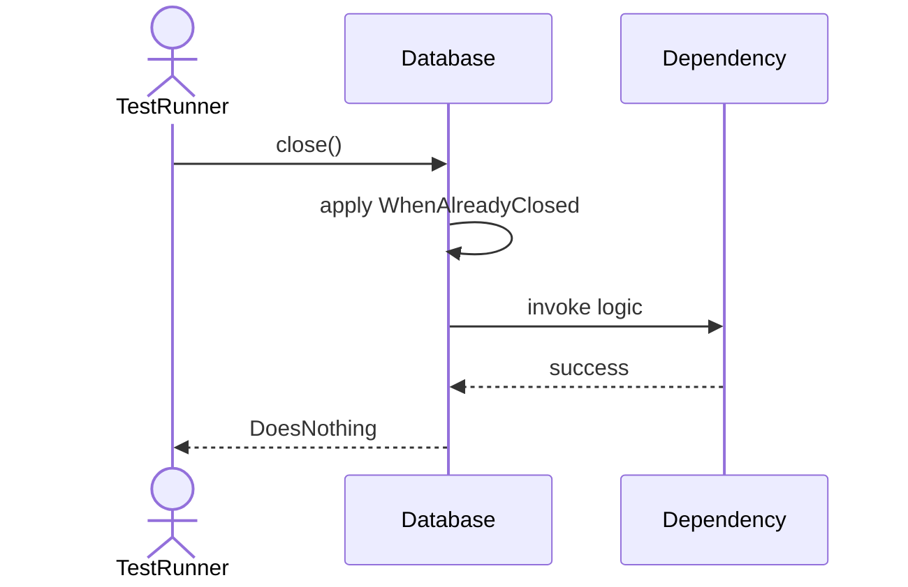
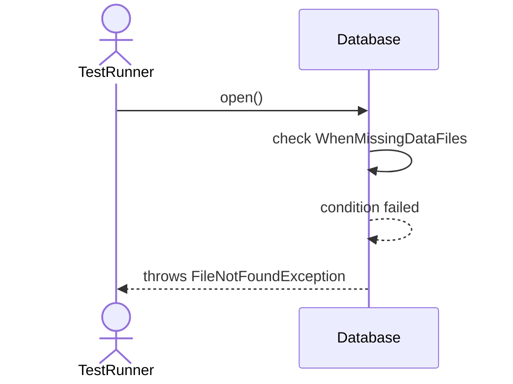

# Sequence Diagrams: Database

## 🆕 Added Properties & Methods for `Database`
To support the detailed sequence logic for unit testing, please update the `Database` class in your Class Diagram with the following properties and methods:

- **Property** added to `Database`: `schemaDict (Dict)`
- **Property** added to `Database`: `contextData`
- **Method** added to `Database`: `close()`
- **Method** added to `Database`: `createSchema()`
- **Method** added to `Database`: `getSchema()`
- **Method** added to `Database`: `open()`

---

This file contains the detailed sequence diagrams for all 8 unit tests of the **Database** class.

## 1. Init_SetsDatabaseNameCorrectly

## 2. Open_WhenValidMetadata_LoadsDatabaseContext

## 3. Open_WhenCorruptedMetadata_ThrowsCorruptionException

## 4. Close_FlushesUnsavedChangesAndReleasesLocks

## 5. GetSchema_WhenSchemaExists_ReturnsSchema

## 6. CreateSchema_WhenNameValid_AddsToDatabase

## 7. Close_WhenAlreadyClosed_DoesNothing

## 8. Open_WhenMissingDataFiles_ThrowsFileNotFoundException

