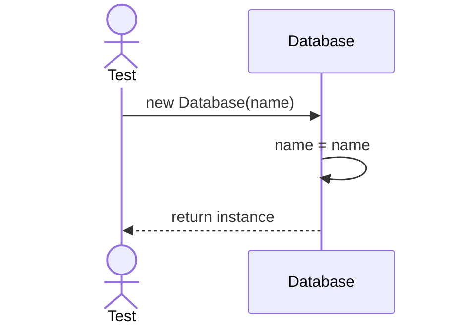
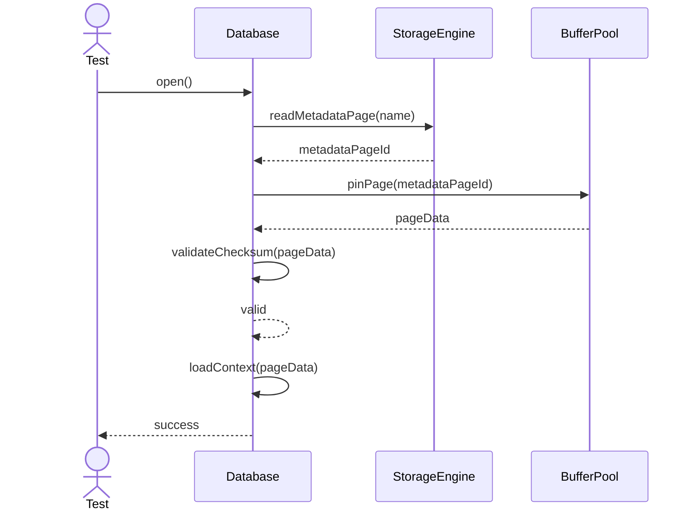
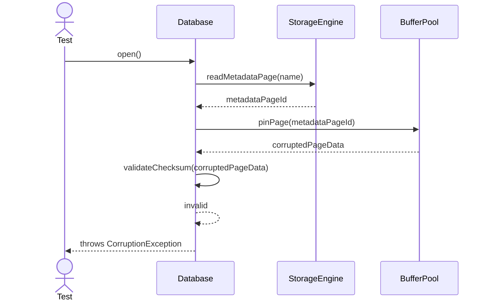

# Sequence Diagrams: Database

## 🆕 Added Properties & Methods for `Database`
To support the detailed sequence logic for unit testing, the following missing properties/methods have been introduced. **Please update the `Database` class in your Class Diagram with these:**

- **Method** added to `Database`: `loadContext(pageData)` (Parses metadata loaded from StorageEngine)
- **Method** added to `Database`: `validateChecksum(pageData)` (Checks for data corruption before loading)

---

This file contains the detailed sequence diagrams for all unit tests of the **Database** class in the Core Server & Connections subsystem.

## 1. Init_SetsDatabaseNameCorrectly

## 2. Open_WhenValidMetadata_LoadsDatabaseContext

## 3. Open_WhenCorruptedMetadata_ThrowsCorruptionException

