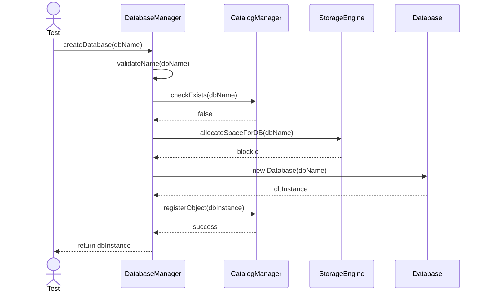
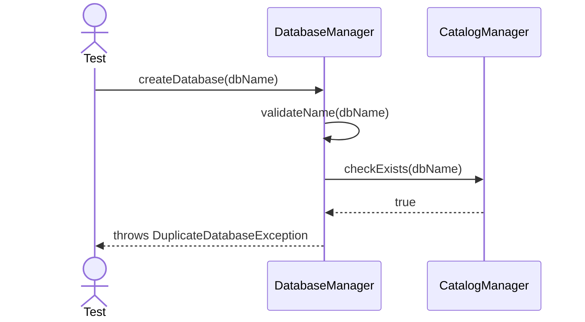
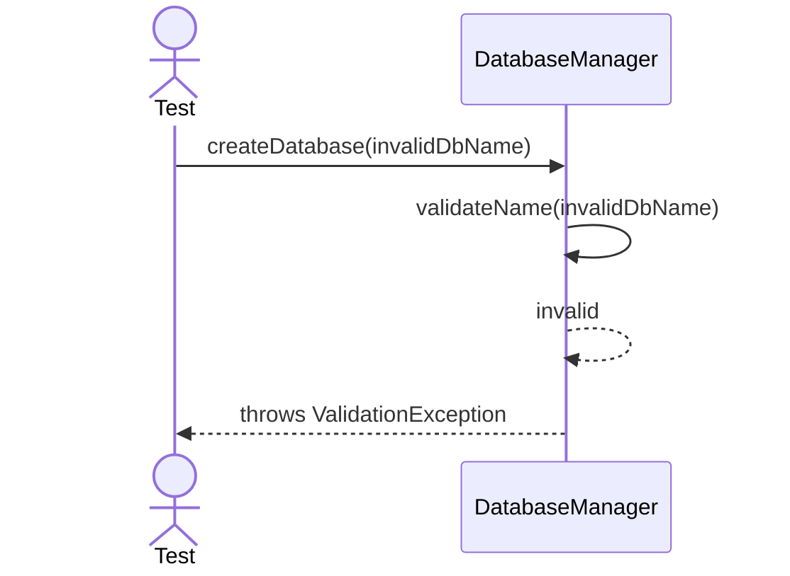
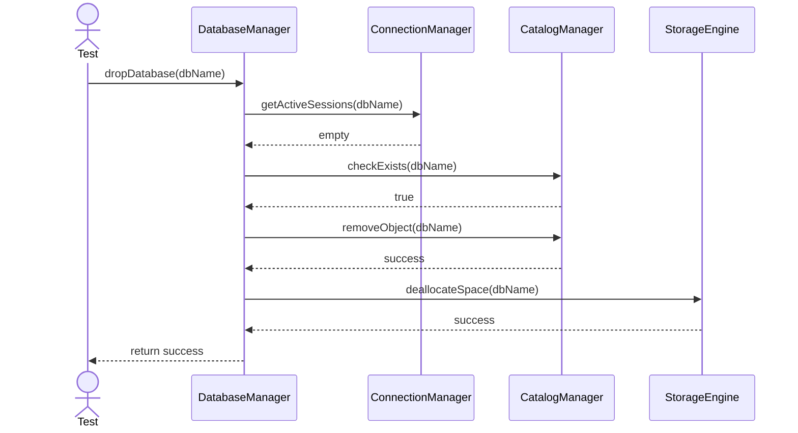
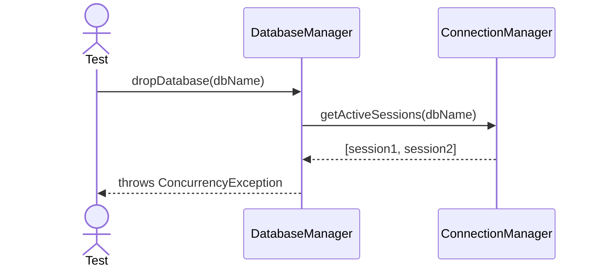

# Sequence Diagrams: DatabaseManager

## 🆕 Added Properties & Methods for `DatabaseManager`
To support the detailed sequence logic for unit testing, the following missing properties/methods have been introduced. **Please update the `DatabaseManager` class in your Class Diagram with these:**

- **Method** added to `DatabaseManager`: `validateName(name: String)` (Checks for invalid characters in the DB name before creation)

---

This file contains the detailed sequence diagrams for all unit tests of the **DatabaseManager** class in the Core Server & Connections subsystem.

## 1. CreateDatabase_WhenNameIsValid_CreatesMetadataAndFiles

## 2. CreateDatabase_WhenNameExists_ThrowsDuplicateDatabaseException

## 3. CreateDatabase_WhenInvalidCharacters_ThrowsValidationException

## 4. DropDatabase_WhenExists_RemovesAllAssociatedData

## 5. DropDatabase_WhenInUse_ThrowsConcurrencyException

