# Sequence Diagrams: DatabaseManager

## 🆕 Added Properties & Methods for `DatabaseManager`
To support the detailed sequence logic for unit testing, please update the `DatabaseManager` class in your Class Diagram with the following properties and methods:

- **Method** added to `DatabaseManager`: `createDatabase()`
- **Method** added to `DatabaseManager`: `dropDatabase()`
- **Method** added to `DatabaseManager`: `getDatabase()`
- **Method** added to `DatabaseManager`: `listDatabases()`
- **Method** added to `DatabaseManager`: `renameDatabase()`

---

This file contains the detailed sequence diagrams for all 12 unit tests of the **DatabaseManager** class.

## 1. CreateDatabase_WhenNameIsValid_CreatesMetadataAndFiles

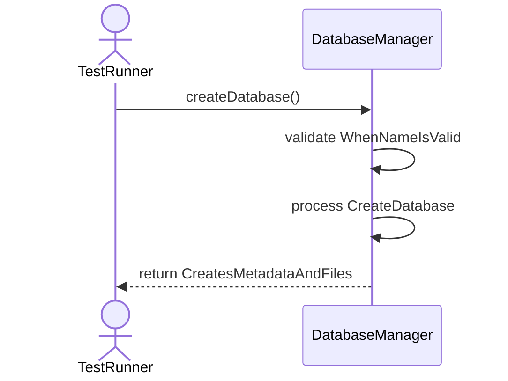

## 2. CreateDatabase_WhenNameExists_ThrowsDuplicateDatabaseException

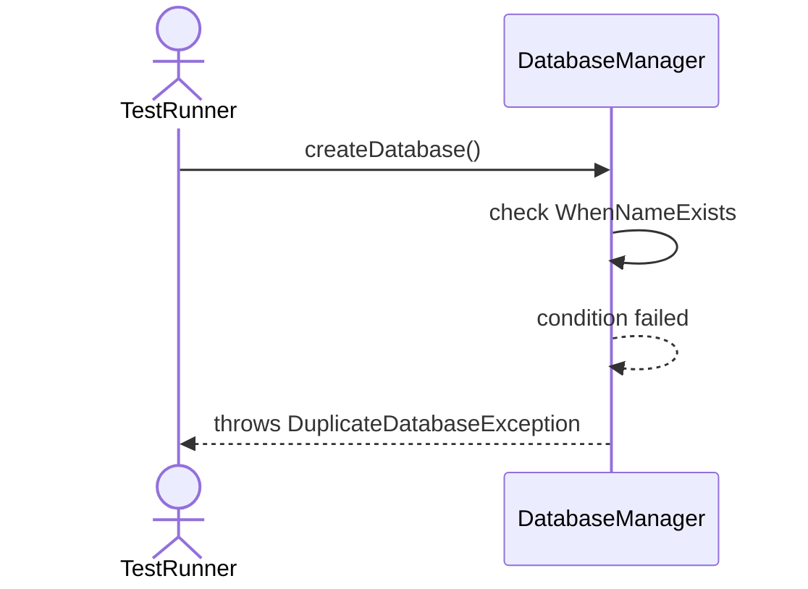

## 3. CreateDatabase_WhenInvalidCharacters_ThrowsValidationException

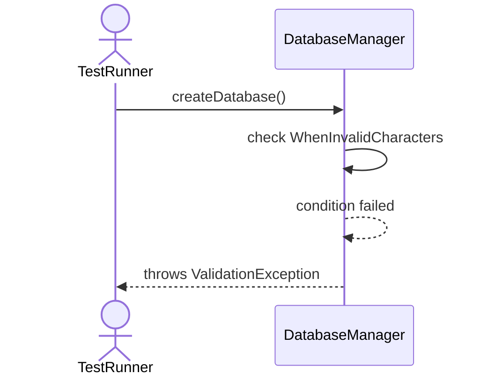

## 4. DropDatabase_WhenExists_RemovesAllAssociatedData

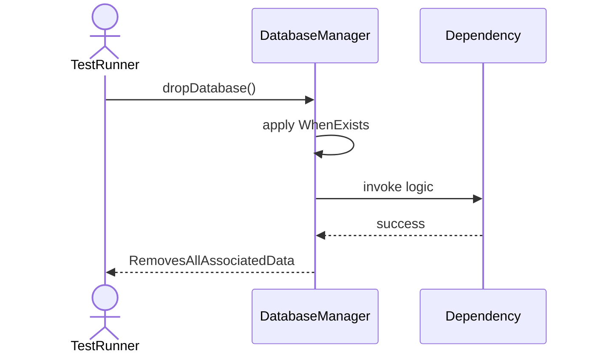

## 5. DropDatabase_WhenInUse_ThrowsConcurrencyException

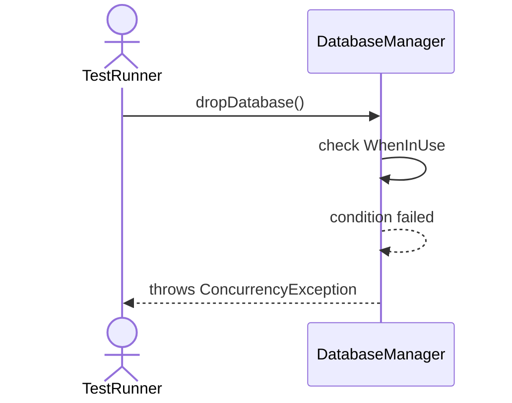

## 6. GetDatabase_WhenExists_ReturnsDatabaseInstance

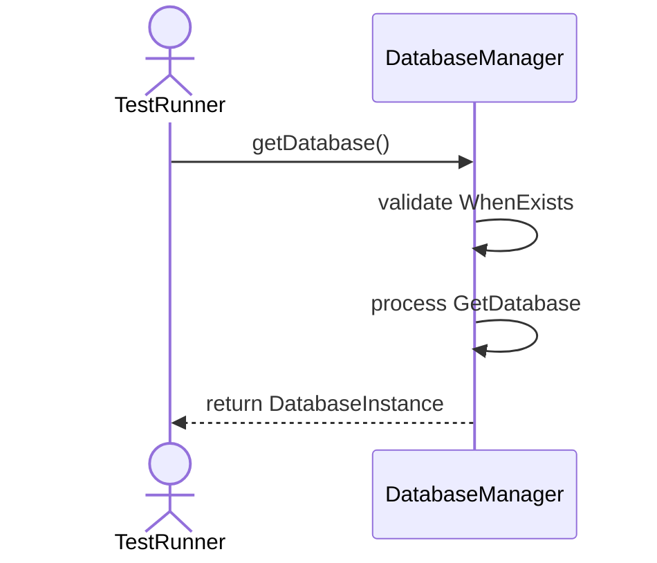

## 7. GetDatabase_WhenNotExists_ThrowsDatabaseNotFoundException

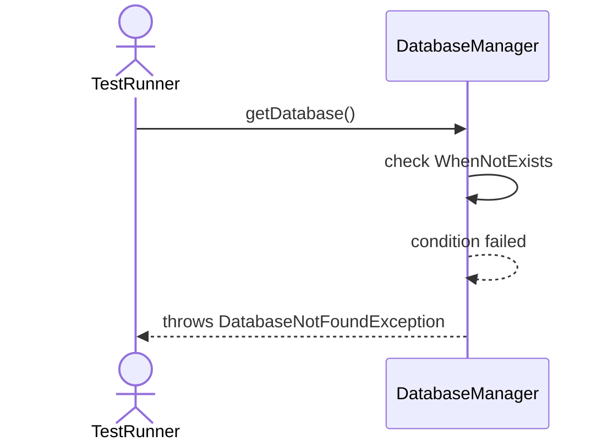

## 8. ListDatabases_ReturnsAllRegisteredDatabases

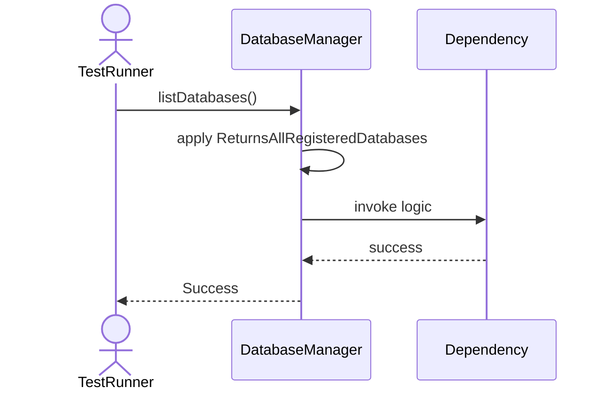

## 9. RenameDatabase_WhenNewNameValid_UpdatesMetadata

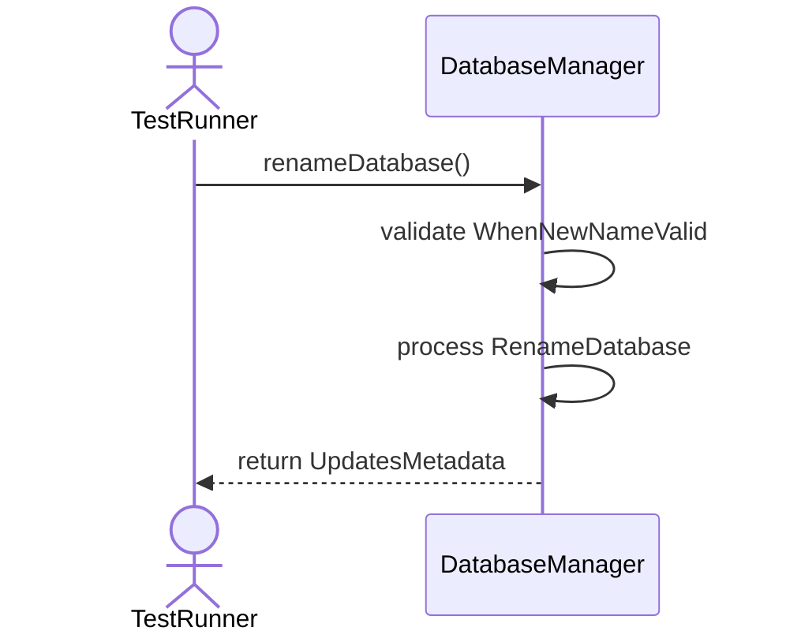

## 10. CreateDatabase_WhenDiskFull_ThrowsInsufficientStorageException

## 11. CreateDatabase_WhenNameTooLong_ThrowsValidationException

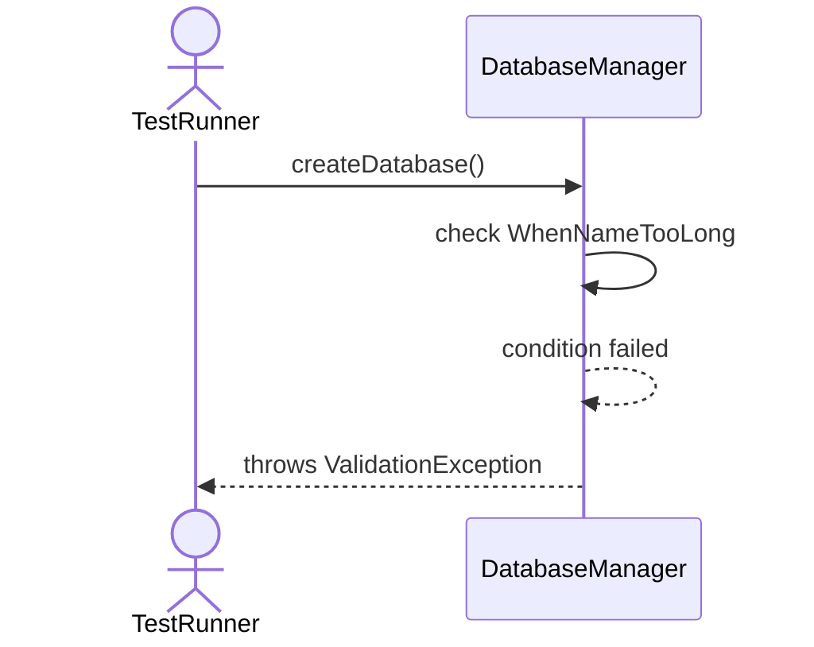

## 12. DropDatabase_WhenPermissionDenied_ThrowsSecurityException

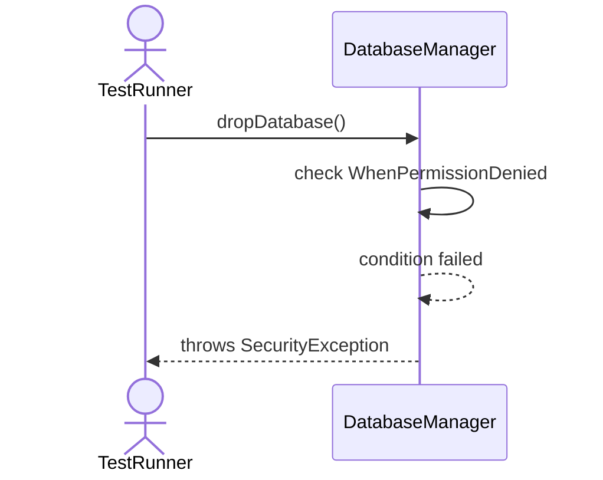

