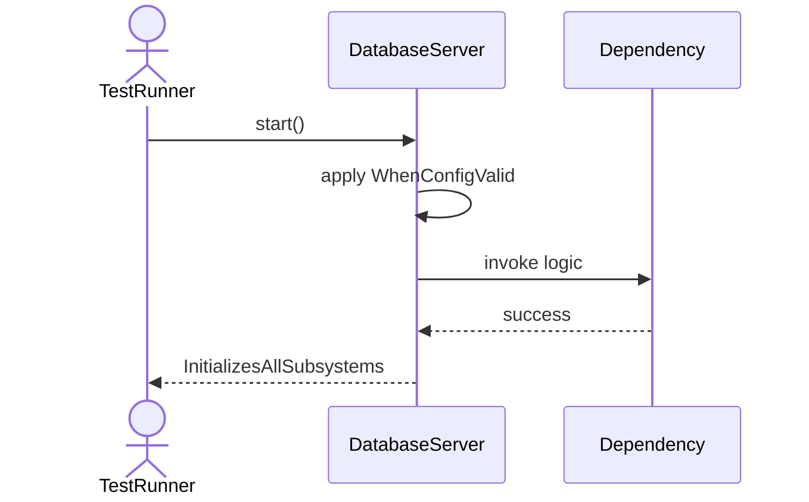
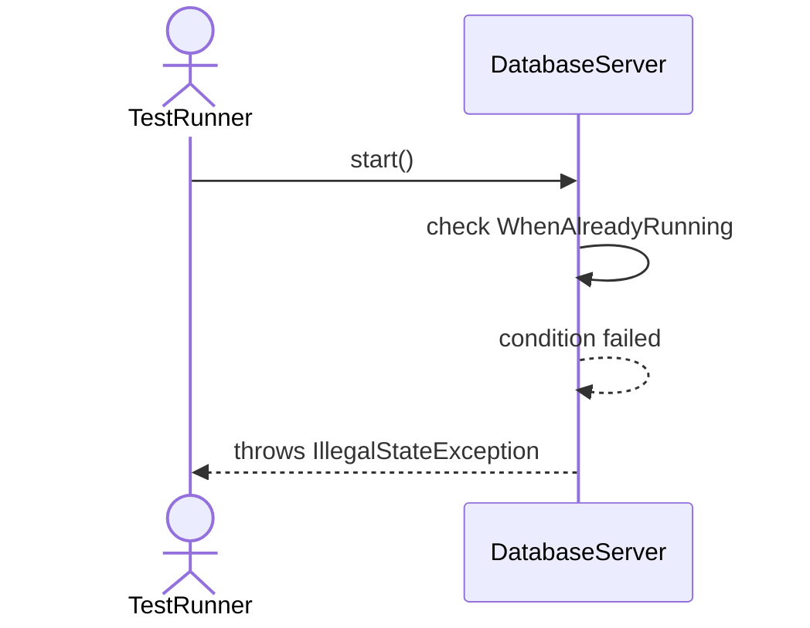
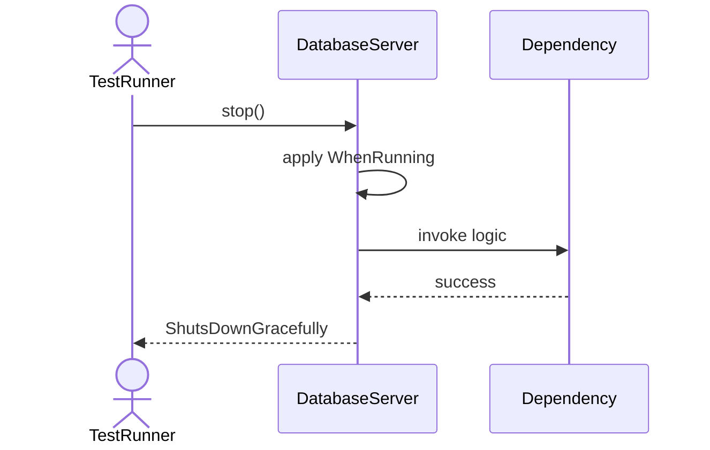
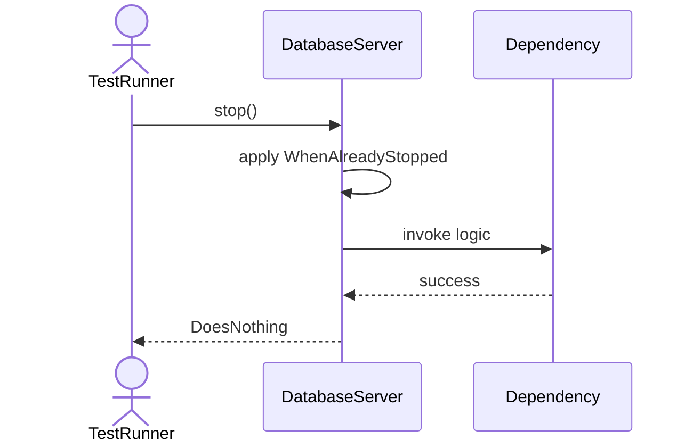
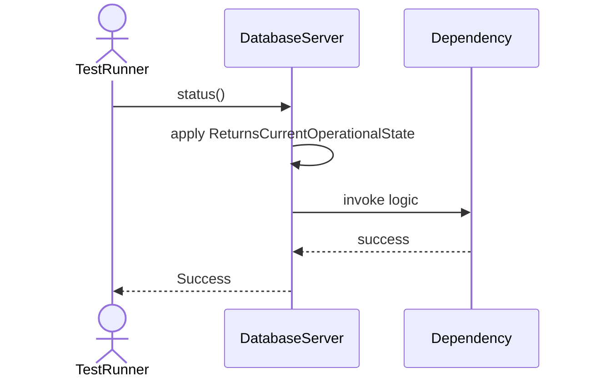
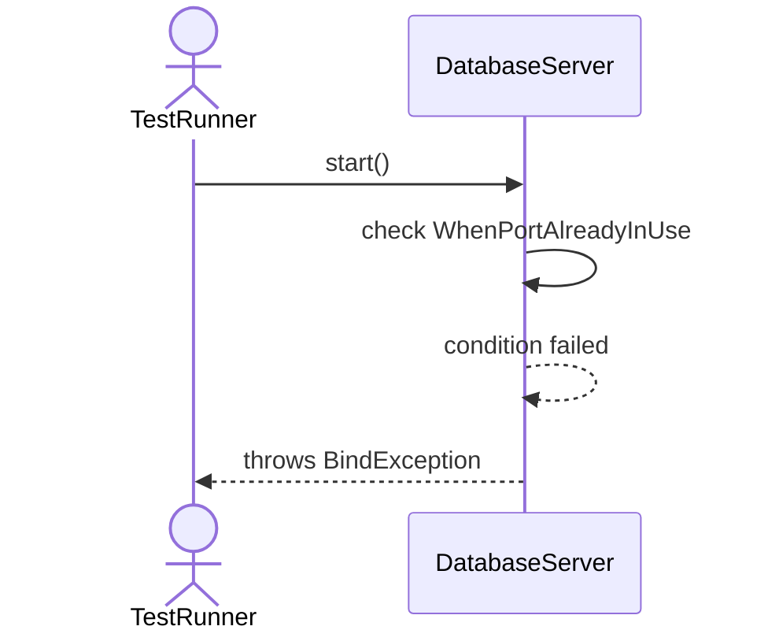
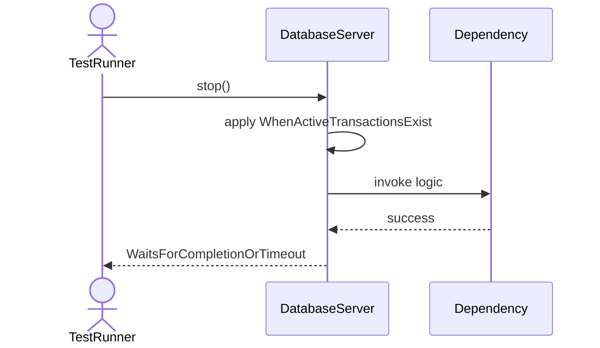
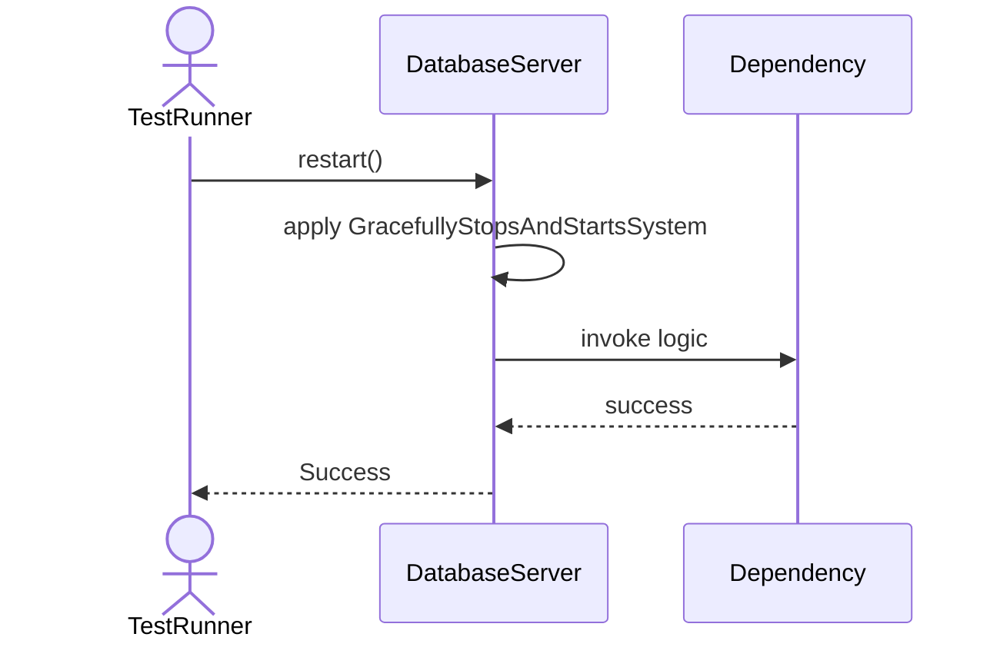
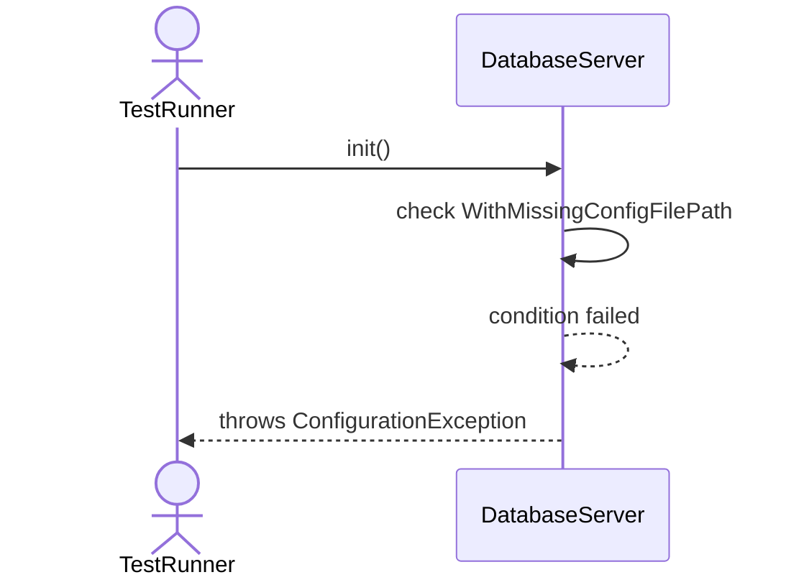
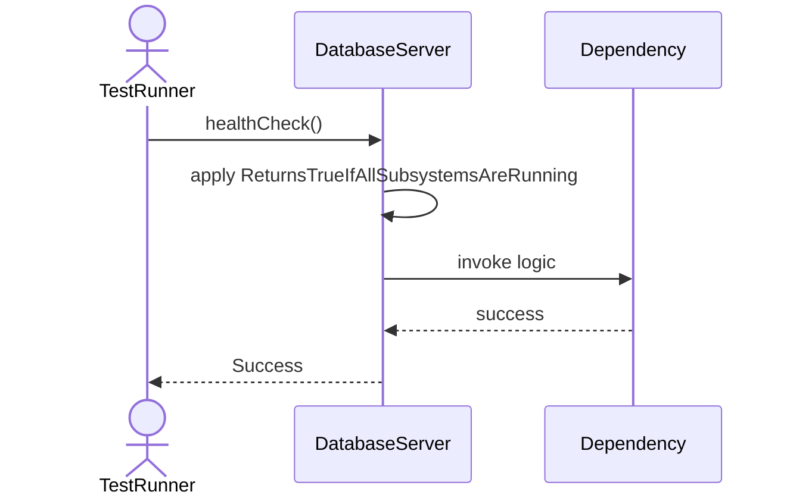

# Sequence Diagrams: DatabaseServer

## 🆕 Added Properties & Methods for `DatabaseServer`
To support the detailed sequence logic for unit testing, please update the `DatabaseServer` class in your Class Diagram with the following properties and methods:

- **Property** added to `DatabaseServer`: `config (Configuration)`
- **Property** added to `DatabaseServer`: `connectionManager`
- **Property** added to `DatabaseServer`: `databaseManager`
- **Property** added to `DatabaseServer`: `catalogManager`
- **Method** added to `DatabaseServer`: `healthCheck()`
- **Method** added to `DatabaseServer`: `restart()`
- **Method** added to `DatabaseServer`: `status()`

---

This file contains the detailed sequence diagrams for all 10 unit tests of the **DatabaseServer** class.

## 1. Start_WhenConfigValid_InitializesAllSubsystems

## 2. Start_WhenAlreadyRunning_ThrowsIllegalStateException

## 3. Stop_WhenRunning_ShutsDownGracefully

## 4. Stop_WhenAlreadyStopped_DoesNothing

## 5. Status_ReturnsCurrentOperationalState

## 6. Start_WhenPortAlreadyInUse_ThrowsBindException

## 7. Stop_WhenActiveTransactionsExist_WaitsForCompletionOrTimeout

## 8. Restart_GracefullyStopsAndStartsSystem

## 9. Init_WithMissingConfigFilePath_ThrowsConfigurationException

## 10. HealthCheck_ReturnsTrueIfAllSubsystemsAreRunning

