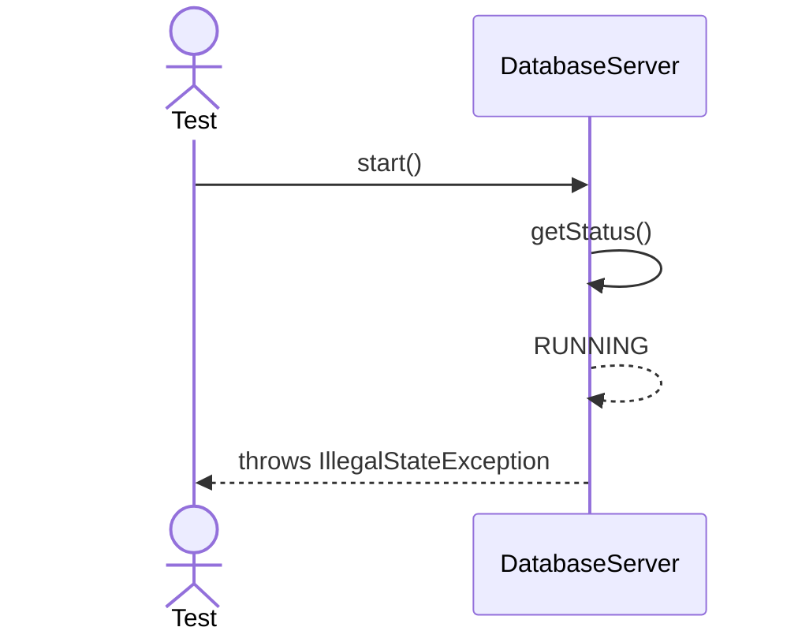
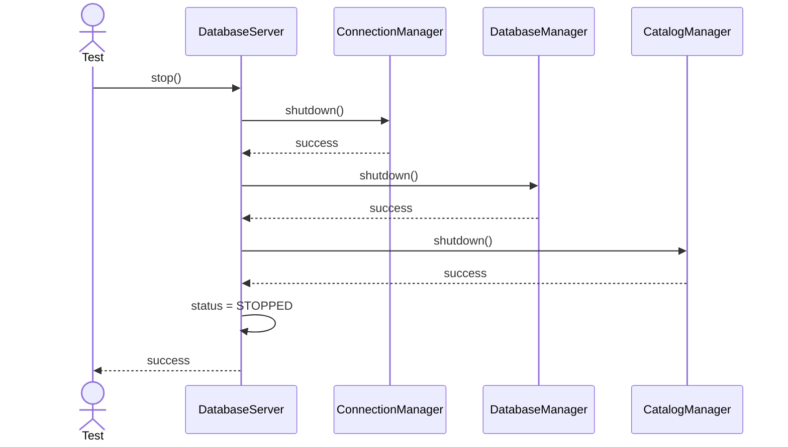
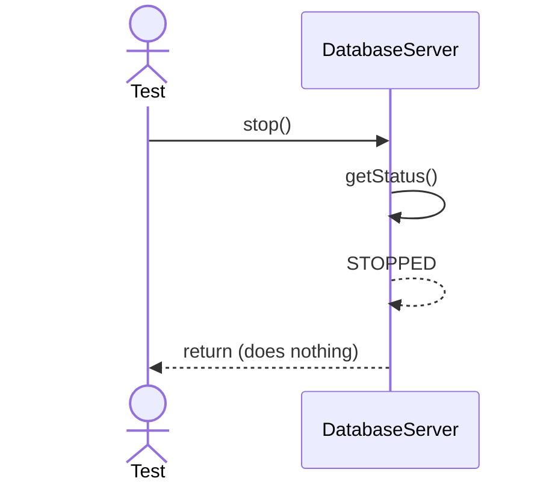
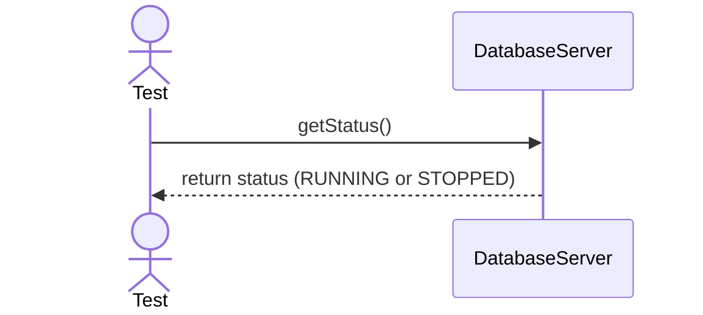

# Sequence Diagrams: DatabaseServer

## 🆕 Added Properties & Methods for `DatabaseServer`
To support the detailed sequence logic for unit testing, the following missing properties/methods have been introduced. **Please update the `DatabaseServer` class in your Class Diagram with these:**

- **Property** added to `DatabaseServer`: `config` (Configuration object passed during start)
- **Property** added to `DatabaseServer`: `connectionManager`, `databaseManager`, `catalogManager` (References to subsystem instances)
- **Method** added to `DatabaseServer`: `getStatus()` (Returns the current operational status)

---

This file contains the detailed sequence diagrams for all unit tests of the **DatabaseServer** class in the Core Server & Connections subsystem.

## 1. Start_WhenConfigValid_InitializesAllSubsystems

## 2. Start_WhenAlreadyRunning_ThrowsIllegalStateException

## 3. Stop_WhenRunning_ShutsDownGracefully

## 4. Stop_WhenAlreadyStopped_DoesNothing

## 5. Status_ReturnsCurrentOperationalState

