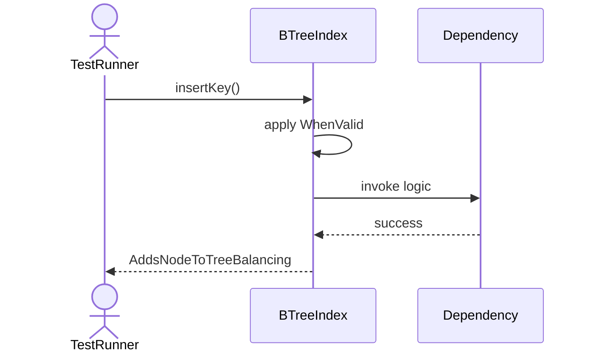
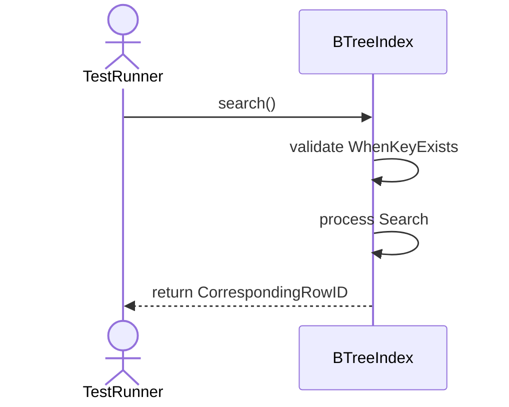
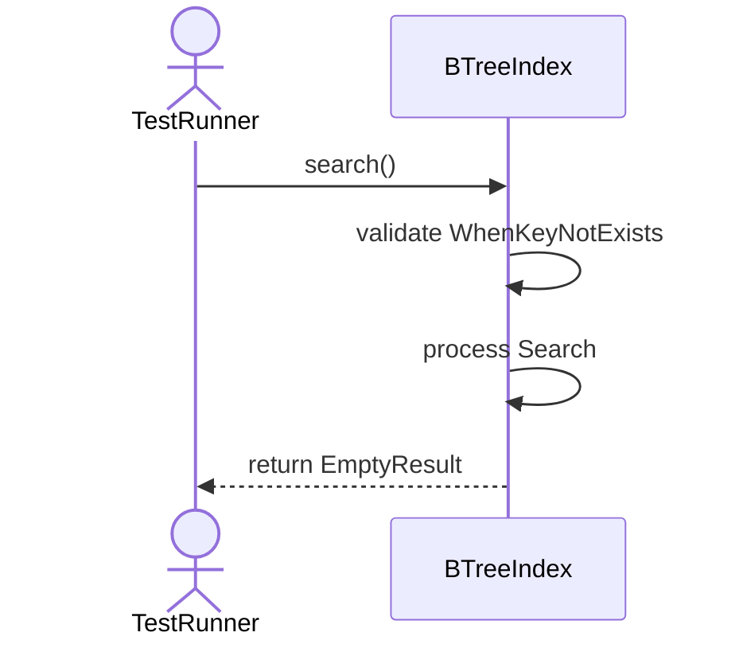
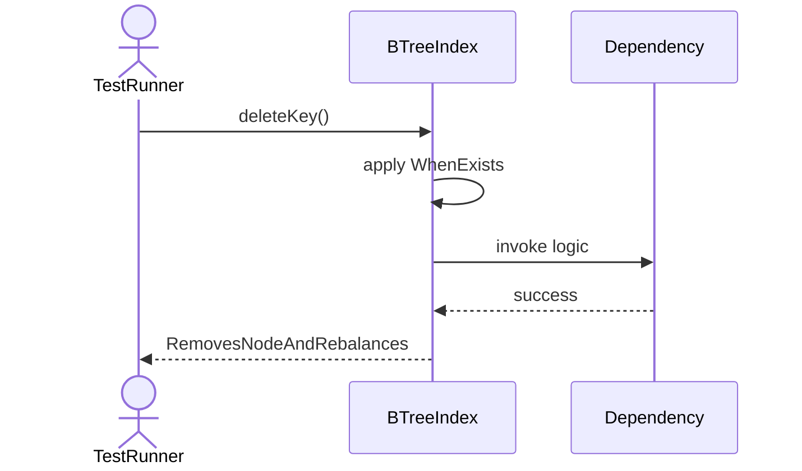
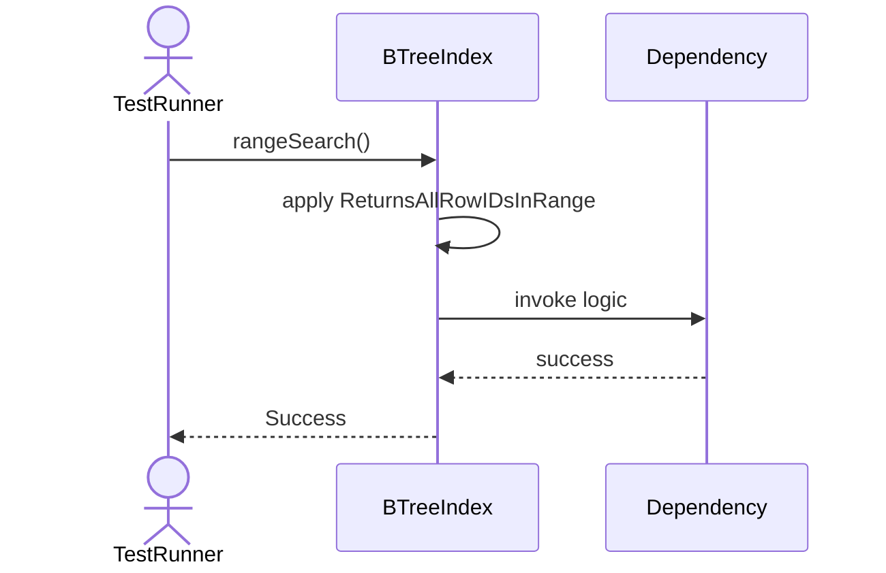
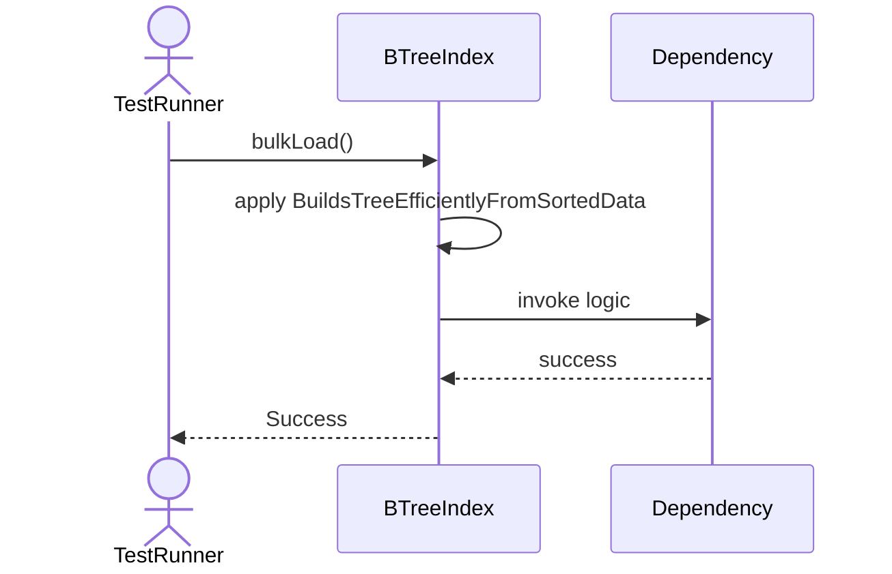
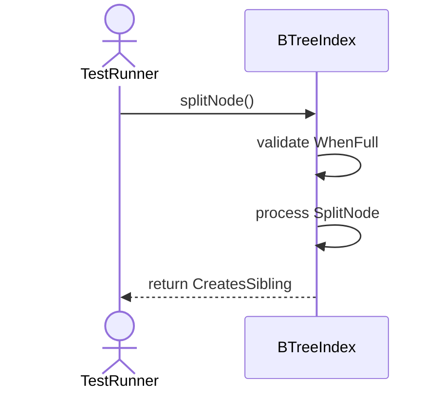
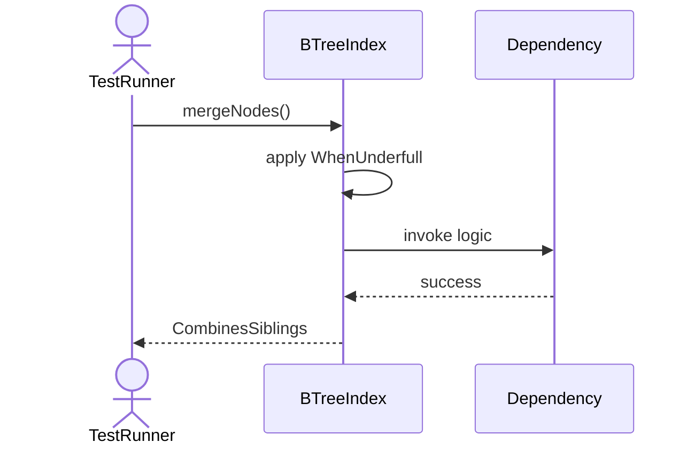

# Sequence Diagrams: BTreeIndex

## 🆕 Added Properties & Methods for `BTreeIndex`
To support the detailed sequence logic for unit testing, please update the `BTreeIndex` class in your Class Diagram with the following properties and methods:

- **Property** added to `BTreeIndex`: `rootNode`
- **Method** added to `BTreeIndex`: `bulkLoad()`
- **Method** added to `BTreeIndex`: `deleteKey()`
- **Method** added to `BTreeIndex`: `insertKey()`
- **Method** added to `BTreeIndex`: `mergeNodes()`
- **Method** added to `BTreeIndex`: `rangeSearch()`
- **Method** added to `BTreeIndex`: `search()`
- **Method** added to `BTreeIndex`: `splitNode()`

---

This file contains the detailed sequence diagrams for all 8 unit tests of the **BTreeIndex** class.

## 1. InsertKey_WhenValid_AddsNodeToTreeBalancing

## 2. Search_WhenKeyExists_ReturnsCorrespondingRowID

## 3. Search_WhenKeyNotExists_ReturnsEmptyResult

## 4. DeleteKey_WhenExists_RemovesNodeAndRebalances

## 5. RangeSearch_ReturnsAllRowIDsInRange

## 6. BulkLoad_BuildsTreeEfficientlyFromSortedData

## 7. SplitNode_WhenFull_CreatesSibling

## 8. MergeNodes_WhenUnderfull_CombinesSiblings

