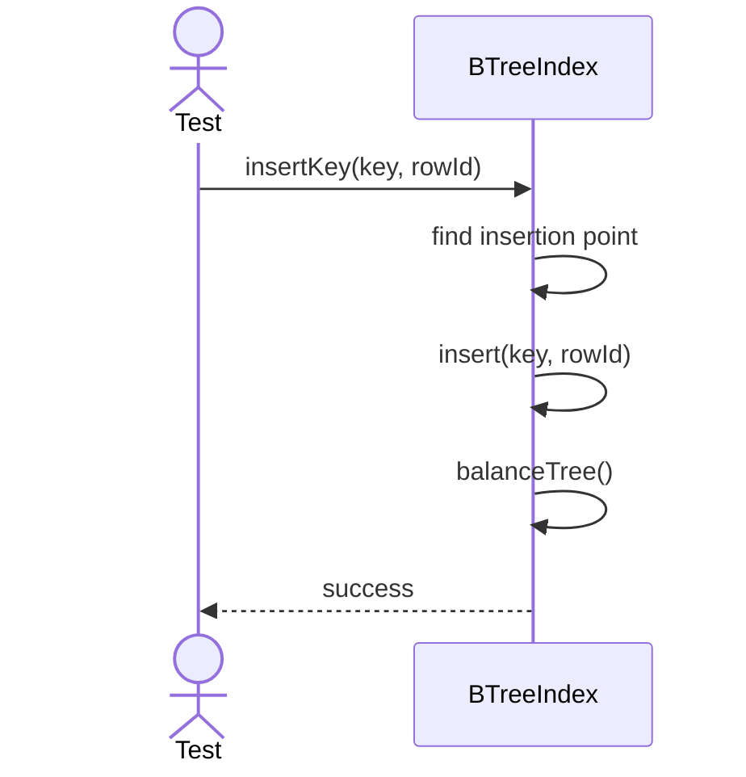
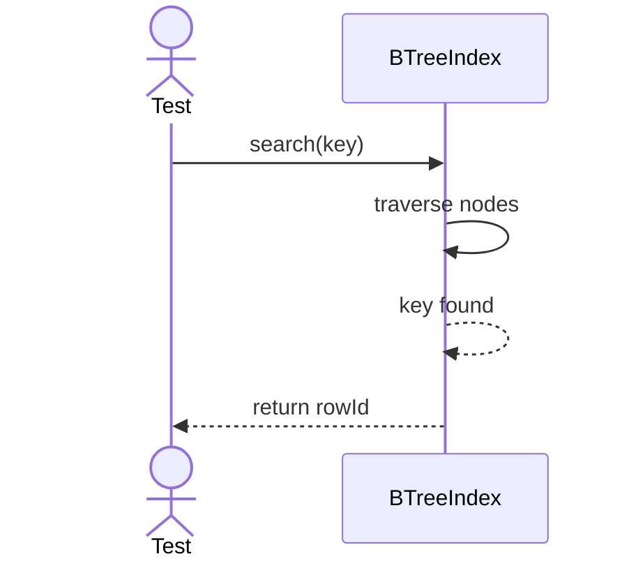

# Sequence Diagrams: BTreeIndex

## 🆕 Added Properties & Methods for `BTreeIndex`
To support the detailed sequence logic for unit testing, the following missing properties/methods have been introduced. **Please update the `BTreeIndex` class in your Class Diagram with these:**

- **Property** added to `BTreeIndex`: `rootNode` (Entry point for B-Tree)
- **Method** added to `BTreeIndex`: `balanceTree()` (Rebalances tree after insertion)

---

This file contains the detailed sequence diagrams for all unit tests of the **BTreeIndex** class in the Database Object Management subsystem.

## 1. InsertKey_WhenValid_AddsNodeToTreeBalancing

## 2. Search_WhenKeyExists_ReturnsCorrespondingRowID

## 3. Search_WhenKeyNotExists_ReturnsEmptyResult

