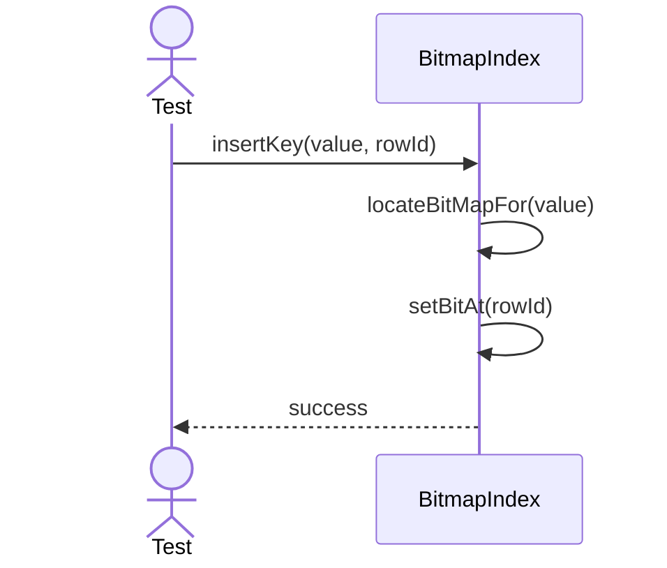
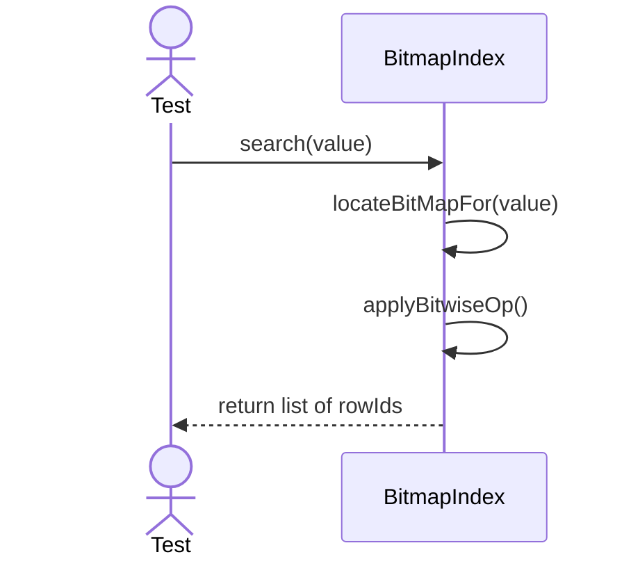

# Sequence Diagrams: BitmapIndex

## 🆕 Added Properties & Methods for `BitmapIndex`
To support the detailed sequence logic for unit testing, the following missing properties/methods have been introduced. **Please update the `BitmapIndex` class in your Class Diagram with these:**

- **Property** added to `BitmapIndex`: `bitmaps` (Dictionary of bit arrays for distinct values)
- **Method** added to `BitmapIndex`: `applyBitwiseOp(val)` (Resolves row IDs quickly)

---

This file contains the detailed sequence diagrams for all unit tests of the **BitmapIndex** class in the Database Object Management subsystem.

## 1. InsertKey_UpdatesBitmapBitsForGivenValue

## 2. Search_WhenKeyExists_UsesBitwiseOperationsToFindRID

