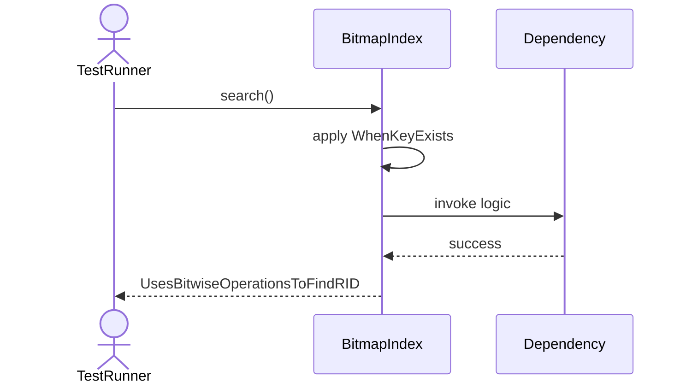
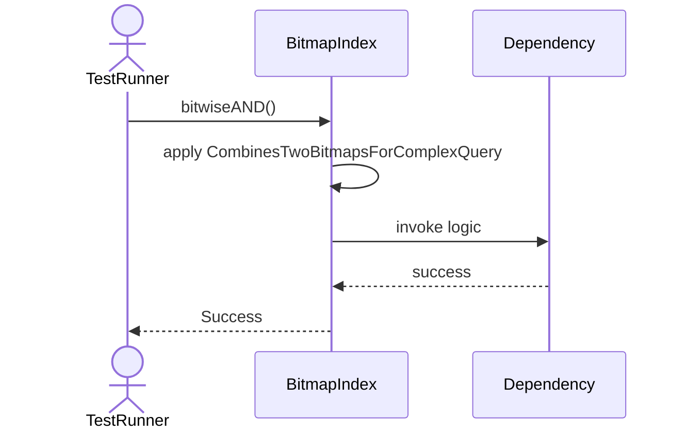
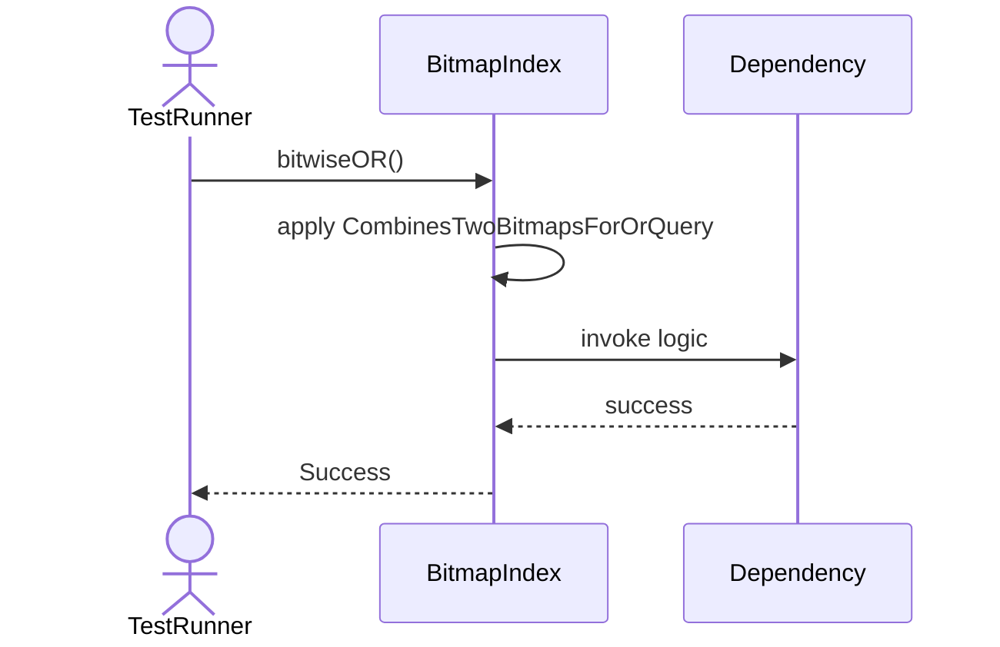
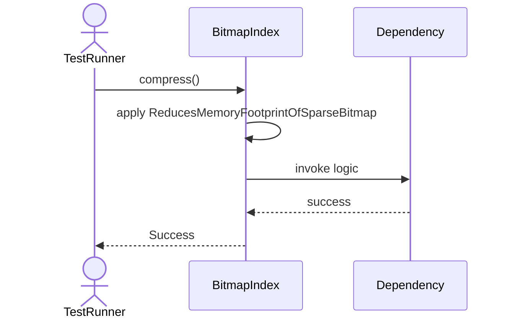
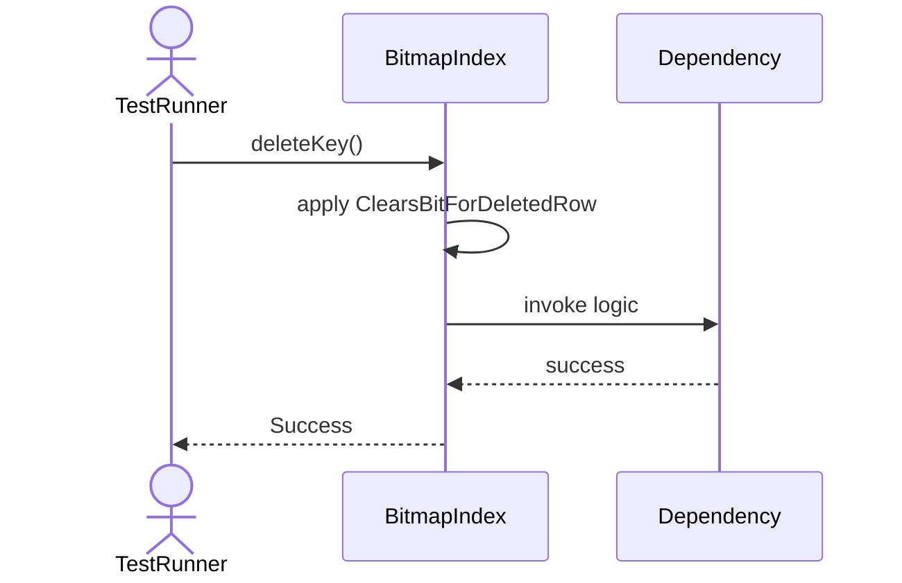

# Sequence Diagrams: BitmapIndex

## 🆕 Added Properties & Methods for `BitmapIndex`
To support the detailed sequence logic for unit testing, please update the `BitmapIndex` class in your Class Diagram with the following properties and methods:

- **Property** added to `BitmapIndex`: `bitmaps (Dict)`
- **Method** added to `BitmapIndex`: `bitwiseAND()`
- **Method** added to `BitmapIndex`: `bitwiseOR()`
- **Method** added to `BitmapIndex`: `compress()`
- **Method** added to `BitmapIndex`: `deleteKey()`
- **Method** added to `BitmapIndex`: `insertKey()`
- **Method** added to `BitmapIndex`: `search()`

---

This file contains the detailed sequence diagrams for all 6 unit tests of the **BitmapIndex** class.

## 1. InsertKey_UpdatesBitmapBitsForGivenValue

## 2. Search_WhenKeyExists_UsesBitwiseOperationsToFindRID

## 3. BitwiseAND_CombinesTwoBitmapsForComplexQuery

## 4. BitwiseOR_CombinesTwoBitmapsForOrQuery

## 5. Compress_ReducesMemoryFootprintOfSparseBitmap

## 6. DeleteKey_ClearsBitForDeletedRow

