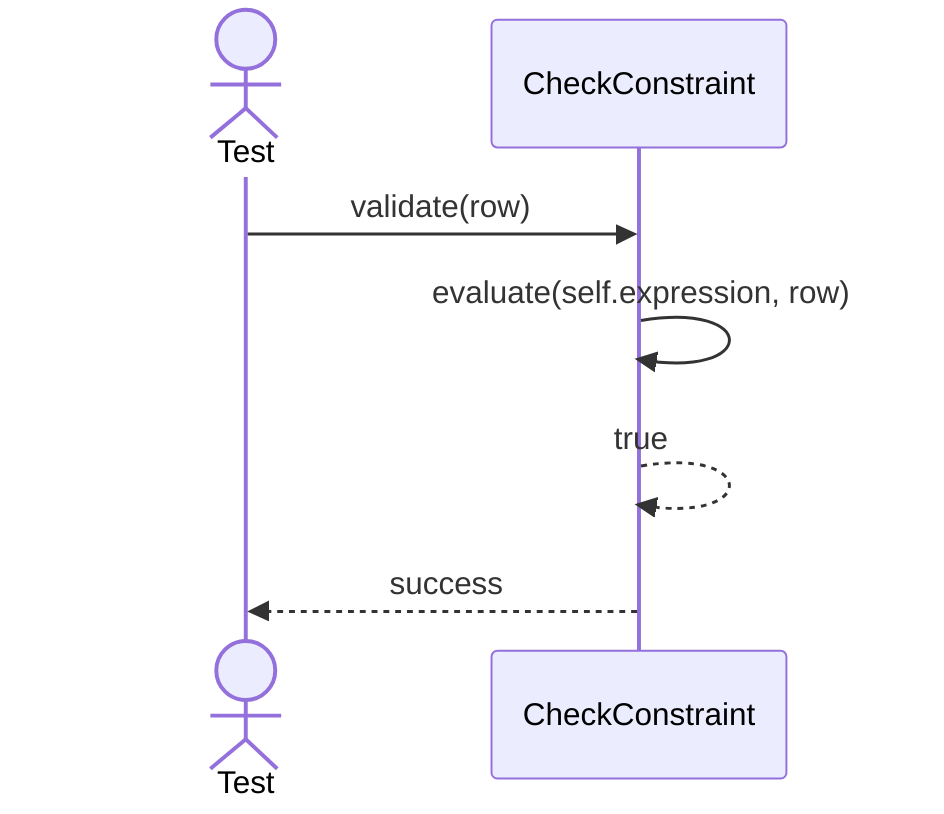
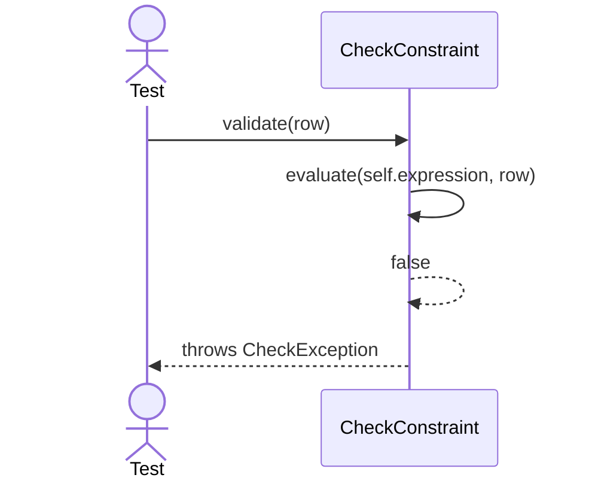

# Sequence Diagrams: CheckConstraint

## 🆕 Added Properties & Methods for `CheckConstraint`
To support the detailed sequence logic for unit testing, the following missing properties/methods have been introduced. **Please update the `CheckConstraint` class in your Class Diagram with these:**

- **Property** added to `CheckConstraint`: `expression` (The boolean logic to check)
- **Method** added to `CheckConstraint`: `evaluate(row)` (Evaluates expression against row data)

---

This file contains the detailed sequence diagrams for all unit tests of the **CheckConstraint** class in the Database Object Management subsystem.

## 1. Validate_WhenExpressionEvaluatesToTrue_Succeeds

## 2. Validate_WhenExpressionEvaluatesToFalse_ThrowsCheckException

