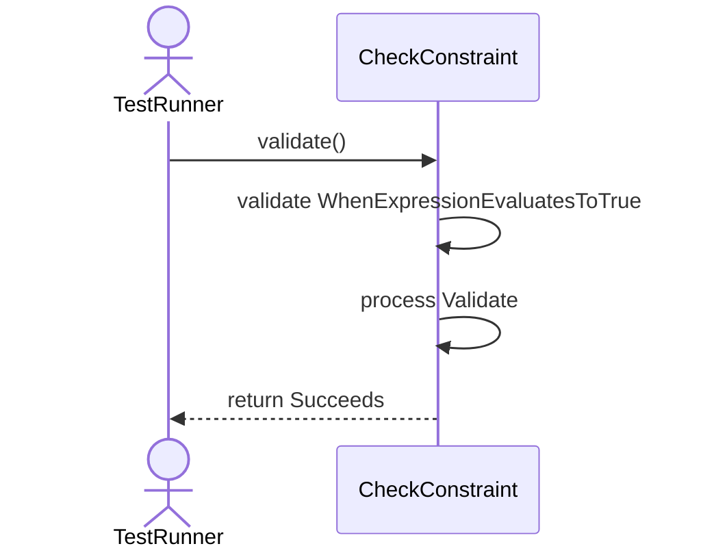
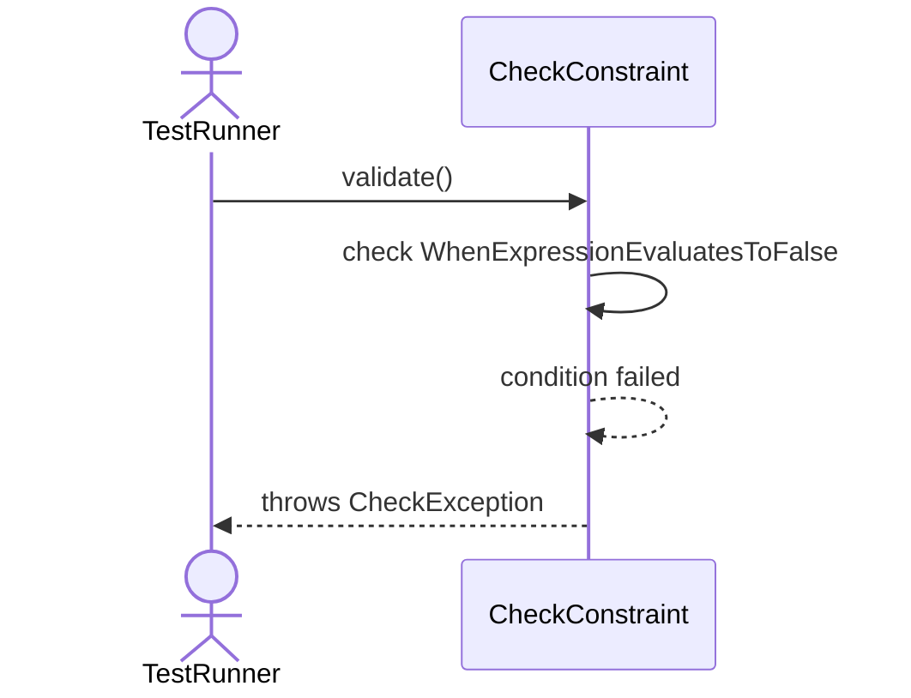
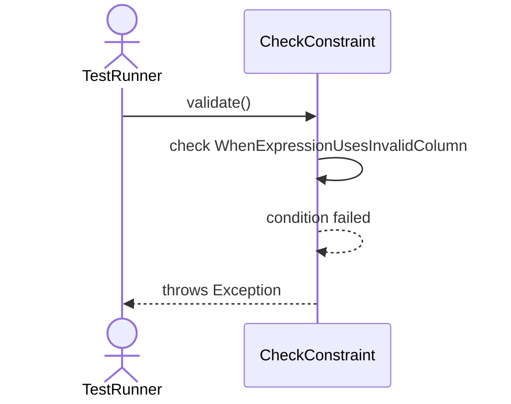

# Sequence Diagrams: CheckConstraint

## 🆕 Added Properties & Methods for `CheckConstraint`
To support the detailed sequence logic for unit testing, please update the `CheckConstraint` class in your Class Diagram with the following properties and methods:

- **Property** added to `CheckConstraint`: `expression (String)`
- **Method** added to `CheckConstraint`: `validate()`

---

This file contains the detailed sequence diagrams for all 3 unit tests of the **CheckConstraint** class.

## 1. Validate_WhenExpressionEvaluatesToTrue_Succeeds

## 2. Validate_WhenExpressionEvaluatesToFalse_ThrowsCheckException

## 3. Validate_WhenExpressionUsesInvalidColumn_ThrowsException

