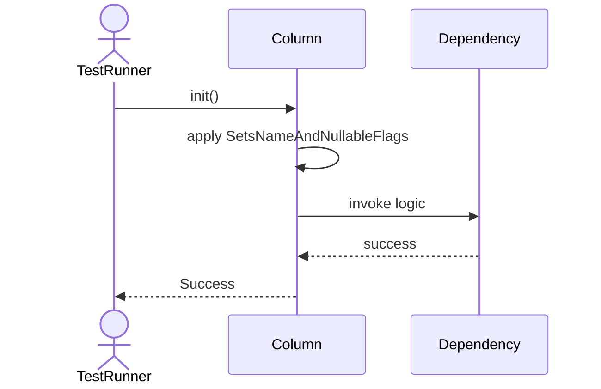
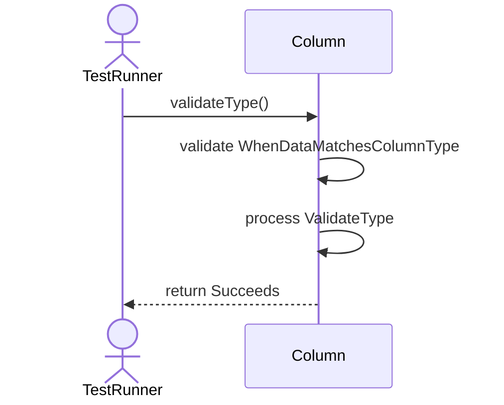
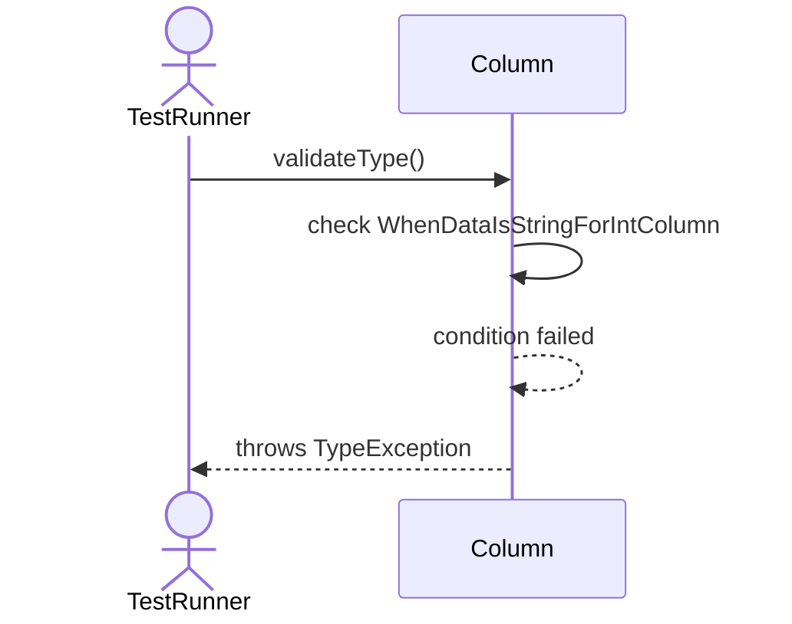
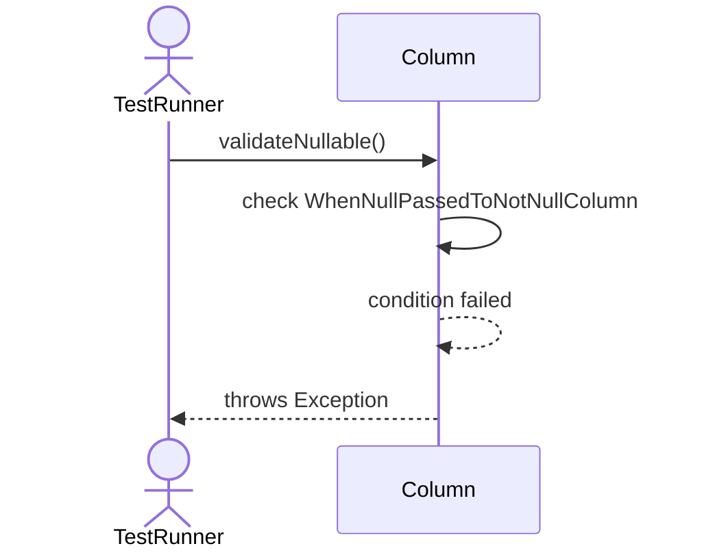
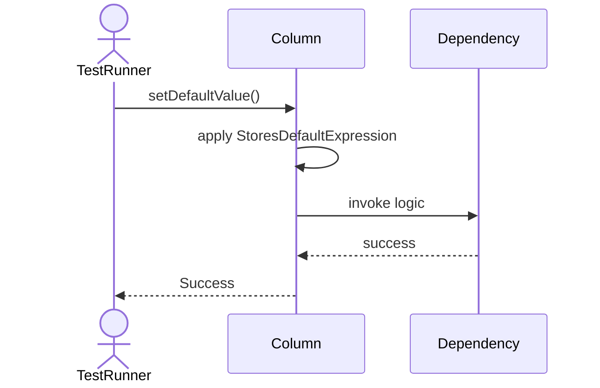
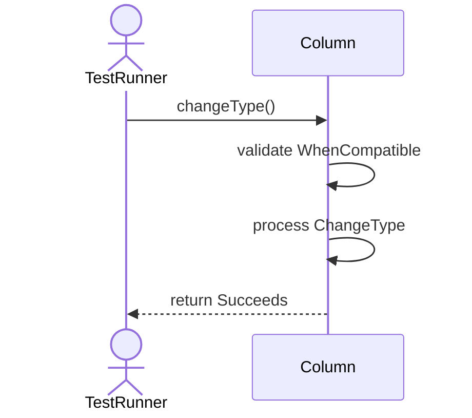
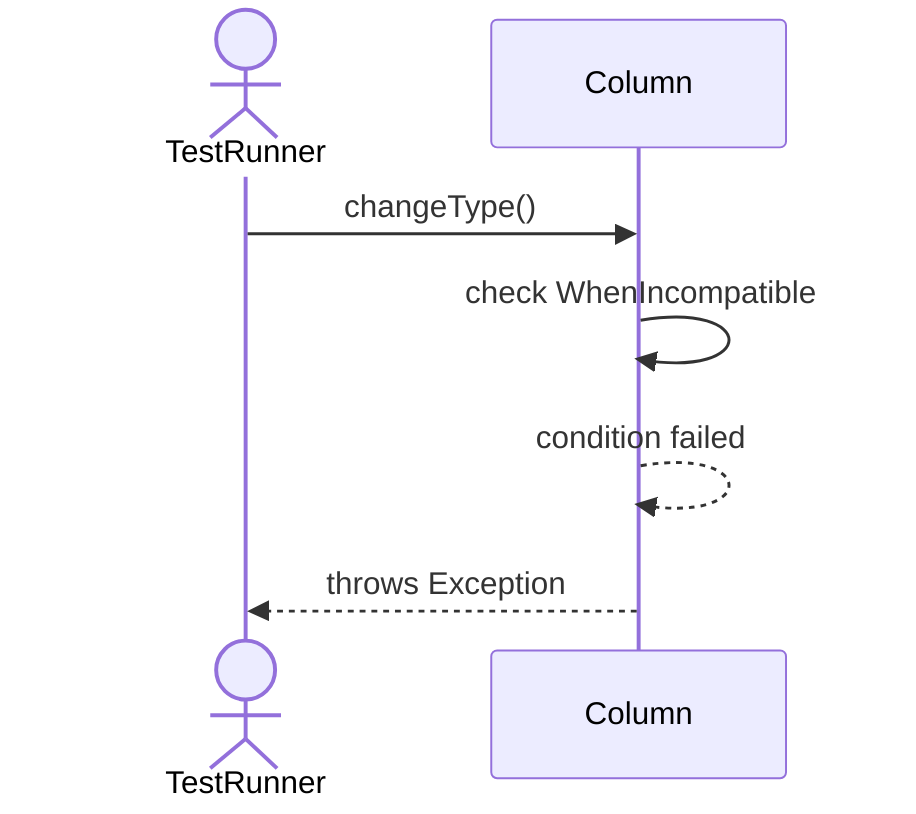

# Sequence Diagrams: Column

## 🆕 Added Properties & Methods for `Column`
To support the detailed sequence logic for unit testing, please update the `Column` class in your Class Diagram with the following properties and methods:

- **Property** added to `Column`: `dataType`
- **Property** added to `Column`: `isNullable (Bool)`
- **Property** added to `Column`: `defaultValue`
- **Method** added to `Column`: `changeType()`
- **Method** added to `Column`: `setDefaultValue()`
- **Method** added to `Column`: `validateNullable()`
- **Method** added to `Column`: `validateType()`

---

This file contains the detailed sequence diagrams for all 7 unit tests of the **Column** class.

## 1. Init_SetsNameAndNullableFlags

## 2. ValidateType_WhenDataMatchesColumnType_Succeeds

## 3. ValidateType_WhenDataIsStringForIntColumn_ThrowsTypeException

## 4. ValidateNullable_WhenNullPassedToNotNullColumn_ThrowsException

## 5. SetDefaultValue_StoresDefaultExpression

## 6. ChangeType_WhenCompatible_Succeeds

## 7. ChangeType_WhenIncompatible_ThrowsException

