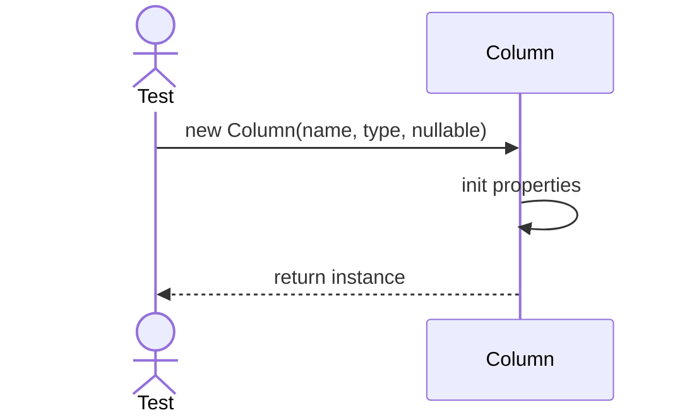
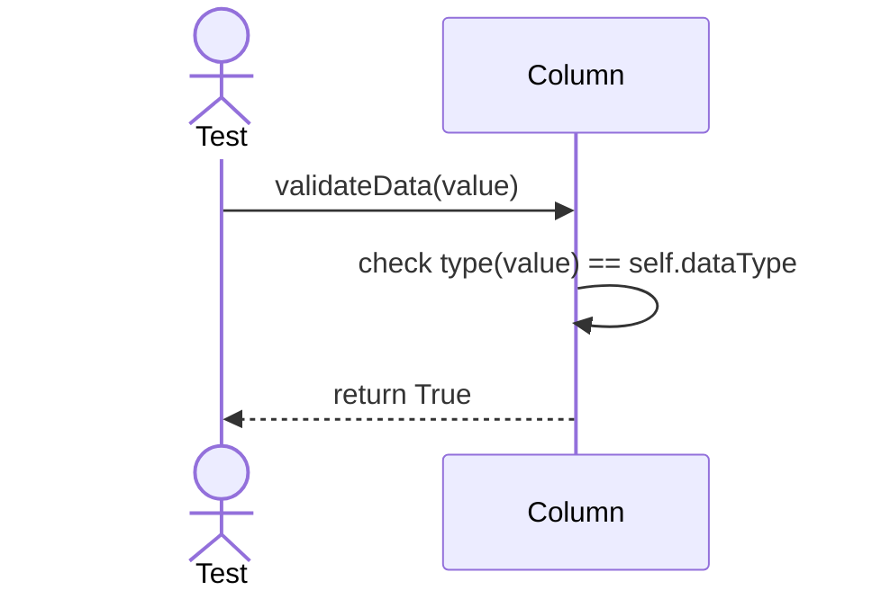

# Sequence Diagrams: Column

## 🆕 Added Properties & Methods for `Column`
To support the detailed sequence logic for unit testing, the following missing properties/methods have been introduced. **Please update the `Column` class in your Class Diagram with these:**

- **Property** added to `Column`: `dataType`, `isNullable`
- **Method** added to `Column`: `validateData(value)` (Checks type matching)

---

This file contains the detailed sequence diagrams for all unit tests of the **Column** class in the Database Object Management subsystem.

## 1. Init_SetsNameAndNullableFlags

## 2. ValidateType_WhenDataMatchesColumnType_Succeeds

