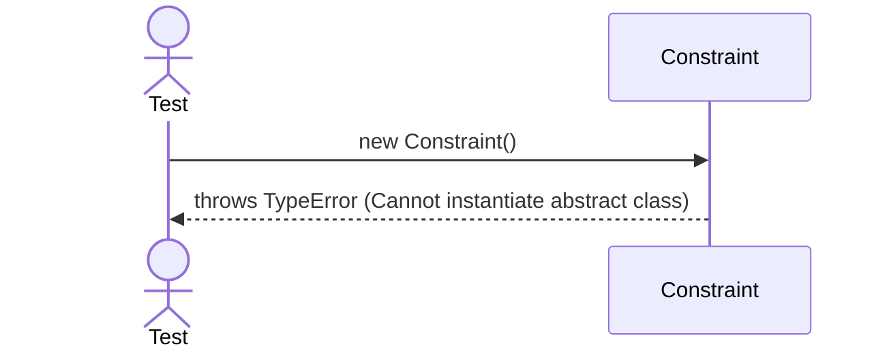

# Sequence Diagrams: Constraint

This file contains the detailed sequence diagrams for all unit tests of the **Constraint** class in the Database Object Management subsystem.

## 1. Instantiation_OfAbstractClass_FailsWithTypeError

