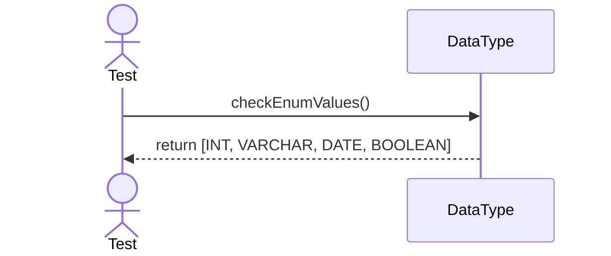
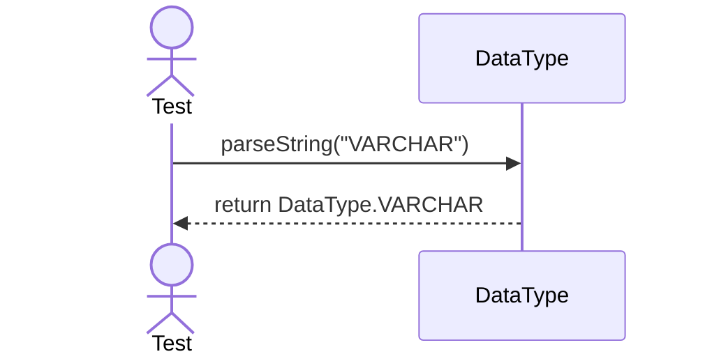

# Sequence Diagrams: DataType

This file contains the detailed sequence diagrams for all unit tests of the **DataType** class in the Database Object Management subsystem.

## 1. EnumValues_IncludeIntVarcharDateBoolean

## 2. ParseString_WhenValidFormat_ReturnsDataTypeInstance

