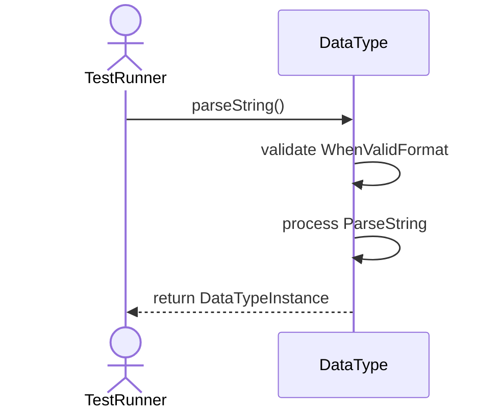
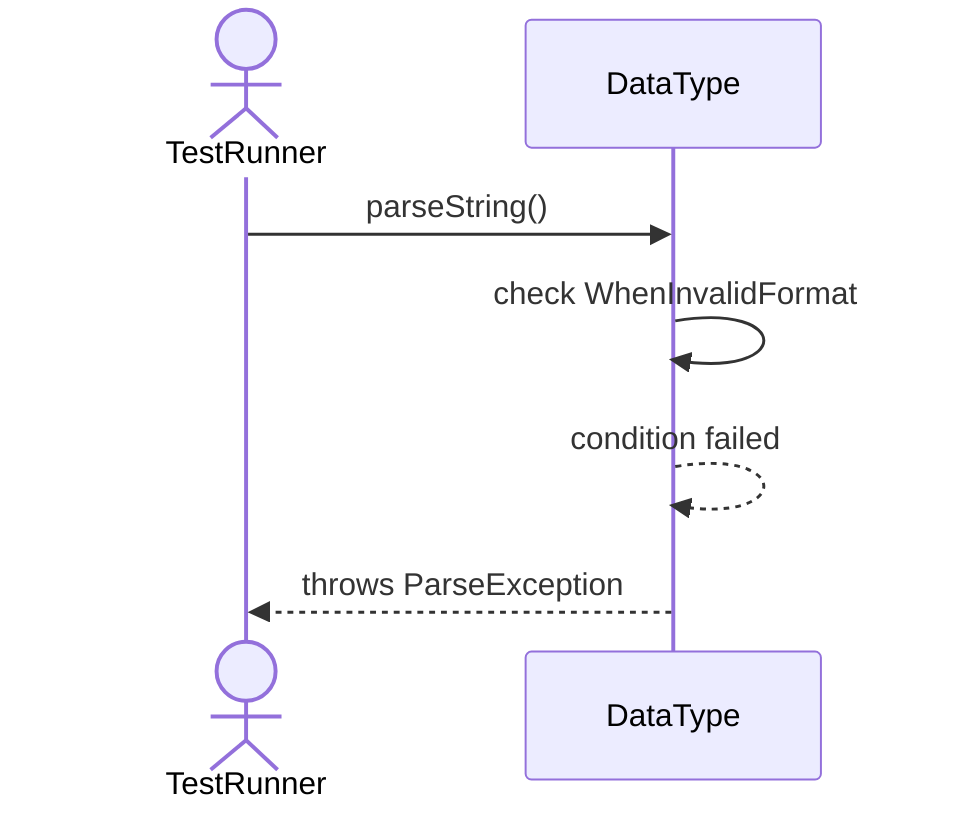
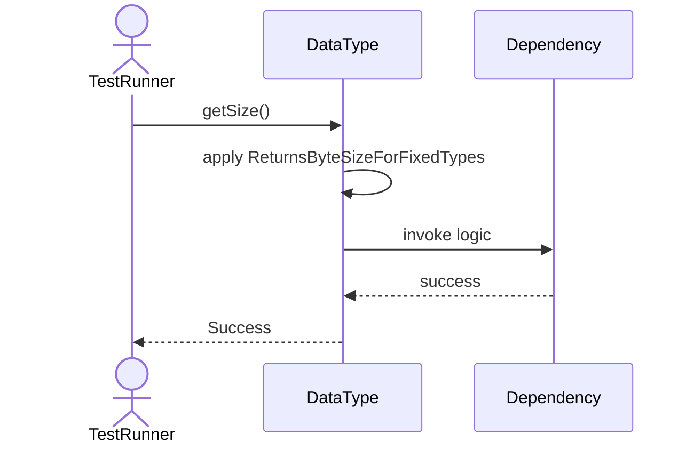
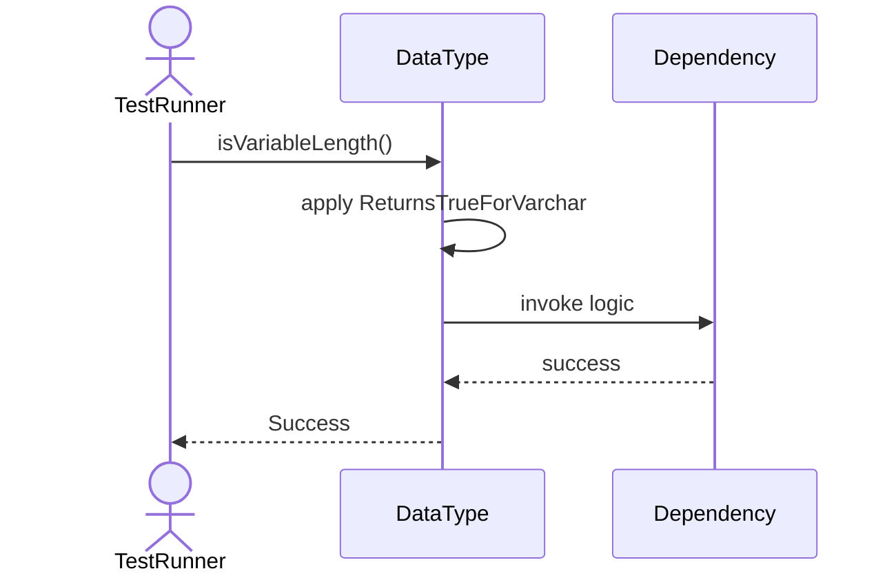

# Sequence Diagrams: DataType

## 🆕 Added Properties & Methods for `DataType`
To support the detailed sequence logic for unit testing, please update the `DataType` class in your Class Diagram with the following properties and methods:

- **Method** added to `DataType`: `getSize()`
- **Method** added to `DataType`: `isVariableLength()`
- **Method** added to `DataType`: `parseString()`

---

This file contains the detailed sequence diagrams for all 5 unit tests of the **DataType** class.

## 1. EnumValues_IncludeIntVarcharDateBoolean

## 2. ParseString_WhenValidFormat_ReturnsDataTypeInstance

## 3. ParseString_WhenInvalidFormat_ThrowsParseException

## 4. GetSize_ReturnsByteSizeForFixedTypes

## 5. IsVariableLength_ReturnsTrueForVarchar

